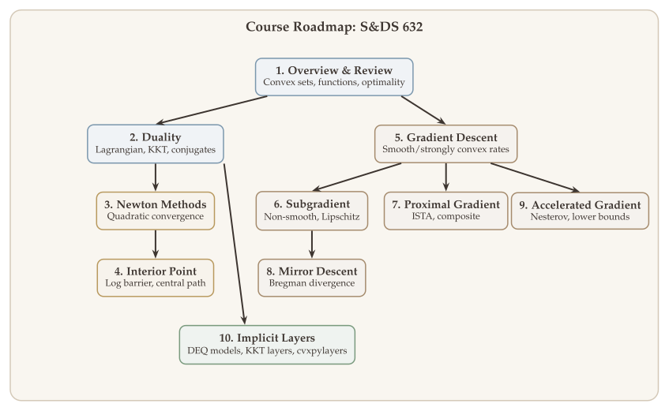

## Welcome {.unnumbered}

Optimization is the mathematical backbone of modern machine learning, statistics, and engineering. Building on the foundations laid in [S&DS 431/631](https://zhuoranyang.github.io/sds431-notes/) --- convex sets, convex functions, gradient descent, and linear programming --- this course goes deeper: we develop duality theory, second-order methods with polynomial-time guarantees, and the full suite of modern first-order algorithms --- proximal gradient, mirror descent, and Nesterov acceleration --- each analyzed with tight convergence rates.

These interactive lecture notes build a rigorous and unified treatment of advanced optimization, connecting classical theory (KKT conditions, interior point methods) to contemporary applications (implicit differentiation through fixed points, differentiable optimization layers). Each chapter includes formal theorems with complete proofs, interactive visualizations for geometric intuition, and companion Jupyter notebooks for hands-on experimentation.

## Motivation {.unnumbered}

### Gradient Descent Review {.unnumbered}

The simplest optimization algorithm for $\min_x f(x)$ is **gradient descent**:

$$
x^{t+1} = x^t - \alpha^t \cdot \nabla f(x^t).
$$

What we showed in S&DS 431/631 when $f$ is smooth ($\nabla f$ is Lipschitz):

::: {#thm-convergence-gd}
## Convergence Rates of Gradient Descent (S&DS 431/631)

For $L$-smooth functions with step size $\alpha = 1/L$, gradient descent achieves the following rates depending on the curvature of $f$:

- **$f$ nonconvex:**
  $$
  \frac{1}{T} \sum_{t=1}^{T} \|\nabla f(x^t)\|^2 = O\!\left(\frac{1}{T}\right).
  $$
- **$f$ convex:**
  $$
  f(x^T) - \min_x f(x) = O\!\left(\frac{1}{T}\right).
  $$
- **$f$ strongly convex:**
  $$
  \begin{aligned}
  \|x^T - x^*\|_2 &= O\!\left(\exp(-T/\kappa)\right), \\
  f(x^T) - f(x^*) &= O\!\left(\exp(-T/\kappa)\right),
  \end{aligned}
  $$
  where $x^* = \arg\min_x f(x)$ and $\kappa$ is the condition number of $f$.
:::

These results are powerful, but they assume the objective is smooth and unconstrained. The motivating questions below highlight the gaps that this course will fill.

### Key Questions {.unnumbered}

::: {.callout-tip}
## Question 1 --- How do we optimize functions that are not differentiable?

Gradient descent relies on $\nabla f$, but many important objectives are not smooth. The Lasso penalty $\|x\|_1$, the hinge loss in SVMs, and total-variation regularizers all introduce points where the gradient does not exist. How should we proceed when the basic tool --- the gradient --- is unavailable?

We develop three complementary strategies. **Subgradient methods** ([Chapter 6](lectures/06-subgradient.qmd)) replace the gradient with a generalized notion of slope that exists for any convex function. **Proximal gradient methods** ([Chapter 7](lectures/07-proximal-gradient.qmd)) exploit separable structure --- when $f = g + h$ with $g$ smooth and $h$ nonsmooth but "simple" --- to handle each part with the right tool. **Smoothing techniques** approximate a nonsmooth objective by a smooth surrogate and apply standard gradient methods.
:::

::: {.callout-tip}
## Question 2 --- How do we handle constraints on the decision variable?

In many applications the variable must lie in a feasible set $\Omega$: we solve $\min_{x \in \Omega} f(x)$. An unconstrained gradient step may leave the feasible region, so we need algorithms that respect the geometry of $\Omega$.

**Projected gradient descent** ([Chapter 5b](lectures/05b-projected-gradient-descent.qmd)) takes a gradient step and then projects back onto $\Omega$. This is simple and effective when the projection is cheap (e.g., onto a box or a ball). **Mirror descent** ([Chapter 8](lectures/08-mirror-descent.qmd)) goes further by replacing the Euclidean distance with a Bregman divergence tailored to $\Omega$, yielding dramatically better rates on structured sets like the simplex.
:::

::: {.callout-tip}
## Question 3 --- How do we scale optimization across multiple machines?

Modern datasets are often distributed across $N$ machines, each holding its own local function $f_i$. The global objective is $f(x) = \frac{1}{N}\sum_{i=1}^N f_i(x)$, but no single machine has access to all the data. How can we solve this problem without centralizing the dataset?

A natural reformulation gives each machine its own copy of the variable and enforces consensus via equality constraints:
$$
\min_{x_1,\ldots,x_N} \frac{1}{N}\sum_{i=1}^N f_i(x_i) \quad \text{s.t.} \quad x_1 = x_2 = \cdots = x_N.
$$
The equality constraints couple the machines, and **Lagrangian duality** ([Chapter 2](lectures/02-lagrange-duality.qmd)) provides the framework --- via ADMM and dual decomposition --- for solving such problems in a decentralized fashion.
:::

::: {.callout-tip}
## Question 4 --- What if evaluating the full gradient is too expensive?

When the objective sums over a large dataset of $n$ examples,
$$
f(\theta) = \sum_{i=1}^n \ell\!\left(f_\theta(x_i),\, y_i\right),
$$
computing the full gradient $\nabla f(\theta)$ requires a pass over all $n$ data points --- prohibitive when $n$ is in the millions or billions. Can we make progress with only partial gradient information?

**(Mini-batch) stochastic gradient descent** replaces the full gradient with an unbiased estimate computed from a small random subset. Each step is much cheaper, and the noise averages out over iterations, giving convergence guarantees that scale gracefully with dataset size.
:::

## Course Flow {.unnumbered}

The course develops four main themes, each addressing one or more of the questions above:

1. **Duality theory** (Chapters 2--3) --- Lagrangian relaxation, KKT conditions, conjugate functions, and the duality between smoothness and strong convexity. Provides the theoretical backbone for Question 3 and the convergence analysis throughout.
2. **Second-order methods** (Chapters 4--5) --- Newton's method with quadratic convergence, and interior point methods with polynomial-time guarantees for LP, SOCP, and SDP.
3. **Advanced first-order methods** (Chapters 6--10) --- Gradient descent, subgradient methods, proximal gradient (ISTA/FISTA), mirror descent with Bregman divergences, and Nesterov's accelerated gradient with matching lower bounds. Directly addresses Questions 1, 2, and 4.
4. **Deep learning connections** (Chapter 11) --- Implicit differentiation through fixed points and KKT conditions, differentiable optimization layers, and deep equilibrium models.

{#fig-course-flow}

## Course Overview {.unnumbered}

### Part I: Preliminaries

- **[Review of Convex Optimization](lectures/01-review.qmd)** --- We consolidate the prerequisite material from S&DS 431/631: convex sets, convex functions, separation theorems, operations preserving convexity, and the standard form of convex optimization.

### Part II: Duality

- **[Lagrange Duality](lectures/02-lagrange-duality.qmd)** --- The Lagrangian framework constructs lower bounds on the optimal value via dual variables. We develop weak and strong duality, Slater's condition, the geometric interpretation via supporting hyperplanes, and the KKT conditions that characterize optimal primal--dual pairs.

- **[Dual Conjugacy](lectures/02b-dual-conjugacy.qmd)** --- The convex conjugate $f^*(y) = \sup_x \{y^\top x - f(x)\}$ provides a dual representation of any function. We use conjugates to re-derive Lagrange duality, establish the beautiful duality between smoothness and strong convexity, and prove strong duality under Slater's condition.

### Part III: Second-Order Methods

- **[Newton Methods](lectures/03-newton-methods.qmd)** --- What happens when we use curvature, not just the gradient? Newton's method achieves quadratic convergence near the optimum by solving a linear system at each step. We study the affine-invariant Newton decrement, backtracking line search, and the damped-to-pure transition.

- **[Interior Point Methods](lectures/04-interior-point.qmd)** --- The method that proved LP is solvable in polynomial time *and* is practical. Log barrier functions, the central path, and Newton-based path-following give $O(\sqrt{m}\log(1/\varepsilon))$ iteration complexity for LP, SOCP, and SDP.

### Part IV: First-Order Methods

- **[Gradient Descent](lectures/05-gradient-descent.qmd)** --- The foundational algorithm: convergence rates for smooth convex ($O(1/k)$) and strongly convex ($O((1-\mu/L)^k)$) functions, the Polyak--Lojasiewicz condition, and the gap between first-order and second-order methods.

- **[Projected Gradient Descent](lectures/05b-projected-gradient-descent.qmd)** --- Extending gradient descent to constrained problems $\min_{x \in \Omega} f(x)$. We study the projection operator, convergence guarantees under smoothness and strong convexity, and practical considerations for sets where projection is efficient.

- **[Subgradient Methods](lectures/06-subgradient.qmd)** --- What if the function is not differentiable? Subgradients generalize gradients to non-smooth functions. We prove $O(1/\sqrt{k})$ convergence for Lipschitz objectives and show why non-smoothness fundamentally limits the rate.

- **[Proximal Gradient](lectures/07-proximal-gradient.qmd)** --- Many problems have the form "smooth + non-smooth" (e.g., least squares + $\ell_1$ penalty). The proximal gradient method exploits this structure: a gradient step on the smooth part, then a proximal step on the non-smooth part. ISTA, soft-thresholding for Lasso, and Moreau decomposition.

- **[Mirror Descent](lectures/08-mirror-descent.qmd)** --- Beyond Euclidean geometry. When the constraint set has special structure (like the probability simplex), Euclidean projections are wasteful. Mirror descent uses Bregman divergences to achieve dimension-free rates: $O(\sqrt{\log n / k})$ versus $O(\sqrt{n / k})$.

- **[Accelerated Gradient](lectures/09-accelerated-gradient.qmd)** --- Can first-order methods do better than $O(1/k)$? Nesterov's accelerated gradient achieves $O(1/k^2)$, and we prove this is *optimal* among all first-order methods via information-theoretic lower bounds. We also cover FISTA and adaptive restart strategies.

### Part V: Applications in Deep Learning

- **[Implicit Layers](lectures/11-implicit-layer.qmd)** --- What if a neural network layer is defined not by a formula but by a fixed-point or optimization problem? We develop implicit differentiation through KKT conditions, deep equilibrium models, and differentiable optimization layers --- connecting optimization theory directly to neural network design.

## Textbooks {.unnumbered}

These lecture notes are self-contained, but draw heavily on two excellent textbooks. We refer to them throughout as **[BV]** and **[Beck]**:

- **[BV]** — S. Boyd and L. Vandenberghe, [*Convex Optimization*](https://web.stanford.edu/~boyd/cvxbook/bv_cvxbook.pdf), Cambridge University Press, 2004. The standard reference for convex optimization theory: convex sets, duality, KKT conditions, Newton's method, and interior point methods. Chapters 2--5 cover the foundations; Chapters 9--11 cover the algorithms.

- **[Beck]** — A. Beck, [*First-Order Methods in Optimization*](https://doi.org/10.1137/1.9781611974997), SIAM, 2017. A comprehensive and rigorous treatment of proximal operators, subgradient methods, proximal gradient (ISTA/FISTA), mirror descent, and accelerated methods. Our Chapters 6--10 follow the development in Beck closely.

Additional references are cited in individual chapters where relevant.

## Acknowledgments {.unnumbered}

These lecture notes were developed for S&DS 432/632 at Yale University. The presentation draws heavily on two outstanding courses whose publicly available materials shaped much of the treatment here:

- **Yuxin Chen**, [*Large-Scale Optimization for Data Science*](https://yuxinchen2020.github.io/large_scale_optimization/index.html), University of Pennsylvania.
- **Lieven Vandenberghe**, [*EE 236C: Optimization Methods for Large-Scale Systems*](https://www.seas.ucla.edu/~vandenbe/ee236c.html), UCLA.

I am grateful to both for making their course materials publicly available; a significant portion of these lecture notes was informed by studying their presentations.

## Prerequisites {.unnumbered}

This course assumes familiarity with:

- Linear algebra (vector spaces, eigenvalues, matrix norms)
- Multivariable calculus (gradients, Hessians, Taylor expansions)
- Basic optimization (convex sets, convex functions, gradient descent fundamentals)
- Probability and statistics (for stochastic methods)

Students who have completed S&DS 431/631 or an equivalent course will have the necessary background.
