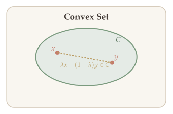
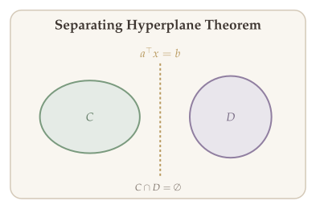
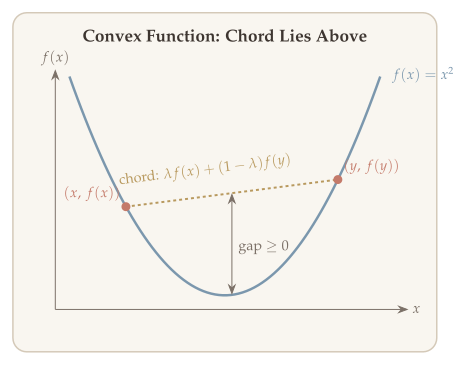
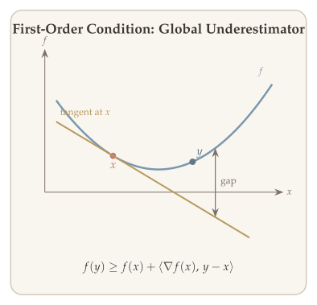
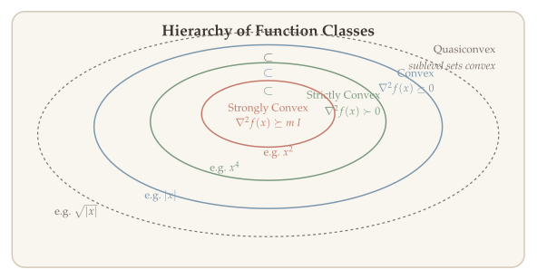
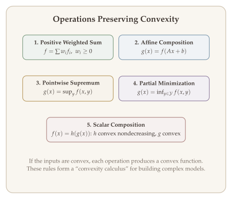
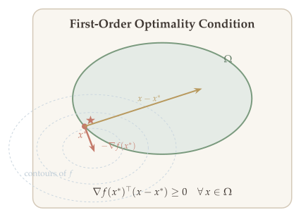

This chapter consolidates the prerequisite material from S&DS 431/631 that subsequent chapters build upon: convex sets, convex functions, operations preserving convexity, optimality conditions, and the notation for norms and dual norms used throughout the course.

::: {.callout-tip}
## Companion Notebook

A [Jupyter notebook](../notebooks/overview-svm-cvxpy.ipynb) accompanies this chapter with runnable Python implementations of SVM formulation and solution using CVXPY, gradient descent basics, and convex optimization examples.
:::

## Convex Sets {#sec-convex-sets}

A convex set is the most fundamental geometric object in optimization. Many algorithmic guarantees --- from the convergence of gradient descent to the existence of supporting hyperplanes --- rely on convexity of the underlying domain. We begin by recalling the definition and the key separation theorems.

::: {#def-convex-set}
## Convex Set

A set $C \subseteq \mathbb{R}^d$ is **convex** if and only if for all $x, y \in C$ and all $\lambda \in [0,1]$,

$$\lambda x + (1-\lambda)y \in C.$$

Geometrically, the line segment connecting any two points in $C$ lies entirely within $C$.
:::

{#fig-convex-set}

### Separating Hyperplane Theorems {#sec-separating-hyperplane}

When two convex sets do not overlap, we can always find a hyperplane that separates them. This result is the geometric backbone of duality theory and will be used extensively in the next chapter.

::: {#thm-separating-hyperplane}
## Separating Hyperplane Theorems

1. If $C, D$ are convex and $C \cap D = \emptyset$, then there exists a separating hyperplane that **weakly separates** $C$ and $D$.
2. If $C$ is compact and $D$ is closed, then there exists a **strict separation**.
:::

::: {.callout-tip}
## Remark: Compact Sets

Recall that a **compact set** is a set that is both closed and bounded.
:::

{#fig-separating-hyperplane}

## Convex Functions {#sec-convex-functions}

Convex functions are the natural class of objectives for which local information (gradients) yields global conclusions. Understanding their properties --- especially the first-order and second-order characterizations --- is essential for both algorithm design and convergence analysis.

::: {#def-convex-function}
## Convex Function

A function $f : D \to \mathbb{R}$ is **convex** if:

1. $D \subseteq \mathbb{R}^d$ is a convex set, and
2. For all $x, y \in D$ and all $\lambda \in [0,1]$,
   $$f\!\left(\lambda x + (1-\lambda)y\right) \leq \lambda \cdot f(x) + (1-\lambda) \cdot f(y).$$
:::

{#fig-convex-function}

### Properties of Convex Functions {#sec-properties-cvx-func}

Convex functions enjoy several characterizations that connect their geometry (epigraphs, sublevel sets) to their calculus (gradients, Hessians). We collect the most important ones here.

::: {#thm-gradient-monotonicity}
## Gradient Monotonicity

For a univariate convex function $f$, the derivative $f'$ is nondecreasing. More generally, for differentiable convex $f$,

$$\langle \nabla f(x) - \nabla f(y),\, x - y \rangle \geq 0 \quad \forall\, x, y \in D.$$
:::

::: {#thm-epigraph-characterization}
## Epigraph Characterization

$f$ is convex if and only if its epigraph is convex:

$$\text{epi}(f) = \{(x, t) \in \mathbb{R}^{d+1} : f(x) \leq t\}.$$
:::

::: {#thm-sublevel-sets}
## Sublevel Sets

$f$ convex $\implies$ all sublevel sets of $f$ are convex.

The converse does not hold. For example, $f(x) = \sqrt{|x|}$ has convex sublevel sets but is not convex.
:::

::: {#thm-first-order-condition}
## First-Order Condition (Global Underestimator)

If $f$ is convex and differentiable, then $f$ is above all tangent lines:

$$f(y) \geq f(x) + \langle \nabla f(x),\, y - x \rangle \quad \forall\, x, y.$$
:::

{#fig-first-order}

Beyond basic convexity, two stronger notions --- strict convexity and strong convexity --- play critical roles in ensuring uniqueness of minimizers and fast convergence rates.

::: {#def-strictly-convex}
## Strictly Convex Function

A function $f$ is **strictly convex** if for all $x \neq y$ and $\lambda \in (0,1)$,

$$f(\lambda x + (1-\lambda)y) < \lambda \cdot f(x) + (1-\lambda) \cdot f(y).$$
:::

::: {#def-strongly-convex}
## Strongly Convex Function

$f$ is **$m$-strongly convex** if and only if

$$f - \frac{m}{2}\|x\|_2^2 \quad \text{is convex.}$$
:::

### Second-Order Characterization {#sec-second-order-char}

When $f$ is twice differentiable, convexity and its refinements can be checked via the Hessian. This characterization is the workhorse of verifying convexity in practice and will be central to the analysis of Newton's method.

::: {#thm-second-order-characterization}
## Second-Order Characterization

Assume $f$ is twice differentiable and $\text{dom}(f)$ is convex. Then:

- $f$ is convex $\iff$ $\nabla^2 f(x) \succeq 0$ for all $x \in \text{dom}(f)$.
- $f$ is strictly convex $\impliedby$ $\nabla^2 f(x) \succ 0$ for all $x \in \text{dom}(f)$.
- $f$ is $m$-strongly convex $\iff$ $\nabla^2 f(x) \succeq m \cdot I_d$ for all $x \in \text{dom}(f)$.
:::

{#fig-function-hierarchy}

### How to Check Convexity of a Function {#sec-checking-convexity}

The definition and characterizations above give us three practical approaches for verifying convexity:

1. **Restriction to a line.** Given $f : D \to \mathbb{R}$, if the univariate function
   $$g_{x_0, v}(t) = f(x_0 + t \cdot v)$$
   is convex in $t$ for all $x_0$ and $v \in \mathbb{R}^d$, then $f$ is convex.
   Note: $\text{dom}(g_{x_0,v}) = \{x = x_0 + tv \mid t \in \mathbb{R}\} \cap D$.
2. **If $f$ is twice differentiable,** check $\nabla^2 f(x) \succeq 0$ for all $x \in D$.
3. **$f$ is obtained from operations that preserve convexity.**

### Example: Log-Determinant is Concave {#sec-logdet-example}

::: {.callout-warning}
## Example: $f(X) = \log\det(X)$

Consider $f(X) = \log\det(X) = \sum_{i=1}^d \log \lambda_i(X)$, where

$$D = \{X \in \mathbb{R}^{d \times d} : X \succ 0\} \quad (\text{convex domain}).$$

Reference: Page 74 of [[BV]](https://web.stanford.edu/~boyd/cvxbook/bv_cvxbook.pdf).
:::

We establish concavity via restriction to a line: we show that $g(t) = \log\det(X_0 + tV)$ is concave in $t$ for every direction $V$.

::: {.proof}
*Proof that $\log\det(X)$ is concave.*

Pick any $X_0 \succ 0$ and any $V \in \mathbb{R}^{d \times d}$ symmetric. Define

$$g(t) = \log\det(X_0 + tV).$$

We compute:

$$
\begin{aligned}
g(t) &= \log\det\!\left(X_0^{1/2}\!\left(I + t\,X_0^{-1/2}V X_0^{-1/2}\right)\!X_0^{1/2}\right) \\
&= 2\log\det(X_0^{1/2}) + \log\det(I + t\,Y),
\end{aligned}
$$

where $Y = X_0^{-1/2}V X_0^{-1/2}$. Using $\det(AB) = \det(A)\cdot\det(B)$, this becomes:

$$g(t) = \log\det(X_0) + \sum_{i=1}^n \log(1 + t \cdot \lambda_i(Y)).$$

Now check that $h(t) = \log(1 + t\lambda)$ is concave in $t$ for fixed $\lambda$:

$$h''(t) = \frac{-\lambda^2}{(1 + t\lambda)^2} < 0.$$

Since summation preserves convexity (and concavity), $g(t)$ is concave. By restriction to a line, $f(X) = \log\det(X)$ is concave.

Hence we conclude the proof. $\blacksquare$
:::

::: {.callout-tip}
## Remark: Matrix Square Root

For any $X \succeq 0$, the matrix square root $X^{1/2}$ is defined as a PSD matrix such that $X^{1/2}X^{1/2} = X$.

**Construction:** Via eigendecomposition $X = U\Lambda U^\top$ where $\Lambda = \text{diag}(\lambda_1,\ldots,\lambda_d)$ with $\lambda_i \geq 0$, define

$$X^{1/2} = U\,\text{diag}\!\left(\sqrt{\lambda_1},\ldots,\sqrt{\lambda_d}\right) U^\top.$$
:::

::: {.callout-warning}
## Exercises

1. **Log-sum-exp is convex:** $f(x) = \log\!\left(\sum_{i=1}^d \exp(x_i)\right)$.
2. **Geometric mean is concave:** $f(x) = \left(\prod_{i=1}^n x_i\right)^{1/n}$.

Hint: Check $\nabla^2 f(x) \succeq 0$ (or $\preceq 0$).
:::

## Operations Preserving Convexity {#sec-operations-preserving}

Rather than verifying convexity from scratch each time, we can build complex convex functions from simpler ones using a small set of rules. These operations form a "convexity calculus" that is indispensable in modeling.

### 1. Positive Weighted Sum {#sec-positive-weighted-sum}

::: {#thm-positive-weighted-sum}
## Positive Weighted Sum

If $\{f_i\}_{i \in [m]}$ are convex functions and $\{w_i\}_{i \in [m]}$ are nonneg. weights ($w_i \geq 0$), then

$$f = \sum_{i=1}^m w_i \cdot f_i \quad \text{is convex.}$$
:::

::: {.proof}
Since each $f_i$ is convex, for any $\lambda \in [0,1]$ and any $x, y$ we have:

$$f_i(\lambda x + (1-\lambda)y) \leq \lambda \cdot f_i(x) + (1-\lambda) \cdot f_i(y).$$

Multiplying both sides by $w_i \geq 0$ preserves the inequality. Summing over $i = 1, \ldots, m$ yields:

$$f(\lambda x + (1-\lambda)y) \leq \lambda \cdot f(x) + (1-\lambda) \cdot f(y).$$

Hence we conclude the proof. $\blacksquare$
:::

### 2. Composition with Affine Function {#sec-composition-affine}

::: {#thm-composition-affine}
## Composition with Affine

If $f$ is convex, then $g(x) = f(Ax + b)$ is convex.

**Example:** $f(x) = \|Ax + b\|$ is convex whenever $\|\cdot\|$ is a norm.
:::

### 3. Pointwise Supremum {#sec-pointwise-supremum}

::: {#thm-pointwise-supremum}
## Pointwise Supremum

If $f_1,\ldots,f_m$ are convex, then

$$g(x) = \max\{f_1(x), \ldots, f_m(x)\} \quad \text{is convex.}$$

**Example:** Piecewise linear function $\max_{i \in [m]} \{a_i^\top x + b_i\}$.

More generally, we can take pointwise supremum over a continuous set:

- If $f(x,y)$ is convex in $x$ for all $y \in \mathcal{Y}$, then $g(x) = \sup_{y \in \mathcal{Y}} f(x,y)$ is convex.
:::

::: {.proof}
*Proof (Pointwise Supremum via Epigraph).*

If $t \geq g(x)$, then $t \geq f(x,y)$ for all $y \in \mathcal{Y}$. Thus:

$$\text{epi}(g) = \bigcap_{y \in \mathcal{Y}} \text{epi}(f(\cdot, y)).$$

Since each $\text{epi}(f(\cdot,y))$ is convex and the intersection of convex sets is convex, $\text{epi}(g)$ is convex, hence $g$ is convex. $\blacksquare$
:::

::: {.callout-warning}
## Examples of Pointwise Supremum

- **Maximum eigenvalue:** $\lambda_{\max}(X) = \sup_{v:\|v\|=1} v^\top X v$. This is convex in $X$ as a supremum of linear (hence convex) functions.
- **Support function:** For any $C \subseteq \mathbb{R}^d$ (even nonconvex), $S_C(x) = \sup_{y \in C} x^\top y$ is convex.
- **Conjugate function:** $f^*(x) = \sup_{y \in \text{dom}(f)} \{y^\top x - f(y)\}$ is convex.
:::

### 4. Minimization over a Convex Set {#sec-minimization-rule}

::: {#thm-minimization-preserves-convexity}
## Minimization Preserves Convexity

If $\mathcal{Y} \subseteq \mathbb{R}^d$ is convex and $f$ is convex in $(x, y)$ jointly, then

$$g(x) = \inf_{y \in \mathcal{Y}} f(x, y) \quad \text{is convex.}$$

(Reference: [[BV]](https://web.stanford.edu/~boyd/cvxbook/bv_cvxbook.pdf), page 88.)
:::

::: {.callout-warning}
## Example: Distance to a Convex Set

Let $S \subseteq \mathbb{R}^n$ be convex and $\|\cdot\|$ a norm. Then

$$d(x, S) = \inf_{y \in S} \|x - y\| \quad \text{is convex.}$$
:::

### 5. Composition Rule {#sec-composition-rule}

::: {#thm-scalar-composition}
## Scalar Composition Rule

Let $f(x) = h(g(x))$. For the univariate case,

$$f''(x) = h''(g(x)) \cdot \left(g'(x)\right)^2 + h'(g(x)) \cdot g''(x).$$

Then $h'' \geq 0$ (i.e., $h$ convex) together with either:

- $h' \geq 0$ and $g'' \geq 0$ (i.e., $h$ nondecreasing and $g$ convex), or
- $h' \leq 0$ and $g'' \leq 0$ (i.e., $h$ nonincreasing and $g$ concave)

implies $f'' \geq 0$, i.e., $f$ is convex.

**Summary:**

- $h$ convex, $h$ nondecreasing, $g$ convex $\implies f$ convex.
- $h$ convex, $h$ nonincreasing, $g$ concave $\implies f$ convex.
:::

{#fig-operations-preserving-convexity}

## Convex Optimization {#sec-convex-optimization}

With the tools for recognizing convex sets (@sec-convex-sets) and convex functions (@sec-convex-functions, @sec-operations-preserving) in hand, we can now define the class of optimization problems that enjoys the strongest theoretical guarantees: convex optimization. The key property is that every local minimum is a global minimum, which makes these problems tractable both in theory and in practice.

::: {#def-convex-optimization}
## Convex Optimization Problem

**Abstract form:**

$$\min_{x \in \Omega} f(x),$$

where $\Omega \subseteq \mathbb{R}^d$ is a **convex feasible set** and $f: D \to \mathbb{R}$ is a **convex function**.

**Concrete form:**

$$
\begin{aligned}
\min \quad & f(x) \\
\text{s.t.} \quad & f_i(x) \leq 0, \quad i = 1, 2, \ldots, m, \\
& Ax = b.
\end{aligned}
$$

Note: the equality constraint must be **affine**.
:::

### Properties of Convex Optimization {#sec-cvx-opt-properties}

::: {#thm-uniqueness-strict-convexity}
## Uniqueness under Strict Convexity

If $f$ is **strictly convex**, then $x^* = \arg\min_{x \in \Omega} f(x)$ is **unique**.
:::

::: {#thm-local-implies-global}
## Local Optimality Implies Global Optimality

Any **locally optimal** point is **globally optimal**.

Recall: $\bar{x}$ is a locally optimal solution if there exists $R > 0$ such that for all $x \in \Omega \cap \{x : \|x - \bar{x}\| \leq R\}$, we have $f(x) \geq f(\bar{x})$. A globally optimal solution $x^*$ satisfies $f(x) \geq f(x^*)$ for all $x \in \Omega$.
:::

### Optimality Condition for Differentiable $f$ {#sec-optimality-condition}

::: {#thm-first-order-optimality}
## First-Order Optimality Condition

Consider $\min_{x \in \Omega} f(x)$ where $f$ is convex and differentiable. Then $x^*$ is an optimal solution if and only if

$$\nabla f(x^*)^\top (x - x^*) \geq 0 \quad \forall\, x \in \Omega.$$

Equivalently, $\min_{x \in \Omega} \nabla f(x^*)^\top (x - x^*) \geq 0$.
:::

{#fig-optimality}

::: {.callout-tip}
## Remark: Unconstrained Special Case

When $\Omega = \mathbb{R}^d$, the optimality condition reduces to $\nabla f(x^*) = 0$, since the condition must hold for all directions.
:::

## Norms and Dual Norms {#sec-norms}

Norms measure the "size" of vectors and matrices and appear throughout optimization --- in convergence rates, constraint sets, regularizers, and duality theory. We collect the key definitions and examples here.

::: {#def-norm}
## Norm

A function $\|\cdot\| : \mathbb{R}^d \to \mathbb{R}$ is a **norm** if it satisfies:

1. **Nonnegativity:** $\|x\| \geq 0$ for all $x$, with $\|x\| = 0$ if and only if $x = 0$.
2. **Homogeneity:** $\|\alpha x\| = |\alpha| \cdot \|x\|$ for all $\alpha \in \mathbb{R}$.
3. **Triangle inequality:** $\|x + y\| \leq \|x\| + \|y\|$.
:::

### Vector Norms {#sec-vector-norms}

**$\ell_p$-norms** ($p \geq 1$): $\|x\|_p = \left(\sum_{i=1}^{d} |x_i|^p\right)^{1/p}$. Important special cases:

- $\|x\|_1 = \sum_{i=1}^d |x_i|$ (promotes sparsity in optimization),
- $\|x\|_2 = \sqrt{\sum_{i=1}^d x_i^2}$ (Euclidean norm),
- $\|x\|_\infty = \max_{i \in [d]} |x_i|$.

### Matrix Norms {#sec-matrix-norms}

There are two natural ways to define norms on matrices $X \in \mathbb{R}^{m \times n}$.

**Induced (operator) norms.** Given vector norms $\|\cdot\|_\alpha$ on $\mathbb{R}^n$ and $\|\cdot\|_\beta$ on $\mathbb{R}^m$, the **induced matrix norm** is

$$
\|X\|_{\alpha \to \beta} = \sup_{v \neq 0} \frac{\|Xv\|_\beta}{\|v\|_\alpha} = \sup_{\|v\|_\alpha \leq 1} \|Xv\|_\beta.
$$

An induced norm measures the maximum "amplification" of the matrix as a linear map. Key examples:

- **Spectral norm** ($\ell_2 \to \ell_2$): $\|X\|_{\text{op}} = \|X\|_{2 \to 2} = \sigma_1(X)$, the largest singular value.
- **$\ell_1 \to \ell_1$:** $\|X\|_{1 \to 1} = \max_{j} \sum_{i=1}^m |X_{ij}|$ (maximum absolute column sum).
- **$\ell_\infty \to \ell_\infty$:** $\|X\|_{\infty \to \infty} = \max_{i} \sum_{j=1}^n |X_{ij}|$ (maximum absolute row sum).

Induced norms are **submultiplicative**: $\|XY\|_{\alpha \to \gamma} \leq \|X\|_{\beta \to \gamma} \cdot \|Y\|_{\alpha \to \beta}$.

**Entrywise (vectorized) norms.** We can treat $X \in \mathbb{R}^{m \times n}$ as a vector in $\mathbb{R}^{mn}$ by stacking its entries, and apply any vector norm. The general form is

$$
\|X\|_{p,\text{vec}} = \left(\sum_{i=1}^m \sum_{j=1}^n |X_{ij}|^p\right)^{1/p}.
$$

Key examples:

- **Frobenius norm** ($p = 2$): $\|X\|_F = \sqrt{\sum_{i,j} X_{ij}^2} = \sqrt{\text{tr}(X^\top X)} = \sqrt{\sum_{i=1}^r \sigma_i(X)^2}$.
- **Entrywise $\ell_1$-norm** ($p = 1$): $\|X\|_{1,\text{vec}} = \sum_{i,j} |X_{ij}|$.
- **Entrywise $\ell_\infty$-norm:** $\|X\|_{\infty,\text{vec}} = \max_{i,j} |X_{ij}|$.

**Schatten norms.** A third family applies vector $\ell_p$-norms to the singular value vector $\sigma(X) = (\sigma_1, \ldots, \sigma_r)$:

$$
\|X\|_{S_p} = \|\sigma(X)\|_p = \left(\sum_{i=1}^r \sigma_i(X)^p\right)^{1/p}.
$$

- $S_1$: **Nuclear norm** $\|X\|_{\text{nuc}} = \sum_{i=1}^r \sigma_i(X)$ (promotes low rank in optimization).
- $S_2$: **Frobenius norm** $\|X\|_F$ (same as the entrywise $\ell_2$-norm).
- $S_\infty$: **Spectral norm** $\|X\|_{\text{op}} = \sigma_1(X)$ (same as the induced $\ell_2 \to \ell_2$ norm).

::: {.callout-tip}
## Remark: Inner Product on Matrices

For matrices $X, Y \in \mathbb{R}^{m \times n}$, the standard inner product is $\langle X, Y \rangle = \text{tr}(X^\top Y) = \sum_{i,j} X_{ij} Y_{ij}$. The Frobenius norm is the norm induced by this inner product: $\|X\|_F = \sqrt{\langle X, X \rangle}$.
:::

### Norm Inequalities {#sec-norm-inequalities}

Several inequalities relating different norms are used routinely in convergence analysis and algorithm design.

**Hölder's inequality.** For $p, q \geq 1$ with $\frac{1}{p} + \frac{1}{q} = 1$,

$$
|\langle x, y \rangle| \leq \|x\|_p \cdot \|y\|_q.
$$

**Equivalence of $\ell_p$-norms.** For any $x \in \mathbb{R}^d$ and $1 \leq p \leq q \leq \infty$,

$$
\|x\|_q \leq \|x\|_p \leq d^{1/p - 1/q} \|x\|_q.
$$

The most frequently used special cases are:

- $\|x\|_2 \leq \|x\|_1 \leq \sqrt{d}\, \|x\|_2$,
- $\|x\|_\infty \leq \|x\|_2 \leq \sqrt{d}\, \|x\|_\infty$,
- $\|x\|_\infty \leq \|x\|_1 \leq d\, \|x\|_\infty$.

::: {.callout-tip}
## Remark: Tightness

Both bounds are tight. The left inequality $\|x\|_q \leq \|x\|_p$ is achieved by any standard basis vector $e_i$. The right inequality $\|x\|_p \leq d^{1/p-1/q}\|x\|_q$ is achieved by $x = (1,1,\ldots,1)$.
:::

**Matrix norm inequalities.** For $X \in \mathbb{R}^{m \times n}$ with $r = \text{rank}(X)$,

- **Spectral vs. Frobenius vs. nuclear:** $\|X\|_{\text{op}} \leq \|X\|_F \leq \|X\|_{\text{nuc}}$.
- **Frobenius vs. spectral:** $\|X\|_F \leq \sqrt{r}\, \|X\|_{\text{op}}$.
- **Nuclear vs. Frobenius:** $\|X\|_{\text{nuc}} \leq \sqrt{r}\, \|X\|_F$.
- **Frobenius vs. entrywise $\ell_1$:** $\|X\|_F \leq \|X\|_{1,\text{vec}} \leq \sqrt{mn}\, \|X\|_F$.
- **Spectral vs. entrywise $\ell_\infty$:** $\|X\|_{\infty,\text{vec}} \leq \|X\|_{\text{op}} \leq \sqrt{mn}\, \|X\|_{\infty,\text{vec}}$.

More generally, the Schatten norms satisfy the same ordering as vector $\ell_p$-norms: for $1 \leq p \leq q \leq \infty$,

$$
\|X\|_{S_q} \leq \|X\|_{S_p} \leq r^{1/p - 1/q} \|X\|_{S_q}.
$$

### Dual Norms {#sec-dual-norms-review}

::: {#def-dual-norm-review}
## Dual Norm

Given a norm $\|\cdot\|$ on a vector space $V$ with inner product $\langle \cdot, \cdot \rangle$, the **dual norm** is defined as

$$
\|z\|_* = \sup_{\|x\| \leq 1} \langle z, x \rangle.
$$
:::

The dual norm arises naturally in bounding inner products and appears throughout duality theory and convergence analysis.

**Generalized Cauchy--Schwarz inequality:** For any norm $\|\cdot\|$ and its dual,

$$
|\langle x, y \rangle| \leq \|x\| \cdot \|y\|_*.
$$

**Key dual norm pairs:**

| Norm $\|\cdot\|$ | Dual norm $\|\cdot\|_*$ | Setting |
|:-:|:-:|:-:|
| $\ell_p$ | $\ell_q$ | Vectors: $\frac{1}{p} + \frac{1}{q} = 1$ |
| $\ell_1$ | $\ell_\infty$ | Vectors |
| $\ell_2$ | $\ell_2$ | Vectors (self-dual) |
| Spectral norm $\|X\|_{\text{op}}$ | Nuclear norm $\|X\|_{\text{nuc}}$ | Matrices |
| Frobenius norm $\|X\|_F$ | Frobenius norm $\|X\|_F$ | Matrices (self-dual) |
| Schatten $S_p$ | Schatten $S_q$ | Matrices: $\frac{1}{p} + \frac{1}{q} = 1$ |

The dual norm satisfies $(\|\cdot\|_*)_* = \|\cdot\|$ --- a fact we will prove using Lagrange duality in @sec-dual-norms.

## Interactive Demo {#sec-interactive-demo}

The following code demonstrates the convergence of gradient descent on a smooth, strongly convex function and verifies the first-order optimality condition.

```python
import numpy as np

# Strongly convex quadratic: f(x) = x^T Q x + b^T x
Q = np.array([[3.0, 0.5],
              [0.5, 1.0]])
b_vec = np.array([-2.0, 1.0])

def f(x):
    return x @ Q @ x + b_vec @ x

def grad_f(x):
    return 2 * Q @ x + b_vec

# Optimal solution: grad f(x*) = 0 => x* = -0.5 * Q^{-1} b
x_star = -0.5 * np.linalg.solve(Q, b_vec)
f_star = f(x_star)
print(f"Optimal x* = {x_star}")
print(f"Optimal f* = {f_star:.6f}")
print(f"||grad f(x*)|| = {np.linalg.norm(grad_f(x_star)):.2e}\n")

# Condition number
eigvals = np.linalg.eigvalsh(2 * Q)
kappa = max(eigvals) / min(eigvals)
print(f"Eigenvalues of Hessian: {eigvals}")
print(f"Condition number kappa = {kappa:.2f}\n")

# Gradient descent
alpha = 1.0 / max(eigvals)  # step size = 1/L
x = np.array([5.0, -3.0])    # initial point
history = []
for t in range(50):
    gap = f(x) - f_star
    dist = np.linalg.norm(x - x_star)
    history.append((t, gap, dist))
    x = x - alpha * grad_f(x)

print("Gradient descent convergence:")
print(f"{'Iter':>5} {'f(x)-f*':>14} {'||x-x*||':>14}")
for t, gap, dist in history[::5]:
    print(f"{t:5d} {gap:14.6e} {dist:14.6e}")

# Verify first-order optimality: grad(x*)^T (x - x*) >= 0
print("\nVerifying optimality condition at x*:")
np.random.seed(42)
for _ in range(5):
    x_test = np.random.randn(2) * 3
    val = grad_f(x_star) @ (x_test - x_star)
    print(f"  grad(x*)^T (x - x*) = {val:.2e}  (should be ~0 for unconstrained)")
```


## Summary {.unnumbered}

- **Convex sets** are closed under intersection, affine images, and perspective maps; the **separating hyperplane theorem** guarantees that any point outside a closed convex set can be separated from it by a hyperplane.
- A function $f$ is **convex** if $f(\theta x + (1-\theta)y) \leq \theta f(x) + (1-\theta)f(y)$ for all $\theta \in [0,1]$; it is **$\mu$-strongly convex** if $f - \frac{\mu}{2}\|\cdot\|^2$ is convex, guaranteeing a unique minimizer and quadratic growth around it.
- Convexity is preserved by **nonnegative weighted sums**, **pointwise suprema**, and **composition rules** (e.g., $g \circ f$ is convex when $g$ is convex nondecreasing and $f$ is convex), providing a calculus for building complex convex models from simple pieces.
- For unconstrained smooth convex problems, the **first-order optimality condition** $\nabla f(x^*) = 0$ is both necessary and sufficient; for constrained problems, the condition becomes $\nabla f(x^*)^\top (y - x^*) \geq 0$ for all feasible $y$.
- The **dual norm** $\|z\|_* = \sup_{\|x\| \leq 1} \langle z, x \rangle$ measures the "size" of a vector relative to the original norm and satisfies the generalized Cauchy--Schwarz inequality $|\langle x, y \rangle| \leq \|x\| \cdot \|y\|_*$.

::: {.callout-tip}
## Looking Ahead
In the next chapter, we develop **Lagrange duality** --- one of the most powerful frameworks in optimization. Duality provides a systematic way to construct lower bounds on optimal values, leading to certificates of optimality, the celebrated KKT conditions, and the foundation for interior point methods.
:::
