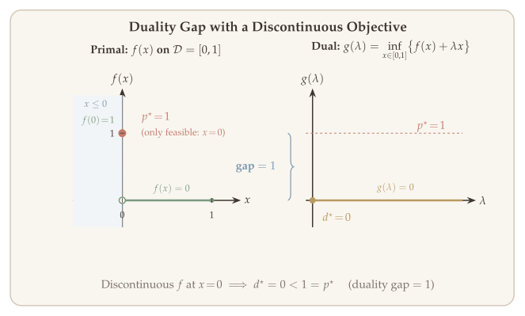
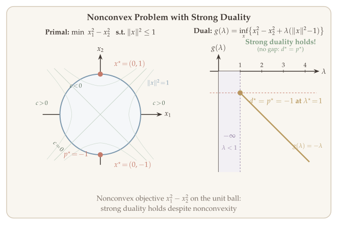
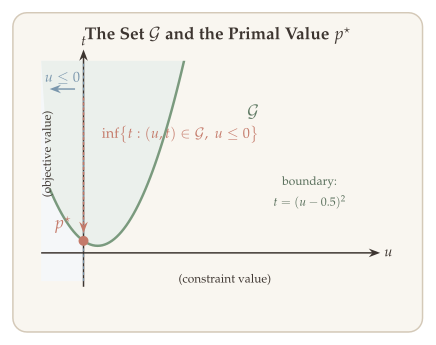
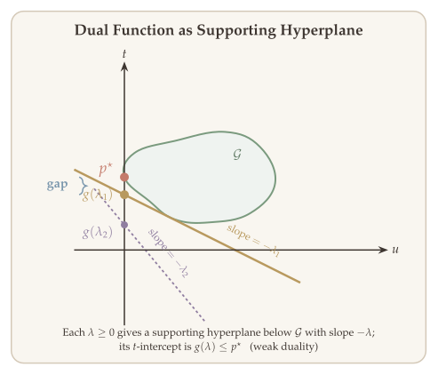
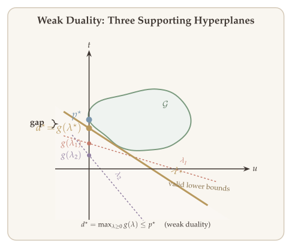
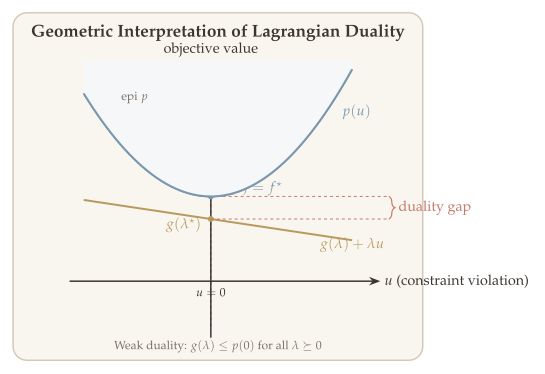
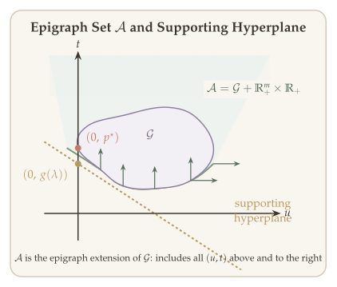
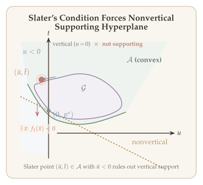
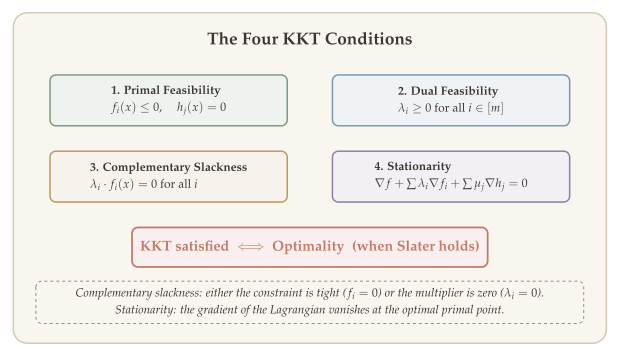
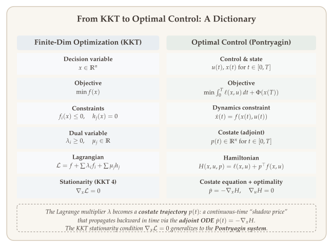

Duality theory is one of the most powerful and elegant frameworks in optimization. At its core, duality provides a systematic way to construct **lower bounds** on the optimal value of an optimization problem. These lower bounds serve as certificates of optimality: if we can find a feasible solution whose objective value matches a lower bound, we have proven that solution is optimal --- without needing to enumerate all possibilities.

The theory originates from linear programming, where the dual problem always yields tight bounds (strong duality). In this chapter, we extend duality to general optimization problems, including nonconvex ones, and identify the conditions under which strong duality holds. We develop the KKT conditions that characterize optimal primal--dual pairs and give a geometric interpretation of when and why duality gaps arise.

::: {.callout-tip}
## Companion Notebook

A [Jupyter notebook](../notebooks/duality-gap.ipynb) accompanies this chapter with runnable Python implementations of Lagrange duality computations, duality gap visualization, and strong duality examples.
:::

## Introduction {#sec-overview}

1. **Lagrange dual** --- defining the Lagrangian and the dual function
2. **Weak and strong duality** --- fundamental inequalities between primal and dual
3. **Interpretation of duality** --- geometric and epigraph viewpoints
4. **KKT conditions** --- necessary and sufficient optimality conditions
5. **Proof of strong duality given Slater's condition**
6. **Using duality and primal--dual correspondence**

### Motivation {#sec-motivation}

Suppose we want to certify optimality of a candidate solution. Given a point $\bar{x} \in D$, how do we determine **how good** $\bar{x}$ is in terms of solving $\min_{x \in \Omega} f(x)$?

Define the optimal value $p^* = \min_{x \in \Omega} f(x)$. We immediately have $p^* \leq f(\bar{x})$, so the **optimality gap** of $\bar{x}$ is

$$
f(\bar{x}) - p^* \geq 0.
$$

To bound this quantity, we need a **lower bound** on $p^*$. The central question becomes: how do we find a *tight* lower bound? This is precisely the role of duality theory.

## The Lagrangian Framework {#sec-lagrangian-framework}

We now set up the Lagrangian framework, which systematically constructs lower bounds on the optimal value of a constrained optimization problem. We start from the primal problem, introduce the Lagrangian, and derive the dual problem.

### The Primal Problem {#sec-primal-problem}

Consider the general optimization problem

$$
\min \; f(x) \qquad \text{s.t.} \quad f_i(x) \leq 0, \;\; i = 1, \ldots, m, \qquad h_i(x) = 0, \;\; i = 1, \ldots, p.
$$

Let $p^*$ denote the optimal value of this problem. There are three possibilities:

$$
p^* = \begin{cases} +\infty & \text{infeasible (no feasible point exists)} \\ \text{finite} & \text{has an optimal solution} \\ -\infty & \text{unbounded } \bigl(\exists \{x_k\}_{k \geq 1} \subseteq \Omega, \; \lim f(x_k) = -\infty\bigr) \end{cases}
$$

### The Lagrangian {#sec-lagrangian}

The central idea of duality is to relax the hard constraints by assigning a *price* to each violation. The Lagrangian bundles the objective and constraint functions into a single unconstrained objective parameterized by dual variables, enabling us to derive lower bounds on $p^*$.

::: {#def-lagrangian}
## Lagrangian

For $x \in D$, $\lambda \in \mathbb{R}^m$, $\mu \in \mathbb{R}^p$, the **Lagrangian** is defined as

$$
\mathcal{L}(x, \lambda, \mu) = f(x) + \sum_{i=1}^{m} \lambda_i f_i(x) + \sum_{j=1}^{p} \mu_j h_j(x).
$$

The variables $\lambda_i$ and $\mu_i$ are called **Lagrange multipliers** for the inequality constraints $f_i(x) \leq 0$ and the equality constraints $h_j(x) = 0$, respectively.
:::

### Lagrange Dual Function {#sec-dual-function}

Minimizing the Lagrangian over $x$ yields a function of the dual variables alone, which always provides a lower bound on $p^*$.

::: {#def-dual-function}
## Lagrange Dual Function

The **Lagrange dual function** is

$$
g(\lambda, \mu) = \inf_{x \in D} \; \mathcal{L}(x, \lambda, \mu) = \inf_{x \in D} \left\{ f(x) + \sum_i \lambda_i f_i(x) + \sum_j \mu_j h_j(x) \right\}.
$$
:::

Two important structural properties follow immediately from the definition.

::: {.callout-tip}
## Remark: Concavity of the Dual Function

Since $\mathcal{L}(x, \lambda, \mu)$ is **linear** (hence affine) in $(\lambda, \mu)$ for each fixed $x$, the dual function $g(\lambda, \mu)$ is the pointwise infimum of a family of affine functions. Therefore $g(\lambda, \mu)$ is **concave** in $(\lambda, \mu)$, regardless of whether the primal problem is convex.
:::

### The Lower Bound Property {#sec-lower-bound}

The dual function provides a lower bound on $p^*$. For any $\lambda \geq 0$ and $\mu \in \mathbb{R}^p$, and any feasible $x \in \Omega = \{x : f_i(x) \leq 0, \; h_j(x) = 0\}$, we have

$$
\mathcal{L}(x, \lambda, \mu) \leq f(x).
$$

This follows because $\lambda_i f_i(x) \leq 0$ (since $\lambda_i \geq 0$ and $f_i(x) \leq 0$) and $\mu_j h_j(x) = 0$ (since $h_j(x) = 0$).

Taking the infimum over $x \in D$ (a larger set than $\Omega$):

$$
g(\lambda, \mu) = \inf_{x \in D} \mathcal{L}(x, \lambda, \mu) \leq \inf_{x \in \Omega} \mathcal{L}(x, \lambda, \mu) \leq \inf_{x \in \Omega} f(x) = p^*.
$$

We record this fundamental property.

::: {#thm-lower-bound}
## Lower Bound Property

For all $\lambda \geq 0$ and $\mu \in \mathbb{R}^p$, we have

$$
g(\lambda, \mu) \leq \inf_{x \in \Omega} f(x) = p^*.
$$
:::

Thus, to get the **tightest** lower bound on $p^*$, we should maximize $g(\lambda, \mu)$ over $\lambda \geq 0$ and $\mu \in \mathbb{R}^p$. This leads us to the dual problem.

### Lagrange Dual Problem {#sec-dual-problem}

Since $g(\lambda, \mu) \leq p^*$ for every feasible dual pair $(\lambda, \mu)$, the natural next step is to find the *tightest* such lower bound by maximizing the dual function. This leads to the Lagrange dual problem.

::: {#def-dual-problem}
## Lagrange Dual Problem

The **Lagrange dual problem** is

$$
\max_{\lambda, \mu} \; g(\lambda, \mu) \qquad \text{s.t.} \quad \lambda \geq 0.
$$
:::

::: {.callout-tip}
## Remark: The Dual Is Always Convex

Since $g(\lambda, \mu)$ is concave, maximizing $g$ subject to $\lambda \geq 0$ is a **convex optimization problem**, even when the primal problem is nonconvex.
:::

### Interactive: Lagrangian Dual Function Explorer {#sec-dual-explorer}

Drag the slider below to vary the dual variable $\lambda$ and see how the Lagrangian $\mathcal{L}(x, \lambda)$ changes shape (left panel), while the dual function $g(\lambda)$ traces out its concave curve (right panel). Notice that $g(\lambda) \leq p^*$ always (weak duality), and equality is achieved at $\lambda^* = 2$.

```{=html}
<style>
  .interactive-figure-container {
    font-family: 'Palatino Linotype', 'Palatino', 'Book Antiqua', 'Georgia', serif;
    background: #f0ebe5;
    border-radius: 8px;
    padding: 24px 20px 16px 20px;
    margin: 28px auto;
    max-width: 1100px;
    box-shadow: 0 2px 12px rgba(61,53,48,0.08);
  }
  .interactive-figure-container h3 {
    font-family: 'Palatino Linotype', 'Palatino', 'Book Antiqua', 'Georgia', serif;
    color: #3d3530;
    font-size: 1.15em;
    font-weight: 600;
    margin: 0 0 6px 0;
    letter-spacing: 0.01em;
  }
  .interactive-figure-container .fig-subtitle {
    color: #968a80;
    font-size: 0.92em;
    margin: 0 0 16px 0;
    line-height: 1.5;
  }
  .interactive-figure-container .slider-row {
    display: flex;
    align-items: center;
    gap: 14px;
    margin: 14px 0 8px 0;
    flex-wrap: wrap;
  }
  .interactive-figure-container .slider-row label {
    font-size: 0.95em;
    color: #3d3530;
    min-width: 80px;
  }
  .interactive-figure-container .slider-row input[type="range"] {
    flex: 1;
    min-width: 180px;
    max-width: 420px;
    accent-color: #7b97ad;
    height: 6px;
  }
  .interactive-figure-container .slider-row .slider-value {
    font-size: 0.95em;
    color: #b8995e;
    font-weight: 600;
    min-width: 60px;
  }
  .interactive-figure-container .dropdown-row {
    display: flex;
    align-items: center;
    gap: 14px;
    margin: 10px 0 6px 0;
  }
  .interactive-figure-container .dropdown-row label {
    font-size: 0.95em;
    color: #3d3530;
  }
  .interactive-figure-container .dropdown-row select {
    font-family: 'Palatino Linotype', 'Palatino', 'Book Antiqua', 'Georgia', serif;
    font-size: 0.92em;
    padding: 4px 10px;
    border: 1px solid #e0d9d1;
    border-radius: 4px;
    background: #faf7f3;
    color: #3d3530;
  }
  .interactive-figure-container .panels {
    display: flex;
    gap: 12px;
    flex-wrap: wrap;
  }
  .interactive-figure-container .panels > div {
    flex: 1;
    min-width: 300px;
  }
  .interactive-figure-container .info-box {
    background: #faf7f3;
    border-left: 3px solid #7b97ad;
    border-radius: 0 4px 4px 0;
    padding: 10px 14px;
    margin: 10px 0 4px 0;
    font-size: 0.88em;
    color: #3d3530;
    line-height: 1.6;
  }
</style>

<div class="interactive-figure-container" id="fig1-wrapper">
  <h3>Lagrangian Dual Function Explorer</h3>
  <p class="fig-subtitle">
    Problem: min<sub>x</sub> &frac12;x&sup2; + x &ensp; s.t. &ensp; x &ge; 1
    &emsp;|&emsp;
    Lagrangian: L(x, &lambda;) = &frac12;x&sup2; + x + &lambda;(1 &minus; x)
  </p>
  <div class="slider-row">
    <label for="fig1-lambda">&lambda; =</label>
    <input type="range" id="fig1-lambda" min="0" max="3" step="0.02" value="1.0">
    <span class="slider-value" id="fig1-lambda-val">1.00</span>
  </div>
  <div class="panels">
    <div id="fig1-left"></div>
    <div id="fig1-right"></div>
  </div>
  <div class="info-box" id="fig1-info">
    Drag the slider to explore how the Lagrangian changes with &lambda;.
  </div>
</div>

<script>
(function() {
  const C = {
    bg: '#f0ebe5', plotBg: '#faf7f3', text: '#3d3530', grid: '#e0d9d1',
    axis: '#968a80', blue: '#7b97ad', gold: '#b8995e', sage: '#7a9a7e',
    terracotta: '#c47a6a', lavender: '#907ea0', rosewood: '#ad8480'
  };
  const font = {family: "'Palatino Linotype','Palatino','Book Antiqua','Georgia',serif", color: C.text};

  const pStar = 1.5;
  const lamStar = 2.0;
  const dStar = 1.5;

  function lagrangian(x, lam) {
    return 0.5*x*x + (1 - lam)*x + lam;
  }
  function xMinimizer(lam) {
    return lam - 1;
  }
  function dual(lam) {
    return -0.5*lam*lam + 2*lam - 0.5;
  }

  const xVals = [];
  for (let x = -2; x <= 4; x += 0.05) xVals.push(x);

  const lamVals = [];
  const gVals = [];
  for (let l = 0; l <= 3; l += 0.02) {
    lamVals.push(l);
    gVals.push(dual(l));
  }

  const axisStyle = {
    gridcolor: C.grid, gridwidth: 1, zerolinecolor: C.axis, zerolinewidth: 1.5,
    linecolor: C.axis, linewidth: 1, tickfont: {size: 14, ...font}, titlefont: {size: 16, ...font}
  };

  function makeLeftLayout() {
    return {
      paper_bgcolor: C.bg, plot_bgcolor: C.plotBg, font: font, height: 440,
      margin: {t: 44, b: 58, l: 64, r: 16},
      title: {text: '$\\mathcal{L}(x,\\lambda)$ as a function of $x$', font: {size: 17, ...font}},
      xaxis: {...axisStyle, title: '$x$', range: [-2, 4]},
      yaxis: {...axisStyle, title: '$\\mathcal{L}(x,\\lambda)$', range: [-2, 8]},
      showlegend: true,
      legend: {x: 0.55, y: 0.95, bgcolor: 'rgba(250,247,243,0.85)', bordercolor: C.grid, borderwidth: 1, font: {size: 13, ...font}},
      hovermode: 'closest'
    };
  }

  function makeRightLayout() {
    return {
      paper_bgcolor: C.bg, plot_bgcolor: C.plotBg, font: font, height: 440,
      margin: {t: 44, b: 58, l: 64, r: 16},
      title: {text: 'Dual function $g(\\lambda)$', font: {size: 17, ...font}},
      xaxis: {...axisStyle, title: '$\\lambda$', range: [-0.2, 3.2]},
      yaxis: {...axisStyle, title: '$g(\\lambda)$', range: [-1.5, 2.5]},
      showlegend: true,
      legend: {x: 0.45, y: 0.95, bgcolor: 'rgba(250,247,243,0.85)', bordercolor: C.grid, borderwidth: 1, font: {size: 13, ...font}},
      hovermode: 'closest'
    };
  }

  const plotConfig = {displayModeBar: false, responsive: true};

  function updateFig1(lam) {
    const Lvals = xVals.map(x => lagrangian(x, lam));
    const xStar = xMinimizer(lam);
    const LStar = lagrangian(xStar, lam);
    const fVals = xVals.map(x => 0.5*x*x + x);

    const leftTraces = [
      {x: xVals, y: fVals, mode: 'lines', line: {color: C.sage, width: 2.5, dash: 'dot'}, name: '$f(x) = \\frac{1}{2} \\cdot x^2 + x$'},
      {x: xVals, y: Lvals, mode: 'lines', line: {color: C.blue, width: 3}, name: '$\\mathcal{L}(x, \\lambda)$'},
      {x: [xStar], y: [LStar], mode: 'markers+text', marker: {size: 12, color: C.gold, line: {width: 2, color: C.text}},
       text: ['$x^*(\\lambda) = ' + xStar.toFixed(2) + '$'], textposition: 'top right', textfont: {size: 14, color: C.gold, ...font},
       name: 'Minimizer', showlegend: false},
      {x: [-2, 4], y: [pStar, pStar], mode: 'lines', line: {color: C.terracotta, width: 1.5, dash: 'dash'}, name: '$p^* = ' + pStar.toFixed(1) + '$'},
      {x: [1, 1], y: [-2, 8], mode: 'lines', line: {color: C.rosewood, width: 1.5, dash: 'dashdot'}, name: '$x = 1$ (constraint)', showlegend: true}
    ];

    const gCurrent = dual(lam);
    const lamTraced = [];
    const gTraced = [];
    for (let l = 0; l <= lam + 0.001; l += 0.02) {
      lamTraced.push(l);
      gTraced.push(dual(l));
    }

    const rightTraces = [
      {x: lamVals, y: gVals, mode: 'lines', line: {color: C.blue, width: 2, dash: 'dot'}, name: '$g(\\lambda)$  full', opacity: 0.4},
      {x: lamTraced, y: gTraced, mode: 'lines', line: {color: C.blue, width: 3}, name: '$g(\\lambda)$  traced'},
      {x: [lam], y: [gCurrent], mode: 'markers+text', marker: {size: 12, color: C.gold, line: {width: 2, color: C.text}},
       text: ['$g(' + lam.toFixed(2) + ') = ' + gCurrent.toFixed(2) + '$'], textposition: 'top left', textfont: {size: 14, color: C.gold, ...font},
       name: 'Current', showlegend: false},
      {x: [-0.2, 3.2], y: [pStar, pStar], mode: 'lines', line: {color: C.terracotta, width: 1.5, dash: 'dash'}, name: '$p^* = ' + pStar.toFixed(1) + '$'},
      {x: [lamStar], y: [dStar], mode: 'markers+text', marker: {size: 11, color: C.terracotta, symbol: 'star', line: {width: 1.5, color: C.text}},
       text: ['$d^* = ' + dStar.toFixed(1) + '$'], textposition: 'bottom right', textfont: {size: 14, color: C.terracotta, ...font},
       name: '$d^*$ (dual optimal)', showlegend: false}
    ];

    const gap = pStar - gCurrent;
    const gapText = gap < 0.02
      ? 'Strong duality: <i>p</i>* = <i>d</i>* = ' + pStar.toFixed(1) + ' (zero gap!)'
      : 'Duality gap at \u03BB = ' + lam.toFixed(2) + ':&ensp; <i>p</i>* \u2212 <i>g</i>(\u03BB) = ' + gap.toFixed(3);

    document.getElementById('fig1-info').innerHTML = gapText +
      '<br>Minimizer: <i>x</i>*(\u03BB) = \u03BB \u2212 1 = ' + xStar.toFixed(2) +
      ' &emsp;|&emsp; <i>g</i>(\u03BB) = \u2212\u00BD\u03BB\u00B2 + 2\u03BB \u2212 \u00BD = ' + gCurrent.toFixed(3);

    Plotly.react('fig1-left', leftTraces, makeLeftLayout(), plotConfig);
    Plotly.react('fig1-right', rightTraces, makeRightLayout(), plotConfig);
  }

  document.getElementById('fig1-lambda').addEventListener('input', function() {
    const lam = parseFloat(this.value);
    document.getElementById('fig1-lambda-val').textContent = lam.toFixed(2);
    updateFig1(lam);
  });

  updateFig1(1.0);
})();
</script>
```

## Examples of Lagrange Duality {#sec-examples}

### Example 1: LP Duality {#sec-lp-duality}

::: {#exm-lp-duality}
## LP Duality

Consider the primal LP:

$$
\text{(P)} \quad \min \; c^\top x \qquad \text{s.t.} \quad Ax = b, \quad x \geq 0.
$$

The Lagrangian (with multiplier $\lambda \geq 0$ for $-x \leq 0$ and $\mu$ for $Ax = b$) is

$$
\mathcal{L}(x, \lambda, \mu) = c^\top x + \lambda^\top(-x) + \mu^\top(Ax - b) = -b^\top \mu + x^\top(c - \lambda + A^\top \mu).
$$

This decomposes into a constant term $-b^\top \mu$ plus a term linear in $x$. Minimizing over $x \in \mathbb{R}^d$:

$$
\min_x \; \mathcal{L}(x, \lambda, \mu) = \begin{cases} -b^\top \mu & \text{if } c - \lambda + A^\top \mu = 0 \\ -\infty & \text{otherwise.} \end{cases}
$$

Therefore the dual function is

$$
g(\lambda, \mu) = \begin{cases} -b^\top \mu & \text{if } A^\top \mu + c - \lambda = 0 \\ -\infty & \text{otherwise.} \end{cases}
$$

Maximizing $g(\lambda, \mu)$ subject to $\lambda \geq 0$ is equivalent to

$$
\max \; -b^\top \mu \qquad \text{s.t.} \quad \lambda \geq 0, \quad A^\top \mu + c - \lambda \geq 0.
$$

Since $\lambda$ appears only in the constraint $\lambda = A^\top \mu + c \geq 0$, we can eliminate it to obtain the **dual LP**:

$$
\max \; -b^\top \mu \qquad \text{s.t.} \quad A^\top \mu + c \geq 0.
$$

This is exactly the standard LP dual. The dual of the dual LP recovers the primal LP---an exercise worth verifying.
:::

### Example 2: Minimum-Norm Solution to a Linear System {#sec-min-norm}

::: {#exm-min-norm}
## Minimum-Norm Solution

Consider finding the minimum $\ell_2$-norm solution to a linear system:

$$
\min \; \|x\|_2^2 = x^\top x \qquad \text{s.t.} \quad Ax = b.
$$

The Lagrangian is

$$
\mathcal{L}(x, \mu) = x^\top x + \mu^\top(Ax - b),
$$

which is a convex quadratic in $x$. Setting $\nabla_x \mathcal{L}(x, \mu) = 2x + A^\top \mu = 0$ gives $x = -\frac{1}{2} A^\top \mu$. Substituting back:

$$
g(\mu) = \mathcal{L}\!\left(-\tfrac{1}{2}A^\top \mu, \, \mu\right) = -\tfrac{1}{4}\mu^\top A A^\top \mu - b^\top \mu.
$$

The dual problem is the unconstrained maximization of this concave quadratic: $\max_\mu \; -\frac{1}{4}\mu^\top A A^\top \mu - b^\top \mu$.
:::

### Example 3: Minimum-Norm Solution with a General Norm {#sec-min-norm-general}

::: {#exm-min-norm-general}
## Minimum-Norm Solution with General Norm

Consider the problem

$$
\min \; \|x\| \qquad \text{s.t.} \quad Ax = b,
$$

where $\|\cdot\|$ is an arbitrary norm. The Lagrangian is

$$
\mathcal{L}(x, \mu) = \|x\| + \mu^\top(Ax - b).
$$

Recall the **dual norm**: $\|y\|_* = \sup_{\|x\| \leq 1} x^\top y$, which implies $x^\top y \leq \|x\| \cdot \|y\|_*$ for all $x, y$.

We observe that

$$
\inf_x \left\{ \|x\| - y^\top x \right\} = \begin{cases} 0 & \text{if } \|y\|_* \leq 1 \\ -\infty & \text{if } \|y\|_* > 1. \end{cases}
$$

Applying this with $y = -A^\top \mu$:

$$
g(\mu) = \begin{cases} -b^\top \mu & \text{if } \|A^\top \mu\|_* \leq 1 \\ -\infty & \text{otherwise.} \end{cases}
$$

The dual problem is therefore $\max \; -b^\top \mu$ subject to $\|A^\top \mu\|_* \leq 1$.
:::

### Example 4: Dual Problem via Conjugate Functions {#sec-conjugate-dual}

::: {#exm-conjugate}
## Dual via Conjugate Function

Consider the problem

$$
\min \; f(x) \qquad \text{s.t.} \quad Ax \leq b, \quad Cx = d.
$$

Recall the **conjugate function**: $f^*(y) = \sup_x \{ x^\top y - f(x) \}$.

The Lagrange dual is

$$
g(\lambda, \mu) = \inf_x \left\{ f(x) + \lambda^\top(Ax - b) + \mu^\top(Cx - d) \right\}.
$$

Rearranging:

$$
g(\lambda, \mu) = \inf_x \left\{ f(x) + x^\top(A^\top \lambda + C^\top \mu) \right\} - (\lambda^\top b + \mu^\top d).
$$

Using the identity $\min_{x} g(x) = -\max_x \{-g(x)\}$ and the definition of the conjugate:

$$
g(\lambda, \mu) = -\sup_x \left\{ x^\top(-A^\top \lambda - C^\top \mu) - f(x) \right\} - (\lambda^\top b + \mu^\top d) = -f^*(-A^\top \lambda - C^\top \mu) - (\lambda^\top b + \mu^\top d).
$$

The **dual problem** is therefore:

$$
\max \; -f^*(-A^\top \lambda - C^\top \mu) - (b^\top \lambda + \mu^\top d) \qquad \text{s.t.} \quad \lambda \geq 0.
$$

This formulation is useful because the constraint set of the dual ($\lambda \geq 0$) is much simpler than that of the primal---all the complexity is absorbed into the objective via the conjugate.
:::

### Example 5: Dual of a Nonconvex Problem {#sec-nonconvex-dual}

The following example shows that duality applies to **nonconvex** problems as well, though a **duality gap** may arise.

::: {#exm-nonconvex}
## Dual of a Nonconvex Problem

Consider the nonconvex problem

$$
\text{(P)} \quad \min \; f(x) = x^4 - 4x^2, \qquad \text{s.t.} \quad -1 \leq x \leq 1.
$$

The unconstrained minima of $f$ are at $x = \pm\sqrt{2}$ where $f(\pm\sqrt{2}) = -4$, but both lie outside the feasible set $[-1, 1]$. Over the feasible region, the minimum is attained at $x = \pm 1$ with $f(\pm 1) = 1 - 4 = -3$, so $p^* = -3$.

**Lagrangian.** Introducing multipliers $\mu_1 \geq 0$ for $x - 1 \leq 0$ and $\mu_2 \geq 0$ for $-x - 1 \leq 0$:

$$
\mathcal{L}(x, \mu_1, \mu_2) = x^4 - 4x^2 + \mu_1(x - 1) + \mu_2(-x - 1).
$$

**Dual function.** Setting $c = \mu_1 - \mu_2$, the dual function is

$$
g(\mu_1, \mu_2) = \inf_{x \in \mathbb{R}} \left\{ x^4 - 4x^2 + c\,x \right\} - (\mu_1 + \mu_2).
$$

At $\mu_1 = \mu_2 = 0$ (so $c = 0$), the inner infimum is $\inf_x \{x^4 - 4x^2\} = -4$, attained at $x = \pm\sqrt{2}$. For any other $(\mu_1, \mu_2) \geq 0$, the penalty term $-(\mu_1 + \mu_2) \leq 0$ makes $g$ even smaller. Therefore the dual optimal value is $d^* = -4$.

**Duality gap.** Since $p^* = -3$ and $d^* = -4$, the duality gap is $p^* - d^* = 1 > 0$. The nonconvexity of $f$ prevents the Lagrangian relaxation from closing the gap: the linear penalty terms $\mu_1(x-1) + \mu_2(-x-1)$ cannot "convexify" the quartic objective.
:::

![Nonconvex dual example: $f(x)=x^4-4x^2$ with constraint $|x| \le 1$. The feasible region $[-1,1]$ excludes both unconstrained minima at $\pm\sqrt{2}$, producing a duality gap of $1$.](figures/ch02-exm-nonconvex-dual.svg){#fig-exm-nonconvex-dual}

## Weak and Strong Duality {#sec-weak-strong-duality}

We now systematically compare the primal and dual problems.

| | **Primal** | **Dual** |
|---|---|---|
| **Problem** | $\min \; f(x)$ s.t. $f_i(x) \leq 0$, $h_j(x) = 0$ | $\max \; g(\lambda, \mu)$ s.t. $\lambda \geq 0$ |
| **Optimal value** | $p^*$ | $d^*$ |
| **Infeasible** | $p^* = +\infty$ | $d^* = -\infty$ |
| **Finite optimum** | $p^*$ finite | $d^*$ finite |
| **Unbounded** | $p^* = -\infty$ | $d^* = +\infty$ |

A pair $(\lambda, \mu)$ is **dual feasible** if $\lambda \geq 0$ and $g(\lambda, \mu) > -\infty$.

For LP, duality theory comprises three pieces: weak duality, strong duality, and complementary slackness. We now generalize each to the general case.

### Weak Duality {#sec-weak-duality}

Weak duality asserts that the dual optimal value can never exceed the primal optimal value. This holds universally---for convex and nonconvex problems alike.

::: {#thm-weak-duality}
## Weak Duality

We always have $d^* \leq p^*$. More precisely, for any $x$ feasible for (P) and $(\lambda, \mu)$ feasible for (D),

$$
g(\lambda, \mu) \leq f(x).
$$

Equivalently, the **duality gap** satisfies $p^* - d^* \geq 0$.
:::

::: {.callout-tip}
## Remark: Consequences of Weak Duality

1. The values $p^*$ and $d^*$ can be $+\infty$ or $-\infty$. Weak duality still holds ($p^* \geq d^*$).
2. If $p^* = -\infty$ (primal unbounded), then $d^* = -\infty$ (dual infeasible).
3. If $d^* = +\infty$ (dual unbounded), then $p^* = +\infty$ (primal infeasible).
4. Weak duality also holds for **nonconvex** problems.
5. The dual problem can be used to establish lower bounds on $p^*$: $g(\lambda, \mu) \leq p^*$ for any $\lambda \geq 0$. Note that (D) is a convex optimization problem even when (P) is not.
:::

The following table summarizes which combinations of primal and dual status are possible. Cells marked [Impossible]{style="color: #C47A6A; font-weight: 600;"} are ruled out by weak duality, while [Possible]{style="color: #7A9A7E; font-weight: 600;"} cells have concrete examples below.

```{=html}
<table style="width:100%; border-collapse:collapse; margin:16px 0; font-family:'Palatino Linotype','Palatino',serif;">
<thead>
<tr style="background:#e8e2da;">
  <th style="padding:10px 14px; border:1px solid #D4C9B8;"></th>
  <th style="padding:10px 14px; border:1px solid #D4C9B8; text-align:center;"><strong>Primal infeasible</strong></th>
  <th style="padding:10px 14px; border:1px solid #D4C9B8; text-align:center;"><strong>Primal finite</strong> <em>p</em>*</th>
  <th style="padding:10px 14px; border:1px solid #D4C9B8; text-align:center;"><strong>Primal unbounded</strong></th>
</tr>
</thead>
<tbody>
<tr>
  <td style="padding:10px 14px; border:1px solid #D4C9B8;"><strong>Dual infeasible</strong></td>
  <td style="padding:10px 14px; border:1px solid #D4C9B8; text-align:center; background:#f2f7f3; color:#3D3530;"><span style="color:#7A9A7E; font-weight:600;">Possible</span></td>
  <td style="padding:10px 14px; border:1px solid #D4C9B8; text-align:center; background:#f2f7f3; color:#3D3530;"><span style="color:#7A9A7E; font-weight:600;">Possible</span></td>
  <td style="padding:10px 14px; border:1px solid #D4C9B8; text-align:center; background:#f2f7f3; color:#3D3530;"><span style="color:#7A9A7E; font-weight:600;">Possible</span></td>
</tr>
<tr>
  <td style="padding:10px 14px; border:1px solid #D4C9B8;"><strong>Dual finite</strong> <em>d</em>*</td>
  <td style="padding:10px 14px; border:1px solid #D4C9B8; text-align:center; background:#f2f7f3; color:#3D3530;"><span style="color:#7A9A7E; font-weight:600;">Possible</span></td>
  <td style="padding:10px 14px; border:1px solid #D4C9B8; text-align:center; background:#f2f7f3; color:#3D3530;"><span style="color:#7A9A7E; font-weight:600;">Possible</span></td>
  <td style="padding:10px 14px; border:1px solid #D4C9B8; text-align:center; background:#faf0ee; color:#3D3530;"><span style="color:#C47A6A; font-weight:600;">Impossible</span></td>
</tr>
<tr>
  <td style="padding:10px 14px; border:1px solid #D4C9B8;"><strong>Dual unbounded</strong></td>
  <td style="padding:10px 14px; border:1px solid #D4C9B8; text-align:center; background:#f2f7f3; color:#3D3530;"><span style="color:#7A9A7E; font-weight:600;">Possible</span></td>
  <td style="padding:10px 14px; border:1px solid #D4C9B8; text-align:center; background:#faf0ee; color:#3D3530;"><span style="color:#C47A6A; font-weight:600;">Impossible</span></td>
  <td style="padding:10px 14px; border:1px solid #D4C9B8; text-align:center; background:#faf0ee; color:#3D3530;"><span style="color:#C47A6A; font-weight:600;">Impossible</span></td>
</tr>
</tbody>
</table>
```

Examples with $p^* = +\infty$ and $d^*$ finite, or $p^*$ finite and $d^* = -\infty$, are hard to find (thanks to strong duality results for convex problems).

### Examples Illustrating Weak Duality {#sec-weak-duality-examples}

The following examples illustrate the different combinations of primal and dual status from the table above. We begin with the case where **both** problems are **infeasible**.

::: {#exm-both-infeasible}
## Both Primal and Dual Infeasible

Consider the LP pair:

$$
\text{(P):} \quad \min \; x_1 + 2x_2 \quad \text{s.t.} \quad x_1 + x_2 = 1, \;\; 2x_1 + 2x_2 = 3.
$$

$$
\text{(D):} \quad \max \; y_1 + 3y_2 \quad \text{s.t.} \quad y_1 + 2y_2 = 1, \;\; y_1 + 2y_2 = 2.
$$

Both problems are infeasible---the equality constraints are contradictory in each case.
:::

Next, the primal can have a **finite** optimal value while the dual is **infeasible** ($g \equiv -\infty$). This occurs when the objective is nonconvex.

::: {#exm-primal-finite-dual-infeasible}
## Primal Finite, Dual Infeasible

Consider

$$
\text{(P):} \quad \min \; -x^2 \quad \text{s.t.} \quad x \leq 1, \;\; x \geq -1.
$$

This minimizes a concave function over $[-1, 1]$, with $p^* = -1$ (attained at $x = \pm 1$).

The Lagrangian is

$$
\mathcal{L}(x, \lambda_1, \lambda_2) = -x^2 + \lambda_1(x - 1) - \lambda_2(1 + x) = -x^2 + (\lambda_1 - \lambda_2)x - (\lambda_1 + \lambda_2).
$$

Completing the square:

$$
\mathcal{L}(x, \lambda_1, \lambda_2) = -\left(x - \frac{\lambda_1 - \lambda_2}{2}\right)^2 + \frac{(\lambda_1 - \lambda_2)^2}{4} - (\lambda_1 + \lambda_2).
$$

Thus $\min_x \mathcal{L}(x, \lambda_1, \lambda_2) = -\infty$ for all $\lambda_1, \lambda_2 \geq 0$, so $g(\lambda_1, \lambda_2) = -\infty$ and the dual is infeasible.
:::

![Concave objective $f(x) = -x^2$ on $[-1,1]$: the primal has $p^\star = -1$, but the dual function is always $-\infty$.](figures/ch02-exm-concave-objective.svg){#fig-exm-concave-objective}

The same phenomenon can occur with **nonlinear** constraints --- both primal and dual can be **infeasible** simultaneously.

::: {#exm-both-primal-dual-infeasible}
## Both Primal and Dual Infeasible (Nonlinear)

Consider

$$
\text{(P):} \quad \min \; -x^2 \quad \text{s.t.} \quad x \leq -1, \;\; x \geq 1.
$$

The primal is infeasible (no $x$ satisfies both $x \leq -1$ and $x \geq 1$).

The Lagrangian is $\mathcal{L}(x, \lambda_1, \lambda_2) = -x^2 + \lambda_1(x + 1) + \lambda_2(1 - x)$. Completing the square:

$$
\mathcal{L}(x, \lambda_1, \lambda_2) = -\left(x - \frac{\lambda_1 - \lambda_2}{2}\right)^2 + \frac{(\lambda_1 - \lambda_2)^2}{4} + \lambda_1 + \lambda_2.
$$

Again $g(\lambda_1, \lambda_2) = -\infty$, so the dual is also infeasible.
:::

A more unusual case: the primal is **infeasible** yet the dual has a **finite** optimal value. This is rare but possible.

::: {#exm-primal-infeasible-dual-finite}
## Primal Infeasible, Dual Finite

Consider

$$
\text{(P):} \quad \min \; e^x \quad \text{s.t.} \quad e^x = 0.
$$

The primal is infeasible since $e^x > 0$ for all $x \in \mathbb{R}$. The Lagrangian is

$$
\mathcal{L}(x, \mu) = e^x + \mu \cdot e^x = (1 + \mu) e^x.
$$

The dual function is

$$
g(\mu) = \inf_{x \in \mathbb{R}} (1 + \mu) e^x = \begin{cases} 0 & \text{if } \mu \geq -1 \\ -\infty & \text{if } \mu < -1. \end{cases}
$$

The dual problem is $\max \; 0$ subject to $\mu \geq -1$, which has a finite optimal value $d^* = 0$.
:::

#### Proof of Weak Duality {#sec-proof-weak-duality}

::: {.proof}
Consider the Lagrangian $\mathcal{L}(x, \lambda, \mu) = f(x) + \sum_i \lambda_i f_i(x) + \sum_j \mu_j h_j(x)$. We minimize over $x$ and $(\lambda, \mu)$ separately.

**Minimizing over $x$:** For each fixed $(\lambda, \mu)$,

$$
g(\lambda, \mu) = \min_{x \in D} \; \mathcal{L}(x, \lambda, \mu).
$$

**Maximizing over $(\lambda, \mu)$:** For each fixed feasible $x$,

$$
\max_{\lambda \geq 0, \, \mu \in \mathbb{R}^p} \mathcal{L}(x, \lambda, \mu) = \begin{cases} f(x) & \text{if } x \text{ is feasible} \\ +\infty & \text{if } x \text{ is infeasible.} \end{cases}
$$

Therefore the primal and dual values can be written as:

$$
p^* = \min_x \; \max_{\lambda \geq 0, \, \mu \in \mathbb{R}^p} \; \mathcal{L}(x, \lambda, \mu), \qquad d^* = \max_{\lambda \geq 0, \, \mu \in \mathbb{R}^p} \; \min_x \; \mathcal{L}(x, \lambda, \mu).
$$

Since $\min\text{-}\max \geq \max\text{-}\min$ always holds, we conclude $p^* \geq d^*$.

The **duality gap** is

$$
p^* - d^* = \min_x \max_{\lambda \geq 0, \mu} \mathcal{L}(x, \lambda, \mu) - \max_{\lambda \geq 0, \mu} \min_x \mathcal{L}(x, \lambda, \mu) \geq 0.
$$

This completes the proof of weak duality. $\blacksquare$
:::

### Strong Duality {#sec-strong-duality}

When the duality gap vanishes, we obtain the most powerful form of duality.

::: {#def-strong-duality}
## Strong Duality

If $p^* = d^*$ (and both are finite), we say **strong duality holds**. That is, the duality gap is zero:

$$
\min_x \max_{\lambda \geq 0, \mu} \mathcal{L}(x, \lambda, \mu) = \max_{\lambda \geq 0, \mu} \min_x \mathcal{L}(x, \lambda, \mu).
$$
:::

For LP, strong duality always holds. However, this is **not true in general**.

### Examples Where Strong Duality Fails {#sec-strong-duality-fails}

The following three examples demonstrate that strong duality can fail for a variety of structural reasons --- constraints that are too rigid, nonconvex domains, or subtle interactions between objective and constraints. These failures motivate the search for additional conditions, called **constraint qualifications**, that guarantee $p^* = d^*$.

::: {#exm-sdp-no-strong}
## Strong Duality Fails for SDP

Consider the semidefinite program (SDP):

$$
\text{(P):} \quad \min \; y_1 \quad \text{s.t.} \quad \begin{pmatrix} 0 & y_1 & 0 \\ y_1 & y_2 & 0 \\ 0 & 0 & y_1 + 1 \end{pmatrix} \succeq 0.
$$

Note that since $A = \begin{pmatrix} 0 & y_1 & 0 \\ y_1 & y_2 & 0 \\ 0 & 0 & y_1+1 \end{pmatrix} \succeq 0$, we need $A_{00} = 0$, which (together with positive semidefiniteness) forces $y_1 = 0$ and $y_2 \geq 0$. The dual problem yields $d^* = -1$, while the primal has $p^* = 0$. So $p^* - d^* = 1 > 0$.
:::

A **nonconvex feasible set** (here a discrete domain) can also produce a duality gap.

::: {#exm-discrete-domain}
## Duality Gap with Discrete Domain

Let $D = [0, 1]$ and define $f(x) = \begin{cases} 1 & x = 0 \\ 0 & x \in (0, 1]. \end{cases}$

$$
\text{(P):} \quad \min \; f(x) \quad \text{s.t.} \quad x \leq 0, \quad x \in D.
$$

Since $x \leq 0$ and $x \in [0,1]$ forces $x = 0$, we get $p^* = 1$. The dual function is

$$
g(\lambda) = \inf_{x \in [0,1]} \left\{ f(x) + \lambda x \right\} = \inf \begin{cases} 1 + \lambda \cdot 0 & x = 0 \\ \lambda x & x \in (0,1] \end{cases} = 0.
$$

Thus $d^* = 0$ and the duality gap is $p^* - d^* = 1$.
:::

{#fig-exm-discrete-gap}

Finally, a **constraint qualification failure** --- even with a convex objective --- can cause a duality gap.

::: {#exm-nonconvex-constraint}
## Nonconvex Constraint Qualification Failure

Consider

$$
\text{(P):} \quad \min \; e^{-x} \quad \text{s.t.} \quad x^2 / y \leq 0, \quad D = \{(x, y) : y > 0\}.
$$

Since $y > 0$, the constraint $x^2/y \leq 0$ forces $x = 0$. Any $y > 0$ is then feasible, so $p^* = e^{0} = 1$. The Lagrangian is

$$
\mathcal{L}(x, y, \lambda) = e^{-x} + \lambda \cdot \frac{x^2}{y}.
$$

The dual function is

$$
g(\lambda) = \inf_{y > 0, \, x \in \mathbb{R}} \left\{ e^{-x} + \lambda \cdot \frac{x^2}{y} \right\}.
$$

For any fixed $\lambda \geq 0$, substitute $y = x^3$ and let $x \to +\infty$:

$$
e^{-x} + \lambda \cdot \frac{x^2}{x^3} = e^{-x} + \frac{\lambda}{x} \;\longrightarrow\; 0.
$$

Both terms vanish: $e^{-x} \to 0$ exponentially and $\lambda / x \to 0$. Since both terms are non-negative for $x > 0$ and $\lambda \geq 0$, the infimum is bounded below by $0$, so $g(\lambda) = 0$ for all $\lambda \geq 0$. Therefore $d^* = 0$, and the duality gap is $p^* - d^* = 1 > 0$.

This gap arises because the constraint $x^2/y \leq 0$ on the domain $\{y > 0\}$ **violates constraint qualification**: the feasible set $\{(0, y) : y > 0\}$ has empty interior relative to the constraint function, so the Lagrange multiplier theory cannot certify optimality.
:::

::: {.callout-tip}
## Remark: When Does Strong Duality Hold?

1. If $p^* = d^*$, the lower bound on $p^*$ obtained by solving the dual is **tight**.
2. Strong duality does **not** hold in general.
3. It **usually** holds for convex problems.
4. **Constraint qualifications** are additional conditions that guarantee strong duality.
:::

### Slater's Condition {#sec-slater}

We have seen that strong duality can fail for general problems. The most widely used *constraint qualification* --- a condition on the problem structure that guarantees zero duality gap --- is Slater's condition, also known as **strict feasibility**. It asks only that the inequality constraints can all be satisfied strictly, which is a mild and easily checkable requirement.

::: {#def-slater}
## Slater's Condition (Strict Feasibility)

Consider the convex problem

$$
\text{(P):} \quad \min \; f(x) \quad \text{s.t.} \quad f_i(x) \leq 0, \;\; i \in [m], \quad Ax = b.
$$

We say (P) satisfies **Slater's condition** if there exists $\bar{x} \in \operatorname{int}(D)$ such that

$$
f_i(\bar{x}) < 0 \quad \forall \, i \in [m], \qquad A\bar{x} = b,
$$

and $p^*$ is finite.
:::

::: {#thm-slater}
## Slater's Theorem

If (P) is a convex problem satisfying Slater's condition, then **strong duality holds**: $p^* = d^*$ (both finite). Moreover, the dual optimal value is **attained** at some $(\lambda^*, \mu^*)$.
:::

**Geometric intuition.** Slater's condition asks that the feasible region has "room to breathe" --- there exists a point that is **strictly inside** every inequality constraint, not merely on the boundary. When such a point exists, the supporting-hyperplane machinery underlying Lagrangian duality can close the gap between primal and dual values completely: informally, you can "wiggle" a feasible point in every constrained direction while remaining feasible, giving the Lagrange multipliers enough flexibility to produce a tight bound.

Contrast this with the failure examples in @sec-strong-duality-fails. In the discrete-domain example, the feasible set consisted of just two isolated points --- there is no interior at all. In the constraint-qualification example, the feasible set $\{(0, y) : y > 0\}$ had empty interior relative to the constraint $x^2/y \leq 0$. In both cases, the degenerate geometry of the feasible region prevented the dual from matching the primal value. Slater's condition rules out precisely these pathologies by requiring that the inequality constraints leave a full-dimensional "cushion" of strictly feasible points.

::: {.callout-tip}
## Remark: Notes on Slater's Condition

1. There exist many other types of constraint qualifications, e.g., **Abadie CQ** and **Guignard CQ**.
2. Slater's condition is relatively easy to check. It is commonly satisfied in practice.
3. If (P) has a **nonlinear** equality constraint $h(x) = 0$, Slater's condition does *not* hold (one cannot have $h(\bar{x}) < 0$ and $h(\bar{x}) > 0$ simultaneously for a scalar constraint). In such cases, one may reformulate as $h(x) \leq 0$ and $h(x) \geq 0$, and Slater's condition would require $h(\bar{x}) < 0$ and $h(\bar{x}) > 0$, which is impossible.
4. Slater's condition can be extended to a **weaker version**: if $f_1, \ldots, f_K$ are linear (affine) and $f_{K+1}, \ldots, f_m$ are nonlinear, then we only require $\exists \, \bar{x} \in \operatorname{int}(D)$ with $f_{K+1}(\bar{x}) < 0, \ldots, f_m(\bar{x}) < 0$ (the linear constraints need only be satisfied, not strictly).

**Exercise:** Check that the three examples in @sec-strong-duality-fails do not satisfy Slater's condition.
:::

### Slater's Condition for LP and QP {#sec-slater-lp-qp}

Slater's condition always holds for LP and QP (when feasible), because if the constraints are all linear/affine, the weaker version of Slater's condition reduces to plain feasibility.

**LP strong duality:** If either the primal LP or the dual LP admits an optimal value, so does the other. Moreover, $p^* = d^*$.

When Slater's condition holds, the feasibility table simplifies considerably --- strong duality eliminates most off-diagonal entries:

```{=html}
<table style="width:100%; border-collapse:collapse; margin:16px 0; font-family:'Palatino Linotype','Palatino',serif;">
<thead>
<tr style="background:#e8e2da;">
  <th style="padding:10px 14px; border:1px solid #D4C9B8;"></th>
  <th style="padding:10px 14px; border:1px solid #D4C9B8; text-align:center;"><strong>Primal infeasible</strong></th>
  <th style="padding:10px 14px; border:1px solid #D4C9B8; text-align:center;"><strong>Primal finite</strong> <em>p</em>*</th>
  <th style="padding:10px 14px; border:1px solid #D4C9B8; text-align:center;"><strong>Primal unbounded</strong></th>
</tr>
</thead>
<tbody>
<tr>
  <td style="padding:10px 14px; border:1px solid #D4C9B8;"><strong>Dual infeasible</strong></td>
  <td style="padding:10px 14px; border:1px solid #D4C9B8; text-align:center; background:#f2f7f3;"><span style="color:#7A9A7E; font-weight:600;">Possible</span></td>
  <td style="padding:10px 14px; border:1px solid #D4C9B8; text-align:center; background:#faf0ee;"><span style="color:#C47A6A; font-weight:600;">Ruled out</span><br><small style="color:#7B7067;">strong duality</small></td>
  <td style="padding:10px 14px; border:1px solid #D4C9B8; text-align:center; background:#f2f7f3;"><span style="color:#7A9A7E; font-weight:600;">Possible</span></td>
</tr>
<tr>
  <td style="padding:10px 14px; border:1px solid #D4C9B8;"><strong>Dual finite</strong> <em>d</em>*</td>
  <td style="padding:10px 14px; border:1px solid #D4C9B8; text-align:center; background:#faf0ee;"><span style="color:#C47A6A; font-weight:600;">Ruled out</span><br><small style="color:#7B7067;">weak duality</small></td>
  <td style="padding:10px 14px; border:1px solid #D4C9B8; text-align:center; background:#f2f7f3;"><span style="color:#7A9A7E; font-weight:600;">Possible</span></td>
  <td style="padding:10px 14px; border:1px solid #D4C9B8; text-align:center; background:#faf0ee;"><span style="color:#C47A6A; font-weight:600;">Ruled out</span><br><small style="color:#7B7067;">weak duality</small></td>
</tr>
<tr>
  <td style="padding:10px 14px; border:1px solid #D4C9B8;"><strong>Dual unbounded</strong></td>
  <td style="padding:10px 14px; border:1px solid #D4C9B8; text-align:center; background:#f2f7f3;"><span style="color:#7A9A7E; font-weight:600;">Possible</span></td>
  <td style="padding:10px 14px; border:1px solid #D4C9B8; text-align:center; background:#faf0ee;"><span style="color:#C47A6A; font-weight:600;">Ruled out</span><br><small style="color:#7B7067;">weak duality</small></td>
  <td style="padding:10px 14px; border:1px solid #D4C9B8; text-align:center; background:#faf0ee;"><span style="color:#C47A6A; font-weight:600;">Ruled out</span><br><small style="color:#7B7067;">weak duality</small></td>
</tr>
</tbody>
</table>
```

**QP duality:** For the quadratic program

$$
\text{(P):} \quad \min \; x^\top P x \quad \text{s.t.} \quad Ax \leq b \qquad (P \succ 0),
$$

the dual is

$$
\text{(D):} \quad \max \; -\tfrac{1}{4}\lambda^\top A P^{-1} A^\top \lambda - b^\top \lambda \qquad \text{s.t.} \quad \lambda \geq 0.
$$

Strong duality holds: $p^* = d^*$.

### Example: Strong Duality for a Nonconvex Problem {#sec-nonconvex-strong}

Interestingly, strong duality can sometimes hold even for **nonconvex** problems, as the next example shows.

::: {#exm-nonconvex-strong}
## Strong Duality Can Hold for Nonconvex Problems

Consider the nonconvex problem

$$
\text{(P):} \quad \min_{x \in \mathbb{R}^2} \; x^\top \begin{pmatrix} 1 & 0 \\ 0 & -1 \end{pmatrix} x \quad \text{s.t.} \quad x^\top x \leq 1.
$$

The objective is nonconvex (the matrix has both positive and negative eigenvalues). The optimal solution is $x^* = (0, 1)^\top$, giving $p^* = -1$.

The Lagrangian is

$$
\mathcal{L}(x, \lambda) = x^\top \begin{pmatrix} 1 & 0 \\ 0 & -1 \end{pmatrix} x + \lambda(x^\top x - 1) = x^\top \begin{pmatrix} 1 + \lambda & 0 \\ 0 & \lambda - 1 \end{pmatrix} x - \lambda.
$$

Thus

$$
g(\lambda) = \inf_x \mathcal{L}(x, \lambda) = \begin{cases} -\lambda & \text{if } \lambda \geq 1 \\ -\infty & \text{otherwise.} \end{cases}
$$

The dual problem is $\max \; -\lambda$ subject to $\lambda \geq 1$, with optimal $\lambda^* = 1$ and $d^* = -1 = p^*$.

This demonstrates that strong duality **may** hold even for nonconvex problems.
:::

{#fig-exm-nonconvex-strong}

### Geometric Interpretation {#sec-geometric-interpretation}

The geometric viewpoint provides deep intuition for why duality works and when strong duality holds.

#### The Set $\mathcal{G}$ and the Primal Problem {#sec-set-G}

Consider the primal problem

$$
\text{(P):} \quad \min \; f(x) \quad \text{s.t.} \quad f_i(x) \leq 0, \;\; i \in [m], \quad h_j(x) = 0, \;\; j \in [p], \quad x \in D.
$$

Define a set in $\mathbb{R}^m \times \mathbb{R}^p \times \mathbb{R}$ given by the image of these functions:

$$
\mathcal{G} = \left\{ \bigl(f_1(x), \ldots, f_m(x), \, h_1(x), \ldots, h_p(x), \, f(x)\bigr) : x \in D \right\}.
$$

Writing a generic element of $\mathcal{G}$ as $(u, v, t)$ where $u \in \mathbb{R}^m$, $v \in \mathbb{R}^p$, $t \in \mathbb{R}$, we have

- $u = (f_1(x), \ldots, f_m(x))$,
- $v = (h_1(x), \ldots, h_p(x))$,
- $t = f(x)$.

The primal optimal value is

$$
p^* = \inf\left\{ t \;\middle|\; (u, v, t) \in \mathcal{G}, \;\; u \leq 0, \;\; v = 0 \right\}.
$$

{#fig-set-G}

#### The Dual Function as a Supporting Hyperplane {#sec-dual-supporting}

Now consider the dual problem. For $\lambda \in \mathbb{R}^m$ with $\lambda \geq 0$ and $\mu \in \mathbb{R}^p$:

$$
\mathcal{L}(x, \lambda, \mu) = f(x) + \sum_i \lambda_i f_i(x) + \sum_j \mu_j h_j(x) = (\lambda, \mu, 1)^\top (u, v, t).
$$

This is a **linear function** in $\mathbb{R}^m \times \mathbb{R}^p \times \mathbb{R}$.

The dual function evaluates to

$$
g(\lambda, \mu) = \inf_x \mathcal{L}(x, \lambda, \mu) = \inf \left\{ (\lambda, \mu, 1)^\top \begin{pmatrix} u \\ v \\ t \end{pmatrix} \;\middle|\; (u, v, t) \in \mathcal{G} \right\}.
$$

Geometrically, this means: **find the hyperplane with normal vector $(\lambda, \mu, 1)^\top$ that supports $\mathcal{G}$** (moved to the extreme position).

The supporting hyperplane has the form $(\lambda, \mu)^\top \begin{pmatrix} u \\ v \end{pmatrix} + t = \alpha$, and

$$
g(\lambda) = \text{value of } t \text{ when } (u, v) = 0.
$$

**How to read @fig-dual-hyperplane.** The green region is $\mathcal{G}$, and the vertical axis is the $t$-axis (objective value). Each dual variable $\lambda \ge 0$ defines a line with slope $-\lambda$ that is pushed down as far as possible while still touching or staying below $\mathcal{G}$---this is the supporting hyperplane. The point where this line crosses the $t$-axis (i.e., at $u = 0$) gives $g(\lambda)$. A steeper slope (larger $\lambda$) weights the constraint violation more heavily, but may yield a looser bound. The gold line ($\lambda_1$) gives a tighter bound than the dashed lavender line ($\lambda_2$), since $g(\lambda_1) > g(\lambda_2)$. Both intercepts lie below $p^\star$, illustrating weak duality.

{#fig-dual-hyperplane}

#### Weak Duality via the Geometric Picture {#sec-weak-duality-geometric}

From the geometric picture, weak duality becomes transparent. The primal value $p^*$ is

$$
p^* = \inf\left\{ t : (u, v, t) \in \mathcal{G}, \;\; u \leq 0, \;\; v = 0 \right\},
$$

which is the **smallest value of the left part** (i.e., the $u \leq 0, v = 0$ slice) of $\mathcal{G}$. The dual value $g(\lambda, \mu)$ is the $t$-intercept of a supporting hyperplane. Since the supporting hyperplane lies **below** the set $\mathcal{G}$, its intercept at $u = 0$ must satisfy

$$
g(\lambda, \mu) \leq p^*.
$$

This is exactly weak duality.

**How to read @fig-weak-duality-geometric.** The figure shows three supporting hyperplanes corresponding to three choices of $\lambda$. Each line has slope $-\lambda$ and is pushed down to just touch $\mathcal{G}$. Reading the $t$-axis from bottom to top: $g(\lambda_2)$ (lavender, steep slope) gives the weakest bound, $g(\lambda_1)$ (terracotta, shallow slope) gives a better bound, and $g(\lambda^\star)$ (gold, optimal slope) gives the tightest possible lower bound $d^\star$. The shaded region below the optimal hyperplane contains all valid lower bounds. The gap between $d^\star$ and $p^\star$ on the $t$-axis is the **duality gap**---which is zero when strong duality holds.

{#fig-weak-duality-geometric}

{#fig-duality-geometry}

#### Epigraph Interpretation {#sec-epigraph}

For convex problems, there is an even more natural geometric object.

::: {#def-epigraph-set}
## The Epigraph Set $\mathcal{A}$

Define $\mathcal{A} \subseteq \mathbb{R}^m \times \mathbb{R}^p \times \mathbb{R}$ as

$$
\mathcal{A} = \left\{ (u, v, t) \;\middle|\; \exists \, x \in D \text{ s.t. } f_i(x) \leq u_i, \;\; h_i(x) = v_i, \;\; f(x) \leq t \right\}.
$$

This is the **epigraph form** of the optimization problem.
:::

The primal value is then

$$
p^* = \inf\left\{ t \;\middle|\; (0, 0, t) \in \mathcal{A} \right\}.
$$

When there are no equality constraints, $\mathcal{G} = \{(u, t) : u = f_i(x), \; t = f(x)\}$ while $\mathcal{A} = \{(u, t) : u \geq f_i(x), \; t \geq f(x)\}$. The set $\mathcal{A}$ is an "upper-right" extension of $\mathcal{G}$.

The dual problem in terms of $\mathcal{A}$ is

$$
g(\lambda, \mu) = \inf\left\{ (\lambda, \mu, 1)^\top \begin{pmatrix} u \\ v \\ t \end{pmatrix} : (u, v, t) \in \mathcal{A} \right\},
$$

which is a supporting hyperplane of $\mathcal{A}$.

**How to read @fig-epigraph-set.** The lavender blob is the original set $\mathcal{G}$, and the larger green region is $\mathcal{A}$---obtained by extending $\mathcal{G}$ upward (relaxing the objective) and to the right (relaxing constraints). The small arrows show these extension directions. The hatched region at the top indicates that $\mathcal{A}$ extends to infinity. The gold dashed line is a supporting hyperplane of $\mathcal{A}$: it passes below the entire set, touching it at the boundary. Its $t$-intercept at $u = 0$ gives $g(\lambda)$, which lies below $p^\star$.

{#fig-epigraph-set}

#### Strong Duality via Supporting Hyperplanes {#sec-strong-duality-geometric}

Strong duality holds when there exists a **nonvertical** supporting hyperplane (with $\lambda \geq 0$) that contacts $\mathcal{A}$ at the point $(0, 0, p^*)$. If no such nonvertical supporting hyperplane exists, then the duality gap is strictly positive.

Note that for convex optimization, $\mathcal{A}$ is **convex**. By the supporting hyperplane theorem, there exists a supporting hyperplane at the boundary point $(0, 0, p^*) \in \partial \mathcal{A}$. The key question is: **is it nonvertical?** If so, strong duality follows.

#### Why Slater's Condition Implies Strong Duality {#sec-slater-geometric}

Slater's condition provides exactly the geometric ingredient needed.

**Slater's condition** states: there exists $(\bar{u}, \bar{t}) \in \mathcal{A}$ with $\bar{u} < 0$ (i.e., $f_i(\bar{x}) < 0$).

Geometrically, the point $(\bar{u}, \bar{t})$ lies in $\mathcal{A}$ strictly to the **left** of the $u = 0$ axis. This means the hyperplane $\{u = 0\}$ (which is vertical) **cannot** be the supporting hyperplane at $(0, p^*)$, because the set $\mathcal{A}$ extends past it into the $u < 0$ region.

Therefore, any supporting hyperplane at $(0, p^*)$ must be **nonvertical** (i.e., have $\lambda \geq 0$ with at least the $t$-component nonzero), which is exactly what we need for strong duality.

**How to read @fig-slater-condition.** The green region is the convex set $\mathcal{A}$, and the lavender blob is $\mathcal{G}$ inside it. The blue shaded region ($u < 0$) is where constraints are strictly satisfied. The terracotta point $(\bar{u}, \bar{t})$ is the Slater point---it lies in $\mathcal{A}$ with $\bar{u} < 0$, proving the set extends into the strictly feasible region. The dotted vertical line at $u = 0$ cannot be a supporting hyperplane because $\mathcal{A}$ has points on both sides of it. The gold dashed line shows a nonvertical supporting hyperplane, which must exist and whose intercept gives $g(\lambda) = p^\star$ (strong duality).

{#fig-slater-condition}

#### Interactive: Strong Duality and Slater's Condition {#sec-interactive-slater}

Use the sliders below to explore the geometric interpretation of duality. The first slider changes the constraint bound $t$ (which shifts the $\mathcal{G}$-set), while the second rotates the supporting hyperplane by varying $\lambda$. Observe that the tightest lower bound $g(\lambda^*)$ always equals $p^*$ (strong duality) because Slater's condition holds for this problem.

```{=html}
<div class="interactive-figure-container" id="fig3-wrapper">
  <h3>Strong Duality and Slater's Condition</h3>
  <p class="fig-subtitle">
    Problem: min<sub>x</sub> (x &minus; 2)&sup2; &ensp; s.t. &ensp; x &minus; t &le; 0
    &emsp;|&emsp;
    The G-set in the (u, p) plane reveals the primal and dual values geometrically.
  </p>
  <div class="slider-row">
    <label for="fig3-t">t (constraint bound) =</label>
    <input type="range" id="fig3-t" min="-1" max="5" step="0.05" value="1.5">
    <span class="slider-value" id="fig3-t-val">1.50</span>
  </div>
  <div class="slider-row">
    <label for="fig3-lam">&lambda; (hyperplane slope) =</label>
    <input type="range" id="fig3-lam" min="0" max="6" step="0.05" value="1.0">
    <span class="slider-value" id="fig3-lam-val">1.00</span>
  </div>
  <div class="panels">
    <div id="fig3-main" style="min-width: 100%;"></div>
  </div>
  <div class="info-box" id="fig3-info">
    Adjust t to change the constraint and &lambda; to rotate the supporting hyperplane.
  </div>
</div>

<script>
(function() {
  const C = {
    bg: '#f0ebe5', plotBg: '#faf7f3', text: '#3d3530', grid: '#e0d9d1',
    axis: '#968a80', blue: '#7b97ad', gold: '#b8995e', sage: '#7a9a7e',
    terracotta: '#c47a6a', lavender: '#907ea0', rosewood: '#ad8480'
  };
  const font = {family: "'Palatino Linotype','Palatino','Book Antiqua','Georgia',serif", color: C.text};
  const axisStyle = {
    gridcolor: C.grid, gridwidth: 1, zerolinecolor: C.axis, zerolinewidth: 1.5,
    linecolor: C.axis, linewidth: 1, tickfont: {size: 14, ...font}, titlefont: {size: 16, ...font}
  };
  const plotConfig = {displayModeBar: false, responsive: true};

  function updateFig3(t, lam) {
    const uVals = [];
    const pVals = [];
    for (let u = -4; u <= 6; u += 0.05) {
      uVals.push(u);
      pVals.push((u + t - 2) * (u + t - 2));
    }

    let pStar, xPrimal;
    if (t >= 2) {
      pStar = 0;
      xPrimal = 2;
    } else {
      pStar = (t - 2) * (t - 2);
      xPrimal = t;
    }
    const uPrimal = xPrimal - t;

    function dualFunc(l) {
      return -l*l/4 + (2-t)*l;
    }
    const gLam = dualFunc(lam);

    const lamOpt = Math.max(0, 2*(2-t));
    const dStar = dualFunc(lamOpt);

    const hpU = [-4, 6];
    const hpP = hpU.map(u => -lam * u + gLam);
    const hpOptP = hpU.map(u => -lamOpt * u + dStar);

    const fillU = uVals.slice();
    const fillP = pVals.slice();
    fillU.push(6); fillP.push(20);
    fillU.push(-4); fillP.push(20);

    const traces = [
      {x: fillU, y: fillP, fill: 'toself', fillcolor: 'rgba(122,154,126,0.12)',
       line: {color: 'rgba(0,0,0,0)', width: 0}, name: '$\\text{Epigraph}\\;(\\mathcal{A})$', showlegend: true, hoverinfo: 'skip'},
      {x: uVals, y: pVals, mode: 'lines', line: {color: C.sage, width: 2.5},
       name: '$\\mathcal{G} = \\{(g(x),\\, f(x))\\}$'},
      {x: [0, 0], y: [-1, 20], mode: 'lines', line: {color: C.rosewood, width: 1.5, dash: 'dashdot'},
       name: '$u = 0$ (feasibility)'},
      {x: hpU, y: hpP, mode: 'lines', line: {color: C.gold, width: 2},
       name: '$\\lambda = ' + lam.toFixed(2) + ':\\; g(\\lambda) = ' + gLam.toFixed(2) + '$'},
      {x: hpU, y: hpOptP, mode: 'lines', line: {color: C.terracotta, width: 2, dash: 'dash'},
       name: '$\\lambda^* = ' + lamOpt.toFixed(2) + ':\\; d^* = ' + dStar.toFixed(2) + '$'},
      {x: [uPrimal], y: [pStar], mode: 'markers+text',
       marker: {size: 12, color: C.terracotta, line: {width: 2, color: C.text}},
       text: ['$p^* = ' + pStar.toFixed(2) + '$'], textposition: 'top right',
       textfont: {size: 14, color: C.terracotta, ...font},
       name: 'Primal optimal', showlegend: false},
      {x: [0], y: [gLam], mode: 'markers+text',
       marker: {size: 10, color: C.gold, symbol: 'triangle-up', line: {width: 1.5, color: C.text}},
       text: ['$g(\\lambda)$'], textposition: 'bottom left',
       textfont: {size: 13, color: C.gold, ...font},
       name: 'g(λ) intercept', showlegend: false},
      {x: [0], y: [dStar], mode: 'markers+text',
       marker: {size: 10, color: C.terracotta, symbol: 'star', line: {width: 1.5, color: C.text}},
       text: ['$d^*$'], textposition: 'bottom left',
       textfont: {size: 13, color: C.terracotta, ...font},
       name: 'd* intercept', showlegend: false},
      {x: Math.abs(pStar - gLam) > 0.02 ? [0, 0] : [], y: Math.abs(pStar - gLam) > 0.02 ? [gLam, pStar] : [],
        mode: 'lines+text', line: {color: C.lavender, width: 3},
        text: Math.abs(pStar - gLam) > 0.02 ? ['', 'gap = ' + (pStar - gLam).toFixed(2)] : [],
        textposition: ['bottom center', 'top center'],
        textfont: {size: 12, color: C.lavender, ...font},
        name: 'Duality gap', showlegend: false, visible: Math.abs(pStar - gLam) > 0.02}
    ];

    const layout = {
      paper_bgcolor: C.bg, plot_bgcolor: C.plotBg, font: font, height: 460,
      margin: {t: 44, b: 58, l: 64, r: 30},
      title: {text: '$\\mathcal{G}$-set and supporting hyperplanes in the $(u,\\, p)$ plane', font: {size: 17, ...font}},
      xaxis: {...axisStyle, title: '$u = g(x) = x - t$  (constraint value)', range: [-4, 6]},
      yaxis: {...axisStyle, title: '$p = f(x) = (x - 2)^2$  (objective)', range: [-2, 14]},
      showlegend: true,
      legend: {x: 0.55, y: 0.98, bgcolor: 'rgba(250,247,243,0.92)', bordercolor: C.grid, borderwidth: 1, font: {size: 13, ...font}},
      hovermode: 'closest'
    };

    Plotly.react('fig3-main', traces, layout, plotConfig);

    const gap = pStar - dStar;
    const slater = 'Slater\'s condition: \u2203 x\u0304 with g(x\u0304) = x\u0304 \u2212 t < 0 (any x\u0304 < t) \u2014 ';
    const slaterHolds = (t > -10) ? '<span style="color:' + C.sage + '; font-weight:600">satisfied</span>' : '<span style="color:' + C.terracotta + '; font-weight:600">not satisfied</span>';
    const gapStr = gap < 0.001
      ? '<span style="color:' + C.sage + '; font-weight:600">Strong duality holds: p* = d* = ' + pStar.toFixed(2) + '</span>'
      : '<span style="color:' + C.terracotta + '">Duality gap: p* \u2212 d* = ' + gap.toFixed(3) + '</span>';

    document.getElementById('fig3-info').innerHTML =
      't = ' + t.toFixed(2) + ':&emsp; p* = ' + pStar.toFixed(2) + ', &ensp; d* = ' + dStar.toFixed(2) +
      '&emsp;|&emsp; \u03BB* = ' + lamOpt.toFixed(2) +
      '<br>' + slater + slaterHolds +
      '&emsp;|&emsp;' + gapStr +
      '<br>Current hyperplane: \u03BB = ' + lam.toFixed(2) + ', g(\u03BB) = ' + gLam.toFixed(2) +
      (Math.abs(pStar - gLam) > 0.02 ? '  (sub-optimal \u2014 not yet the tightest bound)' : '  (optimal \u2014 tightest lower bound!)');
  }

  document.getElementById('fig3-t').addEventListener('input', function() {
    const t = parseFloat(this.value);
    document.getElementById('fig3-t-val').textContent = t.toFixed(2);
    const lam = parseFloat(document.getElementById('fig3-lam').value);
    updateFig3(t, lam);
  });

  document.getElementById('fig3-lam').addEventListener('input', function() {
    const lam = parseFloat(this.value);
    document.getElementById('fig3-lam-val').textContent = lam.toFixed(2);
    const t = parseFloat(document.getElementById('fig3-t').value);
    updateFig3(t, lam);
  });

  updateFig3(1.5, 1.0);
})();
</script>
```


## Proof of Strong Duality Under Slater's Condition {#sec-proof-strong-duality}

We now give a rigorous proof that Slater's condition guarantees strong duality, formalizing the geometric intuition developed above. We present the argument for a single inequality constraint; the extension to multiple constraints is straightforward.

Consider the problem:

$$
\text{(P)}: \quad \min_x \; f(x) \quad \text{s.t.} \quad f_1(x) \leq 0, \quad x \in \mathcal{D},
$$

where $f, f_1$ are convex and $\mathcal{D}$ is a convex domain.

**Setup.** Define the **epigraph set**:

$$
\mathcal{A} = \bigl\{ (u, t) \in \mathbb{R}^2 : \exists\, x \in \mathcal{D} \text{ with } f_1(x) \leq u,\; f(x) \leq t \bigr\}.
$$

This set collects all achievable (constraint slack, objective value) pairs and everything above and to the right. Since $f, f_1$ are convex and $\mathcal{D}$ is convex, $\mathcal{A}$ is a convex set. The primal optimal value can be read off as $p^* = \inf\{t : (0, t) \in \mathcal{A}\}$.

**Assumptions.** Slater's condition holds: there exists $\bar{x} \in \operatorname{int}(\mathcal{D})$ with $f_1(\bar{x}) < 0$. In particular, (P) is feasible. We assume $p^*$ is finite (if $p^* = -\infty$, then $d^* = -\infty$ by weak duality, so strong duality holds trivially).

**Proof idea.** Recall from @sec-geometric-interpretation that strong duality is equivalent to the existence of a **nonvertical** supporting hyperplane to $\mathcal{A}$ at the point $(0, p^*)$. The slope of this hyperplane gives the optimal dual variable $\lambda^*$, and its $t$-intercept equals $p^*$, closing the duality gap. The proof proceeds in two stages:

1. **Separation.** We construct a set $\mathcal{B}$ of points strictly below $(0, p^*)$ on the $t$-axis. Since no point in $\mathcal{A}$ can have $u = 0$ and $t < p^*$ (that would beat the primal optimum), the sets $\mathcal{A}$ and $\mathcal{B}$ are disjoint. The separating hyperplane theorem then gives a hyperplane $\lambda u + \nu t = a$ separating them. This hyperplane supports $\mathcal{A}$ from below.
2. **Ruling out vertical separation.** The separating hyperplane could *a priori* be vertical ($\nu = 0$), which would not yield a dual bound. This is where Slater's condition is essential: a strictly feasible point produces a point in $\mathcal{A}$ with $u < 0$, and this forces $\lambda = 0$ when $\nu = 0$, contradicting the requirement that $(\lambda, \nu) \neq (0, 0)$. Hence $\nu > 0$, and the hyperplane is nonvertical --- exactly what we need to extract the dual solution.

{#fig-slater-proof-idea}

::: {.proof}

**Step 1: Construct a set that is disjoint from $\mathcal{A}$.** Define the "strictly-below-optimal" set:

$$
\mathcal{B} = \bigl\{ (0, s) \in \mathbb{R}^2 : s < p^* \bigr\}.
$$

We claim $\mathcal{A} \cap \mathcal{B} = \emptyset$. Indeed, if $(0, s) \in \mathcal{A} \cap \mathcal{B}$, then there exists $x \in \mathcal{D}$ with $f_1(x) \leq 0$ and $f(x) \leq s < p^*$. But such $x$ is feasible for (P) with objective value strictly less than $p^*$, contradicting the definition of $p^*$.

**Step 2: Separate the two sets.** Since $\mathcal{A}$ is convex, $\mathcal{B}$ is convex, and $\mathcal{A} \cap \mathcal{B} = \emptyset$, the **separating hyperplane theorem** (@thm-separating-hyperplane) guarantees the existence of $(\lambda, \nu) \neq (0, 0)$ and $a \in \mathbb{R}$ such that:

$$
\begin{aligned}
\lambda u + \nu t &\geq a \quad \text{for all } (u, t) \in \mathcal{A}, \\
\nu s &\leq a \quad \text{for all } s < p^*.
\end{aligned}
$$

**Step 3: Determine the signs of $\lambda$ and $\nu$.** The set $\mathcal{A}$ is *upward-closed*: if $(u, t) \in \mathcal{A}$, then $(u', t') \in \mathcal{A}$ for all $u' \geq u$ and $t' \geq t$. From the first inequality, $\lambda u + \nu t \geq a$ must hold even as $u \to +\infty$ or $t \to +\infty$. This forces:

$$
\lambda \geq 0 \quad \text{and} \quad \nu \geq 0.
$$

**Step 4: Link the separation to the Lagrangian.** From the second inequality, $\nu s \leq a$ for all $s < p^*$. Taking $s \to p^{*-}$ gives $\nu \cdot p^* \leq a$. For any $x \in \mathcal{D}$, the point $(f_1(x), f(x))$ lies in $\mathcal{G} \subseteq \mathcal{A}$, so by the first inequality:

$$
\lambda f_1(x) + \nu \cdot f(x) \geq a \geq \nu \cdot p^* \quad \text{for all } x \in \mathcal{D}.
$$ {#eq-separation-ineq}

**Step 5: Case analysis.**

**Case 1: $\nu > 0$.** Dividing @eq-separation-ineq by $\nu > 0$:

$$
f(x) + \frac{\lambda}{\nu} f_1(x) \geq p^* \quad \text{for all } x \in \mathcal{D}.
$$

Setting $\lambda^* = \lambda/\nu \geq 0$ and taking the infimum over $x \in \mathcal{D}$:

$$
g(\lambda^*) = \inf_{x \in \mathcal{D}} \bigl[ f(x) + \lambda^* f_1(x) \bigr] \geq p^*.
$$

By weak duality, $g(\lambda^*) \leq p^*$. Therefore $g(\lambda^*) = p^*$: strong duality holds and the dual optimum is attained at $\lambda^*$.

**Case 2: $\nu = 0$.** We show this leads to a contradiction with Slater's condition, so only Case 1 can occur.

With $\nu = 0$, @eq-separation-ineq reduces to $\lambda f_1(x) \geq 0$ for all $x \in \mathcal{D}$. By Slater's condition, there exists $\bar{x} \in \operatorname{int}(\mathcal{D})$ with $f_1(\bar{x}) < 0$. Since $\lambda \geq 0$ (from Step 3), we have $\lambda f_1(\bar{x}) \leq 0$, with equality only if $\lambda = 0$. But $\lambda f_1(\bar{x}) \geq 0$ forces $\lambda = 0$. This gives $(\lambda, \nu) = (0, 0)$, contradicting the separating hyperplane theorem which requires $(\lambda, \nu) \neq (0, 0)$. $\blacksquare$
:::

## KKT Conditions {#sec-kkt-chapter}

With strong duality established, we can now derive the conditions that characterize optimal primal--dual pairs. The complementary slackness conditions, together with feasibility and stationarity, form the celebrated **Karush--Kuhn--Tucker (KKT) conditions**.

### Complementary Slackness {#sec-complementary-slackness}

When strong duality holds, the relationship between primal and dual optimal solutions gives rise to complementary slackness conditions.

When strong duality holds, let $x^*$ and $(\lambda^*, \mu^*)$ be primal and dual solutions. Then

$$
f(x^*) \underset{\text{strong duality}}{=} g(\lambda^*, \mu^*) \underset{\text{def. of dual}}{=} \inf_x \mathcal{L}(x, \lambda^*, \mu^*) \underset{\inf \leq \text{fix } x}{\leq} \mathcal{L}(x^*, \lambda^*, \mu^*) \underset{x^* \text{ feasible}}{\leq} f(x^*).
$$

Since all the "$\leq$" must be "$=$", we conclude:

1. $x^* \in \arg\min_x \mathcal{L}(x, \lambda^*, \mu^*)$.
2. **Complementary slackness:** $\lambda_i^* \cdot f_i(x^*) = 0$ for all $i \in [m]$.

Thus: $\lambda_i^* > 0 \implies f_i(x^*) = 0$, and $f_i(x^*) < 0 \implies \lambda_i^* = 0$.

### The KKT System {#sec-kkt}

The complementary slackness conditions, together with feasibility and stationarity, form a complete system of necessary and sufficient conditions for optimality under strong duality. These are the celebrated **Karush--Kuhn--Tucker (KKT) conditions**, which reduce the optimization problem to a system of equations and inequalities.

Note that when strong duality holds, $x^* \in \arg\min_x \mathcal{L}(x, \lambda^*, \mu^*)$, so

$$
\nabla_x \mathcal{L}(x, \lambda^*, \mu^*)\big|_{x = x^*} = \nabla f(x^*) + \sum_i \lambda_i^* \nabla f_i(x^*) + \sum_j \mu_j^* \nabla h_j(x^*) = 0.
$$

::: {#def-kkt}
## KKT Conditions

The **Karush--Kuhn--Tucker (KKT) conditions** are:

1. **Primal feasibility:** $f_i(x) \leq 0$ for all $i \in [m]$, and $h_j(x) = 0$ for all $j \in [p]$.
2. **Dual feasibility:** $\lambda_i \geq 0$ for all $i \in [m]$.
3. **Complementary slackness:** $\lambda_i \cdot f_i(x) = 0$ for all $i \in [m]$.
4. **Stationarity:** The gradient of the Lagrangian with respect to $x$ vanishes:
$$
\nabla f(x) + \sum_{i=1}^{m} \lambda_i \cdot \nabla f_i(x) + \sum_{j=1}^{p} \mu_j \cdot \nabla h_j(x) = 0.
$$
:::

{#fig-kkt-conditions}

The key relationships between KKT conditions, strong duality, and optimality are:

::: {#thm-kkt-equivalence}
## KKT and Optimality
For convex optimization problems:

1. **Strong duality $\implies$ KKT.** If strong duality holds and $(x^*, \lambda^*, \mu^*)$ are primal and dual optimal, then $(x^*, \lambda^*, \mu^*)$ satisfies the KKT conditions.
2. **KKT $\implies$ strong duality.** If $(\bar{x}, \bar{\lambda}, \bar{\mu})$ satisfies KKT, then $\bar{x}$ is primal optimal and $(\bar{\lambda}, \bar{\mu})$ is dual optimal, so strong duality holds.
3. **Under Slater's condition: KKT $\iff$ optimality.** If Slater's condition holds, then $\bar{x}$ is primal optimal if and only if there exist $(\bar{\lambda}, \bar{\mu})$ such that $(\bar{x}, \bar{\lambda}, \bar{\mu})$ satisfies the KKT conditions.
:::

::: {.proof}
**Part 1 (Strong duality $\implies$ KKT).** This was established in the derivation above. When strong duality holds, the chain of inequalities
$$
f(x^*) = g(\lambda^*, \mu^*) = \inf_x \mathcal{L}(x, \lambda^*, \mu^*) \leq \mathcal{L}(x^*, \lambda^*, \mu^*) \leq f(x^*)
$$
forces all inequalities to be equalities. The first equality gives **stationarity** (KKT 4): $x^*$ minimizes $\mathcal{L}(\cdot, \lambda^*, \mu^*)$, so $\nabla_x \mathcal{L} = 0$. The last equality gives **complementary slackness** (KKT 3): $\sum_i \lambda_i^* f_i(x^*) = 0$, and since each term $\lambda_i^* f_i(x^*) \leq 0$ (by $\lambda_i^* \geq 0$ and $f_i(x^*) \leq 0$), we must have $\lambda_i^* f_i(x^*) = 0$ individually. **Primal feasibility** (KKT 1) holds because $x^*$ is primal optimal, hence feasible. **Dual feasibility** (KKT 2) holds by construction of the dual problem ($\lambda^* \geq 0$).

**Part 2 (KKT $\implies$ strong duality).** Suppose $(\bar{x}, \bar{\lambda}, \bar{\mu})$ satisfies KKT. We show that the duality gap is zero.

- By KKT (1), $\bar{x}$ is primal feasible, so $f(\bar{x}) \geq p^*$.
- By KKT (2), $\bar{\lambda} \geq 0$, so $(\bar{\lambda}, \bar{\mu})$ is dual feasible and $g(\bar{\lambda}, \bar{\mu}) \leq d^*$.
- Since the problem is convex and $\bar{\lambda} \geq 0$, the Lagrangian $\mathcal{L}(x, \bar{\lambda}, \bar{\mu})$ is convex in $x$. By KKT (4), $\nabla_x \mathcal{L} = 0$ at $\bar{x}$, so $\bar{x}$ is a global minimizer:

$$
g(\bar{\lambda}, \bar{\mu}) = \inf_x \mathcal{L}(x, \bar{\lambda}, \bar{\mu}) = \mathcal{L}(\bar{x}, \bar{\lambda}, \bar{\mu}).
$$

- Expanding the Lagrangian at $\bar{x}$:
$$
\mathcal{L}(\bar{x}, \bar{\lambda}, \bar{\mu}) = f(\bar{x}) + \sum_i \bar{\lambda}_i f_i(\bar{x}) + \sum_j \bar{\mu}_j h_j(\bar{x}) \underset{\text{KKT (3), KKT (1)}}{=} f(\bar{x}).
$$
  Here we used complementary slackness ($\bar{\lambda}_i f_i(\bar{x}) = 0$) and primal feasibility ($h_j(\bar{x}) = 0$).

Combining: $g(\bar{\lambda}, \bar{\mu}) = f(\bar{x})$. Since $d^* \geq g(\bar{\lambda}, \bar{\mu}) = f(\bar{x}) \geq p^* \geq d^*$ (weak duality), all inequalities are equalities. Hence $p^* = d^* = f(\bar{x})$: strong duality holds, $\bar{x}$ is primal optimal, and $(\bar{\lambda}, \bar{\mu})$ is dual optimal.

**Part 3 (Slater $\implies$ KKT $\iff$ optimality).**

- ($\Leftarrow$) If $(\bar{x}, \bar{\lambda}, \bar{\mu})$ satisfies KKT, then $\bar{x}$ is primal optimal by Part 2. This direction does not require Slater's condition.
- ($\Rightarrow$) Suppose $\bar{x}$ is primal optimal and Slater's condition holds. By @thm-slater, Slater's condition guarantees strong duality: $p^* = d^*$. Since the dual value is attained (the supremum is achieved --- this also follows from Slater's condition), there exists a dual optimal $(\bar{\lambda}, \bar{\mu})$ with $g(\bar{\lambda}, \bar{\mu}) = d^* = p^* = f(\bar{x})$. By Part 1, $(\bar{x}, \bar{\lambda}, \bar{\mu})$ satisfies the KKT conditions. $\blacksquare$
:::

### Solving Optimization via KKT {#sec-solving-kkt}

Since KKT conditions are equivalent to optimality when Slater's condition holds, we can solve the optimization problem by **solving the KKT conditions**.

::: {#exm-unconstrained-kkt}
## Unconstrained Optimization

$\min_{x \in \mathbb{R}^n} f(x)$. The KKT condition is simply $\nabla f(x) = 0$. Solving $\nabla f(x) = 0$ gives the optimal solution.
:::

::: {#exm-equality-qp}
## Equality Constrained Quadratic Program

$$
\min_x \; \frac{1}{2} x^\top P x + q^\top x + r \quad \text{s.t.} \quad Ax = b,
$$

where $A \in \mathbb{R}^{p \times n}$ and $x \in \mathbb{R}^n$.

The KKT conditions are:

$$
\begin{cases} Ax = b, \\ Px + q + A^\top \mu = 0, \end{cases}
\implies
\begin{pmatrix} P & A^\top \\ A & 0 \end{pmatrix}
\begin{pmatrix} x \\ \mu \end{pmatrix}
=
\begin{pmatrix} -q \\ b \end{pmatrix}.
$$

This is a system of $(n + p)$ variables and $(n + p)$ equations.
:::

::: {.callout-tip}
## Remark: Solving Primal via Dual

When strong duality holds, we can solve the primal by:

1. Solving the dual problem to get $(\lambda^*, \mu^*)$.
2. Solving $\min_x \mathcal{L}(x, \lambda^*, \mu^*)$.

This is useful when the dual problem is easier to solve.
:::

::: {#exm-entropy-min}
## Entropy Minimization

$$
\min_x \; f(x) = \sum_{i=1}^{n} x_i \cdot \log x_i \quad \text{s.t.} \quad \sum_{i=1}^{n} x_i = 1, \quad Ax \leq b,
$$

over $\mathcal{D} = \{ x \in \mathbb{R}^n \mid x_i > 0 \; \forall\, i \in [n] \}$.

The dual problem is

$$
\max_{\lambda, \mu} \; -b^\top \lambda - \mu - e^{-\mu - 1} \cdot \sum_{i=1}^{n} e^{-a_i^\top \lambda} \quad \text{s.t.} \quad \lambda \geq 0,
$$

where $A = [a_1, a_2, \ldots, a_n]$ and $a_i$ is the $i$-th column.

Suppose we solve the dual problem and get $(\lambda^*, \mu^*)$. The Lagrangian is

$$
\mathcal{L}(x, \lambda^*, \mu^*) = \sum_{i=1}^{n} x_i \log x_i + (\lambda^*)^\top(Ax - b) + \mu^*\!\left(\sum_{i=1}^n x_i - 1\right).
$$

Setting $\nabla_{x_i} \mathcal{L}(x, \lambda^*, \mu^*) = 1 + \log x_i + a_i^\top \lambda^* + \mu^* = 0$ yields

$$
x_i^* = \exp\!\left(-(a_i^\top \lambda^* + \mu^* + 1)\right).
$$
:::

### Sensitivity Interpretation: Dual Variables as Shadow Prices {#sec-sensitivity}

We have seen that the KKT conditions characterize optimal primal--dual pairs. But what does the optimal dual variable $\lambda^*$ *mean*? Beyond its role in the KKT system, $\lambda^*$ has a powerful economic interpretation: it measures the **rate at which the optimal value improves** when a constraint is relaxed. This is the **shadow price** interpretation of the Lagrange multiplier.

**Setup.** Consider the perturbed problem parameterized by $u \in \mathbb{R}^m$:

$$
p^*(u) = \inf_x \left\{ f(x) \;\middle|\; f_i(x) \leq u_i, \;\; i \in [m] \right\}.
$$

The original problem corresponds to $u = 0$, so $p^*(0)$ is the optimal value we have been studying. The parameter $u_i$ **relaxes** the $i$-th constraint: increasing $u_i$ makes the feasible set larger, which can only decrease (or maintain) the optimal value. We call $p^*(u)$ the **perturbation function** (or **optimal value function**).

::: {#thm-sensitivity}
## Shadow Price Interpretation

Suppose strong duality holds for the original problem ($u = 0$) with optimal dual variable $\lambda^* \geq 0$. Then:

1. **Global bound.** For all $u \in \mathbb{R}^m$:
$$
p^*(u) \geq p^*(0) - (\lambda^*)^\top u.
$$ {#eq-shadow-global}
2. **Local sensitivity.** If $p^*(u)$ is differentiable at $u = 0$:
$$
\frac{\partial p^*}{\partial u_i}\bigg|_{u=0} = -\lambda_i^*.
$$ {#eq-shadow-local}

In economic terms: $\lambda_i^*$ is the **shadow price** of the $i$-th constraint --- the rate at which the optimal cost decreases per unit of relaxation. A constraint with $\lambda_i^* > 0$ is "expensive" (active, binding), while $\lambda_i^* = 0$ means the constraint is slack and relaxing it further does not help.
:::

::: {.proof}
**Part 1.** The dual function for the perturbed problem is

$$
g_u(\lambda) = \inf_x \left\{ f(x) + \sum_i \lambda_i (f_i(x) - u_i) \right\} = g(\lambda) - \lambda^\top u,
$$

where $g(\lambda) = \inf_x \{f(x) + \sum_i \lambda_i f_i(x)\}$ is the dual function of the original problem. By weak duality applied to the perturbed problem:

$$
p^*(u) \geq g_u(\lambda) = g(\lambda) - \lambda^\top u \qquad \text{for all } \lambda \geq 0.
$$

Evaluating at $\lambda = \lambda^*$ and using strong duality $g(\lambda^*) = p^*(0)$:

$$
p^*(u) \geq p^*(0) - (\lambda^*)^\top u.
$$

**Part 2.** The global bound @eq-shadow-global says that the **affine function** $u \mapsto p^*(0) - (\lambda^*)^\top u$ lies below $p^*(u)$ everywhere and touches it at $u = 0$. That is, it is a **supporting hyperplane** to $p^*$ at the origin. If $p^*$ is differentiable at $u = 0$, the supporting hyperplane is unique and equals the tangent plane, so $\nabla_u p^*(0) = -\lambda^*$. $\blacksquare$
:::

::: {.callout-tip}
## Remark: Connection to the Geometric Picture

The shadow price result connects directly to the geometric interpretation in @sec-geometric-interpretation. Recall that the dual function $g(\lambda)$ is the $t$-intercept of a supporting hyperplane to the set $\mathcal{G}$ with slope $-\lambda$. The perturbation function $p^*(u)$ is the "lower boundary" of $\mathcal{G}$ as a function of the constraint value $u$. Strong duality means the supporting hyperplane at the optimal $\lambda^*$ is tangent to this boundary at $u = 0$ --- so its slope $-\lambda^*$ equals the derivative of $p^*$.

The perturbation function $p^*(u)$ is also **convex** when the problem is convex: it is the pointwise supremum of the affine functions $p^*(0) - \lambda^\top u$ over all dual-feasible $\lambda$. Even when $p^*$ is not differentiable, the optimal dual variable $\lambda^*$ provides a **subgradient**: $-\lambda^* \in \partial p^*(0)$.
:::

::: {#exm-shadow-price}
## Shadow Price Example

Consider the problem $\min \; x_1^2 + x_2^2$ subject to $x_1 + x_2 \leq b$. The perturbation function is

$$
p^*(b) = \inf_{x_1, x_2} \left\{ x_1^2 + x_2^2 \;\middle|\; x_1 + x_2 \leq b \right\}.
$$

**Case 1: $b \geq 0$.** The unconstrained minimizer is $x^* = (0, 0)$ with $x_1 + x_2 = 0 \leq b$, so the constraint is **inactive**. Therefore $p^*(b) = 0$ and $\lambda^* = 0$ (the constraint costs nothing to enforce).

**Case 2: $b < 0$.** The constraint is active. Using the Lagrangian $\mathcal{L} = x_1^2 + x_2^2 + \lambda(x_1 + x_2 - b)$, the KKT stationarity conditions give

$$
\frac{\partial \mathcal{L}}{\partial x_1} = 2x_1 + \lambda = 0, \qquad \frac{\partial \mathcal{L}}{\partial x_2} = 2x_2 + \lambda = 0,
$$

so $x_1 = x_2 = -\lambda/2$. Substituting into the active constraint $x_1 + x_2 = b$ yields $-\lambda = b$, i.e., $\lambda^* = -b > 0$. The optimal solution is $x_1^* = x_2^* = b/2$, and the optimal value is

$$
p^*(b) = \frac{b^2}{4} + \frac{b^2}{4} = \frac{b^2}{2}.
$$

**Verification.** Differentiating the perturbation function for $b < 0$:

$$
\frac{d p^*}{d b} = b = -(-b) = -\lambda^*,
$$

confirming @eq-shadow-local. Tightening the constraint (decreasing $b$) increases the cost at rate $\lambda^*$.
:::

## Summary {.unnumbered}

### Logic Flow of This Chapter

This chapter develops Lagrangian duality by following a natural sequence of questions:

1. **How can we relax hard constraints?** The Lagrangian $\mathcal{L}(x, \lambda, \mu)$ assigns prices to constraint violations, converting a constrained problem into a family of unconstrained problems parameterized by dual variables.

2. **Does the dual always give a lower bound?** Yes --- **weak duality** ($d^* \le p^*$) holds universally, even for nonconvex problems. Each dual-feasible $(\lambda, \mu)$ gives a valid lower bound $g(\lambda, \mu) \le p^*$.

3. **Can the dual close the gap exactly?** Sometimes. **Strong duality** ($d^* = p^*$) means the dual problem recovers the exact primal value. We show this can fail even for convex problems (constraint qualification failure).

4. **When is strong duality guaranteed?** **Slater's condition** --- the existence of a strictly feasible point --- is the key sufficient condition. Geometrically, it ensures that the supporting hyperplane at $(0, p^*)$ must be nonvertical, forcing $d^* = p^*$.

5. **What do we gain from strong duality?** When strong duality holds, any primal--dual optimal pair must satisfy the **KKT conditions** (necessary). Conversely, any KKT point is primal--dual optimal (sufficient). Under a **constraint qualification** such as Slater's condition, strong duality is guaranteed, so the KKT conditions become both necessary and sufficient for optimality --- reducing the optimization problem to a system of equations and inequalities.

### Key Results

- The **Lagrangian** $\mathcal{L}(x, \lambda, \mu) = f(x) + \sum_i \lambda_i f_i(x) + \sum_j \mu_j h_j(x)$ relaxes hard constraints by assigning prices to violations; minimizing over $x$ yields the concave **dual function** $g(\lambda, \mu) \leq p^*$.
- **Weak duality** $d^* \leq p^*$ always holds, even for nonconvex problems; **strong duality** $d^* = p^*$ holds for convex problems satisfying **Slater's condition** (existence of a strictly feasible point).
- The **KKT conditions** --- stationarity, primal feasibility, dual feasibility, and complementary slackness $\lambda_i f_i(x^*) = 0$ --- are necessary and sufficient for optimality when strong duality holds.
- The **geometric interpretation** via the set $\mathcal{G} = \{(f_1(x), \ldots, f_m(x), f(x)) : x \in D\}$ reveals that the dual function finds the best supporting hyperplane below $p^*$.
- The optimal dual variable $\lambda_i^*$ is the **shadow price** of the $i$-th constraint: $\lambda_i^* = -\partial p^*(u) / \partial u_i |_{u=0}$, measuring how the optimal value changes when the constraint is relaxed.

## Appendix: KKT and Optimality in Optimal Control {#sec-appendix-kkt-optimal-control}

The KKT conditions characterize optimality for finite-dimensional constrained optimization. A natural question is: what happens when the decision variable is no longer a vector $x \in \mathbb{R}^n$, but a *function* --- a control signal $u(t)$ steering a dynamical system over continuous time? This appendix shows how the KKT framework extends to **optimal control**, giving rise to two celebrated sets of optimality conditions: **Pontryagin's Maximum Principle** and the **Hamilton--Jacobi--Bellman (HJB) equation**. Both can be understood through the optimization lens of this chapter.

### The Optimal Control Problem {#sec-appendix-optimal-control}

Consider a system whose state $x(t) \in \mathbb{R}^n$ evolves according to a controlled ordinary differential equation (ODE):

$$
\dot{x}(t) = f\bigl(x(t), u(t)\bigr), \qquad x(0) = x_0,
$$

where $u(t) \in \mathcal{U} \subseteq \mathbb{R}^m$ is the **control input** chosen by the decision-maker at each time $t$. The goal is to choose the control trajectory $u(\cdot)$ over $[0, T]$ to minimize a cost functional:

$$
\min_{u(\cdot)} \;\; J\bigl[u\bigr] = \int_0^T \ell\bigl(x(t), u(t)\bigr) \, dt + \Phi\bigl(x(T)\bigr),
$$

subject to the dynamics constraint $\dot{x} = f(x, u)$.

The structural parallel with finite-dimensional constrained optimization is immediate:

| **Finite-Dim Optimization** | **Optimal Control** |
|---|---|
| Decision variable $x \in \mathbb{R}^n$ | Control trajectory $u(\cdot)$, state trajectory $x(\cdot)$ |
| Objective $f(x)$ | Cost functional $J[u] = \int_0^T \ell(x, u) \, dt + \Phi(x(T))$ |
| Equality constraint $h(x) = 0$ | Dynamics $\dot{x}(t) - f(x(t), u(t)) = 0$ for all $t \in [0, T]$ |
| Finitely many constraints | **Infinitely many** constraints (one per instant $t$) |

The key difference is dimensionality: a single equality constraint $h(x) = 0$ in finite dimensions is replaced by an **ODE constraint** that must hold at every instant, yielding a continuum of constraints indexed by time.

### Deriving Pontryagin from the KKT Conditions {#sec-appendix-pontryagin}

Since the optimal control problem is a constrained optimization problem (with infinitely many equality constraints), we can apply the same Lagrangian machinery from this chapter. The derivation below shows that Pontryagin's conditions are nothing but **KKT conditions applied in function space**.

**Step 1: Write the Lagrangian.** In finite dimensions, the Lagrangian for $\min f(x)$ subject to $h(x) = 0$ is $\mathcal{L}(x, \mu) = f(x) + \mu^\top h(x)$. For the optimal control problem, write the dynamics constraint as $f(x(t), u(t)) - \dot{x}(t) = 0$ (i.e., $h = 0$ where $h = f - \dot{x}$). This constraint holds at every $t$, so we assign a **continuous-time Lagrange multiplier** $p(t) \in \mathbb{R}^n$ to each instant. Summing (integrating) over all constraints:

$$
\mathcal{L}\bigl[x, u, p\bigr] = \underbrace{\int_0^T \ell(x, u) \, dt + \Phi(x(T))}_{\text{objective}} + \underbrace{\int_0^T p(t)^\top \bigl[f(x(t), u(t)) - \dot{x}(t)\bigr] \, dt}_{\text{multiplier} \times \text{constraint}}.
$$ {#eq-oc-lagrangian}

This is the exact analogue of $\mathcal{L}(x, \mu) = f(x) + \mu^\top h(x)$, with the sum $\sum_j \mu_j h_j(x)$ replaced by the integral $\int_0^T p(t)^\top [f(x, u) - \dot{x}] \, dt$.

**Step 2: Apply stationarity (KKT condition 4).** In finite dimensions, stationarity means $\nabla_x \mathcal{L} = 0$: the partial derivative of $\mathcal{L}$ with respect to each component $x_i$ vanishes. But our decision variables are now **functions** $x(\cdot)$ and $u(\cdot)$, not finite-dimensional vectors. What does "set the derivative to zero" mean for a functional?

The answer is the **first variation**, which extends the concept of a directional derivative to function spaces. The idea is simple: perturb the function by a small amount and check whether the functional increases.

::: {.callout-tip}
## Remark: First Variation --- The Function-Space Gradient

In finite dimensions, we test optimality by perturbing $x \to x + \epsilon \, v$ for an arbitrary direction $v \in \mathbb{R}^n$ and requiring

$$
\frac{d}{d\epsilon}\bigg|_{\epsilon=0} \mathcal{L}(x + \epsilon v) = \nabla_x \mathcal{L}(x)^\top v = 0 \qquad \text{for all } v \in \mathbb{R}^n.
$$

Since this must hold for every $v$, we conclude $\nabla_x \mathcal{L}(x) = 0$.

In function spaces, we do exactly the same thing: perturb a function $u(\cdot) \to u(\cdot) + \epsilon \, \delta u(\cdot)$ by an arbitrary "direction" $\delta u(\cdot)$ (a smooth function of $t$) and require

$$
\frac{d}{d\epsilon}\bigg|_{\epsilon=0} \mathcal{L}\bigl[x, \, u + \epsilon \, \delta u, \, p\bigr] = 0 \qquad \text{for all perturbations } \delta u(\cdot).
$$

The expression on the left is called the **first variation** of $\mathcal{L}$ with respect to $u$. It plays the same role as the gradient $\nabla \mathcal{L}$: setting the first variation to zero for all perturbations is the function-space analogue of $\nabla \mathcal{L} = 0$.
:::

We now carry out this procedure for the Lagrangian @eq-oc-lagrangian. Define the **Hamiltonian** (which collects all terms involving $x$, $u$, and the multiplier $p$ at time $t$):

$$
H(x, u, p) = \ell(x, u) + p^\top f(x, u).
$$

Expanding @eq-oc-lagrangian term by term:

$$
\mathcal{L}[x, u, p] = \int_0^T \!\underbrace{\bigl[\ell(x, u) + p(t)^\top f(x, u)\bigr]}_{= \, H(x, u, p)} dt \;-\; \int_0^T p(t)^\top \dot{x}(t) \, dt \;+\; \Phi(x(T)).
$$

We take variations with respect to $u(\cdot)$ and $x(\cdot)$ separately.

#### Variation with respect to $u$ {.unnumbered}

Perturb $u(t) \to u(t) + \epsilon \, \delta u(t)$ for an arbitrary smooth function $\delta u(\cdot)$, while holding $x(\cdot)$ and $p(\cdot)$ fixed. Only the terms $\ell(x, u)$ and $p^\top f(x, u)$ depend on $u$ (the $-p^\top \dot{x}$ and $\Phi$ terms do not), so by the chain rule:

$$
\frac{d}{d\epsilon}\bigg|_{\epsilon=0} \mathcal{L}[x, u + \epsilon \, \delta u, p] = \int_0^T \Bigl[\underbrace{\nabla_u \ell(x, u)}_{\text{from } \ell} + \underbrace{J_u f(x, u)^\top p(t)}_{\text{from } p^\top f}\Bigr]^\top \delta u(t) \, dt,
$$

where $J_u f \in \mathbb{R}^{n \times m}$ is the Jacobian of $f$ with respect to $u$ (so $J_u f^\top p \in \mathbb{R}^m$). Each term uses the ordinary chain rule: $\frac{d}{d\epsilon} \ell(x, u + \epsilon \delta u)|_{\epsilon=0} = \nabla_u \ell(x,u)^\top \delta u$, and $\frac{d}{d\epsilon} p^\top f(x, u + \epsilon \delta u)|_{\epsilon=0} = p^\top J_u f \cdot \delta u = (J_u f^\top p)^\top \delta u$.

For this to vanish for **all** perturbations $\delta u(\cdot)$, the integrand must be zero at every $t$. (This is the **fundamental lemma of the calculus of variations**: if $\int_0^T g(t)^\top \delta u(t) \, dt = 0$ for all smooth $\delta u$, then $g(t) = 0$ for all $t$ --- the function-space analogue of "if $v^\top g = 0$ for all $v \in \mathbb{R}^m$, then $g = 0$.")

$$
\nabla_u \ell(x, u) + J_u f(x, u)^\top p(t) = \nabla_u H(x, u, p) = 0.
$$

This is the continuous-time stationarity condition, directly analogous to $\nabla_x \mathcal{L} = 0$ in the KKT system.

#### Variation with respect to $x$ {.unnumbered}

This variation is more subtle because $\dot{x}$ appears in the Lagrangian --- the functional depends not only on $x(t)$ but also on its time derivative $\dot{x}(t)$.

Perturb $x(t) \to x(t) + \epsilon \, \delta x(t)$ for an arbitrary smooth function $\delta x(\cdot)$ with $\delta x(0) = 0$ (the initial condition $x(0) = x_0$ is fixed, so the perturbation must vanish at $t = 0$). Note that perturbing $x$ also perturbs its derivative: $\dot{x} \to \dot{x} + \epsilon \, \dot{\delta x}$. Applying the chain rule to each term:

$$
\frac{d}{d\epsilon}\bigg|_{\epsilon=0} \mathcal{L}[x + \epsilon \, \delta x, u, p] = \underbrace{\int_0^T \bigl[\nabla_x \ell + J_x f^\top p \bigr]^\top \delta x \, dt}_{\text{from } H(x,u,p)} \;\underbrace{-\; \int_0^T p(t)^\top \dot{\delta x}(t) \, dt}_{\text{from } -p^\top \dot{x}} \;+\; \underbrace{\nabla \Phi(x(T))^\top \delta x(T)}_{\text{from } \Phi(x(T))}.
$$

Here $J_x f \in \mathbb{R}^{n \times n}$ is the Jacobian of $f$ with respect to $x$. The first integral uses the same chain rule as before: $\nabla_x(\ell + p^\top f) = \nabla_x \ell + J_x f^\top p = \nabla_x H$. The second integral comes from the $-p^\top \dot{x}$ term: perturbing $\dot{x} \to \dot{x} + \epsilon \dot{\delta x}$ contributes $-p^\top \dot{\delta x}$. The last term is the variation of the terminal cost.

The second integral involves $\dot{\delta x}$ --- the **derivative** of the perturbation --- which we cannot factor as "something times $\delta x$." We eliminate $\dot{\delta x}$ using **integration by parts** ($\int u \, dv = uv - \int v \, du$):

$$
-\int_0^T p(t)^\top \dot{\delta x}(t) \, dt = -\bigl[p(t)^\top \delta x(t)\bigr]_0^T + \int_0^T \dot{p}(t)^\top \delta x(t) \, dt = -p(T)^\top \delta x(T) + \int_0^T \dot{p}(t)^\top \delta x(t) \, dt,
$$

where we used $\delta x(0) = 0$ to eliminate the boundary term at $t = 0$. Substituting back and grouping all terms:

$$
\frac{d}{d\epsilon}\bigg|_{\epsilon=0} \mathcal{L} = \int_0^T \bigl[\underbrace{\nabla_x \ell + J_x f^\top p}_{= \, \nabla_x H} + \dot{p}\,\bigr]^\top \delta x \, dt + \bigl[\nabla \Phi(x(T)) - p(T)\bigr]^\top \delta x(T).
$$

For this to vanish for all perturbations $\delta x(\cdot)$ (including those with $\delta x(T) \neq 0$), **both** the integrand and the boundary coefficient must be zero separately:

- **Integrand = 0** (for all $t$): $\;\dot{p}(t) + \nabla_x H = 0$, i.e.,
$$
\dot{p}(t) = -\nabla_x H\bigl(x(t), u(t), p(t)\bigr) = -\nabla_x \ell(x, u) - J_x f(x, u)^\top p(t).
$$
- **Boundary coefficient = 0**: $\;\nabla \Phi(x(T)) - p(T) = 0$, i.e.,
$$
p(T) = \nabla \Phi\bigl(x(T)\bigr).
$$

Together, these give the **costate (adjoint) equation**:

$$
\dot{p}(t) = -\nabla_x H\bigl(x(t), u(t), p(t)\bigr), \qquad p(T) = \nabla \Phi\bigl(x(T)\bigr).
$$

This is a backward-in-time ODE for the Lagrange multiplier $p(t)$. Note the structure: the state $x$ evolves **forward** from $x(0) = x_0$, while the costate $p$ evolves **backward** from $p(T) = \nabla \Phi(x(T))$. The terminal condition on $p$ arose from the boundary term in integration by parts --- it has no finite-dimensional analogue and is specific to the continuous-time setting.

**Step 3: Primal feasibility (KKT condition 1).** The constraint itself, $\dot{x} = f(x, u)$, gives the **state equation**:

$$
\dot{x}(t) = f\bigl(x(t), u(t)\bigr), \qquad x(0) = x_0.
$$

::: {#def-hamiltonian-oc}
## Control Hamiltonian and Pontryagin's Conditions

The **Hamiltonian** of the optimal control problem is

$$
H\bigl(x, u, p\bigr) = \ell(x, u) + p^\top f(x, u).
$$

**Pontryagin's Maximum Principle** states that if $(x^*, u^*)$ is optimal, then there exists a costate $p^*(\cdot)$ such that:

1. **State equation** (primal feasibility): $\;\dot{x}^* = f(x^*, u^*)$, $\;\;x^*(0) = x_0$.
2. **Costate equation** (from stationarity in $x$): $\;\dot{p}^* = -\nabla_x H(x^*, u^*, p^*)$, $\;\;p^*(T) = \nabla \Phi(x^*(T))$.
3. **Hamiltonian minimization** (stationarity in $u$): $\;u^*(t) \in \arg\min_{u \in \mathcal{U}} H(x^*, u, p^*)$.
:::

When $\mathcal{U} = \mathbb{R}^m$ (unconstrained control), condition 3 reduces to $\nabla_u H = 0$. The entire system is a direct consequence of writing the Lagrangian @eq-oc-lagrangian and applying the first-order optimality conditions --- exactly the KKT recipe from @sec-kkt, applied in function space.

::: {.callout-tip}
## Remark: The Costate as a Continuous-Time Lagrange Multiplier

The costate $p(t)$ plays the same role as the Lagrange multiplier $\mu$ in finite-dimensional optimization. In static problems, $\mu$ is a vector with one component per constraint. In optimal control, the dynamics constraint holds at **every instant**, so the multiplier becomes a **trajectory** $p(t)$ --- one vector per instant. The adjoint equation $\dot{p} = -\nabla_x H$ governs how this multiplier evolves backward in time, analogous to how the stationarity condition $\nabla_x \mathcal{L} = 0$ pins down the optimal multiplier value in the static case.
:::

{#fig-kkt-optimal-control}

### Necessity, Sufficiency, and Convexity {#sec-appendix-necessity-sufficiency}

In @thm-kkt-equivalence, we established that for finite-dimensional convex optimization:

- KKT is **necessary** for optimality (under a constraint qualification such as Slater's condition).
- KKT is **sufficient** for optimality (when the problem is convex).
- For **nonconvex** problems, KKT is only necessary: a KKT point may be a saddle point or local minimum, not the global optimum.

The same logical structure carries over to optimal control:

**Pontryagin is a necessary condition.** If $(x^*, u^*)$ is optimal, it must satisfy Pontryagin's conditions --- just as an optimal $x^*$ must satisfy the KKT conditions (under constraint qualification). However, for general nonconvex dynamics or non-convex running cost, a trajectory satisfying Pontryagin's conditions may not be globally optimal. The Pontryagin system is a **two-point boundary value problem** (initial condition on $x$, terminal condition on $p$), and it may have multiple solutions, just as the KKT system $\nabla_x \mathcal{L} = 0$ may have multiple critical points for nonconvex problems.

**Pontryagin becomes sufficient under convexity.** When the Hamiltonian $H(x, u, p)$ is jointly convex in $(x, u)$ for each $p$ --- which holds when $\ell$ is convex, $f$ is linear (or affine) in $(x, u)$, and $\Phi$ is convex --- the Pontryagin conditions become both necessary and sufficient. This is the exact analogue of @thm-kkt-equivalence: **convexity promotes the necessary conditions to sufficient conditions**. In the convex setting, the Pontryagin system has a unique solution, and it is the global optimum.

::: {.callout-tip}
## Remark: KKT vs. Pontryagin --- A Parallel

| | **Finite-Dim (KKT)** | **Optimal Control (Pontryagin)** |
|---|---|---|
| **General** | Necessary (under CQ) | Necessary |
| **Convex** | Necessary and sufficient | Necessary and sufficient |
| **Nonconvex** | May have spurious KKT points | May have spurious Pontryagin trajectories |

The pattern is the same: first-order optimality conditions are always necessary, and convexity is the structural property that makes them sufficient.
:::

### The HJB Equation: Solving the Primal Directly {#sec-appendix-hjb}

Pontryagin's principle writes **optimality conditions** --- it is the optimal control analogue of the KKT system. But in finite dimensions, we also have another strategy: **solve the primal problem directly** (e.g., by evaluating $f(x)$ over the feasible set). The **Hamilton--Jacobi--Bellman (HJB) equation** is the continuous-time analogue of this direct approach.

Define the **value function** (the optimal cost-to-go from state $x$ at time $t$):

$$
V(x, t) = \min_{u(\cdot)} \left\{ \int_t^T \ell\bigl(x(s), u(s)\bigr) \, ds + \Phi\bigl(x(T)\bigr) \;\middle|\; x(t) = x \right\}.
$$

Bellman's **principle of optimality** states: an optimal policy must be optimal from every intermediate state onward. That is, for a small time step $\Delta t$,

$$
V(x, t) = \min_{u} \Bigl\{ \ell(x, u) \, \Delta t + V\bigl(x + f(x, u) \Delta t, \; t + \Delta t\bigr) \Bigr\}.
$$

Expanding $V(x + f \Delta t, t + \Delta t)$ via Taylor's theorem and taking $\Delta t \to 0$ yields the **HJB equation**:

$$
-\partial_t V(x, t) = \min_{u \in \mathcal{U}} \Bigl\{ \ell(x, u) + \nabla_x V(x, t)^\top f(x, u) \Bigr\} = \min_{u \in \mathcal{U}} \; H\bigl(x, u, \nabla_x V\bigr),
$$ {#eq-hjb}

with terminal condition $V(x, T) = \Phi(x)$.

**HJB provides a sufficient condition (verification theorem).** The key result is:

> If $V$ is a smooth solution to the HJB equation @eq-hjb, and $u^*(t) = \arg\min_{u} H(x^*(t), u, \nabla_x V(x^*(t), t))$ is the minimizing control, then $u^*(\cdot)$ is an **optimal control** and $V(x, t)$ is the **optimal cost-to-go**.

This is the **verification theorem**: finding a smooth solution to HJB is a **sufficient** condition for optimality. The analogy in finite dimensions is direct:

| | **Finite-Dim** | **Optimal Control** |
|---|---|---|
| **Optimality conditions** (KKT / Pontryagin) | Necessary; sufficient under convexity | Necessary; sufficient under convexity |
| **Direct solution** (primal / HJB) | Sufficient by construction | Sufficient (verification theorem) |

In finite dimensions, if you solve the primal problem directly and find $x^*$ achieving $\min f(x)$, that is sufficient --- you have the answer. Similarly, if you solve the HJB PDE and find $V$, that is sufficient: $V$ gives the optimal cost from every state, and the optimal control can be read off by minimizing the Hamiltonian. The catch is that **finding** this solution is hard: the HJB PDE lives in high-dimensional state space and is generally intractable for large $n$ (the "curse of dimensionality").

### Connecting Pontryagin and HJB {#sec-appendix-connection}

The two approaches --- Pontryagin (optimality conditions) and HJB (direct solution) --- are connected by the identity:

$$
p^*(t) = \nabla_x V\bigl(x^*(t), t\bigr).
$$

That is, the **costate variable equals the gradient of the value function** along the optimal trajectory. This can be verified directly: differentiating the HJB equation @eq-hjb with respect to $x$ along the optimal trajectory recovers the costate equation $\dot{p} = -\nabla_x H$.

This identity is the continuous-time version of the **shadow price interpretation** derived in @sec-sensitivity. Recall from @thm-sensitivity that in finite-dimensional optimization, the optimal dual variable satisfies $\lambda_i^* = -\partial p^*(u) / \partial u_i |_{u=0}$, where $p^*(u)$ is the perturbation function (the optimal value when the $i$-th constraint is relaxed to $f_i(x) \leq u_i$). The Lagrange multiplier is the **shadow price**: the rate at which the optimal value improves per unit of constraint relaxation.

In optimal control, the same logic applies at every instant $t$:

- The "constraint" at time $t$ is the dynamics $\dot{x}(t) = f(x(t), u(t))$.
- The "perturbation" is a change in the current state $x(t)$.
- The costate $p^*(t) = \nabla_x V(x^*(t), t)$ measures how the **optimal cost-to-go** $V$ changes when the state at time $t$ is perturbed --- it is the continuous-time shadow price.

This closes the loop between the two approaches: the costate from the necessary conditions (Pontryagin) equals the gradient of the value function from the sufficient conditions (HJB), exactly as the Lagrange multiplier from KKT equals the shadow price of the constraint in @thm-sensitivity.

{#fig-optimization-to-control}

### Summary: The Optimization Lens {#sec-appendix-analogy-summary}

The following table summarizes the complete parallel between the finite-dimensional and continuous-time settings, organized by the role each concept plays in the optimization framework:

| **Role** | **Finite-Dim Optimization** | **Optimal Control** |
|---|---|---|
| **Decision variable** | $x \in \mathbb{R}^n$ | Control $u(t)$, state $x(t)$ |
| **Objective** | $f(x)$ | $J[u] = \int_0^T \ell \, dt + \Phi(x(T))$ |
| **Constraint** | $h(x) = 0$ | $\dot{x} = f(x, u)$ (dynamics) |
| **Lagrangian** | $\mathcal{L} = f + \mu^\top h$ | $\mathcal{L} = \int [\ell + p^\top(f - \dot{x})] \, dt + \Phi$ |
| **Dual variable** | $\mu \in \mathbb{R}^p$ | Costate trajectory $p(t)$ |
| **Optimality conditions** | KKT: $\nabla_x \mathcal{L} = 0$ | Pontryagin: $\dot{p} = -\nabla_x H$, $\nabla_u H = 0$ |
| **Direct solution** | Solve primal $\min f(x)$ | Solve HJB PDE for $V(x, t)$ |
| **Shadow price** (@thm-sensitivity) | $\lambda_i^* = -\partial p^*(u)/\partial u_i$ | Costate $p^*(t) = \nabla_x V(x^*(t), t)$ |
| **Necessity** | KKT necessary (under CQ) | Pontryagin necessary |
| **Sufficiency** | KKT sufficient (convex) | Pontryagin sufficient (convex); HJB sufficient (verification thm) |

The message is that optimal control theory is not a separate subject from optimization --- it is **optimization in function spaces**, where the same duality machinery (Lagrangians, multipliers, first-order conditions, sensitivity) applies, but with sums replaced by integrals and vectors replaced by trajectories. Courses on optimal control and reinforcement learning develop the computational methods for solving these infinite-dimensional problems.

::: {.callout-tip}
## Looking Ahead
In the next chapter, we develop the **convex conjugate** $f^*(y) = \sup_x \{y^\top x - f(x)\}$, which provides a dual representation of any function and reveals a beautiful duality between smoothness and strong convexity. We then use conjugates to re-derive and strengthen the duality results from this chapter.
:::

