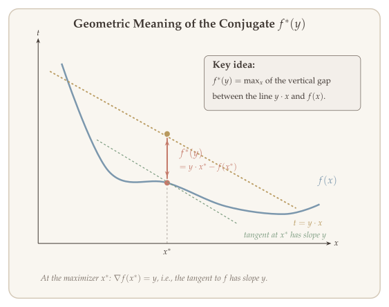
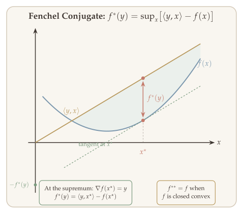
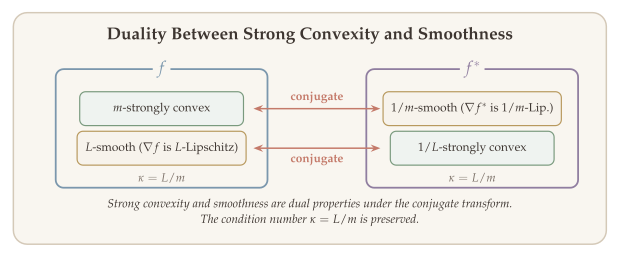

The convex conjugate is one of the most important constructions in convex analysis. In the previous chapter, we developed the Lagrangian framework for duality, proved strong duality under Slater's condition, and derived the KKT conditions. Here we develop a complementary viewpoint: the conjugate function provides a *dual representation* of any function, connects smoothness to strong convexity, and yields an elegant re-derivation of Lagrange duality. We then explore the practical aspects of duality theory.

## Convex Conjugate {#sec-convex-conjugate}

The convex conjugate is one of the most important constructions in convex analysis. It provides a *dual representation* of a function: just as every convex set can be described as an intersection of halfspaces, **every closed convex function can be described as a supremum of affine functions** --- and the conjugate encodes exactly this representation. Conjugates appear naturally in dual problems and connect strong convexity to smoothness.

::: {#def-convex-conjugate}
## Convex Conjugate

Given $f : \mathbb{R}^n \to \mathbb{R}$, its **conjugate function** is $f^* : \mathbb{R}^n \to \mathbb{R}$ defined by

$$
f^*(y) = \max_x \left\{ x^\top y - f(x) \right\}.
$$
:::

::: {.callout-tip}
## Remark: Convexity of the Conjugate

$f^*$ is always a convex function, even when $f$ is nonconvex. This is because $f^*$ is the pointwise maximization of linear (and hence convex) functions in $y$.
:::

### Geometric Meaning {#sec-conjugate-geometry}

The conjugate $f^*(y)$ has two useful geometric interpretations:

1. **Distance interpretation:** $f^*(y)$ is the maximum vertical distance between the line $t = x^\top y$ and the curve $t = f(x)$.

2. **Support hyperplane interpretation:** $f^*(y) = \sup\left\{ \binom{x}{t}^\top \binom{y}{-1} \;\middle|\; (x,t) \in \text{epi}(f) \right\}$. That is, $f^*(y)$ finds the support hyperplane $\binom{x}{t}^\top \binom{-y}{1} - a = 0$ of $\text{epi}(f)$.

The hyperplane at the point where the slope equals $y$ is $\{(x,t)^\top(-y,1) = a, \; a \in \mathbb{R}\}$.

**How to read @fig-conjugate-geometry and @fig-conjugate-function.** For a fixed slope $y$, draw the line $t = yx$ (gold, passing through the origin) and the curve $t = f(x)$ (blue). The conjugate $f^*(y)$ is the **maximum vertical gap** between the line and the curve, shown as the terracotta arrow at the maximizer $x^\star$. This gap equals $yx^\star - f(x^\star)$. At $x^\star$, the tangent to $f$ has the same slope as the line (both have slope $y$), so the gap is maximized where $\nabla f(x^\star) = y$. The green dashed tangent line at $x^\star$ has $t$-intercept $-f^*(y)$: this connects the conjugate to the supporting hyperplane of the epigraph of $f$. The shaded region shows where the line lies above $f$, with the maximum gap at $x^\star$.

{#fig-conjugate-geometry}

{#fig-conjugate-function}

### Interactive: Conjugate Function Construction {#sec-interactive-conjugate}

The interactive figure below lets you build the conjugate function geometrically. Choose a function $f$ from the dropdown, then drag the slope $y$. The left panel shows $f(x)$ and the line $yx$; the vertical gap at the maximizer is $f^*(y)$. The right panel traces the conjugate $f^*(y)$ as you sweep $y$.

```{=html}
<style>
  .interactive-figure-container {
    font-family: 'Palatino Linotype', 'Palatino', 'Book Antiqua', 'Georgia', serif;
    background: #f0ebe5;
    border-radius: 8px;
    padding: 24px 20px 16px 20px;
    margin: 28px auto;
    max-width: 1100px;
    box-shadow: 0 2px 12px rgba(61,53,48,0.08);
  }
  .interactive-figure-container h3 {
    font-family: 'Palatino Linotype', 'Palatino', 'Book Antiqua', 'Georgia', serif;
    color: #3d3530;
    font-size: 1.15em;
    font-weight: 600;
    margin: 0 0 6px 0;
    letter-spacing: 0.01em;
  }
  .interactive-figure-container .fig-subtitle {
    color: #968a80;
    font-size: 0.92em;
    margin: 0 0 16px 0;
    line-height: 1.5;
  }
  .interactive-figure-container .slider-row {
    display: flex;
    align-items: center;
    gap: 14px;
    margin: 14px 0 8px 0;
    flex-wrap: wrap;
  }
  .interactive-figure-container .slider-row label {
    font-size: 0.95em;
    color: #3d3530;
    min-width: 80px;
  }
  .interactive-figure-container .slider-row input[type="range"] {
    flex: 1;
    min-width: 180px;
    max-width: 420px;
    accent-color: #7b97ad;
    height: 6px;
  }
  .interactive-figure-container .slider-row .slider-value {
    font-size: 0.95em;
    color: #b8995e;
    font-weight: 600;
    min-width: 60px;
  }
  .interactive-figure-container .dropdown-row {
    display: flex;
    align-items: center;
    gap: 14px;
    margin: 10px 0 6px 0;
  }
  .interactive-figure-container .dropdown-row label {
    font-size: 0.95em;
    color: #3d3530;
  }
  .interactive-figure-container .dropdown-row select {
    font-family: 'Palatino Linotype', 'Palatino', 'Book Antiqua', 'Georgia', serif;
    font-size: 0.92em;
    padding: 4px 10px;
    border: 1px solid #e0d9d1;
    border-radius: 4px;
    background: #faf7f3;
    color: #3d3530;
  }
  .interactive-figure-container .panels {
    display: flex;
    gap: 12px;
    flex-wrap: wrap;
  }
  .interactive-figure-container .panels > div {
    flex: 1;
    min-width: 300px;
  }
  .interactive-figure-container .info-box {
    background: #faf7f3;
    border-left: 3px solid #7b97ad;
    border-radius: 0 4px 4px 0;
    padding: 10px 14px;
    margin: 10px 0 4px 0;
    font-size: 0.88em;
    color: #3d3530;
    line-height: 1.6;
  }
</style>
```

```{=html}
<div class="interactive-figure-container" id="fig2-wrapper">
  <h3>Conjugate Function Geometric Construction</h3>
  <p class="fig-subtitle">
    f*(y) = sup<sub>x</sub> { xy &minus; f(x) } &emsp;|&emsp;
    The conjugate is the largest intercept of the line with slope y that stays below f.
  </p>
  <div class="dropdown-row">
    <label for="fig2-func">Function:</label>
    <select id="fig2-func">
      <option value="x2" selected>f(x) = x&sup2;</option>
      <option value="exp">f(x) = e<sup>x</sup></option>
    </select>
  </div>
  <div class="slider-row">
    <label for="fig2-y">y (slope) =</label>
    <input type="range" id="fig2-y" min="-3" max="5" step="0.04" value="2.0">
    <span class="slider-value" id="fig2-y-val">2.00</span>
  </div>
  <div class="panels">
    <div id="fig2-left"></div>
    <div id="fig2-right"></div>
  </div>
  <div class="info-box" id="fig2-info">
    Drag the slider to change the slope y and watch the conjugate build up.
  </div>
</div>

<script>
(function() {
  const C = {
    bg: '#f0ebe5', plotBg: '#faf7f3', text: '#3d3530', grid: '#e0d9d1',
    axis: '#968a80', blue: '#7b97ad', gold: '#b8995e', sage: '#7a9a7e',
    terracotta: '#c47a6a', lavender: '#907ea0', rosewood: '#ad8480'
  };
  const font = {family: "'Palatino Linotype','Palatino','Book Antiqua','Georgia',serif", color: C.text};
  const axisStyle = {
    gridcolor: C.grid, gridwidth: 1, zerolinecolor: C.axis, zerolinewidth: 1.5,
    linecolor: C.axis, linewidth: 1, tickfont: {size: 14, ...font}, titlefont: {size: 16, ...font}
  };
  const plotConfig = {displayModeBar: false, responsive: true};

  const funcs = {
    x2: {
      f: x => x*x,
      xStarOfY: y => y/2,
      fStar: y => y*y/4,
      fStarLabel: '$f^*(y) = y^2/4$',
      xRange: [-3, 3],
      yFuncRange: [-0.5, 10],
      ySliderRange: [-3, 5],
      conjYRange: [-1, 7],
      conjXRange: [-3.2, 5.2]
    },
    exp: {
      f: x => Math.exp(x),
      xStarOfY: y => (y > 0) ? Math.log(y) : -Infinity,
      fStar: y => (y > 1e-8) ? y*Math.log(y) - y : 0,
      fStarLabel: '$f^*(y) = y \\ln y - y$',
      xRange: [-3, 3],
      yFuncRange: [-1, 12],
      ySliderRange: [-1, 5],
      conjYRange: [-2, 8],
      conjXRange: [-1.2, 5.2]
    }
  };

  let currentFunc = 'x2';

  function getXvals(range) {
    const v = [];
    for (let x = range[0]; x <= range[1]; x += 0.04) v.push(x);
    return v;
  }

  function makeLeftLayout(fc) {
    return {
      paper_bgcolor: C.bg, plot_bgcolor: C.plotBg, font: font, height: 440,
      margin: {t: 44, b: 58, l: 64, r: 16},
      title: {text: '$f(x)$ and the line $yx$', font: {size: 17, ...font}},
      xaxis: {...axisStyle, title: '$x$', range: fc.xRange},
      yaxis: {...axisStyle, title: '', range: fc.yFuncRange},
      showlegend: true,
      legend: {x: 0.02, y: 0.98, bgcolor: 'rgba(250,247,243,0.85)', bordercolor: C.grid, borderwidth: 1, font: {size: 13, ...font}},
      hovermode: 'closest'
    };
  }

  function makeRightLayout(fc) {
    return {
      paper_bgcolor: C.bg, plot_bgcolor: C.plotBg, font: font, height: 440,
      margin: {t: 44, b: 58, l: 64, r: 16},
      title: {text: 'Conjugate $f^*(y)$', font: {size: 17, ...font}},
      xaxis: {...axisStyle, title: '$y$', range: fc.conjXRange},
      yaxis: {...axisStyle, title: '$f^*(y)$', range: fc.conjYRange},
      showlegend: true,
      legend: {x: 0.02, y: 0.98, bgcolor: 'rgba(250,247,243,0.85)', bordercolor: C.grid, borderwidth: 1, font: {size: 13, ...font}},
      hovermode: 'closest'
    };
  }

  function updateFig2(y) {
    const fc = funcs[currentFunc];
    const xVals = getXvals(fc.xRange);
    const fVals = xVals.map(x => fc.f(x));
    const lineVals = xVals.map(x => y * x);
    const xStar = fc.xStarOfY(y);
    const fStarY = fc.fStar(y);
    const isFinite = Math.abs(xStar) < 100;
    const tangentVals = xVals.map(x => y * x - fStarY);

    const fAtStar = isFinite ? fc.f(xStar) : 0;
    const leftTraces = [
      {x: xVals, y: fVals, mode: 'lines', line: {color: C.blue, width: 2.5}, name: '$f(x)$'},
      {x: xVals, y: lineVals, mode: 'lines', line: {color: C.gold, width: 2, dash: 'dash'}, name: '$yx$ (slope $= y$)'},
      {x: xVals, y: tangentVals, mode: 'lines', line: {color: C.sage, width: 1.5, dash: 'dot'}, name: '$yx - f^*(y)$'},
      {x: isFinite ? [xStar, xStar] : [], y: isFinite ? [fAtStar, y * xStar] : [],
        mode: 'lines', line: {color: C.terracotta, width: 2.5},
        name: '$\\text{Gap} = f^*(y) = ' + fStarY.toFixed(2) + '$', showlegend: isFinite, visible: isFinite},
      {x: isFinite ? [xStar] : [], y: isFinite ? [fAtStar] : [],
        mode: 'markers', marker: {size: 10, color: C.terracotta, line: {width: 1.5, color: C.text}},
        name: '$x^*$', showlegend: false, visible: isFinite},
      {x: isFinite ? [xStar] : [], y: isFinite ? [y * xStar] : [],
        mode: 'markers', marker: {size: 10, color: C.gold, symbol: 'diamond', line: {width: 1.5, color: C.text}},
        showlegend: false, visible: isFinite}
    ];

    const yMin = (currentFunc === 'exp') ? 0.02 : fc.conjXRange[0];
    const yMax = fc.conjXRange[1];
    const conjYVals = [];
    const conjFStarVals = [];
    for (let yy = yMin; yy <= yMax; yy += 0.04) {
      conjYVals.push(yy);
      conjFStarVals.push(fc.fStar(yy));
    }

    const conjYTraced = [];
    const conjFStarTraced = [];
    for (let yy = yMin; yy <= y + 0.001; yy += 0.04) {
      if (yy <= yMax) {
        conjYTraced.push(yy);
        conjFStarTraced.push(fc.fStar(yy));
      }
    }

    const showPt = isFinite && y >= yMin;
    const rightTraces = [
      {x: conjYVals, y: conjFStarVals, mode: 'lines', line: {color: C.lavender, width: 1.5, dash: 'dot'}, name: fc.fStarLabel + ' (full)', opacity: 0.4},
      {x: conjYTraced, y: conjFStarTraced, mode: 'lines', line: {color: C.lavender, width: 2.5}, name: fc.fStarLabel},
      {x: showPt ? [y] : [], y: showPt ? [fStarY] : [],
        mode: 'markers+text', marker: {size: 11, color: C.gold, line: {width: 2, color: C.text}},
        text: showPt ? ['$(' + y.toFixed(1) + ',\\,' + fStarY.toFixed(2) + ')$'] : [],
        textposition: 'top left', textfont: {size: 14, color: C.gold, ...font},
        name: 'Current point', showlegend: false, visible: showPt}
    ];

    const infoText = isFinite
      ? 'At y = ' + y.toFixed(2) + ':&emsp; x*(y) = ' + xStar.toFixed(3) + '&emsp;|&emsp; f*(y) = sup<sub>x</sub>{xy − f(x)} = ' + fStarY.toFixed(3)
      : 'At y = ' + y.toFixed(2) + ':&emsp; f*(y) is not finite (supremum is unbounded)';
    document.getElementById('fig2-info').innerHTML = infoText;

    Plotly.react('fig2-left', leftTraces, makeLeftLayout(fc), plotConfig);
    Plotly.react('fig2-right', rightTraces, makeRightLayout(fc), plotConfig);
  }

  function resetSliderRange() {
    const fc = funcs[currentFunc];
    const slider = document.getElementById('fig2-y');
    slider.min = fc.ySliderRange[0];
    slider.max = fc.ySliderRange[1];
    if (currentFunc === 'exp') {
      slider.min = 0.04;
      slider.value = 2.0;
    } else {
      slider.value = 2.0;
    }
    document.getElementById('fig2-y-val').textContent = parseFloat(slider.value).toFixed(2);
    updateFig2(parseFloat(slider.value));
  }

  document.getElementById('fig2-y').addEventListener('input', function() {
    const y = parseFloat(this.value);
    document.getElementById('fig2-y-val').textContent = y.toFixed(2);
    updateFig2(y);
  });

  document.getElementById('fig2-func').addEventListener('change', function() {
    currentFunc = this.value;
    resetSliderRange();
  });

  updateFig2(2.0);
})();
</script>
```

### Properties of the Conjugate {#sec-conjugate-properties}

We now list the key properties of the convex conjugate.

**Property 1: Fenchel's Inequality.** For all $x, y$,

$$
f(x) + f^*(y) \geq x^\top y.
$$

**Property 2: Biconjugate Inequality.** The conjugate of the conjugate $f^{**}$ satisfies $f^{**} \leq f$.

**Property 3: Biconjugate of Closed Convex Functions.** If $f$ is closed and convex, then $f^{**} = f$.

Here "closed" means $\{x : f(x) \leq \alpha\}$ is a closed set for all $\alpha$.

**Property 4: Subdifferential Correspondence.** If $f$ is closed, convex, and for any $x, y$,

$$
x = \partial f^*(y) \iff y = \partial f(x) \iff f(x) + f^*(y) = x^\top y.
$$

Here $\partial f$ denotes the subdifferential (treat as $\nabla f$ when $f$ is differentiable).

**Property 5: Separable Sum.** If $f(u,v) = f_1(u) + f_2(v)$, then

$$
f^*(w,z) = f_1^*(w) + f_2^*(z).
$$

::: {.proof}
We prove Property 4 using duality. Consider

$$
\min_y f(y) \quad \text{s.t.} \quad y = x, \quad p^* = f(x).
$$

The Lagrangian is $\mathcal{L}(y,z) = f(y) - z^\top(y - x)$, and the dual function is

$$
g(z) = -(z^\top y - f(y)) + z^\top x = -f^*(z) + z^\top x.
$$

The dual problem is $\sup_z g(z) = f^{**}(x)$, i.e., $d^* = f^{**}(x)$.

By weak duality, $f(x) \geq f^{**}(x)$.

If $f$ is convex, strong duality holds, so $f(x) = f^{**}(x)$.

When $f$ is convex and differentiable with $y = \nabla f(x)$, the first-order condition $y - \nabla f(u) = 0$ gives $x$ as the argmax, so $f^*(y) = x^\top y - f(x)$, which implies $f^*(y) + f(x) = x^\top y$.

For any $v \in \mathbb{R}^n$,

$$
\begin{aligned}
f^*(v) &= \sup_u \{ u^\top v - f(u) \} \\
&\geq v^\top x - f(x) \\
&= x^\top(v - y) - f(x) + x^\top y \\
&= f^*(y) + x^\top(v - y).
\end{aligned}
$$

By the first-order characterization of differentiable convex functions, $f^*(v) \geq f^*(y) + \langle \nabla f^*(y), v - y \rangle$, so $x = \nabla f^*(y)$.

What we showed: if $y = \nabla f(x)$, then $x = \nabla f^*(y)$ and $x^\top y = f(x) + f^*(y)$. To get the other direction, apply the same argument to $f^*$. $\blacksquare$
:::

### Examples of Conjugate Functions {#sec-conjugate-examples}

::: {#exm-conjugate-indicator}
## Indicator Function

Let $f(x) = I_C(x) = \begin{cases} 0 & x \in C \\ \infty & x \notin C. \end{cases}$

Then

$$
f^*(y) = \sup_x \left\{ x^\top y - I_C(x) \right\} = \sup_{x \in C} x^\top y = S_C(y),
$$

which is the **support function** of $C$. Thus, **the conjugate of an indicator function is the support function, and conversely, the conjugate of a support function is the indicator** --- a fundamental duality between set membership and linear optimization over the set.
:::

::: {#exm-conjugate-norm}
## Norm Function

Let $f(x) = \|x\|$. Then $\|x\| = \sup_{\|u\|_* \leq 1} \{ u^\top x \}$, which is the support function of $\{u : \|u\|_* \leq 1\}$. Therefore,

$$
f^*(x) = I\{x : \|x\|_* \leq 1\}.
$$
:::

::: {#exm-conjugate-quadratic}
## Quadratic Function

Let $f(x) = \frac{1}{2} x^\top A x + b^\top x + c$ with $A \succ 0$. Then

$$
f^*(y) = \frac{1}{2}(y - b)^\top A^{-1}(y - b) - c.
$$

In the general case ($A \succeq 0$),

$$
f^*(y) = \frac{1}{2}(y - b)^\top A^+(y - b) - c, \quad A^+ \text{: pseudo-inverse},
$$

with $\text{dom}(f^*) = \text{Range}(A) + b = \{v = Ax + b : x \in \mathbb{R}^n\}$.
:::

::: {#exm-conjugate-negentropy}
## Negative Entropy

Let $f(x) = \sum_{i=1}^n x_i \cdot \log x_i$. Then

$$
f^*(y) = \sum_{i=1}^n e^{y_i - 1}.
$$
:::

### Calculus Rules for Conjugate Functions {#sec-conjugate-calculus}

These rules allow us to compute conjugates of complicated functions from simpler ones.

**Rule 1: Separable Sum.** If $f(x_1, x_2) = g(x_1) + h(x_2)$, then

$$
f^*(y_1, y_2) = g^*(y_1) + h^*(y_2).
$$

**Rule 2: Scalar Multiplication.** For $\alpha > 0$:

- If $f(x) = \alpha \cdot g(x)$, then $f^*(y) = \alpha \cdot g^*(y/\alpha)$.
- If $f(x) = \alpha \cdot g(x/\alpha)$, then $f^*(y) = \alpha \cdot g^*(y)$.

**Rule 3: Addition of Linear Function.** If $f(x) = g(x) + a^\top x + b$, then

$$
f^*(y) = g^*(y - a) - b.
$$

**Rule 4: Translation.** If $f(x) = g(x - b)$, then

$$
f^*(y) = b^\top y + g^*(y).
$$

**Rule 5: Composition with Invertible Linear Mapping.** If $f(x) = g(Ax)$, then

$$
f^*(y) = g^*(A^{-\top} y).
$$

**Rule 6: Infimal Convolution.** If $f(x) = \inf_{u + v = x} \{g(u) + h(v)\}$, then

$$
\begin{aligned}
f^*(y) &= \sup_x \left\{ x^\top y - \inf_{u+v=x} \{g(u) + h(v)\} \right\} \\
&= \sup_{u,v} \left\{ (u+v)^\top y - g(u) - h(v) \right\} \\
&= g^*(y) + h^*(y).
\end{aligned}
$$

Therefore $f^*(y) = g^*(y) + h^*(y)$.

### Conjugate Function of Strongly Convex Functions {#sec-conjugate-strongly-convex}

There is a deep connection between strong convexity and smoothness through the conjugate: **the conjugate of a strongly convex function is smooth, and vice versa**.

Recall that $f$ is $m$-strongly convex means $f - \frac{1}{2}m\|x\|^2$ is convex. This implies:

$$
\begin{aligned}
&\langle \nabla f(x) - \nabla f(y), x - y \rangle \geq m \cdot \|x - y\|_2^2, \\
&f(y) \geq f(x) + \langle \nabla f(x), y - x \rangle + \frac{m}{2}\|x - y\|^2.
\end{aligned}
$$

::: {#lem-conjugate-smooth}
## Conjugate of Strongly Convex Function

When $f$ is $m$-strongly convex, then:

- $f^*$ is differentiable, with $\nabla f^*(y) = \arg\max_x \{ y^\top x - f(x) \}$.
- $f^*$ is $\frac{1}{m}$-smooth, i.e., $\nabla f^*$ is $\frac{1}{m}$-Lipschitz:
$$
\|\nabla f^*(y_1) - \nabla f^*(y_2)\|_2 \leq \frac{1}{m} \cdot \|y_1 - y_2\|_2.
$$
:::

The key idea is that $y \in \nabla f(x) \iff x \in \nabla f^*(y)$, and then we apply monotonicity of $\nabla f$.

::: {.proof}
If $f$ is strongly convex, then $\{x^\top y - f(x)\}$ has a unique maximizer. The argmax satisfies $y = \nabla f(x)$, so $x = \nabla f^*(y)$ (by the property of $f^*$). That is,

$$
\nabla f^*(y) = \arg\max_x \{ x^\top y - \nabla f(x) \}.
$$

Moreover, to see that $\nabla f^*$ is Lipschitz, take any two points $x, x'$. Let $y = \nabla f(x)$ and $y' = \nabla f(x')$. Then $x = \nabla f^*(y)$ and $x' = \nabla f^*(y')$.

Strong convexity implies that

$$
m \cdot \|x - x'\|_2^2 \leq \langle x - x', y - y' \rangle \leq \|x - x'\| \cdot \|y - y'\|.
$$

Therefore

$$
\frac{1}{m}\|y - y'\|_2 \geq \|x - x'\|_2 = \|\nabla f^*(y) - \nabla f^*(y')\|_2.
$$

Thus $\nabla f^*$ is $\frac{1}{m}$-Lipschitz. $\blacksquare$
:::

::: {.callout-tip}
## Remark: General Duality Between Strong Convexity and Smoothness

$f$ is $m$-strongly convex with respect to a norm $\|\cdot\|$ if and only if $f^*$ is $\frac{1}{m}$-smooth with respect to the dual norm $\|\cdot\|_*$.
:::

{#fig-strong-convexity-smoothness}


## Duality via Conjugates {#sec-duality-via-conjugates}

Conjugate functions often appear in dual problems via the **key identity**

$$
-f^*(u) = \inf_x \{ f(x) - u^\top x \},
$$

which often appears when finding the Lagrange dual function.

::: {#exm-conjugate-dual-sum}
## Dual of Sum Minimization

Consider

$$
\min_x \; f(x) + h(x).
$$

This is equivalent to

$$
\min_{x,y} \; f(x) + h(y) \quad \text{s.t.} \quad x = y.
$$

The dual function is

$$
g(\mu) = \inf_{x,y} \left\{ f(x) + h(y) - (x - y)^\top \mu \right\} = -f^*(\mu) - h^*(-\mu).
$$

The dual problem is therefore

$$
\max_\mu \left\{ -f^*(\mu) - h^*(-\mu) \right\}.
$$
:::

::: {#exm-conjugate-dual-norm}
## Dual with Norm Regularization

Let $h(x) = \|x\|$. Then $h^*(\mu) = I\{\|\mu\|_* \leq 1\}$.

- **Primal:** $\min_x \; f(x) + \|x\|$.
- **Dual:** $\max_\mu \; -f^*(\mu) \quad \text{s.t.} \quad \|\mu\|_* \leq 1$.
:::

::: {#exm-conjugate-dual-constraint}
## Dual with Constraint Set

Let $h(x) = I_C(x) = \begin{cases} 0 & x \in C \\ \infty & x \notin C. \end{cases}$

- **Primal:** $\min_x \; f(x) + I_C(x)$.
- **Dual:** $\max_\mu \; -f^*(\mu) - S_C(-\mu)$,

where $S_C(u) = \sup_{x \in C} x^\top u$ is the support function.
:::

### Dual of Dual is Primal {#sec-dual-of-dual}

A beautiful structural result in convex optimization: **taking the dual of the dual problem recovers the primal**. The proof uses two ingredients --- the indicator--support correspondence and the biconjugate identity --- applied to the abstract form of convex optimization.

#### Ingredient 1: Indicator--Support Correspondence {.unnumbered}

From @exm-conjugate-indicator, we know $I_C^* = S_C$: the conjugate of the indicator function is the support function. We now show the converse: **$S_C^* = I_C$** when $C$ is closed and convex. That is, the indicator and support functions are conjugates of each other.

::: {.proof}
We compute $S_C^*(x) = \sup_y \{ y^\top x - S_C(y) \}$ by considering two cases.

- **$x \in C$:** Since $S_C(y) = \sup_{w \in C} w^\top y \geq y^\top x$, we have $y^\top x - S_C(y) \leq 0$ for all $y$. Taking $y = 0$ gives $S_C^*(x) = 0 = I_C(x)$.
- **$x \notin C$:** By the strict separating hyperplane theorem, there exists $w$ such that $w^\top x > \sup_{u \in C} w^\top u$. Setting $y = tw$ and letting $t \to \infty$ gives $S_C^*(x) = +\infty = I_C(x)$. $\blacksquare$
:::

Together with the biconjugate identity $f^{**} = f$ for closed convex functions, we have:

| Function | Conjugate | Biconjugate |
|:---------|:----------|:------------|
| $f$ (closed convex) | $f^*$ | $f^{**} = f$ |
| $I_C$ (indicator) | $S_C$ (support) | $S_C^* = I_C$ |

: Both $f$ and $I_C$ are involutions under double conjugation. {.hover}

#### Ingredient 2: Duality of Abstract Convex Optimization {.unnumbered}

Any constrained convex problem can be written in the abstract form:

$$
\text{(P)}: \quad \min_x \; f(x) + I_C(x).
$$

By @exm-conjugate-dual-sum, the dual of $\min_x \{f(x) + h(x)\}$ is $\max_u \{-f^*(u) - h^*(-u)\}$. Applying this with $h = I_C$ and $h^* = S_C$:

$$
\text{(D)}: \quad \max_u \; \bigl\{-f^*(u) - S_C(-u)\bigr\} \quad \iff \quad -\min_u \; \bigl\{f^*(u) + S_C(-u)\bigr\}.
$$

#### Applying Duality Again {.unnumbered}

The dual problem (D) is itself an unconstrained minimization of two terms: $h_1(u) = f^*(u)$ and $h_2(u) = S_C(-u)$. Applying the sum duality formula a second time:

$$
\text{(DD)}: \quad \min_w \; \bigl\{h_1^*(w) + h_2^*(-w)\bigr\}.
$$

Now we use both ingredients to compute each conjugate:

- $h_1 = f^* \implies h_1^* = f^{**} = f$ (biconjugate identity).
- $h_2(u) = S_C(-u) \implies h_2^*(w) = S_C^*(-w) = I_C(-w)$, so $h_2^*(-w) = I_C(w)$ (indicator--support correspondence + translation rule).

Substituting:

$$
\text{(DD)} = \min_w \; \bigl\{f(w) + I_C(w)\bigr\} = \text{(P)}.
$$

::: {.callout-tip}
## Remark: Dual of Dual = Primal

For closed convex functions and closed convex constraint sets, taking the dual of the dual problem recovers the original primal problem. The proof is purely algebraic: apply the sum duality formula twice, and the two conjugations cancel via $f^{**} = f$ and $S_C^* = I_C$.
:::

### Dual Formulations Shift Linear Mappings {#sec-dual-linear-shift}

An important practical feature of duality is that **it shifts linear transformations between different parts of the problem** --- a matrix $A$ appearing in the primal objective moves to the dual constraints, and vice versa.

::: {#exm-linear-shift}
## Linear Mapping in Dual

Consider

$$
\min_x \; f(x) + g(Ax).
$$

This is equivalent to

$$
\min_{x,z} \; f(x) + g(z) \quad \text{s.t.} \quad Ax = z. \qquad \text{(P)}
$$

The dual problem is

$$
\max_u \; -f^*(A^\top u) - g^*(-u).
$$

For example:

- **Primal:** $\min_x \; f(x) + \|Ax\|$.
- **Dual:** $\max_u \; -f^*(A^\top u) \quad \text{s.t.} \quad \|u\|_* \leq 1$.
:::


### More Examples of Dual Problems {#sec-more-dual-examples}

Equivalent formulations of the same primal problem can have different dual problems. We illustrate three useful techniques.

#### Technique 1: Adding an Equality Constraint {#sec-add-equality}

Consider $\min_x \; \ell(x) = f(Ax + b)$ with $x$ free.

The dual function is $g = \inf_x \mathcal{L}(x) = \inf_x \ell(x) = p^*$, which is a constant --- not useful.

**Reformulate** by introducing an auxiliary variable:

$$
\min_{x,y} \; f(y) \quad \text{s.t.} \quad Ax + b = y.
$$

The Lagrangian is $\mathcal{L}(x,y,\mu) = f(y) + \mu^\top(Ax + b - y)$.

The dual function is

$$
g(\mu) = \begin{cases} \inf_y \left\{ f(y) + \mu^\top(b - y) \right\} & \text{if } A^\top \mu = 0, \\ -\infty & \text{o/w.} \end{cases}
$$

Recall that $\sup_y \{z^\top y - f(y)\} = f^*(z)$, so $\inf_y \{f(y) - \mu^\top y\} = -f^*(\mu)$. Thus

$$
g(\mu) = \begin{cases} b^\top \mu - f^*(\mu) & \text{if } A^\top \mu = 0, \\ -\infty & \text{o/w.} \end{cases}
$$

The dual problem is

$$
\max_\mu \; b^\top \mu - f^*(\mu) \quad \text{s.t.} \quad A^\top \mu = 0.
$$

::: {#exm-norm-minimization}
## Norm Minimization $\min \|Ax - b\|$

Here $\|\cdot\|$ is a norm. Let $f(u) = \|u\|$, so $\|u\|_* = \sup\{u^\top v : \|v\| \leq 1\}$ is the dual norm.

$$
f^*(u) = \sup_v \{ u^\top v - \|v\| \} = \begin{cases} 0 & \|u\|_* \leq 1, \\ +\infty & \text{o/w.} \end{cases}
$$

- **Primal:** $\min_y \|y\| \quad \text{s.t.} \; Ax - b = y$.
- **Dual:** $\max_\mu \; -b^\top \mu \quad \text{s.t.} \; \|\mu\|_* \leq 1, \; A^\top \mu = 0$.
:::

#### Technique 2: Generalizing with Composite Constraints {#sec-composite-constraints}

This idea can be generalized. Suppose the primal problem is

$$
\min_x \; f_0(A_0 x + b_0) \quad \text{s.t.} \quad f_i(A_i x + b_i) \leq 0, \quad i = 1, 2, \ldots, m.
$$

Introduce auxiliary variables $y_i$:

$$
\min_x \; f_0(y_0) \quad \text{s.t.} \quad f_i(y_i) \leq 0, \quad A_0 x + b_0 = y_0, \quad A_i x + b_i = y_i \;\; \forall\, i \in [m].
$$

The Lagrangian with multipliers $\lambda_i$ for inequality constraints and $\mu_0, \mu_i$ for equality constraints is:

$$
\mathcal{L}(x, \vec{y}, \lambda, \vec{\mu}) = f_0(y_0) + \sum_i \lambda_i f_i(y_i) + \mu_0^\top(A_0 x + b_0 - y_0) + \sum_i \mu_i^\top(A_i x + b_i - y_i).
$$

Minimizing over $x$ requires $\sum_{i=0}^{m} A_i^\top \mu_i = 0$.

Then, assuming $\lambda > 0$ for now,

$$
\begin{aligned}
&\inf_{y_0, \ldots, y_m} \left\{ f_0(y_0) - \mu_0^\top y_0 + \sum_{i=1}^{m} \lambda_i \left( f_i(y_i) - \frac{\mu_i^\top}{\lambda_i} \cdot y_i \right) \right\} \\
&= -f_0^*(\mu_0) - \sum_{i=1}^{m} \lambda_i \cdot f_i^*(\mu_i / \lambda_i).
\end{aligned}
$$

The dual problem is

$$
\max_{\lambda, \mu} \; \sum_{i=0}^{m} \mu_i^\top b_i - f_0^*(\mu_0) - \sum_{i=1}^{m} \lambda_i \cdot f_i^*(\mu_i / \lambda_i) \quad \text{s.t.} \quad \lambda \geq 0, \quad \sum_{i=0}^{m} A_i^\top \mu_i = 0.
$$

::: {.callout-tip}
## Remark: Convention for $\lambda_i = 0$

If $\lambda_i = 0$ and $\mu_i \neq 0$, we can set $y_i$ such that $\mathcal{L} \to -\infty$. If $\lambda_i = 0$ and $\mu_i = 0$, we do not need to worry about the term involving $(y_i, \mu_i, \lambda_i)$. So we adopt the convention:

$$
\lambda_i \cdot f_i^*(\mu_i / \lambda_i) = \begin{cases} +\infty & \text{if } \mu_i \neq 0, \; \lambda_i = 0, \\ 0 & \text{if } \mu_i = 0, \; \lambda_i = 0. \end{cases}
$$
:::

#### Technique 3: Transforming the Objective {#sec-transform-objective}

Different formulations of the same primal can lead to different duals.

::: {#exm-norm-vs-squared}
## $\min \|Ax - b\|$ vs. $\min \frac{1}{2}\|Ax - b\|^2$

**Previous case** ($\min \|Ax - b\|$):

- Primal: $\min_y \|y\| \quad \text{s.t.} \; Ax - b = y$.
- Dual: $\max_\mu \; -b^\top \mu \quad \text{s.t.} \; \|\mu\|_* \leq 1, \; A^\top \mu = 0$.

**Now consider** $\min \frac{1}{2}\|Ax - b\|^2$:

- Primal: $\min_y \frac{1}{2}\|y\|^2 \quad \text{s.t.} \; Ax - b = y$.
- Lagrangian: $\mathcal{L}(x,y,\mu) = \frac{1}{2}\|y\|^2 + \mu^\top(Ax - b - y)$.

The dual function is (when $A^\top \mu = 0$):

$$
g(\mu) = \inf_y \left\{ \frac{1}{2}\|y\|^2 - \mu^\top y - b^\top \mu \right\} = -\frac{1}{2}\|\mu\|_*^2 - b^\top \mu.
$$

Here we used the fact that the conjugate of $f(y) = \frac{1}{2}\|y\|^2$ is $f^*(\mu) = \frac{1}{2}\|\mu\|_*^2$. We derive this now:

$$
f^*(\mu) = \sup_y \left\{ \mu^\top y - \tfrac{1}{2}\|y\|^2 \right\}.
$$

The objective is concave in $y$. Setting the gradient to zero: $\mu = y^*$, giving $f^*(\mu) = \mu^\top \mu - \frac{1}{2}\|\mu\|^2 = \frac{1}{2}\|\mu\|^2$. This works for the $\ell_2$-norm. For a general norm $\|\cdot\|$, write $\|y\|^2 = (\|y\|)^2$ and use the variational representation $\|y\| = \sup_{\|z\|_* \leq 1} z^\top y$:

$$
f^*(\mu) = \sup_y \left\{ \mu^\top y - \tfrac{1}{2}\|y\|^2 \right\}.
$$

For any $y$, the generalized Cauchy--Schwarz inequality gives $\mu^\top y \leq \|\mu\|_* \cdot \|y\|$, so

$$
\mu^\top y - \tfrac{1}{2}\|y\|^2 \leq \|\mu\|_* \cdot \|y\| - \tfrac{1}{2}\|y\|^2 \leq \sup_{r \geq 0} \left\{ \|\mu\|_* \cdot r - \tfrac{1}{2}r^2 \right\} = \tfrac{1}{2}\|\mu\|_*^2,
$$

where the last step optimizes over $r = \|y\|$ with maximizer $r^* = \|\mu\|_*$. The upper bound is attained by choosing $y^*$ such that $\|y^*\| = \|\mu\|_*$ and $\mu^\top y^* = \|\mu\|_* \cdot \|y^*\|$ (i.e., $y^*$ aligns with $\mu$ in the sense of the generalized Cauchy--Schwarz). Therefore $f^*(\mu) = \frac{1}{2}\|\mu\|_*^2$.
:::

## Conjugate Viewpoint on Practical Duality {#sec-using-duality}

The conjugate function provides a unified lens through which the practical aspects of duality become transparent. Each of the key duality tools --- optimality certificates, primal recovery, and structural correspondences --- can be understood through conjugate calculus.

**Duality gap as Fenchel's inequality.** For $x$ primal feasible, $\lambda \geq 0$, and $\mu \in \mathbb{R}^p$,

$$
f(x) - p^* \leq \underbrace{f(x) - g(\lambda, \mu)}_{\text{duality gap of } (x, \lambda, \mu)}.
$$

When the duality gap is small, $x$ is **approximately optimal** --- the gap serves as a **computable certificate of optimality**. Through the conjugate lens, the duality gap is an instance of Fenchel's inequality: $f(x) + f^*(y) \geq x^\top y$, with equality precisely at optimality (the subdifferential correspondence $y \in \partial f(x)$).

**Primal recovery via the conjugate gradient.** Given dual solution $(\lambda^*, \mu^*)$, when strong duality holds, **the primal solution can be recovered by minimizing the Lagrangian**:

$$
x^* \in \arg\min_x \mathcal{L}(x, \lambda^*, \mu^*).
$$

In the conjugate framework, this is the subdifferential correspondence: $x^* = \nabla f^*(\lambda^*)$ when $f$ is strongly convex. The primal and dual solutions are linked by $\nabla f$ and $\nabla f^*$ being inverses of each other.

### Structural Correspondences {#sec-primal-dual-relationships}

The conjugate reveals systematic relationships between primal and dual problems:

1. **Number of dual variables** $=$ **number of primal constraints.** Each constraint introduces a Lagrange multiplier, which becomes a dual variable in $g(\lambda) = -f^*(\cdot)$.

2. **Norm $\|\cdot\|$ in (P)** $\implies$ **dual norm $\|\cdot\|_*$ in (D).** This follows from the conjugate pair $(\|\cdot\|)^* = I_{\|\cdot\|_* \leq 1}$: a norm penalty in the primal becomes a dual norm constraint in the dual.

3. **Condition number preserved:** $\kappa = L/m$ is the same for $f$ and $f^*$. This is immediate from the smoothness--strong convexity duality (@lem-conjugate-smooth): if $f$ is $m$-strongly convex and $L$-smooth, then $f^*$ is $\frac{1}{L}$-strongly convex and $\frac{1}{m}$-smooth, giving $\kappa(f^*) = (1/m)/(1/L) = L/m = \kappa(f)$.

4. **Linear transformations shift between terms.** As shown in @sec-dual-linear-shift, a matrix $A$ in the primal objective $f(x) + g(Ax)$ moves to the dual constraints via conjugate composition: $g^*(A^{-\top}u)$.

### Dual Norms {#sec-dual-norms}

Let $\|\cdot\|$ be a norm (e.g., vector or matrix norm).

- **$\ell_p$-norm:** $\|x\|_p = \left(\sum_{i=1}^{n} |x_i|^p\right)^{1/p}$, $p \geq 1$. Also $\|x\|_\infty = \max_{i \in [n]} |x_i|$.
- **Operator norm:** $\|X\|_{\text{op}} = \sqrt{\lambda_{\max}(X^\top X)} = \sigma_1(X)$.

::: {#def-dual-norm}
## Dual Norm

The **dual norm** $\|x\|_*$ is defined as

$$
\|x\|_* = \sup_{y:\, \|y\| \leq 1} \langle x, y \rangle,
$$

where:

- For $x \in \mathbb{R}^n$: $x^\top y = \sum_{i=1}^{n} x_i y_i = \langle x, y \rangle$.
- For $X \in \mathbb{R}^{m \times n}$: $\langle X, Y \rangle = \text{tr}(X^\top Y)$.
:::

**Property (Generalized Cauchy--Schwarz):**

$$
|\langle x, y \rangle| \leq \|x\| \cdot \|y\|_*.
$$

**Examples of dual norms:**

- $(\|\cdot\|_p)_* = \|\cdot\|_q$ where $\frac{1}{p} + \frac{1}{q} = 1$.
- $(\|\cdot\|_{\text{op}})_* = \|\cdot\|_{\text{nuc}}$ (nuclear norm), where $\|X\|_{\text{nuc}} = \sum_{i=1}^{r} \sigma_i(X)$ and $r = \text{rank}(X)$.

**Property:** $(\|\cdot\|_*)_* = \|\cdot\|$. **The dual norm of the dual norm is itself** --- an involution analogous to $f^{**} = f$.

::: {.proof}
Consider the problem

$$
\text{(P)}: \quad \min_y \|y\| \quad \text{s.t.} \quad y = x, \qquad p^* = \|x\|.
$$

The Lagrangian is $\mathcal{L}(x,\mu) = \|y\| + \mu^\top(y - x)$.

- If $\|\mu\|_* > 1$: $\min_y \{\|y\| + \mu^\top y\} = -\infty$. Why? Let $\mu^* = \arg\max_{z:\, \|z\| \leq 1} \mu^\top z$. Then $(\mu^*)^\top \mu = \|\mu\|_*$. Set $y = -t \cdot \mu^*$, so $\|y\| + \mu^\top y = t(1 - \|\mu\|_*) \to -\infty$.

- If $\|\mu\|_* \leq 1$: $\min_y \{\|y\| + \mu^\top y\} = 0$.
  - (i) $|\mu^\top y| \leq \|y\|$, so $\|y\| + \mu^\top y \geq 0$.
  - (ii) Setting $y = 0$ gives the value $0$.

The Lagrange dual is therefore $\max_\mu \; -\mu^\top x$ subject to $\|\mu\|_* \leq 1$, and $d^* = (\|x\|_*)_*$ by definition of the dual norm.

By strong duality: $p^* = \|x\| = d^* = (\|x\|_*)_*$.

This completes the proof. $\blacksquare$
:::

## Summary {.unnumbered}

- The **convex conjugate** $f^*(y) = \sup_x \{y^\top x - f(x)\}$ provides a dual representation of any function; key examples include the conjugate of $\frac{1}{2}\|x\|^2$ (itself) and the indicator function (support function).
- Conjugate calculus rules (separable sum, scalar multiplication, linear shift, infimal convolution) allow efficient computation of dual problems from primal formulations.
- **Smoothness and strong convexity are dual**: if $f$ is $\mu$-strongly convex, then $f^*$ is $(1/\mu)$-smooth, and vice versa --- a correspondence that underlies many algorithm design principles.
- The **dual norm** $\|z\|_* = \sup_{\|x\| \leq 1} z^\top x$ arises naturally in duality; strong duality proves that $(\|\cdot\|_*)_* = \|\cdot\|$, i.e., the dual of the dual norm recovers the original norm.

### Common Conjugate Pairs {.unnumbered}

| $f(x)$ | $f^*(y)$ | Domain of $f^*$ |
|:--------|:---------|:-----------------|
| $\frac{1}{2}\|x\|^2$ | $\frac{1}{2}\|y\|_*^2$ | $\mathbb{R}^n$ |
| $\frac{1}{2}x^\top A x + b^\top x + c$ ($A \succ 0$) | $\frac{1}{2}(y-b)^\top A^{-1}(y-b) - c$ | $\mathbb{R}^n$ |
| $I_C(x)$ (indicator of convex $C$) | $S_C(y) = \sup_{x \in C} x^\top y$ (support function) | $\mathbb{R}^n$ |
| $\|x\|$ (any norm) | $I\{y : \|y\|_* \leq 1\}$ (indicator of dual unit ball) | $\{y : \|y\|_* \leq 1\}$ |
| $\sum_i x_i \log x_i$ (negative entropy) | $\sum_i e^{y_i - 1}$ | $\mathbb{R}^n$ |
| $e^x$ (scalar) | $y \log y - y$ | $y > 0$ |
| $-\log x$ (scalar, $x > 0$) | $-1 - \log(-y)$ | $y < 0$ |

: Common conjugate function pairs. {.striped .hover}

### Conjugate Calculus Rules {.unnumbered}

| Operation on $f$ | Conjugate $f^*$ | Condition |
|:------------------|:----------------|:----------|
| $\alpha \cdot g(x)$, $\alpha > 0$ | $\alpha \cdot g^*(y/\alpha)$ | |
| $g(x/\alpha)$, $\alpha > 0$ | $\alpha \cdot g^*(y)$ | |
| $g(x) + a^\top x + b$ | $g^*(y - a) - b$ | |
| $g(x - b)$ | $b^\top y + g^*(y)$ | |
| $g(Ax)$ | $g^*(A^{-\top}y)$ | $A$ invertible |
| $g(x_1) + h(x_2)$ (separable) | $g^*(y_1) + h^*(y_2)$ | |
| $\inf_{u+v=x}\{g(u)+h(v)\}$ (infimal convolution) | $g^*(y) + h^*(y)$ | |

: Rules for computing conjugates of composite functions. {.striped .hover}

### Key Properties {.unnumbered}

| Property | Statement |
|:---------|:----------|
| **Always convex** | $f^*$ is convex even when $f$ is not (pointwise sup of linear functions) |
| **Fenchel's inequality** | $f(x) + f^*(y) \geq x^\top y$ for all $x, y$ |
| **Biconjugate inequality** | $f^{**} \leq f$ always; $f^{**} = f$ iff $f$ is closed and convex |
| **Subdifferential correspondence** | $y \in \partial f(x) \iff x \in \partial f^*(y) \iff f(x) + f^*(y) = x^\top y$ |
| **Separable sum** | $f(u,v) = f_1(u) + f_2(v) \implies f^*(w,z) = f_1^*(w) + f_2^*(z)$ |
| **Strong convexity--smoothness** | $f$ is $m$-strongly convex $\iff$ $f^*$ is $\frac{1}{m}$-smooth |
| **Dual norm involution** | $(\|\cdot\|_*)_* = \|\cdot\|$ |

: Key properties of the convex conjugate (@sec-conjugate-properties). {.striped .hover}

::: {.callout-tip}
## Looking Ahead
In the next chapter, we turn to **Newton's method** --- a second-order optimization algorithm that exploits Hessian (curvature) information to achieve quadratic convergence near the optimum. We will analyze its two-phase convergence behavior and set the stage for interior point methods.
:::
