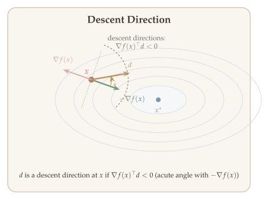
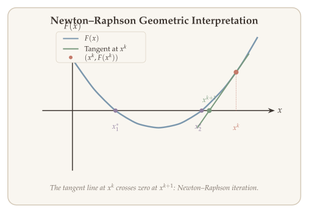
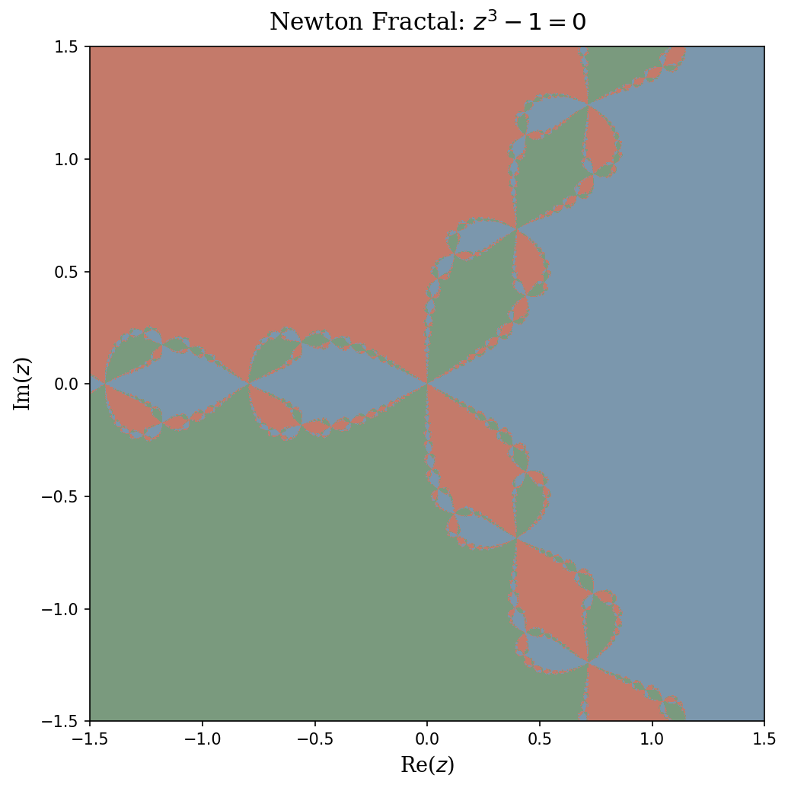
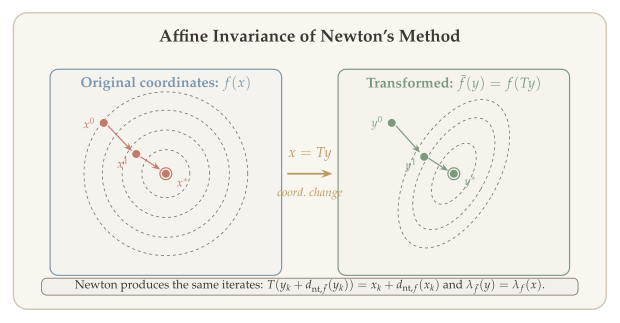
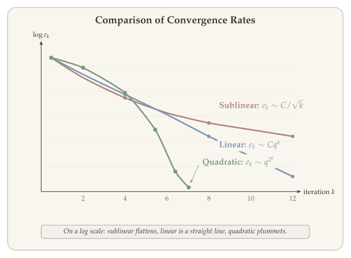
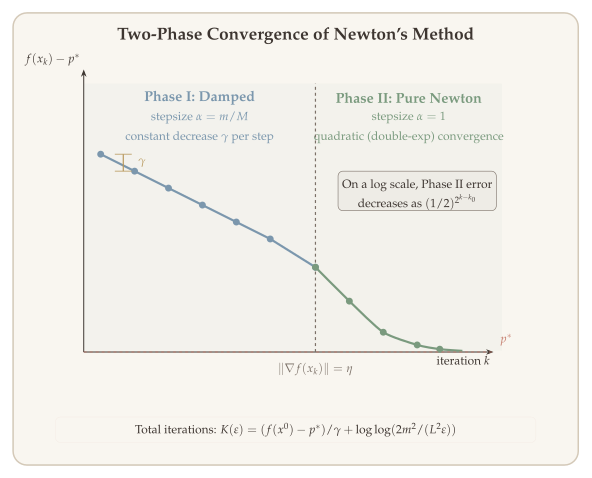
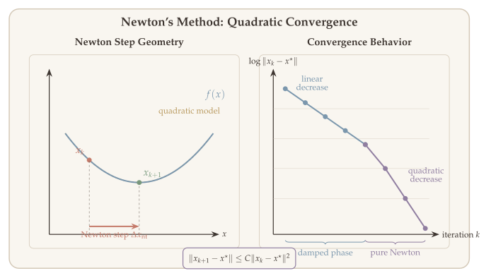

First-order methods like gradient descent use only gradient information and converge at best linearly (or sublinearly for nonsmooth problems). When the objective is smooth and we can afford to compute second-order information --- the Hessian --- we can do dramatically better. **Newton's method** leverages the local curvature of the objective to take steps that are adapted to the geometry of the problem, achieving **quadratic convergence** near the optimum.

This chapter develops the theory and practice of Newton's method for unconstrained optimization. The central insight is:

> **Newton's method for minimizing $f$ is Newton--Raphson applied to the optimality condition $\nabla f(x) = 0$.**

This means the convergence theory of Newton--Raphson for root-finding transfers directly to Newton's method for optimization. We develop both perspectives in parallel: starting from Newton--Raphson for root-finding, understanding the various convergence behaviors it can exhibit (convergence, cycling, and divergence), and then establishing a rigorous convergence analysis that reveals a striking two-phase structure --- a "damped" phase with constant progress followed by a "pure" phase with double-exponential convergence.

::: {.callout-tip}
## Companion Notebook

A [Jupyter notebook](../notebooks/newton-method.ipynb) accompanies this chapter with runnable Python implementations of all the key examples: Newton's method for minimization, Newton--Raphson behaviors, Newton fractals, damped Newton with line search, and convergence experiments.
:::

## Setting and Iterative Algorithms {#sec-setting}

We consider the unconstrained optimization problem

$$
\min_{x \in \mathbb{R}^n} f(x),
$$

where $f$ is convex, twice continuously differentiable, with open domain $D = \operatorname{dom}(f) \subseteq \mathbb{R}^n$. We assume $p^* = \min_x f(x)$ is finite and attained by some $x^*$.

Since $f$ is convex and differentiable, the first-order optimality condition gives

$$
\bar{x} \in \operatorname{argmin} f(x) \iff \nabla f(\bar{x}) = 0.
$$

This equivalence is the starting point for Newton's method: **minimizing $f$ reduces to solving the system of $n$ equations $\nabla f(x) = 0$**.

**Iterative approach.** We solve this problem by generating a sequence of iterates $x^0, x^1, x^2, \ldots$ that (hopefully) converge to $x^*$. The most common template is

$$
x^{k+1} = x^k + \alpha^k \cdot d^k,
$$

where $\alpha^k > 0$ is the **stepsize** and $d^k$ is the **descent direction**. The choice of $d^k$ is what distinguishes different algorithms: gradient descent uses $d^k = -\nabla f(x^k)$ (first-order information only), while Newton's method uses $d^k = -[\nabla^2 f(x^k)]^{-1}\nabla f(x^k)$ (second-order information via the Hessian).

::: {#def-descent-direction}
## Descent Direction

A vector $d \in \mathbb{R}^n$ is a **descent direction** at $x$ if $f(x + \alpha d) < f(x)$ for all sufficiently small $\alpha > 0$. A sufficient condition is $\nabla f(x)^\top d < 0$ (the direction has a negative inner product with the gradient).
:::

{#fig-descent-direction}

## Newton's Method {#sec-newtons-method}

Gradient descent uses only the first-order Taylor approximation to choose a descent direction. Newton's method goes one step further: it builds a **quadratic** (second-order) approximation of $f$ at the current iterate and jumps to its minimizer. This requires the Hessian $\nabla^2 f(x)$, but in return delivers much faster convergence.

**Assumption:** $f$ is strictly convex and twice continuously differentiable, so $\nabla^2 f(x) \succ 0$ for all $x \in D$.

### Two equivalent viewpoints {#sec-two-viewpoints}

Newton's method admits two complementary interpretations that lead to the **same update rule**:

**Viewpoint 1: Minimize a quadratic model of $f$.** Approximate $f$ at $x$ by its second-order Taylor expansion:

$$
\widehat{f}_x(y) = f(x) + \langle \nabla f(x),\, y - x \rangle + \tfrac{1}{2}(y - x)^\top \nabla^2 f(x)\,(y - x).
$$

When $\nabla^2 f(x) \succ 0$, this is a strictly convex quadratic with minimizer $y^* = x - [\nabla^2 f(x)]^{-1}\nabla f(x)$.

**Viewpoint 2: Apply Newton--Raphson to $\nabla f(x) = 0$.** Since $\bar{x}$ minimizes $f$ iff $\nabla f(\bar{x}) = 0$, we can apply the Newton--Raphson root-finding method (see @sec-newton-raphson below) to the equation $F(x) = \nabla f(x) = 0$. The Jacobian of $F$ is $J_F = \nabla^2 f$, so the Newton--Raphson update is $x^+ = x - [\nabla^2 f(x)]^{-1}\nabla f(x)$.

Both viewpoints yield the same **Newton update**:

$$
x^{k+1} = x^k - \bigl[\nabla^2 f(x^k)\bigr]^{-1} \nabla f(x^k).
$$

The equivalence is no coincidence: minimizing the quadratic model sets $\nabla \widehat{f}_x(y) = 0$, which is exactly the linearization of $\nabla f = 0$ used by Newton--Raphson. This dual perspective is powerful: Viewpoint 1 provides geometric intuition (fit a parabola and jump to its bottom), while **Viewpoint 2 transfers the convergence theory of Newton--Raphson directly to optimization** --- every convergence result, pathology, and condition we establish for Newton--Raphson immediately applies to Newton's method.

**Is the Newton direction a descent direction?** Yes, whenever $\nabla^2 f(x) \succ 0$:

$$
\nabla f(x)^\top d = -\nabla f(x)^\top \bigl[\nabla^2 f(x)\bigr]^{-1} \nabla f(x) < 0.
$$

::: {.callout-tip}
## Remark: Quadratic Functions

If $f$ is quadratic, i.e., $f(x) = x^\top P x + q^\top x + r$ with $P \succ 0$, Newton's method converges in **one iteration** --- the quadratic model is exact.
:::

**How to read @fig-newton-step.** The blue curve is the true objective $f(x)$, with the current iterate $x_k$ marked in terracotta. The gold dashed parabola is the local quadratic model $\widehat{f}_{x_k}$, which matches $f$ at $x_k$ in both value and slope (the green dashed tangent line). The Newton step $d_{\mathrm{nt}}$ (terracotta arrow) jumps from $x_k$ to $x_{k+1}$, the minimizer of this quadratic model. The true minimizer $x^*$ lies further right --- Newton's method approaches it iteratively.

![Newton step: the method jumps to the minimizer of the local quadratic approximation $\widehat{f}_{x_k}(y)$, using curvature information via the Newton direction $d_{\mathrm{nt}} = -[\nabla^2 f(x_k)]^{-1}\nabla f(x_k)$.](figures/ch03-newton-step.svg){#fig-newton-step}

::: {.callout-note collapse="true"}
## Interactive Demo: Newton's Method for Minimization

Drag the slider to change the starting point and watch Newton's method converge.
The black curve is $f(x) = x\log x - 2x$ (minimizer at $x^* = e \approx 2.718$). Dashed curves are the quadratic models at each iterate.

```{ojs}
//| echo: false
viewof x0_newton = Inputs.range([0.5, 8], {value: 6, step: 0.1, label: "Starting point x₀"})
```

```{ojs}
//| echo: false
{
  // f(x) = x*log(x) - 2x, f'(x) = log(x)-1, f''(x) = 1/x
  const f = x => x * Math.log(x) - 2 * x;
  const df = x => Math.log(x) - 1;
  const ddf = x => 1 / x;
  const taylor = (x, x0) => f(x0) + df(x0)*(x-x0) + 0.5*ddf(x0)*(x-x0)**2;

  // Newton iterates
  let iterates = [x0_newton];
  let x = x0_newton;
  for (let i = 0; i < 3; i++) {
    x = x - df(x) / ddf(x);
    if (x < 0.1 || x > 10) break;
    iterates.push(x);
  }

  // x values for plotting
  const xs = Array.from({length: 300}, (_, i) => 0.3 + i * (8 - 0.3) / 299);
  const ys = xs.map(f);

  const traces = [{
    x: xs, y: ys, mode: 'lines', name: 'f(x) = x log(x) − 2x',
    line: {color: '#3D3530', width: 2.5}
  }];

  const colors = ['#C47A6A', '#7A9A7E', '#7B97AD', '#B8995E'];
  for (let i = 0; i < Math.min(iterates.length, 4); i++) {
    const xi = iterates[i];
    const yt = xs.map(x => taylor(x, xi));
    traces.push({
      x: xs, y: yt, mode: 'lines', name: `Quadratic at x = ${xi.toFixed(3)}`,
      line: {color: colors[i], width: 1.5, dash: 'dash'}
    });
    traces.push({
      x: [xi], y: [f(xi)], mode: 'markers', showlegend: false,
      marker: {color: colors[i], size: 9}
    });
  }

  // minimizer line
  traces.push({
    x: [Math.E, Math.E], y: [-4, 1], mode: 'lines', name: 'x* = e',
    line: {color: '#7B7067', width: 1, dash: 'dot'}
  });

  const div = document.createElement('div');
  Plotly.newPlot(div, traces, {
    xaxis: {title: 'x', range: [0.2, 8]},
    yaxis: {title: 'f(x)', range: [-4, 2]},
    margin: {t: 30, b: 50, l: 60, r: 20},
    legend: {x: 0.55, y: 0.98},
    paper_bgcolor: 'rgba(0,0,0,0)', plot_bgcolor: 'rgba(0,0,0,0)'
  }, {responsive: true});
  return div;
}
```
:::

## Newton--Raphson for Root-Finding {#sec-newton-raphson}

Since Newton's method for optimization is Newton--Raphson applied to $\nabla f = 0$ (Viewpoint 2 above), we now develop Newton--Raphson for general root-finding, and the convergence theory will carry over to optimization.

The **Newton--Raphson method** solves nonlinear equations $F(x) = 0$, where $F\colon \mathbb{R}^n \to \mathbb{R}^n$, by iterating

$$
x^{k+1} = x^k - \bigl(J_F(x^k)\bigr)^{-1} F(x^k),
$$

where $J_F$ is the Jacobian of $F$. The idea is to **linearize** $F$ at $x^k$ via $F(x^k) + J_F(x^k)(x - x^k) = 0$ and solve the linear system. In the univariate case, this reduces to $x^{k+1} = x^k - F(x^k)/F'(x^k)$.

::: {#exm-sqrt}
## Computing Square Roots

To find $\sqrt{a}$, set $F(x) = x^2 - a$. Newton--Raphson gives the classical iteration $x^{k+1} = \frac{1}{2}(x^k + a/x^k)$.
:::

**Geometric meaning** ($F\colon \mathbb{R} \to \mathbb{R}$):

**How to read @fig-newton-raphson-geometry.** The blue parabola is $F(x)$ with roots $x_1^*$ and $x_2^*$ (lavender dots on the $x$-axis). Starting from $x^k$ (terracotta), the green line is the tangent to $F$ at that point. The next iterate $x^{k+1}$ (green dot) is where this tangent crosses zero. Each iteration replaces the curve with its tangent approximation and solves the simpler linear problem.

{#fig-newton-raphson-geometry}

The tangent line at $(x^k, F(x^k))$ is:

$$
y - F(x^k) = F'(x^k)\,(x - x^k).
$$

Setting $y = 0$ gives:

$$
x = x^k - \bigl(F'(x^k)\bigr)^{-1} F(x^k).
$$

::: {.callout-note collapse="true"}
## Interactive Demo: Newton--Raphson for Root-Finding

Solve $F(x) = \log(x) - 1 = 0$ (root at $x^* = e$). The tangent line at each iterate crosses zero to produce the next iterate.

```{ojs}
//| echo: false
viewof x0_nr = Inputs.range([1, 8], {value: 6, step: 0.1, label: "Starting point x₀"})
```

```{ojs}
//| echo: false
{
  const F = x => Math.log(x) - 1;
  const dF = x => 1 / x;

  let iterates = [x0_nr];
  let x = x0_nr;
  for (let i = 0; i < 4; i++) {
    x = x - F(x) / dF(x);
    if (x < 0.05 || x > 10) break;
    iterates.push(x);
  }

  const xs = Array.from({length: 300}, (_, i) => 0.1 + i * 7.9 / 299);
  const ys = xs.map(F);

  const traces = [{
    x: xs, y: ys, mode: 'lines', name: 'F(x) = log(x) − 1',
    line: {color: '#3D3530', width: 2.5}
  }, {
    x: [0, 8], y: [0, 0], mode: 'lines', showlegend: false,
    line: {color: '#7B7067', width: 0.5}
  }];

  const colors = ['#C47A6A', '#7A9A7E', '#7B97AD', '#B8995E'];
  for (let i = 0; i < Math.min(iterates.length - 1, 4); i++) {
    const xi = iterates[i];
    const m = dF(xi);
    const tangent = x => F(xi) + m * (x - xi);
    traces.push({
      x: xs, y: xs.map(tangent), mode: 'lines',
      name: `Tangent at x = ${xi.toFixed(3)}`,
      line: {color: colors[i], width: 1.5, dash: 'dash'}
    });
    traces.push({
      x: [xi], y: [F(xi)], mode: 'markers', showlegend: false,
      marker: {color: colors[i], size: 9}
    });
  }

  traces.push({
    x: [Math.E, Math.E], y: [-2, 2], mode: 'lines', name: 'Root: x* = e',
    line: {color: '#7B7067', width: 1, dash: 'dot'}
  });

  const div = document.createElement('div');
  Plotly.newPlot(div, traces, {
    xaxis: {title: 'x', range: [0, 8]},
    yaxis: {title: 'F(x)', range: [-2.5, 2.5]},
    margin: {t: 30, b: 50, l: 60, r: 20},
    legend: {x: 0.55, y: 0.98},
    paper_bgcolor: 'rgba(0,0,0,0)', plot_bgcolor: 'rgba(0,0,0,0)'
  }, {responsive: true});
  return div;
}
```
:::

## Behaviors of Newton--Raphson {#sec-nr-behaviors}

Before establishing convergence guarantees, it is instructive to see what can go wrong. Newton--Raphson can exhibit three qualitatively different behaviors depending on the initialization and the structure of $F$.

**Convergence (with sensitivity to initialization).** For $F(x) = x^2 - 9$, if $x_0 > 0$ then $x_k \to 3$; if $x_0 < 0$ then $x_k \to -3$; if $x_0 = 0$ then $F'(x_0) = 0$ and the method cannot proceed. The root Newton--Raphson converges to depends on the starting point.

When $F$ has multiple roots, the sensitivity to initialization can be extreme. Consider $F(x) = x^3 - 2x^2 - 11x + 12$ with roots at $x = -3, 1, 4$. Five initial points differing by less than $10^{-4}$ --- namely $x_0 \in \{2.352875, 2.352842, 2.352837, 2.352836327, 2.352836323\}$ --- converge to **three different roots**.

::: {.callout-note collapse="true"}
## Interactive Demo: Sensitivity to Initialization

**Part 1: Explore freely.** Drag the slider to see which root of $F(x) = (x+3)(x-1)(x-4)$ Newton--Raphson converges to. The left plot shows iterates on the function; the right plot shows the iteration trajectory $x_k$ vs $k$.

```{ojs}
//| echo: false
viewof x0_sens = Inputs.range([-5, 6], {value: 2.35, step: 0.001, label: "Starting point x₀"})
```

```{ojs}
//| echo: false
{
  const F = x => x**3 - 2*x**2 - 11*x + 12;
  const dF = x => 3*x**2 - 4*x - 11;
  const roots = [-3, 1, 4];
  const rc = ['#7B97AD', '#7A9A7E', '#B8995E'];
  const rn = ['x* = −3', 'x* = 1', 'x* = 4'];

  function newton(x0, maxSteps) {
    let iters = [x0], x = x0;
    for (let i = 0; i < maxSteps; i++) {
      const d = dF(x);
      if (Math.abs(d) < 1e-14) break;
      x = x - F(x) / d;
      if (Math.abs(x) > 200) break;
      iters.push(x);
      if (roots.some(r => Math.abs(x - r) < 1e-10)) break;
    }
    return iters;
  }
  function whichRoot(iters) {
    const last = iters[iters.length - 1];
    for (let i = 0; i < 3; i++) if (Math.abs(last - roots[i]) < 0.5) return i;
    return -1;
  }

  const iters = newton(x0_sens, 50);
  const ri = whichRoot(iters);
  const ic = ri >= 0 ? rc[ri] : '#C47A6A';

  // Left: function plot with iterates
  const xs = Array.from({length: 400}, (_, i) => -5 + 11*i/399);
  const t1 = [
    {x: xs, y: xs.map(F), mode: 'lines', name: 'F(x)', line: {color: '#3D3530', width: 2.5}},
    {x: [-5, 6], y: [0, 0], mode: 'lines', showlegend: false, line: {color: '#7B7067', width: 0.5}}
  ];
  for (let i = 0; i < 3; i++) t1.push({
    x: [roots[i]], y: [0], mode: 'markers', name: rn[i],
    marker: {color: rc[i], size: 12, symbol: 'diamond'}
  });
  t1.push({
    x: iters, y: iters.map(F), mode: 'lines+markers',
    name: `Iterates (${iters.length-1} steps)`,
    line: {color: ic, width: 1.5, dash: 'dot'}, marker: {color: ic, size: 6}
  });

  const title = ri >= 0
    ? `Converges to ${rn[ri]} in ${iters.length-1} steps`
    : (Math.abs(iters[iters.length-1]) > 100 ? 'Diverges' : `After 50 steps: x ≈ ${iters[iters.length-1].toFixed(2)}`);

  // Right: trajectory xk vs k
  const ks = iters.map((_, i) => i);
  const t2 = [];
  for (let i = 0; i < 3; i++) t2.push({
    x: [0, ks.length], y: [roots[i], roots[i]], mode: 'lines',
    name: rn[i], line: {color: rc[i], width: 1, dash: 'dot'}, showlegend: false
  });
  t2.push({
    x: ks, y: iters, mode: 'lines+markers', name: `x₀ = ${x0_sens}`,
    line: {color: ic, width: 2}, marker: {color: ic, size: 6}
  });

  const div = document.createElement('div');
  div.style.cssText = 'display:grid;grid-template-columns:1fr 1fr;gap:12px;';
  const d1 = document.createElement('div'), d2 = document.createElement('div');
  div.appendChild(d1); div.appendChild(d2);
  Plotly.newPlot(d1, t1, {
    title: {text: title, font: {size: 13, color: '#3D3530'}},
    xaxis: {title: 'x', range: [-5, 6]}, yaxis: {title: 'F(x)', range: [-40, 40]},
    margin: {t: 35, b: 45, l: 55, r: 10}, legend: {x: 0.02, y: 0.98, font: {size: 10}},
    paper_bgcolor: 'rgba(0,0,0,0)', plot_bgcolor: 'rgba(0,0,0,0)'
  }, {responsive: true});
  Plotly.newPlot(d2, t2, {
    title: {text: 'Iteration trajectory', font: {size: 13, color: '#3D3530'}},
    xaxis: {title: 'Iteration k', dtick: 2}, yaxis: {title: 'xₖ', range: [-5, 6]},
    margin: {t: 35, b: 45, l: 55, r: 10},
    paper_bgcolor: 'rgba(0,0,0,0)', plot_bgcolor: 'rgba(0,0,0,0)'
  }, {responsive: true});
  return div;
}
```

**Part 2: Five starting points within $10^{-4}$ of each other.** The table below shows that five initial points, all near $x_0 \approx 2.3528$, converge to three different roots. Select any row to see its full iteration trajectory.

```{ojs}
//| echo: false
viewof sensSelect = Inputs.select(
  ['2.352875', '2.352842', '2.352837', '2.352836327', '2.352836323'],
  {value: '2.352875', label: 'Select starting point'}
)
```

```{ojs}
//| echo: false
{
  const F = x => x**3 - 2*x**2 - 11*x + 12;
  const dF = x => 3*x**2 - 4*x - 11;
  const roots = [-3, 1, 4];
  const rc = ['#7B97AD', '#7A9A7E', '#B8995E'];

  const specials = [2.352875, 2.352842, 2.352837, 2.352836327, 2.352836323];

  function newton(x0) {
    let iters = [x0], x = x0;
    for (let i = 0; i < 40; i++) {
      const d = dF(x);
      if (Math.abs(d) < 1e-14) break;
      x = x - F(x) / d;
      if (Math.abs(x) > 200) break;
      iters.push(x);
      if (roots.some(r => Math.abs(x - r) < 1e-10)) break;
    }
    return iters;
  }
  function whichRoot(iters) {
    const last = iters[iters.length - 1];
    for (let i = 0; i < 3; i++) if (Math.abs(last - roots[i]) < 0.5) return i;
    return -1;
  }

  const all = specials.map(x0 => {
    const it = newton(x0);
    const ri = whichRoot(it);
    return {x0, iters: it, ri, steps: it.length - 1};
  });

  // Summary table
  let html = '<table style="border-collapse:collapse;width:100%;font-size:14px;margin:0 0 16px 0;">' +
    '<tr style="background:#F9F6F0;border-bottom:2px solid #D4C9B8;">' +
    '<th style="padding:6px 10px;text-align:left;">Starting point x₀</th>' +
    '<th style="padding:6px 10px;text-align:center;">Steps</th>' +
    '<th style="padding:6px 10px;text-align:center;">Converges to</th></tr>';
  for (const r of all) {
    const color = r.ri >= 0 ? rc[r.ri] : '#C47A6A';
    const sel = r.x0 === parseFloat(sensSelect);
    const bg = sel ? 'background:rgba(123,151,173,0.08);' : '';
    html += `<tr style="border-bottom:1px solid #D4C9B8;${bg}">` +
      `<td style="padding:6px 10px;font-family:monospace;${sel ? 'font-weight:bold;' : ''}">${r.x0}</td>` +
      `<td style="padding:6px 10px;text-align:center;">${r.steps}</td>` +
      `<td style="padding:6px 10px;text-align:center;font-weight:bold;color:${color};">x* = ${r.ri >= 0 ? roots[r.ri] : '?'}</td></tr>`;
  }
  html += '</table>';

  // Trajectory plot for selected x0
  const sel = all.find(r => r.x0 === parseFloat(sensSelect)) || all[0];
  const ic = sel.ri >= 0 ? rc[sel.ri] : '#C47A6A';
  const ks = sel.iters.map((_, i) => i);

  const traces = [];
  for (let i = 0; i < 3; i++) traces.push({
    x: [0, sel.steps + 1], y: [roots[i], roots[i]], mode: 'lines',
    name: `x* = ${roots[i]}`, line: {color: rc[i], width: 1.2, dash: 'dot'}
  });
  traces.push({
    x: ks, y: sel.iters, mode: 'lines+markers',
    name: `x₀ = ${sel.x0}`,
    line: {color: ic, width: 2.5}, marker: {color: ic, size: 7}
  });

  const container = document.createElement('div');
  const tableDiv = document.createElement('div');
  tableDiv.innerHTML = html;
  container.appendChild(tableDiv);

  const plotDiv = document.createElement('div');
  container.appendChild(plotDiv);
  Plotly.newPlot(plotDiv, traces, {
    title: {text: `x₀ = ${sel.x0} → x* = ${sel.ri >= 0 ? roots[sel.ri] : '?'} in ${sel.steps} steps`,
            font: {size: 14, color: '#3D3530'}},
    xaxis: {title: 'Iteration k', dtick: 2},
    yaxis: {title: 'xₖ', range: [-5, 6]},
    margin: {t: 40, b: 50, l: 60, r: 20},
    legend: {x: 0.75, y: 0.98, font: {size: 11}},
    paper_bgcolor: 'rgba(0,0,0,0)', plot_bgcolor: 'rgba(0,0,0,0)'
  }, {responsive: true});
  return container;
}
```
:::

**Cycling.** For $F(x) = x^3 - 2x + 2$ with $x_0 = 0$: $F'(x) = 3x^2 - 2$, giving $x_1 = 1$, $x_2 = 0$, and the method cycles with period 2. Cycles of arbitrary period can be constructed; see [this discussion](https://math.stackexchange.com/questions/977814/) for period-3 examples.

::: {.callout-note collapse="true"}
## Interactive Demo: Cycling Behavior

Newton--Raphson applied to $F(x) = x^3 - 2x + 2$. Start at $x_0 = 0$ to see period-2 cycling; try other starting points to see convergence or more complex behavior.

```{ojs}
//| echo: false
viewof x0_cyc = Inputs.range([-3, 3], {value: 0, step: 0.01, label: "Starting point x₀"})
```

```{ojs}
//| echo: false
{
  const F = x => x**3 - 2*x + 2;
  const dF = x => 3*x**2 - 2;

  let iters = [x0_cyc], x = x0_cyc, status = '';
  for (let i = 0; i < 20; i++) {
    const d = dF(x);
    if (Math.abs(d) < 1e-14) { status = "F'(x) = 0 — cannot proceed"; break; }
    const xn = x - F(x) / d;
    if (Math.abs(xn) > 50) { status = 'Diverges'; break; }
    iters.push(xn);
    for (let j = 0; j < iters.length - 2; j++) {
      if (Math.abs(xn - iters[j]) < 1e-10) {
        status = `Cycle of period ${iters.length - 1 - j} detected`;
        break;
      }
    }
    if (status) break;
    if (Math.abs(F(xn)) < 1e-12) { status = `Converges to root x* ≈ ${xn.toFixed(4)}`; break; }
    x = xn;
  }
  if (!status) status = `After 20 steps: x ≈ ${iters[iters.length-1].toFixed(4)}`;

  const xs = Array.from({length: 300}, (_, i) => -3 + 6*i/299);
  const colors = ['#C47A6A', '#7A9A7E', '#7B97AD', '#B8995E', '#907EA0'];
  const traces = [
    {x: xs, y: xs.map(F), mode: 'lines', name: 'F(x) = x³ − 2x + 2', line: {color: '#3D3530', width: 2.5}},
    {x: [-3, 3], y: [0, 0], mode: 'lines', showlegend: false, line: {color: '#7B7067', width: 0.5}}
  ];

  for (let i = 0; i < Math.min(iters.length - 1, 5); i++) {
    const xi = iters[i], m = dF(xi);
    traces.push({
      x: xs, y: xs.map(t => F(xi) + m*(t - xi)), mode: 'lines',
      name: `Tangent at x${i} = ${xi.toFixed(3)}`,
      line: {color: colors[i % 5], width: 1.2, dash: 'dash'}
    });
    traces.push({
      x: [xi], y: [F(xi)], mode: 'markers', showlegend: false,
      marker: {color: colors[i % 5], size: 9}
    });
  }

  const div = document.createElement('div');
  Plotly.newPlot(div, traces, {
    title: {text: status, font: {size: 14, color: '#3D3530'}},
    xaxis: {title: 'x', range: [-3, 3]},
    yaxis: {title: 'F(x)', range: [-8, 12]},
    margin: {t: 40, b: 50, l: 60, r: 20},
    legend: {x: 0.55, y: 0.98},
    paper_bgcolor: 'rgba(0,0,0,0)', plot_bgcolor: 'rgba(0,0,0,0)'
  }, {responsive: true});
  return div;
}
```
:::

**Divergence.** For $F(x) = x^{1/3}$: the update $x' = x - 3x = -2x$ gives $|x'| > |x|$ --- the iterates diverge. Even for convex objectives, Newton's method can diverge: $\min_x f(x) = x\log x + x$ gives $F(x) = \log x + 2$, and starting from $x_0 = 1$ yields $x_1 = -1$, which is outside the domain.

::: {.callout-note collapse="true"}
## Interactive Demo: Divergence

For $F(x) = x^{1/3}$, the Newton step gives $x' = x - x^{1/3}\big/\bigl(\tfrac{1}{3}x^{-2/3}\bigr) = -2x$. Each iterate doubles in magnitude and flips sign.

```{ojs}
//| echo: false
viewof x0_divg = Inputs.range([0.1, 2], {value: 0.5, step: 0.1, label: "Starting point x₀"})
```

```{ojs}
//| echo: false
{
  let iters = [x0_divg];
  for (let i = 0; i < 8; i++) iters.push(-2 * iters[iters.length - 1]);

  const ks = iters.map((_, i) => i);
  const barColors = iters.map(v => v >= 0 ? '#7A9A7E' : '#C47A6A');

  const div = document.createElement('div');
  Plotly.newPlot(div, [{
    x: ks, y: iters, type: 'bar', name: 'xₖ = (−2)ᵏ x₀',
    marker: {color: barColors}
  }, {
    x: [0, 8], y: [0, 0], mode: 'lines', showlegend: false,
    line: {color: '#7B7067', width: 1}
  }], {
    title: {text: `xₖ = (−2)^k · ${x0_divg.toFixed(1)} — magnitude doubles each step`, font: {size: 14, color: '#3D3530'}},
    xaxis: {title: 'Iteration k', dtick: 1},
    yaxis: {title: 'xₖ'},
    margin: {t: 40, b: 50, l: 70, r: 20},
    paper_bgcolor: 'rgba(0,0,0,0)', plot_bgcolor: 'rgba(0,0,0,0)'
  }, {responsive: true});
  return div;
}
```
:::

### Newton Fractals {#sec-newton-fractal}

The sensitivity to initialization is not merely a nuisance --- it has deep mathematical structure. Consider applying Newton--Raphson to $F(z) = z^3 - 1 = 0$ in the complex plane, where the three roots are the cube roots of unity: $1$, $e^{2\pi i/3}$, and $e^{4\pi i/3}$.

For each starting point $z_0 = a + bi$, we run Newton--Raphson and record which of the three roots the iterates converge to. Coloring each pixel by its limiting root produces the **Newton fractal** (@fig-newton-fractal).

**How to read the figure.** Each point in the complex plane represents a starting value $z_0$. The three colors correspond to the three cube roots of unity. If a pixel is colored blue, then Newton--Raphson initialized at that $z_0$ converges to the root $1$; green means convergence to $e^{2\pi i/3}$; and gold means convergence to $e^{4\pi i/3}$. The large monochromatic regions are **basins of attraction** --- open sets of initial conditions that all converge to the same root. The intricate boundaries between these regions are where the interesting behavior lies.

**The key conclusion.** Along the fractal boundary, the three basins interleave at every scale. This means: **for any starting point $z_0$ on the boundary, and any $\varepsilon > 0$ no matter how small, the ball $B(z_0, \varepsilon)$ contains points that converge to all three different roots.** In other words, an infinitesimal perturbation to the initialization can send Newton--Raphson to a completely different solution. This is not a rare pathology --- the fractal boundary has positive measure in many Newton fractals, and the phenomenon occurs for any polynomial of degree $\geq 2$ with distinct roots.

{#fig-newton-fractal width=70%}

::: {.callout-note collapse="true"}
## Interactive Demo: Newton Fractal Explorer

Choose the polynomial $z^n - 1$ and zoom level. Each pixel is colored by which $n$-th root of unity Newton--Raphson converges to. Darker shading means more iterations were needed. Zoom in to see the self-similar fractal boundary.

```{ojs}
//| echo: false
viewof fractalN = Inputs.select([3, 4, 5, 6], {value: 3, label: "Degree n in zⁿ − 1"})
```

```{ojs}
//| echo: false
viewof fractalZoom = Inputs.range([0.3, 4], {value: 2, step: 0.1, label: "View range (±)"})
```

```{ojs}
//| echo: false
{
  const n = fractalN, R = fractalZoom, sz = 400, maxIt = 50, tol = 1e-6;
  const roots = Array.from({length: n}, (_, k) =>
    [Math.cos(2*Math.PI*k/n), Math.sin(2*Math.PI*k/n)]);
  const pal = [[123,151,173],[122,154,126],[184,153,94],[196,122,106],[144,126,160],[173,132,128]];

  const canvas = document.createElement('canvas');
  canvas.width = sz; canvas.height = sz;
  canvas.style.cssText = 'width:100%;max-width:500px;display:block;margin:0 auto;border:1px solid #D4C9B8;border-radius:6px;';
  const ctx = canvas.getContext('2d');
  const img = ctx.createImageData(sz, sz);

  for (let py = 0; py < sz; py++) {
    for (let px = 0; px < sz; px++) {
      let zr = -R + 2*R*px/(sz-1), zi = R - 2*R*py/(sz-1);
      let conv = -1, it = maxIt;

      for (let iter = 0; iter < maxIt; iter++) {
        let pr = 1, pi = 0;
        for (let k = 0; k < n-1; k++) {
          const tr = pr*zr - pi*zi;
          pi = pr*zi + pi*zr; pr = tr;
        }
        const znr = pr*zr - pi*zi, zni = pr*zi + pi*zr;
        const dr = n*pr, di = n*pi, den = dr*dr + di*di;
        if (den < 1e-30) break;
        const fr = znr - 1, fi = zni;
        zr -= (fr*dr + fi*di) / den;
        zi -= (fi*dr - fr*di) / den;

        for (let j = 0; j < n; j++) {
          if ((zr-roots[j][0])**2 + (zi-roots[j][1])**2 < tol) { conv = j; it = iter; break; }
        }
        if (conv >= 0) break;
      }

      const idx = 4*(py*sz + px);
      if (conv >= 0) {
        const c = pal[conv % pal.length], b = 0.35 + 0.65*(1 - it/maxIt);
        img.data[idx] = c[0]*b; img.data[idx+1] = c[1]*b; img.data[idx+2] = c[2]*b;
      } else {
        img.data[idx] = 61; img.data[idx+1] = 53; img.data[idx+2] = 48;
      }
      img.data[idx+3] = 255;
    }
  }

  ctx.putImageData(img, 0, 0);
  const container = document.createElement('div');
  container.style.cssText = 'text-align:center;';
  container.appendChild(canvas);
  const label = document.createElement('div');
  label.style.cssText = 'font-size:0.9em;color:#7B7067;margin-top:6px;';
  label.textContent = `z${n} − 1 = 0 | Range: [−${R}, ${R}] × [−${R}, ${R}]`;
  container.appendChild(label);
  return container;
}
```
:::

::: {.callout-tip}
## Further Reading: Newton Fractals

- [3Blue1Brown: Newton's Fractal](https://www.3blue1brown.com/lessons/newtons-fractal) --- an excellent visual introduction
- [Paul Bourke: Newton--Raphson Fractals](https://paulbourke.net/fractals/newtonraphson/) --- gallery and mathematical background
- [SciPython: The Newton Fractal](https://scipython.com/book2/chapter-8-scipy/examples/the-newton-fractal/) --- Python implementation
:::

### Implications for Optimization {#sec-nr-implications}

**Takeaway for optimization.** Since Newton's method for $\min_x f(x)$ is Newton--Raphson for $\nabla f(x) = 0$, all three pathologies carry over. When $f$ is nonconvex and has multiple stationary points, the stationary point Newton converges to is sensitive to initialization --- and the basins of attraction can have fractal boundaries. Even when $f$ is convex, the pure Newton step $d^k = -[\nabla^2 f(x^k)]^{-1}\nabla f(x^k)$ can be too large, causing the method to overshoot. The remedy is to introduce a **damped Newton step**:

$$
x^{k+1} = x^k - \alpha^k \cdot \underbrace{\bigl(\nabla^2 f(x^k)\bigr)^{-1} \nabla f(x^k)}_{d^k},
$$ {#eq-damped-newton}

where $\alpha^k$ is chosen by **backtracking line search**: starting from $\alpha = 1$, repeatedly shrink $\alpha \leftarrow \beta \alpha$ (with $\beta \in (0,1)$) until the **Armijo condition** $f(x + \alpha d) \leq f(x) + c \cdot \alpha \cdot d^\top \nabla f(x)$ is satisfied (with $c \in (0, 1/2)$). This guarantees $f(x^{k+1}) < f(x^k)$ at every step, preventing divergence while preserving fast convergence near the optimum.

## Newton Decrement {#sec-newton-decrement}

With the damped Newton update ([-@eq-damped-newton]) and backtracking line search in hand, we need a principled stopping criterion and a way to measure progress. The **Newton decrement** serves both roles. Let $d_{\text{nt}}(x) = -[\nabla^2 f(x)]^{-1} \nabla f(x)$ denote the Newton direction.

::: {#def-newton-decrement}
## Newton Decrement

The **Newton decrement** at point $x$ is:

$$
\lambda(x) = \sqrt{\nabla f(x)^\top \bigl(\nabla^2 f(x)\bigr)^{-1} \nabla f(x)} = \sqrt{d_{\text{nt}}(x)^\top \nabla^2 f(x)\, d_{\text{nt}}(x)}.
$$
:::

The Newton decrement has three useful interpretations:

1. **Rate of decrease.** The directional derivative along $d_{\text{nt}}$ is $\langle \nabla f(x), d_{\text{nt}}(x) \rangle = -\lambda(x)^2$, so $\lambda(x)^2$ measures how fast $f$ decreases in the Newton direction.

2. **Surrogate for the optimality gap.** The gap between $f(x)$ and the minimum of the local quadratic model is $f(x) - \inf_y \widehat{f}_x(y) = \frac{1}{2}\lambda(x)^2$, so $\frac{1}{2}\lambda(x)^2$ approximates $f(x) - p^*$.

3. **Steepest descent in the Hessian norm.** Since $\|u\|_{\nabla^2 f(x)} = \sqrt{u^\top \nabla^2 f(x)\, u}$ is a norm when $\nabla^2 f(x) \succ 0$, the Newton direction is the steepest descent direction under this local norm. This explains why Newton's method adapts to the geometry of $f$: it uses the curvature-adapted norm rather than the Euclidean norm.

**Affine invariance.** A key advantage of Newton's method over gradient descent is that $\lambda(x)$ is **invariant under invertible affine transformations**. If we reparameterize via $\bar{f}(y) = f(Ty)$ for invertible $T$, a direct computation shows $d_{\text{nt},\bar{f}}(y) = T^{-1} d_{\text{nt},f}(Ty)$ and $\lambda_{\bar{f}}(y) = \lambda_f(Ty)$. The Newton iterates in the new coordinates are exactly the transformed iterates in the old coordinates --- **Newton's method is coordinate-free**. Gradient descent, by contrast, is highly sensitive to coordinate scaling (ill-conditioning).

{#fig-affine-invariance}

## Convergence Analysis: Quadratic Convergence {#sec-convergence-analysis}

Having defined the Newton decrement as a measure of progress, we are now ready to state and prove the main convergence result. Newton's method features **quadratic convergence**:

$$
\|x^{k+1} - x^*\| \leq M \cdot \|x^k - x^*\|^2,
$$

when $k$ is sufficiently large.

### Rates of Convergence {#sec-convergence-rates}

Before stating the convergence theorem, we recall the standard taxonomy of convergence rates. These rates describe how quickly the error sequence $\{e_k\}$ vanishes.

::: {#def-convergence-rates}
## Rates of Convergence

Let $\{e_k\}_{k \geq 1}$ be a sequence with $\lim_{k \to \infty} e_k = 0$. Define:

$$
\delta_L = \lim_{k \to \infty} \frac{e_{k+1}}{e_k}, \qquad \delta_Q = \lim_{k \to \infty} \frac{e_{k+1}}{(e_k)^2}.
$$

- **Linear convergence** $\iff$ $0 < \delta_L < 1$.
  - e.g., $e_k = C \cdot q^k$, $q \in (0,1)$. Error decays **exponentially**.
- **Superlinear convergence** $\iff$ $\delta_L = 0$.
  - e.g., $e_k = \frac{C}{k!}$ or $e_k = \frac{C}{k^k}$. Faster than $\exp(-k)$.
- **Sublinear convergence** $\iff$ $\delta_L = 1$.
  - e.g., $e_k = \frac{C}{\sqrt{k}}$, $e_k = C \cdot k^{-\alpha}$ ($\alpha > 0$). Slower than $\exp(-k)$.
- **Quadratic convergence** $\iff$ $\delta_Q \in (0,1)$.
  - e.g., $e_k = q^{2^k}$. Error decays **double exponentially**.
:::

{#fig-convergence-rates}

### Quadratic Convergence of Newton--Raphson (1-D) {#sec-nr-quadratic}

Let us first focus on Newton--Raphson (1-D) to gain intuition. The following theorem shows that when the initial point is close enough to a *simple* root, the error squares at each iteration --- a hallmark of quadratic convergence.

**The key idea.** Newton--Raphson replaces $F$ with its tangent line and finds the root of that line. Near a simple root, the tangent line is an excellent approximation of $F$, and the error in this approximation is proportional to $(e^k)^2$ (the quadratic term in the Taylor expansion). So each step converts the current error $e^k$ into a *squared* error --- and squaring a small number makes it much smaller.

::: {#thm-nr-quadratic}
## Quadratic Convergence of Newton--Raphson

Let $x^*$ be a root of $F$ with $F'(x^*) \neq 0$ (a *simple root*), and suppose $|F''(x)| \leq M$ in a neighborhood of $x^*$. Define the constant $C = M / |F'(x^*)|$ and the radius $\delta = 1/(2C)$. Then for any $x^0 \in [x^* - \delta,\, x^* + \delta]$, Newton--Raphson converges to $x^*$ with:

$$
|x^{k+1} - x^*| \leq C \cdot |x^k - x^*|^2.
$$

In particular, setting $e^k = |x^k - x^*|$:

$$
e^k \leq \frac{1}{C}\Bigl(\frac{1}{2}\Bigr)^{2^k},
$$

so the number of correct digits roughly **doubles** at each step.
:::

The proof proceeds by Taylor-expanding $F$ around $x^k$ and bounding the resulting error recurrence. The strategy is: (1) subtract the fixed-point relation from the update to isolate $e^{k+1}$, and (2) use the Taylor remainder to bound it.

::: {.proof}
**Step 1: Error recurrence.** The Newton--Raphson update is $x^{k+1} = x^k - F(x^k)/F'(x^k)$, and $x^*$ is a fixed point since $F(x^*) = 0$. Define the error $e^k = x^k - x^*$. Taylor-expanding $F(x^*)$ around $x^k$:

$$
0 = F(x^*) = F(x^k - e^k) = F(x^k) - e^k \cdot F'(x^k) + \frac{(e^k)^2}{2} F''(\xi^k),
$$ {#eq-taylor-nr}

for some $\xi^k$ between $x^k$ and $x^*$ (by the mean value form of the remainder).

**Step 2: Isolate $e^{k+1}$.** Rearranging @eq-taylor-nr and dividing by $F'(x^k)$:

$$
e^k - \frac{F(x^k)}{F'(x^k)} = \frac{F''(\xi^k)}{2\,F'(x^k)} \cdot (e^k)^2.
$$

The left-hand side is exactly $x^k - x^* - (x^{k+1} - x^k) = x^{k+1} - x^* = e^{k+1}$ (with appropriate sign). We need $F'(x^k) \neq 0$; this holds because $|F'(x^k)| \geq |F'(x^*)| - M\delta > |F'(x^*)|/2 > 0$ when $\delta < |F'(x^*)|/(2M)$.

**Step 3: Bound.** Taking absolute values:

$$
|e^{k+1}| \leq \frac{M}{2\,|F'(x^k)|} \cdot (e^k)^2 \leq \frac{M}{|F'(x^*)|} \cdot (e^k)^2 = C \cdot (e^k)^2.
$$

Since $C \cdot e^0 \leq C \cdot \delta = 1/2 < 1$, the sequence $\{C \cdot e^k\}$ satisfies $C \cdot e^{k+1} \leq (C \cdot e^k)^2$, giving $C \cdot e^k \leq (1/2)^{2^k}$. $\blacksquare$
:::

An alternative viewpoint: define $g(x) = x - F(x)/F'(x)$. Since $g'(x^*) = 0$ (because $F(x^*) = 0$), Taylor expansion gives $g(x) - g(x^*) \approx C(x - x^*)^2$, which is exactly the quadratic convergence relation $e^{k+1} \approx C(e^k)^2$.

**When quadratic convergence fails.**

Quadratic convergence requires $F'(x^*) \neq 0$ (a simple root). When $F'(x^*) = 0$ (a **multiple root**), the constant $C = M/|F'(x^*)|$ blows up and we lose the quadratic rate. The method still converges, but only linearly:

::: {#exm-linear-convergence}
## Linear Convergence at a Multiple Root

$F(x) = x^2$ has a double root at $x^* = 0$ with $F'(0) = 0$. Then $g(x) = x - F(x)/F'(x) = x/2$, giving:

$$
(x^{k+1} - 0) = \frac{1}{2}(x^k - 0). \quad \text{(Linear convergence with rate $1/2$.)}
$$
:::

**Takeaway from the 1-D analysis.** Newton--Raphson converges quadratically near simple roots, but only linearly near multiple roots. The two conditions for quadratic convergence --- $F'(x^*) \neq 0$ (non-degeneracy) and $|F''|$ bounded (smoothness) --- will reappear in the multivariate setting as strong convexity and Lipschitz Hessian.

### Convergence Analysis of Newton's Method {#sec-newton-convergence}

The 1-D analysis above reveals the essential mechanism: the error squares at each step when we start close enough to the root. We now extend this to the multivariate setting, where the damped Newton method ([-@eq-damped-newton]) exhibits a characteristic **two-phase convergence**. We assume throughout that $f$ is "nice":

1. **Strongly convex and smooth:** $m I_n \preceq \nabla^2 f(x) \preceq M I_n$ for all $x$.
2. **Lipschitz Hessian:** $\|\nabla^2 f(x) - \nabla^2 f(y)\| \leq L \|x - y\|_2$.

Condition 1 plays the role of "$F'(x^*) \neq 0$" from the 1-D case (it ensures the Newton step is well-defined and bounded). Condition 2 plays the role of "$F''$ bounded" (it controls how well the quadratic model approximates $f$).

**Why two phases?** The 1-D theorem required starting in a neighborhood of $x^*$. But what if we start far away? A full Newton step ($\alpha = 1$) could *increase* $f$ --- the quadratic model is only a local approximation, and far from $x^*$ we cannot trust it globally. The solution: use **damped steps** (small $\alpha$) while far away, then switch to **full steps** ($\alpha = 1$) once we are close enough.

- **Phase I (damped Newton, far from optimum):** The gradient is large ($\|\nabla f(x^k)\| \geq \eta$), so we are far from $x^*$. We use a conservative step size $\alpha = m/M$. Newton gives us a good *direction*, but we don't trust the full step *size*. Each step decreases $f$ by at least a constant $\gamma$ --- similar to gradient descent, but with a curvature-adapted direction. This phase lasts at most $(f(x^0) - p^*)/\gamma$ steps.

- **Phase II (pure Newton, near optimum):** The gradient is small ($\|\nabla f(x^k)\| < \eta$), so the quadratic model is an excellent approximation. Full Newton steps ($\alpha = 1$) are accepted by backtracking, and the error squares at each step --- just like in the 1-D case. This phase needs only $\log\log(1/\varepsilon)$ additional steps to reach $\varepsilon$ accuracy.

::: {#thm-newton-convergence}
## Convergence Theory (Newton + Backtracking)

Under assumptions 1--2, there exist $\eta = m^2/L$ and $\gamma = \frac{m\eta^2}{2M^2} > 0$ such that:

**(1) Phase I (damped steps).** If $\|\nabla f(x^k)\|_2 \geq \eta$, then stepsize $\alpha^k = m/M$ gives:

$$
f(x^{k+1}) - f(x^k) \leq -\gamma. \quad \text{(constant decrease per step)}
$$ {#eq-phase1}

**(2) Phase II (pure Newton steps).** If $\|\nabla f(x^k)\|_2 < \eta$, then stepsize $\alpha^k = 1$ is accepted by backtracking, and:

$$
\frac{L}{2m^2}\|\nabla f(x^{k+1})\|_2 \leq \Bigl(\frac{L}{2m^2}\|\nabla f(x^k)\|_2\Bigr)^2. \quad \text{(quadratic convergence)}
$$ {#eq-phase2}

**Total iteration complexity** to reach $f(x^k) - p^* \leq \varepsilon$:

$$
K(\varepsilon) = \underbrace{\frac{f(x^0) - p^*}{\gamma}}_{\text{Phase I (linear)}} + \underbrace{\log\log\bigl(2m^2/(L^2\varepsilon)\bigr)}_{\text{Phase II (quadratic)}}.
$$
:::

**How to read @fig-two-phase-convergence.** The figure shows the suboptimality gap $f(x^k) - p^*$ on a log scale versus iterations. In **Phase I** (left portion), the method uses damped steps and the gap decreases linearly (constant progress per step). Once $\|\nabla f(x^k)\|$ drops below the threshold $\eta = m^2/L$, the method enters **Phase II** (right portion): pure Newton steps with $\alpha = 1$ yield quadratic convergence --- the number of correct digits roughly doubles each iteration, appearing as a steep plunge on the log scale.

{#fig-two-phase-convergence}

{#fig-newton-convergence}

**Unpacking Phase II: double-exponential convergence.** Once $\|\nabla f(x^k)\|_2 < \eta$ at some iteration $k$, the method stays in Phase II (the bound ([-@eq-phase2]) implies $\|\nabla f(x^{k+1})\| < \eta$). Setting $a_\ell = \frac{L}{2m^2}\|\nabla f(x^\ell)\|_2$, the recursion $a_\ell \leq a_{\ell-1}^2$ with $a_k \leq 1/2$ gives

$$
\|\nabla f(x^\ell)\|_2 \leq \frac{2m^2}{L} \cdot \Bigl(\frac{1}{2}\Bigr)^{2^{\ell-k}}.
$$

This is **double-exponential** decay: the number of correct digits roughly doubles at each step. Using strong convexity, we can translate this into other convergence measures: $\|x^k - x^*\| \leq \frac{1}{m}\|\nabla f(x^k)\|$ (by the mean value theorem) and $f(x^k) - p^* \leq \frac{1}{2m}\|\nabla f(x^k)\|^2$ (by gradient domination, @sec-proof-property4).

::: {.callout-note collapse="true"}
## Interactive Demo: Newton vs. Gradient Descent (1-D)

Compare Newton's method (green) and gradient descent (blue) on $f(x) = e^x + e^{-x}$ (minimizer at $x^* = 0$). Newton converges in very few steps; gradient descent progresses linearly.

```{ojs}
//| echo: false
viewof x0_conv = Inputs.range([-3, 4], {value: 3, step: 0.1, label: "Starting point x₀"})
viewof gd_lr = Inputs.range([0.01, 0.5], {value: 0.15, step: 0.01, label: "GD stepsize α"})
```

```{ojs}
//| echo: false
{
  const f = x => Math.exp(x) + Math.exp(-x);
  const df = x => Math.exp(x) - Math.exp(-x);
  const ddf = x => Math.exp(x) + Math.exp(-x);
  const pstar = 2; // f(0) = 2

  // Newton iterates
  let nt = [x0_conv];
  let x = x0_conv;
  for (let i = 0; i < 15; i++) {
    x = x - df(x) / ddf(x);
    nt.push(x);
    if (Math.abs(df(x)) < 1e-14) break;
  }

  // GD iterates
  let gd = [x0_conv];
  x = x0_conv;
  for (let i = 0; i < 50; i++) {
    x = x - gd_lr * df(x);
    gd.push(x);
  }

  const nt_gaps = nt.map(x => Math.max(f(x) - pstar, 1e-16));
  const gd_gaps = gd.map(x => Math.max(f(x) - pstar, 1e-16));

  const traces = [{
    x: Array.from({length: nt_gaps.length}, (_, i) => i),
    y: nt_gaps, mode: 'lines+markers', name: "Newton's method",
    line: {color: '#7A9A7E', width: 2}, marker: {size: 6}
  }, {
    x: Array.from({length: gd_gaps.length}, (_, i) => i),
    y: gd_gaps, mode: 'lines+markers', name: 'Gradient descent',
    line: {color: '#7B97AD', width: 2}, marker: {size: 4}
  }];

  const div = document.createElement('div');
  Plotly.newPlot(div, traces, {
    xaxis: {title: 'Iteration k', range: [0, 50]},
    yaxis: {title: 'f(x_k) − p*', type: 'log', range: [-16, 3]},
    margin: {t: 30, b: 50, l: 70, r: 20},
    legend: {x: 0.55, y: 0.98},
    paper_bgcolor: 'rgba(0,0,0,0)', plot_bgcolor: 'rgba(0,0,0,0)'
  }, {responsive: true});
  return div;
}
```
:::

#### Analysis of Phase I {#sec-phase1-analysis}

**Setup:** $\|\nabla f(x)\|_2 \geq \eta$ (we are far from the optimum).

**Goal:** Show that each damped Newton step decreases $f$ by at least a constant $\gamma > 0$.

**Strategy.** The argument has three parts: (1) bound how much $f$ decreases along the Newton direction as a function of $\alpha$ and $\lambda(x)$; (2) choose the step size $\alpha = m/M$; (3) show that $\lambda(x)$ is bounded below by a constant (because $\|\nabla f\|$ is large). Combining these gives the constant decrease.

**Step 1: Decrease along the Newton direction.** Since $\nabla^2 f \preceq M \cdot I$, by Taylor expansion:

$$
f(x + \alpha\, d_{\text{nt}}(x)) \leq f(x) + \alpha\, d_{\text{nt}}(x)^\top \nabla f(x) + \frac{\alpha^2 M}{2} \|d_{\text{nt}}(x)\|_2^2.
$$ {#eq-phase1-bound1}

Since $\nabla^2 f \succeq m \cdot I$:

$$
\|d_{\text{nt}}(x)\|_2^2 \leq \frac{1}{m}\, d_{\text{nt}}(x)^\top \nabla^2 f(x)\, d_{\text{nt}}(x) = \frac{1}{m}\bigl(\lambda(x)\bigr)^2.
$$ {#eq-phase1-bound2}

Also:

$$
\bigl(\lambda(x)\bigr)^2 = \nabla f(x)^\top \bigl(\nabla^2 f(x)\bigr)^{-1}\nabla f(x) = -d_{\text{nt}}(x)^\top \nabla f(x).
$$ {#eq-phase1-bound3}

Combining ([-@eq-phase1-bound1]), ([-@eq-phase1-bound2]), and ([-@eq-phase1-bound3]):

$$
f(x + \alpha\, d_{\text{nt}}(x)) \leq f(x) + \Bigl(-\alpha + \frac{M\alpha^2}{2m}\Bigr)\bigl(\lambda(x)\bigr)^2.
$$

**Step 2: Choose the step size.** Setting $\alpha^* = m/M$ (this minimizes the upper bound above; it is the ratio of strong convexity to smoothness, a natural "trust radius"):

$$
f(x + \alpha^* d_{\text{nt}}(x)) \leq f(x) - \frac{m}{2M}\bigl(\lambda(x)\bigr)^2 = f(x) - \frac{\alpha^*}{2}\bigl(\lambda(x)\bigr)^2.
$$

**Step 3: Lower bound on $\lambda(x)$.** We need the decrease $\frac{\alpha^*}{2}\lambda(x)^2$ to be at least a constant. Since $\|\nabla f(x)\|$ is large, we can bound $\lambda(x)$ from below:

$$
\bigl(\lambda(x)\bigr)^2 = \nabla f(x)^\top \bigl(\nabla^2 f(x)\bigr)^{-1} \nabla f(x) \geq \lambda_{\min}\bigl((\nabla^2 f(x))^{-1}\bigr) \|\nabla f(x)\|_2^2 \geq \frac{1}{M}\|\nabla f(x)\|_2^2.
$$

Therefore:

$$
f(x^{k+1}) - f(x^k) \leq -\frac{\alpha^*}{2} \cdot \frac{1}{M}\|\nabla f(x^k)\|_2^2 \leq -\frac{m}{2M^2}\eta^2.
$$

**Conclusion.** Whenever $\|\nabla f(x^k)\| \geq \eta$, the damped Newton step with $\alpha^* = m/M$ decreases $f$ by at least $\gamma = \frac{m\eta^2}{2M^2}$. Since $f$ is bounded below by $p^*$, Phase I can last at most $(f(x^0) - p^*)/\gamma$ iterations before $\|\nabla f(x^k)\|$ drops below $\eta$.

#### Analysis of Phase II {#sec-phase2-analysis}

**Setup:** $\|\nabla f(x)\|_2 < \eta = m^2/L$ (we are near the optimum).

**Goal:** Show that the pure Newton step ($\alpha = 1$) achieves quadratic convergence: the gradient norm after one step is bounded by the *square* of the gradient norm before.

**The key idea** is identical to the 1-D proof: the Newton step makes $\nabla f(x^{k+1})$ exactly zero *if* $f$ were truly quadratic. The residual $\|\nabla f(x^{k+1})\|$ comes entirely from the error in the quadratic approximation --- the "cubic" remainder term --- which is controlled by the Hessian Lipschitz constant $L$.

**Step 1: The Newton step kills the quadratic part of $\nabla f$.** By the definition of the Newton step, $\nabla f(x) + \nabla^2 f(x) \, d_{\text{nt}}(x) = 0$, so the gradient at the new point is:

$$
\nabla f(x + d_{\text{nt}}(x)) = \underbrace{\nabla f(x + d_{\text{nt}}(x)) - \nabla f(x) - \nabla^2 f(x)\, d_{\text{nt}}(x)}_{\text{error from Hessian variation along the step}}.
$$

**Step 2: Bound the Hessian variation using the integral form.** Writing the difference as an integral and applying the Lipschitz condition:

$$
\|\nabla f(x + d_{\text{nt}}(x))\|_2 = \biggl\|\int_0^1 \bigl(\nabla^2 f(x + t\, d_{\text{nt}}(x)) - \nabla^2 f(x)\bigr)\, d_{\text{nt}}(x)\, dt\biggr\|_2 \leq \frac{L}{2}\|d_{\text{nt}}(x)\|_2^2.
$$

The inequality uses $\|\nabla^2 f(x + td) - \nabla^2 f(x)\| \leq tL\|d\|$ and $\int_0^1 t\,dt = 1/2$. This is the multivariate analogue of the Taylor remainder bound $|F''(\xi^k)| \leq M$ in the 1-D proof.

**Step 3: Bound the Newton step size.** Since $\nabla^2 f \succeq mI$:

$$
\|d_{\text{nt}}(x)\|_2 = \|(\nabla^2 f(x))^{-1}\nabla f(x)\|_2 \leq \frac{1}{m}\|\nabla f(x)\|_2.
$$

**Step 4: Combine.** Substituting Step 3 into Step 2:

$$
\|\nabla f(x + d_{\text{nt}}(x))\|_2 \leq \frac{L}{2m^2}\|\nabla f(x)\|_2^2.
$$

Dividing both sides by $2m^2/L$ and writing $a_k = \frac{L}{2m^2}\|\nabla f(x^k)\|_2$, this becomes the recurrence $a_{k+1} \leq a_k^2$ --- the same squaring relation as in the 1-D case.

**Step 5: Unroll the recurrence.** At the start of Phase II (iteration $k_0$), $\|\nabla f(x^{k_0})\| \leq \eta = m^2/L$, so $a_{k_0} \leq 1/2$. Applying $a_{k+1} \leq a_k^2$ repeatedly:

$$
\frac{L}{2m^2}\|\nabla f(x^k)\|_2 \leq \Bigl(\frac{1}{2}\Bigr)^{2^{k-k_0}}. \quad \text{(Quadratic convergence.)}
$$

**Conclusion.** Once the gradient norm drops below $\eta = m^2/L$, pure Newton steps ($\alpha = 1$) produce double-exponential decay: the number of correct digits roughly doubles at each iteration. After just $\ell$ steps in Phase II, the gradient norm shrinks by a factor of $(1/2)^{2^\ell}$. For example, 10 Phase II iterations give $(1/2)^{1024} \approx 10^{-308}$ --- essentially machine precision. This is why Phase II contributes only $\log\log(1/\varepsilon)$ to the total iteration count.

#### Validity of Unit Stepsize in Phase II {#sec-phase2-stepsize}

**Why this section is needed.** The Phase II analysis above proved that *if* we take a full Newton step ($\alpha = 1$), the gradient norm squares. But in practice we use backtracking line search, which starts at $\alpha = 1$ and shrinks $\alpha$ until it finds sufficient decrease. We need to verify that backtracking actually *accepts* $\alpha = 1$ --- otherwise it would shrink the step size and we would not get quadratic convergence. The key condition is that $\|\nabla f(x)\| \leq \eta = m^2/L$: when the gradient is small enough, the Newton step is short enough that the cubic error is negligible, and $\alpha = 1$ gives sufficient decrease.

**Technique:** Bound derivatives of $g(\alpha) = f(x + \alpha\, d_{\text{nt}}(x))$.

By Lipschitz Hessian:

$$
\|\nabla^2 f(x + \alpha\, d_{\text{nt}}(x)) - \nabla^2 f(x)\| \leq \alpha \cdot L \cdot \|d_{\text{nt}}(x)\|_2.
$$

This implies:

$$
\bigl|d_{\text{nt}}(x)^\top\bigl[\nabla^2 f(x + \alpha\, d_{\text{nt}}(x)) - \nabla^2 f(x)\bigr] d_{\text{nt}}(x)\bigr| \leq \alpha \cdot L \cdot \|d_{\text{nt}}(x)\|_2^3.
$$

Note: $(\lambda(x))^2 = d_{\text{nt}}(x)^\top \nabla^2 f(x)\, d_{\text{nt}}(x) \geq m \|d_{\text{nt}}(x)\|_2^2$.

Let $g(\alpha) = f(x + \alpha\, d_{\text{nt}}(x))$. Then:

$$
g(0) = f(x), \quad g'(0) = d_{\text{nt}}(x)^\top \nabla f(x) = -(\lambda(x))^2,
$$

$$
g''(\alpha) = d_{\text{nt}}(x)^\top \nabla^2 f(x + \alpha\, d_{\text{nt}}(x))\, d_{\text{nt}}(x), \quad g''(0) = (\lambda(x))^2.
$$

By the Lipschitz bound:

$$
g''(\alpha) \leq g''(0) + \alpha \cdot L \cdot \|d_{\text{nt}}(x)\|_2^3 \leq (\lambda(x))^2 + \frac{\alpha \cdot L}{m^{3/2}}(\lambda(x))^3.
$$

Integrating this inequality:

$$
g'(\alpha) = g'(0) + \int_0^\alpha g''(u)\, du \leq -(\lambda(x))^2 + \alpha \cdot (\lambda(x))^2 + \frac{\alpha^2 L}{2m^{3/2}}(\lambda(x))^3.
$$

Integrating again:

$$
g(\alpha) = g(0) + \int_0^\alpha g'(t)\, dt \leq f(x) - \alpha\,(\lambda(x))^2 + \frac{\alpha^2}{2}(\lambda(x))^2 + \frac{\alpha^3 L}{6m^{3/2}}(\lambda(x))^3.
$$

$$
= f(x) - (\lambda(x))^2 \Bigl[\alpha - \frac{\alpha^2}{2} - \frac{\alpha^3 L}{6m^{3/2}}\lambda(x)\Bigr].
$$

We want to set $\alpha = 1$ and still get decrease. Note:

$$
\lambda(x) \leq \sqrt{\lambda_{\min}((\nabla^2 f)^{-1})} \cdot \|\nabla f(x)\|_2 \leq \sqrt{1/m} \cdot \|\nabla f(x)\|_2 \leq \eta / \sqrt{m}.
$$

When $\eta \leq m^2/L$, we have $\lambda(x) \leq m^{3/2}/L$, so:

$$
\alpha - \frac{\alpha^2}{2} - \frac{\alpha^3 L}{6 m^{3/2}}\lambda(x) \geq 1 - \frac{1}{2} - \frac{1}{6} = \frac{1}{3}.
$$

Thus:

$$
g(1) = f(x + d_{\text{nt}}(x)) \leq f(x) - \frac{1}{3}(\lambda(x))^2.
$$

**Conclusion.** When $\|\nabla f(x)\| \leq \eta = m^2/L$, the full Newton step ($\alpha = 1$) decreases $f$ by at least $\frac{1}{3}\lambda(x)^2$. This is more than enough for the Armijo condition to accept $\alpha = 1$, so backtracking does not shrink the step size. Combined with the Phase II quadratic convergence analysis, this completes the proof of @thm-newton-convergence: Phase I makes constant progress with damped steps, Phase II achieves quadratic convergence with full steps, and the transition happens automatically when $\|\nabla f\|$ drops below $\eta$.

## Summary {#sec-summary}

### Logic Flow of This Chapter

The central theme: **Newton's method for minimizing $f$ is Newton--Raphson for solving $\nabla f(x) = 0$**. This equivalence lets us develop both perspectives in parallel.

1. **Two viewpoints, one algorithm.** Minimizing the quadratic model of $f$ (Viewpoint 1) and applying Newton--Raphson to $\nabla f = 0$ (Viewpoint 2) give the same update $x^+ = x - [\nabla^2 f(x)]^{-1}\nabla f(x)$. Viewpoint 1 gives geometric intuition; Viewpoint 2 transfers the root-finding convergence theory directly to optimization.

2. **What can go wrong?** Newton--Raphson can converge, cycle, or diverge depending on initialization. These pathologies carry over to optimization. The remedy: damped Newton steps with backtracking line search.

3. **The Newton decrement** $\lambda(x)$ measures progress in an affine-invariant way, serving as both a stopping criterion ($\frac{1}{2}\lambda(x)^2 \approx f(x) - p^*$) and a phase indicator.

4. **Two-phase convergence.** Phase I (damped, $\|\nabla f\| \geq \eta$): constant decrease per step. Phase II (pure Newton, $\|\nabla f\| < \eta$): quadratic convergence --- the number of correct digits doubles each iteration.

### Key Results

**Phase II: Local Quadratic Convergence.**

Requires:

- $\|\nabla f(x)\| \leq \eta = m^2/L$,
- $\nabla^2 f$ Lipschitz,
- $(\nabla^2 f(x))^{-1}$ bounded $\iff$ $\nabla^2 f(x) \succeq m I$.

These conditions parallel those in the convergence analysis of Newton--Raphson:

| Newton--Raphson | Newton's Method |
|---|---|
| Neighborhood $[x^* - \delta,\, x^* + \delta]$ | $\|\nabla f(x)\| \leq \eta$ |
| $F'(x^*) \neq 0$ | $(\nabla^2 f)^{-1}$ bounded |
| $F''$ bounded norm | $\nabla^2 f$ Lipschitz |

**Phase I: Smoothness is only used in Phase I.**

- Stepsize $\alpha^* = m/M$.
- If ill-conditioned ($M/m$ large), the stepsize must decay.

## Computational Cost and Practical Considerations {#sec-final-remarks}

Newton's method converges dramatically faster than gradient descent (quadratic vs. linear), but each iteration is more expensive. Computing the Newton step requires forming the Hessian ($O(n^2)$ storage) and solving the linear system $\nabla^2 f(x) d = \nabla f(x)$ ($O(n^3)$ computation). When $n$ is large, this can be prohibitive.

Several strategies mitigate this cost. If $\nabla^2 f$ has special structure (sparse, banded, low-rank), the linear solve can be much cheaper. **Quasi-Newton methods** (such as L-BFGS) approximate $[\nabla^2 f]^{-1}$ using gradient information alone, achieving superlinear convergence without ever forming the Hessian. **Self-concordant functions** provide an alternative theoretical framework where Newton's method has strong convergence guarantees without explicitly assuming Lipschitz Hessians.

## Appendix: Strong Convexity {#sec-appendix-strong-convexity}

Strong convexity is the key assumption underlying both the Phase I analysis (which uses the lower bound on the Hessian) and the convergence guarantees for Newton's method. We collect the definition and main properties here for reference.

::: {#def-strong-convexity}
## Strong Convexity

A function $f$ is $m$-**strongly convex** if $f(x) - \frac{m}{2}\|x\|^2$ is a convex function.

If $f$ is twice differentiable, $f$ is $m$-strongly convex if and only if $\lambda_{\min}(\nabla^2 f(x)) \geq m$ for all $x \in \mathbb{R}^n$.
:::

**Properties of strong convexity:**

1. $x^*$ is **unique**.
2. $f(y) \geq f(x) + \nabla f(x)^\top(y - x) + \frac{m}{2}\|y - x\|_2^2$ (definition).
3. $(\nabla f(x) - \nabla f(y))^\top(x - y) \geq m \|x - y\|_2^2$ ($\nabla^2 f \succeq m I$).
4. $\frac{1}{2}\|\nabla f(x)\|_2^2 \geq m \cdot (f(x) - f(x^*))$ (**gradient domination**).
5. $f(y) \leq f(x) + \nabla f(x)^\top(y - x) + \frac{1}{2m}\|\nabla f(y) - \nabla f(x)\|_2^2$.

### Proof of Property 4 {#sec-proof-property4}

In Property 2, minimize over $y \in \mathbb{R}^n$. We have:

$$
g(y) = f(x) + \nabla f(x)^\top(y - x) + \frac{m}{2}\|y - x\|^2,
$$

which has minimizer $y^* = x - \frac{1}{m}\nabla f(x)$. Thus:

$$
f(x^*) = \min_y f(y) \geq \min_y g(y) = f(x) - \frac{1}{2m}\|\nabla f(x)\|_2^2.
$$

That is:

$$
\|\nabla f(x)\|_2^2 \geq 2m \cdot (f(x) - f(x^*)). \quad \blacksquare
$$

### Proof of Property 5 {#sec-proof-property5}

Consider another function:

$$
\phi_x(z) = f(z) - \nabla f(x)^\top z.
$$

**Claim:** $\operatorname{argmin}_z \phi_x(z) = x$ (check first-order condition: $\nabla \phi_x(x) = \nabla f(x) - \nabla f(x) = 0$).

Since $f$ is strongly convex, $\phi_x$ is strongly convex. We verify:

$$
(\nabla \phi_x(z_1) - \nabla \phi_x(z_2))^\top(z_1 - z_2) = (\nabla f(z_1) - \nabla f(z_2))^\top(z_1 - z_2) \geq m \|z_1 - z_2\|_2^2.
$$

So $\phi_x$ is strongly convex (Property 3).

Now:

$$
f(y) - (f(x) + \nabla f(x)^\top(y - x))
$$

$$
= (f(y) + \nabla f(x)^\top y) - (f(x) + \nabla f(x)^\top x)
$$

$$
= \phi_x(y) - \phi_x(x)
$$

$$
= \phi_x(y) - \min_z \phi_x(z) \leq \frac{1}{2m}\|\nabla \phi_x(y)\|_2^2 = \frac{1}{2m}\|\nabla f(x) - \nabla f(y)\|_2^2. \quad \blacksquare
$$

The last inequality uses Property 4 applied to $\phi_x$.

::: {.callout-tip}
## Looking Ahead
In the next chapter, we extend Newton's method to **constrained optimization** via **interior point methods**. The key idea is to encode inequality constraints using a logarithmic barrier function, reducing the constrained problem to a sequence of smooth unconstrained (or equality-constrained) problems that can be solved with Newton's method.
:::
