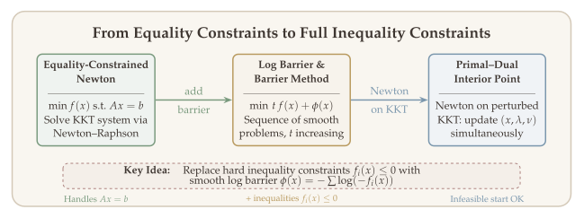
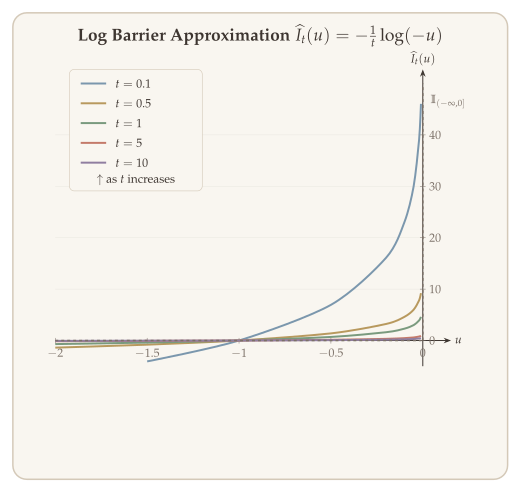
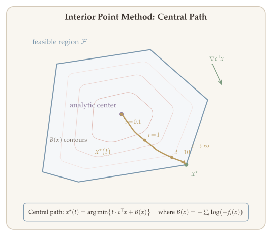
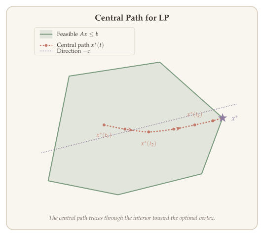
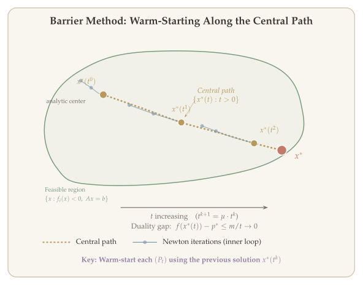
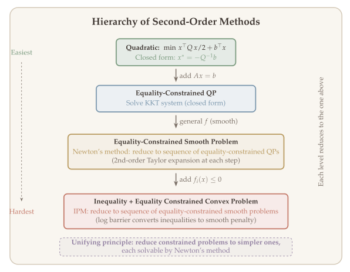

In the previous chapter, we saw that Newton's method achieves quadratic convergence for unconstrained smooth optimization. But most practical problems come with constraints --- resource budgets, physical limits, or domain restrictions. How do we bring the power of Newton's method to **constrained optimization**?

The strategy of this chapter is to build the answer **step by step**, extending Newton's method one layer of difficulty at a time:

1. **From unconstrained to equality-constrained.** We first tackle the simpler problem $\min f(x)$ subject to $Ax = b$. The key modification is to restrict the Newton direction to the null space of $A$, so that every iterate remains feasible. This leads to the *equality-constrained Newton method*, which we develop in two versions: one requiring a feasible starting point, and one that can start from any point.

2. **From equality-constrained to inequality-constrained.** With the equality-constrained Newton method in hand, we handle the full problem --- including inequality constraints $f_i(x) \leq 0$ --- by converting the hard constraints into a smooth *logarithmic barrier* penalty. This reduces the problem to a sequence of equality-constrained subproblems, each solvable by Step 1. As the barrier parameter increases, the solutions trace out a **central path** that converges to the constrained optimum.

This reduction principle --- each level converts its problem to the simpler level above --- is the unifying theme of the chapter and of second-order methods more broadly.

Interior point methods are among the most practically important algorithms in optimization. They underpin modern solvers for linear programming, quadratic programming, semidefinite programming, and general convex programs, achieving polynomial worst-case complexity and excellent practical performance.

::: {.callout-tip}
## Companion Notebook

A [Jupyter notebook for equality-constrained Newton's method](../notebooks/equality-constrained-newton.ipynb) and a [Jupyter notebook for interior point methods](../notebooks/interior-point.ipynb) accompany this chapter with runnable Python implementations of equality-constrained Newton's method (Versions I and II) for analytic centering, and the interior point method with barrier functions and central path visualization.
:::

## Setting: General Convex Programs {#sec-introduction}

We consider the general convex optimization problem:

$$
\min_{x} \; f(x) \qquad \text{s.t.} \quad f_i(x) \leq 0, \;\; i = 1, 2, \ldots, m, \qquad Ax = b.
$$ {#eq-general-convex}

Recall that the unconstrained Newton update takes the form

$$
x^{+} \leftarrow x + \alpha \cdot d_{\mathrm{nt}}(x), \qquad d_{\mathrm{nt}}(x) = -\bigl(\nabla^2 f(x)\bigr)^{-1} \nabla f(x).
$$

This update ignores constraints entirely: the Newton direction $d_{\mathrm{nt}}(x)$ may violate both $Ax = b$ and $f_i(x) \leq 0$. Following the two-step strategy outlined above, we first develop the equality-constrained Newton method (Step 1), then use it as a building block for the full interior point method (Step 2).

## Equality Constrained Problem {#sec-equality-constrained}

We begin with Stage 1: extending Newton's method to handle linear equality constraints.

$$
\min \; f(x) \qquad \text{s.t.} \quad Ax = b,
$$ {#eq-equality-constrained}

where $f$ is convex with $\nabla^2 f \succ 0$, $A \in \mathbb{R}^{p \times n}$ with $\operatorname{rank}(A) = p < n$, and the feasible set $\{x : Ax = b\} \cap \operatorname{dom}(f)$ is nonempty. There are three natural approaches.

### Approach 1: Eliminate the Affine Constraint {#sec-eliminate-constraint}

**Idea.** Reparametrize the feasible set. Every $x$ satisfying $Ax = b$ can be written as $x = Fz + \widehat{x}$, where $\widehat{x}$ is any particular solution, $F \in \mathbb{R}^{n \times (n-p)}$ spans the null space of $A$, and $z \in \mathbb{R}^{n-p}$ is free. Substituting, the problem becomes:

$$
\min_{z \in \mathbb{R}^{n-p}} \; \widetilde{f}(z) = f(Fz + \widehat{x}),
$$

which is unconstrained and can be solved by the Newton methods of the previous chapter.

**Example.** $\min f(x_1, x_2)$ subject to $x_1 + x_2 = 0$. Here $F = (1, -1)^\top$ and $\widehat{x} = 0$, giving the reduced problem $\min_z g(z) = f(z, -z)$.

**When this works well.** If $p$ is large relative to $n$ (i.e., $Ax = b$ leaves few degrees of freedom), the reduced problem has low dimension $n - p$. Also useful when $F$ can be chosen to preserve structure (e.g., sparsity).

**Limitation.** The reparametrization $x = Fz + \widehat{x}$ can destroy useful structure. If $f$ is separable ($f(x) = \sum_i f_i(x_i)$), the reduced objective $\widetilde{f}(z)$ is generally not separable. If $\nabla^2 f$ is sparse or diagonal, $F^\top \nabla^2 f\, F$ may be dense. In these cases, working directly with the constrained formulation is preferable.

### Approach 2: Solve the Dual Problem {#sec-solve-dual}

**Idea.** The Lagrangian is $\mathcal{L}(x, \nu) = f(x) + \nu^\top(Ax - b)$. Minimizing over $x$ gives the dual function $g(\nu) = \inf_x \{f(x) + \nu^\top Ax\} - b^\top \nu$. Using the convex conjugate $f^*(\cdot)$, this becomes:

$$
\text{Dual:} \quad \max_{\nu} \; -f^*(-A^\top \nu) - b^\top \nu.
$$

Since $f$ is strongly convex, strong duality holds and the dual is a smooth unconstrained concave maximization, solvable by gradient ascent or Newton's method.

**When this works well.** The dual is attractive when $f^*$ has a closed form. For example, if $f(x) = \frac{1}{2}x^\top Qx$, then $f^*(y) = \frac{1}{2}y^\top Q^{-1} y$ and the dual becomes a smooth quadratic in $\nu$. Also useful when $p \ll n$ (few constraints), since the dual variable $\nu \in \mathbb{R}^p$ is low-dimensional.

**Limitation.** For general $f$, the conjugate $f^*$ may not have a closed form, making the dual objective expensive to evaluate.

### Approach 3: Equality-Constrained Newton's Method {#sec-eq-constrained-newton}

**Idea.** Work directly in the original $(x, \nu)$ space. Modify the Newton direction so that $A \, d_{\mathrm{nt}}(x) = 0$: if $x$ is feasible ($Ax = b$), then $x^{+} = x + \alpha \cdot d_{\mathrm{nt}}(x)$ remains feasible. This preserves the structure of $f$ and $A$ and avoids computing $f^*$ or $F$.

This is the approach we develop in detail below. It comes in two versions: one requiring a feasible starting point (Version I), and one that can start from any point (Version II).

::: {.callout-tip}
## Recall: KKT Condition

$x^*$ is an optimal solution to ([-@eq-equality-constrained]) if and only if there exists $\nu^*$ such that

$$
\nabla f(x^*) + A^\top \nu^* = 0 \quad \text{(stationarity)}, \qquad Ax^* = b \quad \text{(feasibility)}.
$$

The vector $\nu^* \in \mathbb{R}^p$ is the dual variable (Lagrange multiplier) for the equality constraint.
:::

## Derivation of Newton's Method {#sec-derivation}

Having outlined the three approaches, we now develop the third --- equality-constrained Newton's method --- in detail. The core idea is the same as unconstrained Newton: replace $f$ by its quadratic model and minimize, but now subject to the constraint $Ax = b$.

We will introduce two versions that reflect different tradeoffs:

**Version I (feasible start)** assumes we begin from a point $x^0$ satisfying $Ax^0 = b$. At each step, we minimize the quadratic Taylor model of $f$ over the affine feasible set, yielding a direction $d$ in the null space of $A$. Because every step remains feasible, the analysis reduces to the unconstrained case via a change of variables. The drawback is that finding a feasible starting point can itself be a nontrivial optimization problem.

**Version II (infeasible start)** takes a different perspective. Rather than minimizing $f$ subject to $Ax = b$, it views the KKT conditions as a system of nonlinear equations and applies Newton--Raphson to find the root. This constructs a sequence of primal--dual pairs $\{x^k, \nu^k\}$ converging to $(x^*, \nu^*)$, updating both the primal variable and the Lagrange multiplier simultaneously. The key advantage is that no feasible starting point is needed --- the method drives toward both optimality and feasibility at the same time.

Both versions solve the same linear system at each step. Optimality is characterized by the KKT condition:

$$
\begin{cases}
\nabla f(x) + A^\top \nu = 0 \\
Ax - b = 0
\end{cases}
\qquad \xrightarrow{\text{solution}} \quad (x^*, \nu^*).
$$ {#eq-kkt-system}

Version I approaches this system by solving $\min_{y} \widehat{f}_x(y)$ subject to $Ay = b$ at each step, ensuring the iterates remain feasible throughout. Version II applies Newton--Raphson directly to the full KKT system, allowing the primal iterates to be infeasible initially.

## Version I: Feasible Newton's Method {#sec-version-i}

Suppose $x$ is feasible. Let us replace $f$ by the 2nd-order approximation at $x$:

$$
\min_{y} \; \widehat{f}_x(y) = f(x) + \langle \nabla f(x),\, y - x \rangle + \tfrac{1}{2}(y - x)^\top \nabla^2 f(x)\, (y - x)
$$

subject to $Ay = b$.

When $\nabla^2 f(x) \succ 0$, this is a convex **QP**. Setting $d = y - x$, we obtain the equivalent problem:

$$
\min_{d} \; \widehat{f}_x(x + d) = f(x) + \langle \nabla f(x),\, d \rangle + \tfrac{1}{2} d^\top \nabla^2 f(x)\, d
$$

subject to $Ad = 0$ (since $Ax = b$).

**KKT condition:** The optimal pair $(d^*, w^*)$ satisfies

$$
Ad^* = 0, \qquad \nabla^2 f(x)\, d^* + \nabla f(x) + A^\top w^* = 0.
$$

In matrix form:

$$
\begin{pmatrix} \nabla^2 f(x) & A^\top \\ A & 0 \end{pmatrix}
\begin{pmatrix} d \\ w \end{pmatrix}
=
\begin{pmatrix} -\nabla f(x) \\ 0 \end{pmatrix}.
$$ {#eq-kkt-matrix}

Solving ([-@eq-kkt-matrix]), we get $d_{\mathrm{nt}}(x) = d$.

::: {.callout-tip}
## Properties of Version I

Each Newton step reduces to an **equality-constrained quadratic program** (QP), since we minimize the quadratic model $\widehat{f}_x$ subject to the linear constraint $Ad = 0$. The feasibility property is built in by construction: since $d_{\mathrm{nt}}(x)$ lies in the null space of $A$ (i.e., $A\,d_{\mathrm{nt}}(x) = 0$), any step $x + \alpha\,d_{\mathrm{nt}}(x)$ preserves $Ax = b$. Furthermore, if we eliminate the equality constraint via the reparametrization $x = Fz + \widehat{x}$ (Approach 1), then Version I applied to the original problem is equivalent to running unconstrained Newton on the reduced problem $\min_z \widetilde{f}(z)$. This means the convergence analysis from the previous chapter carries over directly.
:::

### Equivalence to Unconstrained Newton {#sec-eliminate-equality}

We have defined the equality-constrained Newton direction via the KKT system ([-@eq-kkt-matrix]), but we have not yet analyzed its convergence. Do we need an entirely new convergence theory? The answer is no: we can show that Version I is *equivalent* to running unconstrained Newton on a reduced problem, so the convergence results from the previous chapter carry over directly.

The idea is to reparametrize the feasible set. Let $A \in \mathbb{R}^{p \times n}$ and let $\widehat{x}$ be any particular solution to $Ax = b$. Then every feasible point can be written as

$$
Ax = b \iff x = Fz + \widehat{x},
$$

where $z \in \mathbb{R}^{n-p}$ is free, $F \in \mathbb{R}^{n \times (n-p)}$ is a matrix whose columns form a basis for the null space of $A$ (so $AF = 0$ and $\operatorname{rank}(F) = n - p$). Substituting into the objective, the constrained problem becomes the unconstrained problem

$$
\min_{z \in \mathbb{R}^{n-p}} \; \widetilde{f}(z) = f(Fz + \widehat{x}).
$$

The gradient and Hessian of $\widetilde{f}$ are $\nabla \widetilde{f}(z) = F^\top \nabla f(Fz + \widehat{x})$ and $\nabla^2 \widetilde{f}(z) = F^\top \nabla^2 f(Fz + \widehat{x})\, F$, so unconstrained Newton on $\widetilde{f}$ requires solving $F^\top \nabla^2 f\, F\, d_z = -F^\top \nabla f$ at each step.

::: {#exm-eliminate}
## Example: Eliminating a Constraint

Consider $\min f(x_1, x_2)$ subject to $x_1 + x_2 = 0$, so $A = (1, 1)$, $b = 0$. Taking $\widehat{x} = (0, 0)^\top$ and $F = (1, -1)^\top$ (which satisfies $AF = 0$), every feasible point has the form $x = (z, -z)^\top$. The reduced problem is $\min_z \widetilde{f}(z) = f(z, -z)$, which is unconstrained.
:::

The key observation is that running Version I on the original problem (starting from $x^{(0)} = \widehat{x}$) produces iterates $\{x^k\}$ that are related to the unconstrained Newton iterates $\{z^k\}$ on $\widetilde{f}$ (starting from $z^{(0)} = 0$) by $x^k = Fz^k + \widehat{x}$. The two sequences are identical up to the change of variables. This means we do not need a separate convergence analysis for Version I: it inherits the quadratic convergence and two-phase behavior of unconstrained Newton from the previous chapter.

### Geometric Interpretation via the KKT Condition {#sec-kkt-interpretation}

The KKT system ([-@eq-kkt-matrix]) gives us a concrete recipe for computing the Newton direction, but it is worth understanding *geometrically* what the constrained Newton step is doing. This interpretation also provides a direct derivation of the KKT system from first principles, without going through the quadratic subproblem.

The KKT condition for ([-@eq-equality-constrained]) states that $\nabla f(x^*) + A^\top \nu^* = 0$ and $Ax^* = b$. Since $A^\top \nu^* = \sum_{j=1}^p a_j \nu_j^*$ lies in the rowspace of $A$, the first condition says that the gradient of $f$ at the optimum must lie in the rowspace of $A$:

$$
\begin{cases}
\nabla f(x^*) \in \text{rowspace of } A, \\
Ax^* = b.
\end{cases}
$$

In other words, at the constrained optimum, $\nabla f$ has no component in the null space of $A$ --- the only directions along which we could move while staying feasible. This is the geometric content of first-order optimality. @fig-kkt-geometry illustrates the contrast: at a non-optimal feasible point, $\nabla f(x)$ has a nonzero component along the feasible directions (null space of $A$), indicating room for improvement; at the optimum $x^*$, the gradient is entirely perpendicular to the feasible set.

{#fig-kkt-geometry}

To derive the Newton direction from this viewpoint, we linearize the optimality condition at a feasible point $x$ (with $Ax = b$). We seek a direction $d$ such that the linearized gradient $\nabla f(x) + \nabla^2 f(x)\,d$ lies in the rowspace of $A$, while maintaining feasibility $A(x + d) = b$:

$$
\begin{cases}
\nabla f(x) + \nabla^2 f(x)\, d \in \text{rowspace}(A), \\
Ad = 0.
\end{cases}
$$

Writing "lies in rowspace$(A)$" as "$= A^\top w$ for some $w$" recovers exactly the KKT system ([-@eq-kkt-matrix]). This confirms that the equality-constrained Newton step is the natural generalization of the unconstrained one: it drives the gradient toward the rowspace of $A$ (optimality) while keeping iterates on the feasible affine subspace (feasibility).

### Newton Decrement {#sec-newton-decrement}

Just as in the unconstrained case (recall @def-newton-decrement), the Newton decrement provides an affine-invariant measure of progress. For the equality-constrained setting, we define it in terms of the constrained Newton direction.

::: {#def-newton-decrement-eq}
## Newton Decrement (Equality-Constrained)

$$
\lambda(x) = \sqrt{d_{\mathrm{nt}}(x)^\top \nabla^2 f(x)\, d_{\mathrm{nt}}(x)}.
$$

The Newton decrement measures the progress of the Newton step, analogous to the unconstrained case (recall @def-newton-decrement).
:::

**Property:** The Newton decrement quantifies the gap between $f(x)$ and the constrained minimum of its quadratic model:

$$
f(x) - \inf_{v}\bigl\{\widehat{f}_x(x+v) \mid A(x+v) - b = 0\bigr\} = \bigl(\lambda(x)\bigr)^2 / 2.
$$

The proof follows directly from the KKT conditions of the Newton subproblem ([-@eq-kkt-matrix]).

::: {.proof}
From the KKT conditions $A\, d_{\mathrm{nt}}(x) = 0$ and $\nabla^2 f(x)\, d_{\mathrm{nt}}(x) + \nabla f(x) + A^\top w = 0$, we get:

$$
d_{\mathrm{nt}}(x)^\top \nabla^2 f(x)\, d_{\mathrm{nt}}(x) + d_{\mathrm{nt}}(x)^\top \nabla f(x) = 0.
$$

Therefore:

$$
\widehat{f}_x\bigl(x + d_{\mathrm{nt}}(x)\bigr) = f(x) - \tfrac{1}{2}\bigl(\lambda(x)\bigr)^2.
$$

Hence we conclude the proof. $\blacksquare$
:::

### Drawback of Version I: Initialization {#sec-version-i-drawback}

To initialize this method, we need to find $x^0$ such that:

- $Ax^0 = b$,
- $x^0 \in \operatorname{dom}(f)$.

This can be nontrivial when $\operatorname{dom}(f)$ is not $\mathbb{R}^n$.

::: {#exm-initialization}
## Example

$$
\min \; \sum_{i=1}^{n} x_i \cdot \log x_i \qquad \text{s.t.} \quad Ax = b.
$$

Initialization requires finding $x$ satisfying $Ax = b$ and $x > 0$.
:::

**Version II bypasses this challenge.**

## Version II of Newton's Method: Infeasible Start {#sec-version-ii}

Version I requires a feasible starting point, which can be difficult to obtain. Version II removes this requirement by applying Newton--Raphson directly to the KKT system ([-@eq-kkt-system]).

**KKT condition:** $\nabla f(x) + A^\top \nu = 0$, $Ax = b$.

Define:

$$
F(x, \nu) = \begin{pmatrix} \nabla f(x) + A^\top \nu \\ Ax - b \end{pmatrix}.
$$

$(x^*, \nu^*)$ satisfy $F(x, \nu) = 0$ (KKT points).

We can apply Newton--Raphson for this nonlinear equation. The Jacobian is:

$$
JF(x, \nu) = \begin{pmatrix} \nabla^2 f(x) & A^\top \\ A & 0 \end{pmatrix}.
$$

Suppose we are at $(x, \nu)$. The next iterate is:

$$
\begin{pmatrix} x^+ \\ \nu^+ \end{pmatrix} \leftarrow \begin{pmatrix} x \\ \nu \end{pmatrix} - \bigl(JF(x, \nu)\bigr)^{-1} F(x, \nu).
$$

Equivalently:

$$
\begin{pmatrix} \nabla^2 f(x) & A^\top \\ A & 0 \end{pmatrix}
\begin{pmatrix} \Delta x_{\mathrm{nt}} \\ \Delta \nu_{\mathrm{nt}} \end{pmatrix}
+
\begin{pmatrix} \nabla f(x) + A^\top \nu \\ Ax - b \end{pmatrix}
= 0.
$$ {#eq-version-ii-update}

$$
\begin{cases}
x_{\mathrm{new}} = x - \Delta x_{\mathrm{nt}} \\
\nu_{\mathrm{new}} = \nu - \Delta \nu_{\mathrm{nt}}.
\end{cases}
$$

(Of course, we can add a step size.) This update is also called **primal--dual Newton's method**, because we update primal ($x$) and dual ($\nu$) variables together.

::: {.callout-tip}
## Properties of Version II

Under standard regularity conditions, the primal--dual sequence $\{x^k, \nu^k\}$ converges to a KKT point $(x^*, \nu^*)$ with local **quadratic convergence**, inheriting the fast convergence of Newton--Raphson for root-finding. A remarkable structural property is that a single full Newton step ($\alpha = 1$) achieves primal feasibility: from the second equation of ([-@eq-version-ii-update]), we have $A(x + \Delta x) = Ax + A\Delta x = Ax + (b - Ax) = b$. Once the primal iterates become feasible, they remain feasible at all subsequent iterations, and the method becomes equivalent to Version I. In other words, Version II "discovers" feasibility in one step and then behaves like Version I for the rest of the computation.
:::

### Relating Version I and Version II {#sec-relating-versions}

Recall: Newton--Raphson solves the linearized equation:

$$
\widehat{F}\!\left(\begin{pmatrix} x \\ \nu \end{pmatrix} + \begin{pmatrix} d_1 \\ d_2 \end{pmatrix}\right) = F\begin{pmatrix} x \\ \nu \end{pmatrix} + JF\begin{pmatrix} x \\ \nu \end{pmatrix}\begin{pmatrix} d_1 \\ d_2 \end{pmatrix} = 0.
$$

This yields (Version II):

$$
\begin{cases}
(\nabla f(x) + A^\top \nu) + \nabla^2 f(x)\, d_1 + A^\top d_2 = 0 \\
Ax - b + A\, d_1 = 0.
\end{cases}
$$

This is a linearization of the KKT system $\nabla f(x^*) + A^\top \nu^* = 0$, $Ax^* = b$. The substitutions are
$$
x^* \;\to\; x + d_1, \qquad \nu^* \;\to\; \nu + d_2,
$$
i.e., we approximate the optimal primal--dual pair by a linear correction from the current iterate.

**What about Version I?** Given $x$ satisfying $Ax = b$, we replace $x^* \to x + d$ and linearize KKT:

$$
\text{Version I:} \quad
\begin{cases}
\nabla f(x) + \nabla^2 f(x)\, d + A^\top w = 0 \\
Ad = 0.
\end{cases}
$$

**Observation:** If $x$ is feasible ($Ax = b$), then Version I $\iff$ Version II with the identification $d_1 = d$ and $\nu + d_2 = w$.

The following table summarizes the key differences between the two formulations:

| | **Version I** | **Version II** |
|:---|:---|:---|
| **Approach** | Minimize $f$ on the affine subspace $\{x : Ax = b\}$ by solving a constrained quadratic subproblem at each step | Apply Newton--Raphson to the KKT system $F(x,\nu) = 0$, updating primal and dual variables jointly |
| **Variables updated** | Primal $x$ only (dual $w$ is a by-product) | Primal $x$ and dual $\nu$ simultaneously |
| **Initial point** | Must be feasible: $Ax^0 = b$ | Can be infeasible: $Ax^0 \neq b$ allowed |
| **Feasibility** | Maintained at every iteration ($Ad = 0$) | Achieved in one full Newton step, then maintained |
| **Convergence** | Local quadratic (as constrained Newton) | Local quadratic (as Newton--Raphson on $F$) |
| **Equivalent to** | Unconstrained Newton on reduced problem (via null-space of $A$) | Newton--Raphson root-finding on the KKT map |

: Comparison of the two Newton formulations for equality-constrained optimization. {#tbl-version-comparison}

## Example: Equality-Constrained Analytic Centering {#sec-analytic-centering}

::: {#exm-analytic-centering}
## Equality-Constrained Analytic Centering

**Primal problem:**

$$
\min \; -\sum_{i=1}^{n} \log x_i \qquad \text{s.t.} \quad Ax = b.
$$

**Lagrangian:**

$$
\mathcal{L}(x, \nu) = -\sum_{i=1}^{n} \log x_i + (Ax - b)^\top \nu.
$$

**Dual problem:**

$$
\max_{\nu} \; -b^\top \nu + \sum_{i=1}^{n} \log(A^\top \nu)_i + n.
$$

After solving for $\nu^*$, recover $x^*$ by:

$$
x_i^* = \frac{1}{(A^\top \nu)_i}.
$$

In the demo, we try three methods:

- Newton method with equality constraints (2 versions).
- Unconstrained Newton applied to the dual problem.
:::

::: {.callout-tip}
## Remark: Initial Point Requirements

These methods impose different requirements on the initial points:

1. Version I requires $x \succ 0$ and $Ax = b$.
2. Version II requires $x \succ 0$.
3. Dual Newton requires $A^\top \nu > 0$.
:::

### Computing Newton Updates {#sec-computing-newton-updates}

**Equality-constrained Newton (Version I):**

Note that $\nabla^2 f(x) = \operatorname{diag}(x)^{-2}$ and $\nabla f(x) = -\operatorname{diag}(x)^{-1}\mathbf{1}$.

$$
\begin{pmatrix} \operatorname{diag}(x)^{-2} & A^\top \\ A & 0 \end{pmatrix}
\begin{pmatrix} \Delta x \\ w \end{pmatrix}
=
\begin{pmatrix} \operatorname{diag}(x)^{-1}\mathbf{1} \\ 0 \end{pmatrix}.
$$

This gives:

$$
\begin{cases}
A\, \Delta x = 0 \\
\operatorname{diag}(x)^{-2}\, \Delta x + A^\top w = \operatorname{diag}(x)^{-1}\mathbf{1}.
\end{cases}
$$

To solve for $w$: $A\operatorname{diag}(x)^2 A^\top w = A\operatorname{diag}(x)\,\mathbf{1} = Ax = b$.

**Equality-constrained Newton (Version II):**

$$
\begin{pmatrix} \operatorname{diag}(x)^{-2} & A^\top \\ A & 0 \end{pmatrix}
\begin{pmatrix} \Delta x \\ \delta\nu \end{pmatrix}
=
\begin{pmatrix} \operatorname{diag}(x)^{-1}\mathbf{1} - A^\top \nu \\ b - Ax \end{pmatrix}.
$$

From the first block: $\operatorname{diag}(x)^{-2}\Delta x + A^\top \delta\nu = \operatorname{diag}(x)^{-1}\mathbf{1} - A^\top \nu$. Multiplying by $A\operatorname{diag}(x)^2$:

$$
A\,\Delta x + A\operatorname{diag}(x)^2 A^\top \delta\nu = A\operatorname{diag}(x)\mathbf{1} - A\operatorname{diag}(x)^2 A^\top \nu.
$$

Moreover, $A\,\Delta x = b - Ax$. Thus:

$$
A\operatorname{diag}(x)^2 A^\top \nu_{\mathrm{new}} = 2Ax - b.
$$

**Dual Newton:** The third approach applies Newton's method directly to the *dual* problem. Recall from ([-@exm-analytic-centering]) that the dual objective is

$$
g(\nu) = -b^\top \nu + \sum_{i=1}^{n}\log(A^\top \nu)_i + n.
$$

This is an *unconstrained* maximization problem in $\nu$ (subject only to the implicit constraint $A^\top \nu > 0$). Since there are no equality constraints, we apply the standard unconstrained Newton's method.

**Gradient.** Differentiating with respect to $\nu$:

$$
\nabla g(\nu) = -b + A\,\operatorname{diag}(A^\top \nu)^{-1} \mathbf{1}.
$$

To see this, note that $\frac{\partial}{\partial \nu_j}\sum_i \log(A^\top \nu)_i = \sum_i \frac{A_{ij}}{(A^\top \nu)_i}$, which in matrix form gives $A\,\operatorname{diag}(A^\top \nu)^{-1}\mathbf{1}$.

**Hessian.** Differentiating once more:

$$
\nabla^2 g(\nu) = -A\,\operatorname{diag}(A^\top \nu)^{-2}\, A^\top.
$$

Since this is a *maximization* problem, we want $-\nabla^2 g(\nu)$ to be positive definite (i.e., $g$ is concave), which holds as long as $A^\top \nu > 0$ and $A$ has full row rank.

**Newton step.** The Newton update solves $\nabla^2 g(\nu)\,\Delta\nu = -\nabla g(\nu)$, i.e.,

$$
A\,\operatorname{diag}(A^\top \nu)^{-2}\, A^\top\, \Delta\nu = -b + A\,\operatorname{diag}(A^\top \nu)^{-1}\mathbf{1}.
$$

Writing $z = A^\top \nu$ for brevity and $D = \operatorname{diag}(z)^{-2}$, this becomes $A\,D\,A^\top \Delta\nu = A\,\operatorname{diag}(z)^{-1}\mathbf{1} - b$. After solving for $\Delta\nu$, we update $\nu \gets \nu + \Delta\nu$ and recover the primal iterate via $x_i = 1/(A^\top \nu)_i$.

**Conclusion:** In each case --- Version I, Version II, and dual Newton --- the dominant computation is solving a linear system of the form $A\,D\,A^\top w = h$ with a diagonal matrix $D$. All three methods therefore have comparable per-iteration cost, and the choice between them is driven by initialization requirements and algorithmic convenience.

## Going Beyond Equality Constraints: Log Barrier {#sec-log-barrier}

Having established Newton's method for equality-constrained problems ([-@eq-equality-constrained]), we now tackle the full problem ([-@eq-general-convex]) with inequality constraints. The key challenge is that inequality constraints create boundaries that Newton's method cannot handle directly. The **logarithmic barrier** approach provides an elegant resolution.

{#fig-constraint-pipeline}

Now we consider the general convex optimization problem:

$$
\text{(P)} \quad \min_{x \in \mathbb{R}^n} \; f(x) \qquad \text{s.t.} \quad h_i(x) \leq 0, \;\; i = 1, 2, \ldots, m, \qquad Ax = b,
$$

where $A \in \mathbb{R}^{p \times n}$ with $\operatorname{rank}(A) = p$.

We assume that (P) is strictly feasible, so Slater's condition holds and strong duality guarantees that optimality is fully characterized by the KKT conditions: primal feasibility ($Ax^* = b$ and $f_i(x^*) \leq 0$ for all $i$), dual feasibility ($\lambda^* \geq 0$), complementary slackness ($\lambda_i^* f_i(x^*) = 0$ for all $i$), and stationarity ($\nabla f(x^*) + \sum_i \lambda_i^* \nabla f_i(x^*) + A^\top \nu^* = 0$).

The challenge is that the inequality constraints $f_i(x) \leq 0$ and the complementary slackness conditions $\lambda_i f_i(x) = 0$ are fundamentally harder to handle than equality constraints. They introduce a combinatorial aspect --- at the optimum, some constraints are active and some are not, and we do not know which in advance. This makes it difficult to apply Newton's method directly to the KKT system.

### Reduction to Equality Constraints {#sec-reduction}

The idea is to reduce to what we know: equality-constrained problems. Write (P) equivalently as:

$$
\text{(I)} \quad \min \; f(x) + \sum_{i=1}^{m} \mathbb{I}_{(-\infty, 0]}\bigl(f_i(x)\bigr) \qquad \text{s.t.} \quad Ax = b,
$$

where $\mathbb{I}_{(-\infty, 0]}(u) = \begin{cases} 0 & u \leq 0, \\ +\infty & \text{otherwise}. \end{cases}$

Problems (I) and (P) are equivalent. But the objective $f(x) + \sum_{i=1}^{m} \mathbb{I}_{(-\infty,0]}\bigl(f_i(x)\bigr)$ is **not twice differentiable**, so we cannot apply Newton's method.

::: {.callout-note}
## Key Idea

Approximate the indicator function by a **differentiable** function.
:::

### Logarithmic Barrier {#sec-log-barrier-function}

::: {#def-log-barrier-approx}
## Log Barrier Approximation

$$
\widehat{I}_t(u) = -\frac{1}{t}\log(-u), \qquad \operatorname{dom}(\widehat{I}_t) = \{u : u < 0\}.
$$
:::

The log barrier approximation $\widehat{I}_t$ has exactly the properties we need. It is **convex** on its domain $\{u < 0\}$ and **differentiable** with derivative $\widehat{I}_t'(u) = -1/(tu)$, so Newton's method can be applied. It is nondecreasing and blows up as $u \nearrow 0$, creating an infinite penalty at the constraint boundary that keeps iterates strictly feasible. Most importantly, as $t$ increases, $\widehat{I}_t$ approximates the indicator function $\mathbb{I}_{(-\infty,0]}$ more closely: for any fixed $u < 0$, $\widehat{I}_t(u) \to 0$ as $t \to \infty$, while for $u \geq 0$, the function is undefined. This means that solving the barrier problem for large $t$ gives a solution close to the original constrained optimum.

{#fig-log-barrier}

::: {#def-log-barrier}
## Log Barrier Function

$$
\phi(x) = -\sum_{i=1}^{m} \log\bigl(-f_i(x)\bigr).
$$

$$
\operatorname{dom}(\phi) = \{x : f_i(x) < 0 \;\; \forall\, i \in [m]\} = \{x : x \text{ is strictly feasible}\}.
$$
:::

### Approximating (P) by a Smooth Problem {#sec-smooth-approx}

Now the idea is clear: we approximate (P) by a smooth problem:

$$
(P_{\color{#C47A6A}t}) \quad \min \; f(x) + \frac{1}{{\color{#C47A6A}t}}\,\phi(x) = f(x) + \sum_{i=1}^{m} \widehat{I}_{\color{#C47A6A}t}\bigl(f_i(x)\bigr) \qquad \text{s.t.} \quad Ax = b.
$$ {#eq-barrier-problem}

The parameter $t$ controls a fundamental tradeoff. When $t$ is large, the barrier $\widehat{I}_t$ closely approximates the indicator function, so the solution to $(P_t)$ is nearly optimal for the original problem. However, a large $t$ also makes $(P_t)$ harder to solve: the Hessian of the barrier term varies rapidly near the constraint boundary, degrading the conditioning of the Newton subproblem. Ideally we would set $t$ very large and solve $(P_t)$ directly, but this is impractical for the same reason --- the barrier method (introduced in @sec-barrier-method) resolves this by solving a *sequence* of problems with gradually increasing $t$.

To apply Newton's method to $(P_t)$, we need the gradient and Hessian of the log barrier $\phi$. Differentiating the definition $\phi(x) = -\sum_{i=1}^{m}\log(-f_i(x))$ gives

$$
\nabla \phi(x) = \sum_{i=1}^{m} \frac{1}{-f_i(x)} \nabla f_i(x),
$$

and differentiating once more yields

$$
\nabla^2 \phi(x) = \sum_{i=1}^{m} \frac{1}{\bigl(f_i(x)\bigr)^2} \nabla f_i(x)\, \nabla f_i(x)^\top + \sum_{i=1}^{m} \frac{1}{-f_i(x)} \nabla^2 f_i(x).
$$

Note that as $x$ approaches the boundary of the feasible region (i.e., $f_i(x) \nearrow 0$ for some $i$), both the gradient and the Hessian blow up, creating the "barrier" that keeps Newton iterates in the strict interior.

## Central Path {#sec-central-path}

With the barrier formulation ([-@eq-barrier-problem]) in place, we now study how its solution depends on the parameter $t$. As the barrier parameter $t$ varies, each value of $t$ yields a different optimal point $x^*(t)$. The collection of these points traces out a smooth curve in the interior of the feasible region, called the **central path**. This path connects the analytic center (at $t = 0$) to the constrained optimum (as $t \to \infty$).

$$
(P_{\color{#C47A6A}t}) \quad \min \; {\color{#C47A6A}t} \cdot f(x) + \phi(x) \qquad \text{s.t.} \quad Ax = b.
$$

::: {#def-central-path}
## Central Path

The **central path** is $\{x^*({\color{#C47A6A}t}) : {\color{#C47A6A}t} > 0\}$, where $x^*({\color{#C47A6A}t})$ is the solution to $(P_{\color{#C47A6A}t})$.
:::

Two key questions arise about the central path. First, does $x^*(t)$ converge to the constrained optimum $x^*$ as $t \to \infty$? We will show that the answer is yes, with a precise bound on the suboptimality gap. Second, is tracing the central path more efficient than directly solving a single $(P_t)$ with very large $t$? The barrier method, introduced in the next section, achieves this by warm-starting each subproblem with the solution of the previous one.

The central path has several important structural properties. Each point $x^*(t)$ is **strictly feasible**: $f_i(x^*(t)) < 0$ for all $i$ and $Ax^*(t) = b$. This is because the log barrier is defined only in the strict interior. From the KKT condition for $(P_t)$:

$$
0 = {\color{#C47A6A}t}\,\nabla f(x^*({\color{#C47A6A}t})) + \nabla \phi(x^*({\color{#C47A6A}t})) + A^\top \nu({\color{#C47A6A}t}), \quad \text{for some } \nu({\color{#C47A6A}t}).
$$

Moreover, each central point $x^*({\color{#C47A6A}t})$ induces a feasible dual point. Dividing the KKT condition above by ${\color{#C47A6A}t}$ and expanding $\nabla\phi$ gives stationarity of the Lagrangian with multipliers

$$
\lambda_i^*({\color{#C47A6A}t}) = \frac{-1}{{\color{#C47A6A}t} \cdot f_i(x^*({\color{#C47A6A}t}))}, \qquad \nu^*({\color{#C47A6A}t}) = \nu({\color{#C47A6A}t})/{\color{#C47A6A}t}.
$$

Since each $f_i(x^*({\color{#C47A6A}t})) < 0$, we have $\lambda_i^*({\color{#C47A6A}t}) > 0$, so dual feasibility holds. This dual point will allow us to bound the suboptimality of $x^*({\color{#C47A6A}t})$ via weak duality.

### Duality Gap Along the Central Path {#sec-duality-gap}

We now show that the central path converges to the constrained optimum by bounding the suboptimality of $x^*({\color{#C47A6A}t})$ as a function of ${\color{#C47A6A}t}$. The argument uses weak duality: we construct a dual-feasible point from $x^*({\color{#C47A6A}t})$ and bound the gap.

By the construction of $(\lambda^*({\color{#C47A6A}t}), \nu^*({\color{#C47A6A}t}))$ above, the stationarity condition of $(P_{\color{#C47A6A}t})$ gives

$$
\nabla f(x^*({\color{#C47A6A}t})) + \sum_i \lambda_i^*({\color{#C47A6A}t}) \cdot \nabla f_i(x^*({\color{#C47A6A}t})) + A^\top \nu^*({\color{#C47A6A}t}) = 0.
$$

This means that $x^*({\color{#C47A6A}t})$ minimizes the Lagrangian $\mathcal{L}(x, \lambda^*({\color{#C47A6A}t}), \nu^*({\color{#C47A6A}t})) = f(x) + \sum_i \lambda_i f_i(x) + (Ax - b)^\top \nu$ over $x$. We can therefore evaluate the dual function at $(\lambda^*({\color{#C47A6A}t}), \nu^*({\color{#C47A6A}t}))$:

$$
g(\lambda^*({\color{#C47A6A}t}), \nu^*({\color{#C47A6A}t})) = \mathcal{L}(x^*({\color{#C47A6A}t}), \lambda^*({\color{#C47A6A}t}), \nu^*({\color{#C47A6A}t})) = f(x^*({\color{#C47A6A}t})) + \sum_i \lambda_i^*({\color{#C47A6A}t})\, f_i(x^*({\color{#C47A6A}t}))) = f(x^*({\color{#C47A6A}t})) - m/{\color{#C47A6A}t},
$$

where the last step uses $\lambda_i^*({\color{#C47A6A}t}) \cdot f_i(x^*({\color{#C47A6A}t})) = -1/{\color{#C47A6A}t}$ for each $i$ (there are $m$ constraints). Since weak duality gives $g(\lambda^*, \nu^*) \leq p^*$ and since $x^*({\color{#C47A6A}t})$ is primal-feasible ($f(x^*({\color{#C47A6A}t})) \geq p^*$), we obtain:

::: {#thm-duality-gap}
## Duality Gap Bound

$$
f(x^*({\color{#C47A6A}t})) - p^* \leq m/{\color{#C47A6A}t}.
$$ {#eq-duality-gap-bound}
:::

The bound $m/{\color{#C47A6A}t}$ is sharp and reveals the precise rate at which the central path approaches the constrained optimum. As ${\color{#C47A6A}t} \to \infty$, the suboptimality gap vanishes and $x^*({\color{#C47A6A}t}) \to x^*$. In particular, to achieve an $\varepsilon$-optimal solution, it suffices to solve $(P_{\color{#C47A6A}t})$ with ${\color{#C47A6A}t} \geq m/\varepsilon$.

{#fig-central-path-barrier}

### Interpreting the Central Path via Perturbed KKT {#sec-perturbed-kkt}

The triple $(x^*(t), \lambda^*(t), \nu^*(t))$ satisfies a system that looks almost identical to the KKT conditions of the original problem. Primal feasibility holds: $f_i(x^*(t)) < 0$ and $Ax^*(t) = b$. Dual feasibility holds: $\lambda^*(t) \geq 0$. Stationarity holds: $\nabla f(x^*(t)) + \sum_i \lambda_i^*(t)\, \nabla f_i(x^*(t)) + A^\top \nu^*(t) = 0$. The only difference from exact KKT is in complementary slackness: instead of $\lambda_i^* f_i(x^*) = 0$, we have:

$$
\lambda_i^*({\color{#C47A6A}t}) \cdot f_i(x^*({\color{#C47A6A}t})) = -1/{\color{#C47A6A}t}.
$$

This is the KKT system with complementary slackness **perturbed** by $-1/{\color{#C47A6A}t}$. As ${\color{#C47A6A}t} \to \infty$, the perturbation vanishes and the central path converges to a true KKT point. This perturbed-KKT viewpoint motivates the primal--dual interior point method, which applies Newton--Raphson directly to this system.

## Example: LP {#sec-example-lp}

::: {#exm-lp-barrier}
## Example: Linear Programming

Consider the LP:

$$
\min \; c^\top x \qquad \text{s.t.} \quad Ax \leq b.
$$

**Log barrier:** $\phi(x) = -\sum_{i=1}^{m} \log(b_i - a_i^\top x)$, with $\operatorname{dom}(\phi) = \{x : Ax < b\}$.

$$
\nabla \phi(x) = \sum_{i=1}^{m} \frac{1}{b_i - a_i^\top x}\, a_i = A^\top d, \qquad d_i = \frac{1}{b_i - a_i^\top x}.
$$

$$
\nabla^2 \phi(x) = \sum_{i=1}^{m} \frac{a_i\, a_i^\top}{(b_i - a_i^\top x)^2} = A^\top \operatorname{diag}(d)^2\, A = A^\top \operatorname{diag}(d)\, A.
$$

Then $x^*(t)$ satisfies the first-order condition:

$$
t \cdot c + \nabla \phi(x^*(t)) = t \cdot c + A^\top d = 0.
$$

So $\nabla\phi(x^*(t))$ should be **parallel to $-c$**.
:::

{#fig-lp-central-path}

## Barrier Method {#sec-barrier-method}

The duality gap bound @eq-duality-gap-bound tells us *what* accuracy we get for a given $t$, but not *how* to solve the sequence of barrier problems efficiently. The barrier method addresses this by warm-starting each subproblem with the solution of the previous one.

We have established two key facts: first, @thm-duality-gap shows that $x^*(t)$ converges to $x^*$ with suboptimality bounded by $m/t$. Second, the central path provides a smooth curve of strictly feasible points connecting the analytic center to the constrained optimum. The **barrier method** exploits this structure by solving $(P_t)$ for a sequence of increasing values of $t$, warm-starting each subproblem from the previous solution. This is far more efficient than solving a single $(P_t)$ with very large $t$ from scratch.

The method solves $\min\; t \cdot f(x) + \phi(x)$ subject to $Ax = b$ for increasing values of $t$, stopping when the duality gap falls below the desired tolerance:

$$
m/t \leq \varepsilon \implies t \geq m/\varepsilon.
$$

**How to make it efficient?** The key idea: **initialize $(P_{t^{k+1}})$ using $x^*(t^k)$**.

::: {.callout-note appearance="simple"}
## Algorithm: Barrier Method

1. Fix $t^0 > 0$, $\mu > 1$.
2. **Initialization:** Use Newton's method to solve $(P_{t^0})$. Set $x^0 = x^*(t^0)$.
   - (How to initialize for $(P_{t^0})$? Assume we know a strictly feasible point $\bar{x}$.)
3. **Repeat** for $k = 1, 2, \ldots$:
   - Solve $(P_{t^k})$ using Newton's method, initialized from $x^{k-1}$. Set $x^k = x^*(t^k)$.
   - Set $t^{k+1} = \mu \cdot t^k$.
   - **Stop** when $t \geq m/\varepsilon$.
:::

{#fig-barrier-warmstart}

### Choice of $\mu$ and $t^0$ {#sec-parameter-choice}

The parameters $\mu$ and $t^0$ control the tradeoff between the number of outer iterations and the difficulty of each inner subproblem. If $\mu$ is **too small**, the barrier parameter grows slowly and we need many outer iterations before reaching $t \geq m/\varepsilon$. If $\mu$ is **too large**, consecutive values $t^k$ and $t^{k+1} = \mu \cdot t^k$ are far apart, so $x^*(t^k)$ is no longer a good initialization for $(P_{t^{k+1}})$ and Newton's method needs many inner iterations to converge. The sweet spot is typically $\mu \in [2, 50]$, where warm-starting is effective but progress per outer step is substantial.

Similarly, if $t^0$ is **too small**, we start far from the optimum and need many outer iterations; if $t^0$ is **too large**, the first subproblem $(P_{t^0})$ has a steep barrier landscape and Newton's method struggles without a good initialization. In practice, $t^0$ is chosen so that $(P_{t^0})$ is easy to solve from the given strictly feasible starting point.

### Convergence Analysis {#sec-convergence}

::: {#thm-barrier-convergence}
## Barrier Method Convergence

After solving $(P_{t^k})$, we have

$$
f(x^k) - p^* \leq \frac{m}{\mu^k \cdot t^0}.
$$

This is **linear convergence** in the number of outer iterations.
:::

There is a remaining question: how to initialize $(P_{t^0})$? The barrier method requires a **strictly feasible** starting point $\bar{x}$ satisfying $f_i(\bar{x}) < 0$ for all $i$ and $A\bar{x} = b$. In some applications such a point is known from the problem structure (e.g., the all-ones vector for certain portfolio or flow problems), but in general finding one is itself an optimization problem.

### Initializing the Barrier Method {#sec-initialization}

The standard approach is to solve an **auxiliary problem** that minimizes the maximum constraint violation. Introduce a slack variable $s \in \mathbb{R}$:

$$
\text{(Aux)} \quad \min_{x, s} \; s \qquad \text{s.t.} \quad f_i(x) \leq s \;\; \forall\, i \in [m], \qquad Ax = b.
$$

The key observation is that (Aux) is always easy to initialize: for *any* $x_0$ satisfying $Ax_0 = b$ (obtainable by solving a linear system), setting $s_0 = \max_i f_i(x_0) + 1$ makes $(x_0, s_0)$ strictly feasible for (Aux), since $f_i(x_0) < s_0$ for all $i$. We can therefore apply the barrier method to (Aux) starting from $(x_0, s_0)$.

Let $\bar{p}^*$ be the optimal value of (Aux). The outcome determines whether the original problem is feasible:

- If $\bar{p}^* < 0$: the optimal $x^*$ of (Aux) satisfies $f_i(x^*) \leq \bar{p}^* < 0$ for all $i$ and $Ax^* = b$. This $x^*$ is the strictly feasible starting point we need for the barrier method on (P).
- If $\bar{p}^* \geq 0$: no strictly feasible point exists, and the original problem (P) is **infeasible** (or has no strict interior, so Slater's condition fails).

This two-phase approach --- first solve (Aux) to find a feasible point, then solve (P) via the barrier method --- mirrors the Phase I / Phase II structure of the simplex method in linear programming.

### Putting It All Together {#sec-barrier-summary}

We now summarize the complete barrier method pipeline, showing how the pieces developed above fit together into a single algorithm.

**Step 1: Find a strictly feasible starting point.** Solve the auxiliary problem (Aux) to obtain a point $\bar{x}$ satisfying $f_i(\bar{x}) < 0$ for all $i$ and $A\bar{x} = b$. If no such point exists, the original problem is infeasible and we stop.

**Step 2: Choose initial parameters.** Pick $t^0 > 0$ (initial barrier parameter) and $\mu > 1$ (growth factor). As discussed in @sec-parameter-choice, $t^0$ should be small enough that $(P_{t^0})$ is easy to solve from $\bar{x}$, and $\mu$ is typically in the range $[2, 50]$.

**Step 3: Solve the first barrier subproblem.** Starting from $\bar{x}$, apply the equality-constrained Newton method (Version I or II from @sec-derivation) to solve

$$
(P_{t^0}) \quad \min \; t^0 \cdot f(x) + \phi(x) \qquad \text{s.t.} \quad Ax = b.
$$

This is a smooth, equality-constrained problem --- exactly the type we developed Newton's method for in @sec-eq-constrained-newton. The Newton subproblem at each inner iteration requires solving the KKT system ([-@eq-kkt-matrix]) with $f$ replaced by $t^0 f + \phi$. Run Newton's method until convergence (using the Newton decrement as a stopping criterion), obtaining $x^0 \approx x^*(t^0)$.

**Step 4: Outer loop --- increase $t$ and warm-start.** For $k = 1, 2, \ldots$:

- Set $t^k = \mu \cdot t^{k-1}$.
- Solve $(P_{t^k})$ using Newton's method, **initialized from $x^{k-1}$** (the solution of the previous subproblem). Because $x^{k-1} \approx x^*(t^{k-1})$ lies close to $x^*(t^k)$ on the central path, Newton's method converges in only a few iterations.
- Record $x^k \approx x^*(t^k)$.

**Step 5: Stopping criterion.** By @thm-duality-gap, the suboptimality after the $k$-th outer iteration is at most $m/t^k = m/(\mu^k t^0)$. Stop when $m/t^k \leq \varepsilon$, i.e., after $k \geq \log(m/(\varepsilon t^0)) / \log \mu$ outer iterations. At this point, $x^k$ is an $\varepsilon$-optimal solution to the original problem (P).

The total work is (number of outer iterations) $\times$ (Newton steps per subproblem). The number of outer iterations is $O(\log(1/\varepsilon))$. With appropriate self-concordant barrier theory (see [BV], Chapter 11), each subproblem requires $O(\sqrt{m})$ Newton steps when warm-started, giving the celebrated **$O(\sqrt{m}\log(1/\varepsilon))$** total iteration bound for interior point methods.

## Primal--Dual Interior Point {#sec-primal-dual-ipm}

The barrier method solves a sequence of smooth subproblems, each to high accuracy. A more aggressive alternative is the **primal--dual interior point method**, which directly applies Newton--Raphson to the perturbed KKT system and updates the barrier parameter $t$ at every iteration.

Recall that for the equality-constrained problem, Version II ([-@eq-version-ii-update]) applied Newton--Raphson directly to the KKT system, updating primal and dual variables simultaneously without requiring a feasible starting point. We now apply the same idea to the full problem (P) with inequality constraints, targeting the **perturbed KKT conditions** from @sec-perturbed-kkt. Instead of the exact complementary slackness $\lambda_i f_i(x) = 0$, we solve the relaxed system $\lambda_i f_i(x) = -1/{\color{#C47A6A}t}$, which defines the central path.

{#fig-primal-dual-ipm}

The perturbed KKT system takes the form:

$$
\begin{cases}
\nabla f(x) + \sum_{i=1}^{m} \lambda_i\, \nabla f_i(x) + A^\top \nu = 0 \\
\lambda_i \cdot f_i(x) + 1/{\color{#C47A6A}t} = 0 \\
Ax = b \\
f_i(x) \leq 0 \\
\lambda \geq 0.
\end{cases}
$$

Define the **residual** $R(x, \lambda, \nu)$:

$$
R(x, \lambda, \nu) = \begin{pmatrix} r_{\mathrm{dual}}(x, \lambda, \nu) \\ r_{\mathrm{cent}}(x, \lambda, \nu) \\ r_{\mathrm{prim}}(x, \lambda, \nu) \end{pmatrix}
=
\begin{pmatrix} \nabla f(x) + \nabla F(x)^\top \lambda + A^\top \nu \\ -\operatorname{diag}(\lambda) \cdot F(x) - \frac{1}{{\color{#C47A6A}t}}\mathbf{1} \\ Ax - b \end{pmatrix},
$$

where $F(x) = \begin{pmatrix} f_1(x) \\ \vdots \\ f_m(x) \end{pmatrix}$ and $\nabla F(x) = \begin{pmatrix} \nabla f_1(x)^\top \\ \vdots \\ \nabla f_m(x)^\top \end{pmatrix}$.

Here $r_{\mathrm{dual}}$ is the **dual residual**, $r_{\mathrm{cent}}$ is the **centrality residual**, and $r_{\mathrm{prim}}$ is the **primal residual**.

### Newton Step for Primal--Dual IPM {#sec-pd-newton-step}

Given the current iterate $y = (x, \lambda, \nu)$, we can compute the residual $R(x, \lambda, \nu)$ and the Jacobian:

$$
\begin{pmatrix}
H_{\mathrm{pd}}(x) & \nabla F(x)^\top & A^\top \\
-\operatorname{diag}(\lambda)\,\nabla F(x) & -\operatorname{diag}(F(x)) & 0 \\
A & 0 & 0
\end{pmatrix},
$$

where $H_{\mathrm{pd}}(x) = \nabla^2 f(x) + \sum_{i=1}^{m} \lambda_i\, \nabla^2 f_i(x)$.

The update direction $\Delta y = \begin{pmatrix} \Delta x \\ \Delta \lambda \\ \Delta \nu \end{pmatrix}$ is solved by:

$$
\begin{pmatrix}
H_{\mathrm{pd}}(x) & \nabla F(x)^\top & A^\top \\
-\operatorname{diag}(\lambda)\,\nabla F(x) & -\operatorname{diag}(F(x)) & 0 \\
A & 0 & 0
\end{pmatrix}
\begin{pmatrix} \Delta x \\ \Delta \lambda \\ \Delta \nu \end{pmatrix}
= -\begin{pmatrix} r_{\mathrm{dual}} \\ r_{\mathrm{cent}} \\ r_{\mathrm{prim}} \end{pmatrix}.
$$

Then $y \leftarrow y + \Delta y$.

### Surrogate Duality Gap {#sec-surrogate-gap}

A key question is how to update the barrier parameter ${\color{#C47A6A}t}$ adaptively. Unlike the barrier method, which fixes a schedule for ${\color{#C47A6A}t}$, the primal--dual method uses the **surrogate duality gap** to determine ${\color{#C47A6A}t}$ on the fly:

$$
\eta = -\sum_{i=1}^{m} \lambda_i \cdot f_i(x).
$$

When the primal and dual residuals vanish ($r_{\mathrm{prim}} = 0$ and $r_{\mathrm{dual}} = 0$), $\eta$ equals the true duality gap. Along the central path where the perturbed KKT conditions hold exactly, we have $\lambda_i f_i(x) = -1/{\color{#C47A6A}t}$ for each $i$, so $\eta = m/{\color{#C47A6A}t}$, giving ${\color{#C47A6A}t} = m/\eta$. This relationship allows the algorithm to set ${\color{#C47A6A}t}$ based on the current state of the iterate rather than following a predetermined schedule.

### Algorithm: Primal--Dual Interior Point {#sec-pd-algorithm}

::: {.callout-note appearance="simple"}
## Algorithm: Primal--Dual Interior Point Method

**Input:** Start with a strictly feasible point $x^0$, $\lambda^0$, $\nu^0$ satisfying $f_i(x^0) < 0$ (note: $Ax^0 \neq b$ is okay), $\lambda^0 > 0$, $\lambda^0 \in \mathbb{R}^m$.

Define $\eta^0 = -\sum_{i=1}^{m} \lambda_i^0 \cdot f_i(x^0)$.

Fix $\mu > 1$.

**Repeat** for $k = 1, 2, 3, \ldots$:

1. Define ${\color{#C47A6A}t} = \mu \cdot m / \eta^{k-1}$ (increase ${\color{#C47A6A}t}$).
2. Compute update direction $\Delta y$.
3. Update: $y^k = y^{k-1} + \alpha^k \cdot \Delta y$, where $\alpha^k$ is a step size determined by line search.
4. Compute $\eta^k = -\sum_i \lambda_i^k \cdot f_i(x^k)$.
5. **Stop** if $\eta^k \leq \varepsilon$ and $\|R(x^k, \lambda^k, \nu^k)\| \leq \varepsilon$.
:::

::: {.callout-tip}
## Advantage of the Primal--Dual Version

The barrier method must solve each subproblem $(P_{\color{#C47A6A}t})$ to high accuracy before increasing ${\color{#C47A6A}t}$, because Newton's convergence guarantee requires a good starting point. The primal--dual method, by contrast, updates ${\color{#C47A6A}t}$ at **every** iteration, taking only a single Newton step per value of ${\color{#C47A6A}t}$. This aggressive strategy is possible because the Newton step on the full KKT system simultaneously drives down the primal residual, dual residual, and centrality gap. In practice, primal--dual IPMs typically converge in fewer total iterations than the barrier method.
:::

The following table summarizes the key differences:

| | **Barrier Method** | **Primal--Dual IPM** |
|:---|:---|:---|
| **Structure** | Outer loop (increase ${\color{#C47A6A}t}$) + inner loop (Newton on $(P_{\color{#C47A6A}t})$) | Single loop: update ${\color{#C47A6A}t}$ and take one Newton step per iteration |
| **What Newton solves** | Equality-constrained barrier subproblem $(P_{\color{#C47A6A}t})$ | Perturbed KKT system for $(x, \lambda, \nu)$ jointly |
| **Feasibility of iterates** | Always strictly feasible: $f_i(x^k) < 0$, $Ax^k = b$ | Can be **infeasible**: $Ax^k \neq b$ and $f_i(x^k) \not\leq 0$ allowed |
| **Relationship to central path** | Iterates follow the central path closely | Iterates cut across the central path |
| **Update of ${\color{#C47A6A}t}$** | Fixed schedule: $t^{k+1} = \mu \cdot t^k$ | Adaptive: ${\color{#C47A6A}t} = \mu \cdot m / \eta^k$ based on surrogate gap |
| **Inner iterations per ${\color{#C47A6A}t}$** | Many (solve $(P_{\color{#C47A6A}t})$ to convergence) | One (single Newton step) |
| **Practical performance** | Reliable, well-understood theory | Typically fewer total iterations |

: Comparison of the barrier method and the primal--dual interior point method. {#tbl-ipm-comparison}

## Summary: Hierarchy of Second-Order Methods {#sec-summary}

{#fig-second-order-hierarchy}

The methods we have developed form a natural hierarchy, where each level reduces a harder problem to the simpler one above it.

At the bottom is the **quadratic function** $\min\, x^\top Q x/2 + b^\top x$, which has a closed-form solution $x^* = -Q^{-1}b$. Adding linear equality constraints $Ax = b$ gives the **equality-constrained QP**, which is still solvable in closed form via the KKT system. Moving to a general smooth objective $f$ with equality constraints, **Newton's method** reduces the problem to a sequence of equality-constrained QPs by replacing $f$ with its second-order Taylor expansion at each step. Finally, adding inequality constraints $f_i(x) \leq 0$ gives the most general setting. The **interior point method** handles this by converting inequality constraints to a smooth log barrier penalty, reducing each subproblem to an equality-constrained smooth optimization that Newton's method can solve.

The unifying principle is **reduction**: each level converts its problem into a sequence of instances from the level above, leveraging the structure and algorithms already available.

## Second-Order Methods Comparison {.unnumbered}

| Method | Phase | Convergence | Iterations to $\varepsilon$-optimal | Per-Iteration Cost |
|--------|-------|-------------|-----------------------------------|-------------------|
| Pure Newton | Local (near $x^\star$) | Quadratic | $O(\log\log(1/\varepsilon))$ | $O(n^3)$ |
| Damped Newton | Global → local | Linear → quadratic | $O(\log(1/\varepsilon))$ | $O(n^3)$ |
| Interior Point | Path-following | Linear (in barrier) | $O(\sqrt{m}\log(1/\varepsilon))$ | $O(n^3)$ per Newton step |

*Here $n$ is the variable dimension and $m$ is the number of constraints.*

## Final Remarks {.unnumbered}

Interior point methods represent one of the great success stories of optimization. The theoretical breakthrough came in 1984 when Karmarkar showed that linear programs could be solved in polynomial time by an interior point algorithm, settling a long-standing question about the complexity of LP (the simplex method, while excellent in practice, has exponential worst-case complexity). Since then, IPMs have been extended to handle semidefinite programs, second-order cone programs, and general self-concordant barrier problems.

**What we covered.** We developed the interior point framework in three stages: (1) equality-constrained Newton's method (Versions I and II), which modifies the Newton direction to respect linear equality constraints; (2) the logarithmic barrier, which converts inequality constraints into a smooth penalty term; and (3) the barrier method and primal--dual IPM, which trace the central path toward the constrained optimum. The unifying principle is reduction --- each level of the hierarchy converts a harder problem into a sequence of simpler ones, ultimately solved by Newton's method.

**Practical impact.** Modern optimization solvers (MOSEK, Gurobi's barrier solver, CVXPY's backend SCS) are built on interior point methods. For problems with moderate dimensions and many constraints, IPMs typically outperform first-order methods by a large margin, achieving high-accuracy solutions in tens of Newton iterations.

**Limitations and tradeoffs.** Each Newton step requires solving a linear system of size $n + p$ (or $n + m + p$ for the primal--dual method), costing $O(n^3)$ in the dense case. For very large-scale problems (millions of variables), this per-iteration cost becomes prohibitive. This is the primary motivation for the first-order methods we develop in the remaining chapters: they replace the expensive Newton step with a cheap gradient step, trading per-iteration cost for a slower convergence rate.

**References.** The presentation in this chapter follows [Boyd and Vandenberghe, *Convex Optimization*](https://web.stanford.edu/~boyd/cvxbook/bv_cvxbook.pdf), Chapters 10--11. For self-concordant barrier theory and the complexity analysis of path-following methods, see Nesterov and Nemirovskii, *Interior-Point Polynomial Algorithms in Convex Programming* (1994).

::: {.callout-tip}
## Looking Ahead
Having established the second-order method toolkit --- Newton's method and interior point methods --- we now turn to **first-order methods** in the next chapter. We will revisit gradient descent with a fresh perspective, develop its convergence theory under various convexity assumptions, and set the stage for more advanced first-order algorithms such as subgradient methods and proximal gradient descent.
:::
