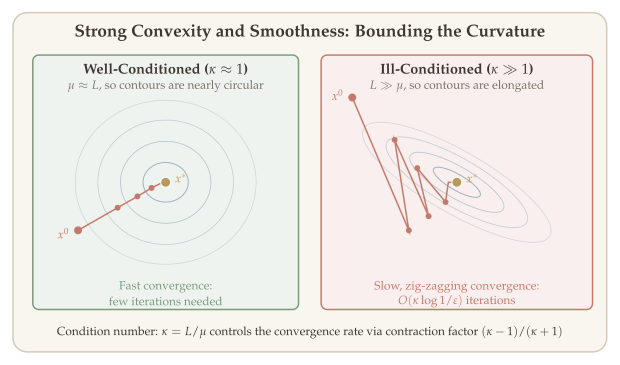
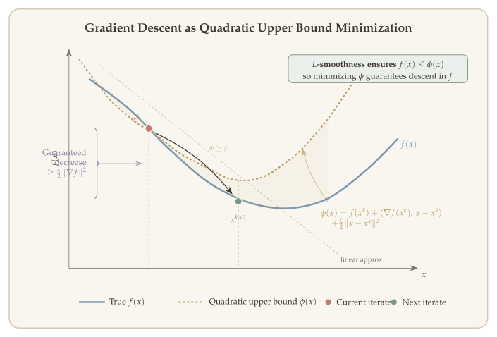
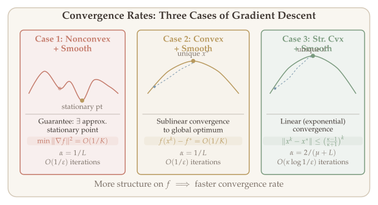
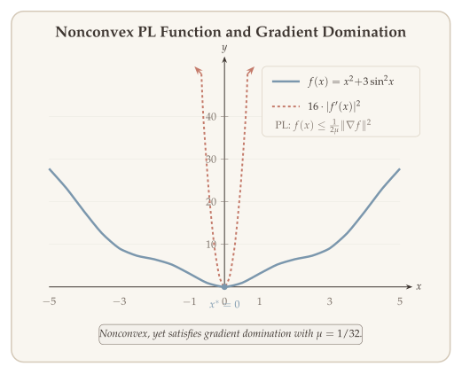

Gradient descent is the workhorse of modern optimization. Its simplicity---update the current iterate by stepping in the direction opposite to the gradient---belies a rich convergence theory that depends crucially on the structural properties of the objective function. In this chapter we develop that theory systematically, beginning with the key notions of strong convexity and smoothness, then analyzing gradient descent under three progressively stronger assumptions: nonconvex + smooth, convex + smooth, and strongly convex + smooth. We conclude by exploring relaxed conditions---local strong convexity and the Polyak--Łojasiewicz inequality---under which linear convergence can still be obtained.

::: {.callout-tip}
## Companion Notebook

A [Jupyter notebook](https://colab.research.google.com/github/ZhuoranYang/sds632-notes/blob/main/notebooks/gradient-descent.ipynb) accompanies this chapter with runnable Python implementations of gradient descent convergence experiments, Polyak--Łojasiewicz functions, and comparisons of step size strategies.
:::

## Gradient Descent and Structural Conditions {#sec-vanilla-gd}

We consider the unconstrained optimization problem

$$\min_{x \in D} \; f(x), \qquad D = \operatorname{dom}(f) \subseteq \mathbb{R}^n,$$

where $f$ is continuously differentiable.

::: {#def-vanilla-gd}
## Vanilla Gradient Descent

**Vanilla gradient descent** generates iterates according to

$$x^{k+1} = x^k - \alpha^k \, \nabla f(x^k), \qquad k \geq 0,$$

where $\alpha^k > 0$ is the step size (learning rate). The descent direction at each step is $-\nabla f(x^k)$.
:::

Why the negative gradient? At $x^k$, the first-order Taylor expansion gives $f(x^k + d) \approx f(x^k) + \nabla f(x^k)^\top d$. Among all directions $d$ with $\|d\|_2 \leq 1$, the one that decreases this linear approximation the fastest is $d = -\nabla f(x^k)/\|\nabla f(x^k)\|_2$. So gradient descent follows the direction of **steepest decrease of the local linear model**.

More generally, given an arbitrary norm $\|\cdot\|$, the **steepest descent direction** at $x^k$ is $d^k = \arg\min_{\|d\| \leq 1} \langle \nabla f(x^k), d \rangle$. When the norm is Euclidean, this recovers vanilla gradient descent (up to rescaling of the step size).

The algorithm is simple, but the central question remains: **how fast does it converge?** The answer depends entirely on the structural properties of $f$. We now introduce the two key conditions --- strong convexity and smoothness --- that govern the convergence rate. Informally, strong convexity says that $f$ curves upward at least as fast as a quadratic, while smoothness says that the gradient does not change too quickly. Together, they **sandwich the curvature of $f$ between two quadratics**, and the ratio $\kappa = L/\mu$ of their parameters --- the **condition number** --- governs the convergence rate.

### Strong Convexity {#sec-strong-convexity}

::: {#def-strong-convexity}
## Strong Convexity

A function $f$ is **$\mu$-strongly convex** (with $\mu > 0$) if the function $\{f(x) - \tfrac{\mu}{2}\|x\|_2^2\}$ is convex.
:::

#### First-Order Characterizations {#sec-first-order-sc}

The following equivalent conditions are often more convenient than the definition.

::: {#thm-sc-equivalences}
## Equivalent Characterizations of Strong Convexity

Let $f$ be $\mu$-strongly convex with $\mu > 0$. The following are equivalent:

**(i)** $f(y) \geq f(x) + \nabla f(x)^\top (y - x) + \tfrac{\mu}{2}\|x - y\|_2^2 \quad \forall\, x, y$.

**(ii)** For all $\lambda \in [0, 1]$:
$$f(\lambda x + (1 - \lambda) y) \leq \lambda \cdot f(x) + (1 - \lambda) \cdot f(y) - \tfrac{\mu}{2} \cdot \lambda(1 - \lambda) \cdot \|x - y\|_2^2.$$

**(iii)** $\langle \nabla f(x) - \nabla f(y),\, x - y \rangle \geq \mu \cdot \|x - y\|_2^2$.
:::

::: {.proof}
We prove the equivalences by showing Definition $\Rightarrow$ (i) $\Rightarrow$ (ii) $\Rightarrow$ Definition, and (i) $\Leftrightarrow$ (iii).

**Definition $\Rightarrow$ (i).** By definition, $g(x) = f(x) - \tfrac{\mu}{2}\|x\|_2^2$ is convex. The first-order characterization of convexity gives $g(y) \geq g(x) + \nabla g(x)^\top(y - x)$. Substituting $g$ and $\nabla g(x) = \nabla f(x) - \mu x$:

$$f(y) - \tfrac{\mu}{2}\|y\|_2^2 \geq f(x) - \tfrac{\mu}{2}\|x\|_2^2 + (\nabla f(x) - \mu x)^\top(y - x).$$

Moving the $\mu$ terms to the right-hand side and using the identity

$$\tfrac{\mu}{2}\|y\|_2^2 - \tfrac{\mu}{2}\|x\|_2^2 - \mu\, x^\top(y - x) = \tfrac{\mu}{2}\|y - x\|_2^2$$

gives $f(y) \geq f(x) + \nabla f(x)^\top(y-x) + \tfrac{\mu}{2}\|y-x\|_2^2$, which is (i).

**(i) $\Rightarrow$ (ii).** Set $z = \lambda x + (1-\lambda)y$ and apply (i) at the point $z$ in two directions:

$$f(x) \geq f(z) + \nabla f(z)^\top(x-z) + \tfrac{\mu}{2}\|x-z\|_2^2,$$

$$f(y) \geq f(z) + \nabla f(z)^\top(y-z) + \tfrac{\mu}{2}\|y-z\|_2^2.$$

Multiply the first by $\lambda$ and the second by $(1-\lambda)$, then add. The gradient terms cancel because $\lambda(x-z) + (1-\lambda)(y-z) = 0$:

$$\lambda f(x) + (1-\lambda)f(y) \geq f(z) + \tfrac{\mu}{2}\bigl[\lambda\|x-z\|_2^2 + (1-\lambda)\|y-z\|_2^2\bigr].$$

Since $\|x - z\|_2 = (1-\lambda)\|x-y\|_2$ and $\|y-z\|_2 = \lambda\|x-y\|_2$, the bracket simplifies:

$$\lambda(1-\lambda)^2 + (1-\lambda)\lambda^2 = \lambda(1-\lambda)\bigl[(1-\lambda) + \lambda\bigr] = \lambda(1-\lambda).$$

Rearranging gives $f(z) \leq \lambda f(x) + (1-\lambda)f(y) - \tfrac{\mu}{2}\lambda(1-\lambda)\|x-y\|_2^2$, which is (ii).

**(ii) $\Rightarrow$ Definition.** Condition (ii) says

$$\lambda f(x) + (1-\lambda)f(y) - f(\lambda x + (1-\lambda)y) \geq \tfrac{\mu}{2}\lambda(1-\lambda)\|x-y\|_2^2.$$

The right-hand side can be rewritten using the identity $\lambda(1-\lambda)\|x-y\|_2^2 = \lambda\|x\|_2^2 + (1-\lambda)\|y\|_2^2 - \|\lambda x + (1-\lambda)y\|_2^2$ (expand and verify). Therefore $g(x) = f(x) - \tfrac{\mu}{2}\|x\|_2^2$ satisfies

$$g(\lambda x + (1-\lambda)y) \leq \lambda\, g(x) + (1-\lambda)\,g(y),$$

which is the definition of convexity of $g$.

**(i) $\Rightarrow$ (iii).** Write (i) twice, swapping the roles of $x$ and $y$:

$$f(y) \geq f(x) + \nabla f(x)^\top(y-x) + \tfrac{\mu}{2}\|y-x\|_2^2,$$

$$f(x) \geq f(y) + \nabla f(y)^\top(x-y) + \tfrac{\mu}{2}\|x-y\|_2^2.$$

Adding these two inequalities, the $f(x)$ and $f(y)$ terms cancel:

$$0 \geq (\nabla f(x) - \nabla f(y))^\top(y - x) + \mu\|x-y\|_2^2,$$

which rearranges to $\langle \nabla f(x) - \nabla f(y), x - y \rangle \geq \mu\|x-y\|_2^2$. This is (iii).

**(iii) $\Rightarrow$ (i).** Define the scalar function $h(t) = f(x + t(y-x))$ for $t \in [0,1]$. Then

$$h'(t) = \nabla f(x + t(y-x))^\top(y-x).$$

Applying (iii) at the points $x + t(y-x)$ and $x$ with direction $y - x$:

$$h'(t) - h'(0) = \langle \nabla f(x + t(y-x)) - \nabla f(x),\, y - x \rangle \geq \mu\, t\,\|y-x\|_2^2.$$

Integrating from $0$ to $1$:

$$f(y) - f(x) - \nabla f(x)^\top(y-x) = \int_0^1 \bigl(h'(t) - h'(0)\bigr)\,dt \geq \int_0^1 \mu\, t\,\|y-x\|_2^2\,dt = \tfrac{\mu}{2}\|y-x\|_2^2.$$

This recovers the quadratic lower bound (i), completing the cycle of implications. $\blacksquare$
:::

#### Properties of Strong Convexity {#sec-sc-properties}

Strong convexity endows the optimization landscape with several powerful properties that are central to convergence analysis.

::: {#thm-sc-properties}
## Properties of Strong Convexity

Let $f$ be $\mu$-strongly convex. Then:

**(1)** The minimizer $x^*$ is **unique**.

**(2)** (Definition) $f(y) \geq f(x) + \nabla f(x)^\top (y - x) + \tfrac{\mu}{2}\|y - x\|_2^2$.

**(3)** (Co-coercivity) $(\nabla f(x) - \nabla f(y))^\top (x - y) \geq \mu\,\|x - y\|_2^2$ (equivalently $\nabla^2 f \succeq \mu \cdot I$).

**(4)** (Gradient domination) $\tfrac{1}{2}\|\nabla f(x)\|_2^2 \geq \mu \cdot (f(x) - f(x^*))$.

**(5)** (Quadratic upper bound via gradient) $f(y) \leq f(x) + \nabla f(x)^\top (y - x) + \tfrac{1}{2\mu}\|\nabla f(y) - \nabla f(x)\|_2^2$.
:::

Property (4)---gradient domination---is particularly important. It says that whenever the gradient is small, the function value must be close to optimal.

::: {.proof}
**Proof of Property (4).** In Property (2), minimize over $y \in \mathbb{R}^n$. We have

$$g(y) = f(x) + \nabla f(x)^\top (y - x) + \tfrac{\mu}{2}\|y - x\|_2^2,$$

which has minimizer $y^* = x - \tfrac{1}{\mu}\nabla f(x)$. Evaluating,

$$f(x^*) \geq f(x) - \tfrac{1}{2\mu}\|\nabla f(x)\|_2^2,$$

that is,

$$\|\nabla f(x)\|_2^2 \geq 2\mu \cdot (f(x) - f(x^*)).$$

This is the gradient domination inequality. $\blacksquare$
:::

::: {.proof}
**Proof of Property (5).** Define $\varphi_x(z) = f(z) - \nabla f(x)^\top z$. This function differs from $f$ only by a linear term, so $\varphi_x$ is still $\mu$-strongly convex. Moreover, $\nabla \varphi_x(z) = \nabla f(z) - \nabla f(x)$, and the minimizer of $\varphi_x$ is $x$ itself (since $\nabla \varphi_x(x) = 0$).

Now observe that

$$f(y) - f(x) - \nabla f(x)^\top (y - x) = \varphi_x(y) - \varphi_x(x).$$

Applying Property (4) to the $\mu$-strongly convex function $\varphi_x$, the gradient domination inequality gives

$$\varphi_x(y) - \varphi_x(x) \leq \tfrac{1}{2\mu}\|\nabla \varphi_x(y)\|_2^2 = \tfrac{1}{2\mu}\|\nabla f(y) - \nabla f(x)\|_2^2.$$

Therefore $f(y) - f(x) - \nabla f(x)^\top (y - x) \leq \tfrac{1}{2\mu}\|\nabla f(y) - \nabla f(x)\|_2^2$. $\blacksquare$
:::

### Smoothness {#sec-smoothness}

Smoothness bounds how fast the gradient can change.

::: {#def-smoothness}
## Smoothness ($L$-Smoothness)

A function $f$ is **$L$-smooth** if $\nabla f$ is $L$-Lipschitz continuous:

$$\|\nabla f(x) - \nabla f(y)\|_2 \leq L \cdot \|x - y\|_2.$$
:::

::: {.callout-tip}
## Remark: Second-Order Characterization

If $f$ is twice differentiable, then $f$ is $\mu$-strongly convex and $L$-smooth if and only if

$$0 \preceq \mu \cdot I \preceq \nabla^2 f(x) \preceq L \cdot I \qquad \forall\, x \in D.$$
:::

#### Equivalent Characterizations of Smoothness {#sec-smooth-characterizations}

Smoothness also admits several useful reformulations. Importantly, some of these hold even without convexity.

::: {#thm-smooth-equivalences}
## Equivalent Characterizations of Smoothness

For smooth (possibly nonconvex) functions, the following are equivalent:

**(i)** $f(y) \leq f(x) + \nabla f(x)^\top (y - x) + \tfrac{L}{2}\|y - x\|_2^2$.

**(ii)** $\|\nabla f(x) - \nabla f(y)\|_2 \leq L \cdot \|x - y\|_2$.

If $f$ is additionally convex ($\nabla f$ monotone), we also have:

**(iii)** $\langle \nabla f(x) - \nabla f(y),\, x - y \rangle \geq \tfrac{1}{L}\|\nabla f(x) - \nabla f(y)\|_2^2$.

**(iv)** $f(\lambda x + (1 - \lambda) y) \geq \lambda f(x) + (1 - \lambda) f(y) - \tfrac{L}{2} \cdot \lambda(1 - \lambda) \cdot \|x - y\|_2^2$.
:::

::: {.proof}
We prove the equivalences in stages.

**(ii) $\Rightarrow$ (i).** By the fundamental theorem of calculus,

$$f(y) - f(x) - \nabla f(x)^\top(y - x) = \int_0^1 \bigl[\nabla f(x + t(y-x)) - \nabla f(x)\bigr]^\top(y - x)\,dt.$$

Applying Cauchy--Schwarz and the Lipschitz condition (ii) to the integrand:

$$\leq \int_0^1 \|\nabla f(x + t(y-x)) - \nabla f(x)\|_2 \cdot \|y - x\|_2\,dt \leq \int_0^1 Lt\,\|y-x\|_2^2\,dt = \tfrac{L}{2}\|y-x\|_2^2.$$

Therefore $f(y) \leq f(x) + \nabla f(x)^\top(y-x) + \tfrac{L}{2}\|y-x\|_2^2$, which is (i).

**(i) $\Rightarrow$ (ii)** (for twice-differentiable $f$). For any point $z$, unit vector $e$, and $\epsilon > 0$, apply (i) in both directions along $e$:

$$f(z + \epsilon e) \leq f(z) + \epsilon\,\nabla f(z)^\top e + \tfrac{L}{2}\epsilon^2,$$

$$f(z) \leq f(z + \epsilon e) - \epsilon\,\nabla f(z + \epsilon e)^\top e + \tfrac{L}{2}\epsilon^2.$$

The first inequality is (i) at $z$; the second is (i) at $z + \epsilon e$ evaluated at $z$. Combining:

$$[\nabla f(z + \epsilon e) - \nabla f(z)]^\top e \leq L\epsilon.$$

Replacing $e$ by $-e$ gives the reverse direction, so

$$\bigl|[\nabla f(z + \epsilon e) - \nabla f(z)]^\top e\bigr| \leq L\epsilon \qquad \text{for every unit } e \text{ and } \epsilon > 0.$$

Taking $\epsilon \to 0$ yields $|e^\top \nabla^2 f(z)\, e| \leq L$ for every unit vector $e$. Since $\nabla^2 f(z)$ is symmetric, its spectral norm equals $\max_{\|e\|=1} |e^\top \nabla^2 f(z)\, e|$, so $\|\nabla^2 f(z)\|_{\mathrm{op}} \leq L$ everywhere. Integrating along the segment from $x$ to $y$:

$$\|\nabla f(x) - \nabla f(y)\|_2 = \left\|\int_0^1 \nabla^2 f(x + t(y-x))(y-x)\,dt\right\|_2 \leq L\|y - x\|_2.$$

This establishes (ii).

**(i) $\Rightarrow$ (iv).** Set $z = \lambda x + (1-\lambda)y$ and apply (i) at $z$ evaluated at both $x$ and $y$:

$$f(x) \leq f(z) + \nabla f(z)^\top(x - z) + \tfrac{L}{2}\|x - z\|_2^2,$$

$$f(y) \leq f(z) + \nabla f(z)^\top(y - z) + \tfrac{L}{2}\|y - z\|_2^2.$$

Multiply the first by $\lambda$ and the second by $(1-\lambda)$, then add. The gradient terms cancel since $\lambda(x-z) + (1-\lambda)(y-z) = 0$. Since $\|x-z\|_2 = (1-\lambda)\|x-y\|_2$ and $\|y-z\|_2 = \lambda\|x-y\|_2$, the quadratic terms simplify to $\lambda(1-\lambda)\|x-y\|_2^2$:

$$\lambda f(x) + (1-\lambda)f(y) \leq f(z) + \tfrac{L}{2}\lambda(1-\lambda)\|x-y\|_2^2,$$

which rearranges to (iv). Note that this direction does **not** require convexity.

**(iv) $\Rightarrow$ (i).** Write $z = x + \lambda(y - x)$ in (iv) and rearrange:

$$f(y) - f(x) \leq \frac{f(x + \lambda(y - x)) - f(x)}{\lambda} + \tfrac{L}{2}(1-\lambda)\|x-y\|_2^2.$$

Taking $\lambda \to 0^+$, the difference quotient converges to the directional derivative:

$$\frac{f(x + \lambda(y-x)) - f(x)}{\lambda} \to \nabla f(x)^\top(y-x).$$

Therefore $f(y) \leq f(x) + \nabla f(x)^\top(y-x) + \tfrac{L}{2}\|y-x\|_2^2$, recovering (i).

**Convex case: (ii) $\Rightarrow$ (iii).** The convex descent lemma (@lem-descent-convex below) establishes

$$f(x) - f(y) \leq \nabla f(x)^\top(x - y) - \tfrac{1}{2L}\|\nabla f(x) - \nabla f(y)\|_2^2.$$

Swapping $x$ and $y$:

$$f(y) - f(x) \leq \nabla f(y)^\top(y - x) - \tfrac{1}{2L}\|\nabla f(x) - \nabla f(y)\|_2^2.$$

Adding these two inequalities, the function values cancel and we obtain the co-coercivity bound:

$$\langle \nabla f(x) - \nabla f(y),\, x - y \rangle \geq \tfrac{1}{L}\|\nabla f(x) - \nabla f(y)\|_2^2.$$

**Convex case: (iii) $\Rightarrow$ (ii).** Apply Cauchy--Schwarz to the left-hand side of (iii):

$$\|\nabla f(x) - \nabla f(y)\|_2 \cdot \|x - y\|_2 \geq \langle \nabla f(x) - \nabla f(y),\, x - y \rangle \geq \tfrac{1}{L}\|\nabla f(x) - \nabla f(y)\|_2^2.$$

Dividing both sides by $\|\nabla f(x) - \nabla f(y)\|_2$ (when nonzero):

$$\|\nabla f(x) - \nabla f(y)\|_2 \leq L\|x - y\|_2,$$

which is (ii). This completes the proof. $\blacksquare$
:::

**How to read @fig-condition-number.** The left panel shows a well-conditioned function ($\kappa \approx 1$): because $\mu \approx L$, the level sets are nearly circular and gradient descent converges in a nearly straight path to $x^*$. The right panel shows an ill-conditioned function ($\kappa \gg 1$): because $L \gg \mu$, the level sets are elongated ellipses and gradient descent zig-zags slowly toward the optimum. The condition number $\kappa = L/\mu$ controls the convergence rate via the contraction factor $(\kappa - 1)/(\kappa + 1)$---when $\kappa$ is large, this factor is close to $1$ and convergence is slow.

{#fig-condition-number}

## The Descent Lemma {#sec-descent-lemma}

Having established the structural conditions (@def-strong-convexity and @def-smoothness), we now derive the key tool that drives all convergence proofs for gradient descent.

### GD as Quadratic Upper Bound Minimization {#sec-why-smoothness}

A natural question is: *why do we always need smoothness in iterative methods?* The answer comes from two observations:

1. **GD iterates are minimizers of quadratic approximations of $f$.** Writing $x^+ = x - \alpha\,\nabla f(x)$, we see that

$$x^+ = \operatorname*{argmin}_y \; \phi_\alpha(y), \qquad \phi_\alpha(y) = f(x) + \langle \nabla f(x),\, y - x \rangle + \tfrac{1}{2\alpha}\|y - x\|_2^2.$$

2. **We need $\phi_\alpha$ to be an upper bound on $f$.** This is exactly what happens when $f$ has a quadratic upper bound, i.e., when $f$ is smooth. Specifically, if $f$ is $L$-smooth and $\alpha \leq 1/L$, then $\phi_\alpha(y) \geq f(y)$ for all $y$.

::: {#lem-quadratic-upper-bound}
## Quadratic Upper Bound of Smooth Functions

Let $f$ be an $L$-smooth function. Then we have

$$\bigl|f(y) - \bigl(f(x) + \nabla f(x)^\top (y - x)\bigr)\bigr| \leq \tfrac{L}{2} \cdot \|x - y\|_2^2 \qquad \forall\, x, y \in \mathbb{R}^n.$$
:::

The fact that GD minimizes quadratic upper bounds leads to the descent lemma, which guarantees that every GD step decreases the objective---even when $f$ is nonconvex---provided the step size is small enough.

**How to read @fig-quadratic-upper-bound.** At the current point $x_k$, the $L$-smoothness condition guarantees that $f$ lies below a quadratic upper bound (the dashed parabola tangent to $f$ at $x_k$). Gradient descent with stepsize $1/L$ moves to the minimizer of this quadratic surrogate, yielding $x_{k+1}$. The key insight: even though we cannot minimize $f$ directly, we can minimize its quadratic upper bound --- and every such step is guaranteed to decrease $f$.

{#fig-quadratic-upper-bound}

### The General Descent Lemma {#sec-descent-general}

::: {#lem-descent}
## Descent Lemma

If $f$ is $L$-smooth (perhaps nonconvex) and $y = x - \alpha \cdot \nabla f(x)$ with $\alpha \leq 1/L$, then

$$f(y) \leq f(x) - \tfrac{\alpha}{2}\|\nabla f(x)\|_2^2.$$
:::

::: {.proof}
Since $f$ is $L$-smooth, the quadratic upper bound (@thm-smooth-equivalences, property (i)) gives

$$f(y) \leq f(x) + \nabla f(x)^\top (y - x) + \tfrac{L}{2}\|y - x\|_2^2.$$

Since $\alpha \leq 1/L$, we have $\tfrac{L}{2} \leq \tfrac{1}{2\alpha}$, so the bound tightens to

$$f(y) \leq f(x) + \nabla f(x)^\top (y - x) + \tfrac{1}{2\alpha}\|y - x\|_2^2.$$

Now substitute the GD update $y - x = -\alpha\,\nabla f(x)$. The inner product becomes $-\alpha\|\nabla f(x)\|_2^2$ and the quadratic term becomes $\tfrac{\alpha}{2}\|\nabla f(x)\|_2^2$:

$$f(y) \leq f(x) - \alpha\,\|\nabla f(x)\|_2^2 + \tfrac{\alpha}{2}\|\nabla f(x)\|_2^2 = f(x) - \tfrac{\alpha}{2}\|\nabla f(x)\|_2^2.$$

This confirms that each gradient step decreases the objective by at least $\tfrac{\alpha}{2}\|\nabla f(x)\|_2^2$, which is strictly positive whenever $\nabla f(x) \neq 0$. $\blacksquare$
:::

### Descent Lemma for Convex Functions {#sec-descent-convex}

When $f$ is additionally convex, we can obtain a more powerful result that involves the optimality gap directly.

::: {#lem-descent-convex}
## Descent Lemma (Convex + Smooth)

Let $f$ be an $L$-smooth and convex function. Then

$$f(x) - f(y) \leq \nabla f(x)^\top (x - y) - \tfrac{1}{2L}\|\nabla f(x) - \nabla f(y)\|_2^2.$$
:::

::: {.proof}
The idea is to introduce an auxiliary point that lets us combine convexity at one point with smoothness at another. Define

$$\bar{z} = y - \tfrac{1}{L}(\nabla f(y) - \nabla f(x)).$$

We bound $f(x) - f(y) = [f(x) - f(\bar{z})] + [f(\bar{z}) - f(y)]$ by applying convexity to the first bracket and smoothness to the second:

- **Convexity at $x$:** $f(x) - f(\bar{z}) \leq \nabla f(x)^\top(x - \bar{z})$.
- **Smoothness at $y$:** $f(\bar{z}) - f(y) \leq \nabla f(y)^\top(\bar{z} - y) + \tfrac{L}{2}\|\bar{z} - y\|_2^2$.

Adding these two bounds:

$$f(x) - f(y) \leq \nabla f(x)^\top(x - \bar{z}) + \nabla f(y)^\top(\bar{z} - y) + \tfrac{L}{2}\|\bar{z} - y\|_2^2.$$

Now substitute $\bar{z} - y = -\tfrac{1}{L}(\nabla f(y) - \nabla f(x))$ and expand. The key cancellations give:

$$\begin{aligned}
\nabla f(x)^\top(x - \bar{z}) &= \nabla f(x)^\top(x - y) + \tfrac{1}{L}\nabla f(x)^\top(\nabla f(y) - \nabla f(x)), \\
\nabla f(y)^\top(\bar{z} - y) &= \tfrac{1}{L}\nabla f(y)^\top(\nabla f(x) - \nabla f(y)), \\
\tfrac{L}{2}\|\bar{z} - y\|_2^2 &= \tfrac{1}{2L}\|\nabla f(x) - \nabla f(y)\|_2^2.
\end{aligned}$$

Collecting the gradient-difference terms: $\tfrac{1}{L}[\nabla f(x) - \nabla f(y)]^\top[\nabla f(y) - \nabla f(x)] + \tfrac{1}{2L}\|\nabla f(x) - \nabla f(y)\|_2^2 = -\tfrac{1}{2L}\|\nabla f(x) - \nabla f(y)\|_2^2$. Therefore

$$f(x) - f(y) \leq \nabla f(x)^\top(x - y) - \tfrac{1}{2L}\|\nabla f(x) - \nabla f(y)\|_2^2.$$

This establishes the convex descent lemma. $\blacksquare$
:::

Swapping the roles of $x$ and $y$ yields a second inequality. Adding the two gives the **co-coercivity** of $\nabla f$:

$$\langle \nabla f(x) - \nabla f(y),\, x - y \rangle \geq \tfrac{1}{L}\|\nabla f(x) - \nabla f(y)\|_2^2.$$

This is Property (iii) of smoothness (@thm-smooth-equivalences). Setting $y = x^*$ (so $\nabla f(x^*) = 0$):

$$\langle \nabla f(x),\, x - x^* \rangle \geq \tfrac{1}{L}\|\nabla f(x)\|_2^2,$$

which says that $\nabla f(x)$ is a descent direction toward $x^*$ and the progress is at least $O(\|\nabla f(x)\|_2^2)$.

When $f$ is both $\mu$-strongly convex and $L$-smooth, the co-coercivity sharpens by combining both conditions.

::: {#lem-sc-smooth-cocoercivity}
## Co-coercivity Under Strong Convexity and Smoothness

If $f$ is $\mu$-strongly convex and $L$-smooth, then:

$$\langle \nabla f(x) - \nabla f(y),\, x - y \rangle \geq \tfrac{\mu}{2}\|x - y\|_2^2 + \tfrac{1}{2L}\|\nabla f(x) - \nabla f(y)\|_2^2.$$ {#eq-sc-smooth-cocoercivity}
:::

::: {.proof}
By strong convexity,

$$\langle \nabla f(x) - \nabla f(y),\, x - y \rangle \geq \mu \cdot \|x - y\|_2^2.$$

By the co-coercivity of smooth convex functions,

$$\langle \nabla f(x) - \nabla f(y),\, x - y \rangle \geq \tfrac{1}{L}\|\nabla f(x) - \nabla f(y)\|_2^2.$$

Adding and dividing by two gives the result. $\blacksquare$
:::

### Descent Lemma for Strongly Convex Functions {#sec-descent-strongly-convex}

When $f$ is both smooth and strongly convex, the descent lemma takes its most powerful form. This version directly connects the one-step progress to both the gradient norm and the distance to the optimum, and is designed for use with the three-point lemma introduced later.

::: {#lem-descent-sc}
## Descent Lemma (Strongly Convex Case)

Let $x^+ = x - \alpha\,\nabla f(x)$. Then we have:

$$f(x^+) - f(x^*) \leq \langle \nabla f(x),\, x^+ - x^* \rangle - \tfrac{\mu}{2}\|x^* - x\|_2^2 + \tfrac{\alpha}{2}\|\nabla f(x)\|_2^2.$$
:::

::: {.proof}
By smoothness at $x$:

$$f(x^+) - f(x) \leq \langle \nabla f(x),\, x^+ - x \rangle + \tfrac{\alpha}{2}\|\nabla f(x)\|_2^2.$$ {#eq-gd-smoothness-step}

By strong convexity at $x$:

$$f(x^*) - f(x) \geq \langle \nabla f(x),\, x^* - x \rangle + \tfrac{\mu}{2}\|x^* - x\|_2^2.$$ {#eq-gd-strong-convex-step}

Adding ([-@eq-gd-smoothness-step]) and ([-@eq-gd-strong-convex-step]):

$$f(x^+) - f(x^*) \leq \langle \nabla f(x),\, x^+ - x^* \rangle - \tfrac{\mu}{2}\|x^* - x\|_2^2 + \tfrac{\alpha}{2}\|\nabla f(x)\|_2^2.$$

The right-hand side combines three effects: the inner product captures progress toward the optimum, the $-\tfrac{\mu}{2}\|x^* - x\|_2^2$ term reflects the strong convexity bonus, and the $\tfrac{\alpha}{2}\|\nabla f(x)\|_2^2$ term accounts for the quadratic cost of the gradient step. $\blacksquare$
:::

## Warm-Up: Quadratic Functions {#sec-quadratic-warmup}

Before diving into the general convergence analysis, it is instructive to study the simplest nontrivial case: a quadratic objective. This warm-up builds intuition for the role of the condition number.

Consider the quadratic objective

$$f(x) = \tfrac{1}{2}(x - x^*)^\top Q\,(x - x^*), \qquad Q \succeq 0,$$

where $x^* \in \operatorname*{argmin} f(x)$.

Gradient descent gives

$$x^{k+1} = x^k - \eta\,Q(x^k - x^*).$$

Defining the error $e^k = x^k - x^*$, we obtain

$$e^{k+1} = (I - \eta\,Q)\,e^k.$$

**Strongly convex + smooth setting.** We have $\mu \cdot I_n \preceq Q \preceq L \cdot I_n$, where $\mu = \lambda_n(Q)$ and $L = \lambda_1(Q)$ are the smallest and largest eigenvalues.

The eigenvalues of $I - \eta\,Q$ are $\{1 - \eta\,\lambda_1(Q),\, \ldots,\, 1 - \eta\,\lambda_n(Q)\}$.

Setting $\eta = \dfrac{2}{\mu + L}$, we get $\eta \cdot \lambda_i(Q) \in \Bigl[\dfrac{2\mu}{\mu + L},\, \dfrac{2L}{\mu + L}\Bigr]$, so

$$|1 - \lambda_i(Q) \cdot \eta| \leq \max\{|1 - \lambda_1(Q) \cdot \eta|,\, |1 - \lambda_n(Q) \cdot \eta|\} = \frac{L - \mu}{L + \mu} = \frac{\kappa - 1}{\kappa + 1},$$

where $\kappa = L/\mu$ is the **condition number**.

Thus,

$$\|e^{k+1}\|_2 = \|(I - \eta Q)\,e^k\|_2 \leq \|I - \eta Q\|_{\mathrm{op}} \cdot \|e^k\|_2 \leq \frac{\kappa - 1}{\kappa + 1}\|e^k\|_2.$$

Unrolling the recursion:

$$\|e^k\|_2 \leq \left(\frac{\kappa - 1}{\kappa + 1}\right)^k \|e^0\|_2.$$ {#eq-quadratic-linear-rate}

This shows **linear convergence** with contraction factor $(\kappa - 1)/(\kappa + 1)$. We will now see that this analysis generalizes to non-quadratic objectives.

## Convergence Analysis {#sec-convergence-analysis}

We now present the convergence analysis of gradient descent

$$x^{k+1} = x^k - \alpha \cdot \nabla f(x^k), \qquad k \geq 0$$

under three settings of increasing structure. Each added structural assumption yields a strictly stronger convergence guarantee.

### Case 1: Nonconvex + Smooth {#sec-case1}

When $f$ is merely smooth (possibly nonconvex), we cannot hope for convergence to a global minimum. Instead, we aim to find an approximate stationary point.

::: {#thm-nonconvex-smooth}
## Convergence of GD (Nonconvex + Smooth)

If $f$ is $L$-smooth and $\alpha^k = 1/L$, then

$$\frac{1}{K}\sum_{k=0}^{K-1} \|\nabla f(x^k)\|_2^2 \leq \frac{2L\bigl(f(x^0) - f(x^*)\bigr)}{K}.$$ {#eq-nonconvex-rate}
:::

::: {.proof}
By the Descent Lemma (@lem-descent with $\alpha = 1/L$):

$$f(x^{k+1}) - f(x^k) \leq -\tfrac{1}{2L}\|\nabla f(x^k)\|_2^2.$$

Summing from $k = 0$ to $K - 1$:

$$\sum_{k=0}^{K-1} \tfrac{1}{2L}\|\nabla f(x^k)\|_2^2 \leq \sum_{k=0}^{K-1} \bigl[f(x^k) - f(x^{k+1})\bigr] = f(x^0) - f(x^K) \leq f(x^0) - f(x^*).$$

Dividing by $K$ gives the result. $\blacksquare$
:::

In the nonconvex case, suppose we return a random solution $\widehat{x}$ such that $\mathbb{P}(\widehat{x} = x^k) = 1/K$ for $0 \leq k < K$. Then

$$\mathbb{E}\bigl[\|\nabla f(\widehat{x})\|_2^2\bigr] = \frac{1}{K}\sum_{k=0}^{K-1}\|\nabla f(x^k)\|_2^2 = O\!\left(\tfrac{1}{K}\right).$$

After $O(1/\varepsilon)$ iterations, the random point $\widehat{x}$ is an $\varepsilon$-approximate stationary point in expectation (i.e., $\|\nabla f(\widehat{x})\|_2 \leq \varepsilon$).

::: {.callout-tip}
## Remark: Deterministic Guarantee

By [-@eq-nonconvex-rate], we also have $\min_{0 \leq k < K} \|\nabla f(x^k)\|_2 = O(1/\sqrt{K})$. This means there exists an approximate stationary point on the GD path, but it does not mean the path converges to a stationary point in the nonconvex setting.

We can show that $\|\nabla f(x^k)\|_2$ monotonically decreases to zero when we additionally have convexity (see Case 2 below).
:::

### Case 2: Convex + Smooth {#sec-case2}

Dropping strong convexity, we can no longer expect linear convergence. However, convexity still allows us to establish convergence of function values to the global optimum. The proof uses an elegant identity called the **three-point lemma** that transforms inner products into distances---enabling a telescoping argument over the squared distance $\|x^k - x^*\|_2^2$.

::: {#lem-three-point}
## Three-Point Lemma

For all $x, y, z \in \mathbb{R}^n$,

$$\langle y - x,\, y - z \rangle = \tfrac{1}{2}\|x - y\|_2^2 + \tfrac{1}{2}\|y - z\|_2^2 - \tfrac{1}{2}\|x - z\|_2^2.$$ {#eq-three-point}
:::

::: {.proof}
Expand $\|x - z\|_2^2 = \|(x - y) + (y - z)\|_2^2 = \|x - y\|_2^2 + 2\langle x - y, y - z \rangle + \|y - z\|_2^2$. Rearranging: $\langle x - y, y - z \rangle = \tfrac{1}{2}\|x - z\|_2^2 - \tfrac{1}{2}\|x - y\|_2^2 - \tfrac{1}{2}\|y - z\|_2^2$. Negating both sides gives ([-@eq-three-point]). $\blacksquare$
:::

::: {.callout-note}
## The Three-Point Lemma: A Recurring Proof Technique

The three-point lemma is one of the most fundamental identities in first-order optimization. Its power lies in converting an **inner product** $\langle y - x, y - z \rangle$---which arises naturally when combining gradient and convexity bounds---into a **telescoping difference** of squared distances $\|x^k - x^*\|_2^2 - \|x^{k+1} - x^*\|_2^2$. This telescoping structure is the engine behind convergence proofs throughout this book:

- **Gradient descent** (this section, @thm-convex-smooth): the sublinear $O(1/K)$ proof below applies ([-@eq-three-point]) with $(x, y, z) = (x^k, x^{k+1}, x^*)$ to telescope the squared distance to the optimum.
- **Projected gradient descent** (@sec-proj-gd-convergence): the three-point identity $\langle x^{k+1} - x^k, x^{k+1} - x^* \rangle$ combined with the projection characterization (@lem-projection-characterization) handles constrained sets.
- **Subgradient methods** (@lem-three-point-subgrad): the same identity appears in the fundamental inequality $\|x^{k+1} - x^*\|_2^2 \leq \|x^k - x^*\|_2^2 - 2\alpha_k(f(x^k) - f^*) + \alpha_k^2\|g^k\|_2^2$ that drives all subgradient convergence results.
- **Proximal gradient methods** (@sec-proof-convergence): the proximal step minimizes a composite quadratic model, and the three-point lemma provides the telescoping in the $O(1/K)$ rate proof.
- **Mirror descent** (@lem-three-point-bregman): the **Bregman three-point lemma** $\langle \nabla\varphi(z) - \nabla\varphi(y), x - y \rangle = D_\varphi(x,y) + D_\varphi(y,z) - D_\varphi(x,z)$ generalizes ([-@eq-three-point]) from squared Euclidean distance to arbitrary Bregman divergences, and is the key identity behind both the Lipschitz and smooth mirror descent analyses.

Whenever you see a convergence proof that relates $f(x^{k+1}) - f(x^*)$ to distances $\|x^k - x^*\|^2$, the three-point lemma (or its Bregman generalization) is likely at work.
:::

**Proof of sublinear convergence.** We apply the three-point lemma with $x = x^k$, $y = x^{k+1} = x^k - \alpha\,\nabla f(x^k)$, and $z = x^*$. The strategy has three steps: (a) use smoothness to upper-bound $f(x^{k+1})$, (b) use convexity to relate $f(x^k)$ and $f(x^*)$, and (c) apply the three-point lemma to convert the inner product into a telescoping distance.

**Step (a): smoothness.** The quadratic upper bound (@thm-smooth-equivalences, property (i)) gives

$$f(x^{k+1}) \leq f(x^k) + \langle \nabla f(x^k),\, x^{k+1} - x^k \rangle + \tfrac{L}{2}\|x^{k+1} - x^k\|_2^2.$$

**Step (b): convexity.** The first-order characterization of convexity gives a lower bound on $f(x^*)$:

$$f(x^*) \geq f(x^k) + \langle \nabla f(x^k),\, x^* - x^k \rangle.$$

Subtracting step (b) from step (a) eliminates $f(x^k)$ and yields an upper bound on the optimality gap:

$$\begin{aligned}
f(x^{k+1}) - f(x^*) &\leq \langle \nabla f(x^k),\, x^{k+1} - x^* \rangle + \tfrac{L}{2}\|x^{k+1} - x^k\|_2^2 \\
&= \tfrac{1}{\alpha}\langle x^k - x^{k+1},\, x^{k+1} - x^* \rangle + \tfrac{1}{2\alpha}\|x^{k+1} - x^k\|_2^2,
\end{aligned}$$ {#eq-gd-convex-upper}

where the second line uses $\nabla f(x^k) = (x^k - x^{k+1})/\alpha$.

**Step (c): three-point lemma.** Applying ([-@eq-three-point]) with $(x, y, z) = (x^k, x^{k+1}, x^*)$:

$$\langle x^{k+1} - x^k,\, x^{k+1} - x^* \rangle = \tfrac{1}{2}\|x^{k+1} - x^k\|_2^2 + \tfrac{1}{2}\|x^{k+1} - x^*\|_2^2 - \tfrac{1}{2}\|x^k - x^*\|_2^2.$$ {#eq-gd-three-point}

Substituting ([-@eq-gd-three-point]) into ([-@eq-gd-convex-upper]), the $\|x^{k+1} - x^k\|_2^2$ terms cancel, leaving a clean telescoping bound:

$$f(x^{k+1}) - f(x^*) \leq \tfrac{1}{2\alpha}\bigl[\|x^k - x^*\|_2^2 - \|x^{k+1} - x^*\|_2^2\bigr].$$

**Telescoping.** Summing over $k = 0, \ldots, K-1$, the right-hand side telescopes:

$$\sum_{k=0}^{K-1}\bigl(f(x^{k+1}) - f(x^*)\bigr) \leq \tfrac{1}{2\alpha}\bigl[\|x^0 - x^*\|_2^2 - \|x^K - x^*\|_2^2\bigr] \leq \tfrac{L}{2}\|x^0 - x^*\|_2^2.$$

Since $f(x^k)$ is monotonically decreasing (by @lem-descent), $f(x^K) - f(x^*)$ is the smallest term in the sum, so

$$f(x^K) - f(x^*) \leq \frac{1}{K}\sum_{k=0}^{K-1}\bigl(f(x^{k+1}) - f(x^*)\bigr) \leq \frac{L\|x^0 - x^*\|_2^2}{2K}.$$

::: {#thm-convex-smooth}
## Convergence of GD (Convex + Smooth)

If $f$ is convex and $L$-smooth, with $\alpha^k = 1/L$, then GD obeys:

- $f(x^K) - f(x^*) \leq \dfrac{L \cdot \|x^0 - x^*\|_2^2}{2K}.$

- $\varepsilon$-approximately optimal after $O(L/\varepsilon)$ iterations.

- $\{\|\nabla f(x^k)\|_2\}_{k \geq 0}$ monotonically decreases to zero.
:::

The following two lemmas establish the monotonic decrease of both the distance to the optimum and the gradient norms along the GD trajectory. These properties strengthen the convergence guarantee beyond just the function value.

::: {#lem-monotonic-error}
## Monotonic Error Decrease

If $f$ is convex and $L$-smooth, and $\alpha^k = 1/L$, then

$$\|x^{k+1} - x^*\|_2^2 \leq \|x^k - x^*\|_2^2 - \tfrac{1}{L^2}\|\nabla f(x^k)\|_2^2.$$
:::

::: {.proof}
By co-coercivity of smooth convex functions, setting $y = x^*$ (so $\nabla f(x^*) = 0$):

$$\langle \nabla f(x),\, x - x^* \rangle \geq \tfrac{1}{L}\|\nabla f(x)\|_2^2.$$

Now compute:

$$\begin{aligned}
\|x^{k+1} - x^*\|_2^2 &= \|x^k - x^* - \alpha\,\nabla f(x^k)\|_2^2 \\
&= \|x^k - x^*\|_2^2 + \alpha^2\|\nabla f(x^k)\|_2^2 - 2\alpha\langle x^k - x^*,\, \nabla f(x^k) \rangle \\
&\leq \|x^k - x^*\|_2^2 - (2\alpha/L - \alpha^2)\|\nabla f(x^k)\|_2^2 \\
&= \|x^k - x^*\|_2^2 - \tfrac{1}{L^2}\|\nabla f(x^k)\|_2^2.
\end{aligned}$$

The last step uses $\alpha = 1/L$. $\blacksquare$
:::

::: {#lem-gradient-decrease}
## Monotone Decrease of Gradient Norms

If $f$ is convex and $L$-smooth, with $\alpha = 1/L$, then

$$\|\nabla f(x^{k+1})\|_2 \leq \|\nabla f(x^k)\|_2.$$
:::

::: {.proof}
By the mean value theorem, there exists $\xi$ such that $\nabla f(x^{k+1}) = (I - \alpha\,\nabla^2 f(\xi))\,\nabla f(x^k)$.

Define $B = I - \alpha\,\nabla^2 f(\xi)$. When $\alpha = 1/L$, the eigenvalues of $\nabla^2 f(\xi)$ lie in $[0, L]$, so $0 \preceq B \preceq I$.

Therefore

$$\|\nabla f(x^{k+1})\|_2^2 = \nabla f(x^k)^\top B^2\,\nabla f(x^k) \leq \nabla f(x^k)^\top \nabla f(x^k) = \|\nabla f(x^k)\|_2^2,$$

since $B^2 \preceq I$ (because $0 \preceq B \preceq I$). $\blacksquare$
:::

When $f$ is convex and smooth, all three quantities $\|x^k - x^*\|_2$, $\|\nabla f(x^k)\|_2$, and $f(x^k)$ monotonically decrease.

#### An Alternative Proof {#sec-case2-alt-proof}

We present an alternative proof of the $O(1/K)$ rate that avoids the three-point lemma and instead exploits the quadratic recursion structure of the optimality gap $\delta_k = f(x^k) - f(x^*)$.

::: {.proof}
By the descent lemma, $\delta_{k+1} \leq \delta_k - \tfrac{\alpha}{2}\|\nabla f(x^k)\|_2^2$, so

$$\tfrac{\alpha}{2}\|\nabla f(x^k)\|_2^2 \leq \delta_k - \delta_{k+1}.$$ {#eq-gd-descent-gap}

By convexity, $\delta_k \leq \langle \nabla f(x^k),\, x^k - x^* \rangle \leq \|\nabla f(x^k)\|_2 \cdot \|x^k - x^*\|_2$, so

$$\frac{\delta_k^2}{\|x^k - x^*\|_2^2} \leq \|\nabla f(x^k)\|_2^2.$$ {#eq-gd-grad-lower}

Since $\|x^k - x^*\|_2 \leq \|x^0 - x^*\|_2$ (@lem-monotonic-error), combining ([-@eq-gd-descent-gap]) and ([-@eq-gd-grad-lower]):

$$\delta_{k+1} \leq \delta_k - w \cdot \delta_k^2, \qquad w = \tfrac{\alpha}{2\|x^0 - x^*\|_2^2}.$$

Dividing by $\delta_{k+1} \cdot \delta_k$ and using $\delta_k \geq \delta_{k+1}$:

$$\frac{1}{\delta_{k+1}} - \frac{1}{\delta_k} \geq w.$$

Summing over $k = 0, \ldots, K-1$:

$$\frac{1}{\delta_K} \geq w \cdot K \qquad \Longrightarrow \qquad f(x^K) - f(x^*) \leq \frac{2L \cdot \|x^0 - x^*\|_2^2}{K}.$$

This confirms the $O(1/K)$ sublinear convergence rate via the one-dimensional recursion. $\blacksquare$
:::

::: {.callout-tip}
## Remark

The alternative proof yields a looser constant ($2L/K$ vs.\ $L/(2K)$) but provides a different perspective: it proceeds purely through the one-dimensional recursion on $\delta_k$ without needing the three-point identity. Both proofs are $O(L/K)$.
:::

### Case 3: Strongly Convex + Smooth {#sec-case3}

We now assume $\mu \cdot I_n \preceq \nabla^2 f \preceq L \cdot I_n$. This is the strongest setting, and it gives the cleanest result---linear convergence that directly mirrors the quadratic warm-up ([-@eq-quadratic-linear-rate]).

The proof strategy is the same: we use the mean value theorem to express the error recursion as a matrix contraction, then optimize the step size to minimize the spectral radius.

::: {.proof}
**Proof of linear convergence.** By the mean value theorem,

$$\begin{aligned}
x^{k+1} - x^* &= (x^k - x^*) - \alpha \cdot (\nabla f(x^k) - \nabla f(x^*)) \\
&= (I_n - \alpha\,\nabla^2 f(\xi))(x^k - x^*) \qquad \text{for some } \xi.
\end{aligned}$$

The eigenvalues of $I_n - \alpha\,\nabla^2 f(\xi)$ lie in $[1 - \alpha L,\, 1 - \alpha\mu]$. Therefore

$$\|I_n - \alpha \cdot \nabla^2 f(\xi)\|_{\mathrm{op}} \leq \max\{|1 - \alpha\mu|,\, |1 - \alpha L|\}.$$

Setting $\alpha = \dfrac{2}{\mu + L}$:

$$\|I_n - \alpha \cdot \nabla^2 f(\xi)\|_{\mathrm{op}} \leq \frac{L - \mu}{L + \mu} = \frac{\kappa - 1}{\kappa + 1}.$$

Thus,

$$\|x^k - x^*\|_2 \leq \left(\frac{\kappa - 1}{\kappa + 1}\right)^k \cdot \|x^0 - x^*\|_2.$$

By smoothness, $f(x) - f(x^*) \leq \tfrac{L}{2}\|x - x^*\|_2^2$, so

$$f(x^k) - f(x^*) \leq \tfrac{L}{2} \cdot \left(\frac{\kappa - 1}{\kappa + 1}\right)^{2k} \cdot \|x^0 - x^*\|_2^2.$$

This establishes linear convergence: the function value gap contracts by a factor of $\bigl(\frac{\kappa-1}{\kappa+1}\bigr)^2$ per iteration, so $O(\kappa \log(1/\varepsilon))$ iterations suffice for $\varepsilon$-accuracy. $\blacksquare$
:::

### Summary of Three Cases {#sec-three-cases-summary}

::: {#thm-gd-convergence-summary}
## Convergence of Gradient Descent: Three Cases

**Case 1 (Nonconvex + Smooth).** If $f$ is $L$-smooth and $\alpha^k = 1/L$:

$$\frac{1}{K}\sum_{k=0}^{K-1}\|\nabla f(x^k)\|_2^2 \leq \frac{2L\bigl(f(x^0) - f(x^*)\bigr)}{K}.$$

After $O(1/\varepsilon)$ iterations, the random point $\widehat{x}$ is an $\varepsilon$-approximate stationary point.

**Case 2 (Convex + Smooth).** If $f$ is convex and $L$-smooth, with $\alpha^k = 1/L$:

- $f(x^K) - f(x^*) \leq \dfrac{L \cdot \|x^0 - x^*\|_2^2}{2K}.$
- $\varepsilon$-approximately optimal after $O(1/\varepsilon)$ iterations.
- $\{\|\nabla f(x^k)\|_2\}_{k \geq 0}$ monotonically decreases to zero.

**Case 3 (Strongly Convex + Smooth).** If $f$ is $\mu$-strongly convex and $L$-smooth, with $\alpha^k = \tfrac{2}{\mu + L}$ and $\kappa = L/\mu$:

- $\|x^k - x^*\|_2 \leq \left(\tfrac{\kappa - 1}{\kappa + 1}\right)^k \cdot \|x^0 - x^*\|_2.$
- $f(x^k) - f(x^*) \leq \tfrac{L}{2}\left(\tfrac{\kappa - 1}{\kappa + 1}\right)^{2k}\|x^0 - x^*\|_2^2.$
- Linear convergence: $O(\kappa\log(1/\varepsilon))$ iterations for an $\varepsilon$-approximate minimizer.
:::

| Setting | $\alpha^k$ | Error Measure | Rate | Iterations for $\varepsilon$-error |
|---|---|---|---|---|
| Nonconvex + Smooth | $1/L$ | $\frac{1}{K}\sum \|\nabla f(x^k)\|_2^2$ | $1/K$ | $O(1/\varepsilon)$ for $\|\nabla f\| \leq \varepsilon$ |
| Convex + Smooth | $1/L$ | $f(x^k) - f^*$ | $1/K$ | $O(1/\varepsilon)$ |
| Strongly Convex + Smooth | $2/(\mu + L)$ | $\|x^k - x^*\|_2$ | $\left(\frac{\kappa-1}{\kappa+1}\right)^k$ | $O(\kappa \cdot \log(1/\varepsilon))$ |

{#fig-three-cases}

{#fig-convergence-rates-comparison}

::: {.callout-tip}
## Remark: General Descent Directions

The core of every convergence proof above is the descent lemma: $f(x + d) \leq f(x) + \langle \nabla f(x), d \rangle + \tfrac{L}{2}\|d\|_2^2$. For gradient descent, $d = -\alpha \nabla f(x)$, which minimizes this quadratic upper bound. For other algorithms (projected GD, proximal gradient, Newton's method), the update direction $d$ is different, but the same quadratic upper bound framework applies---only the analysis of the inner product $\langle \nabla f(x), d \rangle$ changes. This is the unifying principle behind first-order method analysis.
:::

## Beyond Global Strong Convexity {#sec-linear-relaxed}

The convergence theory in @sec-case3 assumed global strong convexity for the linear rate. A remarkable fact is that we do not need strong convexity to hold globally in order to achieve linear convergence. It suffices for strong convexity to hold in a neighborhood of the optimum, or even for a weaker gradient domination condition to hold.

### Local Strong Convexity {#sec-local-sc}

We do not need strong convexity to hold globally. It suffices to have it in the region

$$B = \{x : \|x - x^*\|_2 \leq \|x^0 - x^*\|_2\}.$$

Since convexity implies $\|x^{k+1} - x^*\|_2 \leq \|x^k - x^*\|_2$ (@lem-monotonic-error), the GD trajectory remains in $B$, so local strong convexity suffices for the full linear convergence guarantee.

::: {#thm-local-sc}
## Linear Convergence Under Local Strong Convexity

If $\mu I \preceq \nabla^2 f(x) \preceq L \cdot I$ for all $x \in B$, then we still have the same linear convergence rate as in Case 3.
:::

::: {#exm-logistic}
## Logistic Loss

Consider the logistic regression objective:

$$\min_{x \in \mathbb{R}^n} \; f(x) = \frac{1}{m}\sum_{i=1}^{m} \log\bigl(1 + \exp(-y_i \cdot a_i^\top x)\bigr).$$

The Hessian is

$$\nabla^2 f(x) = \frac{1}{m}\sum_{i=1}^{m} \frac{\exp(-y_i\,a_i^\top x)}{(1 + \exp(-y_i\,a_i^\top x))^2} \cdot a_i\,a_i^\top.$$

As $\|x\|_2 \to \infty$, the weighting factors vanish, so $\nabla^2 f(x) \to 0$. Therefore $f$ is globally convex (not strongly convex) but **locally** strongly convex near any finite minimizer. GD converges linearly.
:::

### Linear Convergence with Step Size $\alpha = 1/L$ {#sec-linear-alpha-1L}

The step size $\alpha = 2/(\mu + L)$ in Case 3 requires knowledge of $\mu$. Can we show linear convergence with the simpler step size $\alpha = 1/L$?

By [-@eq-sc-smooth-cocoercivity] with $y = x^*$ (so $\nabla f(x^*) = 0$):

$$\langle \nabla f(x),\, x - x^* \rangle \geq \tfrac{\mu}{2}\|x - x^*\|_2^2 + \tfrac{1}{2L}\|\nabla f(x)\|_2^2.$$ {#eq-gd-cocoercivity-applied}

Setting $\alpha = 1/L$:

$$\begin{aligned}
\|x^{k+1} - x^*\|_2^2 &= \|x^k - x^* - \tfrac{1}{L}\nabla f(x^k)\|_2^2 \\
&= \|x^k - x^*\|_2^2 + \tfrac{1}{L^2}\|\nabla f(x^k)\|_2^2 - \tfrac{2}{L}\langle x^k - x^*,\, \nabla f(x^k) \rangle \\
&\leq \left(1 - \tfrac{\mu}{L}\right) \cdot \|x^k - x^*\|_2^2,
\end{aligned}$$

where the last inequality uses ([-@eq-gd-cocoercivity-applied]). Thus, all we really need is "one-point monotonicity" ([-@eq-gd-cocoercivity-applied]) at $x^*$. This is a weaker condition than global strong convexity, and it still implies linear convergence with rate $1 - \mu/L = 1 - 1/\kappa$.

### The Polyak--Łojasiewicz Condition {#sec-pl-condition}

A further relaxation that ensures linear convergence---without requiring convexity at all---is the Polyak--Łojasiewicz condition, also known as **gradient domination**.

::: {#def-pl}
## Polyak--Łojasiewicz (PL) Condition

A function $f$ satisfies the **PL condition** with parameter $\mu$ if

$$\|\nabla f(x)\|_2^2 \geq 2\mu \cdot \bigl(f(x) - f(x^*)\bigr) \qquad \forall\, x \in D,$$

where $x^*$ is any minimizer.
:::

Here $f$ is allowed to be **nonconvex**. The PL condition says that every stationary point is globally optimal.

**PL + $L$-smoothness ensures linear convergence.** By @lem-descent with $\alpha = 1/L$:

$$\begin{aligned}
f(x^{k+1}) - f(x^*) &\leq f(x^k) - f(x^*) - \tfrac{1}{2L}\|\nabla f(x^k)\|_2^2 \\
&\stackrel{\text{PL}}{\leq} \left(1 - \tfrac{\mu}{L}\right)\bigl(f(x^k) - f(x^*)\bigr).
\end{aligned}$$

This gives linear convergence with the same rate as the strongly convex case, but without assuming convexity. $\blacksquare$

::: {#exm-pl-nonconvex}
## A Nonconvex PL Function

Consider $f(x) = x^2 + 3\sin^2 x$, which has $\operatorname*{argmin} f = 0$. This function is nonconvex, yet it satisfies the PL condition:

$$f(x) - f(0) \leq \tfrac{1}{2\mu}\|\nabla f(x)\|_2^2 \qquad \text{with } \mu = \tfrac{1}{32}.$$
:::

{#fig-pl-function}

### Composite Minimization via PL: $f(x) = g(Ax)$ {#sec-composite}

We conclude with a setting that arises frequently in practice but does not fit neatly into the strongly convex framework: minimizing $f(x) = g(Ax)$, where $g : \mathbb{R}^m \to \mathbb{R}$ is $\mu_g$-strongly convex and $A \in \mathbb{R}^{m \times n}$ with $m < n$. This structure appears in least-squares problems ($g(z) = \frac{1}{2}\|z - b\|_2^2$, $A$ is the design matrix), logistic regression ($g$ is the logistic loss), and many other statistical estimation tasks where the number of features $n$ exceeds the number of observations $m$.

The puzzle is that $f$ is **not** strongly convex (it has zero curvature in the null space of $A$), yet gradient descent converges **linearly** in practice. The resolution comes from the **Polyak--Łojasiewicz (PL) inequality**: the composite structure provides enough "directional" strong convexity to guarantee fast convergence, even without global strong convexity. This section makes this observation precise.

Consider:

$$\nabla f(x) = A^\top \nabla g(Ax), \qquad \nabla^2 f(x) = A^\top \nabla^2 g(Ax)\, A.$$

Since $\operatorname{rank}(\nabla^2 f(x)) \leq \operatorname{rank}(A) \leq m < n$, we have $\lambda_{\min}(\nabla^2 f(x)) = 0$, so $f$ is **not strongly convex**. Without strong convexity, the standard analysis from earlier in this chapter gives only the $O(1/K)$ sublinear rate.

However, the composite structure allows us to recover a form of gradient domination. By the strong convexity of $g$:

$$\begin{aligned}
f(y) - f(x) - \langle \nabla f(x),\; y - x \rangle &= g(Ay) - g(Ax) - \langle \nabla g(Ax),\; Ay - Ax \rangle \\
&\geq \frac{\mu_g}{2}\|Ay - Ax\|_2^2 \\
&\geq \frac{\mu_g \cdot \sigma_{\min}(A)^2}{2}\|y - x\|_2^2,
\end{aligned}$$

where $\sigma_{\min}(A)$ is the smallest singular value of $A$. When $m < n$, we have $\sigma_{\min}(A) = 0$ (unless $A$ has full column rank, which requires $m \geq n$). So the lower bound is trivial in general.

But we can still obtain gradient domination. Let $x^*$ be any point with $Ax^* \in \arg\min g$. Minimizing $f(y)$ over $y$ using the lower bound (in the range space of $A$):

$$f(x^*) \geq f(x) + \min_y \Bigl\{ \langle \nabla f(x),\, y - x \rangle + \frac{\mu_g}{2}\|A(y - x)\|_2^2 \Bigr\}.$$

The inner minimization over directions in $\operatorname{range}(A^\top)$ gives:

$$f(x) - f(x^*) \leq \frac{1}{2\mu_g}\|\nabla g(Ax)\|_2^2 = \frac{1}{2\mu_g} \cdot \|A^{\dagger \top} \nabla f(x)\|_2^2 \leq \frac{1}{2\mu_g \cdot \sigma_{\min}^+(A)^2}\|\nabla f(x)\|_2^2,$$

where $\sigma_{\min}^+(A)$ denotes the smallest **nonzero** singular value of $A$, and $A^\dagger$ is the pseudoinverse. This is exactly a **Polyak--Łojasiewicz (PL) inequality** with effective parameter $\widetilde{\mu} = \mu_g \cdot \sigma_{\min}^+(A)^2$.

By the PL convergence theory above, gradient descent on $f(x) = g(Ax)$ converges **linearly** with rate $1 - \widetilde{\mu}/L$, despite $f$ not being globally strongly convex. The effective condition number is $\kappa_{\mathrm{eff}} = L / (\mu_g \cdot \sigma_{\min}^+(A)^2)$.

## Summary {.unnumbered}

### Logic Flow of This Chapter

This chapter develops the convergence theory of gradient descent by progressively adding structural assumptions:

1. **The basic algorithm is simple.** Gradient descent updates $x_{k+1} = x_k - \alpha \nabla f(x_k)$. But how fast does it converge? The answer depends entirely on what we assume about $f$.

2. **Smoothness alone gives a descent lemma.** If $f$ has $L$-Lipschitz gradient, then with stepsize $\alpha = 1/L$, each step decreases $f$ by at least $\frac{1}{2L}\|\nabla f(x_k)\|^2$. For nonconvex $f$, this yields $\min_k \|\nabla f(x_k)\| \to 0$ at rate $O(1/\sqrt{K})$.

3. **Adding convexity gives sublinear convergence.** For convex $f$, the same descent lemma yields $f(x_K) - f^* = O(1/K)$ --- sublinear, but guaranteed to find the global minimum.

4. **Adding strong convexity gives linear convergence.** For $\mu$-strongly convex $f$, the contraction factor becomes $1 - \mu/L = 1 - 1/\kappa$, giving exponential convergence $f(x_K) - f^* = O((1-1/\kappa)^K)$.

5. **Can we relax strong convexity?** Yes --- the Polyak--Lojasiewicz (PL) condition $\|\nabla f(x)\|^2 \ge 2\mu(f(x) - f^*)$ is weaker than strong convexity but still yields the same linear rate. It even applies to some nonconvex functions.

### Key Rates

| Assumption | Rate | Iterations to $\varepsilon$-accuracy |
|---|---|---|
| Smooth | $\min_k \|\nabla f(x_k)\|^2 = O(1/K)$ | $O(1/\varepsilon)$ (stationarity) |
| Smooth + convex | $f(x_K) - f^* = O(1/K)$ | $O(1/\varepsilon)$ |
| Smooth + $\mu$-strongly convex | $f(x_K) - f^* = O((1-\mu/L)^K)$ | $O(\kappa \log(1/\varepsilon))$ |

::: {.callout-tip}
## Looking Ahead

In the next chapters we extend gradient descent to handle constraints and nonsmoothness:

- **Projected gradient descent and Frank--Wolfe** handle constrained problems $\min_{x \in \mathcal{C}} f(x)$ via projection or linear minimization oracles.
- **Subgradient methods** extend GD to nonsmooth convex objectives by replacing gradients with subgradients.
- **Proximal gradient** provides a unified framework for composite objectives $f = g + h$ with $g$ smooth and $h$ simple.
- **Accelerated gradient descent** achieves the optimal $O(1/k^2)$ rate for convex smooth functions.
:::
