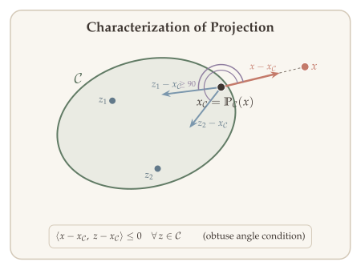
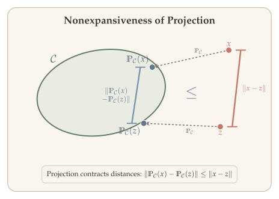
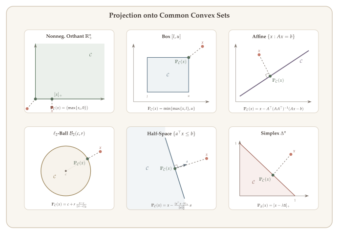
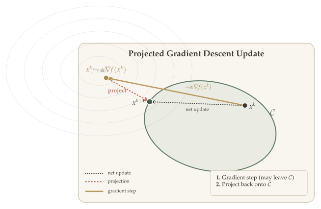
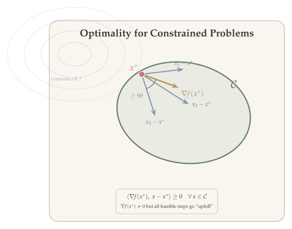
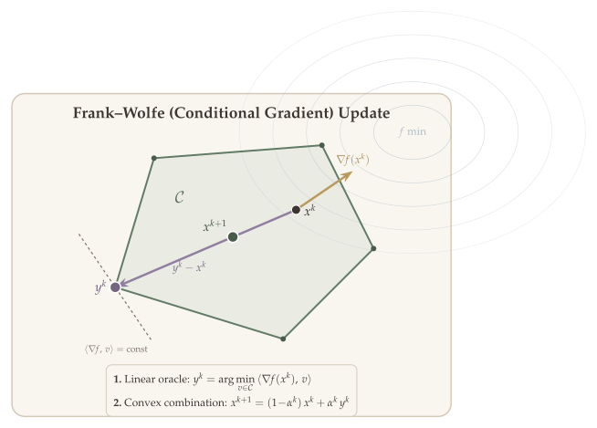

When the optimization problem involves constraints, vanilla gradient descent no longer applies directly---a gradient step may leave the feasible set. Two natural strategies emerge: **project** back onto the constraint set after each gradient step, or **linearize** the objective over the constraint set and move toward the minimizer. These lead to **projected gradient descent** and the **Frank--Wolfe** (conditional gradient) method, respectively.

In this chapter we develop both approaches. We begin by studying the Euclidean projection operator and its key properties---characterization, nonexpansiveness, and closed-form solutions for common sets. We then present projected gradient descent with its full convergence theory, showing that it achieves the same rates as unconstrained GD. Finally, we turn to the Frank--Wolfe method, which avoids projection entirely by solving linear subproblems---a major advantage when projection is expensive but linear optimization is cheap.

::: {.callout-tip}
## Companion Notebook

A [Jupyter notebook](../notebooks/projected-gradient-frank-wolfe.ipynb) accompanies this chapter with runnable Python implementations of projected gradient descent and the Frank--Wolfe (conditional gradient) method on constrained problems.
:::

## The Projection Operator {#sec-projection-operator}

Consider the constrained optimization problem

$$\min_x \; f(x) \qquad \text{s.t.} \quad x \in \mathcal{C},$$

where $f$ is convex and differentiable, and $\mathcal{C} \subseteq \mathbb{R}^n$ is a closed convex set. The central challenge is to decrease the function value while ensuring feasibility. In unconstrained optimization, a gradient step $x - \alpha \nabla f(x)$ is guaranteed to stay in $\mathbb{R}^n$, but with constraints, this step may leave $\mathcal{C}$. We need a principled way to "push" infeasible points back into the constraint set---ideally, to the nearest feasible point. This is precisely the role of the projection operator.

The **Euclidean projection** onto $\mathcal{C}$ is

$$\mathbb{P}_{\mathcal{C}}(x) = \arg\min_{z \in \mathcal{C}} \; \|x - z\|_2^2.$$

Geometrically, $\mathbb{P}_{\mathcal{C}}(x)$ is the closest point in $\mathcal{C}$ to $x$. This is itself a convex optimization problem---minimizing a strictly convex quadratic over a convex set---so its solution is always unique. Before using the projection in algorithms, we must establish three foundational properties: *uniqueness* (so the operator is well-defined), *characterization* (an equivalent inequality condition that avoids solving the minimization), and *nonexpansiveness* (so projecting does not amplify errors). These three properties form the analytical backbone of projected gradient descent.

::: {#thm-projection-singleton}
## Uniqueness of Projection

Let $\mathcal{C}$ be a nonempty closed convex set. Then $\mathbb{P}_{\mathcal{C}}(x)$ is a singleton for any $x \in \mathbb{R}^n$.
:::

::: {.proof}
The objective $g(z) = \|z - x\|_2^2$ is **strictly convex** in $z$. Since $\mathcal{C}$ is nonempty and closed, and $g(z) \to \infty$ as $\|z\|_2 \to \infty$, the minimum is attained. Suppose $z_1, z_2 \in \mathcal{C}$ are both minimizers with $z_1 \neq z_2$. By strict convexity,

$$g\!\left(\tfrac{z_1 + z_2}{2}\right) < \tfrac{1}{2}g(z_1) + \tfrac{1}{2}g(z_2) = g(z_1),$$

and $\tfrac{z_1 + z_2}{2} \in \mathcal{C}$ by convexity, contradicting the optimality of $z_1$. $\blacksquare$
:::

### Characterization of Projection {#sec-proj-characterization}

Computing $\mathbb{P}_{\mathcal{C}}(x)$ by solving the defining optimization problem is rarely how we work with projections in proofs. Instead, we use a variational characterization that converts the optimization problem into an **inequality**. This is far more useful analytically: it lets us manipulate projections algebraically without returning to the minimization.

Geometrically, the characterization says that the vector from $\mathbb{P}_{\mathcal{C}}(x)$ to $x$ makes an **obtuse angle** (angle $\geq 90°$) with every vector pointing from $\mathbb{P}_{\mathcal{C}}(x)$ into $\mathcal{C}$. If the angle were acute for some direction, we could move slightly along that direction and get closer to $x$---contradicting optimality. This "obtuse angle condition" is the workhorse behind essentially all convergence proofs for projected gradient descent.

::: {#lem-projection-characterization}
## Characterization of Projection

Let $\mathcal{C}$ be closed and convex. Then $x_{\mathcal{C}} = \mathbb{P}_{\mathcal{C}}(x)$ if and only if

$$(x - x_{\mathcal{C}})^\top (z - x_{\mathcal{C}}) \leq 0, \qquad \forall\, z \in \mathcal{C}.$$
:::

::: {.proof}
Consider $g(z) = \tfrac{1}{2}\|z - x\|_2^2$. Then $\nabla g(z) = z - x$. Since $x_{\mathcal{C}} = \arg\min_{z \in \mathcal{C}} g(z)$, the first-order optimality condition for minimizing a convex function over a convex set gives:

$$\langle \nabla g(x_{\mathcal{C}}),\, z - x_{\mathcal{C}} \rangle \geq 0 \qquad \forall\, z \in \mathcal{C},$$

which is $\langle x_{\mathcal{C}} - x,\, z - x_{\mathcal{C}} \rangle \geq 0$. Rearranging:

$$\langle x - x_{\mathcal{C}},\, z - x_{\mathcal{C}} \rangle \leq 0 \qquad \forall\, z \in \mathcal{C}.$$

Conversely, if this inequality holds for all $z \in \mathcal{C}$, then $x_{\mathcal{C}}$ satisfies the first-order optimality condition for the strictly convex problem $\min_{z \in \mathcal{C}} \|z - x\|_2^2$, so it is the unique minimizer. $\blacksquare$
:::

{#fig-projection-characterization}

### Nonexpansiveness {#sec-nonexpansiveness}

Why should we expect projected gradient descent to converge at all? In unconstrained GD, convergence relies on the gradient step being a *contraction*---iterates move closer to $x^*$ at each step. When we add a projection, a natural worry is that projecting onto $\mathcal{C}$ might undo the progress made by the gradient step, or worse, push iterates *further* from $x^*$.

The key insight is that projection onto a convex set is **nonexpansive**: it can only bring points closer together (or keep them the same distance), never push them apart. In the language of operator theory, $\mathbb{P}_{\mathcal{C}}$ is a *Lipschitz map with constant 1*. This means that composing a contraction (the gradient step) with a nonexpansion (the projection) yields another contraction---the convergence guarantees of unconstrained GD survive the projection.

::: {#lem-nonexpansive}
## Nonexpansiveness of Projection

For any $x, z \in \mathbb{R}^n$,

$$\|\mathbb{P}_{\mathcal{C}}(x) - \mathbb{P}_{\mathcal{C}}(z)\|_2 \leq \|x - z\|_2.$$
:::

::: {.proof}
By @lem-projection-characterization, $\langle x - \mathbb{P}_{\mathcal{C}}(x),\; y - \mathbb{P}_{\mathcal{C}}(x) \rangle \leq 0$ for all $y \in \mathcal{C}$.

Setting $y = \mathbb{P}_{\mathcal{C}}(z)$:

$$\langle x - \mathbb{P}_{\mathcal{C}}(x),\; \mathbb{P}_{\mathcal{C}}(z) - \mathbb{P}_{\mathcal{C}}(x) \rangle \leq 0.$$ {#eq-proj-char-x}

Similarly,

$$\langle z - \mathbb{P}_{\mathcal{C}}(z),\; \mathbb{P}_{\mathcal{C}}(x) - \mathbb{P}_{\mathcal{C}}(z) \rangle \leq 0.$$ {#eq-proj-char-z}

Adding ([-@eq-proj-char-x]) and ([-@eq-proj-char-z]) and rearranging:

$$\|\mathbb{P}_{\mathcal{C}}(x) - \mathbb{P}_{\mathcal{C}}(z)\|_2^2 \leq \langle \mathbb{P}_{\mathcal{C}}(x) - \mathbb{P}_{\mathcal{C}}(z),\; x - z \rangle.$$

By Cauchy--Schwarz:

$$\|\mathbb{P}_{\mathcal{C}}(x) - \mathbb{P}_{\mathcal{C}}(z)\|_2^2 \leq \|\mathbb{P}_{\mathcal{C}}(x) - \mathbb{P}_{\mathcal{C}}(z)\|_2 \cdot \|x - z\|_2,$$

which gives $\|\mathbb{P}_{\mathcal{C}}(x) - \mathbb{P}_{\mathcal{C}}(z)\|_2 \leq \|x - z\|_2$. $\blacksquare$
:::

{#fig-nonexpansiveness}

::: {.callout-tip}
## Remark: Firm Nonexpansiveness

In fact, the intermediate step above proves a stronger property called **firm nonexpansiveness**:

$$\|\mathbb{P}_{\mathcal{C}}(x) - \mathbb{P}_{\mathcal{C}}(z)\|_2^2 \leq \langle \mathbb{P}_{\mathcal{C}}(x) - \mathbb{P}_{\mathcal{C}}(z),\; x - z \rangle.$$

This is strictly stronger than nonexpansiveness (apply Cauchy--Schwarz to the right-hand side to recover the standard form). Firm nonexpansiveness is the projection analogue of **co-coercivity** for gradients of smooth convex functions, and it plays a similar role in tighter convergence analyses. We will use the standard nonexpansiveness in most of this chapter, but the firm version becomes important in the proximal gradient framework of the next chapter.
:::

### Distance to a Convex Set {#sec-distance-convex-set}

The projection operator also provides a natural notion of distance to a set and a useful differentiable function built from it. This will become important when we define the *surrogate gradient* for convergence analysis: measuring how far a gradient step lands from the feasible set is closely related to measuring optimality.

For any $x \in \mathbb{R}^n$, the **distance** to $\mathcal{C}$ is

$$d_{\mathcal{C}}(x) = \inf_{y \in \mathcal{C}} \|x - y\|_2 = \|x - \mathbb{P}_{\mathcal{C}}(x)\|_2,$$

so $d_{\mathcal{C}}(x) = 0$ for all $x \in \mathcal{C}$. While $d_{\mathcal{C}}$ itself is not differentiable everywhere (it has a kink at the boundary of $\mathcal{C}$), its square is smooth. This is analogous to how $|t|$ is not differentiable at $0$ but $t^2$ is---squaring smooths out the kink.

::: {#lem-distance-differentiable}
## Differentiability of the Squared Distance Function

$h(x) = \tfrac{1}{2}\bigl(d_{\mathcal{C}}(x)\bigr)^2$ is differentiable, and

$$\nabla h(x) = x - \mathbb{P}_{\mathcal{C}}(x).$$
:::

The gradient formula is intuitive: $\nabla h(x)$ is the vector from the projection $\mathbb{P}_{\mathcal{C}}(x)$ to $x$ itself---the direction pointing away from $\mathcal{C}$. Moving in the direction $-\nabla h(x)$ takes $x$ toward its projection, decreasing the distance to $\mathcal{C}$.

::: {.proof}
Write $h(x) = \tfrac{1}{2}\|x - \mathbb{P}_{\mathcal{C}}(x)\|_2^2$. Let $p = \mathbb{P}_{\mathcal{C}}(x)$ and consider a perturbation $x + \delta$. Let $p' = \mathbb{P}_{\mathcal{C}}(x + \delta)$. Then

$$\begin{aligned}
h(x + \delta) - h(x) &= \tfrac{1}{2}\|x + \delta - p'\|_2^2 - \tfrac{1}{2}\|x - p\|_2^2.
\end{aligned}$$

Since $p'$ minimizes $\|x + \delta - z\|_2^2$ over $z \in \mathcal{C}$:

$$h(x + \delta) \leq \tfrac{1}{2}\|x + \delta - p\|_2^2 = h(x) + \langle x - p, \delta \rangle + \tfrac{1}{2}\|\delta\|_2^2.$$

For the lower bound, since $p$ minimizes $\|x - z\|_2^2$ over $z \in \mathcal{C}$:

$$h(x) \leq \tfrac{1}{2}\|x - p'\|_2^2 = \tfrac{1}{2}\|x + \delta - p' - \delta\|_2^2 = h(x + \delta) - \langle x + \delta - p', \delta \rangle + \tfrac{1}{2}\|\delta\|_2^2.$$

Combining these two bounds:

$$\langle x + \delta - p', \delta \rangle - \tfrac{1}{2}\|\delta\|_2^2 \leq h(x + \delta) - h(x) \leq \langle x - p, \delta \rangle + \tfrac{1}{2}\|\delta\|_2^2.$$

By nonexpansiveness (@lem-nonexpansive), $\|p' - p\|_2 \leq \|\delta\|_2$, so $\langle x + \delta - p', \delta \rangle = \langle x - p, \delta \rangle + \langle \delta - (p' - p), \delta \rangle = \langle x - p, \delta \rangle + O(\|\delta\|_2^2)$. Therefore

$$h(x + \delta) - h(x) = \langle x - p, \delta \rangle + O(\|\delta\|_2^2),$$

which shows $\nabla h(x) = x - \mathbb{P}_{\mathcal{C}}(x)$. $\blacksquare$
:::

## Examples of Projection Operators {#sec-projection-examples}

The computational cost of projected gradient descent is dominated by the projection step. If the projection requires solving a general convex program at each iteration, the method offers little advantage over solving the original problem directly. Fortunately, for many constraint sets arising in practice---from simple box constraints in engineering to probability simplices in machine learning---the projection admits a closed-form solution or can be computed in $O(n)$ or $O(n \log n)$ time. The availability of a cheap projection is what makes projected GD practical.

::: {#lem-projection-subsets}
## Projection onto Common Convex Sets

For each of the constraint sets listed below---the nonnegative orthant, box constraints, affine subspaces, $\ell_2$-balls, half-spaces, and the probability simplex---the Euclidean projection admits an explicit closed-form formula.
:::

The proof strategy for each case is the same: we guess the projection formula and verify it using the characterization (@lem-projection-characterization).

{#fig-projection-examples}

### Nonnegative Orthant {#sec-proj-orthant}

$\mathcal{C} = \mathbb{R}_+^n = \{x :\; x_i \geq 0\}$.

$$\mathbb{P}_{\mathcal{C}}(x) = [x]_+ = \bigl(\max\{x_i, 0\}\bigr)_{i=1}^n.$$

::: {.proof}
Since $\mathcal{C}$ is a Cartesian product of intervals $[0, \infty)$, the projection decomposes coordinate-wise: $(\mathbb{P}_{\mathcal{C}}(x))_i = \arg\min_{z_i \geq 0} (z_i - x_i)^2 = \max\{x_i, 0\}$.

We can also verify via @lem-projection-characterization. Let $p = [x]_+$. For any $z \in \mathbb{R}_+^n$:

$$\langle x - p,\, z - p \rangle = \sum_{i=1}^n (x_i - p_i)(z_i - p_i).$$

If $x_i \geq 0$, then $p_i = x_i$ and the $i$-th term is $0$. If $x_i < 0$, then $p_i = 0$, so the $i$-th term is $x_i \cdot z_i \leq 0$ (since $x_i < 0$ and $z_i \geq 0$). Thus $\langle x - p, z - p \rangle \leq 0$. $\blacksquare$
:::

### Box Constraints {#sec-proj-box}

$\mathcal{C} = \operatorname{Box}[l, u] = \{x :\; l_i \leq x_i \leq u_i\}$.

$$\mathbb{P}_{\mathcal{C}}(x) = \bigl(\min\bigl\{\max\{x_i,\, l_i\},\, u_i\bigr\}\bigr)_{i=1}^n.$$

This is the natural generalization of the orthant projection: each coordinate is clipped to its interval $[l_i, u_i]$.

::: {.proof}
As with the orthant, the Cartesian product structure allows coordinate-wise decomposition. In one dimension with $\mathcal{C} = [l, u]$:

$$x - \mathbb{P}_{\mathcal{C}}(x) = \begin{cases} x - l & x \leq l, \\ 0 & x \in [l, u], \\ x - u & x \geq u. \end{cases}$$

For all $z \in [l, u]$, the product $(x - \mathbb{P}_{\mathcal{C}}(x))(\mathbb{P}_{\mathcal{C}}(x) - z)$ is $\leq 0$ in each case:

- If $x \leq l$: $(x - l)(l - z) \leq 0$ since $x - l \leq 0$ and $l - z \leq 0$.
- If $x \in [l, u]$: the factor is $0$.
- If $x \geq u$: $(x - u)(u - z) \leq 0$ since $x - u \geq 0$ and $u - z \geq 0$, giving the product with sign $(+)(-)$ after accounting for direction... let us be precise: $(x - u) \geq 0$ and $z - u \leq 0$, so $(x - u)(z - u) \leq 0$.

This confirms the characterization (@lem-projection-characterization) in each coordinate. $\blacksquare$
:::

### Affine Set {#sec-proj-affine}

$\mathcal{C} = \{x :\; Ax = b\}$, where $AA^\top$ is invertible.

$$\mathbb{P}_{\mathcal{C}}(x) = x - A^\top (AA^\top)^{-1}(Ax - b).$$

This is the familiar least-squares projection: $x - \mathbb{P}_{\mathcal{C}}(x)$ lies in the row space of $A$, and $\mathbb{P}_{\mathcal{C}}(x)$ satisfies the constraint $Ax = b$.

::: {.proof}
We verify $\langle x - \mathbb{P}_{\mathcal{C}}(x),\; z - \mathbb{P}_{\mathcal{C}}(x) \rangle = 0$ for any $z$ with $Az = b$ (equality, not just $\leq 0$, because the affine set has no boundary in the usual sense).

Compute:

$$x - \mathbb{P}_{\mathcal{C}}(x) = A^\top (AA^\top)^{-1}(Ax - b) = A^\top (AA^\top)^{-1} A(x - z).$$

$$z - \mathbb{P}_{\mathcal{C}}(x) = (z - x) + A^\top (AA^\top)^{-1} A(x - z) = (I - A^\top (AA^\top)^{-1} A)(z - x).$$

The first vector lies in the row space of $A$, and the second lies in its orthogonal complement (the null space of $A$), so their inner product is zero:

$$\langle x - \mathbb{P}_{\mathcal{C}}(x),\; z - \mathbb{P}_{\mathcal{C}}(x) \rangle = (x - z)^\top A^\top (AA^\top)^{-1} A (I - A^\top (AA^\top)^{-1} A)(z - x) = 0.$$

The last step follows because $A(I - A^\top(AA^\top)^{-1}A) = A - A = 0$. $\blacksquare$
:::

### $\ell_2$-Ball {#sec-proj-l2ball}

$\mathcal{C} = \{x :\; \|x - c\|_2 \leq r\}$.

$$\mathbb{P}_{\mathcal{C}}(x) = c + \frac{r}{\max\{\|x - c\|_2,\, r\}}(x - c).$$

For example, when $c = 0$ and $r = 1$:

$$\mathbb{P}_{\mathcal{C}}(x) = \frac{x}{\max\{1, \|x\|_2\}}.$$

The intuition is simple: if $x$ is already inside the ball, the projection is $x$ itself. If $x$ is outside, we rescale the direction $x - c$ to have length exactly $r$.

::: {.proof}
Without loss of generality, take $c = 0$. If $\|x\|_2 \leq r$, then $x \in \mathcal{C}$ and $\mathbb{P}_{\mathcal{C}}(x) = x$. If $\|x\|_2 > r$, let $p = r \cdot x / \|x\|_2$. We verify the characterization: for any $z$ with $\|z\|_2 \leq r$,

$$\langle x - p,\, z - p \rangle = \left(1 - \frac{r}{\|x\|_2}\right) \langle x,\, z - p \rangle.$$

Since $1 - r/\|x\|_2 > 0$, we need $\langle x, z - p \rangle \leq 0$. Now

$$\langle x, z - p \rangle = \langle x, z \rangle - \frac{r}{\|x\|_2}\|x\|_2^2 = \langle x, z \rangle - r\|x\|_2.$$

By Cauchy--Schwarz, $\langle x, z \rangle \leq \|x\|_2 \|z\|_2 \leq r\|x\|_2$, so $\langle x, z - p \rangle \leq 0$. $\blacksquare$
:::

### Half-Space {#sec-proj-halfspace}

$\mathcal{C} = \{x :\; a^\top x \leq \beta\}$, where $a \neq 0$.

$$\mathbb{P}_{\mathcal{C}}(x) = x - \frac{[a^\top x - \beta]_+}{\|a\|_2^2} \cdot a.$$

If $a^\top x \leq \beta$, the point is already feasible and the projection is $x$. Otherwise, the projection moves $x$ in the direction $-a$ (normal to the boundary hyperplane) by the minimal amount needed to satisfy the constraint.

::: {.proof}
If $a^\top x \leq \beta$, then $x \in \mathcal{C}$ and $[a^\top x - \beta]_+ = 0$, so $\mathbb{P}_{\mathcal{C}}(x) = x$. If $a^\top x > \beta$, let $p = x - \frac{a^\top x - \beta}{\|a\|_2^2} a$. Then $a^\top p = a^\top x - (a^\top x - \beta) = \beta$, so $p$ lies on the boundary of $\mathcal{C}$.

For any $z \in \mathcal{C}$ (i.e., $a^\top z \leq \beta$):

$$\langle x - p,\, z - p \rangle = \frac{a^\top x - \beta}{\|a\|_2^2} \cdot a^\top(z - p) = \frac{a^\top x - \beta}{\|a\|_2^2} \cdot (a^\top z - \beta).$$

Since $a^\top x - \beta > 0$ and $a^\top z - \beta \leq 0$, the product is $\leq 0$. $\blacksquare$
:::

### Probability Simplex {#sec-proj-simplex}

The probability simplex $\Delta_n = \bigl\{x \in \mathbb{R}^n \mid x_i \geq 0,\; \sum_{i=1}^n x_i = 1\bigr\}$ arises frequently in machine learning (e.g., probability distributions, attention weights).

::: {#lem-proj-simplex}
## Projection onto the Probability Simplex

$$\mathbb{P}_{\Delta_n}(x) = [x - \mu^* \mathbf{1}]_+,$$

where $\mu^*$ is the unique scalar satisfying $\mathbf{1}^\top [x - \mu^* \mathbf{1}]_+ = 1$.
:::

The formula shifts all coordinates by a common amount $\mu^*$ and clips to zero. The shift $\mu^*$ is chosen so the result sums to 1. This can be computed in $O(n \log n)$ time by sorting the coordinates.

::: {.proof}
The projection solves $\min_{z \in \Delta_n} \|z - x\|_2^2$. Writing the KKT conditions with multiplier $\mu$ for $\sum z_i = 1$ and multipliers $\lambda_i \geq 0$ for $-z_i \leq 0$:

$$z_i - x_i + \mu - \lambda_i = 0, \qquad \lambda_i z_i = 0, \qquad z_i \geq 0, \qquad \sum_i z_i = 1.$$

From the first condition, $z_i = x_i - \mu + \lambda_i$. By complementary slackness:

- If $z_i > 0$: then $\lambda_i = 0$, so $z_i = x_i - \mu$.
- If $z_i = 0$: then $\lambda_i = \mu - x_i \geq 0$, which requires $x_i \leq \mu$.

Thus $z_i = \max\{x_i - \mu, 0\} = [x_i - \mu]_+$. The constraint $\sum_i z_i = 1$ determines $\mu = \mu^*$. $\blacksquare$
:::

### $\ell_1$-Ball {#sec-proj-l1ball}

The $\ell_1$-ball constraint $\|x\|_1 \leq \alpha$ promotes sparsity and appears in compressed sensing, LASSO, and robust optimization.

::: {#lem-proj-l1ball}
## Projection onto the $\ell_1$-Ball

Let $\mathcal{C} = \{x :\; \|x\|_1 \leq \alpha\}$. The **soft-thresholding operator** $T_\lambda : \mathbb{R}^n \to \mathbb{R}^n$ is defined by

$$(T_\lambda(x))_i = \operatorname{sign}(x_i) \cdot \max\{|x_i| - \lambda, 0\}.$$

Then:

$$\mathbb{P}_{\mathcal{C}}(x) = \begin{cases} x & \text{if } \|x\|_1 \leq \alpha, \\ T_{\lambda^*}(x) & \text{if } \|x\|_1 > \alpha, \end{cases}$$

where $\lambda^*$ is the unique solution to $\|T_\lambda(x)\|_1 = \alpha$.
:::

::: {.proof}
If $\|x\|_1 \leq \alpha$, then $x \in \mathcal{C}$ and $\mathbb{P}_{\mathcal{C}}(x) = x$. Suppose $\|x\|_1 > \alpha$. The projection solves $\min_z \tfrac{1}{2}\|z - x\|_2^2$ subject to $\|z\|_1 \leq \alpha$. Since $x \notin \mathcal{C}$, the constraint is active at the optimum: $\|z^*\|_1 = \alpha$.

By the KKT conditions with multiplier $\lambda \geq 0$ for $\|z\|_1 \leq \alpha$:

$$z_i - x_i + \lambda \cdot \partial|z_i| \ni 0,$$

where $\partial |z_i|$ is the subdifferential of $|\cdot|$ at $z_i$. This gives:

- If $z_i > 0$: $z_i = x_i - \lambda$, requiring $x_i > \lambda$.
- If $z_i < 0$: $z_i = x_i + \lambda$, requiring $x_i < -\lambda$.
- If $z_i = 0$: $|x_i| \leq \lambda$.

This is exactly $z_i = \operatorname{sign}(x_i) \cdot [|x_i| - \lambda]_+ = (T_\lambda(x))_i$.

The function $\lambda \mapsto \|T_\lambda(x)\|_1$ is continuous and strictly decreasing on $[0, \max_i |x_i|]$, going from $\|x\|_1 > \alpha$ to $0$. By the intermediate value theorem, there is a unique $\lambda^*$ with $\|T_{\lambda^*}(x)\|_1 = \alpha$. $\blacksquare$
:::

::: {.callout-tip}
## Remark: Connection Between Simplex and $\ell_1$-Ball Projections

The $\ell_1$-ball projection reduces to the simplex projection via a symmetry argument. If $x \geq 0$, then projecting onto $\{z : \|z\|_1 \leq \alpha, z \geq 0\}$ is the same as projecting onto the scaled simplex $\alpha \cdot \Delta_n$. The general case reduces to this by working with absolute values and restoring signs.
:::

## Projected Gradient Descent {#sec-proj-gd}

{#fig-proj-gd-update}

### Optimality Conditions {#sec-optimality-conditions}

Before presenting the algorithm, we need the right notion of optimality for constrained problems. In unconstrained optimization, $x^*$ is optimal if and only if $\nabla f(x^*) = 0$. With constraints, this is too strong: the optimum may occur where the gradient is nonzero, but points "downhill" outside $\mathcal{C}$. The correct condition is:

A feasible point $x^* \in \mathcal{C}$ is optimal for $\min_{x \in \mathcal{C}} f(x)$ if and only if

$$\langle \nabla f(x^*),\; x - x^* \rangle \geq 0 \qquad \forall\, x \in \mathcal{C}.$$ {#eq-constrained-optimality}

This says that every feasible direction $x - x^*$ makes a non-acute angle with $\nabla f(x^*)$---there is no feasible descent direction. When $x^*$ is in the interior of $\mathcal{C}$, the condition must hold for directions in all of $\mathbb{R}^n$, forcing $\nabla f(x^*) = 0$.

{#fig-optimality-condition}

An equivalent and more algorithmically useful formulation uses the projection: $x^*$ is optimal if and only if

$$x^* = \mathbb{P}_{\mathcal{C}}(x^* - \alpha \nabla f(x^*)) \qquad \text{for all } \alpha > 0.$$

This equivalence follows directly from @lem-projection-characterization. It shows that optimal points are **fixed points** of the projected gradient map---applying a gradient step followed by projection returns us to the same point. This motivates the following algorithm: iterate the projected gradient map until a fixed point is reached.

### The Algorithm {#sec-proj-gd-algorithm}

**Projected gradient descent** generates iterates by taking a gradient step and projecting back onto $\mathcal{C}$:

$$x^{k+1} = \mathbb{P}_{\mathcal{C}}\bigl(x^k - \alpha^k \cdot \nabla f(x^k)\bigr), \qquad k = 0, 1, 2, \ldots$$

Each iteration has two phases: (1) a gradient step $x^k - \alpha^k \nabla f(x^k)$ that may leave $\mathcal{C}$, and (2) a projection back onto $\mathcal{C}$ to restore feasibility. The cost per iteration is the cost of one gradient evaluation plus one projection.

::: {.callout-tip}
## Remark: Projected GD as Special Case of Proximal Gradient

Projected gradient descent is a special case of proximal gradient with $h(z) = I_{\mathcal{C}}(z)$, the indicator function of $\mathcal{C}$. This connection is made precise in [Proximal Gradient Methods, @sec-projection-as-prox](07-proximal-gradient.qmd#sec-projection-as-prox), which provides a unified framework for analyzing constrained and composite optimization problems.
:::

**Application of the projection characterization.** Setting $x = x^k - \alpha^k \nabla f(x^k)$, $z = x^*$, $x_{\mathcal{C}} = x^{k+1}$ in @lem-projection-characterization:

$$\langle x^{k+1} - (x^k - \alpha^k \nabla f(x^k)),\; x^* - x^{k+1} \rangle \geq 0.$$

This inequality is the starting point for the convergence analysis. It connects the projected iterate, the gradient step, and the optimum.

The following lemma extracts a useful consequence: the projected step is always a descent direction.

::: {#lem-gradient-alignment}
## Gradient Alignment Lemma

$$\langle -\nabla f(x^k),\; x^{k+1} - x^k \rangle \geq \frac{1}{\alpha}\|x^k - x^{k+1}\|_2^2 \geq 0.$$
:::

This says that the projected step $x^{k+1} - x^k$ makes an acute angle with $-\nabla f(x^k)$, ensuring function decrease. Moreover, the inner product is bounded below by the squared step length, which prevents the step from becoming arbitrarily small without the gradient also becoming small.

::: {.proof}
Apply @lem-projection-characterization with $z = x^k$ (which is in $\mathcal{C}$ since we maintain feasibility):

$$\langle x^k - \alpha \cdot \nabla f(x^k) - x^{k+1},\; x^k - x^{k+1} \rangle \leq 0.$$

Expanding: $\|x^k - x^{k+1}\|_2^2 - \alpha \langle \nabla f(x^k),\, x^k - x^{k+1} \rangle \leq 0$. Rearranging:

$$\langle -\nabla f(x^k),\; x^{k+1} - x^k \rangle \geq \frac{1}{\alpha}\|x^k - x^{k+1}\|_2^2 \geq 0.$$

Therefore, we conclude the proof. $\blacksquare$
:::

### Convergence with Interior Optimum {#sec-interior-optimum}

We first handle the simpler case where the optimum $x^*$ lies in the **interior** of $\mathcal{C}$, so the constraint is not active at optimality and $\nabla f(x^*) = 0$. This case is instructive because the analysis reduces cleanly to the unconstrained case via nonexpansiveness---the projection only helps (or is neutral), never hurts. The result shows that projected GD inherits the linear convergence rate of unconstrained GD for strongly convex problems, with no degradation from the projection.

::: {#thm-proj-gd-strongly-convex}
## Projected GD: Strongly Convex Case (Interior Optimum)

Suppose $f$ is $\mu$-strongly convex and $L$-smooth, and $x^* \in \operatorname{int}(\mathcal{C})$. Setting $\alpha = \dfrac{2}{\mu + L}$, projected GD satisfies

$$\|x^k - x^*\|_2^2 \leq \Bigl(\frac{\kappa - 1}{\kappa + 1}\Bigr)^{2k} \cdot \|x^0 - x^*\|_2^2,$$

where $\kappa = L/\mu$.
:::

::: {.proof}
Since $x^* \in \operatorname{int}(\mathcal{C})$, we have $\nabla f(x^*) = 0$ and $\mathbb{P}_{\mathcal{C}}(x^*) = x^*$. Then:

$$\begin{aligned}
\|x^{k+1} - x^*\|_2^2 &= \|\mathbb{P}_{\mathcal{C}}(x^k - \alpha \nabla f(x^k)) - \mathbb{P}_{\mathcal{C}}(x^*)\|_2^2 \\
&\leq \|(x^k - \alpha \nabla f(x^k)) - x^*\|_2^2 \qquad \text{(nonexpansiveness, @lem-nonexpansive)} \\
&= \|(x^k - x^*) - \alpha (\nabla f(x^k) - \nabla f(x^*))\|_2^2 \qquad \text{(since } \nabla f(x^*) = 0\text{).}
\end{aligned}$$

The map $T(x) = x - \alpha \nabla f(x)$ satisfies $\|T(x) - T(y)\|_2 \leq \tfrac{\kappa - 1}{\kappa + 1}\|x - y\|_2$ when $\alpha = 2/(\mu + L)$ (by the same eigenvalue argument as in the unconstrained strongly convex analysis). Therefore:

$$\|x^{k+1} - x^*\|_2^2 \leq \left(\frac{\kappa - 1}{\kappa + 1}\right)^2\|x^k - x^*\|_2^2.$$

Unrolling the recursion gives the result. $\blacksquare$
:::

### The Surrogate Gradient {#sec-surrogate-gradient}

{#fig-surrogate-gradient}

The preceding analysis for interior optima relied on writing $x^* = \mathbb{P}_{\mathcal{C}}(x^* - \alpha \nabla f(x^*))$ because $\nabla f(x^*) = 0$ when $x^*$ is interior. But in many important applications---portfolio optimization with budget constraints, SVM with margin constraints, regularized learning with $\ell_1$-balls---the optimum lies on the **boundary** of $\mathcal{C}$, where $\nabla f(x^*) \neq 0$. At the boundary, the gradient points outside $\mathcal{C}$, and $x^* - \alpha \nabla f(x^*) \neq x^*$. The nonexpansiveness argument breaks down because we can no longer write $x^*$ as a projected gradient step from itself.

The key idea to handle this case is to replace the gradient $\nabla f(x)$ with a **surrogate gradient** $g_{\mathcal{C}}(x)$ that "absorbs" the effect of the projection. Instead of measuring progress through $\|\nabla f(x)\|_2$---which may remain large even at the constrained optimum---we measure it through $\|g_{\mathcal{C}}(x)\|_2$, which vanishes at optimality regardless of whether $x^*$ is interior or on the boundary. This object plays the same role in the constrained analysis that $\nabla f$ plays in the unconstrained analysis (see @fig-surrogate-gradient).

For any $x \in \mathcal{C}$, let $x^+ = \mathbb{P}_{\mathcal{C}}(x - \alpha \cdot \nabla f(x))$. Define:

$$g_{\mathcal{C}}(x) = \frac{1}{\alpha}(x - x^+).$$

::: {.callout-tip}
## Remark: Interpreting the Surrogate Gradient

The surrogate gradient has several important properties:

- **Reduces to the gradient in the unconstrained case.** If $x - \alpha \nabla f(x) \in \mathcal{C}$ (the projection does not activate), then $x^+ = x - \alpha \nabla f(x)$ and $g_{\mathcal{C}}(x) = \nabla f(x)$.
- **Vanishes at the optimum.** $g_{\mathcal{C}}(x^*) = 0$ because $x^*$ is a fixed point of the projected gradient map ([-@eq-constrained-optimality]).
- **Gives a descent direction.** By @lem-gradient-alignment, $\langle -\nabla f(x), x^+ - x \rangle \geq \alpha \|g_{\mathcal{C}}(x)\|_2^2$, so $-g_{\mathcal{C}}(x)$ is a direction of function decrease.
- **Measures stationarity.** $\|g_{\mathcal{C}}(x)\|_2 = 0$ if and only if $x$ satisfies the first-order optimality condition ([-@eq-constrained-optimality]).
:::

The following two lemmas show that $g_{\mathcal{C}}$ inherits the essential properties of $\nabla f$ that drive the convergence analysis. Recall that for unconstrained GD on $\mu$-strongly convex and $L$-smooth functions, the co-coercivity inequality ([-@eq-sc-smooth-cocoercivity]) gives

$$\langle \nabla f(x),\; x - x^* \rangle \geq \frac{\mu}{2}\|x - x^*\|_2^2 + \frac{1}{2L}\|\nabla f(x)\|_2^2.$$

We will establish an analogous inequality for $g_{\mathcal{C}}$. The first step is a dominance lemma.

::: {#lem-surrogate-vs-gradient}
## Surrogate Gradient Dominates Gradient Inner Products

For all $y \in \mathcal{C}$:

$$\langle \nabla f(x),\; x^+ - y \rangle \leq \langle g_{\mathcal{C}}(x),\; x^+ - y \rangle.$$
:::

This lemma says that replacing $\nabla f(x)$ with $g_{\mathcal{C}}(x)$ in inner products with $x^+ - y$ only makes the bound **weaker** (the RHS is larger). This allows us to substitute $g_{\mathcal{C}}$ for $\nabla f$ in upper bounds without losing validity.

::: {.proof}
Since $x^+ = \mathbb{P}_{\mathcal{C}}(x - \alpha \nabla f(x))$, by @lem-projection-characterization with $z = y \in \mathcal{C}$:

$$\langle x^+ - (x - \alpha \nabla f(x)),\; x^+ - y \rangle \leq 0.$$

Expanding and rearranging:

$$\alpha \langle \nabla f(x),\; x^+ - y \rangle \leq \langle x - x^+,\; x^+ - y \rangle = \alpha \langle g_{\mathcal{C}}(x),\; x^+ - y \rangle.$$

Dividing by $\alpha > 0$ gives the result. $\blacksquare$
:::

::: {#lem-surrogate-gradient-bound}
## Surrogate Gradient Inequality

For $f$ being $\mu$-strongly convex and $L$-smooth, setting $\alpha = 1/L$:

$$\langle g_{\mathcal{C}}(x),\; x - x^* \rangle \geq \frac{\mu}{2}\|x - x^*\|_2^2 + \frac{1}{2L}\|g_{\mathcal{C}}(x)\|_2^2.$$
:::

This is the constrained analogue of the co-coercivity inequality. It says that the surrogate gradient is well-correlated with the direction to the optimum, with both a strong convexity term and a gradient norm term.

::: {.proof}
Since $x^*$ is optimal and $x^+ \in \mathcal{C}$, we have $f(x^+) \geq f(x^*)$, so

$$0 \leq f(x^+) - f(x^*) = \bigl(f(x^+) - f(x)\bigr) + \bigl(f(x) - f(x^*)\bigr).$$

For the first term, by $L$-smoothness:

$$f(x^+) - f(x) \leq \langle \nabla f(x),\, x^+ - x \rangle + \frac{L}{2}\|x^+ - x\|_2^2 = -\alpha \langle \nabla f(x),\, g_{\mathcal{C}}(x) \rangle + \frac{L\alpha^2}{2}\|g_{\mathcal{C}}(x)\|_2^2.$$

For the second term, by $\mu$-strong convexity:

$$f(x) - f(x^*) \leq \langle \nabla f(x),\, x - x^* \rangle - \frac{\mu}{2}\|x - x^*\|_2^2.$$

Combining:

$$0 \leq \langle \nabla f(x),\, x^+ - x^* \rangle + \frac{L\alpha^2}{2}\|g_{\mathcal{C}}(x)\|_2^2 - \frac{\mu}{2}\|x - x^*\|_2^2.$$

Now apply @lem-surrogate-vs-gradient with $y = x^*$: $\langle \nabla f(x), x^+ - x^* \rangle \leq \langle g_{\mathcal{C}}(x), x^+ - x^* \rangle$. Substituting and using $x^+ - x^* = (x - x^*) - \alpha g_{\mathcal{C}}(x)$:

$$\begin{aligned}
0 &\leq \langle g_{\mathcal{C}}(x),\, x - x^* \rangle - \alpha\|g_{\mathcal{C}}(x)\|_2^2 + \frac{L\alpha^2}{2}\|g_{\mathcal{C}}(x)\|_2^2 - \frac{\mu}{2}\|x - x^*\|_2^2.
\end{aligned}$$

With $\alpha = 1/L$: $-\alpha + L\alpha^2/2 = -1/L + 1/(2L) = -1/(2L)$. Therefore

$$0 \leq \langle g_{\mathcal{C}}(x),\, x - x^* \rangle - \frac{1}{2L}\|g_{\mathcal{C}}(x)\|_2^2 - \frac{\mu}{2}\|x - x^*\|_2^2,$$

which rearranges to the desired inequality. $\blacksquare$
:::

**Strict monotonicity.** Since $g_{\mathcal{C}}(x^*) = 0$, @lem-surrogate-gradient-bound immediately gives:

$$\langle g_{\mathcal{C}}(x) - g_{\mathcal{C}}(x^*),\; x - x^* \rangle \geq \frac{\mu}{2}\|x - x^*\|_2^2 + \frac{1}{2L}\|g_{\mathcal{C}}(x)\|_2^2.$$

This shows that $g_{\mathcal{C}}(\cdot)$ is a **strictly monotone mapping**---the constrained analogue of the monotonicity $\langle \nabla f(x) - \nabla f(y), x - y \rangle \geq \mu\|x - y\|_2^2$ enjoyed by $\nabla f$ in the unconstrained case.

## Convergence Analysis of Projected GD {#sec-proj-gd-convergence}

We now establish the convergence rates of projected GD under the same three settings as unconstrained GD: nonconvex + smooth, convex + smooth, and strongly convex + smooth. The key message is that **projection does not slow down convergence**: all three rates match the unconstrained case exactly, with the gradient $\nabla f$ replaced by the surrogate gradient $g_{\mathcal{C}}$. The only additional cost is the projection itself.

The proof structure mirrors the unconstrained case from the previous chapter. We first establish a descent lemma (function decrease at each step), then telescope to obtain the global rate. The surrogate gradient machinery developed in @sec-surrogate-gradient makes this translation seamless.

### Descent Lemma for Projected GD {#sec-descent-lemma-proj}

The starting point is a projected analogue of the descent lemma. Just as in the unconstrained case, we need two ingredients: (a) a guarantee of **monotone decrease** in the function value at each step, and (b) a **convexity-like lower bound** that enables the telescoping argument for the convex case. Both are stated in terms of $g_{\mathcal{C}}$ rather than $\nabla f$.

::: {#lem-descent-proj-gd}
## Descent Lemma for Projected GD

Let $f$ be $L$-smooth and $\alpha = 1/L$. Let $x^+ = \mathbb{P}_{\mathcal{C}}(x - \alpha \nabla f(x))$.

**(a)** $f(x^+) \leq f(x) - \dfrac{\alpha}{2}\|g_{\mathcal{C}}(x)\|_2^2.$

**(b)** If $f$ is additionally convex, then for all $y \in \mathcal{C}$:

$$f(y) \geq f(x^+) + \langle g_{\mathcal{C}}(x),\, y - x^+ \rangle - \frac{\alpha}{2}\|g_{\mathcal{C}}(x)\|_2^2.$$
:::

::: {.callout-tip}
## Remark: Comparison with Unconstrained Descent Lemma

Part (a) is the direct analogue of $f(x - \alpha \nabla f(x)) \leq f(x) - \frac{\alpha}{2}\|\nabla f(x)\|_2^2$, with $\nabla f$ replaced by $g_{\mathcal{C}}$.

Part (b) says that $f(x^+) + \langle g_{\mathcal{C}}(x), \cdot - x^+ \rangle$ is an approximate linear lower bound on $f$ over $\mathcal{C}$, with error $\frac{\alpha}{2}\|g_{\mathcal{C}}(x)\|_2^2$. This plays the role of convexity in the telescoping argument.
:::

::: {.proof}
**(a).** By smoothness:

$$f(x^+) \leq f(x) + \langle \nabla f(x),\; x^+ - x \rangle + \frac{L}{2}\|x^+ - x\|_2^2.$$ {#eq-pgd-smoothness}

By @lem-surrogate-vs-gradient with $y = x$ and using $x^+ - x = -\alpha \, g_{\mathcal{C}}(x)$:

$$\langle \nabla f(x),\; x^+ - x \rangle \leq \langle g_{\mathcal{C}}(x),\; x^+ - x \rangle = -\alpha \|g_{\mathcal{C}}(x)\|_2^2.$$ {#eq-pgd-surrogate}

Substituting ([-@eq-pgd-surrogate]) into ([-@eq-pgd-smoothness]) and using $\|x^+ - x\|_2^2 = \alpha^2\|g_{\mathcal{C}}(x)\|_2^2$:

$$f(x^+) \leq f(x) - \alpha\|g_{\mathcal{C}}(x)\|_2^2 + \frac{L\alpha^2}{2}\|g_{\mathcal{C}}(x)\|_2^2 \stackrel{\alpha = 1/L}{=} f(x) - \frac{\alpha}{2}\|g_{\mathcal{C}}(x)\|_2^2.$$

This establishes part (a): each projected gradient step achieves a guaranteed function decrease proportional to $\|g_{\mathcal{C}}(x)\|_2^2$.

**(b).** By convexity, $f(y) \geq f(x) + \langle \nabla f(x), y - x \rangle$. By smoothness, $f(x^+) \leq f(x) + \langle \nabla f(x), x^+ - x \rangle + \frac{L}{2}\|x^+ - x\|_2^2$. Subtracting the smoothness upper bound from the convexity lower bound:

$$\begin{aligned}
f(y) - f(x^+) &\geq \langle \nabla f(x),\, y - x^+ \rangle - \frac{L}{2}\|x^+ - x\|_2^2 \\
&\geq \langle g_{\mathcal{C}}(x),\, y - x^+ \rangle - \frac{L\alpha^2}{2}\|g_{\mathcal{C}}(x)\|_2^2,
\end{aligned}$$

where the second step uses @lem-surrogate-vs-gradient to replace $\nabla f$ with $g_{\mathcal{C}}$, and substitutes $\|x^+ - x\|_2 = \alpha\|g_{\mathcal{C}}(x)\|_2$. Setting $\alpha = 1/L$ and rearranging:

$$f(y) \geq f(x^+) + \langle g_{\mathcal{C}}(x),\, y - x^+ \rangle - \frac{\alpha}{2}\|g_{\mathcal{C}}(x)\|_2^2.$$

Therefore, we conclude the proof. $\blacksquare$
:::

### Convergence Theorem {#sec-proj-gd-convergence-theorem}

::: {#thm-proj-gd-all-cases}
## Convergence of Projected Gradient Descent

Set $\alpha = 1/L$, where $f$ is $L$-smooth.

**Case 1: $f$ is nonconvex.**

$$\frac{1}{K}\sum_{k=0}^{K-1} \|g_{\mathcal{C}}(x^k)\|_2^2 \leq \frac{2L}{K}\bigl(f(x^0) - f(x^*)\bigr).$$

**Case 2: $f$ is convex.**

$$f(x^K) - f(x^*) \leq \frac{L \cdot \|x^0 - x^*\|_2^2}{2K}.$$

**Case 3: $f$ is $\mu$-strongly convex.**

$$\|x^k - x^*\|_2^2 \leq (1 - \mu/L)^k \cdot \|x^0 - x^*\|_2^2, \qquad \kappa = L/\mu.$$
:::

These rates are **identical** to the unconstrained gradient descent rates, with the surrogate gradient $g_{\mathcal{C}}$ replacing $\nabla f$ in Case 1. The projection introduces no penalty in the convergence rate---its only cost is computational.

#### Proof of Case 1 {#sec-proof-case1}

By @lem-descent-proj-gd (a), each projected GD step decreases the objective:

$$\frac{\alpha}{2}\|g_{\mathcal{C}}(x^k)\|_2^2 \leq f(x^k) - f(x^{k+1}).$$

Telescoping over $k = 0, \ldots, K-1$:

$$\frac{1}{2L}\sum_{k=0}^{K-1} \|g_{\mathcal{C}}(x^k)\|_2^2 \leq f(x^0) - f(x^K) \leq f(x^0) - f(x^*).$$

Dividing by $K$:

$$\frac{1}{K}\sum_{k=0}^{K-1} \|g_{\mathcal{C}}(x^k)\|_2^2 \leq \frac{2L\bigl[f(x^0) - f(x^*)\bigr]}{K}. \quad \blacksquare$$

#### Proof of Case 2 {#sec-proof-case2}

By @lem-descent-proj-gd (b) with $y = x^*$:

$$f(x^*) \geq f(x^{k+1}) + \langle g_{\mathcal{C}}(x^k),\, x^* - x^{k+1} \rangle - \frac{\alpha}{2}\|g_{\mathcal{C}}(x^k)\|_2^2.$$

Rearranging and using $g_{\mathcal{C}}(x^k) = \frac{1}{\alpha}(x^k - x^{k+1})$:

$$f(x^{k+1}) - f(x^*) \leq \frac{1}{\alpha}\langle x^k - x^{k+1},\, x^{k+1} - x^* \rangle + \frac{1}{2\alpha}\|x^k - x^{k+1}\|_2^2.$$

By the three-point identity $\langle a - b, a - c \rangle = \tfrac{1}{2}\|a-b\|_2^2 + \tfrac{1}{2}\|a-c\|_2^2 - \tfrac{1}{2}\|b-c\|_2^2$ with $a = x^{k+1}$, $b = x^k$, $c = x^*$:

$$\langle x^k - x^{k+1},\, x^{k+1} - x^* \rangle = -\tfrac{1}{2}\|x^{k+1} - x^k\|_2^2 - \tfrac{1}{2}\|x^{k+1} - x^*\|_2^2 + \tfrac{1}{2}\|x^k - x^*\|_2^2.$$

Substituting:

$$f(x^{k+1}) - f(x^*) \leq \frac{1}{2\alpha}\bigl[\|x^k - x^*\|_2^2 - \|x^{k+1} - x^*\|_2^2\bigr].$$

Summing from $k = 0$ to $K-1$ (the RHS telescopes) and using that $\{f(x^k)\}$ is decreasing (by part (a)):

$$f(x^K) - f(x^*) \leq \frac{1}{K}\sum_{k=0}^{K-1}(f(x^{k+1}) - f(x^*)) \leq \frac{1}{2\alpha K}\|x^0 - x^*\|_2^2 = \frac{L\|x^0 - x^*\|_2^2}{2K}. \quad \blacksquare$$

#### Proof of Case 3 {#sec-proof-case3}

By @lem-surrogate-gradient-bound:

$$\langle g_{\mathcal{C}}(x^k),\; x^k - x^* \rangle \geq \frac{\mu}{2}\|x^k - x^*\|_2^2 + \frac{1}{2L}\|g_{\mathcal{C}}(x^k)\|_2^2.$$

Since $x^{k+1} = x^k - \alpha \, g_{\mathcal{C}}(x^k)$ with $\alpha = 1/L$:

$$\begin{aligned}
\|x^{k+1} - x^*\|_2^2 &= \|x^k - x^*\|_2^2 + \alpha^2 \|g_{\mathcal{C}}(x^k)\|_2^2 - 2\alpha \langle g_{\mathcal{C}}(x^k),\; x^k - x^* \rangle \\
&\leq \|x^k - x^*\|_2^2 + \frac{1}{L^2}\|g_{\mathcal{C}}(x^k)\|_2^2 - \frac{\mu}{L}\|x^k - x^*\|_2^2 - \frac{1}{L^2}\|g_{\mathcal{C}}(x^k)\|_2^2 \\
&= (1 - \mu/L) \cdot \|x^k - x^*\|_2^2.
\end{aligned}$$

Unrolling: $\|x^k - x^*\|_2^2 \leq (1 - 1/\kappa)^k \|x^0 - x^*\|_2^2$. This gives **linear convergence** with rate $1 - 1/\kappa$, requiring $O(\kappa \log(1/\varepsilon))$ iterations. $\blacksquare$

## Frank--Wolfe (Conditional Gradient) {#sec-frank-wolfe}

Projected gradient descent is optimal when projection is cheap (e.g., onto boxes, balls, or simplices). But for many structured constraint sets arising in machine learning and combinatorial optimization---the nuclear norm ball (requiring full SVD for projection), the set of doubly stochastic matrices (Sinkhorn scaling), or the matroid polytope (no known efficient projection)---the projection is the computational bottleneck, costing as much as or more than the original problem.

A key observation is that for these same sets, *linear optimization* is often efficient: minimizing a linear function over the nuclear norm ball amounts to computing the top singular vector; over doubly stochastic matrices, it reduces to a linear assignment problem; over matroid polytopes, a greedy algorithm suffices. The **Frank--Wolfe** method, also known as the **conditional gradient** method, exploits this asymmetry: it replaces the quadratic projection subproblem with a linear minimization oracle, trading projection cost for a potentially cheaper linear step.

### The Algorithm {#sec-fw-algorithm}

{#fig-frank-wolfe}

For $k = 0, 1, 2, \ldots$:

$$\begin{cases} y^k = \displaystyle\arg\min_{v \in \mathcal{C}} \;\langle \nabla f(x^k),\, v \rangle & \quad \text{(linear minimization oracle)} \\[6pt] x^{k+1} = (1 - \alpha^k) \cdot x^k + \alpha^k \cdot y^k & \quad \text{(convex combination step).} \end{cases}$$

::: {.callout-tip}
## Remark: Key Properties of Frank--Wolfe

1. **No projection needed.** The subproblem is a linear program over $\mathcal{C}$, not a quadratic one.
2. **Iterates stay feasible.** Since $x^k, y^k \in \mathcal{C}$ and $\alpha^k \in [0, 1]$, the convex combination $x^{k+1} \in \mathcal{C}$ automatically.
3. **Sparse iterates.** Each $x^{k+1}$ is a convex combination of $x^0$ and the vertices $y^0, \ldots, y^k$. On polytopes, $y^k$ is always a vertex.
4. **Interpretation.** $y^k$ minimizes the linearization of $f$ at $x^k$ over $\mathcal{C}$: $y^k = \arg\min_{v \in \mathcal{C}} \{ f(x^k) + \langle \nabla f(x^k), v - x^k \rangle \}$.
:::

### Convergence Theory {#sec-fw-convergence}

::: {#thm-fw-convergence}
## Frank--Wolfe Convergence Rate

For $f$ convex and $L$-smooth over a bounded convex set $\mathcal{C}$, set $\alpha^k = \dfrac{2}{k+2}$. Then

$$f(x^k) - f(x^*) \leq \frac{2L \cdot d_{\mathcal{C}}^2}{k+2},$$

where $d_{\mathcal{C}} = \sup_{x, y \in \mathcal{C}} \|x - y\|_2$ is the diameter of $\mathcal{C}$.
:::

This is a **sublinear rate** of $O(1/k)$, requiring $O(1/\varepsilon)$ iterations for $\varepsilon$-accuracy---the same order as projected GD for convex + smooth problems. Note the rate depends on the **diameter** $d_{\mathcal{C}}$ rather than on the distance $\|x^0 - x^*\|$---this is a fundamental feature of Frank--Wolfe, reflecting the fact that each step can only move within $\mathcal{C}$.

::: {.proof}

**Proof strategy.** The proof has three stages: (1) apply smoothness + the Frank--Wolfe update structure to get a one-step recursion on the suboptimality gap $\delta_k = f(x^k) - f(x^*)$, (2) identify the key ingredients---the optimality of $y^k$ over $\mathcal{C}$ links the linear term to the gap, and the boundedness of $\mathcal{C}$ controls the quadratic term, and (3) close the argument by induction using the specific step size $\alpha^k = 2/(k+2)$.

**Step 1: One-step progress via smoothness.** By $L$-smoothness:

$$f(x^{k+1}) \leq f(x^k) + \langle \nabla f(x^k),\, x^{k+1} - x^k \rangle + \frac{L}{2}\|x^{k+1} - x^k\|_2^2.$$

Since $x^{k+1} = x^k + \alpha^k(y^k - x^k)$, we substitute $x^{k+1} - x^k = \alpha^k(y^k - x^k)$:

$$f(x^{k+1}) \leq f(x^k) + \alpha^k\langle \nabla f(x^k),\, y^k - x^k \rangle + \frac{L(\alpha^k)^2}{2}\|y^k - x^k\|_2^2.$$

**Step 2: Bounding each term.** We bound the two terms separately.

*Linear term.* This is where Frank--Wolfe's structure shines. Since $y^k$ minimizes the linear objective over $\mathcal{C}$, it is at least as good as any feasible point---in particular, $x^*$:

$$\langle \nabla f(x^k),\, y^k - x^k \rangle \leq \langle \nabla f(x^k),\, x^* - x^k \rangle.$$

By convexity, $f(x^*) \geq f(x^k) + \langle \nabla f(x^k),\, x^* - x^k \rangle$, so $\langle \nabla f(x^k),\, x^* - x^k \rangle \leq f(x^*) - f(x^k) = -\delta_k$. Therefore:

$$\alpha^k \langle \nabla f(x^k),\, y^k - x^k \rangle \leq -\alpha^k \delta_k.$$

*Quadratic term.* Since both $y^k$ and $x^k$ lie in $\mathcal{C}$, we have $\|y^k - x^k\|_2 \leq d_{\mathcal{C}}$, giving:

$$\frac{L(\alpha^k)^2}{2}\|y^k - x^k\|_2^2 \leq \frac{L(\alpha^k)^2}{2} d_{\mathcal{C}}^2.$$

**Step 3: Recursion.** Combining the two bounds and subtracting $f(x^*)$:

$$\delta_{k+1} \leq (1 - \alpha^k)\,\delta_k + \frac{L(\alpha^k)^2}{2} d_{\mathcal{C}}^2.$$

This is a contraction-plus-error recursion: the gap shrinks by a factor $(1 - \alpha^k)$ but accumulates a penalty from the quadratic term. The step size $\alpha^k = 2/(k+2)$ balances these two effects.

**Step 4: Closing the rate by induction.** The recursion from Step 3 is not a simple contraction (unlike the strongly convex case where $\delta_{k+1} \leq c\,\delta_k$ immediately gives a geometric rate). Here both the contraction factor $(1 - \alpha^k)$ and the error term $\frac{L(\alpha^k)^2}{2}d_{\mathcal{C}}^2$ change at every iteration, so we cannot just iterate the recursion. Instead, we *guess* the rate $\delta_k = O(1/k)$ and verify it by induction, using the specific step size schedule $\alpha^k = 2/(k+2)$ to make the algebra close.

Define $M = 2L d_{\mathcal{C}}^2$. We claim $\delta_k \leq \frac{M}{k+2}$ for all $k \geq 0$.

*Base case ($k=0$).* By smoothness, $f(x^0) - f(x^*) \leq \frac{L}{2}\|x^0 - x^*\|_2^2 \leq \frac{L}{2}d_{\mathcal{C}}^2 = \frac{M}{4} \leq \frac{M}{2}$. $\checkmark$

*Inductive step.* Suppose $\delta_k \leq \frac{M}{k+2}$. Substituting $\alpha^k = \frac{2}{k+2}$ and the inductive hypothesis into the recursion from Step 3:

$$\delta_{k+1} \leq \left(1 - \frac{2}{k+2}\right)\frac{M}{k+2} + \frac{L}{2}\cdot\frac{4}{(k+2)^2}\cdot d_{\mathcal{C}}^2 = \frac{kM}{(k+2)^2} + \frac{M}{(k+2)^2} = \frac{(k+1)M}{(k+2)^2}.$$

To complete the induction, we need $\frac{k+1}{(k+2)^2} \leq \frac{1}{k+3}$, which is equivalent to $(k+1)(k+3) \leq (k+2)^2$, i.e., $k^2 + 4k + 3 \leq k^2 + 4k + 4$. This always holds, so $\delta_{k+1} \leq \frac{M}{k+3}$, completing the induction and establishing the $O(1/k)$ rate. $\blacksquare$
:::

::: {.callout-tip}
## Remark: Strong Convexity Does Not Help

A natural question is whether strong convexity improves the Frank--Wolfe rate. **In general, no.** The bottleneck is the diameter term $d_{\mathcal{C}}^2$, which does not shrink under strong convexity. There exist matching lower bounds showing that $O(1/k)$ is tight for Frank--Wolfe, regardless of strong convexity.

This is in sharp contrast to projected GD, which achieves linear convergence under strong convexity. The trade-off is clear: Frank--Wolfe avoids expensive projections but gives up the possibility of linear convergence.
:::

### Power Iteration via Frank--Wolfe {#sec-fw-power-iteration}

Frank--Wolfe can also be applied to **nonconvex** problems. The following example reveals a striking connection to a classical algorithm from numerical linear algebra.

::: {#exm-fw-power-iteration}
## Power Iteration via Frank--Wolfe

Let $Q \succeq 0$. Consider the (concave) problem

$$\min_x \; -x^\top Q\, x \qquad \text{s.t.} \quad \|x\|_2 \leq 1.$$

The gradient is $\nabla f(x) = -2Qx$. The Frank--Wolfe linear subproblem becomes

$$y^k = \arg\min_{\|v\|_2 \leq 1} \langle -2Qx^k,\, v \rangle = \frac{Qx^k}{\|Qx^k\|_2},$$

where the minimum of a linear function over the unit ball is attained in the direction opposite to the gradient.

For the step size, one can verify that the line search $\min_{\alpha \in [0,1]} f((1-\alpha)x^k + \alpha y^k)$ gives $\alpha^* = 1$, so the update is simply

$$x^{k+1} = \frac{Qx^k}{\|Qx^k\|_2}.$$

This is precisely the **power iteration** for computing the leading eigenvector of $Q$. The Frank--Wolfe perspective provides a new interpretation of this classical algorithm as a conditional gradient method applied to a nonconvex quadratic.
:::

### Inexact Frank--Wolfe {#sec-inexact-fw}

In practice, we may not be able to solve the linear subproblem exactly (e.g., when $\mathcal{C}$ is described implicitly or the linear oracle is approximate). The inexact variant allows a controlled amount of suboptimality.

Suppose we choose $y^k$ such that

$$\langle \nabla f(x^k),\, y^k \rangle \leq \min_{v \in \mathcal{C}} \langle \nabla f(x^k),\, v \rangle + \alpha^k \cdot M \cdot \delta,$$

where $\delta \geq 0$ controls the approximation quality and $M = 2L d_{\mathcal{C}}^2$.

::: {#thm-inexact-fw}
## Inexact Frank--Wolfe Convergence

Setting $\alpha^k = \dfrac{2}{k+2}$:

$$f(x^k) - f(x^*) \leq \frac{M\,(1 + \delta)}{k+2},$$

where $M = 2L \cdot d_{\mathcal{C}}^2$.
:::

::: {.proof}
Follow the proof of @thm-fw-convergence, but the optimality of $y^k$ now gives

$$\langle \nabla f(x^k),\, y^k - x^k \rangle \leq \langle \nabla f(x^k),\, x^* - x^k \rangle + \alpha^k M \delta.$$

Proceeding as before:

$$\delta_{k+1} \leq (1 - \alpha^k)\delta_k + \frac{L}{2}(\alpha^k)^2 d_{\mathcal{C}}^2 + (\alpha^k)^2 M \delta = (1 - \alpha^k)\delta_k + \frac{(\alpha^k)^2}{2}M(1 + \delta).$$

By induction with $\delta_k \leq \frac{M(1+\delta)}{k+2}$:

$$\delta_{k+1} \leq \frac{k}{k+2} \cdot \frac{M(1+\delta)}{k+2} + \frac{2M(1+\delta)}{(k+2)^2} = \frac{M(1+\delta)(k+2)}{(k+2)^2} = \frac{M(1+\delta)}{k+2}.$$

Tightening as in the exact case gives $\delta_{k+1} \leq \frac{M(1+\delta)}{k+3}$. $\blacksquare$
:::

The inexact guarantee shows that Frank--Wolfe is **robust to approximation**: a $\delta$-approximate oracle degrades the convergence rate by only a multiplicative factor of $(1 + \delta)$. This is important for scalability, as it allows the use of fast approximate solvers for the linear subproblem.

## Summary {#sec-summary-proj-gd}

| Method | Setting | Rate | Iterations for $\varepsilon$-error |
|---|---|---|---|
| Projected GD (nonconvex) | Smooth | $\frac{1}{K}\sum \|g_{\mathcal{C}}\|_2^2 = O(1/K)$ | $O(1/\varepsilon)$ |
| Projected GD (convex) | Smooth | $f(x^k) - f^* = O(1/K)$ | $O(1/\varepsilon)$ |
| Projected GD (strongly convex) | Smooth | $(1-\mu/L)^k$ | $O(\kappa \log(1/\varepsilon))$ |
| Frank--Wolfe | Convex + Smooth | $O(1/K)$ | $O(1/\varepsilon)$ |

The key takeaway is that the constraint does not slow down convergence: projected GD achieves exactly the same rates as unconstrained GD. The only additional cost is the projection itself. When projection is cheap (orthant, box, ball, simplex), projected GD is the method of choice. When projection is expensive but linear optimization is cheap (polytopes, spectral sets), Frank--Wolfe provides an efficient alternative at the cost of giving up linear convergence under strong convexity.

::: {.callout-tip}
## Looking Ahead

In the next chapter we study **subgradient methods**, which extend gradient descent to nonsmooth convex objectives by replacing gradients with subgradients. We will develop the subdifferential calculus and prove convergence rates for projected subgradient descent.
:::
