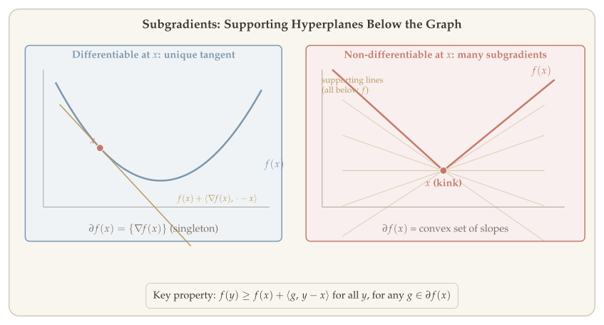
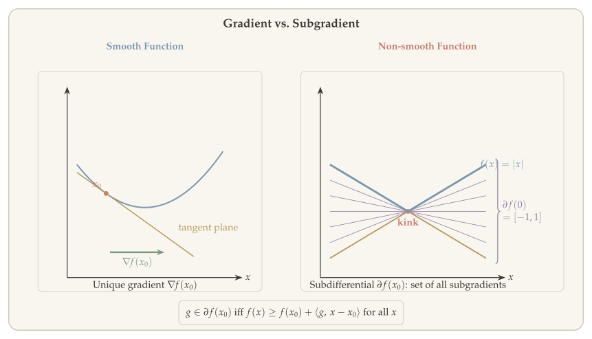
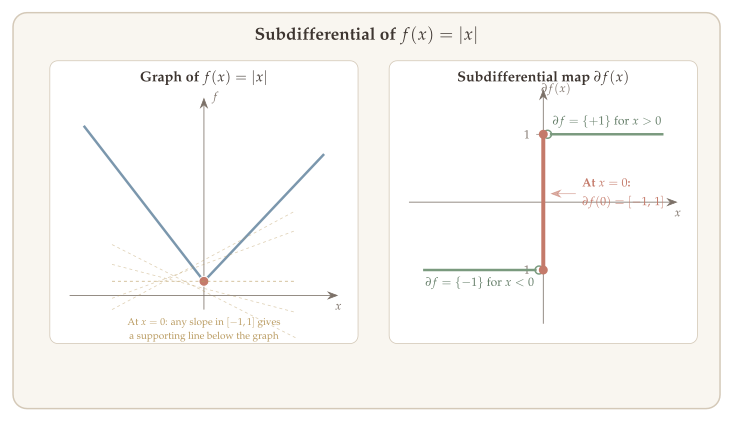
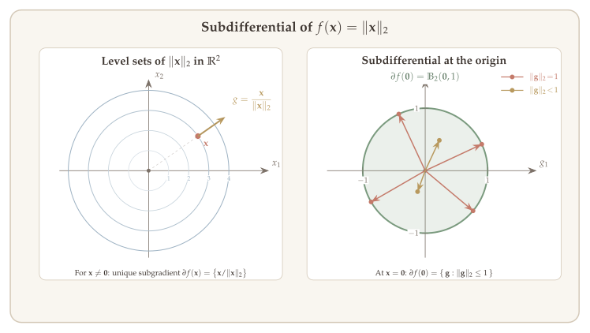
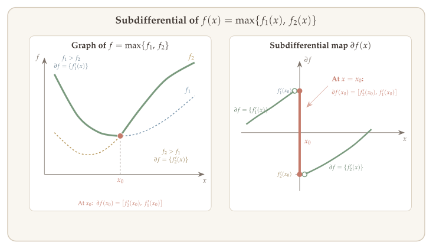
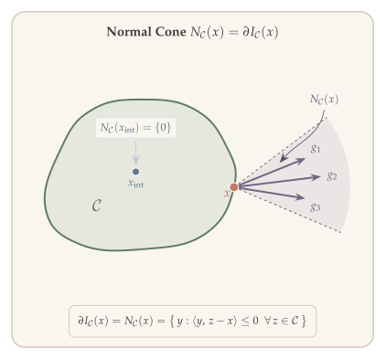
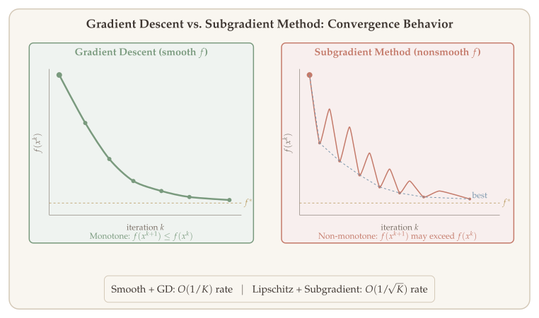
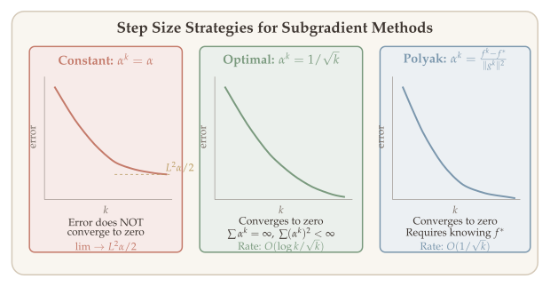
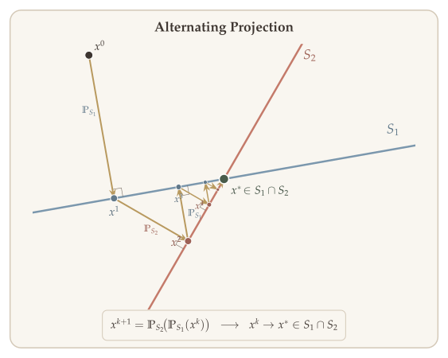

Many important optimization problems involve objective functions that are not differentiable everywhere. The $\ell_1$-norm $\|x\|_1$, the pointwise maximum of a family of functions, and indicator functions of constraint sets are all fundamental building blocks of modern optimization models---yet none of them are smooth. Gradient descent, which relies on the existence of a gradient at every iterate, simply cannot be applied directly.

The theory of **subgradients** provides the right generalization. A subgradient at a point $x$ is any vector that defines a supporting hyperplane to the epigraph of $f$ at $(x, f(x))$. For differentiable functions the subgradient reduces to the ordinary gradient, but for nonsmooth convex functions the set of subgradients---the **subdifferential**---is typically a convex set rather than a singleton. This richer structure leads to a complete calculus (sum rules, chain rules, pointwise maximum rules) and to optimality conditions that unify smooth and nonsmooth settings.

Armed with these tools, we develop the **subgradient method**: at each step, move in the direction of a negative subgradient with a carefully chosen step size. Unlike gradient descent, subgradient steps are not guaranteed to decrease the objective, so the analysis tracks the best iterate seen so far. The resulting convergence rates---$O(1/\sqrt{K})$ for convex Lipschitz functions, and $O(1/K)$ under strong convexity---are slower than those of gradient descent for smooth problems, but they apply to a much broader class of functions.

**Reference:** Chapter 3 of [[Beck]](https://doi.org/10.1137/1.9781611974997).

::: {.callout-tip}
## Companion Notebook

 A companion notebook accompanies this chapter with runnable Python implementations of subgradient methods and proximal gradient descent, including ISTA for Lasso and convergence comparisons.
:::

## What Will Be Covered {#sec-overview}

1. Subgradients and the subdifferential
2. Subgradient calculus (sum, chain, pointwise max rules)
3. Optimality conditions for unconstrained and constrained problems
4. Subgradient descent and projected subgradient descent
5. Convergence rates for Lipschitz convex and strongly convex functions

## Subgradients {#sec-subgradients}

Recall that if $f$ is convex and differentiable, then

$$f(y) \geq f(x) + \langle \nabla f(x),\, y - x \rangle.$$

When $f$ is not differentiable, we can still ask: is there a vector $g$ such that the affine function $f(x) + \langle g, y - x \rangle$ lies below $f$ everywhere? Such a vector is called a subgradient.

**How to read @fig-subgradient-concept.** The left panel shows a smooth convex function: at each point there is exactly one tangent line (supporting hyperplane) that lies below the curve. The right panel shows a nonsmooth function with a kink: at the kink, infinitely many lines pass below the curve, each defining a valid subgradient. The set of all such slopes is the subdifferential $\partial f(x)$ --- a convex set that reduces to a singleton $\{\nabla f(x)\}$ at smooth points.

{#fig-subgradient-concept}

{#fig-subgradient-vs-gradient}

::: {#def-subgradient}
## Subgradient

Let $f$ be a convex function. Let $D = \operatorname{dom}(f)$. A **subgradient** of $f$ at $x$ is any vector $g \in \mathbb{R}^n$ satisfying

$$f(y) \geq f(x) + \langle g,\, y - x \rangle \quad \forall\, y \in D.$$ {#eq-subgradient-def}
:::

We define the set of all subgradients of $f$ at $x$ as the **subdifferential** of $f$ at $x$, denoted by $\partial f$:

$$\partial f(x) = \bigl\{ g \in \mathbb{R}^n :\; f(y) \geq f(x) + \langle g,\, y - x \rangle,\; \forall\, y \in D \bigr\}.$$

::: {.callout-note}
## Properties of the Subdifferential

A crucial point to keep in mind: **the subdifferential $\partial f(x)$ is a *set*, not a single vector.** It collects *all* subgradients at $x$---every vector $g$ satisfying the supporting hyperplane inequality $f(y) \geq f(x) + \langle g, y - x \rangle$. At a "kink" like $x = 0$ for $f(x) = |x|$, this set is an entire interval $[-1, 1]$. At smooth points, the set collapses to a single element: the usual gradient. This **set-valued** nature is what allows the subdifferential to describe the local geometry of nonsmooth functions.

- **Existence.** $\partial f(x)$ is always nonempty for $x \in \operatorname{int}(D)$. This is a fundamental fact: every convex function admits a supporting hyperplane at any interior point. At boundary points, subgradients may fail to exist (see @exm-boundary-not-subdiff below).
- **Consistency with the gradient.** If $\nabla f$ exists at $x$, then $\partial f(x) = \{\nabla f(x)\}$---the subdifferential is a **singleton containing exactly the gradient**. This means subgradient methods automatically recover gradient descent on smooth regions: the subgradient "is" the gradient wherever the gradient exists.
- **Singleton implies differentiability.** The converse also holds: if $\partial f(x) = \{g\}$ is a singleton, then $f$ *must* be differentiable at $x$ and $g = \nabla f(x)$. In other words, $|\partial f(x)| = 1$ if and only if $f$ is differentiable at $x$. A "thick" subdifferential (more than one element) is the hallmark of a nondifferentiable point.
- **Closed and convex.** $\partial f(x)$ is always a closed convex set (even for nonconvex $f$). This follows directly from the definition: it is the intersection of half-spaces $\{g : f(y) - f(x) - \langle g, y - x \rangle \geq 0\}$ over all $y$.
- **Convention outside the domain.** For any $x \notin \operatorname{dom}(f)$, we define $\partial f(x) = \emptyset$.
- **Nonconvex extension.** The subgradient definition extends to nonconvex functions, but $\partial f(x)$ may be empty even at interior points. The rich theory above relies on convexity.
:::

::: {#exm-boundary-not-subdiff}
## Convex Function Not Subdifferentiable at the Boundary

Consider

$$f(x) = \begin{cases} -\sqrt{x} & x \geq 0, \\ \infty & \text{otherwise.} \end{cases}$$

Here $\operatorname{dom}(f) = [0, \infty)$. The function $f$ is **not subdifferentiable** at $x = 0$.
:::

::: {.proof}
Suppose $\exists\, g \in \partial f(0)$. Then for all $x \geq 0$,

$$f(x) = -\sqrt{x} \geq f(0) + g \cdot x = g \cdot x.$$

So $-\sqrt{x} \geq g x$ for all $x \geq 0$.

- Set $x = 1$: $\Rightarrow g \leq -1 < 0$.
- Set $x = \tfrac{1}{2g^2}$: $\Rightarrow -\sqrt{\tfrac{1}{2g^2}} \geq \tfrac{1}{2g}$, i.e. $\tfrac{1}{2g^2} \leq \tfrac{1}{4g^2}$.

This is a contradiction, so no subgradient exists at $x = 0$. Hence we conclude the proof. $\blacksquare$
:::

::: {#thm-subdiff-nonempty}
## Nonemptiness of the Subdifferential

For any $x \in \operatorname{int}(\operatorname{dom}(f))$, with $f$ convex,

$$\partial f(x) \neq \emptyset.$$
:::

This is a **regularity theorem**: it guarantees that the subdifferential machinery never breaks down at interior points. Without it, every subgradient-based algorithm and proof technique would need to first check whether a subgradient exists at the current iterate---a condition that is virtually impossible to verify in practice.

**Why is this true?** The geometric intuition is clean. At any interior point $x$, the epigraph $\operatorname{epi}(f) = \{(y, t) : t \geq f(y)\}$ is a convex set, and the point $(x, f(x))$ lies on its boundary. By the **supporting hyperplane theorem**, there exists a hyperplane that supports $\operatorname{epi}(f)$ at $(x, f(x))$---i.e., it touches the boundary without cutting into the interior. The "slope" of this hyperplane is precisely a subgradient $g \in \partial f(x)$. The condition $x \in \operatorname{int}(\operatorname{dom}(f))$ is needed to ensure that the epigraph has nonempty interior near $(x, f(x))$, which is the hypothesis of the supporting hyperplane theorem.

**Why does this matter?** This result underpins the entire subgradient method: at each iteration $x^k \in \operatorname{int}(\operatorname{dom}(f))$, we are guaranteed to find some $g^k \in \partial f(x^k)$ to use as a descent direction. It also justifies the optimality condition $0 \in \partial f(x^*)$: if the subdifferential could be empty, the condition would be vacuously satisfied at every point, rendering it useless. The restriction to interior points is essential---as @exm-boundary-not-subdiff shows, subgradients can fail to exist at boundary points of the domain.

## Examples of Subgradients {#sec-examples}

We now work through a series of concrete examples, starting from scalar functions and building up to multivariate and set-valued cases. These examples illustrate the key pattern: at points where $f$ is differentiable, the subdifferential is a singleton $\{\nabla f(x)\}$; at "kinks" or non-smooth points, the subdifferential expands into a set that interpolates the neighboring gradients.

### Absolute Value {#sec-ex-abs}

The simplest non-smooth convex function is the absolute value $f(x) = |x|$ on $\mathbb{R}$. Away from the origin, the function is differentiable with derivative $\pm 1$. At $x = 0$, the subdifferential fills in the gap:

$$\partial f(x) = \begin{cases} \{\operatorname{sign}(x)\} & x \neq 0, \\ [-1, 1] & x = 0. \end{cases}$$

{#fig-abs-subdifferential}

### Euclidean Norm {#sec-ex-norm2}

Moving to higher dimensions, consider the Euclidean norm $f(x) = \|x\|_2$ on $\mathbb{R}^n$. The function is smooth everywhere except at the origin, where all directions look equally steep.

- For $x \neq 0$: $f(x) = \sqrt{\sum_{i=1}^{n} x_i^2}$ is differentiable, and

$$\frac{\partial f}{\partial x_i} = \tfrac{1}{2}\Bigl(\sum_{i=1}^{n} x_i^2\Bigr)^{-1/2} \cdot 2x_i = \frac{x_i}{\|x\|}.$$

So the unique subgradient is $\dfrac{x}{\|x\|_2}$.

- For $x = 0$: the subdifferential is the entire unit ball $\partial f(0) = \{g : \|g\|_2 \leq 1\}$.

::: {.proof}
For all $y \in \mathbb{R}^n$ and any $z$ with $\|z\|_2 \leq 1$, Cauchy--Schwarz gives $\langle z, y \rangle \leq \|z\|_2\|y\|_2 \leq \|y\|_2 = f(y) - f(0)$, confirming $z \in \partial f(0)$. $\blacksquare$
:::

{#fig-norm2-subdifferential}

### General Norm {#sec-ex-general-norm}

The $\ell_2$-norm result generalizes to any norm $\|\cdot\|$ on $\mathbb{R}^n$. Let $f(x) = \|x\|$. The subdifferential at the origin is the unit ball in the **dual norm** $\|\cdot\|_*$:

$$\partial f(0) = \{z : \|z\|_* \leq 1\}.$$

::: {.proof}
We verify that every $z$ with $\|z\|_* \leq 1$ satisfies the subgradient inequality. By the definition of the dual norm, for all $y \in \mathbb{R}^n$:
$$\|y\| = \sup_{\|z\|_* \leq 1} z^\top y \geq z^\top y = z^\top (y - 0) = f(0) + z^\top (y - 0),$$
where the last equality uses $f(0) = 0$. This is exactly the subgradient condition at $x = 0$. $\blacksquare$
:::

For example, the dual of the $\ell_1$-norm is the $\ell_\infty$-norm, so $\partial \|x\|_1\big|_{x=0} = \{z : \|z\|_\infty \leq 1\} = [-1, 1]^n$---the hypercube in $\mathbb{R}^n$.

### Pointwise Maximum of Two Convex Functions {#sec-ex-max-two}

Taking the pointwise maximum of convex functions preserves convexity, but introduces kinks wherever the active function switches. Consider $f(x) = \max\{f_1(x),\, f_2(x)\}$ in the scalar case, where $f_1, f_2$ are convex and differentiable.

$$\partial f(x) = \begin{cases} \{f_1'(x)\} & \text{if } f_1(x) > f_2(x), \\ [f_2'(x),\, f_1'(x)] & \text{if } f_1(x) = f_2(x), \\ \{f_2'(x)\} & \text{if } f_2(x) > f_1(x). \end{cases}$$

At points where one function strictly dominates, $f$ inherits its gradient. At the "kink" where $f_1 = f_2$, the subdifferential fills in the interval between the two one-sided slopes---exactly as in the absolute value example.

{#fig-max-subdifferential}

### Lagrange Dual {#sec-ex-lagrange-dual}

Subgradients also arise naturally in duality theory. Consider the Lagrange dual function associated with $\min_x f(x)$ subject to $f_1(x) \leq 0$:

$$g(\lambda) = \inf_x \{f(x) + \lambda \cdot f_1(x)\}.$$

Since $g$ is the pointwise infimum of affine functions in $\lambda$, it is concave on its effective domain $\operatorname{dom}(g) = \{\lambda : g(\lambda) > -\infty\}$. We can identify a subgradient of $h(\lambda) = -g(\lambda)$ (a convex function) explicitly.

Fix any $\lambda_0 \in \operatorname{dom}(g)$ and let $x_0$ be a minimizer attaining $g(\lambda_0) = f(x_0) + \lambda_0 \cdot f_1(x_0)$. Define the convex function $h(\lambda) = -g(\lambda)$. For any $\lambda \in \operatorname{dom}(g)$, we lower-bound $h(\lambda)$ by evaluating at $x_0$ instead of minimizing:

$$\begin{aligned}
h(\lambda) &= -\min_x \{f(x) + \lambda \cdot f_1(x)\} \\
&\geq -(f(x_0) + \lambda \cdot f_1(x_0)) \\
&= h(\lambda_0) + (\lambda - \lambda_0) \cdot (-f_1(x_0)).
\end{aligned}$$

This is exactly the subgradient inequality $h(\lambda) \geq h(\lambda_0) + \langle g, \lambda - \lambda_0 \rangle$ with $g = -f_1(x_0)$, so

$$-f_1(x_0) \in \partial h(\lambda_0).$$

In other words, the **negative constraint value** at the minimizer provides a subgradient of the negated dual function. This fact is central to dual decomposition methods and sensitivity analysis in optimization.

### Indicator Function {#sec-ex-indicator}

The indicator function of a convex set $C$ encodes the constraint $x \in C$ as an optimization penalty:

$$I_C(x) = \begin{cases} 0 & \text{if } x \in C, \\ \infty & \text{if } x \notin C. \end{cases}$$

Computing its subdifferential reveals a fundamental geometric object. Let $x \in C$. By definition, $y \in \partial I_C(x)$ if and only if the subgradient inequality holds:

$$I_C(z) \geq I_C(x) + \langle y,\, z - x \rangle \quad \forall\, z.$$

Since $x \in C$, we have $I_C(x) = 0$. For $z \notin C$, the left side is $+\infty$, so the inequality is automatically satisfied. The only binding requirement comes from $z \in C$, where $I_C(z) = 0$ as well, giving:

$$\langle y,\, z - x \rangle \leq 0 \quad \forall\, z \in C.$$

This says that $y$ makes an obtuse (or right) angle with every feasible direction $z - x$. The set of all such vectors is called the **normal cone**:

$$\partial I_C(x) = \{y : \langle y,\, z - x \rangle \leq 0 \;\; \forall\, z \in C\} = N_C(x),$$

the **normal cone** of $C$ at $x$. The normal cone collects all outward-pointing vectors that make an obtuse angle with every feasible direction---exactly the vectors from the projection characterization in @sec-proj-characterization.

{#fig-normal-cone}

::: {.callout-tip}
## Optimality via Normal Cone

Recall the first-order optimality condition for $\min f(x)$ s.t. $x \in C$:

$$x^* \text{ is optimal} \quad \Longleftrightarrow \quad -\nabla f(x^*) \in N_C(x^*).$$
:::

## Lipschitzness and Boundedness of Subgradients {#sec-lipschitz-bounded}

A key connection between the global behavior of a convex function and its local subdifferential is the equivalence between Lipschitz continuity and boundedness of subgradients. This relationship is fundamental for the convergence analysis of subgradient methods.

A function $f$ is **$L$-Lipschitz** if for all $x, y \in \operatorname{dom}(f)$,

$$|f(x) - f(y)| \leq L \cdot \|x - y\|.$$

::: {#thm-lipschitz-subgrad}
## Lipschitzness and Bounded Subgradients

Let $X \subseteq \operatorname{int}(\operatorname{dom}(f))$ be a set. Consider:

**(i)** $|f(x) - f(y)| \leq L \cdot \|x - y\|$ for all $x, y \in X$.

**(ii)** $\|g\|_* \leq L$ for any $g \in \partial f(x)$, for all $x \in X$.

Then we have: **(ii)** $\Rightarrow$ **(i)**.

Moreover, if $X$ is an open set, then **(i)** $\Rightarrow$ **(ii)**.

For example, $X = \operatorname{dom}(f)$ is an open set.
:::

::: {.proof}
**(a). Bounded subgradients imply Lipschitzness: (ii) $\Rightarrow$ (i).**

Pick any $x, y \in X$ and any subgradient $g_x \in \partial f(x)$. By the subgradient inequality and the Cauchy--Schwarz inequality (in its generalized norm/dual-norm form):

$$f(y) - f(x) \leq \langle g_x,\, y - x \rangle \leq \|g_x\|_* \cdot \|x - y\| \leq L \cdot \|x - y\|.$$

The first step uses the definition of subgradient, the second is Cauchy--Schwarz, and the third applies the bound $\|g_x\|_* \leq L$. Swapping the roles of $x$ and $y$ and using $g_y \in \partial f(y)$:

$$f(x) - f(y) \leq \langle g_y,\, x - y \rangle \leq \|g_y\|_* \cdot \|x - y\| \leq L \cdot \|x - y\|.$$

Combining both inequalities gives $|f(x) - f(y)| \leq L \cdot \|x - y\|$, which is exactly the Lipschitz condition.

**(b). Lipschitzness implies bounded subgradients: (i) $\Rightarrow$ (ii).**

This direction requires $X$ to be open, so we can "probe" the function in any direction from $x$. Fix any $x \in X$ and $g \in \partial f(x)$. We want to show $\|g\|_* \leq L$.

The idea is to evaluate the subgradient inequality along the direction that maximizes $\langle g, \cdot \rangle$. By the definition of the dual norm, there exists a unit vector $g^+$ with $\|g^+\| = 1$ such that $\langle g^+, g \rangle = \|g\|_*$. Since $X$ is open, for sufficiently small $\varepsilon > 0$ the perturbed point $x + \varepsilon g^+$ remains in $X$. Combining the Lipschitz bound (upper) and the subgradient inequality (lower):

$$L \cdot \varepsilon = L \cdot \|\varepsilon g^+\| \geq f(x + \varepsilon g^+) - f(x) \geq \langle g,\, \varepsilon g^+ \rangle = \varepsilon \cdot \|g\|_*.$$

Dividing by $\varepsilon > 0$ yields $\|g\|_* \leq L$. The key step is the "sandwiching": Lipschitz continuity controls the function change from above, while the subgradient inequality controls it from below. $\blacksquare$
:::

## (Strong) Convexity and (Strong) Monotonicity of $\partial f$ {#sec-strong-monotonicity}

Recall that for differentiable functions, $\mu$-strong convexity ($\mu \geq 0$) is equivalent to the **strong monotonicity** of the gradient:

$$\langle \nabla f(x) - \nabla f(y),\, x - y \rangle \geq \mu \cdot \|x - y\|_2^2.$$

This characterization extends naturally to nonsmooth convex functions by replacing gradients with subgradients. The resulting property---strong monotonicity of the subdifferential---is the nonsmooth analog and plays the same role in convergence analysis.

::: {#lem-strong-monotonicity}
## Strong Monotonicity of Subdifferential

If $f$ is $\mu$-strongly convex ($\mu \geq 0$), then for any $g_1 \in \partial f(x_1)$, $g_2 \in \partial f(x_2)$,

$$\langle g_1 - g_2,\, x_1 - x_2 \rangle \geq \mu \cdot \|x_1 - x_2\|_2^2.$$

When $\mu = 0$ (plain convexity), this reduces to **monotonicity**: $\langle g_1 - g_2, x_1 - x_2 \rangle \geq 0$, meaning subgradients always "agree" with the direction between the points.
:::

::: {.proof}
By the subgradient inequality applied to the $\mu$-strongly convex function $f$:

$$f(x_2) \geq f(x_1) + \langle g_1, x_2 - x_1 \rangle + \frac{\mu}{2}\|x_2 - x_1\|_2^2,$$
$$f(x_1) \geq f(x_2) + \langle g_2, x_1 - x_2 \rangle + \frac{\mu}{2}\|x_1 - x_2\|_2^2.$$

Adding these two inequalities, the $f(x_1)$ and $f(x_2)$ terms cancel:

$$0 \geq \langle g_1, x_2 - x_1 \rangle + \langle g_2, x_1 - x_2 \rangle + \mu\|x_1 - x_2\|_2^2.$$

Rearranging gives $\langle g_1 - g_2, x_1 - x_2 \rangle \geq \mu \|x_1 - x_2\|_2^2$, as desired. $\blacksquare$
:::

## Subgradient Calculus {#sec-calculus}

Just as the gradient calculus (chain rule, product rule, sum rule) enables efficient computation of gradients for composed functions, the **subgradient calculus** provides analogous rules for computing subdifferentials of functions built from simpler pieces. These rules are essential both for verifying optimality conditions and for implementing subgradient methods in practice.

### Scaling {#sec-calc-scaling}

For any $\alpha > 0$, scaling a function scales its subdifferential:

$$\partial(\alpha \cdot f)(x) = \alpha \cdot \partial f(x) = \{\alpha \cdot g : g \in \partial f(x)\}.$$

This follows directly from the definition: $g \in \partial f(x)$ means $f(y) \geq f(x) + \langle g, y - x \rangle$ for all $y$, so multiplying both sides by $\alpha > 0$ gives $\alpha f(y) \geq \alpha f(x) + \langle \alpha g, y - x \rangle$, which means $\alpha g \in \partial(\alpha f)(x)$.

### Summation {#sec-calc-summation}

The sum rule is the most frequently used calculus rule. It says that the subdifferential of a sum contains the sum of the subdifferentials, with equality under a mild regularity condition.

Let $f_1, f_2$ be two convex functions. For $x \in \operatorname{dom}(f_1) \cap \operatorname{dom}(f_2)$:

**(a)** $\partial f_1(x) + \partial f_2(x) = \{g_1 + g_2 : g_1 \in \partial f_1(x),\, g_2 \in \partial f_2(x)\} \subseteq \partial(f_1 + f_2)(x)$.

**(b)** If $x \in \operatorname{int}(\operatorname{dom}(f_1)) \cap \operatorname{int}(\operatorname{dom}(f_2))$, then

$$\partial f_1(x) + \partial f_2(x) = \partial(f_1 + f_2)(x).$$

If $\operatorname{dom}(f_1) = \operatorname{dom}(f_2) = \mathbb{R}^n$, we can let $x \in \mathbb{R}^n$.

::: {.proof}
**Proof of (a).** Take any $g_1 \in \partial f_1(x)$ and $g_2 \in \partial f_2(x)$. By the subgradient inequality for each function:

$$f_1(y) \geq f_1(x) + \langle g_1, y - x \rangle, \qquad f_2(y) \geq f_2(x) + \langle g_2, y - x \rangle.$$

Adding these two inequalities:

$$(f_1 + f_2)(y) \geq (f_1 + f_2)(x) + \langle g_1 + g_2, y - x \rangle,$$

which shows $g_1 + g_2 \in \partial(f_1 + f_2)(x)$. Since this holds for every choice of $g_1 \in \partial f_1(x)$ and $g_2 \in \partial f_2(x)$, we conclude $\partial f_1(x) + \partial f_2(x) \subseteq \partial(f_1 + f_2)(x)$.

The reverse inclusion $\partial(f_1 + f_2)(x) \subseteq \partial f_1(x) + \partial f_2(x)$ requires the interior condition in **(b)** and is more delicate; we omit it here. $\blacksquare$
:::

::: {.callout-tip}
## General Summation Rule

For $f_1, f_2, \ldots, f_m : \mathbb{R}^n \to \mathbb{R}$ convex,

$$\partial\Bigl(\sum_{i=1}^{m} \alpha_i \cdot f_i\Bigr)(x) = \sum_{i=1}^{m} \alpha_i \cdot \partial f_i(x) \quad \forall\, x \in \mathbb{R}^n.$$
:::

### Example: $\ell_1$-Norm {#sec-calc-ex-l1}

As a first application of the summation rule, consider the $\ell_1$-norm $f(x) = \|x\|_1 = \sum_{i=1}^{n} |x_i|$. Since $f$ decomposes as a sum of separable functions $f_i(x) = |x_i|$, the summation rule gives $\partial f(x) = \sum_{i=1}^{n} \partial f_i(x)$. From the absolute value example, each component contributes:

$$\partial f_i(x) = \begin{cases} \{\operatorname{sign}(x_i)\} \cdot e_i & \text{if } x_i \neq 0, \\ [-1, 1] \cdot e_i & \text{if } x_i = 0, \end{cases}$$

where $e_i$ is the $i$-th standard basis vector. Summing over all components, the subdifferential of $\|x\|_1$ is the set of vectors whose $i$-th coordinate is $\operatorname{sign}(x_i)$ when $x_i \neq 0$, and any value in $[-1, 1]$ when $x_i = 0$.

### Affine Transformation {#sec-calc-affine}

When a convex function is composed with an affine mapping, the subdifferential transforms by the transpose of the linear part---just as in smooth calculus where $\nabla_x f(Ax + b) = A^\top \nabla f(Ax + b)$. Specifically, if $h(x) = f(Ax + b)$, then

$$\partial h(x) = A^\top \partial f(Ax + b) = \{A^\top g : g \in \partial f(Ax + b)\},$$

for all $x$ satisfying $x \in \operatorname{int}(\operatorname{dom}(h))$ and $Ax + b \in \operatorname{int}(\operatorname{dom}(f))$. This rule is used extensively in machine learning, where the loss function often takes the form $\ell(Ax + b)$ for a weight matrix $A$ and bias $b$.

::: {#exm-l1-affine}
## Subdifferential of $\|Ax + b\|_1$

Combining the affine transformation rule with the $\ell_1$-norm subdifferential gives an explicit formula for the regularizer $f(x) = \|Ax + b\|_1$, which appears frequently in compressed sensing and sparse recovery problems.

Let $A = \begin{pmatrix} a_1^\top \\ \vdots \\ a_m^\top \end{pmatrix}$ with rows $a_i \in \mathbb{R}^n$, and $b = \begin{pmatrix} b_1 \\ \vdots \\ b_m \end{pmatrix}$. Partition the indices into the **active set** $I_0(x) = \{i : a_i^\top x + b_i = 0\}$ (where the $\ell_1$-norm has a kink) and the **smooth set** $I_+(x) = \{i : a_i^\top x + b_i \neq 0\}$.

By the affine rule, $\partial f(x) = A^\top \partial g(Ax + b)$ where $g(y) = \|y\|_1$. From the $\ell_1$ example:

$$\partial g(y) = \sum_{i:\, y_i \neq 0} \operatorname{sign}(y_i) \cdot e_i + \sum_{i:\, y_i = 0} [-e_i, e_i].$$

Applying $A^\top$ maps each component $e_i$ to the row $a_i$, giving $\partial f(x) = \sum_{i \in I_+} \operatorname{sign}(a_i^\top x + b_i) \cdot a_i + \sum_{i \in I_0} [-a_i, a_i]$.
:::

::: {#exm-l2-affine}
## Subdifferential of $\|Ax + b\|_2$

Similarly, for $f(x) = \|Ax + b\|_2$, the affine rule combined with the Euclidean norm subdifferential yields: at any point $x_0$ where $Ax_0 + b = 0$ (the non-smooth point), the subdifferential is the image of the unit ball under $A^\top$:

$$\partial f(x_0) = \{A^\top y : \|y\|_2 \leq 1\}.$$

At points where $Ax + b \neq 0$, the function is differentiable and $\nabla f(x) = A^\top \frac{Ax + b}{\|Ax + b\|_2}$.
:::

### Chain Rule {#sec-calc-chain}

When a differentiable nondecreasing convex function is composed with a convex function, the subdifferential obeys a chain-like rule. The key requirement is that the outer function $g$ be **nondecreasing**---this ensures convexity is preserved under composition.

::: {#thm-chain-rule}
## Subgradient Chain Rule

Let $f : \mathbb{R}^n \to \mathbb{R}$ be a convex function, and $g : \mathbb{R} \to \mathbb{R}$ be a nondecreasing convex function. Suppose $g$ is differentiable. (Then $g \circ f$ is convex.) Let $h = g \circ f$. Then

$$\partial h(x) = g'(f(x)) \cdot \partial f(x).$$
:::

The intuition mirrors the smooth chain rule $\nabla(g \circ f)(x) = g'(f(x)) \cdot \nabla f(x)$: the outer derivative $g'(f(x)) \geq 0$ (since $g$ is nondecreasing) simply scales every subgradient of the inner function $f$.

### Composition {#sec-calc-composition}

The chain rule generalizes to compositions with multivariate outer functions. Suppose $h(x) = g(f_1(x), \ldots, f_m(x))$, where $f_1, \ldots, f_m$ are convex and $g : \mathbb{R}^m \to \mathbb{R}$ is differentiable, nondecreasing in each argument, and convex. The gradient of $g$ at the point $(f_1(x), \ldots, f_m(x))$ provides the "mixing weights" for the subgradients of the individual $f_i$.

For any given $x$, let

$$\widehat{g} = \nabla h(y)\big|_{y = \begin{pmatrix} f_1(x) \\ \vdots \\ f_m(x) \end{pmatrix}}.$$

Then

$$\partial h(x) = \Bigl\{\sum_{i=1}^{m} \widehat{g}_i \cdot g_i \;\Big|\; g_i \in \partial f_i(x)\Bigr\}.$$

Each subgradient of the composition is a weighted combination of subgradients of the component functions, where the weights $\widehat{g}_i$ come from the gradient of $g$.

::: {#exm-l1-squared}
## Subdifferential of $\|x\|_1^2$

As an application of the scalar chain rule, consider $f(x) = \|x\|_1^2 = \bigl(\sum_{i=1}^{n} |x_i|\bigr)^2$. We decompose this as $f = h \circ g$ where $h(t) = t^2$ (differentiable, nondecreasing for $t \geq 0$, and convex) and $g(x) = \|x\|_1$ (convex, nonnegative). Since $h'(t) = 2t$, the chain rule gives:

$$\partial f(x) = h'(g(x)) \cdot \partial g(x) = 2\|x\|_1 \cdot \partial\|x\|_1.$$

At $x = 0$, we get $\partial f(0) = \{0\}$, consistent with the fact that $\|x\|_1^2$ is differentiable at the origin with gradient zero (it is "smoother" than $\|x\|_1$).
:::

### Pointwise Maximum {#sec-calc-pointwise-max}

The pointwise maximum of finitely many convex functions is one of the most important constructions in non-smooth optimization. Let $f(x) = \max_{1 \leq i \leq k} f_i(x)$. The subdifferential is determined by the **active functions**---those achieving the maximum at $x$:

$$\partial f(x) = \operatorname{ConvHull}\Bigl(\bigcup_{i \in \mathcal{I}(x)} \partial f_i(x)\Bigr),$$

where $\mathcal{I}(x) = \{i : f_i(x) = f(x)\}$ is the active index set and $x \in \bigcap_{i=1}^{k} \operatorname{int}(\operatorname{dom}(f_i))$. Inactive functions ($f_i(x) < f(x)$) do not contribute to the subdifferential at all.

Written out explicitly, this is the **convex hull of subdifferentials of all active functions**:

$$= \Bigl\{\sum_{j=1}^{k} \lambda_j \cdot g_j \;\Big|\; \lambda_j = 0 \text{ if } j \notin \mathcal{I}(x),\; \sum_{j=1}^{k} \lambda_j = 1,\; \lambda_j \geq 0,\; g_j \in \partial f_j(x)\Bigr\}.$$

When exactly one function is active ($|\mathcal{I}(x)| = 1$), the subdifferential reduces to $\partial f_i(x)$ for that single active $i$. When multiple functions tie, we must take convex combinations of their subgradients.

### Pointwise Supremum {#sec-calc-pointwise-sup}

When the maximum is taken over an **infinite** (possibly uncountable) family of convex functions, the result extends with one extra topological step: we must take the **closure** of the convex hull. If $f(x) = \sup_{\alpha \in \mathcal{A}} f_\alpha(x)$, then for all $x \in \bigcap_{\alpha \in \mathcal{A}} \operatorname{int}(\operatorname{dom}(f_\alpha))$:

$$\partial f(x) = \operatorname{Closure}\Bigl(\operatorname{ConvHull}\Bigl(\bigcup_{\alpha \in \mathcal{I}(x)} \partial f_\alpha(x)\Bigr)\Bigr),$$

where $\mathcal{I}(x) = \{\alpha : f_\alpha(x) = f(x)\}$ is the **active index set**---the collection of all indices $\alpha$ for which the function $f_\alpha$ attains the supremum at $x$. The closure is needed because an infinite union of convex sets may not be closed. For finite families ($|\mathcal{A}| < \infty$), the closure is automatic and we recover the formula above.

::: {#exm-piecewise-linear}
## Piecewise Linear Function

Every piecewise linear convex function can be written as the maximum of affine functions: $f(x) = \max_{1 \leq i \leq m} \{a_i^\top x + b_i\}$. Since each $f_i(x) = a_i^\top x + b_i$ is differentiable with $\nabla f_i(x) = a_i$, the pointwise maximum rule gives

$$\partial f(x) = \operatorname{ConvHull}\{a_i : i \in \mathcal{I}(x)\},$$

where $\mathcal{I}(x) = \{i : a_i^\top x + b_i = f(x)\}$ is the set of active hyperplanes. At a vertex of the piecewise linear graph (where many hyperplanes meet), the subdifferential is a polytope; on a flat piece where only one hyperplane is active, it is the singleton $\{a_i\}$.
:::

::: {#exm-linf-norm}
## $\ell_\infty$ Norm

The $\ell_\infty$-norm $f(x) = \|x\|_\infty = \max_{1 \leq i \leq n} |x_i|$ is a pointwise maximum of $2n$ affine functions ($+x_i$ and $-x_i$ for each coordinate). By the pointwise maximum rule, only the coordinates achieving the maximum contribute:

$$\partial f(x) = \operatorname{ConvHull}\{\operatorname{sign}(x_i) \cdot e_i : |x_i| = \|x\|_\infty\}.$$

For instance, if $x = (3, -3, 1)^\top$, then $\|x\|_\infty = 3$ and $\partial f(x) = \operatorname{ConvHull}\{e_1, -e_2\}$---a line segment between the first and (negated) second basis vectors.
:::

## Optimality Conditions {#sec-optimality}

With the subdifferential calculus from @sec-calculus in hand, we can now state optimality conditions that work for nonsmooth convex problems---generalizing the familiar condition $\nabla f(x^*) = 0$ from smooth optimization.

### Unconstrained Case {#sec-opt-unconstrained}

The fundamental optimality condition for unconstrained minimization of a convex function is that the zero vector belongs to the subdifferential at the minimizer. In smooth optimization this reduces to the familiar $\nabla f(x^*) = 0$, but the subdifferential version applies to all convex functions, including non-differentiable ones like $\|x\|_1$.

::: {#thm-unconstrained-opt}
## Unconstrained Optimality Condition

Let $f : D \to \mathbb{R}$ be a convex function. Then

$$x^* \in \operatorname{argmin}\{f(x) : x \in \mathbb{R}^n\} \quad \Longleftrightarrow \quad 0 \in \partial f(x^*).$$
:::

::: {.proof}
**($\Leftarrow$ Sufficiency.)** Suppose $0 \in \partial f(x^*)$. Since $0$ is a subgradient at $x^*$, the subgradient inequality gives:
$$f(x) \geq f(x^*) + \langle 0,\, x - x^*\rangle = f(x^*) \quad \forall\, x \in D.$$
This says $f(x) \geq f(x^*)$ for every $x$, which is exactly the definition of $x^*$ being a global minimizer.

**($\Rightarrow$ Necessity.)** Suppose $x^*$ is a global minimizer, so $f(x) \geq f(x^*)$ for all $x \in D$. We can rewrite this as:
$$f(x) \geq f(x^*) + \langle 0,\, x - x^*\rangle \quad \forall\, x \in D.$$
By definition, this means $g = 0$ is a subgradient of $f$ at $x^*$, i.e., $0 \in \partial f(x^*)$. $\blacksquare$
:::

Note the power of this result: for convex functions, $0 \in \partial f(x^*)$ is both necessary and sufficient for global optimality---there are no issues with local minima or saddle points.

::: {#exm-piecewise-linear-opt}
## Optimality for Piecewise Linear Functions

Consider $f(x) = \max_{i=1,\ldots,k} \{a_i^\top x + b_i\}$, and let $\mathcal{I}(x) = \{i : a_i^\top x + b_i = f(x)\}$ be the active set. From @exm-piecewise-linear, we have $\partial f(x) = \operatorname{ConvHull}\{a_i : i \in \mathcal{I}(x)\}$. By the optimality condition $0 \in \partial f(x^*)$, the point $x^*$ is a minimizer if and only if the origin lies in the convex hull of the active gradients:

$$0 \in \Bigl\{\sum_{i \in \mathcal{I}(x^*)} \lambda_i a_i \;\Big|\; \sum \lambda_i = 1,\; \lambda_i \geq 0\Bigr\}.$$

Geometrically, this means the active hyperplane normals "balance out" at the minimizer---no single direction is left uncancelled.
:::

### Convex and Constrained Case {#sec-opt-constrained}

For the constrained problem $\min_x f(x)$ s.t. $x \in C$ (with $C$ a closed convex set), the optimality condition involves both the subdifferential and the normal cone from @sec-ex-indicator.

::: {#thm-constrained-opt}
## Constrained Optimality Condition

$x^*$ is optimal if and only if there exists $g \in \partial f(x^*)$ such that

$$\langle g,\, x - x^* \rangle \geq 0 \quad \forall\, x \in C.$$

Equivalently, $-g \in N_C(x^*)$, i.e., the negative subgradient points into the normal cone.
:::

::: {.proof}
The key idea is to reformulate the constrained problem as an unconstrained one using the indicator function. Write $\min_{x \in C} f(x) = \min_x \{f(x) + I_C(x)\}$, where $I_C$ is the indicator function from @sec-ex-indicator. By the unconstrained optimality condition (@thm-unconstrained-opt), $x^*$ is optimal if and only if $0 \in \partial(f + I_C)(x^*)$. Applying the summation rule gives $\partial(f + I_C)(x^*) = \partial f(x^*) + \partial I_C(x^*) = \partial f(x^*) + N_C(x^*)$. Therefore, the condition becomes: there exist $g \in \partial f(x^*)$ and $n \in N_C(x^*)$ such that $0 = g + n$, i.e., $-g \in N_C(x^*)$. Unrolling the definition of the normal cone $N_C(x^*) = \{v : \langle v, x - x^* \rangle \leq 0 \;\forall x \in C\}$ gives $\langle g, x - x^* \rangle \geq 0$ for all $x \in C$. $\blacksquare$
:::

This condition has a clean geometric interpretation: at the optimum, the "downhill direction" $-g$ must point outward from $C$, meaning there is no feasible descent direction. This generalizes the smooth condition $-\nabla f(x^*) \in N_C(x^*)$ from @sec-proj-characterization.

::: {#exm-simplex-opt}
## Optimality over the Probability Simplex

A particularly important special case is optimization over the probability simplex $C = \Delta_n = \{x \geq 0 : \sum_i x_i = 1\}$, which arises in maximum entropy, portfolio optimization, and softmax derivations. (See Example 3.69 in [[Beck]](https://doi.org/10.1137/1.9781611974997).)

The constrained optimality condition $g^\top(x - x^*) \geq 0$ for all $x \in \Delta_n$ can be characterized coordinate-wise: there exists a threshold $\mu \in \mathbb{R}$ such that

$$g_i = \mu \quad \text{if } x_i^* > 0, \qquad g_i \geq \mu \quad \text{if } x_i^* = 0.$$

Intuitively, all "active" coordinates (where $x_i^* > 0$) must have the same subgradient value $\mu$, while "inactive" coordinates ($x_i^* = 0$) must have subgradient at least $\mu$---otherwise it would be profitable to shift mass toward them.
:::

::: {#exm-softmax}
## Softmax from Optimality Conditions

As an elegant application, we derive the **softmax function** by minimizing negative entropy minus a linear term over the simplex:

$$\min_{x \in \Delta_n} \; f(x) = \sum_{i=1}^{n} x_i \log x_i - \sum_{i=1}^{n} y_i x_i.$$

This objective is differentiable (on the interior of $\Delta_n$), with partial derivatives:

$$\frac{\partial f}{\partial x_i}(x^*) = \log x_i^* + 1 - y_i.$$

Applying the simplex optimality condition from @exm-simplex-opt with $g_i = \log x_i^* + 1 - y_i$, all active coordinates must share the same value $\mu$:

$$\log x_i^* + 1 - y_i = \mu \quad \text{if } x_i^* > 0, \qquad \log x_i^* + 1 - y_i > \mu \quad \text{if } x_i^* = 0.$$

But $x_i^* = 0$ would require $\log 0 = -\infty$, violating $g_i \geq \mu$. Therefore every $x_i^* > 0$, and solving $\log x_i^* = y_i + \mu - 1$ gives:

$$x_i^* = \exp(y_i + \mu - 1) = \alpha \cdot \exp(y_i), \quad \forall\, i \in [n],$$

where $\alpha = e^{\mu - 1}$ is a normalizing constant. Enforcing $\sum_{i=1}^{n} x_i^* = 1$ determines $\alpha = \bigl(\sum_{i=1}^{n} e^{y_i}\bigr)^{-1}$, yielding the familiar softmax:

$$x_i^* = \frac{e^{y_i}}{\sum_{j=1}^{n} e^{y_j}}.$$

This derivation shows that softmax is not just a convenient parametrization---it is the **unique optimum** of an entropy-regularized linear objective over the simplex.
:::

### General Case: KKT Condition {#sec-opt-kkt}

For problems with explicit inequality and equality constraints, the optimality conditions take the familiar KKT form---but now with subdifferentials replacing gradients since the objective and constraints may be non-smooth. Consider:

$$\min \; f(x) \quad \text{s.t.} \quad f_i(x) \leq 0,\; i = 1, \ldots, m, \quad h_j(x) = 0,\; j = 1, \ldots, p,$$

where $f, f_1, \ldots, f_m$ are convex and $h_1, \ldots, h_p$ are linear (affine).

::: {#thm-kkt}
## KKT Conditions

Assuming the **Slater condition** holds (i.e., there exists a strictly feasible point $\widehat{x}$ with $f_i(\widehat{x}) < 0$ for all $i$),

$$x^* \text{ is optimal} \quad \Longleftrightarrow \quad \exists\; \lambda_1^*, \ldots, \lambda_m^* \geq 0, \; \nu_1^*, \ldots, \nu_p^* \in \mathbb{R}$$

such that $(x^*, \lambda^*, \nu^*)$ satisfies the KKT conditions:

**(a)** **Stationarity:** $\displaystyle 0 \in \partial f(x^*) + \sum_{i=1}^{m} \lambda_i^* \cdot \partial f_i(x^*) + \sum_{j=1}^{p} \nu_j^* \cdot \nabla h_j(x^*)$.

**(b)** **Complementary slackness:** $\lambda_i^* \cdot f_i(x^*) = 0$, $\forall\, i = 1, 2, \ldots, m$.

Condition **(a)** says that $x^*$ minimizes the Lagrangian $\mathcal{L}(x, \lambda^*, \nu^*) = f(x) + \sum_i \lambda_i^* f_i(x) + \sum_j \nu_j^* h_j(x)$ over $x$. Condition **(b)** says that each multiplier $\lambda_i^*$ is zero unless the corresponding constraint is tight.
:::

## Subgradient Descent {#sec-subgradient-descent}

Having established the theory of subgradients and optimality conditions, we now turn to algorithms. The subgradient method is a natural generalization of gradient descent: replace $\nabla f(x^k)$ with any subgradient $g^k \in \partial f(x^k)$. The key challenge is that subgradient steps are not guaranteed to decrease the objective, so the analysis requires a fundamentally different approach from that of gradient descent.

### Unconstrained Subgradient Descent {#sec-unconstrained-subgrad}

$$\min_x f(x), \quad f \text{ convex.}$$

**Algorithm.** For $k = 0, 1, 2, \ldots$,

$$x^{k+1} = x^k - \alpha^k \cdot g^k, \quad \text{where } g^k \in \partial f(x^k).$$

### Projected Subgradient Descent {#sec-projected-subgrad}

$$\min_{x \in C} f(x), \quad f \text{ convex.}$$

**Algorithm.** For $k = 0, 1, 2, \ldots$,

$$x^{k+1} = \mathbb{P}_C(x^k - \alpha^k \cdot g^k), \quad \text{where } g^k \in \partial f(x^k).$$

::: {.callout-tip}
## Subgradients Are Not Always Descent Directions

We know that gradient descent always decreases the objective function when $\alpha$ is sufficiently small:

$$f(x - \alpha \cdot \nabla f(x)) = f(x) - \alpha \cdot \|\nabla f(x)\|_2^2 + O(\alpha).$$

But are all vectors in $-\partial f(x)$ legitimate descent directions? [**No.**]{style="color: #C47A6A; font-size: 1.1em;"}
:::

::: {#exm-non-descent}
## Non-Descent Subgradient Direction

$f(x) = |x_1| + 2|x_2|$, $x = \begin{pmatrix} x_1 \\ x_2 \end{pmatrix}$.

At point $z = \begin{pmatrix} 1 \\ 0 \end{pmatrix}$,

$$\partial f(z) = \Bigl\{\begin{pmatrix} 1 \\ t \end{pmatrix} \;\Big|\; |t| \leq 2\Bigr\}.$$

- $g_1 = \begin{pmatrix} 1 \\ 0 \end{pmatrix} \in \partial f(z)$. Then $f(z - t \cdot g_1) = f\bigl(\begin{pmatrix} 1 - t \\ 0 \end{pmatrix}\bigr) = |1 - t| \leq f(z)$ for $t \in [0, 1]$.
  $\Rightarrow$ $-g_1$ **is** a descent direction.

- $g_2 = \begin{pmatrix} 1 \\ 2 \end{pmatrix}$. Then $f(z - t \cdot g_2) = f\bigl(\begin{pmatrix} 1 - t \\ -2t \end{pmatrix}\bigr) = |1 - t| + 4|t|$.
  For $t \in (0, 1]$: $= 1 - t + 4t = 1 + 3t$. For $t \geq 1$: $= 5t - 1$.
  $\Rightarrow$ $f(z - t \cdot g_2) > f(z)$ for all $t > 0$.
  $\Rightarrow$ $-g_2$ is **not** a descent direction.
:::

::: {.callout-important}
## Why Subgradients May Not Descend

The root cause is the difference between an **inequality** and an **equality**.

**Subgradient: only an inequality (lower bound).** The subgradient definition gives $f(y) \geq f(x) + \langle g, y - x \rangle$ for all $y$. Setting $y = x - \alpha g$:

$$f(x - \alpha g) \geq f(x) - \alpha \|g\|^2.$$

This tells us $f$ is bounded *from below* along the direction $-g$, but says nothing about the value from above. The subgradient inequality is a very **conservative lower bound**---the actual function value $f(x - \alpha g)$ could be much larger than $f(x)$. The inequality only guarantees that $f$ doesn't drop *too fast*, not that it drops at all.

**Gradient: an equality (first-order approximation).** For differentiable $f$, Taylor's theorem gives an *equality* up to higher-order terms:

$$f(x - \alpha \nabla f(x)) = f(x) - \alpha \|\nabla f(x)\|^2 + o(\alpha).$$

For sufficiently small $\alpha > 0$, the leading term $-\alpha\|\nabla f(x)\|^2 < 0$ dominates, guaranteeing descent. This is why $-\nabla f(x)$ is always a descent direction: the Taylor expansion provides a **tight** local approximation, not just a one-sided bound.

**Summary.** Gradient descent works because the gradient gives a *local equality*; subgradient methods must cope with having only a *global inequality*. This is why the subgradient method is not a descent method---the function value may increase at individual steps---and convergence must be measured via the best iterate rather than the last iterate.
:::

## Convergence Theory {#sec-convergence}

We now analyze the convergence of the (projected) subgradient method. The analysis applies uniformly to both the unconstrained and projected variants, since the unconstrained case is simply the projected case with $C = \mathbb{R}^n$.

**The challenge: non-monotone progress.** @fig-gd-vs-subgradient illustrates the fundamental difference from gradient descent. The left panel shows gradient descent on a smooth function: $f(x^k)$ decreases monotonically at every step. The right panel shows the subgradient method on a nonsmooth function: the iterates oscillate and $f(x^k)$ may *increase* at some steps. Since we cannot hope for monotonic decrease in $\{f(x^k)\}_{k \geq 0}$, convergence must be measured differently.

{#fig-gd-vs-subgradient}

**Convergence metric: best iterate.** Instead of the last iterate, we track the **best iterate** $\mathrm{Err}_{\mathrm{best}} = \min_{0 \leq k \leq K} (f(x^k) - f^*)$. To bound this, we use a weighted average of errors as an intermediate quantity:

$$\mathrm{Err}_{\mathrm{best}} = \min_{0 \leq k \leq K} (f(x^k) - f^*) \leq \frac{\sum_{k=0}^{K} \alpha^k \cdot (f(x^k) - f^*)}{\sum_{k=0}^{K} \alpha^k} =: \mathrm{Err}_{\mathrm{ave}},$$

where $x^* \in \operatorname{argmin}_{x \in C} f(x)$. The strategy is to bound $\mathrm{Err}_{\mathrm{ave}}$, which automatically bounds $\mathrm{Err}_{\mathrm{best}}$.

**Function class.** Throughout this section, we assume $f$ is **convex and $L$-Lipschitz**, meaning $|f(x) - f(x')| \leq L \|x - x'\|_2$ for all $x, x'$. By @thm-lipschitz-subgrad, this is equivalent to all subgradients being bounded: $\|g\|_2 \leq L$ for every $g \in \partial f(x)$ and every $x$. The Lipschitz constant $L$ controls the "noise" from the subgradient step.

::: {#thm-sublinear-convergence}
## Sublinear Convergence

Consider (projected) subgradient descent with stepsizes $\{\alpha^k\}_{k \geq 0}$. Then we have:

$$\min_{0 \leq k \leq K} \{f(x^k) - f^*\} \leq \underbrace{\frac{\sum_{k=0}^{K} \alpha^k \cdot (f(x^k) - f^*)}{\sum_{k=0}^{K} \alpha^k}}_{\mathrm{Err}_{\mathrm{ave}}} \leq \frac{\|x^0 - x^*\|_2^2 + L^2 \sum_{k=0}^{K} (\alpha^k)^2}{2 \sum_{k=0}^{K} \alpha^k}.$$ {#eq-sublinear-bound}
:::

### Implications of ([-@eq-sublinear-bound]) {#sec-implications}

The bound ([-@eq-sublinear-bound]) is a template: different stepsize schedules yield different convergence behaviors. We now examine three natural choices.

#### Constant Stepsize {#sec-constant-step}

The simplest choice is a fixed stepsize $\alpha^k = \alpha$ for all $k$. Substituting into ([-@eq-sublinear-bound]) and taking $K \to \infty$:

$$\lim_{K \to \infty} \mathrm{Err}_{\mathrm{best}} \leq \lim_{K \to \infty} \frac{\|x^0 - x^*\|_2^2 + L^2 \cdot (K+1) \cdot \alpha^2}{2\alpha \cdot (K+1)} = \frac{L^2}{2} \alpha.$$

The error converges to a neighborhood of $f^*$ but **does not decay to zero**---the method oscillates within an $O(\alpha)$ ball. Smaller $\alpha$ gives higher accuracy but slower convergence, creating a bias-variance tradeoff.

#### Decaying Stepsizes {#sec-decaying-step}

To guarantee convergence to the exact optimum, we need stepsizes that decay but not too fast. The classical conditions are:

$$\sum_{k=0}^{\infty} \alpha^k = +\infty \quad \text{(steps are large enough to reach $x^*$)}, \qquad \sum_{k=0}^{\infty} (\alpha^k)^2 < +\infty \quad \text{(noise accumulation is bounded)}.$$

Under these conditions, the numerator of ([-@eq-sublinear-bound]) remains bounded while the denominator diverges:

$$\frac{\|x^0 - x^*\|_2^2 + L^2 \cdot \sum_{k=0}^{K} (\alpha^k)^2}{\sum_{k=0}^{K} \alpha^k} \longrightarrow 0 \quad \text{as } K \to \infty.$$

This guarantees that the best iterate converges to the optimum: $\mathrm{Err}_{\mathrm{best}} \to 0$.

#### Optimal Choice of $\alpha^k$ {#sec-optimal-stepsize}

Among polynomial stepsizes $\alpha^k = k^{-\eta}$, what is the best exponent $\eta$? The two conditions above require $\eta \leq 1$ (so $\sum k^{-\eta} = \infty$) and $2\eta > 1$ (so $\sum k^{-2\eta} < \infty$), giving $\eta \in (\tfrac{1}{2}, 1]$. The convergence rate is:

$$\mathrm{Err}_{\mathrm{best}} \leq O\!\left(\frac{\sum_{k=1}^{K} k^{-2\eta}}{\sum_{k=1}^{K} k^{-\eta}}\right) \approx O\!\left(\frac{\int_1^{K} k^{-2\eta}\, dk}{\int_1^{K} k^{-\eta}\, dk}\right) = O\!\left(\frac{1}{K^{1-\eta}}\right).$$

To make $K^{1-\eta}$ grow as fast as possible, we want $\eta$ as small as possible. The boundary choice $\eta = \tfrac{1}{2}$ gives the fastest rate $O(1/\sqrt{K})$ (up to logarithmic factors), leading to the optimal stepsize:

$$\boxed{\alpha^k = \frac{1}{\sqrt{k}}} \qquad \Rightarrow \quad \mathrm{Err}_{\mathrm{best}} \leq O\!\left(\frac{\|x^0 - x^*\|_2^2 + L^2 \log K}{\sqrt{K}}\right).$$

{#fig-step-size-strategies}

#### Average Iterate {#sec-average-iterate}

The best-iterate bound guarantees that *some* iterate in the sequence is near-optimal, but it does not tell us *which* one (without evaluating $f$ at every step). An alternative is to output the **weighted average iterate**:

$$x_{\mathrm{avg}}^K = \frac{\sum_{k=0}^{K} \alpha^k \cdot x^k}{\sum_{k=0}^{K} \alpha^k}.$$

Since $f$ is convex, Jensen's inequality gives:

$$f(x_{\mathrm{avg}}^K) \leq \frac{\sum_{k=0}^{K} \alpha^k \cdot f(x^k)}{\sum_{k=0}^{K} \alpha^k} = \mathrm{Err}_{\mathrm{ave}} + f^*.$$

Therefore the average iterate achieves the same convergence rate as the best iterate, without needing to track the minimum:

$$f(x_{\mathrm{avg}}^K) - f^* = O\!\left(\frac{\log K}{\sqrt{K}}\right).$$

## Proof of Convergence {#sec-proof-convergence}

### Three-Point Lemma and Projection {#sec-three-point}

::: {#lem-three-point-subgrad}
## Three-Point Lemma (Recall)

For all $x, y, z \in \mathbb{R}^n$,

$$\langle y - x,\, y - z \rangle = \tfrac{1}{2}\|x - y\|_2^2 + \tfrac{1}{2}\|z - y\|_2^2 - \tfrac{1}{2}\|x - z\|_2^2.$$
:::

::: {.callout-tip}
## Property of Projection

Suppose $x_C = \mathbb{P}_C(x)$. Then for all $z \in C$, we have

$$\langle x_C - x,\, x_C - z \rangle \leq 0.$$
:::

Let us write $x^k = x$, $x^{k+1} = x^+$, $g^k = g$, $\alpha^k = \alpha$. Then

$$x^+ = \mathbb{P}_C(x - \alpha \cdot g).$$

By the property of projection,

$$\langle x^+ - (x - \alpha g),\, x^+ - z \rangle \leq 0 \quad \forall\, z \in C.$$

### Fundamental Inequality {#sec-fundamental-inequality}

::: {#lem-fundamental}
## Fundamental Inequality for Projected Subgradient

$$\|x^{k+1} - x^*\|_2^2 \leq \|x^k - x^*\|_2^2 - 2\alpha^k \cdot (f(x^k) - f^*) + (\alpha^k)^2 \cdot \|g^k\|_2^2.$$ {#eq-fundamental-ineq}
:::

The proof expands $\|x^{k+1} - x^*\|_2^2$, applies the projection characterization from @lem-three-point-subgrad, and then uses the subgradient inequality ([-@eq-subgradient-def]) to relate the inner product to the function value gap.

::: {.proof}
**Step 1: Projection reduces distance.** Write $x^+ = \mathbb{P}_C(x - \alpha g)$ for shorthand. Since $x^* \in C$, the projection characterization gives $\langle x^+ - (x - \alpha g),\, x^+ - x^* \rangle \leq 0$. Applying the three-point identity to expand this inner product:

$$\begin{aligned}
0 &\geq \langle x^+ - (x - \alpha g),\, x^+ - x^* \rangle \\
&= \tfrac{1}{2}\|x^+ - (x - \alpha g)\|_2^2 + \tfrac{1}{2}\|x^+ - x^*\|_2^2 - \tfrac{1}{2}\|(x - \alpha g) - x^*\|_2^2.
\end{aligned}$$

Dropping the nonnegative first term $\tfrac{1}{2}\|x^+ - (x - \alpha g)\|_2^2 \geq 0$ only makes the inequality weaker, giving:

$$\|x^{k+1} - x^*\|_2^2 \leq \|x^k - \alpha^k g^k - x^*\|_2^2.$$

This says that projecting onto $C$ can only bring us closer to $x^*$---the distance to the optimum after projection is at most the distance before projection.

**Step 2: Expand the squared norm.** Expanding the right-hand side:

$$\begin{aligned}
\|x^k - \alpha^k g^k - x^*\|_2^2
&= \|(x^k - x^*) - \alpha^k g^k\|_2^2 \\
&= \|x^k - x^*\|_2^2 - 2\alpha^k \langle x^k - x^*,\, g^k \rangle + (\alpha^k)^2 \|g^k\|_2^2.
\end{aligned}$$

**Step 3: Use the subgradient inequality.** By the definition of subgradient, $g^k \in \partial f(x^k)$ satisfies $f(x^*) \geq f(x^k) + \langle g^k, x^* - x^k \rangle$. Rearranging:

$$\langle x^k - x^*,\, g^k \rangle \geq f(x^k) - f(x^*) = f(x^k) - f^*.$$

Substituting this lower bound into the inner product term of Step 2 (note the factor $-2\alpha^k$ flips the direction):

$$\|x^{k+1} - x^*\|_2^2 \leq \|x^k - x^*\|_2^2 - 2\alpha^k(f(x^k) - f^*) + (\alpha^k)^2 \|g^k\|_2^2.$$

This is the desired fundamental inequality. It decomposes the one-step distance change into a **progress term** $-2\alpha^k(f(x^k) - f^*)$ (negative, reducing distance) and a **noise term** $(\alpha^k)^2\|g^k\|_2^2$ (positive, from the subgradient step overshoot). $\blacksquare$
:::

### Proof of @thm-sublinear-convergence {#sec-proof-sublinear}

**Proof strategy.** We rearrange the fundamental inequality to isolate the suboptimality gap $f(x^k) - f^*$ on one side, then sum over all iterations. The left side telescopes, bounding the cumulative progress in terms of the initial distance $\|x^0 - x^*\|_2^2$ and the accumulated step sizes.

Starting from @lem-fundamental, rearrange ([-@eq-fundamental-ineq]) to isolate the progress:

$$2\alpha^k \cdot (f(x^k) - f^*) \leq \|x^k - x^*\|_2^2 - \|x^{k+1} - x^*\|_2^2 + (\alpha^k)^2 \cdot \|g^k\|_2^2. \quad (\star)$$

Since $f$ is $L$-Lipschitz, @thm-lipschitz-subgrad gives $\|g^k\|_2 \leq L$ for all $k$. Summing $(\star)$ over $k = 0, 1, \ldots, K$, the distance terms telescope---all intermediate terms $\|x^1 - x^*\|_2^2, \ldots, \|x^K - x^*\|_2^2$ cancel:

$$2 \sum_{k=0}^{K} \alpha^k \cdot (f(x^k) - f^*) \leq \underbrace{\|x^0 - x^*\|_2^2}_{\text{initial distance}} - \underbrace{\|x^{K+1} - x^*\|_2^2}_{\geq\, 0} + L^2 \sum_{k=0}^{K} (\alpha^k)^2.$$

Dropping the nonpositive term $-\|x^{K+1} - x^*\|_2^2$ and dividing by $2\sum_k \alpha^k$ gives the convergence rate for the weighted average of suboptimality gaps. The specific rate depends on the step size schedule: with $\alpha^k = c/\sqrt{K+1}$ (constant step), we obtain the $O(1/\sqrt{K})$ rate stated in the theorem. $\blacksquare$

### Polyak's Rule {#sec-polyak}

Can a smarter step size improve the convergence rate? Polyak's rule uses the current suboptimality gap to set the step size adaptively:

$$\alpha^k = \frac{f(x^k) - f^*}{\|g^k\|_2^2}.$$

This requires knowledge of $f^*$, which is typically unknown in practice. Nevertheless, Polyak's rule is theoretically illuminating because it achieves the same $O(1/\sqrt{K})$ rate while also guaranteeing **monotone decrease in distance to the optimum**.

Substituting Polyak's step size into the fundamental inequality ([-@eq-fundamental-ineq]):

$$\|x^{k+1} - x^*\|_2^2 \leq \|x^k - x^*\|_2^2 - \frac{(f(x^k) - f^*)^2}{\|g^k\|_2^2} \leq \|x^k - x^*\|_2^2.$$

The second term is strictly negative whenever $f(x^k) > f^*$, so the distance $\|x^k - x^*\|_2$ is **monotonically non-increasing**. This is a remarkable property: even though the function values may not decrease monotonically, the iterates always move closer to $x^*$.

::: {#thm-polyak}
## Projected Subgradient with Polyak's Rule

For a convex and $L$-Lipschitz $f$, if we adopt Polyak's rule, then we have:

$$\min_{0 \leq k \leq K} f(x^k) - f(x^*) \leq \frac{L \cdot \|x^0 - x^*\|_2}{\sqrt{K+1}}.$$
:::

::: {.proof}
Substituting Polyak's step size $\alpha^k = (f(x^k) - f^*)/\|g^k\|_2^2$ into the fundamental inequality ([-@eq-fundamental-ineq]) and simplifying, we obtain:

$$\|x^{k+1} - x^*\|_2^2 \leq \|x^k - x^*\|_2^2 - \frac{(f(x^k) - f^*)^2}{\|g^k\|_2^2}.$$

Rearranging to isolate the squared suboptimality gap and using $\|g^k\|_2 \leq L$ (by the Lipschitz bound):

$$(f(x^k) - f^*)^2 \leq L^2 \cdot \bigl(\|x^k - x^*\|_2^2 - \|x^{k+1} - x^*\|_2^2\bigr).$$

This is again a telescoping structure. Summing over $k = 0, 1, \ldots, K$:

$$\sum_{k=0}^{K} (f(x^k) - f^*)^2 \leq L^2 \cdot \bigl(\|x^0 - x^*\|_2^2 - \|x^{K+1} - x^*\|_2^2\bigr) \leq L^2 \cdot \|x^0 - x^*\|_2^2.$$

To extract the best-iterate bound, observe that the minimum of a set of nonneg numbers bounds their average from below:

$$\sum_{k=0}^{K} (f(x^k) - f^*)^2 \geq (K+1) \cdot \Bigl(\min_{0 \leq k \leq K} f(x^k) - f^*\Bigr)^2.$$

Combining these two bounds and taking the square root yields the $O(1/\sqrt{K})$ rate:

$$\mathrm{Err}_{\mathrm{best}} \leq \frac{L \cdot \|x^0 - x^*\|_2}{\sqrt{K+1}}. \qquad \blacksquare$$
:::

## Faster $O(1/k)$ Rate for Strongly Convex $f$ {#sec-strongly-convex}

The $O(1/\sqrt{K})$ rate established in @thm-sublinear-convergence is the best we can hope for with only convexity and Lipschitzness. When $f$ is additionally strongly convex, the strong monotonicity of $\partial f$ provides extra contraction, yielding a faster rate.

::: {#thm-strongly-convex-rate}
## Convergence for Strongly Convex Functions

Let $f$ be $\mu$-strongly convex and $L$-Lipschitz. We set $\alpha^k = \dfrac{2}{(k+1)\mu}$. Then we have

$$\mathrm{Err}_{\mathrm{best}} \leq \frac{2L^2}{\mu} \cdot \frac{1}{k}.$$
:::

### Extended Fundamental Lemma {#sec-extended-fundamental}

::: {#lem-fundamental-sc}
## Fundamental Inequality (Strongly Convex Case)

For any choice of $\alpha^k$, when $f$ is $\mu$-strongly convex,

$$\|x^{k+1} - x^*\|_2^2 \leq (1 - \mu \cdot \alpha^k) \cdot \|x^k - x^*\|_2^2 - 2\alpha^k \cdot (f(x^k) - f^*) + (\alpha^k)^2 \cdot \|g^k\|_2^2.$$
:::

::: {.proof}
The proof follows the same three-step structure as @lem-fundamental. Steps 1 and 2 are identical---we use the projection characterization and expand the squared norm to obtain:

$$\|x^{k+1} - x^*\|_2^2 \leq \|x^k - x^*\|_2^2 - 2\alpha^k \langle x^k - x^*,\, g^k \rangle + (\alpha^k)^2 \|g^k\|_2^2.$$

The key difference is in Step 3. For a $\mu$-strongly convex function, the subgradient inequality is strengthened to:

$$f(x^*) \geq f(x^k) + \langle g^k, x^* - x^k \rangle + \frac{\mu}{2}\|x^* - x^k\|_2^2.$$

Rearranging: $\langle x^k - x^*, g^k \rangle \geq (f(x^k) - f^*) + \frac{\mu}{2}\|x^k - x^*\|_2^2$. Substituting this stronger lower bound into the inner product term:

$$\|x^{k+1} - x^*\|_2^2 \leq (1 - \mu\alpha^k)\|x^k - x^*\|_2^2 - 2\alpha^k(f(x^k) - f^*) + (\alpha^k)^2\|g^k\|_2^2.$$

The additional factor $(1 - \mu\alpha^k)$ in front of $\|x^k - x^*\|_2^2$ provides extra contraction compared to the convex case, which is what enables the faster $O(1/k)$ rate. $\blacksquare$
:::

### Proof of $O(1/k)$ Rate {#sec-proof-1k}

**Proof strategy.** We rearrange the strongly convex fundamental inequality to create a telescoping sum, then extract the best-iterate bound. The key trick is to multiply by an appropriate weight $k$ so that the distance terms telescope with the step size $\alpha^k = 2/(\mu(k+1))$.

**Step 1: Rearrange the fundamental inequality.** Starting from @lem-fundamental-sc, divide by $2\alpha^k$ to isolate the suboptimality gap:

$$f(x^k) - f^* \leq \frac{1 - \mu \alpha^k}{2\alpha^k} \|x^k - x^*\|_2^2 - \frac{1}{2\alpha^k}\|x^{k+1} - x^*\|_2^2 + \frac{\alpha^k}{2} \cdot \|g^k\|_2^2.$$

**Step 2: Substitute the step size.** With $\alpha^k = \frac{2}{\mu(k+1)}$, the coefficients simplify to:

$$1 - \mu \alpha^k = \frac{k - 1}{k + 1}, \qquad \frac{1 - \mu \alpha^k}{2\alpha^k} = \frac{\mu(k-1)}{4}, \qquad \frac{1}{2\alpha^k} = \frac{\mu(k+1)}{4}.$$

Substituting these into the inequality:

$$f(x^k) - f^* \leq \frac{\mu}{4}\bigl((k-1)\|x^k - x^*\|_2^2 - (k+1)\|x^{k+1} - x^*\|_2^2\bigr) + \frac{L^2}{\mu(k+1)}.$$

**Step 3: Multiply by $k$ to create a telescoping structure.** Multiplying both sides by $k$ and using $k/(k+1) \leq 1$:

$$k(f(x^k) - f^*) \leq \frac{\mu}{4}\bigl(k(k-1)\|x^k - x^*\|_2^2 - k(k+1)\|x^{k+1} - x^*\|_2^2\bigr) + \frac{L^2}{\mu}.$$

**Step 4: Telescope.** Define $a_k = k(k-1)\|x^k - x^*\|_2^2$. Summing over $k = 0, 1, \ldots, K$, the distance terms telescope:

$$\sum_{k=0}^{K} k(f(x^k) - f^*) \leq \frac{\mu}{4}(a_0 - a_{K+1}) + \frac{(K+1)L^2}{\mu}.$$

Since $a_0 = 0 \cdot (-1) \cdot \|x^0 - x^*\|_2^2 = 0$ and $a_{K+1} \geq 0$, this simplifies to:

$$\sum_{k=0}^{K} k(f(x^k) - f^*) \leq \frac{(K+1)L^2}{\mu}.$$

**Step 5: Extract the best-iterate bound.** The left side is bounded below by replacing each $f(x^k) - f^*$ with the minimum:

$$\sum_{k=0}^{K} k(f(x^k) - f^*) \geq \mathrm{Err}_{\mathrm{best}} \cdot \sum_{k=0}^{K} k = \frac{K(K+1)}{2} \cdot \mathrm{Err}_{\mathrm{best}}.$$

Combining and dividing by $K(K+1)/2$:

$$\mathrm{Err}_{\mathrm{best}} \leq \frac{2L^2}{\mu} \cdot \frac{1}{K}. \qquad \blacksquare$$

::: {.callout-important}
## What Do These Proofs Actually Use?

It is worth pausing to note what properties the convergence proofs rely on. Both the $O(1/\sqrt{K})$ rate (@thm-sublinear-convergence) and the $O(1/K)$ rate (@thm-strongly-convex-rate) use only **three ingredients**:

1. **Projection's optimality condition:** $\langle \mathbb{P}_C(x) - x,\, \mathbb{P}_C(x) - z \rangle \leq 0$ for all $z \in C$, which gives the "projection reduces distance" step.
2. **Monotonicity of $\partial f$:** the subgradient inequality $\langle g^k, x^k - x^* \rangle \geq f(x^k) - f^*$ (or its strongly convex strengthening), which converts inner products into function value gaps.
3. **Boundedness of $\partial f$:** $\|g^k\|_2 \leq L$, which controls the noise term $(\alpha^k)^2 \|g^k\|_2^2$.

[**None of these require differentiability.**]{style="color: #C47A6A; font-size: 1.05em;"} This means these convergence rates apply equally to (projected) **gradient descent** on $L$-Lipschitz convex functions---and in that setting, gradient descent does **not** achieve a faster rate. The $O(1/\sqrt{K})$ and $O(1/K)$ rates are the price of Lipschitz continuity, not of nonsmoothness. To beat these rates, one needs additional structure such as smoothness ($L$-smooth gradient), which enables the $O(1/K)$ rate for plain convex and $O(e^{-cK})$ for strongly convex functions via gradient descent.
:::

## Application: Projection to Intersection of Convex Sets {#sec-application}

We close this chapter by showing how the subgradient method, combined with Polyak's step size, leads to an elegant algorithm for a fundamental geometric problem: finding a point in the intersection of convex sets. (See Section 8.2.3 of [[Beck]](https://doi.org/10.1137/1.9781611974997).)

**Problem setup.** Let $S_1, S_2, \ldots, S_m$ be $m$ closed convex sets with nonempty intersection $S = \bigcap_{i=1}^{m} S_i \neq \emptyset$. Our goal is to find a point $x^* \in S$. This is a **feasibility problem**---there is no objective to minimize, only constraints to satisfy.

**Reformulation as optimization.** The key observation is that $x^* \in S$ if and only if $x^*$ lies in every $S_i$, which means the distance from $x^*$ to each set is zero. This lets us reformulate feasibility as minimizing the worst-case distance:

$$f(x) = \max_{i \in [m]} d_{S_i}(x), \qquad \text{where} \quad d_{S_i}(x) = \inf_{y \in S_i} \|x - y\|_2$$

is the Euclidean distance from $x$ to $S_i$. If $x^* \in S$, then $d_{S_i}(x^*) = 0$ for all $i$, so $f(x^*) = 0 = f^*$. Conversely, $f(x) = 0$ implies $x \in S$. This function $f$ is convex (as the pointwise maximum of convex functions) and nonsmooth (due to the $\max$), making it a natural target for the subgradient method.

To apply the convergence theory from @sec-convergence, we first verify the Lipschitz condition.

::: {#lem-distance-lipschitz}
## Lipschitz Property of Distance Functions

The function $f(x) = \max_{i \in [m]} d_{S_i}(x)$ is Lipschitz with constant $L = 1$.
:::

::: {.proof}
It suffices to show that each distance function $d_{S_i}$ is $1$-Lipschitz, since the maximum of $1$-Lipschitz functions is again $1$-Lipschitz. For any $x, y \in \mathbb{R}^n$, the triangle inequality gives:

$$d_{S_i}(x) = \|x - \mathbb{P}_{S_i}(x)\|_2 \leq \|x - \mathbb{P}_{S_i}(y)\|_2 \leq \|x - y\|_2 + \|y - \mathbb{P}_{S_i}(y)\|_2 = \|x - y\|_2 + d_{S_i}(y).$$

Rearranging: $d_{S_i}(x) - d_{S_i}(y) \leq \|x - y\|_2$. By symmetry (swapping $x$ and $y$), we get $|d_{S_i}(x) - d_{S_i}(y)| \leq \|x - y\|_2$. Therefore:

$$|f(x) - f(y)| \leq \max_{i \in [m]} |d_{S_i}(x) - d_{S_i}(y)| \leq \|x - y\|_2. \qquad \blacksquare$$
:::

### Subgradient of $f$ {#sec-subgrad-of-f}

To run the subgradient method, we need to compute a subgradient of $f(x) = \max_i d_{S_i}(x)$. By the pointwise maximum rule from @sec-calc-pointwise-max, any subgradient of the active function is a subgradient of $f$. Let $i_x = \operatorname{argmax}_{i \in [m]} d_{S_i}(x)$ be the index of the **farthest set**. Then $\partial d_{S_{i_x}}(x) \subseteq \partial f(x)$, so it suffices to compute a subgradient of the distance function $d_{S_{i_x}}$.

**Computing $\partial d_{S_i}(x)$.** The distance function $d_{S_i}(x) = \|x - \mathbb{P}_{S_i}(x)\|_2$ is not differentiable (it has a kink at $x \in S_i$), but its square is. The squared distance $\varphi_i(x) = \frac{1}{2}(d_{S_i}(x))^2$ is differentiable with gradient:

$$\nabla \varphi_i(x) = x - \mathbb{P}_{S_i}(x).$$

Applying the chain rule (@thm-chain-rule) to $\varphi_i = \frac{1}{2}h \circ d_{S_i}$ where $h(t) = t^2$, we get $\nabla \varphi_i(x) = d_{S_i}(x) \cdot \partial d_{S_i}(x)$. Dividing by $d_{S_i}(x)$ (assuming $x \notin S_i$, so $d_{S_i}(x) > 0$):

$$\partial d_{S_i}(x) = \frac{x - \mathbb{P}_{S_i}(x)}{\|x - \mathbb{P}_{S_i}(x)\|_2}.$$

This is the unit vector pointing from the projection $\mathbb{P}_{S_i}(x)$ toward $x$---the direction of steepest increase in distance. Note that $\|\partial d_{S_i}(x)\|_2 = 1$, consistent with the $1$-Lipschitz property.

### Polyak's Stepsize Yields Projection {#sec-polyak-stepsize}

With the subgradient in hand, we now apply Polyak's step size rule from @sec-polyak. Since $f^* = 0$ and $\|\partial d_{S_{i_x}}(x)\|_2 = 1$, Polyak's rule simplifies beautifully:

$$\alpha = \frac{f(x) - f^*}{\|\partial f(x)\|_2^2} = \frac{d_{S_{i_x}}(x)}{1} = d_{S_{i_x}}(x).$$

Substituting this step size into the subgradient update, the next iterate becomes:

$$\begin{aligned}
x^+ &= x - \alpha \cdot \partial f(x) = x - d_{S_{i_x}}(x) \cdot \frac{x - \mathbb{P}_{S_{i_x}}(x)}{\|x - \mathbb{P}_{S_{i_x}}(x)\|_2} \\
&= x - (x - \mathbb{P}_{S_{i_x}}(x)) = \mathbb{P}_{S_{i_x}}(x).
\end{aligned}$$

The subgradient step with Polyak's rule is simply the **projection onto the farthest set**. This is a remarkable simplification: all the machinery of subgradients, Lipschitz constants, and step size rules collapses into a single geometric operation.

### Greedy Projection Algorithm {#sec-greedy-projection}

Putting everything together, the subgradient method with Polyak's step size for the feasibility problem is:

**Algorithm (Greedy Projection).** Starting from any $x^0 \in \mathbb{R}^n$, repeat for $k = 0, 1, 2, \ldots$:

1. Find the farthest set: $i_k = \operatorname{argmax}_{i \in [m]} d_{S_i}(x^k)$.
2. Project onto it: $x^{k+1} = \mathbb{P}_{S_{i_k}}(x^k)$.

At each step, the algorithm identifies which constraint is most violated and projects onto that set. By @thm-polyak, the convergence rate is $O(1/\sqrt{K})$: after $K$ iterations, the distance to the intersection satisfies $\min_{0 \leq k \leq K} d_S(x^k) \leq \|x^0 - x^*\|_2 / \sqrt{K+1}$.

{#fig-alternating-projection}

**Special case: alternating projection.** When $m = 2$, the farthest set alternates between $S_1$ and $S_2$ (assuming the iterate is not already in one of them), giving the classical **alternating projection** method:

$$x^{k+1} = \mathbb{P}_{S_1}(x^k), \qquad x^{k+2} = \mathbb{P}_{S_2}(x^{k+1}).$$

This well-known algorithm was introduced by von Neumann for subspaces and later generalized by Bregman to convex sets. The greedy projection method extends it to any number of sets by always targeting the most violated constraint.

## Summary {.unnumbered}

This chapter extends optimization beyond smooth functions by developing the theory and algorithms for nonsmooth convex optimization:

1. **Why go beyond gradients?** Many important functions are nonsmooth: the $\ell_1$-norm $\|x\|_1$, the pointwise maximum $\max\{f_1(x), \ldots, f_m(x)\}$, and indicator functions of convex sets. At non-differentiable points, the gradient does not exist, so gradient descent cannot be applied directly.

2. **What replaces the gradient?** The **subgradient** $g \in \partial f(x)$ generalizes the gradient: it defines a supporting hyperplane $f(y) \ge f(x) + g^\top(y - x)$ for all $y$. For convex functions, the subdifferential $\partial f(x)$ is always nonempty and reduces to $\{\nabla f(x)\}$ when $f$ is differentiable.

3. **Can we compute with subgradients?** Yes --- a rich **subgradient calculus** provides rules for sums, compositions, pointwise maxima, and more. This also yields generalized optimality conditions: $0 \in \partial f(x)$ characterizes minimizers.

4. **How does the subgradient method converge?** Unlike gradient descent, the subgradient method is *not* a descent method --- the function value may increase at some steps. Convergence is measured via the *best iterate* $f(x_{\mathrm{best}}) - f^*$, yielding $O(1/\sqrt{K})$ for convex Lipschitz functions and $O(1/K)$ with strong convexity. These rates are slower than the smooth case, reflecting the inherent difficulty of nonsmooth optimization.

| Setting | $\alpha^k$ | $\mathrm{Err}_{\mathrm{best}}$ | Iterations to get $\mathrm{Err}_{\mathrm{best}} \leq \varepsilon$ |
|---|---|---|---|
| Convex + $L$-Lip | $\alpha^k = \frac{1}{\sqrt{k}}$ | $O\!\left(\frac{1}{\sqrt{k}}\right)$ | $O\!\left(\frac{1}{\varepsilon^2}\right)$ |
| $\mu$-strongly cvx + $L$-Lip | $\alpha^k \approx \frac{1}{k}$ | $O\!\left(\frac{1}{k}\right)$ | $O\!\left(\frac{1}{\varepsilon}\right)$ |

The subdifferential $\partial f$ is more general than $\nabla f$, so these convergence results also apply to (projected) gradient descent when $f$ is $L$-Lipschitz. Perhaps surprisingly, for differentiable, $L$-Lipschitz, and convex $f$, gradient descent does **not** achieve a faster rate than the subgradient method. The reason is that our proofs rely only on three ingredients---none of which require differentiability: the projection's optimality condition, monotonicity of $\partial f$, and boundedness of $\partial f$.

::: {.callout-tip}
## Looking Ahead
In the next chapter we introduce **proximal gradient methods**, which provide a unified framework for minimizing composite objectives $f(x) = g(x) + h(x)$ where $g$ is smooth and $h$ is convex but possibly nonsmooth. Proximal gradient recovers projected gradient descent as a special case and achieves the same convergence rates as gradient descent for smooth problems.
:::
