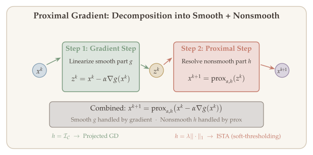
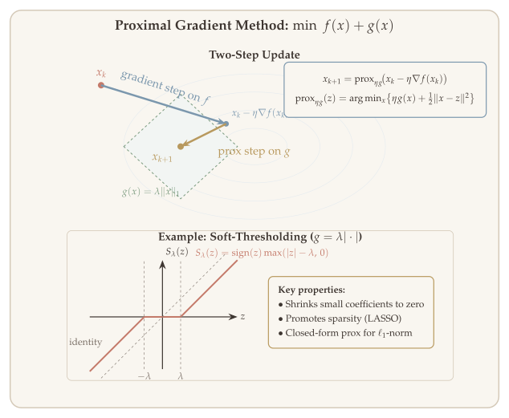
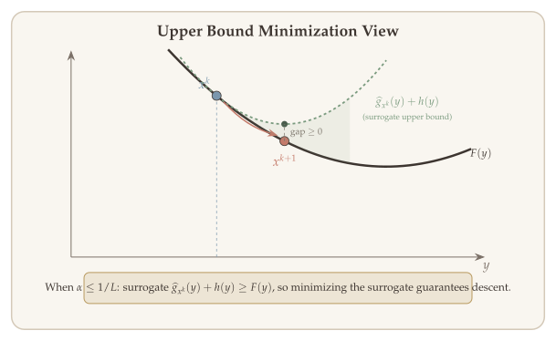
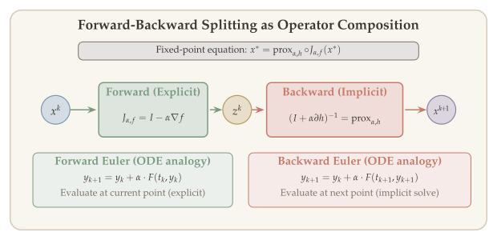

Many problems in modern optimization involve objectives that are the sum of a smooth function and a nonsmooth regularizer. The Lasso, for instance, minimizes $\|b - Ax\|_2^2 + \lambda\|x\|_1$: the least-squares term is smooth, but the $\ell_1$ penalty is not. Gradient descent cannot be applied directly because the $\ell_1$ term is nondifferentiable; subgradient methods can handle the nonsmoothness but sacrifice the fast convergence rates of gradient descent. Is there a way to get the best of both worlds?

**Proximal gradient methods** provide exactly this. The key idea is to split the objective into $f(x) = g(x) + h(x)$, where $g$ is smooth and $h$ is "simple" (meaning its proximal operator is easy to compute). At each step, we linearize $g$ and keep $h$ intact, solving a small optimization subproblem that often has a closed-form solution. This approach unifies projected gradient descent (where $h$ is an indicator function) and soft-thresholding algorithms (where $h$ is an $\ell_1$ penalty) into a single framework.

The beauty of the proximal gradient method is that it achieves the same convergence rates as gradient descent for smooth problems---even though the overall objective $f = g + h$ is nonsmooth. This [**"smoothness for free"**]{style="color: #C47A6A; font-weight: bold;"} property is the central insight of this lecture.

::: {.callout-tip}
## Companion Notebook

 A companion notebook accompanies this chapter with runnable Python implementations of proximal gradient (ISTA/FISTA) implementations, soft-thresholding for Lasso, and convergence comparisons with subgradient methods.
:::

## What Will Be Covered {#sec-overview}

1. Proximal mapping and proximal gradient algorithm
2. Closed-form examples of proximal operators
3. Proximal calculus rules (separability, scaling, composition)
4. Properties: optimality, non-expansiveness, Moreau decomposition
5. Convergence analysis for nonconvex, convex, and strongly convex cases
6. Forward-backward splitting and proximal point methods

## Constrained Setting: Recap {#sec-constrained-setting}

Consider the constrained optimization problem

$$\min_x \; g(x) \quad \text{s.t.} \quad x \in \mathcal{C},$$

where

- $g$ is convex and differentiable ($L$-smooth),
- $\mathcal{C} \subseteq \mathbb{R}^n$: closed convex set.

**Challenge:** Decrease function value while ensuring feasibility.

### Projected Gradient Descent {#sec-projected-gd}

The Euclidean projection onto $\mathcal{C}$ is

$$\mathbb{P}_{\mathcal{C}}(x) = \operatorname*{argmin}_{z \in \mathcal{C}} \|x - z\|_2^2.$$

For $k = 0, 1, \ldots$,

$$x^{k+1} = \mathbb{P}_{\mathcal{C}}\bigl(x^k - \alpha^k \nabla g(x^k)\bigr).$$

**Projected gradient is a special case of proximal gradient.** We can write $\min_{x \in \mathbb{R}^n} f(x) = g(x) + \mathcal{I}_{\mathcal{C}}(x)$, where

$$\mathcal{I}_{\mathcal{C}}(x) = \begin{cases} 0 & x \in \mathcal{C}, \\ \infty & x \notin \mathcal{C}. \end{cases}$$

In general, proximal gradient is able to handle problems of the form

$$\min_{x \in \mathbb{R}^n} f(x) = g(x) + h(x),$$

where

- $g$ is smooth,
- $h$ is possibly nonsmooth, but "simple".

::: {#exm-lasso}
## Lasso

$$f(x) = \|b - Ax\|_2^2 + \|x\|_1.$$
:::

We claim that projected gradient is a special case of proximal gradient, so the analysis of projected gradient should also be a special case.

Recall the theory of projected gradient: although $f(x) = g(x) + \mathcal{I}_{\mathcal{C}}(x)$ is **not smooth**, by incorporating projection, the theoretical properties are actually given by $g$.

- $\alpha = 1/L$, $L$ = smoothness of $g$.
- Convergence rates also depend on $g$: convex, nonconvex, or strongly convex.

We should expect the same thing for proximal gradient: using the proximal mapping, we get [**smoothness for free**]{style="color: #C47A6A; font-weight: bold;"}!

## Proximal Mapping and Proximal Gradient {#sec-prox-mapping}

The central concept of this chapter is the **proximal mapping** (or proximal operator), which generalizes the projection operator from @sec-projection-operator. While the projection $\mathbb{P}_C(x)$ finds the closest point to $x$ in a convex set $C$, the proximal mapping balances proximity to $x$ against minimizing a convex function $f$---it answers the question: "where should I move to reduce $f$ while staying close to $x$?"

::: {#def-proximal-mapping}
## Proximal Mapping

Given a convex function $f : \mathbb{R}^n \to \mathbb{R} \cup \{+\infty\}$ and a step size $\alpha > 0$, the **proximal mapping** of $f$ is defined by:

$$\operatorname{prox}_{\alpha, f}(x) = \operatorname*{argmin}_{y \in \mathbb{R}^n} \left\{ f(y) + \frac{1}{2\alpha} \|y - x\|_2^2 \right\}.$$

When $\alpha = 1$, we write $\operatorname{Prox}_f(x) = \operatorname{prox}_{1,f}(x)$.
:::

::: {.callout-tip}
## Remark: Notation

$\operatorname{prox}_{\alpha,f}(x) = \operatorname{prox}_{1,\alpha f}(x) = \operatorname{prox}_{\alpha f}(x)$.
:::

::: {#thm-prox-existence}
## Existence and Uniqueness

When $f$ is closed (lower semicontinuous) and convex, $\operatorname{prox}_{\alpha,f}(x)$ exists and is unique for all $x \in \mathbb{R}^n$ and $\alpha > 0$.
:::

This follows because the objective $f(u) + \frac{1}{2\alpha}\|u - x\|_2^2$ is the sum of a convex function and a strongly convex quadratic, hence **strongly convex** in $u$. Strong convexity guarantees a unique minimizer (by the same argument as @thm-projection-singleton for projections).

::: {#exm-projection-as-prox}
## Projection as Proximal Mapping {#sec-projection-as-prox}

The most important special case: when $h = I_C$ is the indicator function of a closed convex set $C$ (see @sec-ex-indicator), the proximal mapping reduces to the Euclidean projection. For any $\alpha > 0$:

$$\operatorname{prox}_{\alpha, I_C}(x) = \operatorname*{argmin}_{u \in \mathbb{R}^n} \left\{ I_C(u) + \frac{1}{2\alpha}\|u - x\|_2^2 \right\} = \operatorname*{argmin}_{u \in C} \|u - x\|_2^2 = \mathbb{P}_C(x).$$

The indicator forces $u \in C$, and the quadratic term finds the closest point. Note that the step size $\alpha$ does not affect the result---scaling the quadratic does not change its minimizer over $C$. This means **projected gradient descent is a special case of proximal gradient descent** with $h = I_C$.
:::

### Proximal Gradient Algorithm {#sec-prox-grad-algorithm}

With the proximal mapping defined, the **proximal gradient** algorithm for minimizing $F(x) = g(x) + h(x)$ (where $g$ is smooth and $h$ is convex but possibly nonsmooth) is a natural two-step process: take a gradient step on $g$, then apply the proximal operator of $h$:

$$x^{k+1} = \operatorname{prox}_{\alpha^k, h}\bigl(x^k - \alpha^k \nabla g(x^k)\bigr).$$

Compare with projected gradient descent: $x^{k+1} = \mathbb{P}_C(x^k - \alpha^k \nabla g(x^k))$. The only difference is replacing $\mathbb{P}_C$ with $\operatorname{prox}_h$.

### Interpretation {#sec-interpretation}

{#fig-proximal-decomposition}

{#fig-proximal-composite}

**Why does this work?** The idea is to approximate the smooth part $g$ by its Taylor expansion at $x$, while keeping the nonsmooth part $h$ exact. Define the surrogate function:

$$\widehat{g}_x(y) = g(x) + \langle \nabla g(x), y - x \rangle + \frac{1}{2\alpha}\|y - x\|_2^2.$$

Completing the square, this equals $g(x) + \frac{1}{2\alpha}\|y - (x - \alpha \nabla g(x))\|_2^2 + \text{const}$. Minimizing the composite surrogate $\widehat{g}_x(y) + h(y)$ gives exactly the proximal gradient update:

$$\operatorname*{argmin}_{y \in \mathbb{R}^n} \bigl\{ \widehat{g}_x(y) + h(y) \bigr\} = \operatorname{prox}_{\alpha, h}\bigl(x - \alpha \nabla g(x)\bigr).$$

In other words, proximal gradient replaces the smooth part $g$ with a quadratic upper bound (its Taylor model), keeps $h$ intact, and minimizes the resulting surrogate---a problem that decomposes cleanly via the proximal operator.

::: {.callout-tip}
## Remark: Upper Bound Minimization

If $\alpha \leq 1/L$, where $L$ is the smoothness of $g$, then we have $\widehat{g}_x(y) \geq g(y)$ for all $y$. Therefore

$$g(x) + \langle \nabla g(x), y - x \rangle + \frac{1}{2\alpha}\|y - x\|_2^2 + h(y) \geq f(y) \quad \forall y \in \mathbb{R}^n.$$

In this case, proximal gradient minimizes an **upper bound** of $f$.
:::

::: {.callout-tip}
## Remark: Implementation

The practical cost of proximal gradient depends on how efficiently we can evaluate $\operatorname{prox}_{\alpha,h}$. Functions whose proximal operators have closed-form solutions (like $\|x\|_1$, indicator functions, norms) are called **proximally simple**. For these, each proximal gradient step costs roughly the same as a gradient step. However, for general $h$, computing $\operatorname{prox}_h$ itself involves solving an optimization subproblem, which may be expensive. The art of proximal methods lies in choosing decompositions $F = g + h$ where $h$ is proximally simple.
:::

{#fig-upper-bound-view}

In the following sections, we first build intuition through concrete examples of proximal operators (@sec-examples), then develop systematic proximal calculus rules for computing $\operatorname{prox}_f$ for structured functions (@sec-prox-calculus), and finally study the theoretical properties that underpin the convergence analysis (@sec-properties).

## Examples {#sec-examples}

Before developing general calculus rules, we build intuition by computing proximal operators for several one-dimensional functions by hand. These examples reveal the core mechanism: the proximal operator balances minimizing $g$ against staying close to $x$, and the solution often takes a simple closed form.

### One-Dimensional Examples {#sec-1d-examples}

::: {#exm-1d-prox}
## One-Dimensional Proximal Operators

**1. Linear function on the half-line.** $g(x) = \begin{cases} \mu x & x \geq 0, \\ \infty & x < 0, \end{cases}$ where $\mu \in \mathbb{R}$.

$$\operatorname{prox}_g(x) = [x - \mu]_+ = \max\{0, x - \mu\} = \begin{cases} 0 & x \leq \mu, \\ x - \mu & x \geq \mu. \end{cases}$$

The proximal operator shifts $x$ by $\mu$ and clips at zero---it balances the linear penalty $\mu x$ against the quadratic proximity term.

**2. Absolute value (soft thresholding).** $g(x) = \lambda |x|$.

$$\operatorname{prox}_g(x) = [|x| - \lambda]_+ \cdot \operatorname{sign}(x) = \begin{cases} x - \lambda & x > \lambda, \\ 0 & x \in [-\lambda, \lambda], \\ x + \lambda & x < -\lambda. \end{cases}$$

The function $T_\lambda(x) = [|x| - \lambda]_+ \cdot \operatorname{sign}(x)$ is called the **soft-thresholding function**. It shrinks $x$ toward zero by $\lambda$, setting it exactly to zero when $|x| \leq \lambda$. This is the key operator behind $\ell_1$-regularized methods like Lasso.

**3. Log barrier.** $g(x) = \begin{cases} -\lambda \log x & x > 0, \\ \infty & x \leq 0, \end{cases}$ with $\lambda > 0$.

$$\operatorname{prox}_g(x) = \frac{x + \sqrt{x^2 + 4\lambda}}{2}.$$

This is obtained by solving the first-order condition $(u - x) - \lambda/u = 0$, which is a quadratic in $u$. The positive root gives the proximal operator. Note that the result is always positive, as required by the domain of $g$.

**4. Box constraint indicator.** $g(x) = \delta_{[0,\eta]}(x)$, where $0 \leq \eta \leq \infty$.

$$\operatorname{prox}_g(x) = \min\bigl\{\max\{x, 0\}, \eta\bigr\} = \begin{cases} 0 & x \leq 0, \\ x & 0 \leq x \leq \eta, \\ \eta & x \geq \eta. \end{cases}$$

When $g$ is an indicator function, the proximal operator reduces to **projection** onto the constraint set---here, clipping $x$ to the interval $[0, \eta]$.
:::

![Proximal operator of $g(x) = \mu x$ on $x \geq 0$: the function $[x - \mu]_+$ clips negative values to zero.](figures/ch07-soft-threshold-1.svg){#fig-soft-threshold-1}

![Soft-thresholding operator $T_\lambda(x) = \operatorname{sign}(x)\max(|x|-\lambda, 0)$: the identity shrunk toward zero with a dead zone $[-\lambda, \lambda]$.](figures/ch07-soft-threshold-2.svg){#fig-soft-threshold-2}

![Projection onto $[0, \eta]$: the piecewise-linear clipping function $\min\{\max\{x, 0\}, \eta\}$ with $\eta = 2$.](figures/ch07-box-constraint.svg){#fig-box-constraint}

### Proof of Examples 1 and 2 {#sec-proof-1d-examples}

::: {.proof}
The calculation uses two simple observations about minimizing piecewise-smooth convex functions on $\mathbb{R}$:

**(i)** If $f'(u) = 0$ at a point where $f$ is differentiable, then $u$ is a global minimizer (by convexity).

**(ii)** If no differentiable point satisfies $f'(u) = 0$, then the minimizer must occur at a non-differentiable point (a "kink").

**Example 1.** We minimize $f(u) = g(u) + \frac{1}{2}(u - x)^2$ over $u \in \mathbb{R}$. On the domain $u \geq 0$, this becomes $f(u) = \frac{1}{2}(u-x)^2 + \mu u$, a smooth quadratic with unconstrained minimizer at $u^* = x - \mu$ (from $f'(u) = u - x + \mu = 0$).

- If $x \geq \mu$, then $u^* = x - \mu \geq 0$ lies in the domain, so $\operatorname{prox}_g(x) = x - \mu$.
- If $x < \mu$, then $u^* = x - \mu < 0$ falls outside the domain. On $[0, \infty)$, the derivative $f'(u) = u - x + \mu > 0$ for all $u \geq 0$ (since $x < \mu$), so $f$ is increasing. The minimum over $[0, \infty)$ is at the boundary: $\operatorname{prox}_g(x) = 0$.

**Example 2.** We minimize $f(u) = \lambda |u| + \frac{1}{2}(u-x)^2$. Since $|u|$ is piecewise linear, we split into two smooth pieces:

$$f(u) = \begin{cases} h_1(u) = \lambda u + \frac{1}{2}(u-x)^2 & u \geq 0, \\ h_2(u) = -\lambda u + \frac{1}{2}(u-x)^2 & u < 0. \end{cases}$$

- On $u \geq 0$: $h_1'(u) = u - x + \lambda = 0$ gives $u^* = x - \lambda$. This is valid (in $[0, \infty)$) only when $x \geq \lambda$, giving $\operatorname{prox}_g(x) = x - \lambda$.
- On $u < 0$: $h_2'(u) = u - x - \lambda = 0$ gives $u^* = x + \lambda$. This is valid (in $(-\infty, 0)$) only when $x \leq -\lambda$, giving $\operatorname{prox}_g(x) = x + \lambda$.
- If $|x| < \lambda$: neither smooth piece has a valid interior minimizer. By observation **(ii)**, the minimum is at the kink $u = 0$, so $\operatorname{prox}_g(x) = 0$.

Combining all three cases yields the soft-thresholding formula. $\blacksquare$
:::

## Proximal Calculus Rules {#sec-prox-calculus}

Just as the subgradient calculus (@sec-calculus) provides rules for computing subdifferentials of composed functions, **proximal calculus** provides rules for computing proximal operators of structured functions. These rules allow us to reduce the proximal operator of a complex function to simpler, known proximal operators.

### Rule 1: Separable Functions {#sec-separable}

The simplest and most frequently used rule: if $f$ decomposes as a sum of functions acting on separate coordinates, the proximal operator decomposes coordinate-wise.

Suppose $f(x_1, \ldots, x_m) = f_1(x_1) + f_2(x_2) + \cdots + f_m(x_m)$. Then

$$\operatorname{prox}_f(x_1, \ldots, x_m) = \begin{pmatrix} \operatorname{prox}_{f_1}(x_1) \\ \vdots \\ \operatorname{prox}_{f_m}(x_m) \end{pmatrix}.$$

To see why, the minimization in the proximal operator separates into independent subproblems:

$$\min_{y = (y_1,\ldots,y_m)} \left\{ f(y_1,\ldots,y_m) + \frac{1}{2\alpha}\|y - x\|_2^2 \right\} = \min_{y_1,\ldots,y_m} \left\{ \sum_{i=1}^m \left[ f_i(y_i) + \frac{1}{2\alpha}\|y_i - x_i\|_2^2 \right] \right\} = \sum_{i=1}^m \min_{y_i} \left\{ f_i(y_i) + \frac{1}{2\alpha}\|y_i - x_i\|_2^2 \right\}.$$

Since each term depends only on $y_i$, the argmin decomposes component-wise:

$$\operatorname{argmin} = \bigl(\operatorname{prox}_{\alpha, f_1}(x_1), \ldots, \operatorname{prox}_{\alpha, f_m}(x_m)\bigr)^\top.$$

The most important application of this rule is the $\ell_1$-norm, which decomposes into a sum of absolute values.

::: {#exm-l1-prox}
## $\ell_1$-Norm Proximal Operator

Let $g(x) = \lambda \|x\|_1 = \sum_i \lambda |x_i|$. By the separability rule, we compute each coordinate independently. Each component $\varphi(t) = \lambda |t|$ has

$$\operatorname{prox}_\varphi(t) = \operatorname*{argmin}_u \left\{ \frac{1}{2}(u-t)^2 + \lambda |u| \right\} = \begin{cases} t - \lambda & t \geq \lambda, \\ 0 & |t| \leq \lambda, \\ t + \lambda & t \leq -\lambda. \end{cases}$$

Therefore $\operatorname{prox}_g(x) = \bigl(T_\lambda(x_i)\bigr)_{i=1}^n = T_\lambda(x)$.
:::

::: {#def-soft-threshold}
## Soft-Thresholding Function

For $x \in \mathbb{R}^n$, the soft-thresholding function $T_\lambda : \mathbb{R}^n \to \mathbb{R}^n$ is defined by

$$T_\lambda(x) = \begin{pmatrix} T_\lambda(x_1) \\ \vdots \\ T_\lambda(x_n) \end{pmatrix}, \quad T_\lambda(t) = \begin{cases} t - \lambda & t \geq \lambda, \\ 0 & |t| \leq \lambda, \\ t + \lambda & t \leq -\lambda, \end{cases}$$

which can be written compactly as $T_\lambda(x) = [x - \lambda \mathbf{1}]_+ \odot \operatorname{sign}(x)$, where $\odot$ denotes elementwise product.
:::

### Rule 2: Scaling and Translation {#sec-scaling-translation}

These rules handle affine changes of variable inside the proximal operator.

**Part 1.** $f(x) = g(\lambda x + a)$, with $\lambda \neq 0$, $a \in \mathbb{R}^n$.

$$\operatorname{prox}_f(x) = \frac{1}{\lambda}\bigl(\operatorname{prox}_{\lambda^2, g}(\lambda x + a) - a\bigr).$$

**Part 2.** $f(x) = \lambda \cdot g(x/\lambda)$, with $\lambda \neq 0$.

$$\operatorname{prox}_f(x) = \lambda \operatorname{prox}_{1/\lambda, g}(x/\lambda).$$

::: {.proof}
**Part 1.** $\operatorname{prox}_f(x) = \operatorname*{argmin}_u \{f(u) + \frac{1}{2}\|u - x\|_2^2\} = \operatorname*{argmin}_u \{g(\lambda u + a) + \frac{1}{2}\|u - x\|_2^2\}$.

Let $z = \lambda u + a$, so $u = (z - a)/\lambda$. Then

$$\min_u \left\{ g(\lambda u + a) + \frac{1}{2}\|u - x\|_2^2 \right\} = \min_z \left\{ g(z) + \frac{1}{2\lambda^2}\|z - a - \lambda x\|_2^2 \right\}.$$

The argmin of the RHS is attained at $\operatorname{prox}_{\lambda^2, g}(\lambda x + a)$. The argmin of the LHS is $\frac{1}{\lambda}\bigl(\operatorname{prox}_{\lambda^2, g}(\lambda x + a) - a\bigr)$.

**Part 2.** $\operatorname{prox}_f(x) = \operatorname*{argmin}_u \{\lambda \cdot g(u/\lambda) + \frac{1}{2}\|u - x\|_2^2\}$.

Let $z = u/\lambda$, so $u = \lambda z$. Then

$$= \lambda \cdot \operatorname*{argmin}_z \left\{ g(z) + \frac{1}{2\lambda}\|z - x/\lambda\|_2^2 \right\} = \lambda \cdot \operatorname{prox}_{1/\lambda, g}(x/\lambda). \quad \blacksquare$$
:::

### Rule 3: Adding a Quadratic Function {#sec-add-quadratic}

When a quadratic $\frac{c}{2}\|x\|_2^2$ or linear $a^\top x$ term is added to $g$, the proximal operator absorbs these terms by adjusting the step size and shifting the input.

Let $f(x) = g(x) + \frac{c}{2}\|x\|_2^2 + a^\top x$ with $c > 0$. Then

$$\operatorname{prox}_f(x) = \operatorname{prox}_{c+1, g}\left(\frac{x - a}{c + 1}\right).$$

The idea is that the quadratic $\frac{c}{2}\|x\|_2^2$ merges with the proximity term $\frac{1}{2}\|x - y\|_2^2$, producing a single quadratic with rescaled coefficient. The proof is a direct change of variables (exercise).

**Special case:** When $c = 0$, so $f(x) = g(x) + a^\top x$, adding a linear term simply shifts the input: $\operatorname{prox}_f(x) = \operatorname{prox}_g(x - a)$.

::: {#exm-half-line}
## Half-Line Indicator Plus Linear

$f(x) = \begin{cases} \mu x & 0 \leq x \leq a, \\ \infty & \text{o/w}, \end{cases}$ where $a \in [0, \infty]$, $\mu \in \mathbb{R}$.

We have $f(x) = \mu x + \delta_{[0,a]}(x)$, where $g(x) = \delta_{[0,a]}(x)$.

We have shown that $\operatorname{prox}_g(x) = \min\{\max\{x, 0\}, a\}$.

Therefore $\operatorname{prox}_f(x) = \operatorname{prox}_g(x - \mu) = \min\{\max\{x - \mu, 0\}, a\}$.
:::

### Rule 4: Composition with Linear Function {#sec-composition-linear}

Unlike the subgradient calculus, there is **no general proximal rule** for composing with an arbitrary linear transformation $A$. The reason is that the proximal operator involves a quadratic term $\|u - x\|_2^2$, which does not simplify under a general change of variables $u = Av$. However, when the linear map preserves (or uniformly scales) distances, the rule does exist.

**Orthogonal matrices.** Let $Q \in \mathbb{R}^{n \times n}$ be orthogonal ($QQ^\top = Q^\top Q = I_n$) and $f(x) = g(Qx)$. Then

$$\operatorname{prox}_f(x) = Q^\top \operatorname{prox}_g(Qx).$$

**Scaled partial orthogonality.** More generally, let $Q \in \mathbb{R}^{m \times n}$ with $m \leq n$ satisfy $QQ^\top = \alpha^{-1} I_m$ (note: we do not require $Q^\top Q = \alpha^{-1} I_n$, so $Q$ need not have orthonormal rows in the square sense). Let $g : \mathbb{R}^m \to \mathbb{R}$ be convex and $f(x) = g(Qx + b)$. Then

$$\operatorname{prox}_f(x) = (I - \alpha Q^\top Q)x + \alpha \bigl(Q^\top \operatorname{prox}_{\alpha, g}(Qx + b) - b\bigr).$$

See Theorem 6.15 in [[Beck]](https://doi.org/10.1137/1.9781611974997) for proof.

::: {#exm-sum-composition}
## Composition with Sum

A common case is $f(x) = g(x_1 + x_2 + \cdots + x_n)$, where $g : \mathbb{R} \to \mathbb{R}$ acts on the sum of coordinates. Here $Q = (1, 1, \ldots, 1) \in \mathbb{R}^{1 \times n}$ with $m = 1$, so $QQ^\top = n$ and $\alpha = 1/n$.

$$Q^\top Q = \begin{pmatrix} 1 & \cdots & 1 \\ \vdots & \ddots & \vdots \\ 1 & \cdots & 1 \end{pmatrix} \quad \text{(all-ones matrix)}.$$

Therefore

$$\bigl(\operatorname{prox}_f(x)\bigr)_j = x_j - \frac{1}{n}\Bigl(\sum_{i=1}^n x_i\Bigr) + \frac{1}{n}\operatorname{prox}_{n, g}\Bigl(\sum_{i=1}^n x_i\Bigr).$$
:::

::: {#exm-linear-form}
## Composition with Linear Form

Another common case is $f(x) = g(a^\top x)$ for a fixed vector $a \in \mathbb{R}^n$. Here $Q = a^\top \in \mathbb{R}^{1 \times n}$, so $QQ^\top = \|a\|_2^2$ and $\alpha = 1/\|a\|_2^2$.

$QQ^\top = \|a\|_2^2 = \alpha^{-1}$. Then

$$\operatorname{prox}_f(x) = \left(I - \frac{1}{\|a\|_2^2} a a^\top\right)x + \frac{1}{\|a\|_2^2} \cdot \operatorname{prox}_{\|a\|_2^2, g}(a^\top x).$$
:::

### Rule 5: Norm Composition {#sec-norm-composition}

When $f$ depends on $x$ only through its Euclidean norm $\|x\|_2$, the proximal operator preserves the direction of $x$ and only adjusts its magnitude. This reduces the $n$-dimensional problem to a one-dimensional one.

Let $g : \mathbb{R} \to \mathbb{R}$ be convex with $\operatorname{dom}(g) \subseteq [0, \infty)$, and let $f(x) = g(\|x\|_2)$. Then

$$\operatorname{prox}_f(x) = \begin{cases} \operatorname{prox}_g(\|x\|_2) \cdot \dfrac{x}{\|x\|_2} & x \neq 0, \\[6pt] \{u \in \mathbb{R}^n \mid \|u\|_2 = \operatorname{prox}_g(0)\} & x = 0. \end{cases}$$

::: {.proof}
**Case 1: $x = 0$.** $\operatorname{prox}_f(0) = \operatorname*{argmin}_{u \in \mathbb{R}^n}\{g(\|u\|_2) + \frac{1}{2}\|u\|_2^2\} = \{u : \|u\|_2 \in \operatorname*{argmin}_{t \in \mathbb{R}}\{g(t) + \frac{1}{2}t^2\}\} = \{u : \|u\|_2 = \operatorname{prox}_g(0)\}$.

**Case 2: $x \neq 0$.**

$$\min_u \left\{ g(\|u\|) + \frac{1}{2}\|u\|^2 - u^\top x + \frac{1}{2}\|x\|^2 \right\} = \min_{\alpha \geq 0} \min_{u : \|u\| = \alpha} \left\{ g(\alpha) + \frac{1}{2}\alpha^2 - u^\top x + \frac{1}{2}\|x\|^2 \right\}.$$

Fix $\alpha$. The optimal $u^* = \alpha \cdot \frac{x}{\|x\|}$, so

$$= \min_\alpha \left\{ g(\alpha) + \frac{1}{2}(\alpha - \|x\|_2)^2 \right\}.$$

Therefore $\operatorname{prox}_f(x) = \alpha^* \cdot \frac{x}{\|x\|_2}$, where $\alpha^* \in \operatorname*{argmin}_\alpha \{g(\alpha) + \frac{1}{2}(\alpha - \|x\|_2)^2\} = \operatorname{prox}_g(\|x\|_2)$.

Hence $\operatorname{prox}_f(x) = \operatorname{prox}_g(\|x\|_2) \cdot \frac{x}{\|x\|_2}$. $\blacksquare$
:::

::: {#exm-l2-prox}
## $\ell_2$-Norm Proximal Operator

As a key application, consider $f(x) = \lambda \|x\|_2$ (used in group Lasso). Write $f(x) = g(\|x\|_2)$ where $g(t) = \begin{cases} \lambda t & t \geq 0, \\ \infty & t < 0. \end{cases}$

From Example 1 (half-line linear), $\operatorname{prox}_g(t) = [t - \lambda]_+ = \max\{t - \lambda, 0\}$. Applying Rule 5:

$$\operatorname{prox}_f(x) = \begin{cases} [\|x\|_2 - \lambda]_+ \cdot \dfrac{x}{\|x\|_2} & x \neq 0, \\[6pt] 0 & x = 0, \end{cases} = \left(1 - \frac{\lambda}{\max\{\|x\|, \lambda\}}\right) \cdot x.$$
:::

## Projection as Proximal Operator {#sec-projection-as-prox}

The connection between proximal operators and projections is fundamental. When $g = I_C$ is the indicator function of a closed convex set $C$ (as in @sec-ex-indicator), the proximal operator reduces to the Euclidean projection:

$$\operatorname{prox}_{I_C}(x) = \operatorname*{argmin}_{u \in C} \|x - u\|_2^2 = \mathbb{P}_C(x).$$

This means projected gradient descent is a special case of proximal gradient descent with $g = I_C$. We have already seen several projection examples in @sec-proj-characterization; below we derive two more that are particularly important in machine learning applications.

::: {#lem-projection-subsets-recap}
## Projection onto Subsets of $\mathbb{R}^n$ (Recap)

We recall the key projection formulas from @lem-projection-subsets (Chapter 6) for reference.

- **Nonnegative orthant:** $\mathcal{C} = \mathbb{R}_+^n = \{x : x_i \geq 0\}$.

$$\mathbb{P}_{\mathcal{C}}(x) = [x]_+ = \bigl(\max\{x_i, 0\}\bigr)_{i=1}^n.$$

- **Box:** $\mathcal{C} = \operatorname{Box}[l, u] = \{x : l_i \leq x_i \leq u_i\}$.

$$\mathbb{P}_{\mathcal{C}}(x) = \bigl(\min\{\max\{x_i, l_i\}, u_i\}\bigr)_{i=1}^n.$$

- **Affine set:** $\{x : Ax = b\}$, $AA^\top$ invertible.

$$\mathbb{P}_{\mathcal{C}}(x) = x - A^\top (AA^\top)^{-1}(Ax - b).$$

- **$\ell_2$-ball:** $\{x : \|x - c\|_2 \leq r\}$.

$$\mathbb{P}_{\mathcal{C}}(x) = c + \frac{r}{\max\{\|x - c\|_2, r\}}(x - c).$$

For example, $c = 0$, $r = 1$: $\mathbb{P}_{\mathcal{C}}(x) = \frac{1}{\max\{1, \|x\|\}} \cdot x$.

- **Half space:** $\{x : a^\top x \leq \alpha\}$.

$$\mathbb{P}_{\mathcal{C}}(x) = x - \frac{[a^\top x - \alpha]_+}{\|a\|_2^2} \cdot a.$$
:::

![Box projection onto $[l, u] = [-1, 2]$: values below $l$ are clipped to $l$ and values above $u$ are clipped to $u$.](figures/ch07-box-proj.svg){#fig-box-proj}

### Projection onto the Probability Simplex {#sec-simplex-projection}

::: {#lem-simplex-projection}
## Projection onto the Probability Simplex

Let $\Delta_n = \{x \in \mathbb{R}^n \mid x_i \geq 0 \;\forall i \in [n],\; \sum_{i=1}^n x_i = 1\}$. Then

$$\mathbb{P}_{\Delta_n}(x) = [x - \mu^* \mathbf{1}]_+,$$

where $\mu^*$ solves the equation $\mathbf{1}^\top [x - \mu^* \mathbf{1}]_+ = 1$.
:::

::: {.proof}
$\mathbb{P}_{\Delta_n}(x)$ is the solution to $\min_y \{\frac{1}{2}\|y - x\|_2^2 : \mathbf{1}^\top y = 1, \; y \geq 0\}$.

For this optimization problem, strong duality holds. The Lagrangian is

$$\mathcal{L}(y, \lambda, \mu) = \frac{1}{2}\|y - x\|_2^2 + \mu \cdot (\mathbf{1}^\top y - 1) - \lambda^\top y.$$

Thus the solution $y^*$ satisfies the KKT conditions together with $\lambda^*, \mu^*$:

**(i)** $y^* \geq 0$, $\mathbf{1}^\top y^* = 1$.

**(ii)** $\lambda^* \geq 0$.

**(iii)** $\langle \lambda^*, y^* \rangle = 0$.

**(iv)** $y^* = x - \mu^* + \lambda^*$.

From (iii): if $y_i^* > 0$, then $\lambda_i^* = 0$, so by (iv) $y_i^* = x_i - \mu^*$. If $y_i^* = 0$, then $\lambda_i^* \geq 0$ implies $x_i - \mu^* \leq y_i^* = 0$.

Therefore $y = [x - \mu^* \mathbf{1}]_+$.

To determine $\mu^*$: we need $\sum_{i=1}^n \max\{x_i - \mu^*, 0\} = 1$. $\blacksquare$
:::

### Projection onto the $\ell_1$-Ball {#sec-l1-ball-projection}

::: {#lem-l1-ball-projection}
## Projection onto the $\ell_1$-Ball

Let $\mathcal{C} = \{x : \|x\|_1 \leq \alpha\}$. Then

$$\mathbb{P}_{\mathcal{C}}(x) = \begin{cases} x & \text{if } \|x\|_1 \leq \alpha, \\ T_{\lambda^*}(x) & \text{if } \|x\|_1 > \alpha, \end{cases}$$

where $\lambda^*$ is any solution to the equation $\varphi(\lambda) = \|T_\lambda(x)\|_1 - \alpha = 0$.
:::

To prove this lemma, we prove a more general result.

::: {#thm-level-set-projection}
## Projection onto Level Sets

Let $\mathcal{C} = \{x : f(x) \leq \alpha\}$, where $f$ is closed and convex, $\alpha \in \mathbb{R}$. Let $\operatorname{dom}(f) = \mathbb{R}^n$. Assume there exists $\widehat{x}$ in the interior of $\operatorname{dom}(f)$ such that $f(\widehat{x}) \leq \alpha$. Then

$$\mathbb{P}_{\mathcal{C}}(x) = \begin{cases} x & \text{if } f(x) \leq \alpha, \\ \operatorname{prox}_{\lambda^*,f}(x) & \text{otherwise}, \end{cases}$$

where $\lambda^*$ is any root of the equation $f(\operatorname{prox}_{\lambda^*,f}(x)) - \alpha = 0$.
:::

::: {.proof}
Consider the following problem:

$$(P) \quad \min \left\{ \frac{1}{2}\|y - x\|_2^2 \;\text{s.t.}\; f(y) \leq \alpha, \; y \in \mathbb{R}^n \right\}.$$

Since $(P)$ satisfies Slater's condition, KKT condition is sufficient and necessary for optimality.

Lagrangian: $\mathcal{L}(y, \lambda) = \frac{1}{2}\|y - x\|_2^2 + \lambda(f(y) - \alpha)$.

$y^*$ is optimal for $(P)$ if and only if there exists $\lambda^*$ such that:

**(i)** $f(y^*) \leq \alpha$.

**(ii)** $\lambda^* \geq 0$.

**(iii)** $\lambda^*(f(y^*) - \alpha) = 0$.

**(iv)** $y^* \in \operatorname*{argmin}_y \mathcal{L}(y, \lambda^*)$. $\quad$ (\*)

There are two cases:

**(a)** $f(x) \leq \alpha$: then $y^* = x$, $\lambda^* = 0$ satisfies KKT.

**(b)** $f(x) > \alpha$: then $\lambda^* > 0$ (because otherwise $(\lambda^* = 0, y^* = x)$ satisfies KKT **(iv)**, but violates KKT **(i)**). With $\lambda^* > 0$, condition **(iv)** means $y^* = \operatorname{prox}_{\lambda^*,f}(x)$.

To determine $\lambda^*$, we use KKT **(iii)**: $f(\operatorname{prox}_{\lambda^*,f}(x)) - \alpha = 0$. $\blacksquare$
:::

We then apply this theorem with $f(x) = \lambda\|x\|_1$, so $\operatorname{prox}_{\lambda,f}(x) = T_\lambda(x)$.

::: {#exm-halfspace-box}
## Half-Space $\cap$ Box

$\mathcal{C} = \{x : a^\top x \leq b, \; l \leq x \leq u\}$ where $a \in \mathbb{R}^n$, $a \neq 0$, $l, u \in \mathbb{R}^n$.

Then $\mathcal{C} = \{x : f(x) \leq b\}$, where $f(x) = a^\top x + \mathcal{I}_{[l,u]}(x)$.

$\operatorname{prox}_{\lambda,f}(x) = \operatorname{prox}_{\mathcal{I}_{[l,u]} + \lambda a^\top(\cdot)}(x) = \mathbb{P}_{[l,u]}(x - \lambda a)$ (adding a linear function).

Thus

$$\mathbb{P}_{\mathcal{C}}(x) = \begin{cases} x & \text{if } f(x) \leq b \text{ (i.e., } a^\top x \leq b,\; x \in [l,u]\text{)}, \\ \mathbb{P}_{[l,u]}(x - \lambda^* a) & \text{otherwise}, \end{cases}$$

where $\lambda^*$ is the solution to $a^\top \mathbb{P}_{[l,u]}(x - \lambda a) = b$. $\blacksquare$
:::

## Properties of Proximal Operator {#sec-properties}

Before analyzing the convergence of proximal gradient descent, we establish three key properties of the proximal operator that parallel the properties of projection developed in @sec-proj-characterization: an optimality characterization, non-expansiveness, and the Moreau decomposition. These properties are not just theoretical---they are the building blocks used directly in the convergence proofs of @sec-analysis.

### Optimality of Proximal Operator {#sec-optimality}

The first property generalizes the projection characterization (@lem-projection-characterization): just as $u = \mathbb{P}_C(x)$ is characterized by $\langle x - u, y - u \rangle \leq 0$ for all $y \in C$, the proximal operator has an analogous variational inequality.

::: {#thm-prox-optimality}
## Optimality of $\operatorname{prox}_f$

Let $f : \mathbb{R}^n \to (-\infty, +\infty]$ be a convex function. For any $x, u \in \mathbb{R}^n$, the following are equivalent:

**(a)** $u = \operatorname{prox}_f(x)$.

**(b)** $x - u \in \partial f(u)$, i.e., $u = (I + \partial f)^{-1}(x)$.

**(c)** $\langle x - u, y - u \rangle \leq f(y) - f(u) \quad \forall y \in \mathbb{R}^n$.
:::

::: {.callout-tip}
## Corollary

**(a)** $x^*$ is a minimizer of $f$ if and only if $x^* = \operatorname{prox}_f(x^*)$ (the minimizer is a **fixed point** of the proximal operator).

**(b)** Set $f(x) = I_C(x)$. Then $u = \mathbb{P}_C(x)$ if and only if $\langle x - u, y - u \rangle \leq 0$ for all $y \in C$, recovering the projection characterization (@lem-projection-characterization).
:::

::: {.proof}
**Proof of Corollary.**

**(a)** $x^* \in \operatorname{argmin}_x f(x) \iff 0 \in \partial f(x^*)$. By part **(b)** of the theorem, this is equivalent to $x^* - x^* = 0 \in \partial f(x^*)$, which holds iff $x^* = \operatorname{prox}_f(x^*)$.

**(b)** Setting $f = I_C$: $u = \mathbb{P}_C(x) \iff u = \operatorname{prox}_f(x)$. By **(a)** $\Leftrightarrow$ **(c)** of the theorem: $\langle x - u, y - u \rangle \leq f(y) - f(u) = I_C(y) - 0$ for all $y$. For $y \notin C$, $I_C(y) = +\infty$ and the inequality holds automatically. For $y \in C$, $I_C(y) = 0$, giving $\langle x - u, y - u \rangle \leq 0$ for all $y \in C$. $\blacksquare$
:::

::: {.proof}
**Proof of @thm-prox-optimality.**

**(a) $\Leftrightarrow$ (b).** By definition, $u = \operatorname{prox}_f(x)$ means $u$ minimizes $\varphi(y) = f(y) + \frac{1}{2}\|y - x\|_2^2$. Since $\varphi$ is strongly convex, this is equivalent to the first-order optimality condition:

$$0 \in \partial \varphi(u) = \partial f(u) + (u - x) \quad \iff \quad x - u \in \partial f(u).$$

**(b) $\Leftrightarrow$ (c).** If $x - u \in \partial f(u)$, then by the definition of subgradient:

$$f(y) \geq f(u) + \langle x - u, y - u \rangle \quad \forall y,$$

which rearranges to $\langle x - u, y - u \rangle \leq f(y) - f(u)$. Conversely, this inequality for all $y$ is exactly the definition of $x - u \in \partial f(u)$. $\blacksquare$
:::

### Non-Expansiveness {#sec-non-expansiveness}

The second property generalizes the non-expansiveness of projection (@lem-nonexpansive). This property is essential for the convergence analysis: it ensures that applying the proximal operator does not amplify errors, which controls the distance to the optimum across iterations.

::: {#thm-non-expansiveness}
## Non-Expansiveness

The proximal operator of any convex function is non-expansive, generalizing the non-expansiveness of projection (@lem-nonexpansive).

For any $x, y \in \mathbb{R}^n$, we have

**(a)** (Firm non-expansiveness) $\langle x - y, \operatorname{prox}_f(x) - \operatorname{prox}_f(y) \rangle \geq \|\operatorname{prox}_f(x) - \operatorname{prox}_f(y)\|_2^2$.

**(b)** (Non-expansiveness) $\|\operatorname{prox}_f(x) - \operatorname{prox}_f(y)\|_2 \leq \|x - y\|_2$.
:::

::: {.proof}
Let $u = \operatorname{prox}_f(x)$ and $v = \operatorname{prox}_f(y)$. By the optimality characterization (@thm-prox-optimality, part (ii)), we have $x - u \in \partial f(u)$ and $y - v \in \partial f(v)$.

Now apply the subgradient inequality twice---once using $x - u$ as a subgradient at $u$, and once using $y - v$ as a subgradient at $v$:

$$f(v) \geq f(u) + \langle x - u, v - u \rangle, \qquad \text{(I: subgradient at $u$ applied to $v$)}$$
$$f(u) \geq f(v) + \langle y - v, u - v \rangle. \qquad \text{(II: subgradient at $v$ applied to $u$)}$$

Adding (I) and (II), the $f(u)$ and $f(v)$ terms cancel:

$$0 \geq \langle x - u, v - u \rangle + \langle y - v, u - v \rangle = \langle (x - y) - (u - v), v - u \rangle.$$

Rearranging: $\langle u - v, x - y \rangle \geq \|u - v\|_2^2$, which proves **(a)** (firm non-expansiveness).

For **(b)**, apply Cauchy--Schwarz to the firm non-expansiveness: $\|u - v\|_2^2 \leq \langle u - v, x - y \rangle \leq \|u - v\|_2 \|x - y\|_2$. Dividing by $\|u - v\|_2$ (when nonzero) gives $\|u - v\|_2 \leq \|x - y\|_2$. $\blacksquare$
:::

### Moreau Decomposition {#sec-moreau}

The third property is a remarkable identity that relates the proximal operator of a function $f$ to that of its **convex conjugate** $f^*(y) = \sup_x \{y^\top x - f(x)\}$. This decomposition is practically valuable: if computing $\operatorname{prox}_f$ is difficult but $\operatorname{prox}_{f^*}$ is easy (or vice versa), the Moreau decomposition lets us compute one from the other. This arises frequently because many important regularizers (like norms) have conjugates that are indicator functions (or vice versa), and projection is often simpler than the proximal operator.

::: {#thm-moreau}
## Moreau Decomposition

Let $f$ be a closed convex function with conjugate $f^*$. For any $x \in \mathbb{R}^n$:

$$\operatorname{prox}_f(x) + \operatorname{prox}_{f^*}(x) = x.$$

More generally, for $\lambda > 0$:

$$\operatorname{prox}_{\lambda, f}(x) + \lambda \operatorname{prox}_{\lambda^{-1}, f^*}(x/\lambda) = x.$$
:::

::: {.proof}
We prove the $\lambda = 1$ case; the general case follows by rescaling.

Let $u = \operatorname{prox}_f(x)$ and set $v = x - u$. We need to show that $v = \operatorname{prox}_{f^*}(x)$.

**Step 1.** By the optimality characterization (@thm-prox-optimality, part (ii)), $u = \operatorname{prox}_f(x)$ implies $x - u \in \partial f(u)$, i.e., $v \in \partial f(u)$.

**Step 2.** Recall the conjugate subgradient identity: $v \in \partial f(u)$ if and only if $u \in \partial f^*(v)$. (This follows from the Fenchel--Young equality: $f(u) + f^*(v) = \langle u, v \rangle$ holds iff $v \in \partial f(u)$ iff $u \in \partial f^*(v)$.)

**Step 3.** So $u \in \partial f^*(v)$, which means $x - v \in \partial f^*(v)$. By @thm-prox-optimality (ii) applied to $f^*$, this is equivalent to $v = \operatorname{prox}_{f^*}(x)$.

Therefore $u + v = \operatorname{prox}_f(x) + \operatorname{prox}_{f^*}(x) = x$. $\blacksquare$
:::

::: {#exm-moreau-indicator}
## Moreau Decomposition: Indicator Function

The most important application: set $f = I_C$ (indicator of a closed convex set $C$). The conjugate is the **support function** $f^*(y) = S_C(y) = \sup_{x \in C} y^\top x$. Since $\operatorname{prox}_{I_C}(x) = \mathbb{P}_C(x)$, the Moreau decomposition gives:

$$\operatorname{prox}_{\lambda, S_C}(x) = x - \lambda \mathbb{P}_C(x/\lambda).$$

This is powerful: computing the proximal operator of the support function reduces to a projection, which is often much easier.
:::

**Concrete applications.** The support function formula lets us handle norms and max-functions via projection:

- **$\ell_\infty$-norm:** $\|\cdot\|_\infty = S_C(\cdot)$ where $C = \{x : \|x\|_1 \leq 1\}$ (the $\ell_1$-ball). So $\operatorname{prox}_{\lambda\|\cdot\|_\infty}(x) = x - \lambda \mathbb{P}_C(x/\lambda)$---the proximal operator of the $\ell_\infty$-norm reduces to projecting onto the $\ell_1$-ball.

- $g(x) = \max\{x_1, \ldots, x_n\} = S_{\Delta_n}(x)$. So $\operatorname{prox}_{\lambda \cdot \max(\cdot)}(x) = x - \lambda \cdot \mathbb{P}_{\Delta_n}(x/\lambda)$.

## Proximal Gradient Descent: Analysis {#sec-analysis}

### Setup {#sec-analysis-setup}

The convergence analysis of proximal gradient descent closely parallels the analysis of projected gradient descent in @sec-proj-gd-convergence. This is not a coincidence: projected GD is the special case $h = I_C$, and the proximal operator generalizes the projection. At each step below, we will highlight the correspondence with the projected GD analysis.

We analyze the proximal gradient iteration for minimizing $F(x) = f(x) + h(x)$:

$$x^{k+1} = \operatorname{prox}_{\alpha^k, h}\bigl(x^k - \alpha^k \nabla f(x^k)\bigr).$$

As in projected gradient descent (@thm-proj-gd-all-cases), we consider three cases depending on the curvature of $f$:

- **Case 1:** $f$ is nonconvex + $L$-smooth,
- **Case 2:** $f$ is convex + $L$-smooth,
- **Case 3:** $f$ is $\mu$-strongly convex + $L$-smooth,

with $h$ convex (but possibly nonsmooth) throughout.

**Recap from projected GD.** Recall from @sec-surrogate-gradient that the convergence analysis of projected GD relied on the **surrogate gradient** $g_C(x) = \frac{1}{\alpha}(x - x^+)$, where $x^+ = \mathbb{P}_C(x - \alpha \nabla f(x))$. The key properties were: (i) $g_C(x^*) = 0$ at the optimum, and (ii) the optimality of projection gave the inequality $\langle \nabla f(x), x^+ - y \rangle \leq \langle g_C(x), x^+ - y \rangle$ for all $y \in C$. We now generalize both the surrogate gradient and this inequality to the proximal setting.

### Gradient Mapping {#sec-gradient-mapping}

Just as the **surrogate gradient** $g_C(x) = \frac{1}{\alpha}(x - \mathbb{P}_C(x - \alpha \nabla f(x)))$ played a central role in projected gradient descent (@sec-surrogate-gradient), we need an analogous notion for proximal gradient. The **gradient mapping** generalizes the surrogate gradient by replacing the projection with the proximal operator.

::: {#def-gradient-mapping}
## Gradient Mapping

For any $x \in \mathbb{R}^n$, we write

$$x^+ = \operatorname{prox}_{\alpha, h}(x - \alpha \nabla f(x)), \qquad g_h(x) = \frac{1}{\alpha}(x - x^+).$$

Here we omit the dependency on $\alpha$ and $f$.
:::

Proximal gradient updates (constant stepsize):

$$x^{k+1} = x^k - \alpha \cdot g_h(x^k).$$

The gradient mapping $g_h(x)$ plays the same role as the surrogate gradient $g_C(x)$ in projected GD: it serves as an effective "gradient of $F$" that accounts for the nonsmooth part $h$.

**Optimality characterization.** By the optimality condition of the proximal operator ($u = \operatorname{prox}_h(v) \iff v - u \in \alpha \partial h(u)$), we have:

$$g_h(x) - \nabla f(x) = \frac{1}{\alpha}(x - x^+) - \nabla f(x) = \frac{1}{\alpha}(x - \alpha \nabla f(x) - x^+) \in \partial h(x^+).$$

This gives $g_h(x) \in \nabla f(x) + \partial h(x^+)$. Compare with the projected GD case where $g_C(x) = \nabla f(x) + $ (normal cone contribution). Key consequences:

- **Stationarity:** $g_h(x) = 0 \iff 0 \in \nabla f(x) + \partial h(x) \iff 0 \in \partial F(x)$, so $x$ is a minimizer of $F$. This mirrors $g_C(x^*) = 0$ in projected GD.
- **Upper bound minimization:** $x^+$ minimizes the majorizing model $f(x) + \langle \nabla f(x), y - x \rangle + \frac{1}{2\alpha}\|y - x\|_2^2 + h(y)$, which is an upper bound of $F(y)$ when $\alpha \leq 1/L$.

### Key Lemma {#sec-key-lemma}

The following lemma is the proximal analogue of the surrogate gradient inequality (@lem-surrogate-vs-gradient) from projected gradient descent. In the projected GD setting, the projection's optimality gave $\langle \nabla f(x), x^+ - y \rangle \leq \langle g_C(x), x^+ - y \rangle$ for $y \in C$. The proximal version generalizes this by adding the nonsmooth terms $h(y) - h(x^+)$ on the right side.

::: {#lem-optimality-link}
## Linking Taylor Expansion to Proximal Gradient

For any $x, y \in \mathbb{R}^n$,

$$\langle \nabla f(x), x^+ - y \rangle \leq \langle g_h(x), x^+ - y \rangle + h(y) - h(x^+).$$ {#eq-key-lemma}

When $h = I_C$ (indicator function), we have $h(y) - h(x^+) = 0$ for $y \in C$, recovering the projected GD inequality.
:::

::: {.proof}
Recall that $x^+ = \operatorname{prox}_{\alpha h}(x - \alpha \nabla f(x))$. By the optimality condition of the proximal operator (@thm-prox-optimality), for any $y \in \mathbb{R}^n$:

$$\langle (x - \alpha \nabla f(x)) - x^+,\; y - x^+ \rangle \leq \alpha\bigl(h(y) - h(x^+)\bigr).$$

The left side simplifies using $x - \alpha \nabla f(x) - x^+ = \alpha(g_h(x) - \nabla f(x))$ (since $x^+ = x - \alpha g_h(x)$):

$$\alpha\langle g_h(x) - \nabla f(x),\; y - x^+ \rangle \leq \alpha\bigl(h(y) - h(x^+)\bigr).$$

Dividing by $\alpha > 0$ and rearranging:

$$\langle \nabla f(x), x^+ - y \rangle \leq \langle g_h(x), x^+ - y \rangle + h(y) - h(x^+).$$

This is the desired inequality. $\blacksquare$
:::

In particular, we have

$$\langle \nabla f(x), x^+ - x^* \rangle \leq \langle g_h(x), x^+ - x^* \rangle + h(x^*) - h(x^+).$$

### Recap: Key Ingredients from Projected Gradient {#sec-recap-proj-gd}

The convergence analysis of projected GD (@sec-proj-gd-convergence) relied on two structural properties of the surrogate gradient $g_C(x)$. We now extend both to the proximal setting.

- **Descent lemma** (@lem-descent-proj-gd): For nonconvex $f$, $F(x^+) \leq F(x) - \frac{\alpha}{2}\|g_C(x)\|_2^2$---each step decreases the objective by at least a multiple of $\|g_C(x)\|_2^2$.

- **Monotonicity** (strongly convex case): $\langle g_C(x), x - x^* \rangle \geq \frac{\mu}{2}\|x - x^*\|_2^2 + \frac{1}{2L}\|g_C(x)\|_2^2$---the surrogate gradient is strongly monotone.

The proximal versions below replace $g_C$ with $g_h$ and $F = f + I_C$ with $F = f + h$. The proofs follow the same structure, with the key lemma ([-@eq-key-lemma]) playing the role of the projection optimality condition.

### Descent Lemma {#sec-descent-lemma}

The following lemma extends @lem-descent-proj-gd from projected GD to proximal GD. The structure is identical: part (a) gives descent for the nonconvex case, and part (b) provides a lower bound on $F(y)$ for the convex case.

::: {#lem-descent-prox}
## Descent Lemma (Proximal Gradient)

Set $\alpha \leq 1/L$.

**(a)** If $f$ is nonconvex, $F = f + h$:

$$F(x^+) \leq F(x) - \frac{\alpha}{2}\|g_h(x)\|_2^2.$$

**(b)** If $f$ is convex, we have

$$F(y) \geq F(x^+) + \langle g_h(x), y - x^+ \rangle - \frac{\alpha}{2}\|g_h(x)\|_2^2.$$
:::

::: {.proof}
**Part (a).** The proof combines $L$-smoothness of $f$ with the key lemma, mirroring the projected GD descent proof (@lem-descent-proj-gd).

**Step 1 ($L$-smoothness).** Since $x^+ - x = -\alpha g_h(x)$ and $\alpha \leq 1/L$:

$$f(x^+) \leq f(x) + \langle \nabla f(x), x^+ - x \rangle + \frac{L}{2}\|x^+ - x\|_2^2 = f(x) - \alpha \langle \nabla f(x), g_h(x) \rangle + \frac{\alpha^2 L}{2}\|g_h(x)\|_2^2. \quad \text{(1)}$$

**Step 2 (Key lemma).** Setting $y = x$ in ([-@eq-key-lemma]) and substituting $x^+ - x = -\alpha g_h(x)$:

$$-\alpha\langle \nabla f(x), g_h(x) \rangle \leq -\alpha\|g_h(x)\|_2^2 + h(x) - h(x^+).$$

Rearranging gives an upper bound on $h(x^+)$:

$$h(x^+) \leq h(x) + \alpha \langle \nabla f(x), g_h(x) \rangle - \alpha \|g_h(x)\|_2^2. \qquad \text{(2)}$$

**Combining.** Adding (1) and (2), the cross terms $\pm \alpha \langle \nabla f(x), g_h(x) \rangle$ cancel:

$$F(x^+) = f(x^+) + h(x^+) \leq F(x) - \alpha\|g_h(x)\|_2^2 + \frac{\alpha^2 L}{2}\|g_h(x)\|_2^2 \leq F(x) - \frac{\alpha}{2}\|g_h(x)\|_2^2,$$

where the last inequality uses $\alpha L \leq 1$. This completes part (a). $\square$

**Part (b).** We decompose the gap $f(y) - f(x^+)$ into two pieces, each controlled by a different property of $f$:

$$f(y) - f(x^+) = \underbrace{f(y) - f(x)}_{\text{use convexity}} + \underbrace{f(x) - f(x^+)}_{\text{use smoothness}}.$$

By convexity of $f$, the first piece satisfies $f(y) - f(x) \geq \nabla f(x)^\top(y - x)$. By smoothness, the second piece satisfies $f(x) - f(x^+) \geq \nabla f(x)^\top(x - x^+) - \frac{L}{2}\|x^+ - x\|_2^2$. Adding these two bounds and using $\frac{1}{\alpha} \geq L$:

$$f(y) - f(x^+) \geq \nabla f(x)^\top(y - x^+) - \frac{1}{2\alpha}\|x^+ - x\|_2^2. \qquad \text{(3)}$$

Meanwhile, the key lemma ([-@eq-key-lemma]) provides a lower bound on $\nabla f(x)^\top(y - x^+)$. Negating both sides of ([-@eq-key-lemma]):

$$\nabla f(x)^\top(y - x^+) \geq g_h(x)^\top(y - x^+) + h(x^+) - h(y). \qquad \text{(4)}$$

Substituting (4) into (3) and adding $h(y) - h(x^+)$ to both sides yields:

$$F(y) - F(x^+) \geq \langle g_h(x), y - x^+ \rangle - \frac{1}{2\alpha}\|x^+ - x\|_2^2 = \langle g_h(x), y - x^+ \rangle - \frac{\alpha}{2}\|g_h(x)\|_2^2,$$

where the last step uses $\|x^+ - x\|_2^2 = \alpha^2\|g_h(x)\|_2^2$. This concludes part (b). $\blacksquare$
:::

### Monotonicity of Gradient Mapping {#sec-monotonicity}

The final ingredient is the monotonicity of the gradient mapping, which extends the surrogate gradient monotonicity from projected GD (@lem-surrogate-gradient-bound). This property is what enables the linear convergence rate in the strongly convex case.

::: {#lem-monotonicity}
## Monotonicity of Gradient Mapping

Let $f$ be a $\mu$-strongly convex and $L$-smooth function. For any $x, y \in \mathbb{R}^n$, when $\alpha = 1/L$, we have

$$\langle g_h(x) - g_h(\widetilde{x}), x - \widetilde{x} \rangle \geq \frac{\mu}{2}\|x - \widetilde{x}\|_2^2 + \frac{\alpha}{2}\|g_h(x)\|_2^2.$$ {#eq-monotonicity}

Here $\widetilde{x}$ denotes any other point (the notation $\widetilde{x}$ is used to avoid confusion).
:::

::: {.proof}
The proof follows the same strategy as the projected gradient case (@sec-proof-case3): combine $L$-smoothness with $\mu$-strong convexity, then use the key lemma to absorb the nonsmooth part $h$. We specialize to $\widetilde{x} = x^*$ (a minimizer of $F$), so that $g_h(x^*) = 0$.

**Step 1 ($L$-smoothness).** Recall $x^+ = x - \alpha g_h(x)$. By $L$-smoothness of $f$ and $\alpha = 1/L$:

$$f(x^+) \leq f(x) + \nabla f(x)^\top(x^+ - x) + \frac{L}{2}\|x^+ - x\|_2^2 = f(x) + \nabla f(x)^\top(x^+ - x) + \frac{\alpha}{2}\|g_h(x)\|_2^2. \qquad \text{(1)}$$

**Step 2 ($\mu$-strong convexity).** Applying strong convexity of $f$ at $x$ with respect to $x^*$:

$$f(x^*) \geq f(x) + \nabla f(x)^\top(x^* - x) + \frac{\mu}{2}\|x - x^*\|_2^2,$$

which rearranges to $f(x) - f(x^*) \leq \nabla f(x)^\top(x - x^*) - \frac{\mu}{2}\|x - x^*\|_2^2$. $\quad$ (2)

**Step 3 (Combine Steps 1 and 2).** Adding (1) and (2) gives:

$$f(x^+) - f(x^*) \leq \nabla f(x)^\top(x^+ - x^*) - \frac{\mu}{2}\|x - x^*\|_2^2 + \frac{\alpha}{2}\|g_h(x)\|_2^2. \qquad \text{(3)}$$

**Step 4 (Key lemma).** By @lem-optimality-link with $y = x^*$, we can replace $\nabla f(x)$ with $g_h(x)$ at the cost of the nonsmooth terms:

$$\nabla f(x)^\top(x^+ - x^*) \leq g_h(x)^\top(x^+ - x^*) + h(x^*) - h(x^+). \qquad \text{(4)}$$

Substituting (4) into (3) and collecting the $f$ and $h$ terms yields:

$$F(x^+) - F(x^*) \leq \langle g_h(x), x^+ - x^* \rangle - \frac{\mu}{2}\|x - x^*\|_2^2 + \frac{\alpha}{2}\|g_h(x)\|_2^2.$$

**Step 5 (Conclude).** Expanding $\langle g_h(x), x^+ - x^* \rangle = \langle g_h(x), x - x^* \rangle - \alpha\|g_h(x)\|_2^2$ (using $x^+ = x - \alpha g_h(x)$) and noting $F(x^+) \geq F(x^*)$:

$$0 \leq \langle g_h(x), x - x^* \rangle - \alpha\|g_h(x)\|_2^2 - \frac{\mu}{2}\|x - x^*\|_2^2 + \frac{\alpha}{2}\|g_h(x)\|_2^2.$$

Rearranging, we conclude:

$$\langle g_h(x), x - x^* \rangle \geq \frac{\mu}{2}\|x - x^*\|_2^2 + \frac{\alpha}{2}\|g_h(x)\|_2^2.$$

This is exactly the same inequality as in the projected gradient case (@lem-surrogate-gradient-bound), with $g_h$ replacing $g_C$. The nonsmooth part $h$ has been fully absorbed by the proximal operator. $\blacksquare$
:::

### Convergence Rates {#sec-convergence-rates}

With @lem-descent-prox and @lem-monotonicity established, we can now state the convergence rates. The key takeaway is that proximal gradient achieves the same rates as gradient descent for smooth $f$, despite the overall objective $F = f + h$ being nonsmooth.

::: {#thm-convergence-rates}
## Convergence Rates of Proximal Gradient

We set $\alpha = 1/L$ in proximal gradient. Assume $f$ is $L$-smooth, $h$ is convex, $F(x) = f(x) + h(x)$, $x^* \in \operatorname{argmin}_x F(x)$.

**Case 1: $f$ is nonconvex.**

$$\frac{1}{K}\left[\sum_{k=0}^{K-1}\|g_h(x^k)\|_2^2\right] \leq \frac{2L}{K}\bigl(F(x^0) - F(x^*)\bigr).$$

**Case 2: $f$ is convex.**

$$F(x^K) - F(x^*) \leq \frac{L \cdot \|x^0 - x^*\|_2^2}{2K}.$$

Moreover, $\{F(x^k) - F(x^*)\}_{k \geq 0}$ and $\{\|x^k - x^*\|_2\}$ are non-increasing sequences.

**Case 3: $f$ is $\mu$-strongly convex** (with $\kappa = L/\mu$).

$$\|x^k - x^*\|_2^2 \leq (1 - \mu/L)^k \|x^0 - x^*\|_2^2.$$
:::

[**These are the same rates as gradient descent for minimizing a smooth function $f$---the nonsmooth part $h$ comes for free!**]{style="color: #C47A6A; font-size: 1.05em;"} Compare with @thm-proj-gd-all-cases: every rate from projected GD carries over identically to proximal GD.

### Proof of Convergence Rates {#sec-proof-convergence}

The proofs mirror those of projected GD (@sec-proj-gd-convergence-theorem) exactly, with $g_h$ replacing $g_C$. We present them in order of simplicity.

#### Case 3: Strongly Convex {#sec-case3-proof}

::: {.proof}
The proof is identical in structure to the projected GD case (@sec-proof-case3). By the monotonicity of $g_h(\cdot)$ established in ([-@eq-monotonicity]):

$$\|x^{k+1} - x^*\|_2^2 = \|x^k - \alpha \cdot g_h(x^k) - x^*\|_2^2 = \|x^k - x^*\|_2^2 + \alpha^2\|g_h(x^k)\|_2^2 - 2\alpha \langle g_h(x^k), x^k - x^* \rangle.$$

Since $2\alpha \langle g_h(x^k), x^k - x^* \rangle \geq \mu\alpha\|x^k - x^*\|_2^2 + \alpha^2\|g_h(x^k)\|_2^2$:

$$\|x^{k+1} - x^*\|_2^2 \leq (1 - \mu/L) \cdot \|x^k - x^*\|_2^2.$$

Therefore proximal GD enjoys **linear convergence**. $\blacksquare$
:::

#### Case 1: Nonconvex {#sec-case1-proof}

::: {.proof}
This follows the same telescoping argument as @sec-proof-case1 for projected GD. By @lem-descent-prox (a),

$$\frac{\alpha}{2}\|g_h(x^k)\|_2^2 \leq F(x^k) - F(x^{k+1}).$$

Telescope:

$$\frac{1}{K}\sum_{k=0}^{K-1}\|g_h(x^k)\|_2^2 \leq \frac{2L \cdot [F(x^0) - F(x^*)]}{K}. \quad \blacksquare$$
:::

#### Case 2: Convex {#sec-case2-proof}

::: {.proof}
The proof follows the same telescoping argument as @sec-proof-case2 for projected GD. The crucial step is applying the **three-point lemma** (@lem-three-point-subgrad), which converts an inner product into a telescoping difference of squared distances.

**Step 1 (Descent lemma).** By @lem-descent-prox **(b)** with $y = x^*$:

$$F(x^+) - F(x^*) \leq \langle g_h(x), x^+ - x^* \rangle + \frac{\alpha}{2}\|g_h(x)\|_2^2.$$

**Step 2 (Substitute $g_h$).** Replacing $g_h(x) = \frac{1}{\alpha}(x - x^+)$, the right side becomes:

$$F(x^+) - F(x^*) \leq -\frac{1}{\alpha}\langle x^+ - x, x^+ - x^* \rangle + \frac{1}{2\alpha}\|x - x^+\|_2^2.$$

**Step 3 (Three-point lemma).** This is where the **three-point lemma** (@lem-three-point-subgrad) plays its key role. Applying it to the inner product $\langle x^+ - x, x^+ - x^* \rangle$ with the three points $x$, $x^+$, and $x^*$:

$$-\langle x^+ - x, x^+ - x^* \rangle = -\frac{1}{2}\|x^+ - x\|_2^2 - \frac{1}{2}\|x^+ - x^*\|_2^2 + \frac{1}{2}\|x - x^*\|_2^2.$$

Substituting this identity and canceling the $\frac{1}{2\alpha}\|x^+ - x\|_2^2$ terms yields:

$$F(x^+) - F(x^*) \leq \frac{1}{2\alpha}\bigl(\|x - x^*\|_2^2 - \|x^+ - x^*\|_2^2\bigr).$$

The right side is a telescoping difference — the distance to $x^*$ decreases at each step.

**Step 4 (Telescope).** Summing over $k = 0, 1, \ldots, K-1$ and using $\alpha = 1/L$:

$$\frac{1}{K}\sum_{k=0}^{K-1}\bigl[F(x^k) - F(x^*)\bigr] \leq \frac{L \cdot \|x^0 - x^*\|_2^2}{2K}.$$

**Monotonicity of iterates.** As in the projected GD proof, both $\{F(x^k)\}$ and $\{\|x^k - x^*\|_2\}$ are non-increasing:

- **$F$ decreases:** Setting $y = x$ in @lem-descent-prox **(b)** gives $F(x) \geq F(x^+) + \frac{\alpha}{2}\|g_h(x)\|_2^2 \geq F(x^+)$.

- **Distance decreases:** Since $F(x^+) \geq F(x^*)$, the telescoping bound implies $\|x^+ - x^*\|_2 \leq \|x - x^*\|_2$.

This concludes the proof. $\blacksquare$
:::

## Forward-Backward Splitting {#sec-forward-backward}

The convergence rates of @thm-convergence-rates reveal a deeper principle: by separating $F = f + h$ and treating each part with the appropriate operator, the nonsmooth part $h$ is "absorbed" at no cost to the convergence rate. This is not a coincidence---it reflects a powerful idea from **operator splitting**, which recasts optimization as finding a zero of a sum of operators and then handles each operator separately.

::: {.callout-tip}
## Remark: Forward-Backward Splitting

The main takeaway of proximal gradient descent is: by decomposing $F = f + h$ and handling $h$ via the proximal operator, we get [**smoothness for free**]{style="color: #C47A6A; font-weight: bold;"}! The overall objective $F$ is nonsmooth, yet proximal GD achieves the same convergence rates as gradient descent for minimizing the smooth part $f$ alone.

This insight is fundamental and motivates a broad family of **operator splitting methods** in optimization.
:::

### The Operator Viewpoint {#sec-operator-viewpoint}

To minimize $F(x) = f(x) + h(x)$, the first-order optimality condition requires:

$$\text{Find } x^* \text{ s.t. } 0 \in \nabla f(x^*) + \partial h(x^*).$$

That is, we want to find a **zero of the sum of two operators**: $A = \nabla f$ (single-valued, since $f$ is smooth) and $B = \partial h$ (set-valued, since $h$ may be nonsmooth). The central question of operator splitting is: *can we find a zero of $A + B$ by applying $A$ and $B$ separately, rather than dealing with $A + B$ jointly?* This decomposition is valuable because $A$ and $B$ individually have simple structure---$A$ is a gradient that we can evaluate, and $B$ is a subdifferential whose resolvent $(I + \alpha B)^{-1} = \operatorname{prox}_{\alpha h}$ we can compute---even though $A + B$ may be intractable as a whole.

### Smooth Case: The Forward Step {#sec-forward-step}

To build intuition, first consider the purely smooth problem $\min f(x)$. The optimality condition $\nabla f(\bar{x}) = 0$ can be rewritten as a **fixed-point equation**:

$$\nabla f(\bar{x}) = 0 \iff \bar{x} - \alpha \nabla f(\bar{x}) = \bar{x} \iff J_{\alpha, f}(\bar{x}) = \bar{x},$$

where $J_{\alpha,f} = I - \alpha \nabla f$ is the **forward operator**. Gradient descent is simply fixed-point iteration on $J_{\alpha,f}$:

$$x^{k+1} = J_{\alpha,f}(x^k) = x^k - \alpha \nabla f(x^k).$$

When $\alpha \leq 1/L$, the operator $J_{\alpha,f}$ is a contraction (its operator norm is at most $1 - \alpha\mu < 1$ for $\mu$-strongly convex $f$), so the Banach fixed-point theorem guarantees convergence. This update is called the **forward step** because it evaluates the operator $\nabla f$ at the *current* iterate $x^k$---an explicit computation.

### Composite Case: The Forward-Backward Step {#sec-fb-step}

Now consider $\min_x F(x) = f(x) + h(x)$. The optimality condition $0 \in \nabla f(x^*) + \partial h(x^*)$ can be manipulated into a fixed-point form as follows. Multiplying by $\alpha$ and rearranging:

$$0 \in \alpha \nabla f(x^*) + \alpha \partial h(x^*) \iff x^* - \alpha \nabla f(x^*) \in x^* + \alpha \partial h(x^*) = (I + \alpha \partial h)(x^*).$$

Applying the resolvent $(I + \alpha \partial h)^{-1} = \operatorname{prox}_{\alpha h}$ to both sides:

$$x^* = \operatorname{prox}_{\alpha h}\bigl(x^* - \alpha \nabla f(x^*)\bigr) = \underbrace{(I + \alpha \partial h)^{-1}}_{\text{backward}} \circ \underbrace{(I - \alpha \nabla f)}_{\text{forward}}(x^*).$$

This is a fixed-point equation for the **composition of two operators**: the forward operator $J_{\alpha,f} = I - \alpha \nabla f$ and the resolvent (backward operator) $(I + \alpha \partial h)^{-1}$. Proximal gradient descent iterates this composition:

$$\begin{cases} z^k = J_{\alpha, f}(x^k) = x^k - \alpha \nabla f(x^k) & \text{(forward step)}, \\ x^{k+1} = \operatorname{prox}_{\alpha, h}(z^k) = (I + \alpha \partial h)^{-1}(z^k) & \text{(backward step)}. \end{cases}$$ {#eq-fb-splitting}

The forward step handles the smooth part explicitly (evaluate $\nabla f$ at $x^k$), while the backward step handles the nonsmooth part implicitly (solve an optimization subproblem involving $h$). This *alternating* application of the two operators---rather than applying their sum directly---is the essence of operator splitting.

{#fig-forward-backward}

### Why "Forward" and "Backward"? {#sec-euler-methods}

The terminology originates from the **forward and backward Euler methods** in numerical analysis for solving ordinary differential equations (ODEs). Consider the initial-value problem $\dot{y}(t) = G(t, y(t))$, starting from $y_0 = y(t_0)$, with step size $\alpha$:

- **Forward (explicit) Euler:** $y_{k+1} = y_k + \alpha \cdot G(t_k, y_k)$. The right-hand side is evaluated at the *known* point $(t_k, y_k)$, so the update is explicit---no equation needs to be solved.

- **Backward (implicit) Euler:** $y_{k+1} = y_k + \alpha \cdot G(t_{k+1}, y_{k+1})$. The right-hand side involves the *unknown* $y_{k+1}$ itself, so computing the update requires solving an implicit equation.

The backward method is more expensive per step but enjoys superior stability properties, making it well-suited for stiff systems.

**From ODEs to optimization.** In optimization, the natural ODE is the **gradient flow**: $\dot{x}(t) = -\nabla f(x(t))$, which describes a particle rolling downhill on the graph of $f$. Discretizing this flow with the two Euler methods gives:

- **Forward Euler $\;\longrightarrow\;$ Gradient descent:** $x_{k+1} = x_k - \alpha \nabla f(x_k)$. The gradient is evaluated at the current iterate---an explicit, cheap computation.

- **Backward Euler $\;\longrightarrow\;$ Proximal point:** $x_{k+1} = x_k - \alpha \nabla f(x_{k+1})$, which rearranges to $x_{k+1} = \operatorname*{argmin}_x \{f(x) + \frac{1}{2\alpha}\|x - x_k\|_2^2\} = \operatorname{prox}_{\alpha f}(x_k)$. The gradient is evaluated at the *next* iterate---an implicit computation that requires solving a subproblem.

Proximal gradient descent combines both: it takes a **forward** (explicit) step with respect to the smooth part $f$, followed by a **backward** (implicit) step with respect to the nonsmooth part $h$. The forward step is cheap (just a gradient evaluation), and the backward step is tractable whenever $\operatorname{prox}_{\alpha h}$ has a closed form (as for $\ell_1$-regularization, indicator functions, etc.).

The forward-backward splitting we have developed is the simplest member of a rich family of **operator splitting methods**---Douglas-Rachford, ADMM, Peaceman-Rachford, extragradient methods, and more---that all share the same philosophy of decomposing $0 \in (A + B)(x)$ into individually tractable subproblems. We develop this broader picture in the appendix (@sec-operator-splitting).

## Analysis of the Backward Method (Proximal Point) {#sec-proximal-point}

The backward (implicit) Euler discretization of the gradient flow gives rise to the **proximal point algorithm**, which forms the other half of the forward-backward splitting ([-@eq-fb-splitting]). While the forward step (gradient descent) handles smooth functions cheaply, the backward step (proximal point) handles potentially nonsmooth functions at the cost of solving an optimization subproblem at each iteration. Understanding its convergence is important both in its own right and because the proximal gradient method inherits the stability of the backward step.

The algorithm is: given step sizes $\{\alpha^k\}_{k \geq 0}$,

$$x^{k+1} = \operatorname{prox}_{\alpha^k f}(x^k) = \operatorname*{argmin}_x \left\{f(x) + \frac{1}{2\alpha^k}\|x - x^k\|_2^2\right\}.$$

Each step minimizes $f$ while staying close to the current iterate, with $\alpha^k$ controlling the trade-off. Larger $\alpha^k$ allows more progress toward the minimizer but makes the subproblem harder to solve; smaller $\alpha^k$ yields an easier subproblem but slows convergence.

::: {#thm-proximal-point}
## Convergence of Proximal Point

Assume $f$ is convex. Then

$$f(x^K) - f^* \leq \frac{\|x^0 - x^*\|_2^2}{2\sum_{k=0}^{K-1}\alpha^k}.$$

- The step sizes must satisfy $\sum_{k=0}^{\infty} \alpha^k = \infty$ to guarantee convergence.
- For constant step size $\alpha^k = \alpha$, the rate is $O(1/K)$.
- The choice of $\{\alpha^k\}$ is arbitrary, but large step sizes make $\operatorname{prox}_{\alpha^k f}$ harder to compute—this is the fundamental trade-off of implicit methods.
:::

::: {.proof}
The proof follows the same three-ingredient structure as the convex case of proximal gradient descent: define a surrogate gradient, apply convexity, then telescope via the **three-point lemma**.

**Step 1 (Surrogate gradient).** Define $g^k = \frac{1}{\alpha^k}(x^k - x^{k+1})$. The optimality condition of the proximal subproblem gives:

$$0 \in \partial f(x^{k+1}) + \frac{1}{\alpha^k}(x^{k+1} - x^k), \qquad \text{so } g^k \in \partial f(x^{k+1}).$$

**Step 2 (Convexity).** Since $g^k \in \partial f(x^{k+1})$, the subgradient inequality at $x^{k+1}$ gives:

$$f(x^*) \geq f(x^{k+1}) + \langle g^k, x^* - x^{k+1} \rangle = f(x^{k+1}) + \frac{1}{\alpha^k}\langle x^k - x^{k+1}, x^* - x^{k+1} \rangle.$$

**Step 3 (Three-point lemma).** Applying the **three-point lemma** (@lem-three-point-subgrad) to the inner product $\langle x^{k+1} - x^k, x^{k+1} - x^* \rangle$ with the three points $x^k$, $x^{k+1}$, and $x^*$:

$$\langle x^{k+1} - x^k, x^{k+1} - x^* \rangle = \frac{1}{2}\|x^k - x^{k+1}\|_2^2 + \frac{1}{2}\|x^* - x^{k+1}\|_2^2 - \frac{1}{2}\|x^k - x^*\|_2^2.$$

Substituting back into the convexity bound and dropping the non-negative term $\frac{1}{2}\|x^k - x^{k+1}\|_2^2$:

$$(f(x^{k+1}) - f(x^*)) \cdot \alpha^k \leq \frac{1}{2}\|x^k - x^*\|_2^2 - \frac{1}{2}\|x^{k+1} - x^*\|_2^2.$$

**Step 4 (Telescope).** Summing over $k = 0, 1, \ldots, K-1$, the right side telescopes to $\frac{1}{2}\|x^0 - x^*\|_2^2 - \frac{1}{2}\|x^K - x^*\|_2^2 \leq \frac{1}{2}\|x^0 - x^*\|_2^2$. Since $f(x^k)$ is non-increasing (each proximal step decreases the objective), we have $f(x^K) \leq f(x^{k+1})$ for all $k$, which gives:

$$\left(\sum_{k=0}^{K-1} \alpha^k\right)(f(x^K) - f(x^*)) \leq \frac{1}{2}\|x^0 - x^*\|_2^2.$$

Dividing by $\sum_{k=0}^{K-1} \alpha^k$ yields the desired bound. $\blacksquare$
:::

## Summary {.unnumbered}

Proximal gradient descent is one of the most elegant results in optimization: it shows that nonsmoothness in the objective can be handled at *zero additional cost* to the convergence rate, provided we decompose the problem correctly.

**The proximal operator** generalizes Euclidean projection to arbitrary convex penalties. For a closed convex function $h$ and step size $\alpha > 0$:

$$\operatorname{prox}_{\alpha h}(v) = \operatorname*{argmin}_x \left\{h(x) + \frac{1}{2\alpha}\|x - v\|_2^2\right\}.$$

When $h = \mathcal{I}_\mathcal{C}$ (indicator of a convex set), this reduces to Euclidean projection $\Pi_\mathcal{C}(v)$. When $h = \lambda\|\cdot\|_1$, it yields componentwise **soft-thresholding** $[\operatorname{sign}(v_i)(|v_i| - \alpha\lambda)]_+$.

**Properties of the proximal operator.** The proximal operator inherits all the regularity properties of projection, and more:

- **Existence and uniqueness:** $\operatorname{prox}_{\alpha h}(v)$ is well-defined and single-valued for any closed convex $h$.
- **Optimality:** $u = \operatorname{prox}_{\alpha h}(v) \iff \langle v - u, y - u \rangle \leq \alpha(h(y) - h(u))$ for all $y$.
- **Firm non-expansiveness:** $\|\operatorname{prox}_h(x) - \operatorname{prox}_h(y)\|^2 \leq \langle x - y,\, \operatorname{prox}_h(x) - \operatorname{prox}_h(y)\rangle$—this is stronger than non-expansiveness ($1$-Lipschitz) and is the key structural property ensuring convergence.
- **Moreau decomposition:** $v = \operatorname{prox}_{\alpha h}(v) + \alpha\,\operatorname{prox}_{h^*/\alpha}(v/\alpha)$, linking $\operatorname{prox}_h$ to the proximal operator of the conjugate $h^*$.

**Proximal calculus.** Closed-form proximal operators compose via simple rules: separable sums decompose componentwise, affine transformations pass through via change of variables, and postcomposition with scalars and translations obey natural identities. These calculus rules make it possible to derive proximal operators for complex regularizers from simpler building blocks.

**Convergence rates.** The proximal gradient method $x^{k+1} = \operatorname{prox}_{\alpha h}(x^k - \alpha \nabla f(x^k))$ for minimizing $F = f + h$ (where $f$ is $L$-smooth and $h$ is convex) achieves:

| **Assumption on $f$** | **Rate** | **Metric** |
|:--|:--|:--|
| Nonconvex | $O(1/K)$ | $\min_k \|g_h(x^k)\|^2$ |
| Convex | $O(1/K)$ | $F(x^K) - F(x^*)$ |
| $\mu$-strongly convex | $O((1 - \mu/L)^K)$ | $\|x^K - x^*\|^2$ |

[These are *identical* to the rates for gradient descent on a smooth function $f$---the nonsmooth part $h$ comes for free.]{style="color: #C47A6A; font-size: 1.05em;"} This is because the convergence proofs use only three ingredients—the key lemma, the descent lemma, and the monotonicity of the gradient mapping—all of which extend from the projected gradient setting by replacing the projection with the proximal operator.

**Operator splitting.** The proximal gradient method is an instance of **forward-backward splitting**: the forward step $(I - \alpha \nabla f)$ handles the smooth part explicitly, and the backward step $(I + \alpha \partial h)^{-1} = \operatorname{prox}_{\alpha h}$ handles the nonsmooth part implicitly. This viewpoint—decomposing the optimality condition $0 \in \nabla f + \partial h$ into individually tractable operators—is the foundation of a broad family of splitting methods (Douglas-Rachford, ADMM, etc.) that extend beyond the smooth + nonsmooth setting.

::: {.callout-tip}
## Looking Ahead
In the next chapter we introduce **mirror descent**, which generalizes gradient descent by replacing the Euclidean distance with a Bregman divergence. This allows the algorithm to adapt to the geometry of the constraint set---for example, using the KL divergence for optimization over the probability simplex---and can yield convergence rates with much better dimension dependence.
:::

## Appendix: Operator Splitting Methods {#sec-operator-splitting .unnumbered}

The forward-backward splitting we developed in this chapter is the simplest member of a rich family of **operator splitting methods** that pervade modern optimization, numerical analysis, and scientific computing. These methods share a common philosophy: *decompose a hard problem into simpler subproblems, each of which can be solved efficiently*. This appendix places our proximal gradient algorithm in this broader context, develops the key definitions and convergence conditions, and surveys the main splitting schemes.

### The Monotone Inclusion Problem {.unnumbered}

The general problem underlying all operator splitting methods is the **monotone inclusion**:

$$\text{Find } x^* \text{ such that } 0 \in (A + B)(x^*),$$

where $A, B : \mathbb{R}^n \rightrightarrows \mathbb{R}^n$ are **monotone operators** (i.e., $\langle u - v, x - y \rangle \geq 0$ for all $u \in A(x)$, $v \in A(y)$). In optimization, the prototypical instance is $A = \nabla f$ and $B = \partial h$, so that $0 \in A(x^*) + B(x^*)$ is the first-order optimality condition for $\min\; f(x) + h(x)$. But the framework extends well beyond optimization---it encompasses variational inequalities, saddle-point problems, and equilibrium problems.

### Key Definitions and Operator Properties {.unnumbered}

To state convergence results precisely, we need several conditions on the operators involved. Let $T : \mathbb{R}^n \rightrightarrows \mathbb{R}^n$ be a set-valued operator.

**Monotonicity conditions** (from weakest to strongest):

- **Monotone:** $\langle u - v, x - y \rangle \geq 0$ for all $x, y$ and $u \in T(x)$, $v \in T(y)$.

- **$\mu$-strongly monotone** ($\mu > 0$): $\langle u - v, x - y \rangle \geq \mu\|x - y\|^2$ for all $x, y$ and $u \in T(x)$, $v \in T(y)$. This provides a uniform "slope" that prevents cycling. When $T = \nabla f$, strong monotonicity corresponds to $\mu$-strong convexity of $f$.

- **Maximally monotone:** $T$ is monotone and its graph $\{(x, u) : u \in T(x)\}$ is not properly contained in the graph of any other monotone operator. This is the "right" regularity condition ensuring the resolvent is well-defined everywhere. Subdifferentials of closed convex functions are always maximally monotone (Rockafellar's theorem).

**Contractivity conditions** on single-valued operators $T : \mathbb{R}^n \to \mathbb{R}^n$:

- **$L$-Lipschitz:** $\|T(x) - T(y)\| \leq L\|x - y\|$ for all $x, y$. When $L = 1$, we say $T$ is **non-expansive**.

- **$\beta$-cocoercive:** $\langle T(x) - T(y), x - y \rangle \geq \beta\|T(x) - T(y)\|^2$ for all $x, y$. This is stronger than $1/\beta$-Lipschitz continuity (by Cauchy-Schwarz) and implies that $T$ does not "rotate" too much. When $T = \nabla f$ for a convex $L$-smooth $f$, we have $\beta = 1/L$ (the Baillon-Haddad theorem).

- **Firmly non-expansive:** $\|T(x) - T(y)\|^2 \leq \langle T(x) - T(y), x - y \rangle$ for all $x, y$. This is $1$-cocoercive. Resolvents of maximally monotone operators are always firmly non-expansive.

- **$\theta$-averaged** ($\theta \in (0,1)$): $T = (1-\theta)I + \theta S$ for some non-expansive $S$. Firmly non-expansive is equivalent to $\frac{1}{2}$-averaged. The gradient descent operator $I - \alpha \nabla f$ is $\frac{\alpha L}{2}$-averaged when $\alpha \leq 1/L$.

These properties are related by a hierarchy:

$$\text{firmly non-expansive} \implies \text{averaged} \implies \text{non-expansive} \implies \text{Lipschitz}.$$

### Resolvents and Reflected Resolvents {.unnumbered}

![The three fundamental operator actions. **Left:** The forward step $I - \alpha A$ evaluates $A(z)$ explicitly and moves in the negative direction---cheap but requires Lipschitz/cocoercive $A$. **Center:** The resolvent $J_{\alpha T}(z) = (I + \alpha T)^{-1}(z)$ solves an implicit equation to find the point closest to $z$---always firmly non-expansive. **Right:** The reflected resolvent $R_{\alpha T}(z) = 2J_{\alpha T}(z) - z$ reflects $z$ through $J_{\alpha T}(z)$ by continuing the same distance past it---non-expansive ($1$-Lipschitz).](figures/ch07-resolvent-reflection.svg){#fig-resolvent-reflection}

The two fundamental operations on a monotone operator $T$ are:

- **Forward evaluation:** compute $T(x)$ directly. This is possible when $T$ is single-valued and easy to evaluate (e.g., $T = \nabla f$ for a smooth function).

- **Backward evaluation (resolvent):** compute $J_{\alpha T}(v) = (I + \alpha T)^{-1}(v)$, i.e., find $x$ such that $v \in x + \alpha T(x)$. For $T = \partial h$, this is exactly the proximal operator: $J_{\alpha \partial h}(v) = \operatorname{prox}_{\alpha h}(v)$.

The resolvent is always single-valued and **firmly non-expansive** when $T$ is maximally monotone---this is why the proximal operator enjoys such strong regularity properties.

Beyond the resolvent, there is a second key operator built from $T$: the **reflected resolvent**

$$R_{\alpha T} = 2J_{\alpha T} - I = 2(I + \alpha T)^{-1} - I.$$

Geometrically, $J_{\alpha T}(z)$ finds the point $x$ closest to $z$ satisfying $z \in x + \alpha T(x)$, and $R_{\alpha T}(z)$ *reflects* $z$ through that point: $R_{\alpha T}(z) = 2x - z$, where $x = J_{\alpha T}(z)$. The crucial property is:

- If $J_{\alpha T}$ is **firmly non-expansive**, then $R_{\alpha T}$ is **non-expansive**.

This follows because firm non-expansiveness of $J_{\alpha T}$ means $\|J_{\alpha T}(z) - J_{\alpha T}(z')\|^2 \leq \langle J_{\alpha T}(z) - J_{\alpha T}(z'), z - z' \rangle$. Letting $p = J_{\alpha T}(z)$, $q = J_{\alpha T}(z')$, we compute:

$$\|R_{\alpha T}(z) - R_{\alpha T}(z')\|^2 = \|(2p - z) - (2q - z')\|^2 = 4\|p - q\|^2 - 4\langle p - q, z - z' \rangle + \|z - z'\|^2 \leq \|z - z'\|^2,$$

where the inequality uses firm non-expansiveness ($\|p - q\|^2 \leq \langle p - q, z - z' \rangle$). The resolvent, the reflected resolvent, and their contractivity properties are the building blocks for all splitting methods.

### Convergence of Averaged Iterations {.unnumbered}

The convergence of most splitting methods ultimately reduces to one theorem: the **Krasnosel'skii-Mann theorem**. It states that if $T : \mathbb{R}^n \to \mathbb{R}^n$ is non-expansive and has a non-empty fixed-point set $\operatorname{Fix}(T)$, then the **averaged iteration**

$$z^{k+1} = (1 - \theta)z^k + \theta T(z^k), \qquad \theta \in (0, 1),$$

converges to a point in $\operatorname{Fix}(T)$.

The proof idea is instructive. For any fixed point $z^* = T(z^*)$:

$$\|z^{k+1} - z^*\|^2 = \|(1-\theta)(z^k - z^*) + \theta(T(z^k) - z^*)\|^2.$$

Expanding and using non-expansiveness $\|T(z^k) - z^*\| \leq \|z^k - z^*\|$:

$$\|z^{k+1} - z^*\|^2 \leq \|z^k - z^*\|^2 - \theta(1-\theta)\|z^k - T(z^k)\|^2.$$

The sequence $\{\|z^k - z^*\|\}$ is non-increasing (so bounded), and the residuals $\|z^k - T(z^k)\| \to 0$ since $\sum_k \|z^k - T(z^k)\|^2 < \infty$. Any cluster point of $\{z^k\}$ is therefore a fixed point of $T$, and since the distance to the fixed-point set is non-increasing, the full sequence converges.

The averaging parameter $\theta$ controls the trade-off: $\theta$ close to $1$ takes aggressive steps (faster in practice) but requires more contraction from $T$; $\theta$ close to $0$ is conservative (always decreasing the distance) but slow. The choice $\theta = 1/2$ corresponds to the firmly non-expansive case.

### Forward-Backward Splitting {.unnumbered}

When $A$ admits a forward step (i.e., $A$ is $\beta$-cocoercive) and $B$ admits a backward step (i.e., $J_{\alpha B}$ is computable), the natural strategy is to alternate the two:

$$x^{k+1} = J_{\alpha B}(I - \alpha A)(x^k) = \operatorname{prox}_{\alpha h}(x^k - \alpha \nabla f(x^k)).$$

This is precisely the proximal gradient method ([-@eq-fb-splitting]).

**Fixed point.** The fixed-point characterization is straightforward: $x^*$ is a fixed point of $J_{\alpha B} \circ (I - \alpha A)$ if and only if $0 \in (A + B)(x^*)$, as we derived in @sec-fb-step.

**Convergence conditions.** The forward-backward operator $T_{\mathrm{FB}} = J_{\alpha B} \circ (I - \alpha A)$ is the composition of a firmly non-expansive map ($J_{\alpha B}$) with an averaged map ($I - \alpha A$ is $\frac{\alpha}{2\beta}$-averaged when $\alpha \leq 2\beta$). When $A = \nabla f$ with $f$ being $L$-smooth and convex, $\beta = 1/L$, so the condition becomes $\alpha \leq 2/L$. In practice, $\alpha \leq 1/L$ is used to ensure $T_{\mathrm{FB}}$ is $\frac{1}{2}$-averaged, yielding the convergence rates of @thm-convergence-rates.

The Euler method analogy is precise: the forward step inherits the simplicity (but step-size restriction) of explicit Euler, while the backward step inherits the stability (but computational cost) of implicit Euler. Combining both gives the best of each world---stability from the backward step, computational efficiency from the forward step.

### Douglas-Rachford Splitting {.unnumbered}

What if *neither* operator admits a forward step? This occurs when both $A$ and $B$ are subdifferentials of nonsmooth functions---for example, minimizing $h_1(x) + h_2(x)$ where both $h_1$ and $h_2$ are nonsmooth. In this case, we cannot evaluate $A$ or $B$ directly; we can only access their resolvents $J_{\alpha A}$ and $J_{\alpha B}$.

**Deriving the fixed-point equation.** The goal is to find $x^*$ such that $0 \in (A + B)(x^*)$. This means there exists some $w$ such that

$$w \in B(x^*) \quad \text{and} \quad -w \in A(x^*).$$

We translate these two conditions into resolvent equations. From $w \in B(x^*)$, we have $x^* + \alpha w \in (I + \alpha B)(x^*)$, which means $x^* = J_{\alpha B}(x^* + \alpha w)$. Similarly, from $-w \in A(x^*)$, we get $x^* = J_{\alpha A}(x^* - \alpha w)$. Introducing the auxiliary variable $z^* = x^* + \alpha w$, these become:

$$x^* = J_{\alpha B}(z^*), \qquad x^* = J_{\alpha A}(2x^* - z^*).$$

The first equation gives $x^*$ from $z^*$, and substituting into the second:

$$J_{\alpha B}(z^*) = J_{\alpha A}\bigl(2 J_{\alpha B}(z^*) - z^*\bigr).$$

Now define the **Douglas-Rachford operator**:

$$T_{\mathrm{DR}}(z) = z + J_{\alpha A}(2 J_{\alpha B}(z) - z) - J_{\alpha B}(z).$$ {#eq-dr-operator}

To see that $z^*$ is a **fixed point** of $T_{\mathrm{DR}}$, we evaluate $T_{\mathrm{DR}}(z^*)$ directly. Writing $x^* = J_{\alpha B}(z^*)$, the equation above says $J_{\alpha A}(2x^* - z^*) = x^*$, so:

$$T_{\mathrm{DR}}(z^*) = z^* + \underbrace{J_{\alpha A}(2x^* - z^*)}_{= x^*} - \underbrace{J_{\alpha B}(z^*)}_{= x^*} = z^* + x^* - x^* = z^*.$$

The two resolvent terms cancel exactly because the same $x^*$ solves both $0 \in B(x^*) + w$ and $0 \in A(x^*) - w$. Once $z^*$ is found, the solution is recovered as $x^* = J_{\alpha B}(z^*)$---this is why $\{J_{\alpha B}(z^k)\}$ is called the **shadow sequence**.

**The algorithm.** Douglas-Rachford splitting simply iterates $T_{\mathrm{DR}}$:

$$\begin{cases} y^k = J_{\alpha B}(z^k) = (I + \alpha B)^{-1}(z^k), \\ z^{k+1} = z^k + J_{\alpha A}(2y^k - z^k) - y^k. \end{cases}$$

Each iteration applies two resolvent (backward) evaluations: first $J_{\alpha B}$ to obtain $y^k$, then $J_{\alpha A}$ applied to the "reflected" point $2y^k - z^k$. Starting from $z^k$, we compute the $B$-resolvent $y^k = J_{\alpha B}(z^k)$, reflect $z^k$ through $y^k$ to get $2y^k - z^k = R_{\alpha B}(z^k)$, then compute the $A$-resolvent of this reflection, and finally average the result with $z^k$.

**Why it converges.** The convergence of Douglas-Rachford follows from the Krasnosel'skii-Mann theorem applied to the composition of reflected resolvents. Writing the DR operator in terms of reflected resolvents:

$$T_{\mathrm{DR}} = \frac{1}{2}(R_{\alpha A} \circ R_{\alpha B} + I).$$

To verify this identity, note that $R_{\alpha A}(R_{\alpha B}(z)) = 2J_{\alpha A}(2J_{\alpha B}(z) - z) - (2J_{\alpha B}(z) - z)$, so $\frac{1}{2}(R_{\alpha A} R_{\alpha B}(z) + z) = z + J_{\alpha A}(2J_{\alpha B}(z) - z) - J_{\alpha B}(z) = T_{\mathrm{DR}}(z)$.

Since both $R_{\alpha A}$ and $R_{\alpha B}$ are **non-expansive** (as reflected resolvents of maximally monotone operators), their composition $S = R_{\alpha A} \circ R_{\alpha B}$ is also non-expansive. The DR operator $T_{\mathrm{DR}} = \frac{1}{2}(S + I)$ is the $\theta = \frac{1}{2}$ average of $S$ with the identity---exactly the form required by the Krasnosel'skii-Mann theorem. Since the fixed points of $T_{\mathrm{DR}}$ correspond to solutions of $0 \in (A + B)(x)$ (via $x^* = J_{\alpha B}(z^*)$), the algorithm converges to a solution.

**Convergence conditions.** Douglas-Rachford requires only that both $A$ and $B$ are **maximally monotone** and that the inclusion $0 \in (A + B)(x)$ has a solution. No Lipschitz or cocoercivity conditions are needed---this is the key advantage over forward-backward splitting, which requires one operator to be smooth. The step size $\alpha > 0$ can be chosen freely; it affects the speed of convergence but not the convergence itself.

**Connection to ADMM.** A remarkable fact is that the **Alternating Direction Method of Multipliers (ADMM)**, one of the most widely used algorithms in large-scale optimization, is equivalent to Douglas-Rachford splitting applied to the dual problem. Consider the constrained problem:

$$\min_{x, z} \; h_1(x) + h_2(z) \quad \text{s.t.} \quad Ax + Bz = c.$$

The augmented Lagrangian method with alternating minimization over $x$ and $z$ yields the ADMM updates:

$$\begin{cases} x^{k+1} = \operatorname*{argmin}_x \left\{ h_1(x) + \frac{\rho}{2}\|Ax + Bz^k - c + u^k\|_2^2 \right\}, \\ z^{k+1} = \operatorname*{argmin}_z \left\{ h_2(z) + \frac{\rho}{2}\|Ax^{k+1} + Bz - c + u^k\|_2^2 \right\}, \\ u^{k+1} = u^k + Ax^{k+1} + Bz^{k+1} - c. \end{cases}$$

Each $x$- and $z$-update is a proximal (backward) step, and the dual variable $u$ accumulates constraint violations. The equivalence with Douglas-Rachford was established by Gabay and Mercier (1976) and explains why ADMM inherits the convergence guarantees of operator splitting theory.

### Peaceman-Rachford Splitting {.unnumbered}

Recall that the Douglas-Rachford operator is $T_{\mathrm{DR}} = \frac{1}{2}(R_{\alpha A} \circ R_{\alpha B} + I)$---it averages the composition of two reflected resolvents with the identity. A natural idea is to drop the averaging and iterate the full composition:

$$T_{\mathrm{PR}} = R_{\alpha A} \circ R_{\alpha B}.$$

This gives the **Peaceman-Rachford splitting**: $z^{k+1} = R_{\alpha A}(R_{\alpha B}(z^k))$.

Expanding in terms of resolvents, the iteration proceeds as:

$$\begin{cases} y^k = J_{\alpha B}(z^k), & \text{($B$-resolvent)} \\ \widetilde{z}^k = 2y^k - z^k, & \text{(reflect through $y^k$)} \\ w^k = J_{\alpha A}(\widetilde{z}^k), & \text{($A$-resolvent)} \\ z^{k+1} = 2w^k - \widetilde{z}^k. & \text{(reflect through $w^k$)} \end{cases}$$

Each step applies a resolvent followed by a full reflection, then repeats with the other operator. Geometrically, Peaceman-Rachford alternates full reflections through the "constraint surfaces" defined by each operator, while Douglas-Rachford uses half-reflections (averages).

**Fixed point.** At a fixed point $z^*$ of $T_{\mathrm{PR}}$, we have $R_{\alpha A}(R_{\alpha B}(z^*)) = z^*$. Setting $y^* = J_{\alpha B}(z^*)$ and tracing through the same derivation as for Douglas-Rachford, one can show that $y^*$ solves $0 \in (A + B)(y^*)$.

**Why convergence is harder.** Since $R_{\alpha A}$ and $R_{\alpha B}$ are each non-expansive, their composition $T_{\mathrm{PR}} = R_{\alpha A} \circ R_{\alpha B}$ is also non-expansive. However, a non-expansive map *without averaging* is not guaranteed to converge---it may cycle or oscillate. (A rotation in $\mathbb{R}^2$ is non-expansive but its iterates never converge unless they start at the fixed point.) Douglas-Rachford avoids this by averaging with the identity ($T_{\mathrm{DR}} = \frac{1}{2}(T_{\mathrm{PR}} + I)$), which ensures the iterates are "pulled inward" toward the fixed-point set. Peaceman-Rachford, without this damping, requires stronger conditions:

**Convergence conditions for Peaceman-Rachford.** At least one of $A$ or $B$ must be **$\mu$-strongly monotone**. In this case, the reflected resolvent of the strongly monotone operator becomes a **contraction** (not just non-expansive):

$$\|R_{\alpha A}(z) - R_{\alpha A}(z')\| \leq \frac{|1 - \alpha\mu|}{1 + \alpha\mu}\|z - z'\|,$$

and the composition $R_{\alpha A} \circ R_{\alpha B}$ inherits this contraction. By the Banach fixed-point theorem, $T_{\mathrm{PR}}$ converges at a *linear rate*, which is faster than Douglas-Rachford's sublinear rate under the same strong monotonicity assumption.

When it converges, Peaceman-Rachford is often faster than Douglas-Rachford precisely because it takes full reflection steps rather than damped half-steps.

**Historical origins.** Both methods originate from numerical methods for solving partial differential equations. Peaceman and Rachford (1955) and Douglas and Rachford (1956) developed them as **alternating-direction implicit (ADI) schemes** for discretized heat and diffusion equations, where each "direction" corresponds to an operator that is easy to invert along one spatial axis. The adaptation to monotone inclusions and optimization came decades later through the work of Lions and Mercier (1979).

### Extragradient Methods (Forward-Forward) {.unnumbered}

In some problems, *both* operators admit forward evaluations but *neither* has a tractable resolvent. This arises naturally in **saddle-point problems** and **games**, where the operator $T = A + B$ is monotone but not the gradient of any function. For example, in the min-max problem $\min_x \max_y \; L(x, y)$, the relevant operator is $T(x, y) = (\nabla_x L, -\nabla_y L)$, which is monotone when $L$ is convex-concave. Both components can be evaluated (forward steps), but the resolvent $(I + \alpha T)^{-1}$ requires solving a coupled system that may be as hard as the original problem.

A single forward step $x^{k+1} = x^k - \alpha T(x^k)$ can diverge for monotone operators that are not cocoercive. The issue is that monotone operators can "rotate"---think of the operator $T(x, y) = (-y, x)$ in $\mathbb{R}^2$, which is monotone but whose forward iteration spirals outward.

The simplest forward-forward method is Korpelevich's **extragradient method** (1976):

$$\begin{cases} \widetilde{x}^k = x^k - \alpha T(x^k), & \text{(extrapolation step)} \\ x^{k+1} = x^k - \alpha T(\widetilde{x}^k). & \text{(correction step)} \end{cases}$$

The first step performs a tentative forward step to obtain the "lookahead" point $\widetilde{x}^k$. The second step evaluates $T$ at this lookahead point rather than at $x^k$, and uses the result to update from $x^k$. The lookahead corrects for the rotation: if $T$ rotates the iterate in the wrong direction, $T(\widetilde{x}^k)$ partially compensates.

**Fixed point and convergence.** At a solution $x^*$ with $T(x^*) = 0$, both steps give $x^*$ back, so $x^*$ is a fixed point. Convergence follows from showing that $\|x^{k+1} - x^*\|$ is decreasing. The key estimate combines monotonicity of $T$ with Lipschitz continuity:

$$\|x^{k+1} - x^*\|^2 \leq \|x^k - x^*\|^2 - (1 - \alpha^2 L^2)\|\widetilde{x}^k - x^k\|^2.$$

For $\alpha < 1/L$, the coefficient $(1 - \alpha^2 L^2) > 0$, so the distance to $x^*$ strictly decreases whenever $\widetilde{x}^k \neq x^k$ (i.e., whenever $T(x^k) \neq 0$). The residuals $\|\widetilde{x}^k - x^k\| = \alpha\|T(x^k)\| \to 0$.

**Convergence conditions.** The extragradient requires $T = A + B$ to be **monotone and $L$-Lipschitz**, with step size $\alpha < 1/L$. No cocoercivity or strong monotonicity is needed---this is the minimal condition under which a forward-only method can converge.

A closely related method is the **optimistic gradient descent-ascent (OGDA)**, widely used in training GANs and other adversarial models:

$$x^{k+1} = x^k - 2\alpha T(x^k) + \alpha T(x^{k-1}).$$

This achieves a similar effect to the extragradient with only *one* operator evaluation per step (reusing the previous evaluation), making it more practical in machine learning settings where each evaluation is expensive.

### Tseng's Method (Forward-Backward-Forward) {.unnumbered}

**Tseng's forward-backward-forward splitting** (2000) addresses a subtle limitation of the forward-backward method. Recall that forward-backward splitting requires $A$ to be *cocoercive* (i.e., $\langle A(x) - A(y), x - y \rangle \geq \frac{1}{L}\|A(x) - A(y)\|^2$), which is stronger than just being monotone and Lipschitz. When $A$ is monotone and Lipschitz but *not* cocoercive---as happens in many saddle-point and variational inequality problems---the forward-backward method may diverge.

Tseng's method fixes this by adding an extra forward step:

$$\begin{cases} y^k = J_{\alpha B}(x^k - \alpha A(x^k)), & \text{(forward-backward)} \\ x^{k+1} = y^k + \alpha(A(x^k) - A(y^k)). & \text{(forward correction)} \end{cases}$$

The first step is a standard forward-backward step: a forward evaluation of $A$ followed by a backward step on $B$. The second step applies a **forward correction** that compensates for the error introduced by evaluating $A$ at $x^k$ rather than at $y^k$. The correction term $\alpha(A(x^k) - A(y^k))$ is small when $x^k$ and $y^k$ are close (which happens near convergence), so it acts as a stabilizing perturbation.

**Fixed point.** At a solution $x^*$ with $0 \in A(x^*) + B(x^*)$, the forward-backward step gives $y^* = x^*$ (since $x^*$ is already a fixed point of the FB operator), and the correction vanishes: $x^{k+1} = x^* + \alpha(A(x^*) - A(x^*)) = x^*$.

**Why it works.** The convergence analysis shows:

$$\|x^{k+1} - x^*\|^2 \leq \|x^k - x^*\|^2 - (1 - \alpha^2 L^2)\|x^k - y^k\|^2.$$

For $\alpha < 1/L$, this gives contraction. The structure is almost identical to the extragradient estimate, which is no coincidence: Tseng's method can be viewed as a forward-backward analogue of the extragradient, replacing the second forward evaluation with a forward-backward step plus correction. The advantage over the extragradient is that Tseng's method can exploit the backward step on $B$ (e.g., when $B = \partial h$ has a cheap proximal operator), rather than requiring both operators to be evaluated forward.

**Convergence conditions.** Tseng's method requires $A$ to be **monotone and $L$-Lipschitz** (not necessarily cocoercive) and $B$ to be **maximally monotone** with a computable resolvent. The step size satisfies $\alpha < 1/L$. This makes it strictly more general than forward-backward splitting (which needs cocoercivity of $A$) while still exploiting the backward step on $B$.

### Summary of Splitting Methods {.unnumbered}

The following table organizes the main splitting schemes by the conditions they require:

| **Method** | **$A$ step** | **$B$ step** | **Conditions on $A$, $B$** | **Example** |
|:--|:--|:--|:--|:--|
| Forward-backward | Forward | Backward | $A$ cocoercive, $B$ max. monotone | Proximal gradient, ISTA |
| Douglas-Rachford | Backward | Backward | Both maximally monotone | ADMM, consensus optimization |
| Peaceman-Rachford | Backward | Backward | Both max. monotone, one strongly | Faster variant of DR |
| Extragradient | Forward | Forward | Both monotone + Lipschitz | Min-max games, GANs |
| Tseng's FBF | Fwd + bkwd | Forward | $A$ monotone + Lip., $B$ max. monotone | Variational inequalities |

The unifying principle across all splitting methods is:

1. **Reformulate** the problem $0 \in (A + B)(x)$ as a fixed-point equation $z = T(z)$ for some operator $T$ built from the individual operators $A$ and $B$.
2. **Iterate** $z^{k+1} = T(z^k)$, where each evaluation of $T$ requires only forward or backward steps on $A$ and $B$ separately.
3. **Convergence** follows from the contractivity properties of $T$---averaged non-expansiveness for Douglas-Rachford (via Krasnosel'skii-Mann), contraction for Peaceman-Rachford (via Banach), or Lyapunov arguments for extragradient and Tseng.

This modularity is the greatest strength of operator splitting: once we have efficient implementations of the forward or backward steps for individual operators, we can *plug them into any splitting scheme* without needing to understand their interaction.

::: {.callout-tip collapse="true"}
## References and Further Reading

The theory of monotone operators and operator splitting has a rich history spanning numerical analysis, functional analysis, and optimization:

- **Monotone operator theory:** Bauschke and Combettes, *Convex Analysis and Monotone Operator Theory in Hilbert Spaces* (2nd ed., Springer, 2017)---the definitive reference for the mathematical foundations.
- **Proximal algorithms:** Parikh and Boyd, "Proximal algorithms," *Foundations and Trends in Optimization* 1(3):127--239, 2014---an accessible survey with many examples and applications.
- **ADMM:** Boyd, Parikh, Chu, Peleato, and Eckstein, "Distributed optimization and statistical learning via the alternating direction method of multipliers," *Foundations and Trends in Machine Learning* 3(1):1--122, 2011.
- **Douglas-Rachford and Peaceman-Rachford:** The original papers are Douglas and Rachford (1956) and Peaceman and Rachford (1955), both in the context of ADI methods for PDEs. The adaptation to monotone inclusions is due to Lions and Mercier (1979).
- **Extragradient:** Korpelevich, "The extragradient method for finding saddle points and other problems," *Ekonomika i Matematicheskie Metody* 12:747--756, 1976.
- **Tseng's forward-backward-forward:** Tseng, "A modified forward-backward splitting method for maximal monotone mappings," *SIAM J. Control Optim.* 38(2):431--446, 2000.
- **Optimistic methods:** Daskalakis, Ilyas, Syrgkanis, and Zeng, "Training GANs with optimism," *ICLR*, 2018.
:::
