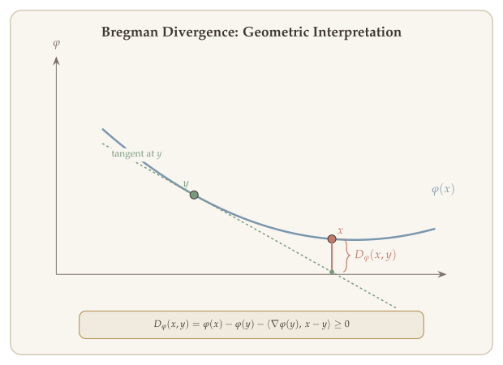
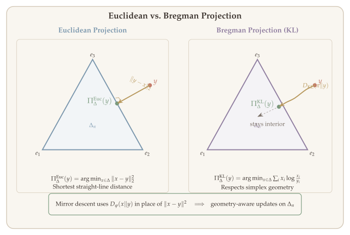
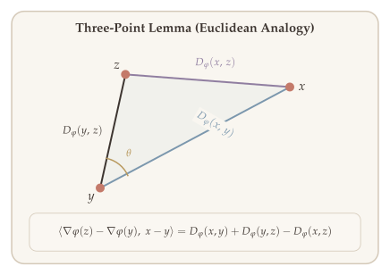
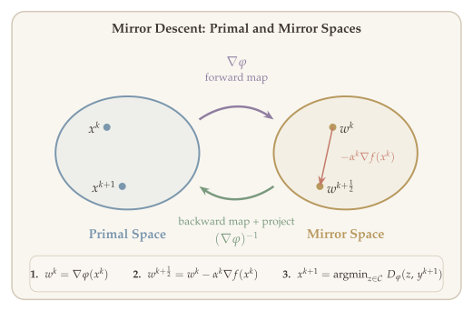
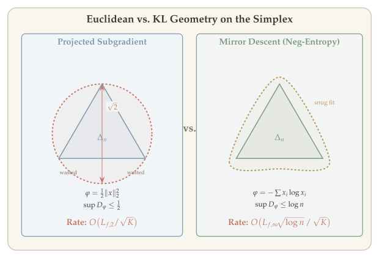
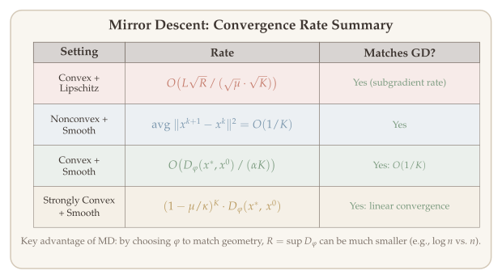

All the first-order methods we have studied so far---gradient descent, projected gradient descent, proximal gradient---share a common feature: they measure distances using the Euclidean norm $\|\cdot\|_2$. But is the Euclidean norm always the right choice? When optimizing over the probability simplex $\Delta_n$, for instance, the natural measure of distance between distributions is the Kullback--Leibler (KL) divergence, not the squared Euclidean distance. When the Hessian of the objective has special structure, a weighted norm aligned with the curvature can dramatically improve convergence.

**Mirror descent** is a principled way to incorporate non-Euclidean geometry into first-order optimization. The key idea is to replace the squared Euclidean distance $\frac{1}{2}\|y - x\|_2^2$ in the gradient descent update with a **Bregman divergence** $D_\varphi(y, x)$ induced by a strictly convex function $\varphi$. By choosing $\varphi$ to match the geometry of the constraint set, mirror descent can achieve convergence rates with much better dependence on the ambient dimension. For optimization over $\Delta_n$, using the negative entropy as $\varphi$ leads to convergence bounds that scale as $O(\sqrt{\log n})$ rather than $O(\sqrt{n})$---an exponential improvement in the dimension dependence.

In this lecture we develop the theory of Bregman divergences, derive the mirror descent algorithm and its "mirror map" interpretation, and prove convergence rates for both Lipschitz and smooth objectives. We also show how proximal mirror descent extends the framework to composite objectives.

::: {.callout-tip}
## Companion Notebook

A [Jupyter notebook](https://colab.research.google.com/github/ZhuoranYang/sds632-notes/blob/main/notebooks/mirror-descent.ipynb) accompanies this chapter with runnable Python implementations of Bregman divergence visualization, mirror descent on the simplex with multiplicative weights, dimension-free rate comparisons, and the online experts problem.
:::

## What Will Be Covered {#sec-overview}

1. Bregman divergence and mirror descent
2. Properties of Bregman divergence and the three-point lemma
3. Interpretations of mirror descent (primal and mirror spaces)
4. Convergence rates for the Lipschitz case and the smooth case
5. Online mirror descent and regret bounds
6. Optimization over the probability simplex: Euclidean vs. KL
7. Proximal mirror descent

## Recall: Proximal Gradient Descent {#sec-recall-pgd}

Recall that (proximal) gradient descent updates the iterate by minimizing a local model:

$$
x^+ = \operatorname*{argmin}_{y} \Big\{ f(x) + \langle \nabla f(x), y - x \rangle + \frac{1}{2\alpha} \|y - x\|_2^2 + h(y) \Big\}.
$$

The quadratic term $\frac{1}{2\alpha}\|y - x\|_2^2$ penalizes deviation from the current iterate, correcting the approximation error of the first-order Taylor expansion. But this penalty uses the **squared Euclidean distance**---is this always the right choice?

**Two motivating examples** suggest that Euclidean geometry can be suboptimal:

**Example 1 (Probability simplex).** Suppose $h(x) = I_{\Delta_n}(x)$, the indicator function of the probability simplex. Then $x$ represents a probability distribution, and it is more natural to measure proximity between distributions using the Kullback--Leibler divergence rather than the Euclidean distance.

**Example 2 (Quadratic with known curvature).** Consider $f(x) = \frac{1}{2}(x - x^*)^\top Q(x - x^*)$ for some positive definite matrix $Q$. Standard gradient descent requires $O(\kappa \cdot \log(1/\varepsilon))$ iterations, where $\kappa$ is the condition number of $Q$. However, if we replace the Euclidean penalty with a $Q$-weighted norm,

$$
x^+ = \operatorname*{argmin}_{y} \Big\{ f(x) + \langle \nabla f(x), y - x \rangle + \frac{1}{2\alpha}(y - x)^\top Q(y - x) \Big\},
$$

then the first-order optimality condition gives $\alpha \nabla f(x) + Q(x^+ - x) = 0$, which yields

$$
x^+ = x - \alpha \cdot Q^{-1} \nabla f(x) = x - \alpha \cdot (x - x^*).
$$

This converges in $O(\log(1/\varepsilon))$ iterations---the condition number has been completely eliminated by aligning the geometry with the Hessian.

::: {.callout-tip}
## Goal
Modify proximal GD to adapt to non-Euclidean geometry by replacing the squared Euclidean distance with a more general "distance-like" measure.
:::

## Bregman Divergence {#sec-bregman-divergence}

The Bregman divergence generalizes the squared Euclidean distance by measuring the gap between a strictly convex function and its linear approximation. This provides a flexible family of "distance-like" measures that can be tailored to the geometry of the problem.

::: {#def-bregman-divergence}
## Bregman Divergence

Let $\varphi : \mathbb{D} \to \mathbb{R}$ be a strictly convex and differentiable function with $\mathbb{D} = \operatorname{dom}(\varphi)$.

We define the **Bregman divergence** induced by $\varphi$ as

$$
D_\varphi(x, y) = \varphi(x) - \varphi(y) - \langle \nabla \varphi(y), x - y \rangle.
$$
:::

::: {.callout-tip}
## Remark: Bregman Divergence as a "Distance"
$D_\varphi(x, z)$ can be viewed as a "distance," but it is **not symmetric**: $D_\varphi(x, y) \neq D_\varphi(y, x)$ in general.
:::

The simplest example is the squared Euclidean distance: when $\varphi(x) = \|x\|_2^2$, we have $D_\varphi(x, y) = \|x - y\|_2^2$. But different choices of $\varphi$ yield different geometries, as we will see in the examples below.

**How to read @fig-bregman-divergence.** The curve is the strictly convex function $\varphi(x)$, and the dashed line is its tangent at $y$. The Bregman divergence $D_\varphi(x, y)$ is the vertical gap between $\varphi(x)$ and the tangent approximation at $y$---always nonnegative by convexity. Unlike Euclidean distance, $D_\varphi$ is generally **asymmetric**: the gap from $x$ looking at $y$'s tangent differs from the gap at $y$ looking at $x$'s tangent. The choice of $\varphi$ determines the geometry: $\varphi(x) = \|x\|_2^2$ recovers squared Euclidean distance, while $\varphi(x) = \sum x_i \log x_i$ gives KL divergence.

{#fig-bregman-divergence}

{#fig-mirror-descent-geometry}

**Intuition via Taylor expansion.** By the mean value theorem, there exists $\xi$ on the segment between $x$ and $y$ such that

$$
D_\varphi(x, y) = \frac{1}{2}(x - y)^\top \nabla^2 \varphi(\xi)(x - y).
$$

This shows that the Bregman divergence is a **local quadratic form** weighted by the Hessian of $\varphi$. The function $\varphi$ acts as a "lens" through which distances are measured: regions where $\nabla^2\varphi$ is large correspond to high curvature, making nearby points appear farther apart.

Since $\varphi$ is strictly convex, $\nabla^2\varphi(\xi) \succ 0$ everywhere, which immediately yields two fundamental properties:

**(a)** $D_\varphi(x, y) \geq 0$ for all $x, y \in \mathbb{D}$, and

**(b)** $D_\varphi(x, y) = 0$ if and only if $x = y$.

## Mirror Descent (MD) {#sec-mirror-descent}

With the Bregman divergence as our distance measure, we can now define mirror descent. The idea is simple: at each iteration, minimize a first-order approximation of $f$ penalized by the Bregman divergence from the current iterate. For $k = 0, 1, 2, \ldots$,

$$
x^{k+1} = \operatorname*{argmin}_{x \in \mathcal{C}} \Big\{ f(x^k) + \langle \nabla f(x^k), x - x^k \rangle + \frac{1}{\alpha^k} D_\varphi(x, x^k) \Big\}.
$$

Since $f(x^k)$ is a constant with respect to the optimization variable $x$, we can simplify this to

$$
x^{k+1} = \operatorname*{argmin}_{x \in \mathcal{C}} \Big\{ \langle \nabla f(x^k), x - x^k \rangle + \frac{1}{\alpha^k} D_\varphi(x, x^k) \Big\}.
$$ {#eq-md-update}

Comparing with the proximal gradient update, the only change is the replacement of $\frac{1}{2\alpha}\|x - x^k\|_2^2$ by $\frac{1}{\alpha^k} D_\varphi(x, x^k)$.

**Assumptions on the mirror map.** The constraint set $\mathcal{C} \subseteq \mathbb{R}^n$ is chosen so that $\varphi$ is **$\mu$-strongly convex** on $\mathcal{C}$ with respect to a norm $\|\cdot\|$:

$$
D_\varphi(x, y) = \varphi(x) - \varphi(y) - \langle \nabla \varphi(y), x - y \rangle \geq \frac{\mu}{2} \|x - y\|^2 \quad \forall\, x, y \in \mathcal{C}.
$$

Crucially, this norm $\|\cdot\|$ need not be the Euclidean norm $\|\cdot\|_2$. This flexibility is what allows mirror descent to adapt to the geometry of the problem: choosing $\varphi$ whose curvature aligns with the constraint set can dramatically improve convergence.

When $f$ is not differentiable, we replace $\nabla f(x^k)$ with a subgradient $g^k \in \partial f(x^k)$.

## Examples {#sec-examples}

We now examine two fundamental examples that illustrate the power of choosing the mirror map $\varphi$ to match the problem geometry.

::: {#exm-weighted-l2}
## Weighted $\ell_2$-Norm

Let $Q \succ 0$ with $Q \succeq \mu I$, and set $\varphi(x) = \frac{1}{2} x^\top Q\, x$. Since $\nabla \varphi(x) = Qx$, the induced Bregman divergence is

$$
D_\varphi(x, y) = \frac{1}{2}x^\top Qx - \frac{1}{2}y^\top Qy - \langle Qy, x - y \rangle = \frac{1}{2}(x - y)^\top Q(x - y).
$$

This is the squared Mahalanobis distance with respect to $Q$. Applying the mirror descent update ([-@eq-md-update]) with $\mathcal{C} = \mathbb{R}^n$,

$$
x^{k+1} = \operatorname*{argmin}_{x} \Big\{ \alpha^k \langle \nabla f(x^k), x - x^k \rangle + \frac{1}{2}(x - x^k)^\top Q(x - x^k) \Big\}.
$$

Setting the gradient to zero gives the first-order optimality condition $\alpha^k \nabla f(x^k) + Q(x^{k+1} - x^k) = 0$, which yields

$$
\boxed{x^{k+1} = x^k - \alpha^k \cdot Q^{-1} \nabla f(x^k).}
$$

This is exactly the **preconditioned gradient descent** update from the motivating example in @sec-recall-pgd. When $Q$ is chosen to approximate the Hessian $\nabla^2 f$, the method adapts to the curvature of $f$, eliminating the condition number from the convergence rate.
:::

::: {#exm-kl-divergence}
## KL-Divergence (Negative Entropy)

The most important non-Euclidean example arises from the **negative entropy** on the probability simplex. Let

$$
\varphi(x) = \sum_{i=1}^{n} x_i \log x_i, \qquad \mathcal{C} = \Delta_n = \Big\{ x \in \mathbb{R}^n : x \geq 0,\; \sum_{i=1}^n x_i = 1 \Big\}.
$$

Then the induced Bregman divergence is the **Kullback--Leibler (KL) divergence**:

$$
D_\varphi(x, y) = \mathrm{KL}(x \,\|\, y) = \sum_{i=1}^{n} x_i \log\!\Big(\frac{x_i}{y_i}\Big).
$$
:::

::: {.proof}
The gradient of $\varphi$ is $\nabla \varphi(x) = \big(\log x_i + 1\big)_{i=1}^n$. Expanding the definition of Bregman divergence and using the constraint $\sum x_i = \sum y_i = 1$,

$$
\begin{aligned}
D_\varphi(x, y) &= \sum_{i=1}^n x_i \log x_i - \sum_{i=1}^n y_i \log y_i - \sum_{i=1}^{n} (\log y_i + 1)(x_i - y_i) \\
&= \sum_{i=1}^n x_i \log x_i - \sum_{i=1}^n y_i \log y_i - \sum_{i=1}^n x_i \log y_i + \sum_{i=1}^n y_i \log y_i - \underbrace{\sum_{i=1}^n (x_i - y_i)}_{=\,0} \\
&= \sum_{i=1}^{n} x_i(\log x_i - \log y_i) = \sum_{i=1}^n x_i \log\!\Big(\frac{x_i}{y_i}\Big) = \mathrm{KL}(x \,\|\, y).
\end{aligned}
$$

This confirms that the Bregman divergence induced by the negative entropy is the KL divergence. $\blacksquare$
:::

### MD Update for KL: Exponentiated Gradient {#sec-md-kl-update}

When we apply mirror descent with KL divergence on the simplex, the update ([-@eq-md-update]) becomes

$$
x^{k+1} \leftarrow \operatorname*{argmin}_{y \in \Delta_n} \Big\{ \alpha^k \langle \nabla f(x^k), y \rangle + \mathrm{KL}(y \,\|\, x^k) \Big\}.
$$

The solution has a remarkably elegant closed form---the **exponentiated gradient update** (also known as **multiplicative weights**):

$$
x_i^{k+1} = \frac{x_i^k \cdot \exp\!\big(-\alpha^k \cdot \partial_i f(x^k)\big)}{\displaystyle\sum_{j=1}^{n} x_j^k \cdot \exp\!\big(-\alpha^k \cdot \partial_j f(x^k)\big)}, \quad i \in [n].
$$ {#eq-exponentiated-update}

Each coordinate is scaled multiplicatively by $\exp(-\alpha^k \partial_i f)$, then renormalized to stay on the simplex. Coordinates with large partial derivatives (high cost) are down-weighted, while low-cost coordinates are up-weighted. This is a natural update rule for probability distributions.

::: {.proof}
We derive ([-@eq-exponentiated-update]) via the KKT conditions. Consider the problem

$$
\min_{y \in \Delta_n} \; F(y), \qquad F(y) = \langle p, y \rangle + \mathrm{KL}(y \,\|\, x),
$$

where $p = \alpha^k \nabla f(x^k)$ and $x \in \Delta_n$ with $x > 0$. The simplex constraint gives the Lagrangian

$$
\mathcal{L}(y, \lambda, \nu) = F(y) - \lambda^\top y + \nu(\mathbf{1}^\top y - 1), \quad \lambda \geq 0,\; \nu \in \mathbb{R}.
$$

**Step 1 (Stationarity).** The gradient of $F$ is $\nabla_y F(y) = (p_i + \log(y_i/x_i) + 1)_{i=1}^n$. Setting $\nabla_y \mathcal{L} = 0$ gives

$$
p_i + \log\frac{y_i}{x_i} + 1 - \lambda_i + \nu = 0 \quad \Longrightarrow \quad y_i = x_i \cdot \exp(-p_i + \lambda_i - \nu - 1).
$$

**Step 2 (Complementary slackness).** Since $y_i = x_i \exp(\cdots) > 0$ for all $i$ (because $x_i > 0$), the complementary slackness condition $\lambda_i y_i = 0$ forces $\lambda_i = 0$ for every $i$.

**Step 3 (Normalization).** Substituting $\lambda_i = 0$ gives $y_i = x_i \exp(-p_i) \cdot e^{-\nu - 1}$. The constraint $\sum_i y_i = 1$ determines $e^{-\nu-1} = 1/\sum_j x_j \exp(-p_j)$, yielding

$$
y_i = \frac{x_i \cdot \exp(-p_i)}{\sum_{j=1}^n x_j \cdot \exp(-p_j)}.
$$

Substituting $p = \alpha^k \nabla f(x^k)$ gives the exponentiated gradient update ([-@eq-exponentiated-update]). $\blacksquare$
:::

### Pinsker's Lemma {#sec-pinsker}

A natural question arises: is the negative entropy $\varphi(x) = \sum x_i \log x_i$ strongly convex on $\Delta_n$? If so, with respect to which norm? The answer is central to the theory of mirror descent on the simplex.

The negative entropy is **not** strongly convex with respect to $\|\cdot\|_2$: near the boundary of the simplex, $\nabla^2\varphi = \operatorname{diag}(1/x_i)$ has unbounded eigenvalues, but in the interior with $x_i \approx 1/n$, the minimum eigenvalue is only $n$, which is dimension-dependent and unhelpful. However, it is $1$-strongly convex with respect to the $\ell_1$-norm---a much stronger statement that leads to dimension-free convergence bounds.

::: {#lem-pinsker}
## Pinsker's Lemma

For any $p, q \in \Delta_n$,

$$
\mathrm{KL}(p \,\|\, q) \geq \frac{1}{2} \|p - q\|_1^2.
$$

Equivalently, $\varphi(x) = \sum x_i \log x_i$ is $1$-strongly convex on $\Delta_n$ with respect to $\|\cdot\|_1$.
:::

The proof uses a one-dimensional reduction and the inequality $\log t \geq 1 - 1/t$; we omit it here and refer to standard references in information theory. The key consequence is that on the simplex, the Bregman divergence $D_\varphi = \mathrm{KL}$ controls the $\ell_1$-distance, and the dual norm of $\|\cdot\|_1$ is $\|\cdot\|_\infty$. This is precisely why the convergence rate of mirror descent with KL involves $\|g\|_\infty$ rather than $\|g\|_2$.

## Properties of Bregman Divergence {#sec-properties}

Bregman divergences share some properties with true metrics but lack others. Understanding these properties is essential for the convergence analysis that follows.

**(P1) Non-negativity.** By strict convexity of $\varphi$, the function lies above every tangent line, so

$$
D_\varphi(x, y) \geq 0 \quad \text{for all } x, y \in \mathcal{C}, \qquad D_\varphi(x, y) = 0 \iff x = y.
$$

**(P2) Convexity in the first argument.** Since $D_\varphi(x, y) = \varphi(x) - \varphi(y) - \langle \nabla\varphi(y), x - y \rangle$ and $\varphi$ is convex, the map $x \mapsto D_\varphi(x, y)$ is convex for every fixed $y$. However, $y \mapsto D_\varphi(x, y)$ is **not** convex in general---this asymmetry is a key difference from squared norms.

**(P3) Lack of symmetry.** Unlike a metric, $D_\varphi(x, y) \neq D_\varphi(y, x)$ in general. This is visible even for KL divergence: $\mathrm{KL}(p \,\|\, q) \neq \mathrm{KL}(q \,\|\, p)$.

**(P4) Linearity in $\varphi$.** If $\varphi = \varphi_1 + \lambda\varphi_2$, then

$$
D_\varphi(x, y) = D_{\varphi_1}(x, y) + \lambda \cdot D_{\varphi_2}(x, y).
$$

This allows us to decompose complex Bregman divergences into simpler components.

**(P5) Invariance under affine shifts.** Adding an affine function to $\varphi$ does not change the divergence: if $\varphi_2(x) = \varphi_1(x) + a^\top x + b$, then $D_{\varphi_2} = D_{\varphi_1}$, since the linear terms cancel in the definition.

**(P6) Gradient formula.** Differentiating with respect to the first argument gives

$$
\nabla_x D_\varphi(x, y) = \nabla \varphi(x) - \nabla \varphi(y).
$$

This identity will be used repeatedly: the gradient of the Bregman divergence is the difference of the mirror maps evaluated at $x$ and $y$.

### Three-Point Lemma {#sec-three-point}

The most important algebraic identity for Bregman divergences is the **three-point lemma**, which plays the same role that the law of cosines plays in Euclidean geometry. It is the workhorse behind every convergence proof in this chapter.

::: {#lem-three-point-bregman}
## Three-Point Lemma (Bregman)

For any $x, y, z \in \operatorname{dom}(\varphi)$,

$$
\langle \nabla \varphi(z) - \nabla \varphi(y),\; x - y \rangle = D_\varphi(x, y) + D_\varphi(y, z) - D_\varphi(x, z).
$$ {#eq-three-point-bregman}
:::

::: {.proof}
Expand each Bregman divergence on the right-hand side using the definition $D_\varphi(a, b) = \varphi(a) - \varphi(b) - \langle \nabla\varphi(b), a - b \rangle$:

$$
\begin{aligned}
&D_\varphi(x, y) + D_\varphi(y, z) - D_\varphi(x, z) \\
&= \big[\varphi(x) - \varphi(y) - \langle \nabla\varphi(y), x - y \rangle\big] + \big[\varphi(y) - \varphi(z) - \langle \nabla\varphi(z), y - z \rangle\big] \\
&\qquad - \big[\varphi(x) - \varphi(z) - \langle \nabla\varphi(z), x - z \rangle\big].
\end{aligned}
$$

The $\varphi$ terms cancel: $\varphi(x) - \varphi(y) + \varphi(y) - \varphi(z) - \varphi(x) + \varphi(z) = 0$. The remaining inner product terms give

$$
-\langle \nabla\varphi(y), x - y \rangle - \langle \nabla\varphi(z), y - z \rangle + \langle \nabla\varphi(z), x - z \rangle.
$$

Since $x - z = (x - y) + (y - z)$, the last term expands as $\langle \nabla\varphi(z), x - y \rangle + \langle \nabla\varphi(z), y - z \rangle$. The $\langle \nabla\varphi(z), y - z \rangle$ terms cancel, leaving

$$
\langle \nabla\varphi(z) - \nabla\varphi(y),\; x - y \rangle. \qquad \blacksquare
$$
:::

**Euclidean special case.** When $\varphi(x) = \frac{1}{2}\|x\|_2^2$, the three-point lemma reduces to

$$
\langle z - y,\; x - y \rangle = \frac{1}{2}\|x - y\|_2^2 + \frac{1}{2}\|z - y\|_2^2 - \frac{1}{2}\|x - z\|_2^2,
$$

which is the **law of cosines**: the left-hand side equals $\|z - y\| \cdot \|x - y\| \cdot \cos\angle_{xyz}$.

{#fig-three-point}

## Bregman Projection {#sec-bregman-projection}

Just as Euclidean projection finds the closest point in $\|\cdot\|_2$, **Bregman projection** finds the closest point in Bregman divergence. The resulting "obtuse angle" characterization generalizes the classical projection theorem and underlies the convergence analysis of mirror descent.

Let $\Omega$ be a compact and convex set. For any $x \in \operatorname{dom}(\varphi)$, the **Bregman projection** of $x$ onto $\Omega$ is

$$
x_{\Omega, \varphi} = \operatorname*{argmin}_{z \in \Omega} D_\varphi(z, x).
$$

Note the order of arguments: we minimize over the **first** argument of $D_\varphi$, which is the convex argument.

::: {#lem-bregman-proj-characterization}
## Bregman Projection Characterization

$z = x_{\Omega, \varphi}$ if and only if

$$
\langle \nabla \varphi(x) - \nabla \varphi(z),\; y - z \rangle \leq 0 \quad \forall\, y \in \mathcal{C}.
$$

Equivalently,

$$
D_\varphi(y, z) + D_\varphi(z, x) - D_\varphi(y, x) \leq 0 \quad \forall\, y \in \mathcal{C}.
$$

The second form follows from the first by applying the three-point identity ([-@eq-three-point-bregman]).
:::

{#fig-bregman-proj}

::: {.proof}
Let $z^* = x_{\mathcal{C}, \varphi} = \operatorname*{argmin}_{z \in \mathcal{C}} D_\varphi(z, x)$.

We have $\nabla_z D_\varphi(z, x) = \nabla \varphi(z) - \nabla \varphi(x)$.

Using the first-order optimality condition, we have:

$$
\langle \nabla \varphi(z^*) - \nabla \varphi(x),\; y - z^* \rangle \geq 0.
$$

$$
\Rightarrow \quad \langle \nabla \varphi(x) - \nabla \varphi(z^*),\; y - z^* \rangle \leq 0 \quad \forall\, y \in \mathcal{C}.
$$

This completes the proof of @lem-bregman-proj-characterization. $\blacksquare$
:::

## Alternative Form of MD: The Mirror Map {#sec-alternative-md}

We now explain why the algorithm is called "**mirror** descent." The key insight is that the update can be decomposed into three steps that pass through a **dual (mirror) space** where the gradient step is simple.

Starting from the mirror descent update ([-@eq-md-update]),

$$
x^{k+1} = \operatorname*{argmin}_{x \in \mathcal{C}} \Big\{ \alpha^k \langle g^k, x - x^k \rangle + D_\varphi(x, x^k) \Big\}, \quad g^k \in \partial f(x^k),
$$

the first-order optimality condition gives

$$
\langle \alpha^k g^k + \nabla \varphi(x^{k+1}) - \nabla \varphi(x^k),\; y - x^{k+1} \rangle \geq 0 \quad \forall\, y \in \mathcal{C}.
$$ {#eq-md-foc}

Now define an intermediate point $y^{k+1}$ by performing the gradient step in the **dual space**:

$$
\nabla \varphi(y^{k+1}) = \nabla \varphi(x^k) - \alpha^k g^k.
$$

Substituting into ([-@eq-md-foc]) gives

$$
\langle \nabla \varphi(x^{k+1}) - \nabla \varphi(y^{k+1}),\; y - x^{k+1} \rangle \geq 0 \quad \forall\, y \in \mathcal{C}.
$$

By @lem-bregman-proj-characterization, this is precisely the optimality condition for the Bregman projection of $y^{k+1}$ onto $\mathcal{C}$:

$$
x^{k+1} = \operatorname*{argmin}_{z \in \mathcal{C}} D_\varphi(z, y^{k+1}).
$$

This reveals the **mirror structure** of the algorithm:

**How to read @fig-mirror-map.** The figure shows two spaces connected by the mirror map. **Left (primal space):** the constraint set $\mathcal{C}$ contains the iterates $x^k$. **Right (mirror/dual space):** the gradient step happens here. The algorithm proceeds in three steps: (1) the **forward map** $\nabla\varphi$ sends $x^k$ from primal to mirror space; (2) a **gradient step** in mirror space produces $w^{k+1/2}$; (3) the **backward map** $(\nabla\varphi)^{-1}$ followed by projection onto $\mathcal{C}$ yields the next primal iterate $x^{k+1}$. The key insight is that the gradient step is linear and simple in mirror space, while the geometry of $\mathcal{C}$ is handled by the mirror map.

{#fig-mirror-map}

The mirror descent algorithm proceeds in three steps:

1. **Forward map:** $w^k = \nabla \varphi(x^k)$.
2. **Gradient step in mirror space:** $w^{k+\frac{1}{2}} = w^k - \alpha^k \nabla f(x^k)$.
3. **Backward map + projection:** $x^{k+1} = \operatorname*{argmin}_{z \in \mathcal{C}} D_\varphi(z, y^{k+1})$, where $\nabla \varphi(y^{k+1}) = w^{k+\frac{1}{2}}$.

### Unconstrained Case {#sec-unconstrained-md}

When $\mathcal{C} = \mathbb{R}^n$, the projection step is trivial ($y^{k+1} = x^{k+1}$), and the entire update reduces to a gradient step in the dual space followed by the inverse mirror map:

$$
\nabla \varphi(x^{k+1}) = \nabla \varphi(x^k) - \alpha^k \nabla f(x^k).
$$

Applying $(\nabla\varphi)^{-1}$ to both sides gives

$$
x^{k+1} = (\nabla \varphi)^{-1}\!\big(\nabla \varphi(x^k) - \alpha^k \nabla f(x^k)\big) = \nabla \varphi^*\!\big(\nabla \varphi(x^k) - \alpha^k \nabla f(x^k)\big),
$$

where $\varphi^*$ is the convex conjugate of $\varphi$. When $\varphi(x) = \frac{1}{2}\|x\|_2^2$, we have $\nabla\varphi = I$ and this reduces to the standard gradient descent update $x^{k+1} = x^k - \alpha^k \nabla f(x^k)$.

## Convergence Analysis of MD (Lipschitz Case) {#sec-convergence-lipschitz}

We now analyze the convergence of mirror descent for the Lipschitz (non-smooth) setting. The proof structure parallels that of projected subgradient descent, but with Bregman divergences replacing squared Euclidean distances throughout. The key tools are: **(1)** the optimality condition of the mirror descent step, **(2)** the three-point lemma (@lem-three-point-bregman), and **(3)** Hölder's inequality with respect to the primal/dual norm pair.

**Setting.** Consider the constrained optimization problem $\min_{x \in \mathcal{C}} f(x)$ under the following assumptions:

**(A1)** The mirror map $\varphi$ is $\mu$-strongly convex on $\mathcal{C}$ with respect to a norm $\|\cdot\|$:

$$
D_\varphi(x, y) \geq \frac{\mu}{2} \|x - y\|^2 \quad \forall\, x, y \in \mathcal{C}.
$$

**(A2)** The function $f$ is convex, and its subgradients are bounded in the **dual norm** $\|\cdot\|_*$:

$$
\|g\|_* \leq L \quad \text{for all } g \in \partial f(x),\; \text{for all } x \in \mathcal{C}.
$$

The pairing of the primal norm (measuring distances in $\mathcal{C}$) with the dual norm (measuring subgradient size) is the mechanism through which mirror descent adapts to geometry.

::: {#thm-md-lipschitz}
## Convergence of MD (Lipschitz Case)

Under assumptions **(A1)**--**(A2)**, let $\{x^k\}$ be the iterates of mirror descent ([-@eq-md-update]) with step sizes $\{\alpha^k\}$. Define the Bregman diameter $R = \sup_{x \in \mathcal{C}} D_\varphi(x, x^0)$. Then the best iterate satisfies

$$
\min_{0 \leq k \leq K} \big\{f(x^k) - f^*\big\} \leq \frac{R + \dfrac{L^2}{2\mu}\displaystyle\sum_{k=0}^{K} (\alpha^k)^2}{\displaystyle\sum_{k=0}^{K} \alpha^k}.
$$ {#eq-md-lipschitz-bound}

In particular, with constant step size $\alpha = \frac{\sqrt{2\mu R}}{L\sqrt{K+1}}$,

$$
\min_{0 \leq k \leq K} \big\{f(x^k) - f^*\big\} \leq \frac{L\sqrt{2R}}{\sqrt{\mu(K+1)}} = O\!\left(\frac{L\sqrt{R/\mu}}{\sqrt{K}}\right).
$$
:::

This $O(1/\sqrt{K})$ rate matches the rate of projected subgradient descent. The advantage of mirror descent lies not in the rate itself, but in the **constants**: by choosing $\varphi$ to match the geometry, the quantities $R$ and $L$ (measured in the adapted norm) can be much smaller than their Euclidean counterparts. We will see a striking example of this in @sec-simplex.

::: {.proof}
The proof combines three ingredients: the optimality of $x^{k+1}$, the three-point lemma (@lem-three-point-bregman), and Hölder's inequality with respect to the primal/dual norm pair.

**Step 1 (Optimality condition).** Since $x^{k+1}$ minimizes $\alpha^k \langle g^k, x \rangle + D_\varphi(x, x^k)$ over $\mathcal{C}$, the first-order optimality condition gives

$$
\langle \alpha^k g^k + \nabla \varphi(x^{k+1}) - \nabla \varphi(x^k),\; \bar{x} - x^{k+1} \rangle \geq 0 \quad \forall\, \bar{x} \in \mathcal{C}.
$$ {#eq-lip-optimality}

**Step 2 (Three-point identity).** Applying the three-point lemma ([-@eq-three-point-bregman]) with the substitution $(x, y, z) \to (\bar{x},\, x^{k+1},\, x^k)$ gives

$$
\langle \nabla \varphi(x^k) - \nabla \varphi(x^{k+1}),\; \bar{x} - x^{k+1} \rangle = D_\varphi(\bar{x}, x^{k+1}) + D_\varphi(x^{k+1}, x^k) - D_\varphi(\bar{x}, x^k).
$$ {#eq-lip-three-point}

**Step 3 (Combine Steps 1 and 2).** Rearranging ([-@eq-lip-optimality]) and substituting ([-@eq-lip-three-point]), we obtain

$$
\alpha^k \langle g^k,\; x^{k+1} - \bar{x} \rangle \leq D_\varphi(\bar{x}, x^k) - D_\varphi(\bar{x}, x^{k+1}) - D_\varphi(x^{k+1}, x^k).
$$

Using the strong convexity assumption **(A1)**, $D_\varphi(x^{k+1}, x^k) \geq \frac{\mu}{2}\|x^{k+1} - x^k\|^2$, so

$$
\alpha^k \langle g^k,\; x^{k+1} - \bar{x} \rangle \leq D_\varphi(\bar{x}, x^k) - D_\varphi(\bar{x}, x^{k+1}) - \frac{\mu}{2}\|x^{k+1} - x^k\|^2.
$$ {#eq-lip-combined}

**Step 4 (Convert to per-iteration progress).** We need to bound $\langle g^k, x^k - \bar{x} \rangle$ (with $x^k$, not $x^{k+1}$). Splitting the inner product,

$$
\alpha^k \langle g^k, x^k - \bar{x} \rangle = \alpha^k \langle g^k, x^{k+1} - \bar{x} \rangle + \alpha^k \langle g^k, x^k - x^{k+1} \rangle.
$$ {#eq-lip-split}

By Hölder's inequality, $\langle g^k, x^k - x^{k+1} \rangle \leq \|g^k\|_* \cdot \|x^k - x^{k+1}\|$. Applying Young's inequality $ab \leq \frac{a^2}{2\mu} + \frac{\mu b^2}{2}$ with $a = \alpha^k\|g^k\|_*$ and $b = \|x^k - x^{k+1}\|$,

$$
\alpha^k \|g^k\|_* \cdot \|x^k - x^{k+1}\| \leq \frac{(\alpha^k)^2 \|g^k\|_*^2}{2\mu} + \frac{\mu}{2}\|x^k - x^{k+1}\|^2.
$$

**Step 5 (Per-iteration bound).** Substituting the Young's inequality bound into ([-@eq-lip-split]) and combining with ([-@eq-lip-combined]), the $\frac{\mu}{2}\|x^{k+1} - x^k\|^2$ terms cancel, yielding

$$
\alpha^k \langle g^k, x^k - \bar{x} \rangle \leq D_\varphi(\bar{x}, x^k) - D_\varphi(\bar{x}, x^{k+1}) + \frac{(\alpha^k)^2 L^2}{2\mu},
$$

where we used $\|g^k\|_* \leq L$ from assumption **(A2)**.

**Step 6 (Telescope and conclude).** Summing over $k = 0, 1, \ldots, K$ and using convexity ($\langle g^k, x^k - \bar{x} \rangle \geq f(x^k) - f(\bar{x})$),

$$
\sum_{k=0}^{K} \alpha^k \big(f(x^k) - f(\bar{x})\big) \leq \underbrace{D_\varphi(\bar{x}, x^0) - D_\varphi(\bar{x}, x^{K+1})}_{\text{telescoping sum}} + \frac{L^2}{2\mu} \sum_{k=0}^{K} (\alpha^k)^2.
$$

Dropping the non-positive term $-D_\varphi(\bar{x}, x^{K+1})$, setting $\bar{x} = x^*$, and dividing by $\sum_{k=0}^{K} \alpha^k$ yields ([-@eq-md-lipschitz-bound]). Hence we conclude the proof. $\blacksquare$
:::

::: {.callout-tip}
## Remark: Generality of the Proof
The proof actually does not use the fact that $x^*$ is the optimal solution. We only need $x^*$ to be a **fixed point**. Moreover, $\{g^k\}$ don't need to be subgradients of the same function.
:::

## Online Mirror Descent {#sec-online-md}

A remarkable feature of the convergence proof for @thm-md-lipschitz is that it does not require $\{g^k\}$ to be subgradients of the **same** function---the bound holds for any sequence of bounded vectors. This observation leads naturally to the **online optimization** setting, where the loss function changes adversarially at each step.

**The online learning protocol.** Let $\{f_t\}_{t=1}^T$ be a sequence of convex, $L$-Lipschitz functions revealed one at a time. At each round $t$:

**(a)** The learner selects an action $x^t \in \mathcal{C}$.

**(b)** The adversary reveals the loss function $f_t$.

**(c)** The learner incurs cost $f_t(x^t)$.

The learner's goal is to minimize the **regret**---the gap between the total cost and the cost of the best fixed action in hindsight:

$$
\mathrm{Regret}_T = \sum_{t=1}^{T} f_t(x^t) - \min_{x \in \mathcal{C}} \sum_{t=1}^{T} f_t(x).
$$

**Algorithm (Online Mirror Descent).** Initialize $x^1 \in \mathcal{C}$. For $t = 1, 2, \ldots, T$:

**(a)** Observe $f_t$ and compute $g^t \in \partial f_t(x^t)$.

**(b)** Update: $x^{t+1} \leftarrow \operatorname*{argmin}_{x \in \mathcal{C}} \big\{ \langle \alpha^t g^t, x - x^t \rangle + D_\varphi(x, x^t) \big\}$.

::: {#thm-online-md}
## Online Mirror Descent Regret Bound

Under assumptions **(A1)**--**(A2)** with $R = \sup_{x \in \mathcal{C}} D_\varphi(x, x^1)$, setting $\alpha^t = \frac{\sqrt{2\mu R}}{L\sqrt{T}}$ gives

$$
\mathrm{Regret}_T \leq L\sqrt{\frac{2R}{\mu}} \cdot \sqrt{T} = O\!\big(\sqrt{T}\big).
$$
:::

The proof follows directly from the per-iteration bound in Step 5 of the proof of @thm-md-lipschitz, applied with $g^k = g^t \in \partial f_t(x^t)$ at each step and using convexity of each $f_t$ separately. The sublinear $O(\sqrt{T})$ regret implies that the **average regret** $\mathrm{Regret}_T / T \to 0$, meaning the online algorithm eventually performs as well as the best fixed strategy.

## Optimization over the Probability Simplex {#sec-simplex}

We now demonstrate the power of mirror descent through its most celebrated application: optimization over the probability simplex $\mathcal{C} = \Delta_n$. We initialize at the uniform distribution $x^0 = \frac{1}{n}\mathbf{1}$ and compare two approaches that differ only in the choice of mirror map $\varphi$.

### Approach 1: Projected Subgradient (Euclidean) {#sec-simplex-proj-subgrad}

The Euclidean choice $\varphi(x) = \frac{1}{2}\|x\|_2^2$ gives $D_\varphi(x, y) = \frac{1}{2}\|x - y\|_2^2$, with $\mu = 1$ (strong convexity with respect to $\|\cdot\|_2$). To apply @thm-md-lipschitz, we need to compute the "radius" $R = \sup_{x \in \Delta_n} D_\varphi(x, x^0)$:

$$
R = \sup_{x \in \Delta_n} \frac{1}{2}\Big\|x - \tfrac{1}{n}\mathbf{1}\Big\|_2^2 = \sup_{x \in \Delta_n} \frac{1}{2} \sum_{i=1}^{n} \Big(x_i - \frac{1}{n}\Big)^2.
$$

The supremum is attained at a vertex $e_j$, giving $R = \frac{1}{2}(1 - 1/n)^2 + \frac{n-1}{2n^2} \leq \frac{1}{2}$. By @thm-md-lipschitz, the convergence rate is

$$
\mathrm{Err}_{\mathrm{best}} = O\!\Big(\frac{L_{f,2}}{\sqrt{K}}\Big),
$$

where $L_{f,2}$ bounds $\|g\|_2$ for $g \in \partial f(x)$. The dependence on $n$ is **hidden in $L_{f,2}$**, which can be as large as $\sqrt{n} \cdot L_{f,\infty}$.

### Approach 2: Mirror Descent with KL {#sec-simplex-md-kl}

Now choose $\varphi(x) = \sum x_i \log x_i$ (negative entropy), so that $D_\varphi = \mathrm{KL}$. By Pinsker's lemma (@lem-pinsker), $\varphi$ is $1$-strongly convex with respect to $\|\cdot\|_1$, and the dual norm is $\|\cdot\|_\infty$. The radius is

$$
R = \sup_{x \in \Delta_n} \mathrm{KL}(x \,\|\, x^0) = \sup_{x \in \Delta_n} \sum_{i=1}^n x_i \log(nx_i) = \log n + \sup_{x \in \Delta_n} \underbrace{\sum_{i=1}^n x_i \log x_i}_{\leq\, 0} \leq \log n.
$$

By @thm-md-lipschitz with $\mu = 1$ and $R = \log n$, the convergence rate is

$$
\mathrm{Err}_{\mathrm{best}} = O\!\Big(\frac{L_{f,\infty} \cdot \sqrt{\log n}}{\sqrt{K}}\Big),
$$

where $L_{f,\infty}$ bounds $\|g\|_\infty$ for $g \in \partial f(x)$.

{#fig-euclidean-vs-kl}

### Comparison: Euclidean vs. KL {#sec-simplex-comparison}

The two rates are

$$
\underbrace{O\!\Big(\frac{L_{f,2}}{\sqrt{K}}\Big)}_{\text{Euclidean}} \quad \text{vs.} \quad \underbrace{O\!\Big(\frac{L_{f,\infty} \sqrt{\log n}}{\sqrt{K}}\Big)}_{\text{KL}}.
$$

To compare, we use the norm equivalence $\|g\|_\infty \leq \|g\|_2 \leq \sqrt{n} \cdot \|g\|_\infty$, which gives

$$
\frac{1}{\sqrt{n}} \leq \frac{L_{f,\infty}}{L_{f,2}} \leq 1.
$$

In the worst case ($L_{f,\infty} \approx L_{f,2}$), the KL rate has an extra $\sqrt{\log n}$ factor but a much smaller radius. In the best case ($L_{f,2} \approx \sqrt{n} \cdot L_{f,\infty}$), the KL rate improves on the Euclidean rate by a factor of $\sqrt{n/\log n}$.

::: {.callout-tip}
## Remark: Dimension Dependence
The KL version has **better dependence on the dimension**: $\sqrt{\log n}$ vs. $\sqrt{n}$---an **exponential improvement**. This is the central message of mirror descent: by choosing $\varphi$ to match the geometry of the constraint set, we can dramatically reduce the effective dimension of the problem. For high-dimensional problems on the simplex (e.g., online learning with $n$ experts), this improvement is decisive.
:::

## Improved Convergence Rates (Smooth Case) {#sec-improved-rates}

The $O(1/\sqrt{K})$ rate from @thm-md-lipschitz matches the optimal rate for Lipschitz convex optimization. When $f$ is additionally **smooth**, we can obtain faster rates by exploiting the quadratic upper bound, just as we did for gradient descent. The key challenge is that smoothness and strong convexity must now be stated relative to the Bregman divergence rather than the Euclidean distance.

**Assumptions.** We work under three conditions:

**(B1) Strong convexity relative to $D_\varphi$.** The function $f$ is differentiable and $\mu$-strongly convex with respect to the Bregman divergence:

$$
f(y) \geq f(x) + \langle \nabla f(x), y - x \rangle + \mu \cdot D_\varphi(y, x) \quad \forall\, x, y \in \mathcal{C}.
$$

When $\mu = 0$, this reduces to ordinary convexity.

**(B2) Smoothness in the generalized sense.** The gradient $\nabla f$ is $L$-Lipschitz with respect to the primal/dual norm pair:

$$
\|\nabla f(x) - \nabla f(y)\|_* \leq L \cdot \|x - y\| \quad \forall\, x, y \in \mathcal{C}.
$$

**(B3) Strong convexity of $\varphi$.** The mirror map $\varphi$ is $\sigma$-strongly convex with respect to the **same norm** $\|\cdot\|$ used in **(B2)**:

$$
D_\varphi(x, y) \geq \frac{\sigma}{2}\|x - y\|^2 \quad \forall\, x, y \in \mathcal{C}.
$$

Crucially, $\|\cdot\|$ need not be the Euclidean norm. The only requirement is that **(B2)** and **(B3)** use a **matched primal/dual norm pair**: $\varphi$ is strongly convex in $\|\cdot\|$, and $\nabla f$ is Lipschitz in the dual norm $\|\cdot\|_*$. For the Euclidean choice $\varphi = \frac{1}{2}\|x\|_2^2$, we have $\|\cdot\| = \|\cdot\|_* = \|\cdot\|_2$ and $\sigma = 1$. For the negative entropy $\varphi(x) = \sum x_i \log x_i$ on the simplex, Pinsker's lemma (@lem-pinsker) gives $\sigma = 1$ with $\|\cdot\| = \|\cdot\|_1$ and $\|\cdot\|_* = \|\cdot\|_\infty$.

Recall that the convergence proofs for (proximal) gradient descent in the smooth setting required two ingredients: a **descent lemma** and a **monotonicity/convexity** bound. Since we no longer have Euclidean geometry, we must rederive both in the Bregman setting.

::: {#lem-smooth-descent}
## Smoothness Lemma (Generalized)

When $f$ is $L$-smooth in the sense that

$$
\|\nabla f(x) - \nabla f(y)\|_* \leq L \cdot \|x - y\|,
$$

we have

$$
f(y) \leq f(x) + \langle \nabla f(x), y - x \rangle + \frac{L}{2}\|x - y\|^2.
$$
:::

::: {.proof}
By the fundamental theorem of calculus,

$$
f(y) - f(x) - \langle \nabla f(x), y - x \rangle = \int_0^1 \langle \nabla f(x + t(y-x)) - \nabla f(x),\; y - x \rangle\, dt.
$$

Applying Hölder's inequality (pairing $\|\cdot\|$ and $\|\cdot\|_*$) and then the Lipschitz condition **(B2)**,

$$
\begin{aligned}
\big|f(y) - f(x) - \langle \nabla f(x), y - x \rangle\big| &\leq \|y - x\| \cdot \int_0^1 \big\|\nabla f(x + t(y-x)) - \nabla f(x)\big\|_*\, dt \\
&\leq L\|y - x\|^2 \cdot \int_0^1 t\, dt = \frac{L}{2}\|y - x\|^2.
\end{aligned}
$$

This gives the desired quadratic upper bound, completing the proof. $\blacksquare$
:::

**Mirror descent as majorization-minimization.** The mirror descent update in the smooth setting is

$$
x^+ = \operatorname*{argmin}_{y \in \mathcal{C}} \Big\{ \langle \nabla f(x), y - x \rangle + \frac{1}{\alpha} D_\varphi(y, x) \Big\}.
$$

A natural question is: when does this step actually minimize an **upper bound** of $f$? By assumption **(B3)**, $D_\varphi(y, x) \geq \frac{\sigma}{2}\|y - x\|^2$. Combining with @lem-smooth-descent, if $\alpha \leq \sigma/L$, then

$$
\frac{L}{2}\|y - x\|^2 \leq \frac{L}{\sigma} D_\varphi(y, x) \leq \frac{1}{\alpha} D_\varphi(y, x).
$$

This yields the following key observation:

::: {.callout-tip}
## Majorization Property
When $f$ is $L$-smooth (in the sense of **(B2)**) and the step size satisfies $\alpha \leq \sigma/L$, we have the upper bound

$$
f(y) \leq \underbrace{f(x) + \langle \nabla f(x), y - x \rangle + \frac{1}{\alpha} D_\varphi(y, x)}_{\widehat{f}_x(y)} \quad \forall\, y \in \mathcal{C}.
$$

Thus mirror descent minimizes a **majorizer** $\widehat{f}_x$ of $f$, ensuring $f(x^+) \leq \widehat{f}_x(x^+) \leq \widehat{f}_x(x) = f(x)$. This is the Bregman analogue of the majorization-minimization interpretation of gradient descent.
:::

### Descent Lemma for MD {#sec-descent-lemma-md}

The following lemma is the Bregman analogue of the descent lemma from gradient descent. The proof combines the optimality of the mirror descent step with the three-point identity ([-@eq-three-point-bregman]).

::: {#lem-descent-md}
## Descent Lemma (Mirror Descent)

Let $x^+ = \operatorname*{argmin}_{y \in \mathcal{C}} \widehat{f}_x(y)$ with step size $\alpha = \sigma/L$. Then:

**(a)** (Sufficient decrease)

$$
f(x^+) \leq f(x) - \frac{1}{\alpha} D_\varphi(x, x^+) \leq f(x) - \frac{\sigma}{2\alpha}\|x^+ - x\|^2.
$$

The first inequality is the natural Bregman bound, obtained from the optimality of $x^+$ and the three-point lemma. The second follows from the strong convexity of $\varphi$ (assumption **(B3)**: $D_\varphi(x, x^+) \geq \frac{\sigma}{2}\|x - x^+\|^2$). In the Euclidean case ($\varphi = \frac{1}{2}\|\cdot\|_2^2$, $\sigma = 1$), the two inequalities coincide and reduce to the standard descent lemma $f(x^+) \leq f(x) - \frac{1}{2\alpha}\|x^+ - x\|_2^2$.

**(b)** (Progress toward optimum)

$$
f(x^+) - f(x^*) \leq \frac{1}{\alpha}\big(D_\varphi(x^*, x) - D_\varphi(x^*, x^+)\big) - \mu \cdot D_\varphi(x^*, x).
$$

The first term is a telescoping Bregman divergence that controls the cumulative progress over multiple iterations. The second term $-\mu D_\varphi(x^*, x)$ provides additional contraction in the strongly convex case ($\mu > 0$); when $\mu = 0$ (plain convexity), it vanishes and the bound reduces to a pure telescoping sum. Comparing with the Euclidean version (@lem-descent-sc), every $\frac{1}{2}\|x - y\|_2^2$ is replaced by $D_\varphi(x, y)$.
:::

Compare with the Euclidean counterparts from the gradient descent chapter:

| | GD (@lem-descent) | Mirror Descent (@lem-descent-md) |
|:--|:--|:--|
| **(a)** Sufficient decrease | $f(x^+) \leq f(x) - \frac{1}{2\alpha}\|x^+ - x\|_2^2$ | $f(x^+) \leq f(x) - \frac{1}{\alpha}D_\varphi(x, x^+)$ |
| **(b)** Progress to $x^*$ | $f(x^+) - f^* \leq \frac{1}{2\alpha}\big(\|x - x^*\|_2^2 - \|x^+ - x^*\|_2^2\big) - \frac{\mu}{2}\|x - x^*\|_2^2$ | $f(x^+) - f^* \leq \frac{1}{\alpha}\big(D_\varphi(x^*, x) - D_\varphi(x^*, x^+)\big) - \mu D_\varphi(x^*, x)$ |

The structure is identical: part **(a)** guarantees monotone decrease, part **(b)** provides a telescoping bound. The only change is the systematic replacement of $\frac{1}{2}\|x - y\|_2^2$ by $D_\varphi(x, y)$. In part **(a)**, the squared norm bound is a further consequence of applying the strong convexity of $\varphi$.

::: {.proof}
The proof proceeds by first deriving a general inequality from the optimality of $x^+$ and the three-point lemma, then specializing to obtain parts **(a)** and **(b)**.

**Step 1 (Optimality condition).** Since $x^+$ minimizes $\widehat{f}_x$ over $\mathcal{C}$, the first-order optimality condition gives

$$
\langle \alpha \nabla f(x) + \nabla \varphi(x^+) - \nabla \varphi(x),\; \bar{x} - x^+ \rangle \geq 0 \quad \forall\, \bar{x} \in \mathcal{C}.
$$ {#eq-smooth-optimality}

**Step 2 (Three-point identity).** Applying the three-point lemma ([-@eq-three-point-bregman]) with $(x, y, z) \to (\bar{x}, x^+, x)$,

$$
\langle \nabla \varphi(x) - \nabla \varphi(x^+),\; \bar{x} - x^+ \rangle = D_\varphi(\bar{x}, x^+) + D_\varphi(x^+, x) - D_\varphi(\bar{x}, x).
$$ {#eq-smooth-three-point}

**Step 3 (Master inequality).** Combining ([-@eq-smooth-optimality]) and ([-@eq-smooth-three-point]) yields the **master inequality** that holds for all $\bar{x} \in \mathcal{C}$:

$$
\alpha \langle \nabla f(x),\; x^+ - \bar{x} \rangle \leq D_\varphi(\bar{x}, x) - D_\varphi(\bar{x}, x^+) - D_\varphi(x^+, x).
$$

Two specializations of $\bar{x}$ will give us the two parts of the lemma.

**Setting $\bar{x} = x^*$** (the minimizer):

$$
\alpha \langle \nabla f(x),\; x^+ - x^* \rangle \leq D_\varphi(x^*, x) - D_\varphi(x^*, x^+) - D_\varphi(x^+, x).
$$ {#eq-smooth-star}

**Setting $\bar{x} = x$** (the current iterate):

$$
\alpha \langle \nabla f(x),\; x^+ - x \rangle \leq -D_\varphi(x, x^+) - D_\varphi(x^+, x).
$$ {#eq-smooth-self}

Note that Steps 1--3 use only the optimality of $x^+$ and the three-point lemma---no smoothness or convexity of $f$ is required yet.

---

**Proof of part (a): Nonconvex + Smooth.**

By the majorization property (since $\alpha \leq \sigma/L$), we have

$$
f(x^+) \leq \widehat{f}_x(x^+) = f(x) + \langle \nabla f(x), x^+ - x \rangle + \frac{1}{\alpha} D_\varphi(x^+, x).
$$ {#eq-smooth-upper}

Substituting the bound from ([-@eq-smooth-self]) on $\langle \nabla f(x), x^+ - x \rangle$ into ([-@eq-smooth-upper]),

$$
f(x^+) \leq f(x) - \frac{1}{\alpha} D_\varphi(x, x^+) \leq f(x) - \frac{\sigma}{2\alpha}\|x^+ - x\|^2,
$$ {#eq-smooth-descent-a}

where the last step uses $D_\varphi(x, x^+) \geq \frac{\sigma}{2}\|x - x^+\|^2$. This proves part **(a)**.

---

**Proof of part (b): (Strongly) Convex + Smooth.**

By the $\mu$-strong convexity of $f$ (assumption **(B1)**),

$$
f(x^*) \geq f(x) + \langle \nabla f(x), x^* - x \rangle + \mu \cdot D_\varphi(x^*, x).
$$

Rearranging gives an upper bound on $f(x)$:

$$
f(x) \leq f(x^*) + \langle \nabla f(x), x - x^* \rangle - \mu \cdot D_\varphi(x^*, x).
$$ {#eq-smooth-convex}

Substituting ([-@eq-smooth-convex]) into the majorization bound ([-@eq-smooth-upper]),

$$
f(x^+) \leq f(x^*) + \langle \nabla f(x), x^+ - x^* \rangle - \mu \cdot D_\varphi(x^*, x) + \frac{1}{\alpha} D_\varphi(x^+, x).
$$

Now applying ([-@eq-smooth-star]) to bound $\alpha\langle \nabla f(x), x^+ - x^* \rangle$, the $D_\varphi(x^+, x)$ terms cancel (since $\alpha = \sigma/L$), yielding

$$
f(x^+) - f(x^*) \leq \frac{1}{\alpha}\big(D_\varphi(x^*, x) - D_\varphi(x^*, x^+)\big) - \mu \cdot D_\varphi(x^*, x).
$$

This proves part **(b)** and completes the proof of @lem-descent-md. $\blacksquare$
:::

### Convergence Analysis (Smooth Case) {#sec-convergence-smooth}

With the descent lemma in hand, we can now derive convergence rates for all three standard settings. The structure exactly parallels the Euclidean analysis---the only difference is that Bregman divergences replace squared norms.

**Case 1: Nonconvex + Smooth.** Part **(a)** of @lem-descent-md gives sufficient decrease at each step. Telescoping yields a bound on the average squared step size:

$$
\frac{1}{K}\sum_{k=0}^{K-1} \|x^{k+1} - x^k\|^2 \leq \frac{2\alpha\big(f(x^0) - f^*\big)}{\sigma \cdot K}.
$$ {#eq-md-nonconvex-rate}

::: {.proof}
By @lem-descent-md(a), $f(x^{k+1}) \leq f(x^k) - \frac{\sigma}{2\alpha}\|x^k - x^{k+1}\|^2$. Rearranging and summing over $k = 0, \ldots, K-1$,

$$
\frac{\sigma}{2\alpha}\sum_{k=0}^{K-1}\|x^{k+1} - x^k\|^2 \leq f(x^0) - f(x^K) \leq f(x^0) - f^*.
$$

Dividing both sides by $K$ yields ([-@eq-md-nonconvex-rate]). Hence we conclude the proof. $\blacksquare$
:::

---

**Case 2: Convex + Smooth ($\mu = 0$).** Part **(b)** of @lem-descent-md with $\mu = 0$ provides a telescoping bound. Combined with the monotone decrease from part **(a)**, we obtain an $O(1/K)$ rate:

$$
f(x^K) - f(x^*) \leq \frac{D_\varphi(x^*, x^0)}{\alpha K}.
$$

::: {.proof}
By @lem-descent-md(b) with $\mu = 0$,

$$
f(x^{k+1}) - f(x^*) \leq \frac{1}{\alpha}\big(D_\varphi(x^*, x^k) - D_\varphi(x^*, x^{k+1})\big).
$$

Summing over $k = 0, \ldots, K-1$ and telescoping,

$$
\sum_{k=0}^{K-1}\big(f(x^{k+1}) - f(x^*)\big) \leq \frac{1}{\alpha}\big(D_\varphi(x^*, x^0) - D_\varphi(x^*, x^K)\big) \leq \frac{1}{\alpha} D_\varphi(x^*, x^0).
$$

Since the descent lemma part **(a)** guarantees $f(x^0) \geq f(x^1) \geq \cdots \geq f(x^K)$, the left-hand side is at least $K(f(x^K) - f^*)$, which gives the $O(1/K)$ rate. $\blacksquare$
:::

---

**Case 3: Strongly Convex + Smooth ($\mu > 0$).** The extra $\mu D_\varphi(x^*, x^k)$ term in @lem-descent-md(b) drives **linear convergence** of the Bregman divergence to the optimum:

$$
D_\varphi(x^*, x^K) \leq \Big(1 - \frac{\mu}{\kappa}\Big)^K \cdot D_\varphi(x^*, x^0), \qquad \kappa = \frac{L}{\mu\sigma}.
$$ {#eq-strongly-convex-smooth-rate}

::: {.proof}
By @lem-descent-md(b), since $f(x^{k+1}) \geq f(x^*)$, we can drop the left-hand side to obtain

$$
0 \leq \frac{1}{\alpha}\big(D_\varphi(x^*, x^k) - D_\varphi(x^*, x^{k+1})\big) - \mu \cdot D_\varphi(x^*, x^k).
$$

Rearranging,

$$
D_\varphi(x^*, x^{k+1}) \leq (1 - \alpha\mu) \cdot D_\varphi(x^*, x^k).
$$

With $\alpha = \sigma/L$, the contraction factor is $1 - \mu\sigma/L = 1 - 1/\kappa$. Iterating this recurrence $K$ times yields ([-@eq-strongly-convex-smooth-rate]). Hence we conclude the proof. $\blacksquare$
:::

**Comparison with Euclidean GD (@thm-gd-convergence-summary).** The following table places the mirror descent rates side-by-side with their Euclidean counterparts. The rates are structurally identical---every $\frac{1}{2}\|x - y\|_2^2$ is replaced by $D_\varphi(x, y)$:

| Setting | GD (Euclidean) | MD (Bregman) |
|:---|:---|:---|
| Nonconvex + smooth | $\frac{1}{K}\sum\|\nabla f(x^k)\|_2^2 \leq \frac{2L(f(x^0) - f^*)}{K}$ | $\frac{1}{K}\sum\|x^{k+1} - x^k\|^2 \leq \frac{2\alpha(f(x^0) - f^*)}{\sigma K}$ |
| Convex + smooth | $f(x^K) - f^* \leq \frac{L\|x^0 - x^*\|_2^2}{2K}$ | $f(x^K) - f^* \leq \frac{D_\varphi(x^*, x^0)}{\alpha K}$ |
| Strongly convex + smooth | $\|x^K - x^*\|_2^2 \leq \big(\frac{\kappa-1}{\kappa+1}\big)^{2K}\|x^0 - x^*\|_2^2$ | $D_\varphi(x^*, x^K) \leq (1 - 1/\kappa)^K D_\varphi(x^*, x^0)$ |

The GD condition number is $\kappa_{\mathrm{GD}} = L/\mu$ (both w.r.t. $\|\cdot\|_2$), while the MD condition number is $\kappa_{\mathrm{MD}} = L/(\mu\sigma)$ (w.r.t. the matched primal/dual norm pair). The advantage of mirror descent lies entirely in how well the geometry of $\varphi$ aligns with the problem, which determines whether $\kappa_{\mathrm{MD}} \ll \kappa_{\mathrm{GD}}$.

{#fig-md-convergence-summary}

## Proximal Mirror Descent {#sec-proximal-md}

Just as proximal gradient descent extended gradient descent to composite objectives $F = f + h$, we can extend mirror descent to handle a nonsmooth regularizer in the Bregman setting.

### The Algorithm {#sec-proximal-md-algorithm}

Consider the composite minimization problem

$$
\min_{x \in \mathcal{C}} \; F(x) = f(x) + h(x),
$$

where $f$ is smooth and $h$ is convex but possibly nonsmooth (e.g., an $\ell_1$-penalty or an indicator function). The **proximal mirror descent** update is

$$
x^{k+1} = \operatorname*{argmin}_{y \in \mathcal{C}} \Big\{ \langle \nabla f(x^k), y - x^k \rangle + h(y) + \frac{1}{\alpha} D_\varphi(y, x^k) \Big\}.
$$ {#eq-prox-md-update}

This replaces the linearization $f(x^k) + \langle \nabla f(x^k), y - x^k \rangle + \frac{1}{\alpha}D_\varphi(y, x^k)$ of the smooth part with a Bregman proximal term, while keeping $h(y)$ intact. The method is practical when the **Bregman proximal map**

$$
\operatorname{prox}_{\alpha h}^{\varphi}(z) = \operatorname*{argmin}_{y} \Big\{ h(y) + \frac{1}{\alpha} D_\varphi(y, z) \Big\}
$$

admits a closed-form solution or can be computed efficiently.

### Forward-Backward Splitting Interpretation {#sec-prox-md-fb}

The optimality condition of ([-@eq-prox-md-update]) is

$$
0 \in \alpha \big(\nabla f(x^k) + \partial h(x^{k+1})\big) + \nabla \varphi(x^{k+1}) - \nabla \varphi(x^k).
$$

This couples the mirror map $\nabla\varphi$ with the subdifferential $\partial h$. To **decouple** them, define the intermediate point

$$
P_\alpha(x^k) = (\nabla \varphi)^{-1}\big(\nabla \varphi(x^k) - \alpha \nabla f(x^k)\big),
$$ {#eq-fb-mirror-map}

which performs the gradient step in the dual space (the **forward** step). The optimality condition then simplifies to

$$
0 \in \alpha \cdot \partial h(x^{k+1}) + \nabla \varphi(x^{k+1}) - \nabla \varphi\big(P_\alpha(x^k)\big),
$$ {#eq-fb-backward-opt}

which is the first-order condition of the **backward** (proximal) step:

$$
x^{k+1} = \operatorname*{argmin}_{y} \Big\{ h(y) + \frac{1}{\alpha} D_\varphi\big(y,\, P_\alpha(x^k)\big) \Big\}.
$$

Thus, proximal mirror descent decomposes into:

**(a) Forward step** (mirror gradient): $P_\alpha(x^k) = \operatorname*{argmin}_{z} \big\{ \langle \nabla f(x^k), z \rangle + \frac{1}{\alpha} D_\varphi(z, x^k) \big\}$.

**(b) Backward step** (Bregman proximal): $x^{k+1} = \operatorname{prox}_{\alpha h}^{\varphi}\big(P_\alpha(x^k)\big)$.

This is the **Bregman forward-backward splitting**---the non-Euclidean generalization of the proximal gradient method from the previous chapter.

### Convergence Rates {#sec-prox-md-convergence}

The convergence analysis of proximal mirror descent parallels that of mirror descent in @sec-convergence-smooth, with the composite structure handled exactly as in the Euclidean proximal gradient case. We state the results under the same assumptions **(B1)**--**(B3)** from @sec-improved-rates, with $f$ being the smooth component and $h$ the nonsmooth component.

::: {#lem-descent-prox-md}
## Descent Lemma (Proximal Mirror Descent)

Let $x^{k+1}$ be the proximal mirror descent iterate ([-@eq-prox-md-update]) with step size $\alpha \leq \sigma/L$. Then:

**(a)** $F(x^{k+1}) \leq F(x^k) - \frac{\sigma}{2\alpha}\|x^{k+1} - x^k\|^2$.

**(b)** $F(x^{k+1}) - F(x^*) \leq \frac{1}{\alpha}\big(D_\varphi(x^*, x^k) - D_\varphi(x^*, x^{k+1})\big) - \mu \cdot D_\varphi(x^*, x^k)$.
:::

::: {.proof}
The proof follows the same structure as @lem-descent-md. Since $x^{k+1}$ minimizes $\langle \nabla f(x^k), y \rangle + h(y) + \frac{1}{\alpha}D_\varphi(y, x^k)$ over $\mathcal{C}$, the first-order optimality condition gives

$$
\langle \alpha \nabla f(x^k) + \nabla\varphi(x^{k+1}) - \nabla\varphi(x^k),\; \bar{x} - x^{k+1} \rangle + \alpha\big(h(x^{k+1}) - h(\bar{x})\big) \leq 0 \quad \forall\, \bar{x} \in \mathcal{C},
$$

where the $h$ terms arise because $h$ is not linearized. Applying the three-point lemma ([-@eq-three-point-bregman]) exactly as in Steps 2--3 of @lem-descent-md, we obtain the master inequality

$$
\alpha\big(\langle \nabla f(x^k), x^{k+1} - \bar{x} \rangle + h(x^{k+1}) - h(\bar{x})\big) \leq D_\varphi(\bar{x}, x^k) - D_\varphi(\bar{x}, x^{k+1}) - D_\varphi(x^{k+1}, x^k).
$$

**Part (a).** Setting $\bar{x} = x^k$ and using the majorization bound $f(x^{k+1}) \leq f(x^k) + \langle \nabla f(x^k), x^{k+1} - x^k \rangle + \frac{1}{\alpha}D_\varphi(x^{k+1}, x^k)$,

$$
F(x^{k+1}) \leq F(x^k) - \frac{1}{\alpha}D_\varphi(x^k, x^{k+1}) \leq F(x^k) - \frac{\sigma}{2\alpha}\|x^{k+1} - x^k\|^2.
$$

**Part (b).** Setting $\bar{x} = x^*$ and using $\mu$-strong convexity of $f$: $f(x^k) \leq f(x^*) + \langle \nabla f(x^k), x^k - x^* \rangle - \mu D_\varphi(x^*, x^k)$, one obtains

$$
F(x^{k+1}) - F(x^*) \leq \frac{1}{\alpha}\big(D_\varphi(x^*, x^k) - D_\varphi(x^*, x^{k+1})\big) - \mu D_\varphi(x^*, x^k),
$$

exactly as in the proof of @lem-descent-md(b). $\blacksquare$
:::

With the descent lemma established, the convergence rates follow immediately by the same telescoping arguments as in @sec-convergence-smooth:

::: {#thm-prox-md-rates}
## Convergence of Proximal Mirror Descent

Under assumptions **(B1)**--**(B3)** with step size $\alpha = \sigma/L$:

| Setting | Rate |
|:---|:---|
| Convex + smooth ($\mu = 0$) | $F(x^K) - F^* \leq \dfrac{L \cdot D_\varphi(x^*, x^0)}{\sigma K} = O(1/K)$ |
| Strongly convex + smooth ($\mu > 0$) | $D_\varphi(x^*, x^K) \leq \Big(1 - \dfrac{\mu\sigma}{L}\Big)^K D_\varphi(x^*, x^0)$ |
:::

**Comparison with Euclidean proximal gradient (@lem-descent-prox).** Every result above is a direct generalization of its Euclidean counterpart:

| | Proximal GD | Proximal MD |
|:--|:--|:--|
| Descent lemma (a) | $F(x^+) \leq F(x) - \frac{\alpha}{2}\|g_h(x)\|_2^2$ | $F(x^+) \leq F(x) - \frac{\sigma}{2\alpha}\|x^+ - x\|^2$ |
| Convex rate | $F(x^K) - F^* \leq \frac{L\|x^0 - x^*\|_2^2}{2K}$ | $F(x^K) - F^* \leq \frac{L \cdot D_\varphi(x^*, x^0)}{\sigma K}$ |
| Strongly convex rate | $(1 - \mu/L)^K \cdot \|x^0 - x^*\|_2^2$ | $(1 - \mu\sigma/L)^K \cdot D_\varphi(x^*, x^0)$ |

The pattern is consistent: $\frac{1}{2}\|x - y\|_2^2 \to D_\varphi(x, y)$ and $1/L \to \sigma/L$. The Bregman geometry affects convergence only through the constants $R = D_\varphi(x^*, x^0)$, $\sigma$, and $L$ (in the adapted norm)---precisely the quantities that improve when $\varphi$ matches the problem structure.

::: {.callout-tip}
## Reference
H. H. Bauschke, J. Bolte, and M. Teboulle, "A descent lemma beyond Lipschitz gradient continuity: first-order methods revisited and applications," *Mathematics of Operations Research*, 2017. This paper develops the theory of Bregman proximal gradient methods and introduces the notion of $L$-smoothness relative to a reference function.
:::

## Summary {.unnumbered}

### Logic Flow of This Chapter

This chapter challenges the implicit assumption that Euclidean geometry is always the right choice for optimization:

1. **Why isn't Euclidean distance always best?** Proximal gradient descent uses $\|x - y\|_2^2$ to stay close to the previous iterate. But on the probability simplex, KL divergence is far more natural---it respects the geometry of probability distributions and yields dimension-free convergence bounds. Similarly, when the Hessian has known structure, a weighted norm can eliminate the condition number entirely.

2. **What replaces Euclidean distance?** The **Bregman divergence** $D_\varphi(x, y) = \varphi(x) - \varphi(y) - \langle \nabla\varphi(y), x - y \rangle$, generated by a strictly convex function $\varphi$. It measures "distance" using the curvature of $\varphi$ rather than the flat Euclidean metric. Key properties: non-negative, convex in the first argument, but generally **asymmetric** and not convex in the second argument.

3. **How does mirror descent work?** Replace the Euclidean proximal step with a Bregman proximal step ([-@eq-md-update]). The algorithm admits a beautiful **mirror map interpretation** (@sec-alternative-md): the forward map $\nabla\varphi$ sends iterates to a dual space where the gradient step is linear, and the backward map $(\nabla\varphi)^{-1}$ plus Bregman projection returns to the primal space.

4. **What do we gain?** For optimization over the simplex $\Delta_n$, choosing $\varphi(x) = \sum_i x_i \log x_i$ (negative entropy) gives convergence depending on $O(\sqrt{\log n})$ instead of $O(\sqrt{n})$---an **exponential improvement** in the dimension dependence. The mechanism: Pinsker's lemma ensures $1$-strong convexity in $\|\cdot\|_1$, and the dual norm $\|\cdot\|_\infty$ measures subgradient size, which is typically much smaller than $\|\cdot\|_2$.

5. **Does the smooth case also improve?** Yes---a Bregman descent lemma (@lem-descent-md) extends the analysis to smooth objectives with the same structure as the Euclidean case. Proximal mirror descent (@sec-proximal-md) handles composite problems $F = f + h$ via Bregman forward-backward splitting.

### Convergence Rate Summary

The following table compares mirror descent rates with their Euclidean counterparts. The rates are identical in structure---the advantage lies in the constants.

::: {.callout-note appearance="simple"}
| Setting | Mirror Descent Rate | Euclidean Analogue |
|:---|:---|:---|
| Lipschitz | $O\!\Big(\dfrac{L\sqrt{R/\mu}}{\sqrt{K}}\Big)$ | $O\!\Big(\dfrac{L_2 \cdot \mathrm{diam}}{\sqrt{K}}\Big)$ |
| Convex + smooth | $O\!\Big(\dfrac{D_\varphi(x^*, x^0)}{\alpha K}\Big)$ | $O\!\Big(\dfrac{\|x^0 - x^*\|^2}{\alpha K}\Big)$ |
| Strongly convex + smooth | $(1 - \mu\sigma/L)^K \cdot D_\varphi(x^*, x^0)$ | $(1 - \mu_f/L_f)^K \cdot \|x^0 - x^*\|^2$ |

Here $R = \sup_x D_\varphi(x, x^0)$, $\mu$ is the strong convexity parameter of $\varphi$, $\sigma$ controls $D_\varphi \geq \frac{\sigma}{2}\|\cdot\|^2$, and $L$ is the Lipschitz constant in the dual norm.
:::

### Key Takeaways

- **Bregman divergence** is the right abstraction for non-Euclidean first-order methods. It generalizes squared Euclidean distance while preserving the key algebraic identity (three-point lemma) needed for convergence proofs.

- **The mirror map** $\nabla\varphi$ provides a principled bijection between primal and dual spaces. Gradient steps are linear in the dual space; the geometry of the constraint set is handled by the mirror map.

- **Matching geometry to structure** is the central design principle. The choice of $\varphi$ affects convergence only through the constants $R$, $\mu$, $\sigma$, and $L$---by choosing $\varphi$ to align with the constraint set, all four can be improved simultaneously.

- **Online mirror descent** extends naturally to adversarial settings, achieving $O(\sqrt{T})$ regret. With KL divergence on the simplex, this yields the **multiplicative weights** algorithm, a cornerstone of online learning and game theory.

- **Proximal mirror descent** handles composite objectives $F = f + h$ via Bregman forward-backward splitting, achieving the same rates as the smooth case with $F$ replacing $f$.

::: {.callout-tip}
## Looking Ahead
In the next chapter we study **accelerated gradient methods**, including Nesterov's celebrated accelerated gradient descent. By introducing momentum---a carefully weighted combination of the current and previous iterates---these methods achieve faster convergence rates: $O(1/K^2)$ for convex smooth problems and $O((1 - 1/\sqrt{\kappa})^K)$ for strongly convex problems, improving upon the $O(1/K)$ and $O((1 - 1/\kappa)^K)$ rates of standard gradient descent.
:::
