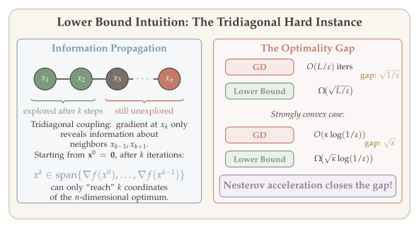
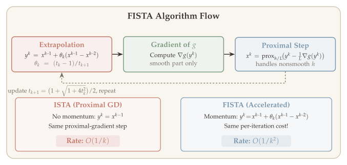

In the preceding chapters we established that gradient descent converges at a rate of $O(1/k)$ for smooth convex functions and at a linear rate of $O\!\bigl((1 - 1/\kappa)^k\bigr)$ for strongly convex functions with condition number $\kappa = L/\mu$. A natural question is: *can we do better?* Are these rates the best achievable by any first-order method, or is there room for improvement?

The idea of using *momentum* --- exploiting the history of past iterates to build inertia --- dates back to Polyak's **heavy-ball method**^[B. T. Polyak, "Some methods of speeding up the convergence of iteration methods," *USSR Computational Mathematics and Mathematical Physics*, 4(5):1--17, 1964.], which achieves optimal rates for quadratic functions. However, the full breakthrough came with Yurii Nesterov in 1983^[Y. Nesterov, "A method of solving a convex programming problem with convergence rate $O(1/k^2)$," *Soviet Mathematics Doklady*, 27(2):372--376, 1983.], who showed that a carefully designed momentum schedule can close the gap to information-theoretic lower bounds for *all* smooth convex functions. This chapter develops both methods: the heavy-ball method as a warm-up, and Nesterov's accelerated gradient method, which achieves an $O(1/k^2)$ rate for convex functions and an $O\!\bigl(\exp(-k/\sqrt{\kappa})\bigr)$ rate for strongly convex functions --- both provably optimal among first-order methods.

Acceleration is one of the most celebrated results in continuous optimization. Beyond its theoretical elegance, it has profound practical impact: the accelerated proximal gradient method (FISTA) is the workhorse algorithm for large-scale problems in signal processing, imaging, and machine learning. We will also study restart strategies that make acceleration robust in practice when the strong convexity parameter is unknown.

::: {.callout-tip}
## Companion Notebook

[](https://colab.research.google.com/github/ZhuoranYang/sds632-notes/blob/main/notebooks/accelerated-gradient.ipynb) A companion notebook accompanies this chapter with runnable Python implementations of Nesterov's accelerated gradient, FISTA for Lasso, momentum trajectory visualization, condition number dependence experiments, and adaptive restart strategies.
:::

## What Will Be Covered {#sec-overview}

- Issues with gradient descent and the idea of momentum
- The heavy-ball method (Polyak, 1964): optimal acceleration for quadratics
- Lower bounds for first-order methods and why gradient descent is suboptimal
- Nesterov's accelerated gradient method and its ODE interpretation
- Convergence analysis via Lyapunov functions
- FISTA: accelerated proximal gradient for composite optimization
- Restart strategies for practical acceleration

## Motivation {#sec-motivation}

### Recap: Gradient Descent Rates {#sec-gd-recap}

Recall from [Chapter 6](05-gradient-descent.qmd) the convergence rates of gradient descent $x^{k+1} = x^k - \frac{1}{L}\nabla f(x^k)$, where $f$ is $L$-smooth:

| **Setting** | **Convergence rate** |
|---|---|
| Convex, $L$-smooth | $f(x^k) - f(x^*) \leq \dfrac{L\|x^0 - x^*\|_2^2}{2k}$ |
| $\mu$-strongly convex, $L$-smooth | $f(x^k) - f(x^*) \leq \dfrac{L}{2}\Bigl(1 - \dfrac{\mu}{L}\Bigr)^k \|x^0 - x^*\|_2^2$ |

In terms of iteration complexity:

- **Convex:** $O(L/\varepsilon)$ iterations for an $\varepsilon$-suboptimal solution.
- **Strongly convex:** $O(\kappa \cdot \log(1/\varepsilon))$ iterations, where $\kappa = L/\mu$ is the condition number.

### Issues with Gradient Descent {#sec-gd-issues}

Can we do better? Two fundamental issues with gradient descent suggest the answer is yes:

1. **Short-sightedness.** Gradient descent focuses entirely on *local* improvement: each step minimizes a quadratic upper bound at the current point. This greedy strategy can be suboptimal globally --- a step that looks slightly worse locally might lead to much better progress overall.

2. **Zigzagging.** On ill-conditioned problems ($\kappa \gg 1$), gradient descent oscillates (zigzags) in the high-curvature directions while making slow progress in the low-curvature directions. The optimal step size $\alpha = 2/(L+\mu)$ reduces but does not eliminate this oscillation, leading to the $O(\kappa)$ dependence in the convergence rate.

A natural remedy is to **exploit the history** of past iterates: rather than determining $x^{k+1}$ solely from the gradient at $x^k$, we can incorporate a *momentum* term that accumulates information from previous steps, yielding a smoother trajectory and faster convergence. This is the core idea behind both the heavy-ball method and Nesterov's acceleration.

### First-Order Oracle Model {#sec-oracle-model}

To reason rigorously about whether gradient descent is optimal, we need to formalize what we mean by a "first-order method." The following model captures any algorithm that generates iterates using only gradient information accumulated so far.

::: {#def-first-order-oracle}
## First-Order Oracle Model
A **first-order method** generates iterates $x^0, x^1, x^2, \ldots$ such that
$$
x^k \in x^0 + \operatorname{span}\{\nabla f(x^0), \nabla f(x^1), \ldots, \nabla f(x^{k-1})\}.
$$ {#eq-first-order-span}
That is, each iterate lies in the affine subspace spanned by all previously observed gradients.
:::

This model captures gradient descent, momentum methods, conjugate gradient, and any method that combines past gradient information linearly.

### Lower Bounds for First-Order Methods {#sec-lower-bounds}

With the oracle model in hand, we can now ask: what is the fastest possible convergence rate achievable by *any* first-order method? The following classical results, due to Nesterov (1983), establish fundamental limits by constructing explicit "hard instances" --- functions for which no first-order method can converge faster than the stated rate.

::: {#thm-lower-bound-convex}
## Lower Bound (Convex, Smooth)
For any $k \leq (n-1)/2$ and any first-order method, there exists an $L$-smooth convex function $f:\mathbb{R}^n \to \mathbb{R}$ such that
$$
f(x^k) - f(x^*) \geq \frac{3L\|x^0 - x^*\|_2^2}{32(k+1)^2}.
$$ {#eq-lower-bound-convex}
:::

::: {#thm-lower-bound-strongly-convex}
## Lower Bound (Strongly Convex, Smooth)
For any $k \leq (n-1)/2$ and any first-order method, there exists a $\mu$-strongly convex, $L$-smooth function $f:\mathbb{R}^n \to \mathbb{R}$ such that
$$
f(x^k) - f(x^*) \geq \frac{\mu}{2}\left(\frac{\sqrt{\kappa} - 1}{\sqrt{\kappa} + 1}\right)^{2k} \|x^0 - x^*\|_2^2.
$$
:::

Both lower bounds follow the same proof strategy, which is worth understanding at a conceptual level before diving into the details.

**The minimax argument.** To show that *no* first-order method can converge faster than a given rate, it suffices to exhibit a *single* hard function for which *every* first-order method is slow. This is a worst-case (minimax) argument: if there exists even one function $f$ in the class (e.g., $L$-smooth convex) where every first-order method requires at least $T(\varepsilon)$ iterations for an $\varepsilon$-suboptimal point, then no first-order method can guarantee fewer than $T(\varepsilon)$ iterations on all functions in that class. In other words, we prove a lower bound by finding the *adversary's best response*: the hardest possible function.

**The hard instance.** Both constructions use explicit quadratic functions on $\mathbb{R}^n$ whose Hessians are **tridiagonal**. The tridiagonal structure creates an *information bottleneck*: gradient evaluations can only "see" neighboring coordinates, so starting from $x^0 = \mathbf{0}$, each iteration reveals at most one new coordinate direction. After $k$ iterations, the iterate $x^k$ lives in a $k$-dimensional subspace, but the optimum $x^*$ has all $n$ coordinates nonzero --- leaving a gap that cannot be closed faster than the stated rates. The proofs are elegant and illuminate why acceleration is necessary.

### Proof of @thm-lower-bound-convex (Convex Case) {#sec-lower-bound-convex-proof}

::: {.proof}
**Step 1 (Hard instance).** Define the $n \times n$ tridiagonal matrix

$$
A = \begin{pmatrix} 2 & -1 & & \\ -1 & 2 & -1 & \\ & \ddots & \ddots & \ddots \\ & & -1 & 1 \end{pmatrix},
$$

and consider the quadratic function $f(x) = \frac{L}{4}(x^\top A x - 2e_1^\top x)$ on $\mathbb{R}^n$ with $n \geq 2k+1$. Since $x^\top A x = x_1^2 + \sum_{i=1}^{n-1}(x_i - x_{i+1})^2 \geq 0$, the matrix $A$ is positive semidefinite, and one can verify $\|A\| \leq 4$ (the maximum row sum). Thus $f$ is convex and $L$-smooth.

The minimizer satisfies $Ax^* = e_1$. By direct substitution, $x^* = \mathbf{1}$ (the all-ones vector), since $(A\mathbf{1})_1 = 2 - 1 = 1$, $(A\mathbf{1})_i = -1 + 2 - 1 = 0$ for interior $i$, and $(A\mathbf{1})_n = -1 + 1 = 0$.

**Step 2 (Span property).** Starting from $x^0 = \mathbf{0}$, the gradient $\nabla f(\mathbf{0}) = -\frac{L}{2}e_1$ lies in $\operatorname{span}(e_1)$. Since $A$ is tridiagonal, multiplying by $A$ can introduce at most one new coordinate: if $v \in \operatorname{span}(e_1, \ldots, e_j)$, then $Av \in \operatorname{span}(e_1, \ldots, e_{j+1})$. By induction on the span condition ([-@eq-first-order-span]), after $k$ iterations of any first-order method:

$$
x^k \in \operatorname{span}(e_1, \ldots, e_k), \qquad \text{i.e.,} \quad x^k_i = 0 \;\text{ for all }\; i > k.
$$

**Step 3 (Subspace lower bound).** Since $f(x^k) - f(x^*) = \frac{L}{4}\|x^k - x^*\|_A^2$ (completing the square and using $Ax^* = e_1$), we need to lower-bound $\|x - x^*\|_A^2$ over all $x$ with $x_i = 0$ for $i > k$.

Using the quadratic form $x^\top A x = x_1^2 + \sum_{i=1}^{n-1}(x_i - x_{i+1})^2$ and the fact that $x^*_i = 1$ for all $i$ (so consecutive differences of $x^*$ vanish), we obtain

$$
\|x - x^*\|_A^2 = (x_1-1)^2 + \sum_{i=1}^{n-1}\big((x_i - 1) - (x_{i+1} - 1)\big)^2 = (x_1-1)^2 + \sum_{i=1}^{n-1}(x_i - x_{i+1})^2.
$$

Minimizing over $x_1, \ldots, x_k$ with $x_i = 0$ for $i > k$, the first-order conditions give a linear recurrence with solution

$$
x_i^{\mathrm{opt}} = 1 - \frac{i}{k+1}, \qquad i = 1, \ldots, k.
$$

The minimum value is $(x_1^{\mathrm{opt}} - 1)^2 + \sum_{i=1}^{k-1}\frac{1}{(k+1)^2} + (x_k^{\mathrm{opt}})^2 = \frac{k}{(k+1)^2} + \frac{1}{(k+1)^2} = \frac{1}{k+1}$.

**Step 4 (Conclude).** Therefore, for any first-order method,

$$
f(x^k) - f(x^*) \geq \frac{L}{4} \cdot \frac{1}{k+1}.
$$

Since $\|x^0 - x^*\|_2^2 = n \geq 2k + 1 \geq 2(k+1)$, we obtain

$$
f(x^k) - f(x^*) \geq \frac{L}{4(k+1)} \geq \frac{L\|x^0 - x^*\|_2^2}{8(k+1)^2}.
$$

This establishes the $\Omega(1/k^2)$ lower bound (the constant $3/32$ in @thm-lower-bound-convex comes from a tighter computation). $\blacksquare$
:::

### Proof of @thm-lower-bound-strongly-convex (Strongly Convex Case) {#sec-lower-bound-sc-proof}

::: {.proof}
The strongly convex case uses the same tridiagonal structure but brings in the elegant theory of **Chebyshev polynomials**.

**Step 1 (Hard instance).** Define the quadratic

$$
f(x) = \frac{1}{2}x^\top A x - e_1^\top x, \qquad A = \frac{L - \mu}{4}T + \mu I,
$$

where $T$ is the tridiagonal matrix from the convex case. Since $T \succeq 0$ and $\|T\| \leq 4$, the eigenvalues of $A$ lie in $[\mu,\, \mu + (L-\mu)] = [\mu, L]$. Thus $f$ is $\mu$-strongly convex and $L$-smooth. The minimizer is $x^* = A^{-1}e_1$.

**Step 2 (Krylov subspace property).** Starting from $x^0 = \mathbf{0}$, any first-order method produces iterates in the **Krylov subspace**:

$$
x^k \in \mathcal{K}_k(A, e_1) = \operatorname{span}(e_1,\, Ae_1,\, A^2 e_1,\, \ldots,\, A^{k-1}e_1).
$$

This follows from the span condition ([-@eq-first-order-span]) by induction: $\nabla f(x^0) = -e_1$, and each subsequent gradient $\nabla f(x^j) = Ax^j - e_1$ adds at most one power of $A$ to the span.

Therefore $x^k = q_{k-1}(A)e_1$ for some polynomial $q_{k-1}$ of degree $\leq k-1$.

**Step 3 (Reduction to polynomial approximation).** The error can be written as

$$
x^k - x^* = q_{k-1}(A)e_1 - A^{-1}e_1 = -\big(I - Aq_{k-1}(A)\big)A^{-1}e_1 = -p_k(A)\,x^*,
$$

where $p_k(t) = 1 - t\,q_{k-1}(t)$ is a polynomial of degree $\leq k$ satisfying $p_k(0) = 1$. The optimality gap becomes

$$
f(x^k) - f(x^*) = \frac{1}{2}\|p_k(A)\,x^*\|_A^2 = \frac{1}{2}\sum_{j=1}^n \lambda_j\, c_j^2\, p_k(\lambda_j)^2,
$$

where $\lambda_j$ are the eigenvalues of $A$, and $c_j = v_j^\top x^*$ are the components of $x^*$ in the eigenbasis. Since $A$ is tridiagonal and $e_1$ has nonzero projection onto every eigenvector, all $c_j \neq 0$. Therefore,

$$
\frac{f(x^k) - f(x^*)}{f(x^0) - f(x^*)} \geq \left(\min_{\substack{p_k:\,\deg p_k \leq k \\ p_k(0) = 1}} \;\max_{\lambda \in [\mu,\, L]}\; |p_k(\lambda)|\right)^{\!2}.
$$

**Step 4 (Chebyshev polynomial bound).** The classical minimax polynomial approximation on $[\mu, L]$ is solved by the **shifted Chebyshev polynomial**:

$$
p_k^*(t) = \frac{T_k\!\Big(\dfrac{L + \mu - 2t}{L - \mu}\Big)}{T_k\!\Big(\dfrac{L + \mu}{L - \mu}\Big)},
$$

where $T_k(\cos\theta) = \cos(k\theta)$ is the Chebyshev polynomial of the first kind. The minimax value is

$$
\min_{p_k:\, p_k(0)=1} \;\max_{t \in [\mu, L]}\; |p_k(t)| = \frac{1}{T_k\!\Big(\dfrac{L+\mu}{L-\mu}\Big)}.
$$

**Step 5 (Evaluate the Chebyshev bound).** Using $T_k(x) \geq \frac{1}{2}(x + \sqrt{x^2 - 1})^k$ for $x > 1$, we compute

$$
\frac{L+\mu}{L-\mu} + \sqrt{\left(\frac{L+\mu}{L-\mu}\right)^2 - 1} = \frac{L + \mu + 2\sqrt{L\mu}}{L - \mu} = \frac{(\sqrt{L} + \sqrt{\mu})^2}{(\sqrt{L} - \sqrt{\mu})(\sqrt{L} + \sqrt{\mu})} = \frac{\sqrt{\kappa} + 1}{\sqrt{\kappa} - 1}.
$$

Therefore $T_k\big(\frac{L+\mu}{L-\mu}\big) \geq \frac{1}{2}\big(\frac{\sqrt{\kappa}+1}{\sqrt{\kappa}-1}\big)^k$, and

$$
\frac{f(x^k) - f(x^*)}{f(x^0) - f(x^*)} \geq \frac{1}{T_k^2} \geq 4\left(\frac{\sqrt{\kappa} - 1}{\sqrt{\kappa} + 1}\right)^{2k}.
$$

Since $f(x^0) - f(x^*) = \frac{1}{2}\|x^*\|_A^2 \leq \frac{L}{2}\|x^0 - x^*\|_2^2$, we obtain the desired lower bound. $\blacksquare$
:::

{#fig-lower-bound-intuition}

The lower bounds give the following iteration complexity requirements:

| **Setting** | **GD rate** | **Lower bound** | **Gap** |
|---|---|---|---|
| Convex, $L$-smooth | $O(L/\varepsilon)$ | $\Omega(L/\sqrt{\varepsilon}\,)$ | $\sqrt{1/\varepsilon}$ |
| $\mu$-strongly convex, $L$-smooth | $O(\kappa\log(1/\varepsilon))$ | $\Omega(\sqrt{\kappa}\log(1/\varepsilon))$ | $\sqrt{\kappa}$ |

In both cases, the gap is a factor of a square root. Can we design first-order methods that close this gap? We begin with the **heavy-ball method**, which achieves the optimal rate for quadratic functions, and then present Nesterov's method, which achieves the optimal rate for *all* smooth convex functions.

## Heavy-Ball Method {#sec-heavy-ball}

The first momentum-based optimization method was proposed by Boris Polyak in 1964. The idea is intuitive: just as a heavy ball rolling downhill builds up inertia and can traverse flat regions more quickly, we add a momentum term to gradient descent that remembers the previous direction of travel.

### The Algorithm {#sec-heavy-ball-algorithm}

::: {.callout-important}
## Algorithm: Heavy-Ball Method (Polyak, 1964)
**Initialize:** $x^0, x^{-1} \in \mathbb{R}^n$ (typically $x^{-1} = x^0$).

**For** $k = 0, 1, 2, \ldots$:
$$
x^{k+1} = x^k - \eta\,\nabla f(x^k) + \theta\bigl(x^k - x^{k-1}\bigr).
$$ {#eq-heavy-ball}
:::

The update has two components: a **gradient step** $-\eta\,\nabla f(x^k)$ and a **momentum term** $\theta(x^k - x^{k-1})$ that pushes the iterate in the direction of the previous displacement. When $\theta = 0$, this reduces to standard gradient descent.

The momentum term serves as a *buffer* that smooths the trajectory: in the zigzagging regime, the oscillating gradient components tend to cancel in the momentum accumulation, while the consistently signed components reinforce each other. This dampens oscillations and amplifies progress in the correct direction.

### State-Space Analysis for Quadratics {#sec-heavy-ball-analysis}

To understand when and why heavy-ball accelerates, consider the quadratic
$$
f(x) = \frac{1}{2}(x - x^*)^\top Q\,(x - x^*),
$$
where $Q \succ 0$ has eigenvalues $\mu = \lambda_{\min}(Q) \leq \cdots \leq \lambda_{\max}(Q) = L$. Since $\nabla f(x) = Q(x - x^*)$, the heavy-ball update in terms of the error $e^k = x^k - x^*$ becomes
$$
e^{k+1} = (1 + \theta)e^k - \eta\,Q\,e^k - \theta\,e^{k-1} = \bigl[(1+\theta)I - \eta Q\bigr]\,e^k - \theta\,e^{k-1}.
$$

Introducing the augmented state $z^k = \begin{bmatrix} e^k \\ e^{k-1} \end{bmatrix}$, this becomes a **linear dynamical system**:
$$
z^{k+1} = H\,z^k, \qquad H = \begin{bmatrix} (1+\theta)I - \eta Q & -\theta\,I \\ I & 0 \end{bmatrix}.
$$ {#eq-heavy-ball-system}

The convergence rate is controlled by the **spectral radius** $\rho(H)$: we have $\|z^k\| \lesssim \rho(H)^k \|z^0\|$. Since $Q$ is symmetric, the system decouples in the eigenbasis of $Q$. For each eigenvalue $\lambda_i$ of $Q$, the corresponding $2 \times 2$ block is
$$
H_i = \begin{bmatrix} 1 + \theta - \eta\lambda_i & -\theta \\ 1 & 0 \end{bmatrix},
$$
with characteristic polynomial
$$
z^2 - (1 + \theta - \eta\lambda_i)\,z + \theta = 0.
$$ {#eq-heavy-ball-char}

The roots have product $\theta$ and sum $1 + \theta - \eta\lambda_i$. A key observation: if the discriminant $(1+\theta - \eta\lambda_i)^2 - 4\theta \leq 0$, then the two roots are complex conjugates with **equal magnitude** $\sqrt{\theta}$. If the discriminant is positive, the roots are real and the larger one exceeds $\sqrt{\theta}$.

Therefore, to minimize $\rho(H) = \max_i \rho(H_i)$, we want the discriminant to be non-positive for *every* eigenvalue $\lambda_i \in [\mu, L]$:
$$
(1 + \theta - \eta\lambda_i)^2 \leq 4\theta \qquad \text{for all } \lambda_i \in [\mu, L].
$$ {#eq-heavy-ball-condition}

This requires $-2\sqrt{\theta} \leq 1 + \theta - \eta\lambda_i \leq 2\sqrt{\theta}$, which gives $(1 - \sqrt{\theta})^2 \leq \eta\lambda_i \leq (1+\sqrt{\theta})^2$.

### Convergence of Heavy-Ball for Quadratics {#sec-heavy-ball-convergence}

::: {#thm-heavy-ball}
## Convergence of Heavy-Ball (Quadratic Functions)
Let $f(x) = \frac{1}{2}(x - x^*)^\top Q(x - x^*)$ where $Q$ is $\mu$-strongly convex and $L$-smooth with $\kappa = L/\mu$. Set
$$
\eta = \frac{4}{(\sqrt{L} + \sqrt{\mu})^2}, \qquad \theta = \left(\frac{\sqrt{\kappa} - 1}{\sqrt{\kappa} + 1}\right)^{\!2}.
$$
Then the heavy-ball iterates ([-@eq-heavy-ball]) satisfy
$$
\left\|\begin{bmatrix} x^{k+1} - x^* \\ x^k - x^* \end{bmatrix}\right\|_2 \lesssim \left(\frac{\sqrt{\kappa} - 1}{\sqrt{\kappa} + 1}\right)^k \left\|\begin{bmatrix} x^1 - x^* \\ x^0 - x^* \end{bmatrix}\right\|_2.
$$
In particular, the iteration complexity is $O(\sqrt{\kappa}\log(1/\varepsilon))$.
:::

::: {.proof}
We need to show $\rho(H) \leq (\sqrt{\kappa}-1)/(\sqrt{\kappa}+1)$ with the stated choice of $\eta$ and $\theta$.

**Step 1: Ensuring complex roots.** We need condition ([-@eq-heavy-ball-condition]) to hold for all $\lambda_i \in [\mu, L]$, i.e.,
$(1-\sqrt{\theta})^2 \leq \eta\mu$ and $\eta L \leq (1+\sqrt{\theta})^2$.

To minimize $\sqrt{\theta}$ (and hence maximize the convergence rate), we solve for equality at both endpoints simultaneously:
$$
\frac{(1-\sqrt{\theta})^2}{\mu} = \frac{(1+\sqrt{\theta})^2}{L} = \eta.
$$
Cross-multiplying: $(1-\sqrt{\theta})/(1+\sqrt{\theta}) = \sqrt{\mu/L} = 1/\sqrt{\kappa}$, which yields
$$
\sqrt{\theta} = \frac{\sqrt{\kappa} - 1}{\sqrt{\kappa} + 1}, \qquad \theta = \left(\frac{\sqrt{\kappa}-1}{\sqrt{\kappa}+1}\right)^{\!2}.
$$

**Step 2: Computing $\eta$.** From the equality $\eta L = (1+\sqrt{\theta})^2$:
$$
\eta = \frac{(1+\sqrt{\theta})^2}{L} = \frac{\left(1 + \frac{\sqrt{\kappa}-1}{\sqrt{\kappa}+1}\right)^2}{L} = \frac{\left(\frac{2\sqrt{\kappa}}{\sqrt{\kappa}+1}\right)^2}{L} = \frac{4\kappa}{L(\sqrt{\kappa}+1)^2} = \frac{4}{(\sqrt{L}+\sqrt{\mu})^2}.
$$

**Step 3: Spectral radius bound.** With these choices, all eigenvalues of $H_i$ are complex with magnitude exactly $\sqrt{\theta}$. Therefore:
$$
\rho(H) = \sqrt{\theta} = \frac{\sqrt{\kappa} - 1}{\sqrt{\kappa} + 1},
$$
which completes the proof. $\blacksquare$
:::

::: {.callout-note appearance="simple"}
**Comparison with gradient descent (strongly convex quadratics):**

| Method | Contraction rate | Iteration complexity |
|---|---|---|
| Gradient Descent | $\dfrac{\kappa - 1}{\kappa + 1} \approx 1 - \dfrac{2}{\kappa}$ | $O(\kappa \log(1/\varepsilon))$ |
| Heavy-Ball | $\dfrac{\sqrt{\kappa} - 1}{\sqrt{\kappa} + 1} \approx 1 - \dfrac{2}{\sqrt{\kappa}}$ | $O(\sqrt{\kappa} \log(1/\varepsilon))$ |

The heavy-ball method achieves a **quadratic improvement** in the dependence on $\kappa$, matching the lower bound from @thm-lower-bound-strongly-convex.
:::

### Limitations: Beyond Quadratics {#sec-heavy-ball-limitations}

Despite its elegant performance on quadratics, the heavy-ball method has fundamental limitations:

1. **Requires knowing $L$ and $\mu$.** The optimal parameters $\eta$ and $\theta$ depend on both the smoothness constant $L$ and the strong convexity parameter $\mu$. In practice, $\mu$ is often unknown or zero.

2. **Does not accelerate for general convex functions.** The state-space analysis exploits the *linearity* of the gradient $\nabla f(x) = Q(x - x^*)$ for quadratics. For general convex functions, the heavy-ball method with fixed $\eta, \theta$ can fail to achieve the $O(1/k^2)$ rate --- and may even diverge if the parameters are poorly tuned.

3. **No $O(1/k^2)$ rate in the convex (non-strongly-convex) case.** Unlike Nesterov's method, the heavy-ball method with constant momentum does not achieve the optimal $O(1/k^2)$ rate for convex functions when $\mu = 0$.

These limitations motivate the search for a more robust acceleration scheme. Nesterov's insight was to use a **time-varying** momentum coefficient that adapts as the algorithm progresses, yielding optimal rates for all smooth convex functions --- not just quadratics.

## Nesterov's Accelerated Gradient: Smooth Convex Case {#sec-nag-convex}

Having established that gradient descent leaves a $\sqrt{\kappa}$ gap relative to the lower bounds, and that the heavy-ball method closes this gap for quadratics but not general convex functions, we now present Nesterov's accelerated gradient method, which achieves optimal rates universally. The key innovation is a *time-varying* momentum coefficient that increases toward $1$ as the algorithm progresses.

### The Algorithm {#sec-nag-algorithm}

We consider the problem
$$
\min_{x \in \mathbb{R}^n} f(x),
$$
where $f$ is convex and $L$-smooth (i.e., $\nabla f$ is $L$-Lipschitz continuous).

::: {.callout-important}
## Algorithm: Nesterov's Accelerated Gradient (Convex Case)
**Initialize:** $x^0 = y^0 \in \mathbb{R}^n$, $\theta_0 = 1$.

**For** $k = 0, 1, 2, \ldots$:
$$
\begin{aligned}
y^{k+1} &= x^k - \frac{1}{L}\nabla f(x^k), \\
\theta_{k+1} &= \frac{1 + \sqrt{1 + 4\theta_k^2}}{2}, \\
x^{k+1} &= y^{k+1} + \frac{\theta_k - 1}{\theta_{k+1}}\bigl(y^{k+1} - y^k\bigr).
\end{aligned}
$$ {#eq-nag-convex}
The momentum coefficient $\beta_k = (\theta_k - 1)/\theta_{k+1}$ is time-varying and increasing. Since $\theta_k \geq (k+2)/2$, we have $\beta_k \approx k/(k+3)$ for large $k$, but the exact $\theta_k$ recursion is needed for the convergence proof.
:::

The following plot shows the $\theta_k$ sequence and the resulting momentum coefficient $\beta_k = (\theta_k - 1)/\theta_{k+1}$.

```{=html}
<div id="fig-theta-sequence" style="width:100%;max-width:720px;margin:auto;"></div>
<script>
(function(){
  const nK = 40;
  const theta = [1];
  for (let k = 0; k < nK; k++) theta.push((1 + Math.sqrt(1 + 4*theta[k]*theta[k])) / 2);
  const iters = Array.from({length: nK+1}, (_, i) => i);

  // Momentum coefficient beta_k = (theta_k - 1) / theta_{k+1}
  const beta = [], approx = [];
  for (let k = 0; k < nK; k++) {
    beta.push((theta[k] - 1) / theta[k+1]);
    approx.push(k / (k + 3));
  }
  const bIters = Array.from({length: nK}, (_, i) => i);

  const traces = [
    {x: iters, y: theta, mode: 'lines+markers', xaxis: 'x', yaxis: 'y',
     line: {color: '#7B97AD', width: 2.5}, marker: {size: 4, color: '#7B97AD'},
     name: '\u03B8\u2096', legendgroup: 'left', showlegend: true},
    {x: iters, y: iters.map(k => (k+2)/2), mode: 'lines', xaxis: 'x', yaxis: 'y',
     line: {color: '#C47A6A', width: 1.5, dash: 'dash'},
     name: '(k+2)/2 (lower bound)', legendgroup: 'left', showlegend: true},
    {x: bIters, y: beta, mode: 'lines+markers', xaxis: 'x2', yaxis: 'y2',
     line: {color: '#7B97AD', width: 2.5}, marker: {size: 4, color: '#7B97AD'},
     name: '\u03B2\u2096 = (\u03B8\u2096\u22121)/\u03B8\u2096\u208A\u2081', legendgroup: 'right', showlegend: true},
    {x: bIters, y: approx, mode: 'lines', xaxis: 'x2', yaxis: 'y2',
     line: {color: '#C47A6A', width: 1.5, dash: 'dash'},
     name: 'k/(k+3) (approx.)', legendgroup: 'right', showlegend: true},
  ];

  const layout = {
    grid: {rows: 1, columns: 2, pattern: 'independent'},
    xaxis: {title: 'k', domain: [0, 0.45], gridcolor: '#e8e2da', zerolinecolor: '#d5cdc4'},
    yaxis: {title: '\u03B8\u2096', gridcolor: '#e8e2da', zerolinecolor: '#d5cdc4'},
    xaxis2: {title: 'k', domain: [0.55, 1], gridcolor: '#e8e2da', zerolinecolor: '#d5cdc4'},
    yaxis2: {title: 'Momentum \u03B2\u2096', range: [0, 1.05], gridcolor: '#e8e2da', zerolinecolor: '#d5cdc4'},
    annotations: [
      {text: '<b>Growth of \u03B8\u2096</b>', x: 0.22, y: 1.08, xref: 'paper', yref: 'paper', showarrow: false, font: {size: 13, color: '#3D3530'}},
      {text: '<b>Momentum \u03B2\u2096 = (\u03B8\u2096\u22121)/\u03B8\u2096\u208A\u2081</b>', x: 0.77, y: 1.08, xref: 'paper', yref: 'paper', showarrow: false, font: {size: 13, color: '#3D3530'}}
    ],
    paper_bgcolor: 'rgba(0,0,0,0)', plot_bgcolor: '#faf7f3',
    font: {family: '"Source Serif 4", Georgia, serif', color: '#3d3530', size: 13},
    showlegend: true,
    legend: {x: 0.5, y: 0.02, xanchor: 'center', yanchor: 'bottom', orientation: 'h',
      bgcolor: '#faf7f3ee', bordercolor: '#d5cdc4', borderwidth: 1, font: {size: 11}},
    margin: {t: 40, b: 85, l: 55, r: 20},
    width: 720, height: 400
  };

  Plotly.newPlot('fig-theta-sequence', traces, layout, {responsive: true, displayModeBar: false});
})();
</script>
```

*Left: the sequence $\theta_k$ grows linearly, lower-bounded by $(k+2)/2$. Right: the momentum coefficient $\beta_k = (\theta_k - 1)/\theta_{k+1}$ increases toward $1$, closely tracking the approximation $k/(k+3)$. The exact $\theta_k$ recursion (not the approximation) is what makes the Lyapunov proof work.*

The algorithm maintains two sequences: $\{y^k\}$ (gradient steps) and $\{x^k\}$ (extrapolated points). The following table compares the update formulas side by side with the heavy-ball method, making the structural difference transparent:

|  | **Heavy-Ball** | **Nesterov's AGD** |
|---|---|---|
| **Step 1** | Gradient at *current* $x^k$ | Momentum (look-ahead) |
| | $\quad\to\; x^k - \eta\,\nabla f(x^k)$ | $\quad\to\; y^k = x^k + \beta_k(x^k - x^{k-1})$ |
| **Step 2** | Add momentum | Gradient at *look-ahead* $y^k$ |
| | $\quad\to\; x^{k+1} = x^k - \eta\,\nabla f(x^k) + \theta(x^k\!-\!x^{k-1})$ | $\quad\to\; x^{k+1} = y^k - \frac{1}{L}\nabla f(y^k)$ |
| **$\nabla f$ evaluated at** | Current iterate $x^k$ | Look-ahead point $y^k$ |
| **Momentum coeff.** | Fixed $\theta = \bigl(\frac{\sqrt{\kappa}-1}{\sqrt{\kappa}+1}\bigr)^2$ | Time-varying $\beta_k = \frac{\theta_k - 1}{\theta_{k+1}} \approx \frac{k}{k+3} \to 1$ |
| **Scope** | Quadratics only | All smooth convex $f$ |

: Structural comparison of heavy-ball and Nesterov's accelerated gradient. {#tbl-momentum-comparison .hover}

{#fig-momentum-comparison}

::: {.callout-tip}
## Remark: Comparison with Heavy-Ball
Two key differences separate Nesterov's method from heavy-ball:

1. **Order of operations.** Heavy-ball evaluates $\nabla f$ at the current iterate $x^k$ and adds momentum afterward. Nesterov first extrapolates to a look-ahead point $y^k$ and evaluates $\nabla f$ *there*, using more up-to-date curvature information.

2. **Time-varying momentum.** Heavy-ball uses a fixed coefficient $\theta$, which must be tuned to the (unknown) strong convexity $\mu$. Nesterov's coefficient $\beta_k = (\theta_k - 1)/\theta_{k+1}$ is *time-varying* and increasing toward $1$. This schedule is not chosen by hand — it is *derived* from the convergence analysis: the recursion $\theta_{k+1} = (1+\sqrt{1+4\theta_k^2})/2$ satisfies the key identity $\theta_k(\theta_k - 1) = \theta_{k-1}^2$ (see ([-@eq-theta-identity]) in the proof of @thm-nag-convex), which is precisely what makes the Lyapunov function decrease. Since $\theta_k \geq (k+2)/2$, the momentum coefficient satisfies $\beta_k \approx k/(k+3)$ for large $k$.

Together, these two innovations are what enable Nesterov's method to achieve optimal rates for *all* smooth convex functions, not just quadratics.
:::

### Interpretation via Differential Equations {#sec-ode-interpretation}

Nesterov's momentum coefficient $\beta_k = (\theta_k - 1)/\theta_{k+1} \approx k/(k+3) = 1 - 3/(k+3)$ is particularly mysterious at first sight. Why does it approach $1$ at a rate governed by the constant $3$? A beautiful explanation comes from the **continuous-time limit** of the algorithm, discovered by Su, Boyd, and Candès^[W. Su, S. Boyd, and E. J. Candès, "A differential equation for modeling Nesterov's accelerated gradient method: theory and insights," *Journal of Machine Learning Research*, 17(153):1--43, 2016.].

**Heuristic derivation.** We derive the ODE in three steps.

*Step 1: Rewrite the recursion.* Combining both lines of ([-@eq-nag-convex]) into a single recursion on $\{x^k\}$ and using step size $\eta = 1/L$, the update takes the form
$$
x^{k+1} - x^k = \frac{k-1}{k+2}\bigl(x^k - x^{k-1}\bigr) - \eta\,\nabla f(y^k).
$$
Dividing both sides by $\sqrt{\eta}$:
$$
\frac{x^{k+1} - x^k}{\sqrt{\eta}} = \frac{k-1}{k+2}\cdot\frac{x^k - x^{k-1}}{\sqrt{\eta}} - \sqrt{\eta}\,\nabla f(y^k).
$$

*Step 2: Pass to continuous time.* Introduce a continuous-time variable $\tau = k\sqrt{\eta}$, so that each discrete step corresponds to a time increment $\Delta\tau = \sqrt{\eta}$. Define $X(\tau) \approx x^k$ as the continuous interpolation. Taylor-expanding around $\tau$:
$$
x^{k+1} = X(\tau + \sqrt{\eta}) \approx X(\tau) + \dot{X}(\tau)\sqrt{\eta} + \tfrac{1}{2}\ddot{X}(\tau)\,\eta,
$$
so the finite differences become
$$
\frac{x^{k+1} - x^k}{\sqrt{\eta}} \approx \dot{X}(\tau) + \tfrac{1}{2}\ddot{X}(\tau)\sqrt{\eta}, \qquad \frac{x^k - x^{k-1}}{\sqrt{\eta}} \approx \dot{X}(\tau) - \tfrac{1}{2}\ddot{X}(\tau)\sqrt{\eta}.
$$
Meanwhile, the momentum coefficient satisfies $\frac{k-1}{k+2} = 1 - \frac{3}{k+2} \approx 1 - \frac{3\sqrt{\eta}}{\tau}$.

*Step 3: Substitute and simplify.* Plugging into the recursion:
$$
\dot{X} + \tfrac{1}{2}\ddot{X}\sqrt{\eta} \;\approx\; \Bigl(1 - \frac{3\sqrt{\eta}}{\tau}\Bigr)\!\Bigl(\dot{X} - \tfrac{1}{2}\ddot{X}\sqrt{\eta}\Bigr) - \sqrt{\eta}\,\nabla f(X).
$$
Expanding the right-hand side and collecting terms of order $\sqrt{\eta}$:
$$
\sqrt{\eta}\Bigl[\ddot{X} + \frac{3}{\tau}\dot{X} + \nabla f(X)\Bigr] \approx 0.
$$
Dividing by $\sqrt{\eta}$ yields the **second-order ODE**:
$$
\ddot{X}(\tau) + \frac{3}{\tau}\,\dot{X}(\tau) + \nabla f\bigl(X(\tau)\bigr) = 0.
$$ {#eq-nesterov-ode}

**Physical interpretation.** This is a **damped oscillator**: $\nabla f(X)$ acts as a restoring force pulling $X$ toward the minimizer, while $(3/\tau)\dot{X}$ is a time-varying *friction* that decreases as $\tau$ grows. The decreasing friction allows the system to build up momentum over time --- explaining why the discrete algorithm's momentum coefficient grows toward $1$.

**Convergence of the ODE.** Define the Lyapunov function
$$
\mathcal{E}(\tau) = \tau^2\bigl(f(X(\tau)) - f(x^*)\bigr) + 2\!\left\|X(\tau) + \frac{\tau}{2}\dot{X}(\tau) - x^*\right\|_2^2.
$$
We show in the appendix (see @sec-ode-lyapunov) that a direct computation using ([-@eq-nesterov-ode]) and convexity of $f$ gives $\dot{\mathcal{E}}(\tau) \leq 0$. Therefore $f(X(\tau)) - f(x^*) \leq \mathcal{E}(\tau)/\tau^2 \leq \mathcal{E}(0)/\tau^2 = O(1/\tau^2)$, recovering Nesterov's $O(1/k^2)$ rate in the continuous limit.

::: {.callout-note appearance="simple"}
**Connection to the discrete proof.** The continuous Lyapunov $\mathcal{E}(\tau)$ is the blueprint for the discrete one in @thm-nag-convex. The correspondence is:

| Continuous ($\tau = k\sqrt{\eta}$) | Discrete |
|---|---|
| $\tau^2$ | $\theta_{k-1}^2$ |
| $f(X(\tau)) - f(x^*)$ | $f(y^k) - f(x^*)$ |
| $X + \frac{\tau}{2}\dot{X} - x^*$ | $u^k = \theta_{k-1}(y^k - x^*) - (\theta_{k-1}-1)(y^{k-1} - x^*)$ |

The auxiliary sequence $u^k$ discretizes $X + \frac{\tau}{2}\dot{X} - x^*$ via the approximation $\dot{X} \approx (y^k - y^{k-1})/\sqrt{\eta}$. The discrete identity $\theta_k(\theta_k - 1) = \theta_{k-1}^2$ ([-@eq-theta-identity]) is the algebraic counterpart of the continuous condition $\dot{\mathcal{E}} \leq 0$.
:::

::: {.callout-tip}
## Remark: The Magic Number 3
The constant $3$ in ([-@eq-nesterov-ode]) is the *smallest* damping coefficient that guarantees $O(1/\tau^2)$ convergence. Replacing $3/\tau$ with $\alpha/\tau$ for any $\alpha \geq 3$ still yields $O(1/\tau^2)$, but $\alpha < 3$ does not. In this sense, $3$ minimizes the pre-constant in the convergence bound, and Nesterov's choice $\beta_k \approx k/(k+3)$ is the tightest possible momentum schedule.
:::

### Convergence Analysis {#sec-nag-convex-analysis}

We now establish the convergence rate of the accelerated gradient method ([-@eq-nag-convex]). The following theorem shows that it achieves an $O(1/k^2)$ convergence rate, which is a quadratic improvement over gradient descent and matches the lower bound from @thm-lower-bound-convex.

::: {#thm-nag-convex}
## Convergence of Accelerated Gradient (Convex)
Let $f$ be convex and $L$-smooth. Then the iterates of ([-@eq-nag-convex]) satisfy
$$
f(y^k) - f(x^*) \leq \frac{2L\|x^0 - x^*\|_2^2}{(k+1)^2}.
$$ {#eq-nag-convex-rate}
:::

::: {.callout-note appearance="simple"}
**Comparison with gradient descent:**

- **GD:** $f(x^k) - f(x^*) = O(1/k)$.
- **Accelerated GD:** $f(y^k) - f(x^*) = O(1/k^2)$.

This is a quadratic improvement in the convergence rate. In terms of iteration complexity, to achieve $f(y^k) - f(x^*) \leq \varepsilon$:

- **GD:** $k = O(L/\varepsilon)$.
- **Accelerated GD:** $k = O(\sqrt{L/\varepsilon})$.

The accelerated rate matches the lower bound ([-@eq-lower-bound-convex]) up to constants.
:::

::: {.proof}
We prove @thm-nag-convex by constructing a **Lyapunov function** (energy) that is non-increasing along the iterates --- a direct discretization of the continuous-time argument in @sec-ode-lyapunov. The proof reveals *where the momentum schedule comes from*: the $\theta_k$ recursion in the algorithm ([-@eq-nag-convex]) is uniquely determined by the requirement that the Lyapunov function decreases.

**Step 1: Fundamental inequality.** Since $y^{k+1} = x^k - \frac{1}{L}\nabla f(x^k)$, combining the descent lemma ($L$-smoothness) with convexity and completing the square yields: for **any** $z \in \mathbb{R}^n$,
$$
f(y^{k+1}) - f(z) \leq \frac{L}{2}\|z - x^k\|_2^2 - \frac{L}{2}\|z - y^{k+1}\|_2^2.
$$ {#eq-fundamental-ineq}
(This follows from: $f(y^{k+1}) \leq f(x^k) - \frac{1}{2L}\|\nabla f(x^k)\|^2 \leq f(z) + \langle \nabla f(x^k), x^k - z \rangle - \frac{1}{2L}\|\nabla f(x^k)\|^2 = f(z) + \frac{L}{2}\|z - x^k\|^2 - \frac{L}{2}\|z - y^{k+1}\|^2$, where the last equality uses $y^{k+1} = x^k - \frac{1}{L}\nabla f(x^k)$ to complete the square.)

**Step 2: The momentum sequence $\theta_k$.** Define $\theta_0 = 1$ and
$$
\theta_{k+1} = \frac{1 + \sqrt{1 + 4\theta_k^2}}{2}.
$$ {#eq-lambda-recursion}
This recursion is the positive root of $\theta_{k+1}^2 - \theta_{k+1} = \theta_k^2$, which we write as the **key algebraic identity**:
$$
\theta_k(\theta_k - 1) = \theta_{k-1}^2.
$$ {#eq-theta-identity}
By induction, $\theta_k \geq (k+2)/2$ for all $k \geq 0$. This is exactly the $\theta_k$ sequence used in the algorithm ([-@eq-nag-convex]), giving the momentum coefficient $\beta_k = (\theta_k - 1)/\theta_{k+1}$.

Where does this recursion come from? The answer emerges in Step 4: it is the *unique* choice that makes the Lyapunov function decrease.

**Step 3: Lyapunov function.** Define the auxiliary sequence
$$
u^k = \theta_{k-1}(y^k - x^*) - (\theta_{k-1} - 1)(y^{k-1} - x^*),
$$
with $u^1 = y^1 - x^*$ (since $\theta_0 = 1$). The Lyapunov function is
$$
\mathcal{E}_k = \theta_{k-1}^2\bigl(f(y^k) - f(x^*)\bigr) + \frac{L}{2}\|u^k\|_2^2.
$$
This combines the optimality gap (weighted by $\theta_{k-1}^2$) with a distance-like term. We will show $\mathcal{E}_{k+1} \leq \mathcal{E}_k$.

**Step 4: Lyapunov decrease (the key step).** Apply ([-@eq-fundamental-ineq]) with the specific choice
$$
z = \frac{1}{\theta_k}\,x^* + \left(1 - \frac{1}{\theta_k}\right)y^k.
$$
A direct computation using the definition of $u^k$ and the extrapolation $x^k = y^k + \beta_{k-1}(y^k - y^{k-1})$ shows:
$$
z - x^k = -\frac{u^k}{\theta_k}, \qquad z - y^{k+1} = -\frac{u^{k+1}}{\theta_k}.
$$
Substituting into ([-@eq-fundamental-ineq]):
$$
f(y^{k+1}) - f(z) \leq \frac{L}{2\theta_k^2}\bigl(\|u^k\|_2^2 - \|u^{k+1}\|_2^2\bigr).
$$
By convexity of $f$, the evaluation point $z$ satisfies $f(z) \leq \theta_k^{-1}f(x^*) + (1 - \theta_k^{-1})f(y^k)$, so
$$
f(y^{k+1}) - f(x^*) \leq \left(1 - \frac{1}{\theta_k}\right)\bigl(f(y^k) - f(x^*)\bigr) + \frac{L}{2\theta_k^2}\bigl(\|u^k\|_2^2 - \|u^{k+1}\|_2^2\bigr).
$$
Multiplying both sides by $\theta_k^2$ and using the identity $\theta_k(\theta_k - 1) = \theta_{k-1}^2$ from ([-@eq-theta-identity]):
$$
\theta_k^2\bigl(f(y^{k+1}) - f(x^*)\bigr) + \frac{L}{2}\|u^{k+1}\|_2^2 \leq \theta_{k-1}^2\bigl(f(y^k) - f(x^*)\bigr) + \frac{L}{2}\|u^k\|_2^2.
$$
That is, $\mathcal{E}_{k+1} \leq \mathcal{E}_k$. *This is where the identity ([-@eq-theta-identity]) --- and hence the $\theta_k$ recursion --- is essential: it is precisely the algebraic condition needed for the weighted optimality gap to telescope.*

**Step 5: Concluding the rate.** Telescoping from $k$ down to $1$: $\mathcal{E}_k \leq \mathcal{E}_1$. Since $\theta_0 = 1$ and $u^1 = y^1 - x^*$:
$$
\mathcal{E}_1 = f(y^1) - f(x^*) + \frac{L}{2}\|y^1 - x^*\|_2^2.
$$
Applying ([-@eq-fundamental-ineq]) at $k = 0$ with $z = x^*$: $f(y^1) - f(x^*) \leq \frac{L}{2}\|x^0 - x^*\|_2^2 - \frac{L}{2}\|y^1 - x^*\|_2^2$. Thus $\mathcal{E}_1 \leq \frac{L}{2}\|x^0 - x^*\|_2^2$.

Therefore:
$$
\theta_{k-1}^2\bigl(f(y^k) - f(x^*)\bigr) \leq \mathcal{E}_k \leq \frac{L}{2}\|x^0 - x^*\|_2^2.
$$
Since $\theta_{k-1} \geq (k+1)/2$:
$$
f(y^k) - f(x^*) \leq \frac{L\|x^0 - x^*\|_2^2}{2\theta_{k-1}^2} \leq \frac{2L\|x^0 - x^*\|_2^2}{(k+1)^2}.
$$
$\blacksquare$
:::

::: {.callout-tip}
## Remark: Why "Acceleration" is Mysterious
Unlike gradient descent, the accelerated method does **not** guarantee monotone decrease of $f(x^k)$. The function values can oscillate. The proof works through a carefully constructed Lyapunov function rather than a descent argument. This makes acceleration fundamentally different from standard gradient methods, and its deep mechanism remains an active area of research.
:::

### Visualization: GD vs. Accelerated GD {#sec-visualization}

The following plot compares gradient descent and Nesterov's accelerated gradient on a $50$-dimensional quadratic $f(x) = \frac{1}{2}\sum_{i=1}^{50} \lambda_i x_i^2$ with eigenvalues uniformly spaced in $[\mu, L]$, giving condition number $\kappa = L/\mu = 500$. With such a large condition number, GD makes painfully slow progress while AGD converges dramatically faster.

```{=html}
<div id="fig-all-methods" style="width:100%;max-width:720px;margin:auto;"></div>
<script>
(function(){
  const L = 500, mu = 1, kappa = L/mu;
  const nIter = 500;
  const n = 50;
  const eigenvals = Array.from({length: n}, (_, i) => mu + (L - mu) * i / (n - 1));
  const x0 = eigenvals.map(() => 1);
  function fval(z) { return 0.5 * eigenvals.reduce((s, l, i) => s + l*z[i]*z[i], 0); }
  const f0 = fval(x0);

  // 1. GD (step = 1/L)
  let xGD = [...x0];
  const gdF = [f0];
  for (let k = 0; k < nIter; k++) {
    xGD = xGD.map((xi, i) => xi - (1/L) * eigenvals[i] * xi);
    gdF.push(fval(xGD));
  }

  // 2. Nesterov AGD (convex variant: exact theta_k recursion)
  let xAC = [...x0], yAC = [...x0], thetaAC = 1;
  const acF = [f0];
  for (let k = 0; k < nIter; k++) {
    const yNew = xAC.map((xi, i) => xi - (1/L) * eigenvals[i] * xi);
    const thetaNew = (1 + Math.sqrt(1 + 4*thetaAC*thetaAC)) / 2;
    const mom = (thetaAC - 1) / thetaNew;
    const xNew = yNew.map((yi, i) => yi + mom * (yi - yAC[i]));
    yAC = yNew; xAC = xNew; thetaAC = thetaNew;
    acF.push(fval(yAC));
  }

  // 3. O(1/k) and O(1/k^2) reference lines
  const refGD = [], refAGD = [];
  for (let k = 0; k <= nIter; k++) {
    refGD.push(k === 0 ? f0 : f0 * 2 * L / (mu * k));      // O(L/(mu*k)) = O(kappa/k)
    refAGD.push(k === 0 ? f0 : f0 * 2 * L / ((k+1)*(k+1)));  // O(L/k^2)
  }

  const iters = Array.from({length: nIter+1}, (_, i) => i);
  const traces = [
    {x: iters, y: gdF.map(v => Math.max(v, 1e-16)), mode: 'lines',
     line: {color: '#C47A6A', width: 2.5}, name: 'GD (step 1/L)'},
    {x: iters, y: acF.map(v => Math.max(Math.abs(v), 1e-16)), mode: 'lines',
     line: {color: '#7B97AD', width: 2.5}, name: 'Nesterov AGD'},
    {x: iters, y: refGD.map(v => Math.max(v, 1e-16)), mode: 'lines',
     line: {color: '#C47A6A', width: 1, dash: 'dot'}, name: 'O(1/k) rate'},
    {x: iters, y: refAGD.map(v => Math.max(v, 1e-16)), mode: 'lines',
     line: {color: '#7B97AD', width: 1, dash: 'dot'}, name: 'O(1/k\u00B2) rate'},
  ];

  const layout = {
    title: {text: 'GD vs. Nesterov AGD on Quadratic (n=50, \u03BA=500)', font: {size: 15, color: '#3D3530'}},
    xaxis: {title: {text: 'Iteration k', font: {size: 14}}, range: [0, nIter], gridcolor: '#e8e2da', zerolinecolor: '#d5cdc4'},
    yaxis: {title: {text: 'f(x\u1D4F) \u2212 f(x*)', font: {size: 14}}, type: 'log', gridcolor: '#e8e2da', zerolinecolor: '#d5cdc4'},
    paper_bgcolor: 'rgba(0,0,0,0)', plot_bgcolor: '#faf7f3',
    font: {family: '"Source Serif 4", Georgia, serif', color: '#3d3530', size: 13},
    showlegend: true,
    legend: {x: 0.55, y: 0.98, bgcolor: '#faf7f3ee', bordercolor: '#d5cdc4', borderwidth: 1, font: {size: 12}},
    margin: {t: 50, b: 55, l: 70, r: 20},
    width: 720, height: 480
  };

  Plotly.newPlot('fig-all-methods', traces, layout, {responsive: true, displayModeBar: false});
})();
</script>
```

*GD vs. Nesterov AGD on a 50-dimensional quadratic with $\kappa = 500$. **GD** (red) converges at the $O(1/k)$ rate --- barely reducing the error over $500$ iterations. **Nesterov AGD** (blue) converges at the much faster $O(1/k^2)$ rate, with the oscillations characteristic of the momentum mechanism. Dotted lines show the theoretical rates for reference.*

## Acceleration for Strongly Convex Functions {#sec-nag-strongly-convex}

When $f$ is additionally $\mu$-strongly convex ($\mu > 0$), we can exploit the strong convexity to obtain a **linear** convergence rate with improved dependence on the condition number.

### The Algorithm {#sec-nag-sc-algorithm}

::: {.callout-important}
## Algorithm: Nesterov's Accelerated Gradient (Strongly Convex Case)
**Initialize:** $x^0 = y^0 \in \mathbb{R}^n$. Set $q = \mu/L$ and $\gamma = \frac{\sqrt{q}}{1+\sqrt{q}} = \frac{\sqrt{\mu/L}}{1+\sqrt{\mu/L}}$.

**For** $k = 0, 1, 2, \ldots$:
$$
\begin{aligned}
y^{k+1} &= x^k - \frac{1}{L}\nabla f(x^k), \\
x^{k+1} &= y^{k+1} + \frac{1-\gamma}{1+\gamma}\bigl(y^{k+1} - y^k\bigr).
\end{aligned}
$$ {#eq-nag-sc}
:::

::: {.callout-tip}
## Remark: Fixed Momentum Coefficient
In contrast to the convex case where the momentum coefficient $\beta_k = (\theta_k - 1)/\theta_{k+1}$ is time-varying, the strongly convex case uses a **fixed** momentum coefficient
$$
\beta = \frac{1-\gamma}{1+\gamma} = \frac{\sqrt{\kappa} - 1}{\sqrt{\kappa} + 1},
$$
where $\kappa = L/\mu$. When $\kappa$ is large, $\beta \approx 1 - 2/\sqrt{\kappa}$, which is close to $1$.
:::

### Convergence Analysis {#sec-nag-sc-analysis}

::: {#thm-nag-sc}
## Convergence of Accelerated Gradient (Strongly Convex)
Let $f$ be $\mu$-strongly convex and $L$-smooth with $\kappa = L/\mu$. Then the iterates of ([-@eq-nag-sc]) satisfy
$$
f(y^k) - f(x^*) \leq \frac{L + \mu}{2}\|x^0 - x^*\|_2^2 \cdot \left(\frac{\sqrt{\kappa} - 1}{\sqrt{\kappa} + 1}\right)^{2k}.
$$ {#eq-nag-sc-rate}
In particular, to achieve $f(y^k) - f(x^*) \leq \varepsilon$, we need
$$
k = O\!\left(\sqrt{\kappa} \cdot \log\frac{1}{\varepsilon}\right)
$$
iterations.
:::

::: {.proof}
We use a Lyapunov function that contracts *geometrically* at each step, paralleling the convex proof but with the constant momentum $\beta = \frac{\sqrt{\kappa}-1}{\sqrt{\kappa}+1}$ replacing the time-varying $\theta_k$ schedule.

**Step 1: Setup.** Define $\lambda = \frac{\sqrt{\kappa}-1}{\sqrt{\kappa}+1}$ and the Lyapunov function
$$
\mathcal{E}_k = f(y^k) - f(x^*) + \frac{\mu}{2}\|v^k - x^*\|_2^2,
$$
where $v^k$ is an auxiliary sequence satisfying the recursion
$$
v^{k+1} = \frac{1}{1+\gamma}\bigl(v^k + \gamma\, y^{k+1} - \gamma\, \tfrac{1}{\mu}\nabla f(x^k)\bigr), \qquad \gamma = \sqrt{q} = \sqrt{\mu/L},
$$
with $v^0 = x^0$.

**Step 2: Fundamental inequality (strongly convex).** Since $y^{k+1} = x^k - \frac{1}{L}\nabla f(x^k)$, the descent lemma and $\mu$-strong convexity give: for any $z$,
$$
f(y^{k+1}) - f(z) \leq \frac{L}{2}\|z - x^k\|_2^2 - \frac{L}{2}\|z - y^{k+1}\|_2^2 - \frac{\mu}{2}\|x^k - z\|_2^2.
$$

**Step 3: Lyapunov contraction.** Evaluate the inequality at $z = \frac{\gamma}{1+\gamma}v^k + \frac{1}{1+\gamma}y^k$ (a convex combination analogous to the choice $z = \theta_k^{-1}x^* + (1-\theta_k^{-1})y^k$ in the convex proof). Using the extrapolation formula $x^k = y^k + \beta(y^k - y^{k-1})$ and the recursion for $v^k$, a computation analogous to Steps 3--4 of the convex proof yields:
$$
f(y^{k+1}) - f(x^*) + \frac{\mu}{2}\|v^{k+1} - x^*\|_2^2 \leq (1-\gamma)\left(f(y^k) - f(x^*) + \frac{\mu}{2}\|v^k - x^*\|_2^2\right).
$$
That is, $\mathcal{E}_{k+1} \leq (1 - \gamma)\,\mathcal{E}_k$. The contraction factor $1 - \gamma = 1 - \sqrt{\mu/L} = \frac{\sqrt{\kappa}-1}{\sqrt{\kappa}} \leq \lambda^2$.

**Step 4: Telescoping.** By induction, $\mathcal{E}_k \leq (1-\gamma)^k \mathcal{E}_0$. Since $\mathcal{E}_0 = f(y^0) - f(x^*) + \frac{\mu}{2}\|x^0 - x^*\|_2^2 \leq \frac{L+\mu}{2}\|x^0 - x^*\|_2^2$:
$$
f(y^k) - f(x^*) \leq \mathcal{E}_k \leq \frac{L+\mu}{2}\|x^0 - x^*\|_2^2 \cdot (1-\gamma)^k \leq \frac{L+\mu}{2}\|x^0-x^*\|_2^2\cdot\left(\frac{\sqrt{\kappa}-1}{\sqrt{\kappa}+1}\right)^{2k}.
$$
Since $\frac{\sqrt{\kappa}-1}{\sqrt{\kappa}+1} \leq \exp\!\bigl(-1/\sqrt{\kappa}\bigr)$, we obtain the $O(\sqrt{\kappa}\log(1/\varepsilon))$ complexity. $\blacksquare$
:::

::: {.callout-note appearance="simple"}
**Summary of rates (smooth optimization):**

| Method | Convex | Strongly Convex ($\kappa = L/\mu$) |
|---|---|---|
| Gradient Descent | $O(1/k)$ | $O\!\bigl((1-1/\kappa)^k\bigr)$ |
| Accelerated GD | $O(1/k^2)$ | $O\!\bigl((({\sqrt\kappa-1})/({\sqrt\kappa+1}))^{2k}\bigr)$ |
| Lower Bound | $\Omega(1/k^2)$ | $\Omega\!\bigl((({\sqrt\kappa-1})/({\sqrt\kappa+1}))^{2k}\bigr)$ |

The accelerated gradient method is **optimal** among first-order methods in both settings.
:::

The following plot compares GD, heavy-ball, and Nesterov AGD (strongly convex) on a $50$-dimensional quadratic with $\kappa = 500$. All three methods use the optimal step size $1/L$; the accelerated methods additionally use knowledge of $\mu$.

```{=html}
<div id="fig-sc-methods" style="width:100%;max-width:720px;margin:auto;"></div>
<script>
(function(){
  const L = 500, mu = 1, kappa = L/mu;
  const nIter = 300;
  const n = 50;
  const eigenvals = Array.from({length: n}, (_, i) => mu + (L - mu) * i / (n - 1));
  const x0 = eigenvals.map(() => 1);
  function fval(z) { return 0.5 * eigenvals.reduce((s, l, i) => s + l*z[i]*z[i], 0); }
  const f0 = fval(x0);

  // 1. GD (step = 1/L)
  let xGD = [...x0];
  const gdF = [f0];
  for (let k = 0; k < nIter; k++) {
    xGD = xGD.map((xi, i) => xi - (1/L) * eigenvals[i] * xi);
    gdF.push(fval(xGD));
  }

  // 2. Heavy-ball (optimal params for quadratic)
  const etaHB = 4 / Math.pow(Math.sqrt(L) + Math.sqrt(mu), 2);
  const betaHB = Math.pow((Math.sqrt(kappa) - 1) / (Math.sqrt(kappa) + 1), 2);
  let xHB = [...x0], xHBp = [...x0];
  const hbF = [f0];
  for (let k = 0; k < nIter; k++) {
    const xNew = xHB.map((xi, i) =>
      xi - etaHB * eigenvals[i] * xi + betaHB * (xi - xHBp[i])
    );
    xHBp = [...xHB]; xHB = xNew;
    hbF.push(fval(xHB));
  }

  // 3. Nesterov AGD (strongly convex variant: fixed momentum)
  const gamma = Math.sqrt(mu/L);
  const betaSC = (1 - gamma) / (1 + gamma);
  let xSC = [...x0], ySC = [...x0];
  const scF = [f0];
  for (let k = 0; k < nIter; k++) {
    const yNew = xSC.map((xi, i) => xi - (1/L) * eigenvals[i] * xi);
    const xNew = yNew.map((yi, i) => yi + betaSC * (yi - ySC[i]));
    ySC = yNew; xSC = xNew;
    scF.push(fval(ySC));
  }

  const iters = Array.from({length: nIter+1}, (_, i) => i);
  const traces = [
    {x: iters, y: gdF.map(v => Math.max(v, 1e-16)), mode: 'lines',
     line: {color: '#C47A6A', width: 2.5}, name: 'GD (step 1/L)'},
    {x: iters, y: hbF.map(v => Math.max(Math.abs(v), 1e-16)), mode: 'lines',
     line: {color: '#7A9A7E', width: 2.5}, name: 'Heavy-ball (optimal \u03B7, \u03B8)'},
    {x: iters, y: scF.map(v => Math.max(Math.abs(v), 1e-16)), mode: 'lines',
     line: {color: '#7B97AD', width: 2.5}, name: 'Nesterov AGD-SC (\u03B2 = (\u221A\u03BA\u22121)/(\u221A\u03BA+1))'},
  ];

  const layout = {
    title: {text: 'Strongly Convex: GD vs. Heavy-Ball vs. Nesterov AGD (\u03BA=500)', font: {size: 14, color: '#3D3530'}},
    xaxis: {title: {text: 'Iteration k', font: {size: 14}}, range: [0, nIter], gridcolor: '#e8e2da', zerolinecolor: '#d5cdc4'},
    yaxis: {title: {text: 'f(x\u1D4F) \u2212 f(x*)', font: {size: 14}}, type: 'log', gridcolor: '#e8e2da', zerolinecolor: '#d5cdc4'},
    paper_bgcolor: 'rgba(0,0,0,0)', plot_bgcolor: '#faf7f3',
    font: {family: '"Source Serif 4", Georgia, serif', color: '#3d3530', size: 13},
    showlegend: true,
    legend: {x: 0.3, y: 0.98, bgcolor: '#faf7f3ee', bordercolor: '#d5cdc4', borderwidth: 1, font: {size: 12}},
    margin: {t: 50, b: 55, l: 70, r: 20},
    width: 720, height: 480
  };

  Plotly.newPlot('fig-sc-methods', traces, layout, {responsive: true, displayModeBar: false});
})();
</script>
```

*Three methods on a 50-dimensional quadratic with $\kappa = 500$. **GD** (red) converges at the slow linear rate $(1-1/\kappa)^k$. Both **heavy-ball** (green) and **Nesterov AGD-SC** (blue) achieve the accelerated rate $O\bigl((\frac{\sqrt{\kappa}-1}{\sqrt{\kappa}+1})^{2k}\bigr) \approx O(e^{-2k/\sqrt{\kappa}})$, which is dramatically faster. Heavy-ball requires exact knowledge of both $L$ and $\mu$; Nesterov's method also requires $\mu$ but is more robust to misspecification (see @sec-rippling).*

::: {.callout-note}
## Historical Note: Nesterov's Estimate Sequence Technique

Nesterov's original 1983 proof used a more abstract framework called **estimate sequences**: one constructs a sequence of quadratic upper bounds $\phi_k(x)$ satisfying $\phi_k(x) \leq (1-\lambda_k)f(x) + \lambda_k \phi_0(x)$, and designs the algorithm so that $f(x^k) \leq \min_x \phi_k(x)$. This immediately gives $f(x^k) - f(x^*) \leq \lambda_k[\phi_0(x^*) - f(x^*)]$, and the rate is controlled by how fast $\lambda_k \to 0$. The estimate sequence framework is the most general approach --- it unifies the convex, strongly convex, and composite cases --- but the Lyapunov analysis presented above is more direct and better suited for a first encounter. See Chapter 2 of Nesterov's *Introductory Lectures on Convex Optimization* (2004) for the full treatment.
:::

## Accelerated Proximal Gradient (FISTA) {#sec-fista}

We now extend acceleration to the **composite** optimization problem studied in [Chapter 8](07-proximal-gradient.qmd):
$$
\min_{x \in \mathbb{R}^n}\; F(x) = g(x) + h(x),
$$ {#eq-composite}
where:

- $g$ is convex and $L$-smooth (differentiable with $L$-Lipschitz gradient),
- $h$ is convex, possibly non-smooth, but has an easy-to-compute proximal operator.

Recall from [Chapter 8](07-proximal-gradient.qmd) that the **proximal gradient** (ISTA) update is:
$$
x^{k+1} = \operatorname{prox}_{\frac{1}{L}h}\!\left(x^k - \frac{1}{L}\nabla g(x^k)\right),
$$ {#eq-ista-update}
which converges at rate $O(1/k)$.

### FISTA: Fast Iterative Shrinkage-Thresholding Algorithm {#sec-fista-algorithm}

::: {.callout-important}
## Algorithm: FISTA^[A. Beck and M. Teboulle, "A fast iterative shrinkage-thresholding algorithm for linear inverse problems," *SIAM Journal on Imaging Sciences*, 2(1):183--202, 2009.]
**Initialize:** $x^0 = y^1 \in \mathbb{R}^n$, $\theta_1 = 1$.

**For** $k = 1, 2, \ldots$:
$$
\begin{aligned}
x^k &= \operatorname{prox}_{\frac{1}{L}h}\!\left(y^k - \frac{1}{L}\nabla g(y^k)\right), \\
\theta_{k+1} &= \frac{1 + \sqrt{1 + 4\theta_k^2}}{2}, \\
y^{k+1} &= x^k + \frac{\theta_k - 1}{\theta_{k+1}}\bigl(x^k - x^{k-1}\bigr).
\end{aligned}
$$ {#eq-fista}
:::

{#fig-fista-flow}

::: {.callout-tip}
## Remark: Structure of FISTA
FISTA has the same structure as Nesterov's accelerated gradient ([-@eq-nag-convex]), but replaces the gradient step with the proximal-gradient step ([-@eq-ista-update]):

1. Compute a proximal-gradient step from the extrapolated point $y^k$.
2. Extrapolate using momentum with coefficient $(\theta_k - 1)/\theta_{k+1}$.

The $\theta_k$ sequence is *identical* to the one in ([-@eq-lambda-recursion]) --- the same recursion, the same initial value $\theta_1 = 1$, and the same momentum schedule. There is no need to introduce separate notation: FISTA is simply Nesterov's AGD with the gradient step replaced by a proximal-gradient step.
:::

### Convergence of FISTA {#sec-fista-convergence}

The following theorem confirms that FISTA achieves the same $O(1/k^2)$ accelerated rate as Nesterov's method (compare ([-@eq-nag-convex-rate])), but for the composite objective $F = g + h$ defined in ([-@eq-composite]).

::: {#thm-fista}
## Convergence of FISTA
Let $g$ be convex and $L$-smooth, $h$ be closed and convex. Then FISTA satisfies
$$
F(x^k) - F(x^*) \leq \frac{2L\|x^0 - x^*\|_2^2}{(k+1)^2}.
$$
:::

::: {.proof}
The proof follows the same Lyapunov strategy as @thm-nag-convex. The key step is replacing the smooth fundamental inequality ([-@eq-fundamental-ineq]) with a composite analogue.

**Step 1: Fundamental proximal inequality.** We need to show: for any $z$,
$$
F(x^k) \leq F(z) + \frac{L}{2}\|z - y^k\|_2^2 - \frac{L}{2}\|x^k - y^k\|_2^2.
$$ {#eq-fista-key}

*Derivation.* Since $x^k = \operatorname{prox}_{h/L}(y^k - \frac{1}{L}\nabla g(y^k))$, its optimality condition states: there exists $\xi \in \partial h(x^k)$ such that $L(y^k - x^k) - \nabla g(y^k) = \xi$. By $L$-smoothness of $g$ (descent lemma):
$$
g(x^k) \leq g(y^k) + \langle \nabla g(y^k), x^k - y^k \rangle + \frac{L}{2}\|x^k - y^k\|_2^2.
$$
Adding $h(x^k)$ to both sides and using convexity of $g$ at $z$ ($g(y^k) \leq g(z) + \langle \nabla g(y^k), y^k - z\rangle$):
$$
F(x^k) \leq g(z) + \langle \nabla g(y^k), x^k - z \rangle + \frac{L}{2}\|x^k - y^k\|_2^2 + h(x^k).
$$
Since $\xi = L(y^k - x^k) - \nabla g(y^k)$ and $h(z) \geq h(x^k) + \langle \xi, z - x^k\rangle$ (convexity of $h$):
$$
h(x^k) \leq h(z) - \langle L(y^k - x^k) - \nabla g(y^k), z - x^k\rangle.
$$
Substituting and completing the square (exactly as in the smooth case) yields ([-@eq-fista-key]).

**Step 2: Lyapunov decrease.** Since $\theta_k$ satisfies the same recursion ([-@eq-lambda-recursion]) and identity $\theta_k(\theta_k - 1) = \theta_{k-1}^2$, define
$$
u^k = \theta_{k-1}(x^k - x^*) - (\theta_{k-1} - 1)(x^{k-1} - x^*), \qquad \mathcal{E}_k = \theta_{k-1}^2\bigl(F(x^k) - F(x^*)\bigr) + \frac{L}{2}\|u^k\|_2^2.
$$
Applying ([-@eq-fista-key]) with $z = \theta_k^{-1}x^* + (1 - \theta_k^{-1})x^k$, the same algebra as Steps 4--5 of @thm-nag-convex (using convexity of $F$ at $z$ and the identity $\theta_k(\theta_k - 1) = \theta_{k-1}^2$) gives $\mathcal{E}_{k+1} \leq \mathcal{E}_k$.

**Step 3: Conclude.** Telescoping: $\mathcal{E}_k \leq \mathcal{E}_1 \leq \frac{L}{2}\|x^0 - x^*\|_2^2$. Since $\theta_{k-1} \geq (k+1)/2$:
$$
F(x^k) - F(x^*) \leq \frac{L\|x^0 - x^*\|_2^2}{2\theta_{k-1}^2} \leq \frac{2L\|x^0 - x^*\|_2^2}{(k+1)^2}.
$$
$\blacksquare$
:::

### Example: Accelerated LASSO {#sec-lasso-example}

To illustrate FISTA concretely, we apply it to the LASSO problem --- one of the most widely used composite optimization problems in statistics and machine learning. The LASSO objective decomposes naturally into a smooth quadratic loss $g$ and a non-smooth $\ell_1$ penalty $h$, making it a perfect fit for the FISTA update ([-@eq-fista]).

::: {#exm-lasso}
## FISTA for LASSO
Consider the LASSO problem:
$$
\min_{x \in \mathbb{R}^n}\; \frac{1}{2}\|Ax - b\|_2^2 + \lambda\|x\|_1.
$$
Here $g(x) = \frac{1}{2}\|Ax - b\|_2^2$ is $L$-smooth with $L = \|A^\top A\|$ (largest eigenvalue of $A^\top A$), and $h(x) = \lambda\|x\|_1$.

The proximal operator of $h$ is the **soft-thresholding** operator:
$$
\operatorname{prox}_{\alpha h}(x)_j = \operatorname{sign}(x_j)\max\{|x_j| - \alpha\lambda,\, 0\}, \quad j = 1, \ldots, n.
$$

FISTA for LASSO becomes:
$$
\begin{aligned}
x^k &= \mathcal{S}_{\lambda/L}\!\left(y^k - \frac{1}{L}A^\top(Ay^k - b)\right), \\
\theta_{k+1} &= \frac{1 + \sqrt{1 + 4\theta_k^2}}{2}, \\
y^{k+1} &= x^k + \frac{\theta_k - 1}{\theta_{k+1}}(x^k - x^{k-1}),
\end{aligned}
$$
where $\mathcal{S}_\tau(x)_j = \operatorname{sign}(x_j)\max\{|x_j| - \tau, 0\}$ is the soft-thresholding operator.

ISTA converges at rate $O(1/k)$ while FISTA converges at $O(1/k^2)$.
:::

```{=html}
<div id="fig-ista-vs-fista" style="width:100%;max-width:720px;margin:auto;"></div>
<script>
(function(){
  // Actual LASSO simulation: min 0.5*||Ax-b||^2 + lam*||x||_1
  // Diagonal A for efficiency, eigenvalues from mu to L
  const n = 30, L = 20, mu = 1, lam = 0.3;
  const aSquared = Array.from({length: n}, (_, i) => mu + (L - mu) * i / (n - 1));
  // b chosen so unconstrained min at x=2, LASSO shrinks toward 0
  const b = aSquared.map(a2 => Math.sqrt(a2) * 2);
  const x0 = new Array(n).fill(0);

  function soft(z, thr) { return Math.sign(z) * Math.max(Math.abs(z) - thr, 0); }
  function fval(x) {
    let g = 0, h = 0;
    for (let i = 0; i < n; i++) {
      const r = Math.sqrt(aSquared[i]) * x[i] - b[i];
      g += 0.5 * r * r;
      h += lam * Math.abs(x[i]);
    }
    return g + h;
  }

  // Compute F* approximately by running many FISTA iterations
  let xOpt = [...x0], yOpt = [...x0], tOpt = 1;
  for (let k = 0; k < 2000; k++) {
    const gradY = yOpt.map((yi, i) => aSquared[i] * yi - Math.sqrt(aSquared[i]) * b[i]);
    const xNew = yOpt.map((yi, i) => soft(yi - gradY[i] / L, lam / L));
    const tNew = (1 + Math.sqrt(1 + 4*tOpt*tOpt)) / 2;
    const yNew = xNew.map((xi, i) => xi + (tOpt - 1) / tNew * (xi - xOpt[i]));
    xOpt = xNew; yOpt = yNew; tOpt = tNew;
  }
  const fStar = fval(xOpt);

  const nIter = 200;

  // ISTA (proximal gradient, step 1/L)
  let xI = [...x0];
  const istaF = [fval(x0) - fStar];
  for (let k = 0; k < nIter; k++) {
    const gradX = xI.map((xi, i) => aSquared[i] * xi - Math.sqrt(aSquared[i]) * b[i]);
    xI = xI.map((xi, i) => soft(xi - gradX[i] / L, lam / L));
    istaF.push(fval(xI) - fStar);
  }

  // FISTA
  let xF = [...x0], yF = [...x0], tF = 1;
  const fistaF = [fval(x0) - fStar];
  for (let k = 0; k < nIter; k++) {
    const gradY = yF.map((yi, i) => aSquared[i] * yi - Math.sqrt(aSquared[i]) * b[i]);
    const xNew = yF.map((yi, i) => soft(yi - gradY[i] / L, lam / L));
    const tNew = (1 + Math.sqrt(1 + 4*tF*tF)) / 2;
    const yNew = xNew.map((xi, i) => xi + (tF - 1) / tNew * (xi - xF[i]));
    xF = xNew; yF = yNew; tF = tNew;
    fistaF.push(fval(xF) - fStar);
  }

  const iters = Array.from({length: nIter+1}, (_, i) => i);
  const traces = [
    {x: iters, y: istaF.map(v => Math.max(v, 1e-10)), mode: 'lines',
     line: {color: '#C47A6A', width: 2.5}, name: 'ISTA (Proximal GD)'},
    {x: iters, y: fistaF.map(v => Math.max(v, 1e-10)), mode: 'lines',
     line: {color: '#7B97AD', width: 2.5}, name: 'FISTA (Accelerated)'},
  ];

  const layout = {
    title: {text: 'ISTA vs. FISTA on LASSO (actual simulation, n=30)', font: {size: 14, color: '#3D3530'}},
    xaxis: {title: {text: 'Iteration k', font: {size: 14}}, range: [0, nIter], gridcolor: '#e8e2da', zerolinecolor: '#d5cdc4'},
    yaxis: {title: {text: 'F(x\u1D4F) \u2212 F(x*)', font: {size: 14}}, type: 'log', range: [-8, 2], gridcolor: '#e8e2da', zerolinecolor: '#d5cdc4'},
    paper_bgcolor: 'rgba(0,0,0,0)', plot_bgcolor: '#faf7f3',
    font: {family: '"Source Serif 4", Georgia, serif', color: '#3d3530', size: 13},
    showlegend: true,
    legend: {x: 0.45, y: 0.98, bgcolor: '#faf7f3ee', bordercolor: '#d5cdc4', borderwidth: 1, font: {size: 13}},
    margin: {t: 50, b: 55, l: 70, r: 20},
    width: 700, height: 460
  };

  Plotly.newPlot('fig-ista-vs-fista', traces, layout, {responsive: true, displayModeBar: false});
})();
</script>
```

*Figure 9.4: ISTA vs. FISTA on a 30-dimensional LASSO problem ($\kappa = 20$, $\lambda = 0.3$). Unlike the theoretical curves, the actual FISTA trajectory shows characteristic non-monotone oscillations while still converging quadratically faster than ISTA overall.*

### Rippling: Effect of Misspecified Momentum {#sec-rippling}

A practical challenge with the strongly convex variant ([-@eq-nag-sc]) is that it requires knowing $\mu$. If we use a guess $\widehat{\mu}$ in place of $\mu$, the momentum becomes $\beta = (\sqrt{\kappa_{\text{est}}}-1)/(\sqrt{\kappa_{\text{est}}}+1)$ where $\kappa_{\text{est}} = L/\widehat{\mu}$. Two failure modes arise:

- **$\widehat{\mu} < \mu$ (overestimating $\kappa$, too much momentum):** the iterates overshoot, producing characteristic *ripples* whose period scales as $\sqrt{L/\mu}$.
- **$\widehat{\mu} > \mu$ (underestimating $\kappa$, too little momentum):** convergence is slower but smoother --- we sacrifice the rate improvement but remain stable.

```{=html}
<div id="fig-rippling" style="width:100%;max-width:720px;margin:auto;"></div>
<script>
(function(){
  const L = 100, mu = 1, kappa = L/mu; // kappa = 100
  const n = 30;
  const eigenvals = Array.from({length: n}, (_, i) => mu + (L - mu) * i / (n - 1));
  const x0 = eigenvals.map(() => 1);
  function fval(z) { return 0.5 * eigenvals.reduce((s, l, i) => s + l*z[i]*z[i], 0); }
  const f0 = fval(x0);
  const nIter = 400;

  function runAGD(muGuess) {
    const gamma = Math.sqrt(muGuess / L);
    const beta = (1 - gamma) / (1 + gamma);
    let xn = [...x0], yn = [...x0];
    const fVals = [f0];
    for (let k = 0; k < nIter; k++) {
      const yNew = xn.map((xi, i) => xi - (1/L) * eigenvals[i] * xi);
      const xNew = yNew.map((yi, i) => yi + beta * (yi - yn[i]));
      yn = yNew; xn = xNew;
      fVals.push(fval(yn));
    }
    return fVals;
  }

  const iters = Array.from({length: nIter+1}, (_, i) => i);
  const traces = [
    {x: iters, y: runAGD(mu).map(v => Math.max(Math.abs(v), 1e-16)),
     mode: 'lines', line: {color: '#3D3530', width: 2.5},
     name: '\u03BC\u0302 = \u03BC (optimal, \u03BA=100)'},
    {x: iters, y: runAGD(mu/10).map(v => Math.max(Math.abs(v), 1e-16)),
     mode: 'lines', line: {color: '#7B97AD', width: 2},
     name: '\u03BC\u0302 = \u03BC/10 (too much momentum)'},
    {x: iters, y: runAGD(mu/100).map(v => Math.max(Math.abs(v), 1e-16)),
     mode: 'lines', line: {color: '#B8995E', width: 2},
     name: '\u03BC\u0302 = \u03BC/100 (strong rippling)'},
    {x: iters, y: runAGD(10*mu).map(v => Math.max(Math.abs(v), 1e-16)),
     mode: 'lines', line: {color: '#C47A6A', width: 2},
     name: '\u03BC\u0302 = 10\u03BC (too little momentum)'},
  ];

  const layout = {
    title: {text: 'Effect of Misspecified \u03BC on Nesterov AGD-SC (\u03BA = 100)', font: {size: 14, color: '#3D3530'}},
    xaxis: {title: {text: 'Iteration k', font: {size: 14}}, range: [0, nIter], gridcolor: '#e8e2da', zerolinecolor: '#d5cdc4'},
    yaxis: {title: {text: 'f(y\u1D4F) \u2212 f(x*)', font: {size: 14}}, type: 'log', gridcolor: '#e8e2da', zerolinecolor: '#d5cdc4'},
    paper_bgcolor: 'rgba(0,0,0,0)', plot_bgcolor: '#faf7f3',
    font: {family: '"Source Serif 4", Georgia, serif', color: '#3d3530', size: 13},
    showlegend: true,
    legend: {x: 0.3, y: 0.98, bgcolor: '#faf7f3ee', bordercolor: '#d5cdc4', borderwidth: 1, font: {size: 12}},
    margin: {t: 50, b: 55, l: 70, r: 20},
    width: 720, height: 480
  };

  Plotly.newPlot('fig-rippling', traces, layout, {responsive: true, displayModeBar: false});
})();
</script>
```

*Rippling behavior when the strong convexity parameter is misspecified on a quadratic with true $\kappa = 100$. **Black:** optimal $\widehat{\mu} = \mu$ gives fast, smooth convergence. **Blue/gold:** underestimating $\mu$ (using $\widehat{\mu} = \mu/10$ or $\mu/100$) creates oscillations from excessive momentum. **Red:** overestimating $\mu$ ($\widehat{\mu} = 10\mu$) gives slower but stable convergence. This asymmetry motivates the restart strategies below.*

## Restart Strategies {#sec-restart}

The convergence guarantees established in @thm-nag-convex and @thm-nag-sc assume exact knowledge of problem parameters. In practice, the convex-case AGD ([-@eq-nag-convex]) has a key limitation: its momentum $\beta_k = (\theta_k - 1)/\theta_{k+1} \to 1$ grows monotonically, eventually causing **oscillations** when the function is actually strongly convex. Meanwhile, the strongly convex variant ([-@eq-nag-sc]) requires knowing $\mu$, which is often unavailable.

**Restart** techniques resolve this dilemma: run the convex-case AGD, but periodically **reset the momentum to zero** (i.e., set $\theta \leftarrow 1$ and $y^k \leftarrow x^k$). Each restart launches a fresh AGD run from the current iterate, giving a new $O(1/k^2)$ convergence phase. If restarts are timed well, these polynomial phases compound into linear convergence.

### Gradient Restart {#sec-gradient-restart}

The most effective adaptive restart criterion uses the gradient to detect overshoot:

::: {.callout-important}
## Algorithm: Nesterov AGD with Gradient Restart^[B. O'Donoghue and E. Candes, "Adaptive restart for accelerated gradient schemes," *Foundations of Computational Mathematics*, 15(3):715--732, 2015.]
**Initialize:** $x^0 = y^0 \in \mathbb{R}^n$, $\theta = 1$.

**For** $k = 0, 1, 2, \ldots$:

1. **Gradient step:** $y^{k+1} = x^k - \frac{1}{L}\nabla f(x^k)$.
2. **Update $\theta$:** $\theta_{\text{new}} = \frac{1 + \sqrt{1 + 4\theta^2}}{2}$.
3. **Extrapolation:** $x^{k+1} = y^{k+1} + \frac{\theta - 1}{\theta_{\text{new}}}(y^{k+1} - y^k)$.
4. **Restart check:** If $\langle \nabla f(y^{k+1}),\, x^{k+1} - x^k \rangle > 0$, then:
$$
\text{reset:} \quad x^{k+1} \leftarrow y^{k+1}, \quad \theta \leftarrow 1.
$$
   Otherwise: $\theta \leftarrow \theta_{\text{new}}$.
:::

**Why this condition works.** The momentum direction $x^{k+1} - x^k$ is the step taken by extrapolation. The gradient $\nabla f(y^{k+1})$ points in the direction of steepest *ascent*. When $\langle \nabla f(y^{k+1}), x^{k+1} - x^k \rangle > 0$, the extrapolation step has a positive component along the ascent direction --- the momentum is pushing the iterates *uphill*. This is the signature of overshoot: the method has passed the valley floor and is climbing the opposite wall. Resetting $\theta \leftarrow 1$ kills the momentum and starts a fresh AGD phase from $y^{k+1}$.

::: {.callout-tip}
## Remark: Other Restart Schemes

- **Function restart:** restart when $f(y^{k+1}) > f(y^k)$. Simpler but less sensitive --- it waits until the objective actually increases, which may be too late.
- **Speed restart:** restart when $\|y^{k+1} - y^k\| < \|y^k - y^{k-1}\|$. The iterates are slowing down, suggesting the method is oscillating.
- **Fixed-frequency restart:** restart every $T$ iterations. Requires choosing $T \approx \sqrt{\kappa}$, which needs knowledge of $\kappa$.
:::

### Why Restart Gives Linear Convergence {#sec-restart-benefits}

::: {#thm-restart}
## Convergence with Restart
If $f$ is $\mu$-strongly convex and $L$-smooth but $\mu$ is unknown, applying the convex-case accelerated method ([-@eq-nag-convex]) with **fixed-frequency restart** every $T = \Theta(\sqrt{\kappa})$ iterations yields
$$
f(y^k) - f(x^*) \leq C \cdot \exp\!\left(-\frac{k}{\sqrt{\kappa}}\right)\bigl(f(x^0) - f(x^*)\bigr),
$$
achieving the same $O(\sqrt{\kappa}\log(1/\varepsilon))$ complexity as the strongly convex variant ([-@eq-nag-sc-rate]).
:::

::: {.proof}
**Sketch.** Within each restart phase of $T$ iterations, the convex-case AGD guarantee (@thm-nag-convex) gives $f(y^T) - f(x^*) \leq 2L\|x^0_{\text{phase}} - x^*\|^2 / T^2$. By strong convexity, $\|x^0_{\text{phase}} - x^*\|^2 \leq (2/\mu)(f(x^0_{\text{phase}}) - f(x^*))$. Combining: each phase reduces the gap by a factor of $4L/(\mu T^2) = 4\kappa/T^2$. Choosing $T = 2\sqrt{\kappa}$ gives a contraction factor $\leq 1$ per phase, and after $k/T$ phases: $f - f^* \leq (4\kappa/T^2)^{k/T}(f^0 - f^*) = e^{-k/(2\sqrt{\kappa})} \cdot \text{const}$. $\blacksquare$
:::

In practice, the adaptive gradient restart criterion triggers at approximately the right frequency without needing to know $\kappa$, often outperforming both the convex-case AGD (which ignores strong convexity) and the SC variant (which requires knowing $\mu$).

```{=html}
<div id="fig-restart" style="width:100%;max-width:720px;margin:auto;"></div>
<script>
(function(){
  const L = 100, mu = 1, kappa = L/mu;
  const n = 30;
  const eigenvals = Array.from({length: n}, (_, i) => mu + (L - mu) * i / (n - 1));
  const x0 = eigenvals.map(() => 1);
  function fval(z) { return 0.5 * eigenvals.reduce((s, l, i) => s + l*z[i]*z[i], 0); }
  const f0 = fval(x0);
  const nIter = 500;

  function runAGD(useRestart) {
    let xn = [...x0], yn = [...x0];
    const fVals = [f0];
    let th = 1;
    for (let k = 0; k < nIter; k++) {
      const yNew = xn.map((xi, i) => xi - (1/L) * eigenvals[i] * xi);
      const thNew = (1 + Math.sqrt(1 + 4*th*th)) / 2;
      const mom = (th - 1) / thNew;
      const xNew = yNew.map((yi, i) => yi + mom * (yi - yn[i]));

      let doRestart = false;
      if (useRestart && th > 1.5) {
        const gY = yNew.map((yi, i) => eigenvals[i] * yi);
        const momDir = xNew.map((xi, i) => xi - xn[i]);
        const ip = gY.reduce((s, g, i) => s + g * momDir[i], 0);
        if (ip > 0) doRestart = true;
      }

      if (doRestart) {
        yn = yNew; xn = [...yNew]; th = 1;
      } else {
        yn = yNew; xn = xNew; th = thNew;
      }
      fVals.push(fval(yn));
    }
    return fVals;
  }

  // GD for reference
  let xGD = [...x0];
  const gdF = [f0];
  for (let k = 0; k < nIter; k++) {
    xGD = xGD.map((xi, i) => xi - (1/L) * eigenvals[i] * xi);
    gdF.push(fval(xGD));
  }

  const iters = Array.from({length: nIter+1}, (_, i) => i);
  const traces = [
    {x: iters, y: gdF.map(v => Math.max(v, 1e-16)), mode: 'lines',
     line: {color: '#7B7067', width: 1.5, dash: 'dot'}, name: 'GD'},
    {x: iters, y: runAGD(false).map(v => Math.max(Math.abs(v), 1e-16)), mode: 'lines',
     line: {color: '#C47A6A', width: 2}, name: 'AGD (no restart)'},
    {x: iters, y: runAGD(true).map(v => Math.max(Math.abs(v), 1e-16)), mode: 'lines',
     line: {color: '#7B97AD', width: 2.5}, name: 'AGD + gradient restart'},
  ];

  const layout = {
    title: {text: 'Gradient Restart on Strongly Convex Quadratic (\u03BA = 100)', font: {size: 15, color: '#3D3530'}},
    xaxis: {title: {text: 'Iteration k', font: {size: 14}}, range: [0, nIter], gridcolor: '#e8e2da', zerolinecolor: '#d5cdc4'},
    yaxis: {title: {text: 'f(y\u1D4F) \u2212 f(x*)', font: {size: 14}}, type: 'log', gridcolor: '#e8e2da', zerolinecolor: '#d5cdc4'},
    paper_bgcolor: 'rgba(0,0,0,0)', plot_bgcolor: '#faf7f3',
    font: {family: '"Source Serif 4", Georgia, serif', color: '#3d3530', size: 13},
    showlegend: true,
    legend: {x: 0.4, y: 0.98, bgcolor: '#faf7f3ee', bordercolor: '#d5cdc4', borderwidth: 1, font: {size: 12}},
    margin: {t: 50, b: 55, l: 70, r: 20},
    width: 720, height: 480
  };

  Plotly.newPlot('fig-restart', traces, layout, {responsive: true, displayModeBar: false});
})();
</script>
```

*Gradient restart on a strongly convex quadratic ($\kappa = 100$). **GD** (dotted) converges at the slow rate $(1-1/\kappa)^k$. **AGD without restart** (red) uses the convex-case momentum and converges at $O(1/k^2)$ with characteristic oscillations --- it does not exploit strong convexity. **AGD with gradient restart** (blue) detects each overshoot via $\langle \nabla f, \text{momentum direction}\rangle > 0$, resets $\theta \leftarrow 1$, and achieves linear convergence --- recovering the optimal $O(\sqrt{\kappa}\log(1/\varepsilon))$ rate without knowing $\mu$.*

## Summary and Connections {#sec-summary}

### Key Results {#sec-key-results}

::: {.callout-note appearance="simple"}
**Main takeaways from this lecture:**

1. **Heavy-ball method** (Polyak, 1964): Adding momentum $\theta(x^k - x^{k-1})$ with *fixed* parameters achieves $O(\sqrt{\kappa}\log(1/\varepsilon))$ for quadratics but does not generalize to all convex functions.

2. **Lower bounds** show that gradient descent is suboptimal by a factor of $\sqrt{\kappa}$ (or $\sqrt{1/\varepsilon}$ in the convex case). The tridiagonal hard instances create an information bottleneck.

3. **Nesterov's accelerated gradient** (1983) achieves the optimal rate among first-order methods using *time-varying* momentum:
   - Convex: $O(1/k^2)$ vs. $O(1/k)$ for GD.
   - Strongly convex: $O(\exp(-k/\sqrt{\kappa}))$ vs. $O(\exp(-k/\kappa))$ for GD.

4. **The ODE perspective** (Su, Boyd, Candes 2014) explains the momentum coefficient: Nesterov's method discretizes $\ddot{X} + (3/\tau)\dot{X} + \nabla f(X) = 0$, where $3$ is the smallest damping constant giving $O(1/\tau^2)$ convergence.

5. **Convergence via Lyapunov functions**: The $\theta_k$ recursion $\theta_k^2 - \theta_k = \theta_{k-1}^2$ is *derived* from the Lyapunov decrease requirement, not assumed. The same proof handles both smooth and composite (FISTA) settings.

6. **FISTA** extends acceleration to composite problems $\min\; g(x) + h(x)$, and **restart strategies** make acceleration practical when $\mu$ is unknown.
:::

### Connections to Other Lectures {#sec-connections}

| **Chapter** | **Connection to Acceleration** |
|---|---|
| [Chapter 6](05-gradient-descent.qmd) (GD) | Acceleration improves GD's rate by $\sqrt{\kappa}$ |
| [Chapter 7](06-subgradient.qmd) (Subgradient) | Acceleration does **not** apply to non-smooth optimization without smoothing |
| [Chapter 8](07-proximal-gradient.qmd) (Proximal GD) | FISTA = accelerated proximal gradient |
| [Chapter 9](08-mirror-descent.qmd) (Mirror Descent) | Accelerated mirror descent exists but requires more sophisticated analysis |

### Open Directions {#sec-open}

::: {.callout-tip}
## Remark: Modern Perspectives on Acceleration

1. **Acceleration via coupling** (Allen-Zhu and Orecchia, 2017): Acceleration can be understood as coupling mirror descent with gradient descent --- a viewpoint that connects to [Chapter 9](08-mirror-descent.qmd).

2. **Catalyst framework** (Lin, Mairal, Harchaoui, 2015): Any first-order method can be "accelerated" by wrapping it in a proximal point outer loop.

3. **Integral quadratic constraints** (Lessard, Recht, Packard, 2016): The heavy-ball and Nesterov methods can be analyzed in a unified framework using tools from robust control theory.

4. **Acceleration for saddle-point problems and minimax optimization** extends these ideas to the non-convex and game-theoretic settings studied in modern machine learning.
:::

## First-Order Methods: Master Comparison {.unnumbered}

| Method | Problem Class | Rate (convex) | Rate (strongly convex) | Per-Iteration Cost | Key Feature |
|--------|--------------|---------------|----------------------|-------------------|-------------|
| Gradient Descent | Smooth | $O(1/k)$ | $O((1-\mu/L)^k)$ | 1 gradient | Simplest baseline |
| Subgradient | Lipschitz | $O(1/\sqrt{k})$ | $O(1/\sqrt{k})$ | 1 subgradient | Handles non-smooth |
| Proximal Gradient | Composite $f+g$ | $O(1/k)$ | $O((1-\mu/L)^k)$ | 1 gradient + 1 prox | Exploits structure |
| Mirror Descent | Simplex/geometry | $O(\sqrt{\log n / k})$ | --- | 1 gradient + mirror map | Dimension-adaptive |
| Heavy-Ball | Smooth quadratic | --- | $O((1-\sqrt{\mu/L})^k)$ | 1 gradient | Optimal for quadratics |
| Nesterov's AGD | Smooth | $O(1/k^2)$ | $O((1-\sqrt{\mu/L})^k)$ | 1 gradient | Optimal rate |
| FISTA | Composite $f+g$ | $O(1/k^2)$ | $O((1-\sqrt{\mu/L})^k)$ | 1 gradient + 1 prox | Accelerated proximal |
| **Lower bound** | **Smooth convex** | $\Omega(1/k^2)$ | $\Omega((1-\sqrt{\mu/L})^k)$ | --- | **Cannot do better** |

*Here $L$ is the smoothness constant, $\mu$ is the strong convexity parameter, and $n$ is the dimension.*

## Appendix: ODE Lyapunov Computation {#sec-ode-lyapunov .unnumbered}

We verify that the Lyapunov function
$$
\mathcal{E}(\tau) = \tau^2\bigl(f(X) - f(x^*)\bigr) + 2\left\|X + \frac{\tau}{2}\dot{X} - x^*\right\|^2
$$
is non-increasing along solutions of the ODE $\ddot{X} + \frac{3}{\tau}\dot{X} + \nabla f(X) = 0$.

**Setup.** Write $\mathcal{E} = A + B$ where $A = \tau^2(f(X) - f^*)$ and $B = 2\|V\|^2$ with $V = X + \frac{\tau}{2}\dot{X} - x^*$.

**Differentiating $A$.** By the chain rule:
$$
\dot{A} = 2\tau(f(X) - f^*) + \tau^2\langle \nabla f(X),\, \dot{X}\rangle.
$$

**Differentiating $B$.** First compute $\dot{V}$:
$$
\dot{V} = \dot{X} + \frac{1}{2}\dot{X} + \frac{\tau}{2}\ddot{X} = \frac{3}{2}\dot{X} + \frac{\tau}{2}\ddot{X}.
$$
Substituting the ODE $\ddot{X} = -\frac{3}{\tau}\dot{X} - \nabla f(X)$:
$$
\dot{V} = \frac{3}{2}\dot{X} + \frac{\tau}{2}\!\left(-\frac{3}{\tau}\dot{X} - \nabla f(X)\right) = \frac{3}{2}\dot{X} - \frac{3}{2}\dot{X} - \frac{\tau}{2}\nabla f(X) = -\frac{\tau}{2}\nabla f(X).
$$
Therefore:
$$
\dot{B} = 2 \cdot 2\langle V,\, \dot{V}\rangle = 4\!\left\langle X + \frac{\tau}{2}\dot{X} - x^*,\; -\frac{\tau}{2}\nabla f(X)\right\rangle = -2\tau\langle X - x^* + \frac{\tau}{2}\dot{X},\; \nabla f(X)\rangle.
$$

**Combining.** Adding $\dot{A} + \dot{B}$:
$$
\dot{\mathcal{E}} = 2\tau(f(X) - f^*) + \tau^2\langle \nabla f(X), \dot{X}\rangle - 2\tau\langle X - x^*, \nabla f(X)\rangle - \tau^2\langle \dot{X}, \nabla f(X)\rangle.
$$
The $\tau^2\langle \nabla f(X), \dot{X}\rangle$ terms cancel:
$$
\dot{\mathcal{E}} = 2\tau\bigl[f(X) - f^* - \langle \nabla f(X),\, X - x^*\rangle\bigr].
$$
By **convexity** of $f$: $f(x^*) \geq f(X) + \langle \nabla f(X), x^* - X\rangle$, i.e., $f(X) - f^* - \langle \nabla f(X), X - x^*\rangle \leq 0$. Since $\tau \geq 0$:
$$
\dot{\mathcal{E}}(\tau) \leq 0.
$$

This confirms $\mathcal{E}$ is non-increasing. Since $\tau^2(f(X) - f^*) \leq \mathcal{E}(\tau) \leq \mathcal{E}(0)$, we get $f(X(\tau)) - f^* = O(1/\tau^2)$, which is the continuous analogue of the $O(1/k^2)$ rate. $\blacksquare$

## Appendix: Chebyshev Polynomials {#sec-chebyshev .unnumbered}

The lower bound proof for strongly convex functions (@thm-lower-bound-strongly-convex) relies on **Chebyshev polynomials**, which solve the minimax polynomial approximation problem. We collect their key properties here.

### Definition and Recurrence {.unnumbered}

::: {#def-chebyshev}
## Chebyshev Polynomials of the First Kind
The **Chebyshev polynomial** $T_k$ of degree $k$ is defined by
$$
T_k(\cos\theta) = \cos(k\theta), \qquad \theta \in [0, \pi].
$$
Equivalently, for $|x| \leq 1$: $T_k(x) = \cos(k\arccos x)$.
:::

The first few Chebyshev polynomials are:
$$
T_0(x) = 1, \quad T_1(x) = x, \quad T_2(x) = 2x^2 - 1, \quad T_3(x) = 4x^3 - 3x, \quad T_4(x) = 8x^4 - 8x^2 + 1.
$$

They satisfy the **three-term recurrence**:
$$
T_{k+1}(x) = 2x\,T_k(x) - T_{k-1}(x), \qquad k \geq 1.
$$

```{=html}
<div id="fig-chebyshev" style="width:100%;max-width:720px;margin:auto;"></div>
<script>
(function(){
  const N = 300;
  const xs = Array.from({length: N+1}, (_, i) => -1 + 2*i/N);

  function chebyshev(k, x) {
    if (k === 0) return 1;
    if (k === 1) return x;
    let prev2 = 1, prev1 = x;
    for (let j = 2; j <= k; j++) {
      const curr = 2*x*prev1 - prev2;
      prev2 = prev1; prev1 = curr;
    }
    return prev1;
  }

  const colors = ['#7A9A7E', '#7B97AD', '#B8995E', '#C47A6A', '#907EA0'];
  const traces = [];
  for (let k = 1; k <= 5; k++) {
    traces.push({
      x: xs, y: xs.map(x => chebyshev(k, x)), mode: 'lines',
      line: {color: colors[k-1], width: 2.5},
      name: 'T\u2080' + '\u2081\u2082\u2083\u2084\u2085'[k-1].replace(/[^\u2080-\u2089]/g, '') || 'T' + k
    });
  }
  // Fix names
  traces[0].name = 'T\u2081(x)';
  traces[1].name = 'T\u2082(x)';
  traces[2].name = 'T\u2083(x)';
  traces[3].name = 'T\u2084(x)';
  traces[4].name = 'T\u2085(x)';

  const layout = {
    title: {text: 'Chebyshev Polynomials T\u2081 through T\u2085', font: {size: 15, color: '#3D3530'}},
    xaxis: {title: {text: 'x', font: {size: 14}}, range: [-1.05, 1.05], gridcolor: '#e8e2da', zerolinecolor: '#d5cdc4', zeroline: true},
    yaxis: {title: {text: 'T\u2096(x)', font: {size: 14}}, range: [-1.3, 1.3], gridcolor: '#e8e2da', zerolinecolor: '#d5cdc4', zeroline: true},
    paper_bgcolor: 'rgba(0,0,0,0)', plot_bgcolor: '#faf7f3',
    font: {family: '"Source Serif 4", Georgia, serif', color: '#3d3530', size: 13},
    showlegend: true,
    legend: {x: 0.02, y: 0.98, bgcolor: '#faf7f3ee', bordercolor: '#d5cdc4', borderwidth: 1, font: {size: 13}},
    margin: {t: 50, b: 55, l: 55, r: 20},
    width: 700, height: 480,
    shapes: [
      {type: 'line', x0: -1.05, x1: 1.05, y0: 1, y1: 1, line: {color: '#d5cdc4', width: 1, dash: 'dot'}},
      {type: 'line', x0: -1.05, x1: 1.05, y0: -1, y1: -1, line: {color: '#d5cdc4', width: 1, dash: 'dot'}}
    ]
  };

  Plotly.newPlot('fig-chebyshev', traces, layout, {responsive: true, displayModeBar: false});
})();
</script>
```

*Chebyshev polynomials $T_1$ through $T_5$ on $[-1, 1]$. Each $T_k$ oscillates between $-1$ and $+1$ exactly $k+1$ times, achieving the maximum deviation at the endpoints and at $k-1$ interior points. This equioscillation property is what makes them optimal for minimax approximation.*

### Key Properties {.unnumbered}

**(C1) Boundedness.** $|T_k(x)| \leq 1$ for all $x \in [-1, 1]$.

**(C2) Equioscillation.** $T_k$ attains the values $\pm 1$ at $k + 1$ points in $[-1, 1]$: the Chebyshev nodes $x_j = \cos(j\pi/k)$ for $j = 0, 1, \ldots, k$.

**(C3) Growth outside $[-1, 1]$.** For $|x| > 1$, $T_k$ grows exponentially:
$$
T_k(x) = \frac{1}{2}\left[\bigl(x + \sqrt{x^2 - 1}\bigr)^k + \bigl(x - \sqrt{x^2 - 1}\bigr)^k\right].
$$
In particular, for $x > 1$: $T_k(x) \geq \frac{1}{2}(x + \sqrt{x^2 - 1})^k$.

**(C4) Minimax optimality.** Among all monic polynomials of degree $k$ (leading coefficient $= 1$), the rescaled Chebyshev polynomial $2^{1-k}T_k$ has the *smallest* maximum absolute value on $[-1, 1]$:
$$
\min_{\substack{p \text{ monic} \\ \deg p = k}} \max_{x \in [-1,1]} |p(x)| = 2^{1-k}, \qquad \text{achieved by } p^*(x) = 2^{1-k}T_k(x).
$$

### Application to Lower Bounds {.unnumbered}

In the lower bound proof, we need to approximate $0$ on $[\mu, L]$ by polynomials $p_k$ satisfying $p_k(0) = 1$. The affine change of variables $t \mapsto (L + \mu - 2t)/(L - \mu)$ maps $[\mu, L]$ to $[-1, 1]$ and $0$ to $(L+\mu)/(L-\mu) > 1$. The shifted Chebyshev polynomial
$$
p_k^*(t) = \frac{T_k\!\bigl(\frac{L+\mu-2t}{L-\mu}\bigr)}{T_k\!\bigl(\frac{L+\mu}{L-\mu}\bigr)}
$$
satisfies $p_k^*(0) = 1$, $|p_k^*(t)| \leq 1/T_k\!\bigl(\frac{L+\mu}{L-\mu}\bigr)$ on $[\mu, L]$, and is minimax optimal. Using property **(C3)** with $x = (L+\mu)/(L-\mu)$, we obtain the exponential lower bound $\bigl(\frac{\sqrt{\kappa}-1}{\sqrt{\kappa}+1}\bigr)^{2k}$ as shown in the proof of @thm-lower-bound-strongly-convex.

```{=html}
<div id="fig-chebyshev-approx" style="width:100%;max-width:720px;margin:auto;"></div>
<script>
(function(){
  const mu = 1, L = 10, kappa = L/mu;
  const N = 300;
  const ts = Array.from({length: N+1}, (_, i) => mu + (L-mu)*i/N);

  function chebyshev(k, x) {
    if (k === 0) return 1;
    if (k === 1) return x;
    let p2 = 1, p1 = x;
    for (let j = 2; j <= k; j++) { const c = 2*x*p1 - p2; p2 = p1; p1 = c; }
    return p1;
  }

  function shiftedCheby(k, t) {
    const xVal = (L + mu - 2*t)/(L - mu);
    const x0 = (L + mu)/(L - mu);
    return chebyshev(k, xVal) / chebyshev(k, x0);
  }

  const colors = ['#7A9A7E', '#7B97AD', '#B8995E', '#C47A6A', '#907EA0'];
  const degs = [2, 4, 6, 8, 10];
  const traces = [];
  degs.forEach((k, idx) => {
    traces.push({
      x: ts, y: ts.map(t => shiftedCheby(k, t)), mode: 'lines',
      line: {color: colors[idx], width: 2.5},
      name: 'k = ' + k
    });
  });

  const layout = {
    title: {text: 'Shifted Chebyshev Approximation on [\u03BC, L] with \u03BA = 10', font: {size: 15, color: '#3D3530'}},
    xaxis: {title: {text: 't', font: {size: 14}}, range: [mu-0.3, L+0.3], gridcolor: '#e8e2da', zerolinecolor: '#d5cdc4'},
    yaxis: {title: {text: 'p\u2096*(t)', font: {size: 14}}, range: [-0.5, 1.1], gridcolor: '#e8e2da', zerolinecolor: '#d5cdc4', zeroline: true},
    paper_bgcolor: 'rgba(0,0,0,0)', plot_bgcolor: '#faf7f3',
    font: {family: '"Source Serif 4", Georgia, serif', color: '#3d3530', size: 13},
    showlegend: true,
    legend: {x: 0.7, y: 0.98, bgcolor: '#faf7f3ee', bordercolor: '#d5cdc4', borderwidth: 1, font: {size: 13}},
    margin: {t: 50, b: 55, l: 55, r: 20},
    width: 700, height: 480,
    shapes: [
      {type: 'line', x0: mu-0.3, x1: L+0.3, y0: 0, y1: 0, line: {color: '#d5cdc4', width: 1, dash: 'dot'}}
    ]
  };

  Plotly.newPlot('fig-chebyshev-approx', traces, layout, {responsive: true, displayModeBar: false});
})();
</script>
```

*Shifted Chebyshev approximation polynomials $p_k^*(t)$ on $[\mu, L] = [1, 10]$ for $k = 2, 4, 6, 8, 10$. Each polynomial satisfies $p_k^*(0) = 1$ and approximates $0$ on $[\mu, L]$ with exponentially decreasing error as $k$ grows. The equioscillation pattern of the Chebyshev polynomial is visible in the oscillations.*

::: {.callout-tip}
## Looking Ahead
In the next chapter, we shift from classical optimization algorithms to modern deep learning architectures. We will study the **Transformer**, a computational architecture built on self-attention mechanisms that has revolutionized sequence modeling. Remarkably, Transformers have deep connections to optimization --- they can express iterative optimization algorithms as forward passes through their layers.
:::
