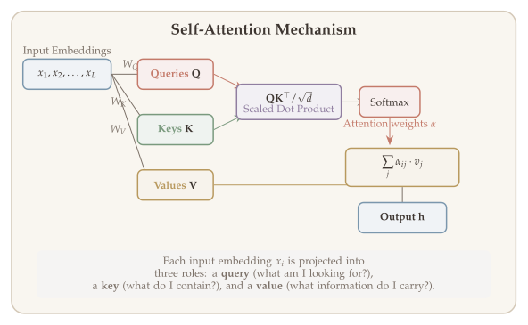
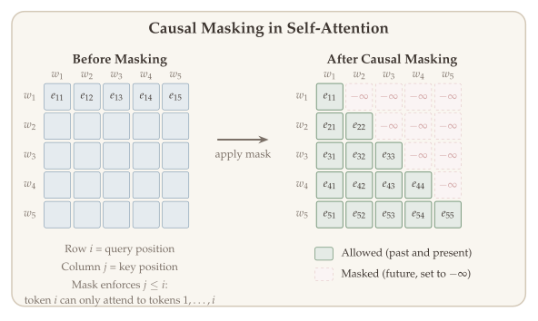
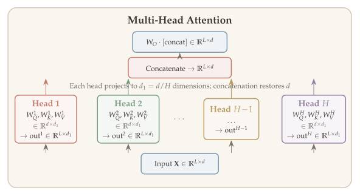
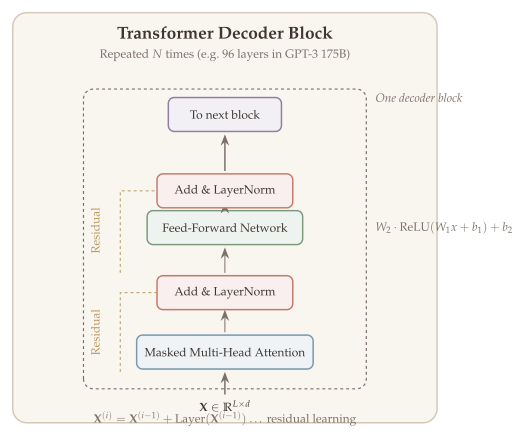

Throughout this course we have studied optimization algorithms --- gradient descent, proximal methods, mirror descent, accelerated methods --- as iterative procedures that refine a solution step by step. A remarkable recent discovery is that modern deep learning architectures, specifically **Transformers**, can *express* such optimization algorithms as forward passes through their layers. This connection between architecture design and optimization theory is one of the most exciting frontiers in machine learning.

Transformers, introduced by Vaswani et al. (2017) in the landmark paper "Attention Is All You Need," have revolutionized natural language processing, computer vision, and scientific computing. At their core, Transformers use a mechanism called **self-attention** that allows each element in a sequence to dynamically attend to every other element, enabling the model to capture long-range dependencies without the sequential bottleneck of recurrent networks.

In this chapter we develop the Transformer architecture from first principles: we start with the problem of autoregressive sequence modeling, introduce the attention mechanism, and build up to the full Transformer decoder. Along the way, we will see how each design choice (positional embeddings, masking, multi-head attention, residual connections, layer normalization) addresses a specific limitation.

*Credit: This chapter draws on material from CS 224N (Stanford), Tatsunori Hashimoto --- Lecture 8: Self-Attention and Transformers.*

## What Will Be Covered {#sec-overview}

- Autoregressive sequence modeling and word embeddings
- The attention mechanism: queries, keys, and values
- Self-attention and its properties (permutation invariance, scaling)
- Positional embeddings, causal masking, and feed-forward layers
- Multi-head attention and the full Transformer decoder architecture
- Understanding GPT-3's parameter count

## Setting: Autoregressive Sequence Modeling {#sec-autoregressive}

The fundamental task in modern language modeling is predicting the next word in a sequence given all the words that came before it. This simple objective --- next-word prediction --- turns out to be remarkably powerful: models trained on this task learn rich representations of language that enable generation, translation, summarization, and reasoning.

::: {#exm-next-word}
## Next-Word Prediction

Given the sequence "I", "am", "a", "Yale", the model predicts:
$$\mathbb{P}(w_5 \mid w_{1:4}) = \mathbb{P}(\text{"student"} \mid \text{"I am a Yale"}).$$
:::

To formalize this task, we define the autoregressive sequence model.

::: {#def-autoregressive}
## Autoregressive Sequence Model

An **autoregressive sequence model** is a function that predicts the next element given history:
$$\mathbb{P}_\theta(w_{t+1} \mid w_{1:t}), \qquad \theta: \text{parameter.}$$
:::

In particular, we want to have a **neural network** that achieves this goal: $\mathbb{P}_\theta$ is a neural network, $\theta$ is the set of network parameters.

::: {.callout-tip}
## Remark: Vocabulary

If $\{w_t\}_{t \geq 1}$ is a language sequence, $x_t$ takes finite values, giving rise to a **vocabulary**:
$$\mathcal{V} = \{\text{word}_1, \text{word}_2, \ldots, \text{word}_N\}.$$

**Question:** How to represent words and obtain a distribution over the vocabulary?
$$\mathbb{P}(\cdot \mid w_{1:t}) \in \Delta_N.$$

**Idea:** Word embedding + Softmax output.
:::

### Autoregressive Generation {#sec-autoregressive-generation}

::: {#exm-autoregressive-gen}
## Autoregressive Generation

Generation proceeds step by step:

- $\mathbb{P}(\text{"I"} \mid \text{prompt} = \text{"My name is X."})$
- $\mathbb{P}(\text{"am"} \mid \text{prompt} = \text{"My name is X. I"})$
- $\mathbb{P}(\text{"a"} \mid \text{prompt} = \text{"My name is X. I am"})$
- $\mathbb{P}(\text{"Yale"} \mid \text{prompt} = \text{"My name is X. I am a"})$
- $\mathbb{P}(\text{"student"} \mid \text{prompt} = \text{"My name is X. I am a Yale"})$

Each output word is copied back into the input for the next prediction: $\mathbb{P}_\theta(\text{next word} \mid \text{prompt})$.
:::

### Word Embedding {#sec-word-embedding}

To process words with a neural network, we first need to represent discrete tokens as continuous vectors. The **embedding** step maps each word from a one-hot representation in a large vocabulary to a dense vector in a much lower-dimensional space, where geometric proximity encodes semantic similarity.

::: {#def-word-embedding}
## Word/Token Embedding

Each word $w$ (a one-hot vector in $\mathbb{R}^N$) is associated with a vector $x_w \in \mathbb{R}^d$ via an **embedding matrix** $W_E \in \mathbb{R}^{d \times N}$:
$$x_i = W_E \, w_i \in \mathbb{R}^d.$$ {#eq-embedding}

The embedding matrix is **learned from data**.

- Input size: $L \times N$ (sequence length $\times$ vocabulary size)
- Output size: $L \times d$ (sequence length $\times$ embedding dimension)

For GPT-3: $L = 2048$, $N = 50{,}257$, $d = 12{,}288$.
:::

::: {.callout-tip}
## Remark: Why Word Embedding?

Word embeddings equip words with "distance" to capture similarity. Using **cosine similarity**:
$$\cos(u, v) = \frac{u^\top v}{\|u\| \cdot \|v\|}.$$

- Similar words are **close** in the embedded space.
- Word2Vec encodes **semantic meaning**.
- Now we are in Euclidean space and it is easy to operate using calculus.
:::

Word2vec maximizes its objective by putting similar words nearby in space. Interesting semantic patterns emerge in the scaled vectors: a meaning component (doer of event) becomes a linear meaning component in the space (e.g., drive $\to$ driver, swim $\to$ swimmer, teach $\to$ teacher).

GloVe visualizations show similar structure: gender relationships (man/woman, king/queen) and family relationships (brother/sister, nephew/niece) appear as parallel displacements in the embedding space.

### Output a Distribution: Decoding + Softmax {#sec-decoding-softmax}

After processing the input through the model's intermediate layers, we need to convert the output vector into a probability distribution over the vocabulary. The softmax function provides a natural way to transform any vector of real numbers into a valid probability distribution.

::: {#def-softmax}
## Softmax Function

For any $N$ real numbers $\{v_i\}_{i \in [N]}$, how to get a distribution over $\Delta_N$?

$$p = \text{Softmax}(\{v_i\}_{i \in [N]}).$$

$$p(i) = \frac{\exp(v_i)}{\sum_{j=1}^{N} \exp(v_j)}$$ {#eq-softmax}

is a probability distribution.
:::

But after embedding we only have a vector of size $\mathbb{R}^d$. We need a **decoding matrix** $D \in \mathbb{R}^{N \times d}$.

::: {.callout-tip}
## Remark: Decoding (Unembedding) + Softmax

The decoding matrix $D \in \mathbb{R}^{N \times d}$ maps the $d$-dimensional feature to an $N$-dimensional vector. Then softmax produces a distribution over the vocabulary:

$$\underbrace{D}_{\mathbb{R}^{N \times d}} \cdot z_\ell \in \mathbb{R}^N \xrightarrow{\text{Softmax}} p_\ell \in \Delta_N.$$

Each $p_i \in \Delta_N$ is a distribution over the vocabulary. For instance, sample words from $p_4$ when seeing "I am a Yale".

**Architecture overview:**

| Layer | Description | Size |
|:------|:------------|:-----|
| Output | Probabilities | $L \times N$ |
| Softmax | Apply softmax | $L \times N$ |
| Decode | Decoding matrix | $N \times d$ |
| Intermediate layers | Attention, MLP, Normalization | $L \times d$ |
| Embedding | Embedding matrix ($d \times N$) | $L \times d$ |
| Input | Token sequence | $L \times N$ |
:::

### Summary: What We Have So Far {#sec-summary-so-far}

The overall architecture from input to output:

1. **Input:** token sequence $w_1, w_2, \ldots, w_L$ (size $L \times N$)
2. **Embedding:** $W_E \in \mathbb{R}^{d \times N}$ maps tokens to embeddings $x_1, x_2, \ldots, x_L$ (size $L \times d$)
3. **Other blocks:** Attention, MLP, Normalization --- transformations on $L \times d$ matrices
4. **Decoding + Softmax:** produces output probabilities (size $L \times N$)

## Attention Mechanism {#sec-attention}

The central innovation behind the Transformer is the **attention** mechanism. The core challenge in sequence modeling is: when processing a particular token, how should the model decide which other tokens in the sequence are most relevant? Attention solves this by treating each word's representation as a **query** that dynamically selects and aggregates information from **a set of values**, with the relevance determined by learned similarity scores.

{#fig-self-attention}

::: {#def-attention}
## Attention

Given a set of vector *values* and a vector *query*, **attention** is a technique to compute a **weighted sum of the values**, dependent on the query.

We say the query *attends to* the values.

Attention is just a **weighted average** --- this is very powerful if the weights are learned!

- In **attention**, the query matches all keys *softly* (weights between 0 and 1). The keys' values are multiplied by the weights and summed.
- In a **lookup table**, the query matches one key exactly, returning its value.
:::

### Cross Attention: The Equations {#sec-cross-attention}

Let us now formalize the attention computation mathematically. In **cross attention**, the query comes from one source and the key-value pairs come from another (in contrast to self-attention, where everything comes from the same input).

::: {#def-cross-attention}
## Cross Attention Formula

Suppose we have (key, value) pairs $\{(k_i, v_i)\}_{i \in [L]}$ with $k \in \mathbb{R}^d$, $v \in \mathbb{R}^p$ ($p$ might be different from $d$). Now we have a query $q \in \mathbb{R}^d$.

**Question:** How to find the "value" of $q$?

**Idea:**

1. Compute similarity between $q$ and each $k_i$
2. Aggregate $\{v_i\}$ according to similarity

**Computation steps:**

1. **Compute** similarity scores:
$$e = (q^\top k_1, \ldots, q^\top k_L) \in \mathbb{R}^L.$$ {#eq-attention-scores}

2. **Similarity** (attention weights):
$$\alpha = \text{Softmax}(e) = \text{distribution over } [L],$$ {#eq-attention-weights}
$$\alpha_i = \frac{\exp(k_i^\top q)}{\sum_{j=1}^{L} \exp(k_j^\top q)}.$$
So $\alpha_i = \mathbb{P}(k_i \text{ is closest to } q)$.

3. **Aggregation:**
$$h = \sum_{i=1}^{L} \alpha_i \cdot v_i \in \mathbb{R}^p.$$ {#eq-attention-output}

**Output:** $(q, h)$ where $q \in \mathbb{R}^d$, $h \in \mathbb{R}^p$.
:::

::: {.callout-tip}
## Remark: Attention Scores

- Similarity is captured by $k_i^\top q$.
- $(k_1^\top q, \ldots, k_L^\top q)$: **attention score**.
- Can use other functions in addition to Softmax, e.g., ReLU.
:::

### There Are Several Attention Variants {#sec-attention-variants}

We have some *values* $h_1, \ldots, h_L \in \mathbb{R}^{d_1}$ and a *query* $s \in \mathbb{R}^{d_2}$.

Attention always involves:

1. Computing the *attention scores* $e \in \mathbb{R}^L$ (there are multiple ways to do this, e.g., $e = (s^\top h_\ell)_{\ell \in [L]}$). Other link functions are also possible.

2. Taking softmax to get *attention distribution* $\alpha$:
$$\alpha = \text{softmax}(e) \in \mathbb{R}^L.$$

3. Using attention distribution to take weighted sum of values:
$$a = \sum_{i=1}^{L} \alpha_i h_i \in \mathbb{R}^{d_1},$$ {#eq-attention-weighted-sum}
thus obtaining the *attention output* $a$ (sometimes called the *context vector*).

### Permutation Invariance {#sec-permutation-invariance}

An important structural property of the attention mechanism is that the output does not depend on the *order* of the key-value pairs. This is a direct consequence of the summation in the aggregation step.

::: {#cor-permutation-invariance}
## Permutation Invariance of Attention

$$\sum_{i=1}^{L} \alpha_i \cdot v_i = \sum_{i=1}^{L} \frac{\exp(q^\top k_i)}{\sum_{j=1}^{L} \exp(q^\top k_j)} \cdot v_i$$

remains the same if we permute key-value pairs $\{(k_i, v_i)\}_{i \in [L]}$, because of the "$\sum$".
:::

::: {.callout-tip}
## Remark: Ordering Matters

Ordering in a sequence matters. Natural language has order: "united states" $\neq$ "states united". We will go back to this issue later.
:::

## Self-Attention {#sec-self-attention}

In cross attention, the query and key-value pairs come from different sources. The breakthrough insight of the Transformer is to apply attention *within a single sequence* --- the queries, keys, and values are all computed from the same input. This is called **self-attention**, and it allows each token to attend to every other token in the sequence, enabling the model to learn rich contextual representations.

::: {#def-self-attention}
## Self-Attention

**Self-attention** is an attention module where **query, key, value** are all computed from the **same** input vectors.

Given post-embedding sequence $X = (x_1, \ldots, x_L) \in \mathbb{R}^{L \times d}$, with $x_i = W_E \, w_i$:

$$q_i = W_Q \, x_i \quad (\text{queries}), \qquad k_i = W_K \, x_i \quad (\text{keys}), \qquad v_i = W_V \, x_i \quad (\text{values}),$$

where $W_Q, W_K \in \mathbb{R}^{d_1 \times d}$ and $W_V \in \mathbb{R}^{d_1 \times d}$, all in $\mathbb{R}^{d \times d_1}$.
:::

### Self-Attention: Keys, Queries, Values from the Same Sequence {#sec-self-attention-formula}

Let $w_{1:n}$ be a sequence of words in vocabulary $V$, like *Zuko made his uncle tea*.

For each $w_i$, let $x_i = E \, w_i$, where $E \in \mathbb{R}^{d \times |V|}$ is an embedding matrix.

1. **Transform** each word embedding with weight matrices $Q, K, V$, each in $\mathbb{R}^{d \times d_1}$:

$$q_i = Q \, x_i \quad (\text{queries}), \qquad k_i = K \, x_i \quad (\text{keys}), \qquad v_i = V \, x_i \quad (\text{values}) \in \mathbb{R}^{d_1}.$$ {#eq-qkv}

2. **Compute** pairwise similarities between keys and queries; normalize with softmax:

$$e_{ij} = q_i^\top k_j, \qquad \alpha_{ij} = \frac{\exp(e_{ij} / \sqrt{d_1})}{\sum_{j'} \exp(e_{ij'} / \sqrt{d_1})}.$$ {#eq-scaled-attention}

3. **Compute** output for each word as weighted sum of values:

$$o_i = \sum_j \alpha_{ij} \, v_j \in \mathbb{R}^{d_1}.$$ {#eq-self-attention-output}

### Summary of Self-Attention {#sec-self-attention-summary}

Given post-embedding sequence $(x_1, \ldots, x_L) \in \mathbb{R}^{L \times d}$ and weight matrices $W_K, W_Q, W_V \in \mathbb{R}^{d \times d_1}$:

The output at position $i$ is:

$$h_i = \sum_{j=1}^{L} \alpha_{ij} \, v_j = \sum_{j=1}^{L} \alpha_{ij} \cdot (W_V \, x_j),$$ {#eq-self-attention-h}

where:

$$\alpha_{ij} \propto \exp\!\left(\frac{q_i^\top k_j}{\sqrt{d_1}}\right) = \exp\!\left(\frac{x_i^\top W_Q^\top W_K \, x_j}{\sqrt{d_1}}\right),$$ {#eq-alpha-proportional}

and formally:

$$\alpha_{ij} = \frac{\exp(q_i^\top k_j / \sqrt{d_1})}{\sum_{\ell=1}^{L} \exp(q_i^\top k_\ell / \sqrt{d_1})}.$$ {#eq-alpha-normalized}

## Three Caveats of Self-Attention {#sec-caveats}

::: {.callout-important}
## Three Key Issues

1. **Self-attention is permutation invariant** --- Need ordering.
2. **Attention score is computed between any token pairs** --- In training, we need to **mask the future**. We feed the whole sentence in the input but we need to compute $\sum_{i=1}^{L} \log \mathbb{P}_\theta(w_i \mid w_{1:i-1})$.
3. **Output** $= \sum_{j=1}^{L} \alpha_{ij} \cdot W_V x_j$ is a weighted average of linear functions of embeddings --- Need to **add nonlinearities**.
:::

### Barriers and Solutions for Self-Attention as a Building Block {#sec-barriers-solutions}

| **Barrier** | **Solution** |
|:------------|:-------------|
| Does not have an inherent notion of order | Add position representations to the inputs (Positional Embedding) |
| No nonlinearities for deep learning --- it is all just weighted averages | Apply the same feed-forward network to each self-attention output |
| Need to ensure we do not "look at the future" when predicting a sequence (e.g., machine translation, language modeling) | Mask out the future by artificially setting attention weights to 0 |

## Positional Embedding {#sec-positional-embedding}

As noted in @cor-permutation-invariance, self-attention is permutation invariant --- it treats the input as a *set* rather than a *sequence*. But word order clearly matters in natural language ("the cat sat on the mat" versus "the mat sat on the cat"). To restore order information, we add **positional embeddings** to the input representations.

::: {#def-positional-embedding}
## Positional Embedding

Since self-attention does not build in order information, we need to encode the order of the sentence in our keys, queries, and values.

Consider representing each **sequence index** as a vector:
$$p_i \in \mathbb{R}^d, \quad \text{for } i \in \{1, 2, \ldots, L\}$$ {#eq-position-vectors}
are position vectors. Map position $i$ to a vector $p_i$.

Easy to incorporate: just add the $p_i$ to our inputs! Recall that $x_i$ is the embedding of the word at index $i$. The positioned embedding is:
$$\widetilde{x}_i = x_i + p_i.$$ {#eq-positioned-embedding}

In deep self-attention networks, we do this at the first layer. You could concatenate them as well, but people mostly just add.
:::

### Position Representation Through Sinusoids {#sec-sinusoidal}

::: {#def-sinusoidal-pe}
## Sinusoidal Position Representations

**Sinusoidal position representations:** concatenate sinusoidal functions of varying periods:

$$p_i = \begin{pmatrix} \sin(i / 10000^{2 \cdot 1/d}) \\ \cos(i / 10000^{2 \cdot 1/d}) \\ \vdots \\ \sin(i / 10000^{2 \cdot \frac{d}{2}/d}) \\ \cos(i / 10000^{2 \cdot \frac{d}{2}/d}) \end{pmatrix}.$$

**Pros:**

- Periodicity indicates that maybe "absolute position" is not as important
- Maybe can extrapolate to longer sequences as periods restart

**Cons:**

- Not learnable; also the extrapolation does not really work!
:::

## Adding Nonlinearities: Feed-Forward Network {#sec-feedforward}

Self-attention, despite its power, is a *linear* operation on the value vectors --- the output is a weighted average. Stacking multiple self-attention layers without nonlinearities would simply produce another weighted average. To give the model the expressivity needed for deep learning, we add a pointwise feed-forward network after each attention layer.

::: {#def-feedforward}
## Feed-Forward (MLP) Layer

Note that there are no elementwise nonlinearities in self-attention; stacking more self-attention layers just re-averages **value** vectors.

Easy fix: add a **feed-forward network** to post-process each output vector:

$$m_i = \text{MLP}(\text{output}_i) : \mathbb{R}^{d_1} \to \mathbb{R}^{d_1}$$
$$= W_2 \cdot \text{ReLU}(W_1 \, \text{output}_i + b_1) + b_2,$$ {#eq-mlp}

where $W_1 \in \mathbb{R}^{d \times (4d)}$, $W_2 \in \mathbb{R}^{(4d) \times d}$.

Note: $m_i \in \mathbb{R}^{d_1}$ --- same dimension as input. The FF network processes the result of attention.
:::

## Masking the Future in Self-Attention {#sec-masking}

In autoregressive models, the prediction of token $w_t$ should depend only on tokens $w_1, \ldots, w_{t-1}$ --- looking at future tokens would be "cheating." However, self-attention by default allows every token to attend to every other token. We need a mechanism to prevent information from the future from leaking into past predictions, while still allowing efficient parallel computation during training.

::: {#def-causal-masking}
## Causal Masking

To use self-attention in **decoders**, we need to ensure we cannot peek at the future.

At every timestep, we could change the set of **keys and queries** to include only past words. (Inefficient!)

To enable parallelization, we **mask out attention** to future words by setting attention scores to $-\infty$:

$$e_{ij} = \begin{cases} q_i^\top k_j, & j \leq i, \\ -\infty, & j > i. \end{cases}$$ {#eq-causal-mask}

After softmax, the $-\infty$ entries become zero, so we can only look at tokens at or before the current position.
:::

{#fig-causal-masking}

## From Self-Attention to Transformer {#sec-self-attention-to-transformer}

Instead of having a single attention module, we have **multi-head self attention**: multiple ($H$) attention heads in parallel.

### Multi-Head Attention {#sec-multi-head}

A single attention head can only capture one type of relationship between tokens. In practice, different aspects of the input (syntax, semantics, coreference) may require different attention patterns. **Multi-head attention** addresses this by running multiple attention operations in parallel, each with its own learned projection matrices.

::: {#def-multi-head-attention}
## Multi-Head Attention

$H$ = number of attention heads. Each head has three matrices $\{W_K^h, W_Q^h, W_V^h\}_{h \in [H]}$, each $\in \mathbb{R}^{d \times d_1}$, where $d_1 = d / H$.

For each head $h$:
$$\text{output}^h = \sum_{j=1}^{L} \alpha^h \cdot v_j^h \quad \in \mathbb{R}^{L \times d_1}.$$

The outputs from all heads are concatenated and mixed via an **output matrix** $W_O \in \mathbb{R}^{d \times d}$:

$$\text{MHA output} = W_O \begin{pmatrix} \text{output}^1 \\ \text{output}^2 \\ \vdots \\ \text{output}^H \end{pmatrix} \in \mathbb{R}^{L \times d}.$$ {#eq-mha-output}
:::

{#fig-multi-head-attention}

### Transformer Architecture {#sec-transformer-architecture}

The Transformer repeats MHA blocks. There are two additional components within each block:

1. **Residual Connection**
2. **Layer Normalization**

### Residual Connections {#sec-residual}

Deep networks are difficult to train because gradients can vanish or explode as they propagate through many layers. **Residual connections** (He et al., 2016) provide a simple but powerful solution: instead of learning the full transformation, each layer only needs to learn the *residual* --- the difference from the identity mapping.

::: {#def-residual-connection}
## Residual Connection

**Residual connections** are a trick to help models train better.

Instead of $X^{(i)} = \text{Layer}(X^{(i-1)})$ (where $i$ represents the layer), we let:

$$X^{(i)} = X^{(i-1)} + \text{Layer}(X^{(i-1)})$$ {#eq-residual}

so we only have to learn "the residual" from the previous layer.

In the transformer context:
$$X \mapsto X + \text{MHA}(X),$$
where $X \in \mathbb{R}^{L \times d}$, $\text{MHA}(X) \in \mathbb{R}^{L \times d}$.

- Add the input to the output of the multi-head attention.
- Bias the mapping to identity.
:::

### Layer Normalization {#sec-layer-norm}

Even with residual connections, training very deep Transformers can be unstable due to the scale of hidden activations varying across layers. **Layer normalization** stabilizes training by normalizing activations within each layer to have zero mean and unit variance.

::: {#def-layer-normalization}
## Layer Normalization [Ba et al., 2016]

**Layer normalization** is a trick to help models train faster.

Idea: cut down on uninformative variation in hidden vector values by normalizing to unit mean and standard deviation **within each layer**.

- LayerNorm's success may be due to its normalizing gradients [Xu et al., 2019].

Let $x \in \mathbb{R}^d$ be an individual (word) vector in the model.

- Mean: $\mu = \frac{1}{d} \sum_{j=1}^{d} x_j$; this is the mean; $\mu \in \mathbb{R}$.
- Standard deviation: $\sigma = \sqrt{\frac{1}{d} \sum_{j=1}^{d} (x_j - \mu)^2}$; $\sigma \in \mathbb{R}$.
- Let $\gamma \in \mathbb{R}^d$ and $\beta \in \mathbb{R}^d$ be learned "gain" and "bias" parameters. (Can omit!)

Then layer normalization computes:

$$\text{output} = \frac{x - \mu}{\sqrt{\sigma + \epsilon}} * \gamma + \beta.$$ {#eq-layer-norm}

The first part normalizes by scalar mean and variance; the second part modulates by learned elementwise gain and bias.
:::

### The Transformer Decoder {#sec-transformer-decoder}

The Transformer Decoder is a stack of Transformer Decoder **Blocks**. Each Block consists of:

- (Masked) Multi-Head Self-Attention
- Add & Norm
- Feed-Forward
- Add & Norm

{#fig-transformer-decoder}

### Necessities for a Self-Attention Building Block {#sec-necessities}

- **Self-attention:** the basis of the method.
- **Position representations:** specify the sequence order, since self-attention is an unordered function of its inputs.
- **Nonlinearities:** at the output of the self-attention block, frequently implemented as a simple feed-forward network.
- **Masking:** in order to parallelize operations while not looking at the future. Keeps information about the future from "leaking" to the past.

## Appendix: Understanding GPT-3 --- How to Compute the Number of Parameters {#sec-gpt3-appendix}

GPT-3 model variants:

| Model Name | $n_\text{params}$ | $n_\text{layers}$ | $d_\text{model}$ | $n_\text{heads}$ | $d_\text{head}$ |
|:-----------|:----------|:----------|:----------|:----------|:---------|
| GPT-3 Small | 125M | 12 | 768 | 12 | 64 |
| GPT-3 Medium | 350M | 24 | 1024 | 16 | 64 |
| GPT-3 Large | 760M | 24 | 1536 | 16 | 96 |
| GPT-3 XL | 1.3B | 24 | 2048 | 24 | 128 |
| GPT-3 2.7B | 2.7B | 32 | 2560 | 32 | 80 |
| GPT-3 6.7B | 6.7B | 32 | 4096 | 32 | 128 |
| GPT-3 13B | 13.0B | 40 | 5140 | 40 | 128 |
| **GPT-3 175B** | **175.0B** | **96** | **12288** | **96** | **128** |

Note: $d = H \times d_1$ (i.e., $d_\text{model} = n_\text{heads} \times d_\text{head}$).

**Key parameters for GPT-3 175B:**

- Context window: $L = 2048$
- Vocabulary size: $N = 50257$

### MLP Layer {#sec-appendix-mlp}

$$\text{MLP}(x) = W_2 \cdot \max\{W_1 x + b_1, 0\} + b_2,$$

where $W_1 \in \mathbb{R}^{d \times (4d)}$, $W_2 \in \mathbb{R}^{(4d) \times d}$.

### Counting Parameters {#sec-counting-params}

::: {.callout-important}
## Algorithm: Computing the Number of Parameters

Let $d = d_\text{model}$, $d_1 = d_\text{head}$.

**1. Word embedding** ($L \times N \to L \times d$):
$$W_E \in \mathbb{R}^{N \times L}, \qquad \#\text{param} = N \cdot L.$$

**2. Position embedding** ($L \times L \to L \times d$):
$$W_{PE} \in \mathbb{R}^{L \times d}, \qquad \#\text{param} = L \cdot d.$$

**3. Each self-attention layer:**

- Each $W_Q^h, W_K^h, W_V^h \in \mathbb{R}^{d \times d_1}$
$$\Rightarrow \#\text{param} = 3 \times d \times d_1 \times H = 3d^2.$$
- Output matrix $W_O \in \mathbb{R}^{d \times d}$.
$$\Rightarrow \text{Total } \#\text{param of MHA} = 4d^2 \text{ per layer} \times n_\text{layer}.$$ {#eq-mha-params}

**4. MLP layer:** $(W_1, W_2, b_1, b_2)$ --- only count $W_1, W_2$:
$$\Rightarrow \text{Total } \#\text{param} = (4d \times d \times 2 \text{ per layer}) \times n_\text{layer} = 8d^2 \times n_\text{layer}.$$ {#eq-mlp-params}

When neglecting other components (biases, layer norms), we have:

$$\#\text{param} = N \times L + L \times d + 12 \cdot d^2 \times n_\text{layer}$$ {#eq-total-params}

$$\approx 174{,}074{,}267{,}648 \approx 174 \times 10^9 \quad (99.5\% \text{ accurate}).$$
:::

Reference: [How does GPT-3 spend its 175B parameters?](https://www.lesswrong.com/posts/3duR8CrvcHyvrnhLo/how-does-gpt-3-spend-its-175b-parameters)

::: {.callout-tip}
## Looking Ahead
In the next and final chapter, we study **implicit layers** --- the idea of embedding an optimization problem *inside* a neural network as a differentiable layer. This connects back to the core themes of this course: by differentiating through optimality conditions (KKT conditions from [Chapter 2](02-lagrange-duality.qmd)), we can train end-to-end models that include convex optimization as a building block, enabling applications in bilevel optimization, hyperparameter tuning, and revenue maximization.
:::
