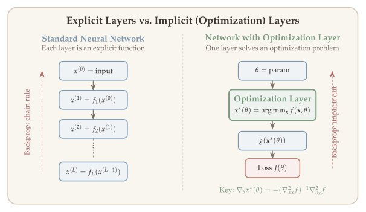
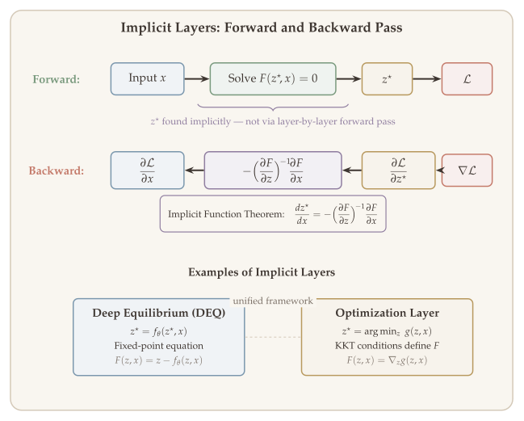
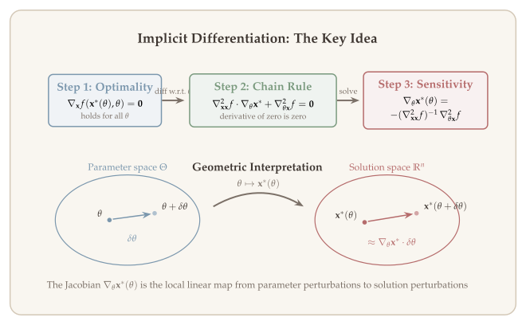
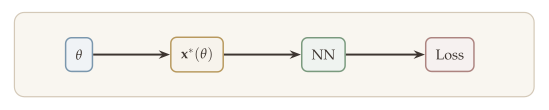
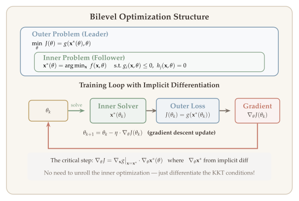
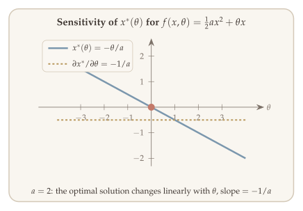
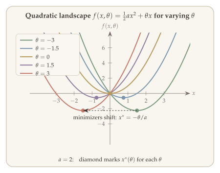
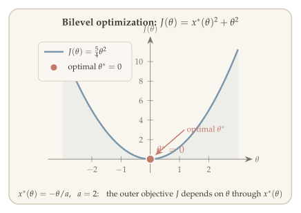

Throughout this course we have studied optimization as a *tool* --- we formulate a problem and then apply algorithms (gradient descent, proximal methods, accelerated methods) to find a solution. In this final chapter, we flip the perspective: we use the *solution itself* as a building block inside a larger system. Specifically, we embed an optimization problem as a **layer** inside a neural network, so that the network's forward pass involves *solving* an optimization problem, and its backward pass involves *differentiating through* the optimality conditions.

Virtually all standard neural network layers are **explicit**: given an input $\mathbf{x}$, the layer computes $\mathbf{y} = f(\mathbf{x})$ via a known computation graph, and backpropagation differentiates through that graph automatically. An **implicit layer**, by contrast, defines the output $\mathbf{y}$ as the solution to a condition involving both input and output:

$$
\text{find } \mathbf{y} \text{ such that } g(\mathbf{x}, \mathbf{y}) = \mathbf{0}.
$$

This condition could be a fixed-point equation ($\mathbf{y} = f(\mathbf{y}, \mathbf{x})$), an optimality condition ($\nabla_{\mathbf{y}} \mathcal{L}(\mathbf{x}, \mathbf{y}) = \mathbf{0}$), or a differential equation. There is no explicit formula for $\mathbf{y}$ in terms of $\mathbf{x}$, yet we can still differentiate $\mathbf{y}$ with respect to $\mathbf{x}$ using the **implicit function theorem** --- the central mathematical tool of this chapter.

This idea --- known as **differentiable optimization** or more broadly **implicit layers** --- is one of the most powerful applications of the theory developed in this course. It connects duality and KKT conditions (from [Chapter 2](02-lagrange-duality.qmd)) to modern deep learning, enabling end-to-end training of systems that incorporate structured optimization as an inductive bias. The approach offers several compelling advantages over standard explicit layers [Kolter, Duvenaud, and Johnson (2020)](http://implicit-layers-tutorial.org/):

1. **Powerful representations.** Implicit layers compactly represent operations such as integrating differential equations, solving optimization problems, or finding fixed points of dynamical systems --- operations that would require infinitely many explicit layers to approximate.
2. **Memory efficiency.** Backpropagation through an implicit layer does not require storing intermediate iterates. The implicit function theorem provides gradients using only the solution and local derivative information.
3. **Abstraction.** Implicit layers separate *what a layer should compute* from *how to compute it*. The forward pass can use any solver; the backward pass depends only on the structure of the defining equation $g(\mathbf{x}, \mathbf{y}) = \mathbf{0}$.

Applications of implicit layers are wide-ranging: bilevel optimization for hyperparameter tuning, meta-learning, adversarial training, revenue maximization in economics, and structured prediction in natural language processing. In each case, the inner optimization layer encodes domain knowledge (constraints, objectives) that would be difficult to capture with standard neural network layers alone.

::: {.callout-note}
## Tutorial Reference

This chapter draws extensively on the tutorial *Deep Implicit Layers: Neural ODEs, Equilibrium Models, and Beyond* by [Kolter, Duvenaud, and Johnson (2020)](http://implicit-layers-tutorial.org/), presented at NeurIPS 2020. The companion website [implicit-layers-tutorial.org](http://implicit-layers-tutorial.org/) provides detailed notes and starter code. For differentiable convex optimization specifically, we follow the **cvxpylayers** framework of [Agrawal et al. (2019)](https://arxiv.org/abs/1910.12430); see the [project page](https://locuslab.github.io/2019-10-28-cvxpylayers/).
:::

::: {.callout-tip}
## Companion Notebook

A [Jupyter notebook](../notebooks/implicit-layers.ipynb) accompanies this chapter with runnable Python implementations of differentiable optimization layers using CvxpyLayers, implicit differentiation through fixed points, and deep equilibrium model examples.
:::

## What Will Be Covered {#sec-overview}

- The **implicit function theorem**: the mathematical foundation for differentiating through implicit equations
- Implicit differentiation for **unconstrained** parametric optimization
- Extension to **constrained** parametric optimization via KKT-based differentiation
- The **optimization-as-a-layer** paradigm and the **cvxpylayers** library
- **Neural ODEs** and the adjoint method
- Applications: bilevel optimization, hyperparameter selection, and revenue maximization

{#fig-explicit-vs-implicit}


{#fig-implicit-layer-diagram}

## The Implicit Function Theorem {#sec-ift}

Before applying implicit differentiation to optimization problems, we state the mathematical foundation that underlies the entire chapter.

::: {#thm-ift}
## Implicit Function Theorem

Let $F \colon \mathbb{R}^p \times \mathbb{R}^n \to \mathbb{R}^n$ be continuously differentiable. Suppose that at a point $(a_0, z_0)$:

1. $F(a_0, z_0) = \mathbf{0}$, and
2. the Jacobian $\partial_z F(a_0, z_0) \in \mathbb{R}^{n \times n}$ is **nonsingular**.

Then there exist open sets $S_a \ni a_0$ and $S_z \ni z_0$ and a unique continuously differentiable function $z^* \colon S_a \to S_z$ such that:

- $z_0 = z^*(a_0)$,
- $F(a, z^*(a)) = \mathbf{0}$ for all $a \in S_a$, and
- $\displaystyle \frac{\partial z^*}{\partial a}(a) = -\bigl[\partial_z F(a, z^*(a))\bigr]^{-1}\, \partial_a F(a, z^*(a))$.
:::

The theorem says: if an equation $F(a, z) = \mathbf{0}$ implicitly defines $z$ as a function of $a$ near a solution, we can differentiate $z^*(a)$ **without** knowing its closed form --- we only need local derivative information about $F$.

::: {#exm-circle-ift}
## The Unit Circle

Consider $F(a, z) = a^2 + z^2 - 1 = 0$, which defines the unit circle. Near the point $(a_0, z_0) = (0, 1)$, the implicit function theorem gives a smooth function $z^*(a) = \sqrt{1 - a^2}$ defined locally. The derivative formula yields:

$$
\frac{dz^*}{da} = -\frac{\partial_a F}{\partial_z F} = -\frac{2a}{2z} = -\frac{a}{z^*(a)}.
$$

At $(0, 1)$: $dz^*/da = 0$, consistent with the circle being flat at the top. At $(a_0, z_0) = (1, 0)$, however, $\partial_z F = 2z = 0$ is singular --- the theorem does not apply, and indeed $z^*(a)$ is not differentiable there (the circle has a vertical tangent).
:::

::: {.callout-tip}
## Remark: Why the IFT Matters for This Chapter

Every implicit differentiation formula in this chapter is an instance of the IFT:

| **Setting** | **Equation $F = 0$** | **Parameter $a$** | **Solution $z^*$** |
|:---|:---|:---|:---|
| Unconstrained opt. | $\nabla_{\mathbf{x}} f = \mathbf{0}$ | $\theta$ | $\mathbf{x}^*(\theta)$ |
| Constrained opt. | KKT system $G = \mathbf{0}$ | $\theta$ | $(\mathbf{x}^*, \mu^*, \lambda^*)$ |
| Fixed-point layer | $z - f(z, x) = \mathbf{0}$ | $x$ | $z^*$ |
| Neural ODE | $z(t_1) - z(t_0) - \int f\,dt = \mathbf{0}$ | $\theta$ | $z(t_1)$ |

The nonsingularity condition in @thm-ift corresponds to strong convexity (unconstrained case), LICQ + strict complementarity (constrained case), or contractivity (fixed-point case).
:::

## Unconstrained Parametric Optimization {#sec-unconstrained}

### Problem Setup {#sec-unconstrained-setup}

We begin with the simplest setting: unconstrained optimization where the objective depends on both a decision variable $\mathbf{x}$ and a parameter $\theta$. Suppose $f(\cdot, \theta)$ is a differentiable convex function on $\mathbb{R}^n$ for any $\theta \in \Theta$. We define the optimal solution as a function of the parameter:

$$
\mathbf{x}^*(\theta) = \arg\min_{\mathbf{x} \in \mathbb{R}^n} f(\mathbf{x}, \theta).
$$ {#eq-parametric-opt}

The central question is how the optimal solution changes when the parameter varies. This is precisely what we need for backpropagation through an optimization layer.

::: {#def-sensitivity-optimal-solution}
## Question: Sensitivity of the Optimal Solution

How does $\mathbf{x}^*(\theta)$ change with $\theta$? Specifically, we want to compute the **Jacobian**

$$
\nabla_\theta\, \mathbf{x}^*(\theta),
$$

which captures how sensitive the optimal solution $\mathbf{x}^*(\theta)$ is to perturbations in the parameter $\theta$.
:::

We make two key assumptions:

1. $f(\cdot, \theta)$ is **strongly convex** in $\mathbf{x}$, ensuring a unique minimizer $\mathbf{x}^*(\theta)$.
2. $f(\cdot, \theta)$ has **sufficient differentiability** (twice differentiable in both $\mathbf{x}$ and $\theta$).

### Differentiating the First-Order Condition {#sec-unconstrained-ift}

::: {.callout-tip}
## Remark: Key Idea

**Differentiate the first-order optimality condition** with respect to $\theta$. This is the central technique underlying the implicit function theorem approach.
:::

Since $\mathbf{x}^*(\theta)$ is the minimizer of a convex function, the first-order optimality condition gives:

$$
\mathbf{x}^*(\theta) = \arg\min_{\mathbf{x}} f(\mathbf{x}, \theta) \quad \iff \quad \nabla_{\mathbf{x}} f(\mathbf{x}, \theta)\big|_{\mathbf{x} = \mathbf{x}^*(\theta)} = 0 \quad \forall\, \theta \in \Theta.
$$ {#eq-foc-identity}

Define the function

$$
g(\theta) \;=\; \nabla_{\mathbf{x}} f(\mathbf{x}, \theta)\big|_{\mathbf{x} = \mathbf{x}^*(\theta)}.
$$

By the first-order condition, $g(\theta) = \mathbf{0}$ for all $\theta \in \Theta$. Since $g$ is a **constant (zero) function**, differentiating $g(\theta)$ with respect to $\theta$ must also yield zero.

### Sensitivity Formula {#sec-unconstrained-formula}

We now derive the explicit formula for the Jacobian $\nabla_\theta\, \mathbf{x}^*(\theta)$ by differentiating the first-order condition ([-@eq-foc-identity]). Applying the chain rule to $g(\theta) = \nabla_{\mathbf{x}} f\bigl(\mathbf{x}^*(\theta), \theta\bigr)$, we obtain:

$$
\mathbf{0} = \nabla_\theta\, g(\theta) = \nabla_{\mathbf{x}\mathbf{x}}^2 f(\mathbf{x}, \theta)\,\nabla_\theta\, \mathbf{x}^*(\theta) + \nabla_{\theta \mathbf{x}}^2 f\bigl(\mathbf{x}^*(\theta), \theta\bigr).
$$ {#eq-chain-rule-foc}

Here $\nabla_{\mathbf{x}\mathbf{x}}^2 f$ denotes the Hessian with respect to $\mathbf{x}$, and $\nabla_{\theta \mathbf{x}}^2 f$ is the mixed partial derivative matrix. Solving ([-@eq-chain-rule-foc]) for the desired Jacobian:

::: {#thm-implicit-diff-unconstrained}
## Implicit Differentiation --- Unconstrained Case

Under the assumptions that $f(\cdot, \theta)$ is strongly convex in $\mathbf{x}$ and twice differentiable, the Jacobian of the optimal solution with respect to $\theta$ is:

$$
\nabla_\theta\, \mathbf{x}^*(\theta) = -\bigl(\nabla_{\mathbf{x}\mathbf{x}}^2 f(\mathbf{x}, \theta)\bigr)^{-1}\,\nabla_{\theta \mathbf{x}}^2 f\bigl(\mathbf{x}^*(\theta), \theta\bigr).
$$ {#eq-implicit-diff-unconstrained}

Both derivatives on the right-hand side are evaluated at $\mathbf{x} = \mathbf{x}^*(\theta)$.
:::

::: {.proof}
The proof proceeds by differentiating the first-order condition ([-@eq-foc-identity]) and then inverting the Hessian, which is guaranteed to be positive definite by strong convexity.

The first-order condition states $g(\theta) = \nabla_{\mathbf{x}} f(\mathbf{x}, \theta)\big|_{\mathbf{x}=\mathbf{x}^*(\theta)} = 0$ for all $\theta$. Since $g$ is identically zero, $\nabla_\theta g(\theta) = 0$.

Applying the chain rule:

$$
\nabla_\theta\, g(\theta) = \nabla_{\mathbf{x}\mathbf{x}}^2 f(\mathbf{x}^*(\theta), \theta)\;\nabla_\theta \mathbf{x}^*(\theta) + \nabla_{\theta \mathbf{x}}^2 f(\mathbf{x}^*(\theta), \theta) = 0.
$$

Since $f$ is strongly convex in $\mathbf{x}$, the Hessian $\nabla_{\mathbf{x}\mathbf{x}}^2 f$ is positive definite, hence invertible. Rearranging gives:

$$
\nabla_\theta\, \mathbf{x}^*(\theta) = -\bigl(\nabla_{\mathbf{x}\mathbf{x}}^2 f(\mathbf{x}^*(\theta), \theta)\bigr)^{-1}\,\nabla_{\theta \mathbf{x}}^2 f(\mathbf{x}^*(\theta), \theta).
$$

Hence we conclude the proof. $\blacksquare$
:::

::: {.callout-tip}
## Remark: Recap

The key property we exploit is that $g(\theta) = \nabla_{\mathbf{x}} f(\mathbf{x}, \theta)\big|_{\mathbf{x} = \mathbf{x}^*(\theta)} = \mathbf{0}$ is a **constant (zero) function** of $\theta$. Differentiating this identity is what yields the sensitivity formula.
:::

{#fig-implicit-differentiation}


### Example: Quadratic Function {#sec-unconstrained-example}

::: {#exm-quadratic-objective}
## Quadratic Objective

Consider the quadratic function

$$
f(\mathbf{x}, \theta) = \tfrac{1}{2}\,\mathbf{x}^\top \mathbf{A}\,\mathbf{x} + \theta^\top \mathbf{x}, \qquad \mathbf{A} \succ 0.
$$ {#eq-quadratic-objective}

The first-order condition gives $\nabla_{\mathbf{x}} f = \mathbf{A}\mathbf{x} + \theta = \mathbf{0}$, so the optimal solution is

$$
\mathbf{x}^*(\theta) = -\mathbf{A}^{-1}\theta.
$$

Computing the Jacobian directly:

$$
\nabla_\theta\, \mathbf{x}^*(\theta) = -\mathbf{A}^{-1}.
$$

**Verification via ([-@eq-implicit-diff-unconstrained]):** We have $\nabla_{\mathbf{x}\mathbf{x}}^2 f = \mathbf{A}$ and $\nabla_{\theta \mathbf{x}}^2 f = \mathbf{I}$. Thus

$$
\nabla_\theta\, \mathbf{x}^*(\theta) = -\mathbf{A}^{-1}\cdot \mathbf{I} = -\mathbf{A}^{-1},
$$

which matches the direct computation.
:::

## Constrained Parametric Optimization {#sec-constrained}

### Problem Setup {#sec-constrained-setup}

The unconstrained formula @thm-implicit-diff-unconstrained is elegant but limited: it requires the optimization to be unconstrained. Many practical optimization layers involve constraints --- for instance, portfolio optimization with budget constraints, or optimal transport with marginal constraints. We now generalize the implicit differentiation framework to handle inequality and equality constraints, building on the KKT theory from [Chapter 2](02-lagrange-duality.qmd).

Consider a family of **constrained** convex optimization problems $\{P_\theta\}_{\theta \in \Theta}$:

::: {#def-parametric-convex-program}
## Parametric Convex Program

$$
P_\theta: \quad \min_{\mathbf{x}}\; f(\mathbf{x}, \theta) \quad \text{s.t.} \quad g(\mathbf{x}, \theta) \leq 0, \quad h(\mathbf{x}, \theta) = 0,
$$ {#eq-parametric-convex-program}

where $g = (g_1, \ldots, g_m)^\top$ collects the inequality constraints and $h = (h_1, \ldots, h_p)^\top$ collects the equality constraints.
:::

Suppose $\mathbf{x}^*(\theta)$ is the **unique primal solution**. We want to compute $\nabla_\theta\, \mathbf{x}^*(\theta)$.

### KKT-Based Differentiation {#sec-constrained-kkt}

::: {.callout-tip}
## Remark: Key Idea

**Differentiate the KKT (first-order optimality) conditions** with respect to $\theta$. This generalizes the unconstrained approach ([-@eq-implicit-diff-unconstrained]) to handle the inequality and equality constraints in ([-@eq-parametric-convex-program]).
:::

When $P_\theta$ is "nice" (e.g., satisfies **Slater's condition**, recall [Chapter 2](02-lagrange-duality.qmd)), $\mathbf{x}^*(\theta)$ is optimal if and only if there exist dual variables $\mu^*(\theta) \in \mathbb{R}^m$ and $\lambda^*(\theta) \in \mathbb{R}^p$ such that $\bigl(\mathbf{x}^*(\theta), \mu^*(\theta), \lambda^*(\theta)\bigr)$ satisfies the **KKT conditions**.

Define the KKT residual map:

$$
G(\mathbf{x}, \mu, \lambda, \theta) = \begin{pmatrix} \nabla_{\mathbf{x}} f(\mathbf{x}, \theta) + \nabla_{\mathbf{x}} g(\mathbf{x}, \theta)^\top \mu + \nabla_{\mathbf{x}} h(\mathbf{x}, \theta)^\top \lambda \\[4pt] \bigl(\mu_i \cdot g_i(\mathbf{x}, \theta)\bigr)_{i=1}^m \\[4pt] h(\mathbf{x}, \theta) \end{pmatrix}.
$$ {#eq-kkt-residual}

The first block is stationarity, the second is complementary slackness, and the third is primal feasibility for equalities.

Since $\bigl(\mathbf{x}^*(\theta), \mu^*(\theta), \lambda^*(\theta)\bigr)$ satisfies KKT:

$$
G\bigl(\mathbf{x}^*(\theta),\, \mu^*(\theta),\, \lambda^*(\theta);\, \theta\bigr) = \mathbf{0} \qquad \forall\,\theta \in \Theta.
$$ {#eq-kkt-identity}

### Jacobian System {#sec-constrained-jacobian}

Just as in the unconstrained case, we differentiate the identity ([-@eq-kkt-identity]) with respect to $\theta$ and apply the chain rule. The key difference is that we now differentiate the *full KKT system* defined by the residual ([-@eq-kkt-residual]) --- which involves not only the primal variable $\mathbf{x}$ but also the dual variables $\mu$ and $\lambda$. Writing the variables as $\mathbf{z} = (\mathbf{x}, \mu, \lambda)$ and $\mathbf{z}^*(\theta) = \bigl(\mathbf{x}^*(\theta), \mu^*(\theta), \lambda^*(\theta)\bigr)$:

$$
\nabla_{\mathbf{z}} G\bigl(\mathbf{z}^*(\theta), \theta\bigr)\;\nabla_\theta\, \mathbf{z}^*(\theta) + \nabla_\theta G\bigl(\mathbf{z}^*(\theta), \theta\bigr) = \mathbf{0}.
$$ {#eq-jacobian-chain-rule}

::: {#thm-implicit-diff-constrained}
## Implicit Differentiation --- Constrained Case

Solving ([-@eq-jacobian-chain-rule]) for $\nabla_\theta \mathbf{z}^*(\theta)$, we obtain the following result. The Jacobian of the KKT variables $\nabla_{\mathbf{z}} G$ evaluated at the optimal triple is the block matrix:

$$
\nabla_{\mathbf{z}} G = \begin{pmatrix}
  \nabla_{\mathbf{x}\mathbf{x}}^2 f + \displaystyle\sum_{i=1}^m \mu_i\,\nabla_{\mathbf{x}\mathbf{x}}^2 g_i & \nabla_{\mathbf{x}} g & \nabla_{\mathbf{x}} h \\[6pt]
  \nabla_{\mathbf{x}} g \cdot \operatorname{diag}(\mu) & \operatorname{diag}\bigl(g(\mathbf{x},\theta)\bigr) & 0 \\[6pt]
  \nabla_{\mathbf{x}} h^\top & 0 & 0
\end{pmatrix},
$$

where all quantities are evaluated at $\bigl(\mathbf{x}^*(\theta), \mu^*(\theta), \lambda^*(\theta)\bigr)$. The sensitivity is then obtained by solving the linear system:

$$
\begin{pmatrix} \nabla_\theta\, \mathbf{x}^*(\theta) \\[3pt] \nabla_\theta\, \mu^*(\theta) \\[3pt] \nabla_\theta\, \lambda^*(\theta) \end{pmatrix} = -\bigl[\nabla_{\mathbf{z}} G\bigr]^{-1}\;\nabla_\theta\, G\bigl(\mathbf{z}^*(\theta), \theta\bigr).
$$ {#eq-sensitivity-constrained}
:::

::: {.callout-tip}
## Remark: Practical Implementation

In practice, we do not form and invert the full Jacobian matrix. Instead, we solve the linear system using efficient factorizations. Libraries such as **cvxpylayers** automate this process, making it easy to embed convex optimization layers inside differentiable pipelines.
:::

## Optimization as a Layer {#sec-opt-as-layer}

With the sensitivity formulas for both the unconstrained case (@thm-implicit-diff-unconstrained) and the constrained case (@thm-implicit-diff-constrained) in hand, we now show how to embed an optimization problem as a differentiable component in a neural network.

### The Pipeline {#sec-opt-layer-pipeline}

We can view the mapping $\theta \mapsto \mathbf{x}^*(\theta)$ from a parametric convex optimization problem ([-@eq-parametric-opt]) or ([-@eq-parametric-convex-program]) as a **layer** in a neural network.

{#fig-opt-layer-pipeline}

To make $\mathbf{x}^*(\theta)$ a proper differentiable layer, we only need to be able to compute $\nabla_\theta\, \mathbf{x}^*(\theta)$ --- which is exactly what the implicit differentiation formulas ([-@eq-implicit-diff-unconstrained]) and ([-@eq-sensitivity-constrained]) provide.

### CvxpyLayers: Differentiable Convex Optimization {#sec-cvxpylayers}

The library **cvxpylayers** ([Agrawal et al., 2019](https://arxiv.org/abs/1910.12430)) turns this theory into a practical tool. Given a convex optimization problem specified in [CVXPY](https://www.cvxpy.org/) using disciplined convex programming (DCP), cvxpylayers automatically:

1. **Forward pass:** Solves the optimization problem using a cone solver (e.g., SCS or ECOS) to obtain $\mathbf{x}^*(\theta)$.
2. **Backward pass:** Differentiates through the KKT conditions of the **cone program** reduction to compute $\nabla_\theta \mathbf{x}^*(\theta)$.

The key insight is that any DCP problem can be reduced to a standard cone program

$$
\min_{\mathbf{x}}\; \mathbf{c}^\top \mathbf{x} \quad \text{s.t.} \quad \mathbf{A}\mathbf{x} + \mathbf{s} = \mathbf{b}, \quad \mathbf{s} \in \mathcal{K},
$$

where $\mathcal{K}$ is a product of cones (nonnegative orthant, second-order cone, semidefinite cone). The parameters $\theta$ enter through $\mathbf{A}(\theta)$, $\mathbf{b}(\theta)$, and $\mathbf{c}(\theta)$, and differentiating the KKT conditions of this standard form yields a structured linear system that can be solved efficiently. The user never needs to derive the Jacobian manually --- cvxpylayers handles the entire chain from DCP specification to gradient computation.

```python
import cvxpy as cp
from cvxpylayers.torch import CvxpyLayer
import torch

# Define a parametric QP: min 0.5 x^T P x + q^T x  s.t. Gx <= h
n = 5
x = cp.Variable(n)
P = cp.Parameter((n, n), PSD=True)   # parameter
q = cp.Parameter(n)                   # parameter
G = cp.Parameter((n, n))              # parameter
h = cp.Parameter(n)                   # parameter

prob = cp.Problem(cp.Minimize(0.5 * cp.quad_form(x, P) + q @ x),
                  [G @ x <= h])

# Wrap as a differentiable PyTorch layer
layer = CvxpyLayer(prob, parameters=[P, q, G, h], variables=[x])

# Now layer(P_val, q_val, G_val, h_val) returns x*
# and torch.autograd handles the backward pass automatically
```

::: {.callout-tip}
## Remark: Why Gradients Pass Through an Optimization Layer

At first glance it seems mysterious that we can "backpropagate through" an optimization solver --- the solver is an iterative algorithm, not a differentiable function. The resolution is that **we never differentiate the solver itself**. Instead, we differentiate the **optimality conditions** that the solver's output satisfies.

Concretely, suppose a downstream loss $L$ depends on the solution $\mathbf{x}^*(\theta)$. By the chain rule we need $\partial L / \partial \theta = (\partial L / \partial \mathbf{x}^*) \cdot (\partial \mathbf{x}^* / \partial \theta)$. The first factor is standard backpropagation. The second factor is not computed by differentiating solver internals --- it is computed by applying the **implicit function theorem to the KKT system** $G(\mathbf{x}^*, \mu^*, \lambda^*; \theta) = \mathbf{0}$:

$$
\frac{\partial \mathbf{x}^*}{\partial \theta} = -\bigl[\nabla_{\mathbf{z}} G\bigr]^{-1} \nabla_\theta G,
$$

where $\mathbf{z} = (\mathbf{x}, \mu, \lambda)$. This is a **generalized chain rule**: the standard chain rule propagates gradients through explicit computation graphs, while the IFT extends this to propagate gradients through *implicitly defined* quantities. The KKT conditions serve as the "bridge" --- they are the equations that implicitly define $\mathbf{x}^*(\theta)$, and differentiating them is what allows gradient information to flow from the loss back to the parameters $\theta$.
:::

## Applications {#sec-applications}

### Bilevel Optimization {#sec-app-bilevel}

The main motivation for using $\mathbf{x}^*(\theta)$ as a layer is for studying **bilevel optimization** problems of the form:

$$
\min_{\theta \in \Theta}\; J(\theta) = g\bigl(\mathbf{x}^*(\theta),\, \theta\bigr).
$$ {#eq-bilevel}

Suppose $J(\theta) = g\bigl(\mathbf{x}^*(\theta)\bigr)$ and we want to minimize $J(\theta)$ using first-order optimization. By the chain rule, we need the gradient of $J$ with respect to $\theta$, which involves the Jacobian $\nabla_\theta \mathbf{x}^*(\theta)$ from @thm-implicit-diff-unconstrained or @thm-implicit-diff-constrained:

$$
\nabla_\theta\, J(\theta) = \nabla_{\mathbf{x}} g(\mathbf{x})\big|_{\mathbf{x} = \mathbf{x}^*(\theta)} \;\cdot\; \nabla_\theta\, \mathbf{x}^*(\theta).
$$

::: {.callout-tip}
## Remark: Why Bilevel Optimization is Hard

This problem is challenging because the outer objective $J(\theta)$ hides another optimization problem in its constraint: the inner problem defines $\mathbf{x}^*(\theta)$. Equivalently, the bilevel problem can be written as:

$$
\min_\theta\; g(\mathbf{x}, \theta) \quad \text{s.t.} \quad \mathbf{x} = \arg\min_{\mathbf{y}}\, f(\mathbf{y}, \theta).
$$

Differentiable optimization provides the machinery to handle this structure.
:::

{#fig-bilevel-structure}


### Example: Hyperparameter Selection {#sec-app-hyperparameter}

We now illustrate the bilevel framework ([-@eq-bilevel]) with two concrete applications. A classic application of bilevel optimization is automated hyperparameter tuning. Instead of using cross-validation, we can directly optimize the hyperparameter by differentiating through the training procedure.

::: {#exm-hyperparameter-selection}
## Hyperparameter Selection via Bilevel Optimization

Consider training data $\{x_i, y_i\}_{i=1}^n$ and testing data $\{\bar{x}_i, \bar{y}_i\}_{i=1}^N$.

**Training (inner problem):** regularized empirical risk minimization

$$
f_\lambda \leftarrow \arg\min_{f \in \mathcal{F}}\; L_{\text{train}}(f, \lambda) = \frac{1}{n}\sum_{i=1}^n \bigl(y_i - f(x_i)\bigr)^2 + \lambda \cdot \text{pen}(f).
$$

**Testing (outer problem):** find the best hyperparameter $\lambda$

$$
\min_\lambda\; L_{\text{test}}(\lambda) = \frac{1}{N}\sum_{i=1}^N \bigl(\bar{y}_i - f_\lambda(\bar{x}_i)\bigr)^2.
$$

This is a bilevel optimization problem: the outer objective $L_{\text{test}}$ depends on $\lambda$ through the trained model $f_\lambda$, which is itself the solution to an optimization problem.
:::

### Example: Revenue Maximization {#sec-app-revenue}

Bilevel optimization also arises naturally in economics, where the inner problem models the behavior of a rational agent. Consider a seller who sets prices, anticipating that a rational buyer will respond optimally. This is another instance of ([-@eq-bilevel]) where the inner optimization captures the buyer's utility maximization.

::: {#exm-revenue-maximization}
## Revenue Maximization

Suppose there are $d$ items. As a seller, we set the price $\mathbf{b} \in \mathbb{R}^d$ for the items.

The **buyer's demand** is determined by maximizing the buyer's utility. Assume the utility is:

$$
f(\mathbf{x}, \mathbf{b}) = \tfrac{1}{2}\,\mathbf{x}^\top \mathbf{A}\,\mathbf{x} - \mathbf{x}^\top \mathbf{b}.
$$

The demand is $\mathbf{x}^*(\mathbf{b}) = \mathbf{A}^{-1}\mathbf{b}$ (the same structure as @exm-quadratic-objective, with $\theta = -\mathbf{b}$).

The **seller's revenue** is $\mathbf{b}^\top \mathbf{x}^*(\mathbf{b})$, and the seller solves:

$$
\max_{\mathbf{b}}\; J(\mathbf{b}) = \mathbf{b}^\top \mathbf{x}^*(\mathbf{b}).
$$

This is a bilevel problem where the inner optimization (buyer's utility maximization) defines $\mathbf{x}^*(\mathbf{b})$, and the outer problem (revenue maximization) depends on the buyer's response.
:::

## Visualizing Implicit Differentiation {#sec-visualizations}

We illustrate the core ideas with a simple quadratic objective that admits closed-form solutions, making every quantity explicit.

### Setup

Consider the parametric optimization problem

$$
\min_{x}\; f(x, \theta) = \tfrac{1}{2}ax^2 + \theta x, \qquad a = 2.
$$

The first-order condition is $\nabla_x f = ax + \theta = 0$, giving the closed-form optimizer

$$
x^*(\theta) = -\frac{\theta}{a} = -\frac{\theta}{2}.
$$

This is the implicit function defined by the stationarity condition $g(x, \theta) = ax + \theta = 0$. By the implicit function theorem (@thm-ift), the sensitivity of the optimizer with respect to the parameter is

$$
\frac{\partial x^*}{\partial \theta} = -\frac{\partial^2 f / \partial \theta \, \partial x}{\partial^2 f / \partial x^2} = -\frac{1}{a} = -\frac{1}{2}.
$$

This is exactly the formula from @thm-implicit-diff-unconstrained with $n = p = 1$: the Hessian $\nabla^2_{xx} f = a$ and the cross-derivative $\nabla^2_{\theta x} f = 1$, so $\partial x^*/\partial \theta = -a^{-1} \cdot 1 = -1/a$.

### Sensitivity of the Optimizer

@fig-sensitivity shows $x^*(\theta) = -\theta/2$ as a function of $\theta$. Because the objective is quadratic, the sensitivity is constant: every unit increase in $\theta$ shifts the minimizer by $-1/a = -0.5$. The slope of this line is precisely the Jacobian $\partial x^*/\partial \theta$.

{#fig-sensitivity}

### How the Landscape Shifts

@fig-quadratic-landscape plots $f(x, \theta)$ for several values of $\theta$. Each parabola has the same curvature $a = 2$ but a different tilt controlled by $\theta$. As $\theta$ increases, the linear term $\theta x$ tilts the parabola to the left, pushing the minimizer in the negative $x$ direction. The diamonds mark the minimizers $x^*(\theta) = -\theta/a$, which lie on a line with slope $-1/a$ --- consistent with the sensitivity computed above.

{#fig-quadratic-landscape}

The minimum value achieved at each $\theta$ is

$$
f(x^*(\theta), \theta) = \frac{1}{2}a\Bigl(-\frac{\theta}{a}\Bigr)^2 + \theta\Bigl(-\frac{\theta}{a}\Bigr) = -\frac{\theta^2}{2a},
$$

so the optimal cost decreases quadratically as $|\theta|$ grows --- larger perturbations create deeper wells.

### Bilevel Gradient Computation

Now suppose we want to choose $\theta$ to minimize an outer objective that depends on both $\theta$ and the inner optimizer $x^*(\theta)$. Consider:

$$
\min_\theta\; J(\theta) = \bigl(x^*(\theta)\bigr)^2 + \theta^2.
$$

This is a bilevel problem of the form ([-@eq-bilevel]). Substituting $x^*(\theta) = -\theta/a$:

$$
J(\theta) = \frac{\theta^2}{a^2} + \theta^2 = \Bigl(1 + \frac{1}{a^2}\Bigr)\theta^2 = \frac{5}{4}\,\theta^2,
$$

which is minimized at $\theta^* = 0$. The key point is how to compute $J'(\theta)$ via implicit differentiation without substituting the closed form. By the chain rule:

$$
J'(\theta) = \underbrace{2x^*(\theta)}_{\partial J/\partial x^*} \cdot \underbrace{\frac{\partial x^*}{\partial \theta}}_{-1/a} + \underbrace{2\theta}_{\partial J/\partial \theta} = 2\Bigl(-\frac{\theta}{a}\Bigr)\Bigl(-\frac{1}{a}\Bigr) + 2\theta = \frac{2\theta}{a^2} + 2\theta = \frac{5}{2}\,\theta.
$$

The first term is the **indirect effect** (how $\theta$ changes the loss through the optimizer), and the second is the **direct effect**. Both are needed for correct gradient-based optimization of the outer problem.

{#fig-bilevel}

## Neural ODEs and the Adjoint Method {#sec-neural-odes}

We now turn to another fundamental class of implicit layers: **neural ordinary differential equations** (Neural ODEs), introduced by [Chen et al. (2018)](https://arxiv.org/abs/1806.07366). This connects deep learning to continuous-time dynamical systems and, as we will see, the backward pass is an instance of the **adjoint method** from optimal control theory --- the same theory discussed in the appendix of [Chapter 2](02-lagrange-duality.qmd).

### From ResNets to Continuous Dynamics {#sec-resnet-to-ode}

A residual network (ResNet) updates hidden states via

$$
\mathbf{z}_{k+1} = \mathbf{z}_k + f_\theta(\mathbf{z}_k, t_k),
$$

where $f_\theta$ is a neural network parameterized by $\theta$. This is an **Euler discretization** of the ODE

$$
\frac{d\mathbf{z}}{dt} = f_\theta(\mathbf{z}(t), t),
$$ {#eq-neural-ode}

with initial condition $\mathbf{z}(t_0) = \mathbf{x}$ (the input). Each residual block corresponds to one Euler step with step size $\Delta t = 1$. A Neural ODE replaces the discrete sequence of layers with the continuous dynamics ([-@eq-neural-ode]): the output is

$$
\mathbf{z}(t_1) = \mathbf{z}(t_0) + \int_{t_0}^{t_1} f_\theta(\mathbf{z}(t), t)\,dt,
$$

computed by a black-box ODE solver (e.g., Runge--Kutta). This is an implicit layer: the output $\mathbf{z}(t_1)$ is defined implicitly by the ODE, and there is no explicit computation graph to backpropagate through.

::: {.callout-tip}
## Remark: Why Continuous?

Replacing discrete layers with a continuous ODE has several advantages:

- **Adaptive computation:** the ODE solver automatically chooses the number of function evaluations (step sizes), so the "depth" adapts to the difficulty of the input.
- **Memory efficiency:** we do not need to store intermediate states $\mathbf{z}_1, \ldots, \mathbf{z}_K$ for backpropagation --- the adjoint method computes gradients using only $\mathbf{z}(t_1)$ and a backward ODE solve.
- **Continuous-time modeling:** neural ODEs can natively handle irregularly-sampled time series data, since the dynamics are defined for all $t$.
:::

### The Adjoint Method for Backpropagation {#sec-adjoint-method}

Given a loss $L(\mathbf{z}(t_1))$, we need $\partial L / \partial \theta$ to train the Neural ODE. The **adjoint method** computes this gradient without backpropagating through the ODE solver's internal steps.

Define the **adjoint state** (compare with the costate $p(t)$ in Pontryagin's principle from [Chapter 2, Appendix](02-lagrange-duality.qmd#sec-appendix-kkt-optimal-control)):

$$
\mathbf{a}(t) = \frac{\partial L}{\partial \mathbf{z}(t)}.
$$ {#eq-adjoint-state}

::: {#thm-adjoint-ode}
## Adjoint ODE

The adjoint state satisfies the **backward ODE**:

$$
\frac{d\mathbf{a}}{dt} = -\mathbf{a}(t)^\top \frac{\partial f_\theta}{\partial \mathbf{z}}(\mathbf{z}(t), t),
$$ {#eq-adjoint-ode}

with terminal condition $\mathbf{a}(t_1) = \partial L / \partial \mathbf{z}(t_1)$. The gradient with respect to parameters is:

$$
\frac{\partial L}{\partial \theta} = -\int_{t_1}^{t_0} \mathbf{a}(t)^\top \frac{\partial f_\theta}{\partial \theta}(\mathbf{z}(t), t)\,dt.
$$ {#eq-param-gradient}
:::

::: {.proof}
We derive both equations using the same Lagrange multiplier technique as the Pontryagin derivation in [Chapter 2](02-lagrange-duality.qmd#sec-appendix-kkt-optimal-control). The key idea is to enforce the ODE constraint $\dot{\mathbf{z}} = f_\theta(\mathbf{z}, t)$ with a continuous-time Lagrange multiplier.

**Step 1: Form the augmented Lagrangian.** The loss $L(\mathbf{z}(t_1))$ depends on $\theta$ only through the trajectory $\mathbf{z}(t)$, which is constrained to satisfy the ODE. Introducing the multiplier $\mathbf{a}(t) \in \mathbb{R}^n$ (one for each time $t$), the augmented functional is:

$$
\widetilde{L} = L(\mathbf{z}(t_1)) + \int_{t_0}^{t_1} \mathbf{a}(t)^\top \bigl[f_\theta(\mathbf{z}(t), t) - \dot{\mathbf{z}}(t)\bigr]\,dt.
$$

Note that $\widetilde{L} = L(\mathbf{z}(t_1))$ whenever the ODE constraint is satisfied, since the integrand vanishes. The advantage of $\widetilde{L}$ is that we can now treat $\mathbf{z}(t)$ and $\theta$ as **independent** variables and differentiate freely.

**Step 2: Integration by parts.** The term involving $\dot{\mathbf{z}}$ is inconvenient because it contains a derivative of the variable we want to vary. We integrate by parts:

$$
\int_{t_0}^{t_1} \mathbf{a}(t)^\top \dot{\mathbf{z}}(t)\,dt = \bigl[\mathbf{a}(t)^\top \mathbf{z}(t)\bigr]_{t_0}^{t_1} - \int_{t_0}^{t_1} \dot{\mathbf{a}}(t)^\top \mathbf{z}(t)\,dt.
$$

Substituting back into $\widetilde{L}$:

$$
\widetilde{L} = L(\mathbf{z}(t_1)) - \mathbf{a}(t_1)^\top \mathbf{z}(t_1) + \mathbf{a}(t_0)^\top \mathbf{z}(t_0) + \int_{t_0}^{t_1} \bigl[\mathbf{a}(t)^\top f_\theta(\mathbf{z}, t) + \dot{\mathbf{a}}(t)^\top \mathbf{z}(t)\bigr]\,dt.
$$

**Step 3: Take the variation with respect to $\mathbf{z}$.** Consider a perturbation $\mathbf{z}(t) \to \mathbf{z}(t) + \epsilon\, \delta\mathbf{z}(t)$ with $\delta\mathbf{z}(t_0) = \mathbf{0}$ (the initial condition is fixed). The first variation is:

$$
\delta_{\mathbf{z}} \widetilde{L} = \Bigl[\frac{\partial L}{\partial \mathbf{z}(t_1)} - \mathbf{a}(t_1)\Bigr]^\top \delta\mathbf{z}(t_1) + \int_{t_0}^{t_1} \Bigl[\mathbf{a}(t)^\top \frac{\partial f_\theta}{\partial \mathbf{z}} + \dot{\mathbf{a}}(t)^\top\Bigr] \delta\mathbf{z}(t)\,dt.
$$

For this variation to vanish for **all** perturbations $\delta\mathbf{z}$, both terms must be zero independently:

- **Interior condition** ($\delta\mathbf{z}(t)$ arbitrary for $t \in (t_0, t_1)$): $\;\dot{\mathbf{a}}(t)^\top + \mathbf{a}(t)^\top \dfrac{\partial f_\theta}{\partial \mathbf{z}} = \mathbf{0}^\top$, i.e.,

$$
\frac{d\mathbf{a}}{dt} = -\mathbf{a}(t)^\top \frac{\partial f_\theta}{\partial \mathbf{z}}(\mathbf{z}(t), t).
$$

This is the **adjoint ODE** ([-@eq-adjoint-ode]).

- **Boundary condition** ($\delta\mathbf{z}(t_1)$ arbitrary): $\;\mathbf{a}(t_1) = \dfrac{\partial L}{\partial \mathbf{z}(t_1)}$.

This is the **terminal condition**. Notice that the adjoint runs **backward** in time from $t_1$ to $t_0$.

**Step 4: Differentiate with respect to $\theta$.** Having chosen $\mathbf{a}(t)$ to eliminate all $\delta\mathbf{z}$ terms, the remaining dependence of $\widetilde{L}$ on $\theta$ comes only from $f_\theta$ inside the integral:

$$
\frac{\partial L}{\partial \theta} = \frac{\partial \widetilde{L}}{\partial \theta} = \int_{t_0}^{t_1} \mathbf{a}(t)^\top \frac{\partial f_\theta}{\partial \theta}(\mathbf{z}(t), t)\,dt = -\int_{t_1}^{t_0} \mathbf{a}(t)^\top \frac{\partial f_\theta}{\partial \theta}(\mathbf{z}(t), t)\,dt,
$$

which is ([-@eq-param-gradient]). $\blacksquare$
:::

::: {.callout-note}
## Connection to Optimal Control

The adjoint equation ([-@eq-adjoint-ode]) is precisely the **costate equation** $\dot{p} = -\nabla_{\mathbf{z}} H$ from Pontryagin's Maximum Principle, with the Hamiltonian $H(\mathbf{z}, \mathbf{a}) = \mathbf{a}^\top f_\theta(\mathbf{z}, t)$ (there is no running cost since the Neural ODE layer has no integral cost term --- only a terminal loss $L(\mathbf{z}(t_1))$). The parameter gradient ([-@eq-param-gradient]) is the continuous-time analogue of backpropagation through the layers of a ResNet. This deep connection between backpropagation and optimal control was recognized early on by [LeCun (1988)](https://doi.org/10.1109/ACSSC.1988.754680) and has been revisited extensively in the Neural ODE literature.
:::

### Computing Gradients in Practice {#sec-adjoint-practice}

We now describe concretely how to implement the adjoint method. The key insight from @thm-adjoint-ode is that three quantities --- the state $\mathbf{z}(t)$, the adjoint $\mathbf{a}(t)$, and the parameter gradient accumulator --- can be computed jointly by integrating a single **augmented ODE** backward in time.

#### The Augmented System

Define the augmented state vector $\mathbf{s}(t) = (\mathbf{z}(t),\; \mathbf{a}(t),\; \mathbf{g}_\theta(t))$, where $\mathbf{g}_\theta(t) \in \mathbb{R}^{|\theta|}$ accumulates the parameter gradient. The three components satisfy the coupled system:

$$
\frac{d}{dt}\begin{pmatrix} \mathbf{z} \\ \mathbf{a} \\ \mathbf{g}_\theta \end{pmatrix} = \begin{pmatrix} f_\theta(\mathbf{z}, t) \\ -\mathbf{a}^\top \dfrac{\partial f_\theta}{\partial \mathbf{z}}(\mathbf{z}, t) \\ -\mathbf{a}^\top \dfrac{\partial f_\theta}{\partial \theta}(\mathbf{z}, t) \end{pmatrix}.
$$ {#eq-augmented-ode}

The first row is the original Neural ODE ([-@eq-neural-ode]), the second is the adjoint ODE ([-@eq-adjoint-ode]), and the third is the integrand of the parameter gradient ([-@eq-param-gradient]). The terminal conditions at $t = t_1$ are:

$$
\mathbf{z}(t_1) = \text{(from forward solve)}, \qquad \mathbf{a}(t_1) = \frac{\partial L}{\partial \mathbf{z}(t_1)}, \qquad \mathbf{g}_\theta(t_1) = \mathbf{0}.
$$

To see why this yields the parameter gradient, note that $\mathbf{g}_\theta$ satisfies

$$
\frac{d\mathbf{g}_\theta}{dt} = -\mathbf{a}(t)^\top \frac{\partial f_\theta}{\partial \theta}(\mathbf{z}(t), t), \qquad \mathbf{g}_\theta(t_1) = \mathbf{0}.
$$

Integrating from $t_1$ backward to $t_0$:

$$
\mathbf{g}_\theta(t_0) = \mathbf{g}_\theta(t_1) - \int_{t_1}^{t_0} \mathbf{a}(t)^\top \frac{\partial f_\theta}{\partial \theta}\,dt = -\int_{t_1}^{t_0} \mathbf{a}(t)^\top \frac{\partial f_\theta}{\partial \theta}\,dt = \frac{\partial L}{\partial \theta},
$$

where the last equality is exactly the parameter gradient formula ([-@eq-param-gradient]). In other words, $\mathbf{g}_\theta$ is simply an **accumulator** that integrates the gradient integrand along the backward trajectory, so its value at $t_0$ gives the total parameter gradient.

The crucial point is that we never need to evaluate the integral in ([-@eq-param-gradient]) explicitly. Instead, we **jointly integrate all three components** of the augmented ODE ([-@eq-augmented-ode]) backward using a standard ODE solver (e.g., Runge--Kutta). At each solver step, the right-hand side requires:

- evaluating $f_\theta(\mathbf{z}, t)$ (to evolve $\mathbf{z}$ backward),
- computing $\mathbf{a}^\top (\partial f_\theta / \partial \mathbf{z})$ (to evolve the adjoint), and
- computing $\mathbf{a}^\top (\partial f_\theta / \partial \theta)$ (to accumulate the parameter gradient).

All three are obtained by a single call to $f_\theta$ followed by one reverse-mode autodiff pass through $f_\theta$. When the solver reaches $t_0$, we simply read off $\mathbf{g}_\theta(t_0)$ as $\partial L/\partial \theta$ --- no separate integration or summation is needed.

#### The Training Procedure

The complete forward--backward procedure for one training step is:

1. **Forward pass.** Integrate $d\mathbf{z}/dt = f_\theta(\mathbf{z}, t)$ forward from $t_0$ to $t_1$ using an adaptive ODE solver (e.g., Dormand--Prince RK45) to obtain $\mathbf{z}(t_1)$. Store only the final state $\mathbf{z}(t_1)$ --- intermediate solver states are **not** stored.
2. **Compute loss.** Evaluate $L(\mathbf{z}(t_1))$ and compute $\partial L/\partial \mathbf{z}(t_1)$ using standard autodiff.
3. **Backward pass.** Initialize $\mathbf{s}(t_1) = (\mathbf{z}(t_1),\; \partial L/\partial \mathbf{z}(t_1),\; \mathbf{0})$ and integrate the augmented ODE ([-@eq-augmented-ode]) **backward** from $t_1$ to $t_0$. The solver reconstructs $\mathbf{z}(t)$ on the fly (by integrating the first component backward), so the adjoint and parameter gradient have access to $\mathbf{z}(t)$ at every internal step without needing stored checkpoints.
4. **Update parameters.** Use $\partial L/\partial \theta = \mathbf{g}_\theta(t_0)$ in any first-order optimizer (SGD, Adam, etc.).

#### Memory and Computation Trade-offs

The adjoint method uses $O(n + |\theta|)$ memory (the size of the augmented state), independent of the number of ODE solver steps $K$. By contrast, naive backpropagation through the solver requires $O(Kn)$ memory to store all intermediate states. This $O(1)$-in-depth memory cost is the main practical advantage.

However, there are important caveats:

- **Numerical accuracy.** The backward ODE re-integrates $\mathbf{z}(t)$ in reverse, which can introduce numerical error if the forward dynamics are stiff or chaotic. In such cases the reconstructed $\mathbf{z}(t)$ may drift from the true forward trajectory, leading to inaccurate gradients.
- **Checkpointing.** A practical compromise is to store $\mathbf{z}(t)$ at a few checkpoints during the forward pass and use these to restart the backward integration. This costs $O(C \cdot n)$ memory for $C$ checkpoints while keeping the gradient accurate. Most implementations support this.
- **Solver choice.** Adaptive solvers (e.g., Dormand--Prince) adjust step sizes for accuracy, but the number of function evaluations varies per input, which complicates batching. Fixed-step solvers are simpler but may require many steps for stiff problems. In practice, [torchdiffeq](https://github.com/rtqichen/torchdiffeq) and [Diffrax](https://github.com/patrick-kidger/diffrax) provide both options.
- **Jacobian computation.** Each step of the backward solve requires the Jacobian-vector products $\mathbf{a}^\top (\partial f_\theta/\partial \mathbf{z})$ and $\mathbf{a}^\top (\partial f_\theta / \partial \theta)$. These are computed efficiently using reverse-mode autodiff (a single backward pass through $f_\theta$), not by forming the full Jacobian matrices.

::: {.callout-tip}
## Remark: From Neural ODEs to Neural Optimal Control

Since we can differentiate through an ODE solver via the adjoint method, we can also differentiate through dynamical systems that arise in **optimal control**. This opens the door to learning control policies end-to-end by "neuralizing" the Pontryagin Maximum Principle. Rather than solving the two-point boundary value problem (costate equations + state equations) separately, one can parameterize the dynamics or the policy with a neural network, differentiate through the entire optimal control system using the adjoint method, and optimize the parameters via gradient descent. This approach --- known as **Pontryagin Differentiable Programming** --- unifies neural ODEs and optimal control into a single differentiable framework; see [Jin, Wang, Yang, and Mou (2020)](https://arxiv.org/abs/1912.12970).
:::

## Summary {.unnumbered}

- **Implicit differentiation** enables computing $\partial x^*(\theta)/\partial \theta$ for a parametric optimum $x^*(\theta) = \operatorname*{argmin}_x f(x;\theta)$ by differentiating the stationarity condition $\nabla_x f(x^*,\theta) = 0$, yielding $\frac{\partial x^*}{\partial \theta} = -[\nabla^2_{xx} f]^{-1} \nabla^2_{x\theta} f$.
- For **constrained** parametric problems, the same principle applies to the **KKT system**: differentiating the stationarity, complementarity, and feasibility conditions gives the Jacobian of the primal--dual solution with respect to parameters.
- The **optimization-as-a-layer** paradigm embeds a convex optimization problem as a differentiable layer in a neural network; the forward pass solves the optimization, while the backward pass uses implicit differentiation of the KKT conditions to propagate gradients.
- **Bilevel optimization** $\min_\theta J(x^*(\theta), \theta)$ --- where $x^*(\theta)$ solves an inner problem --- is the natural framework for hyperparameter selection, meta-learning, and revenue maximization; implicit differentiation provides exact gradients without unrolling the inner solver.
- **CvxpyLayers** reduces any disciplined convex program to a cone program and differentiates through its KKT conditions, providing an automated pipeline from problem specification to gradient computation.
- **Neural ODEs** replace discrete residual layers with continuous dynamics $d\mathbf{z}/dt = f_\theta(\mathbf{z}, t)$. The **adjoint method** --- the continuous-time analogue of backpropagation --- computes parameter gradients with $O(1)$ memory by solving a backward ODE.

## References {.unnumbered}

The implicit layers paradigm is surveyed comprehensively in:

- **Kolter, J. Z., Duvenaud, D., and Johnson, M.** (2020). *Deep Implicit Layers: Neural ODEs, Equilibrium Models, and Beyond.* NeurIPS Tutorial. [implicit-layers-tutorial.org](http://implicit-layers-tutorial.org/)

Key papers on differentiable optimization layers:

- **Amos, B. and Kolter, J. Z.** (2017). OptNet: Differentiable optimization as a layer in neural networks. *ICML*. [arXiv:1703.00443](https://arxiv.org/abs/1703.00443)
- **Agrawal, A., Amos, B., Barratt, S., Boyd, S., Diamond, S., and Kolter, J. Z.** (2019). Differentiable convex optimization layers. *NeurIPS*. [arXiv:1910.12430](https://arxiv.org/abs/1910.12430)
- **Gould, S., Hartley, R., and Campbell, D.** (2019). Deep declarative networks. *arXiv:1909.04866*. [arXiv:1909.04866](https://arxiv.org/abs/1909.04866)

Neural ODEs, the adjoint method, and differentiable control:

- **Chen, R. T. Q., Rubanova, Y., Bettencourt, J., and Duvenaud, D.** (2018). Neural ordinary differential equations. *NeurIPS*. [arXiv:1806.07366](https://arxiv.org/abs/1806.07366)
- **Jin, W., Wang, Z., Yang, Z., and Mou, S.** (2020). Pontryagin Differentiable Programming: An end-to-end learning and control framework. *NeurIPS*. [arXiv:1912.12970](https://arxiv.org/abs/1912.12970)
- **Pontryagin, L. S., Boltyanskii, V. G., Gamkrelidze, R. V., and Mishchenko, E. F.** (1962). *The Mathematical Theory of Optimal Processes.* Wiley.

Applications of implicit differentiation:

- **Rajeswaran, A., Finn, C., Kakade, S. M., and Levine, S.** (2019). Meta-learning with implicit gradients. *NeurIPS*. [arXiv:1909.04630](https://arxiv.org/abs/1909.04630)
- **Lorraine, J., Vicol, P., and Duvenaud, D.** (2020). Optimizing millions of hyperparameters by implicit differentiation. *AISTATS*. [arXiv:1911.02590](https://arxiv.org/abs/1911.02590)
